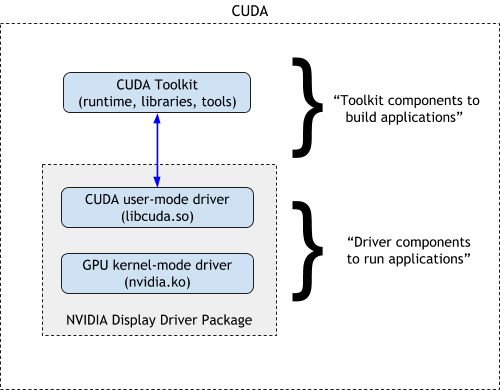
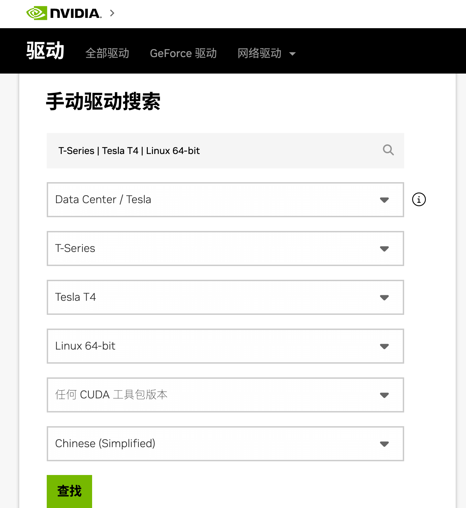
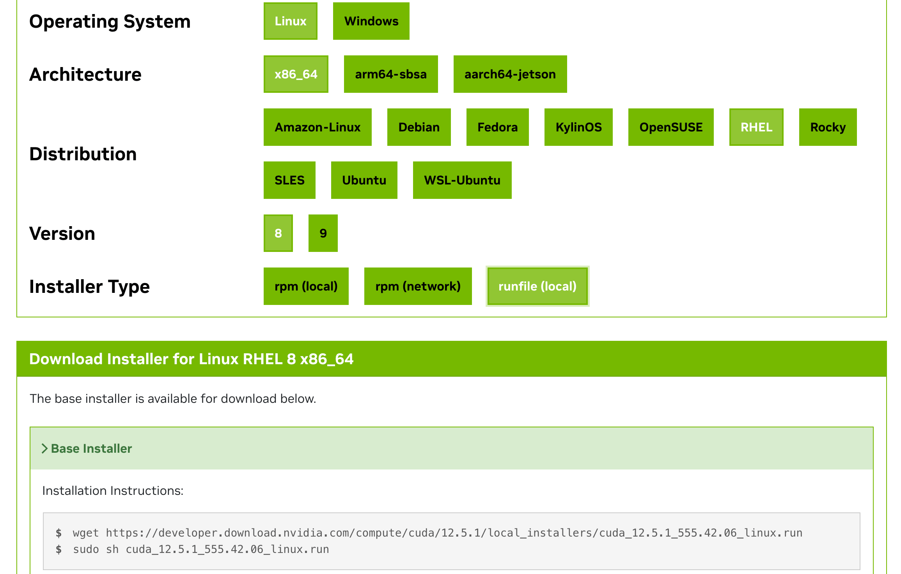
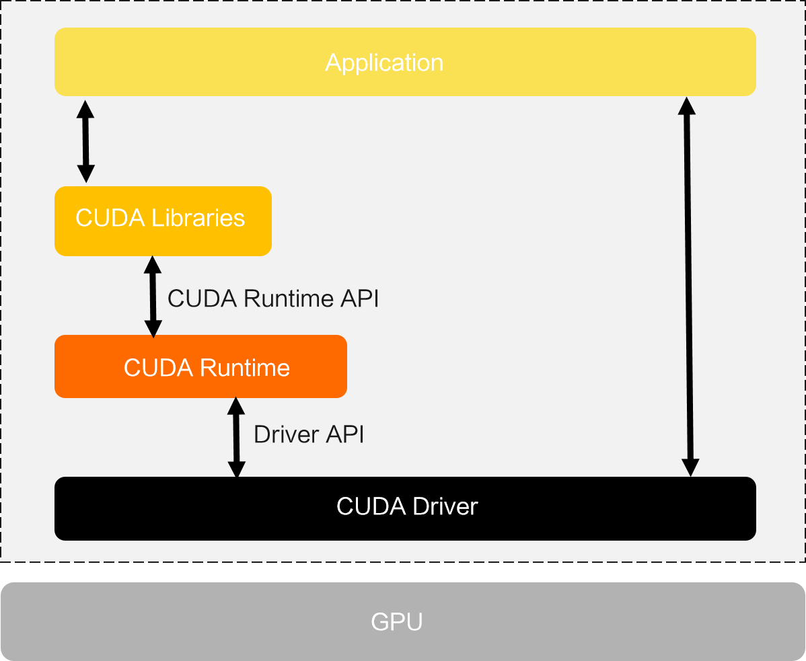
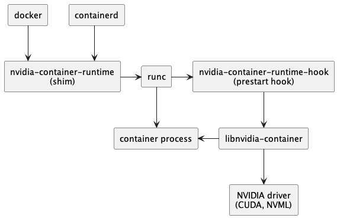
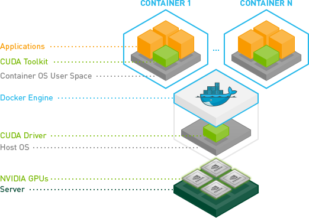
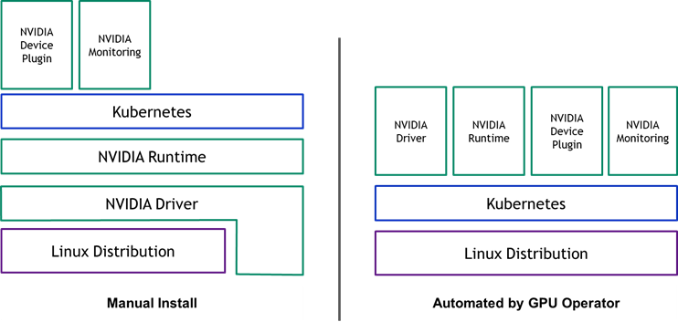

> 本来打算编写一篇从`0`到`1`搭建`GPU`环境的教程，但是发现网上已经有很多优秀的教程了，本文参考的原文链接：https://www.lixueduan.com/posts/ai/01-how-to-use-gpu/

## 1. 概述

仅以比较常见的`NVIDIA GPU`举例，系统为`Ubuntu`，对于其他厂家的`GPU`设备理论上流程都是一样的。

* * *

省流：

*   对于裸机环境，只需要安装对应的`GPU Driver`以及`CUDA Toolkit`。
    
*   对应`Docker`环境，需要额外安装`nvidia-container-toolkit`并配置`docker`使用`nvidia runtime`。
    
*   对应`K8S`环境，需要额外安装对应的`device-plugin`使得`kubelet`能够感知到节点上的`GPU`设备，以便`K8S`能够进行`GPU`管理。
    

注意：一般在`K8S`中使用都会直接使用`gpu-operator`方式进行安装，本文主要为了搞清各个组件的作用，因此进行手动安装。

## 2. 裸机环境

裸机中要使用上`GPU`需要安装以下组件：

*   `GPU Driver`
*   `CUDA Toolkit`

二者的关系如`NVIDIA`官网上的这个图所示：



`GPU Driver`包括了`GPU`驱动和`CUDA`驱动，`CUDA Toolkit`则包含了`CUDA Runtime`。

`GPU`作为一个`PCIE`设备，只要安装好之后，在系统中就可以通过`lspci`命令查看到，先确认机器上是否有`GPU`：

```bash
root@test:~# lspci | grep NVIDIA
3b:00.0 3D controller: NVIDIA Corporation TU104GL [Tesla T4] (rev a1)
86:00.0 3D controller: NVIDIA Corporation TU104GL [Tesla T4] (rev a1)
```

可以看到，该设备有两张`Tesla T4 GPU`。

### 安装驱动

> 注意：在`Ubuntu`系统下，可以使用`apt`源来安装驱动（具体参考：https://documentation.ubuntu.com/server/how-to/graphics/install-nvidia-drivers/#installing-the-drivers-on-servers-and-or-for-computing-purposes ），也可以手动下载`run`文件来安装。本文以手动下载`run`文件来安装为例。

首先到 [NVIDIA 驱动下载](https://www.nvidia.cn/Download/index.aspx?lang=cn#) 下载对应的显卡驱动：



最终下载得到的是一个`.run`文件，例如 `NVIDIA-Linux-x86_64-550.54.14.run`。

然后直接`sh`方式运行该文件即可

```bash
sh NVIDIA-Linux-x86_64-550.54.14.run
```

接下来会进入图形化界面，一路选择`yes/ok`就好。

运行以下命令检查是否安装成功：

```bash
nvidia-smi
```

如果出现显卡信息则是安装成功，就像这样：

```bash
root@test:~ nvidia-smi
Wed Jul 10 05:41:52 2024
+---------------------------------------------------------------------------------------+
| NVIDIA-SMI 535.161.08             Driver Version: 535.161.08   CUDA Version: 12.2     |
|-----------------------------------------+----------------------+----------------------+
| GPU  Name                 Persistence-M | Bus-Id        Disp.A | Volatile Uncorr. ECC |
| Fan  Temp   Perf          Pwr:Usage/Cap |         Memory-Usage | GPU-Util  Compute M. |
|                                         |                      |               MIG M. |
|=========================================+======================+======================|
|   0  Tesla T4                       On  | 00000000:3B:00.0 Off |                    0 |
| N/A   51C    P0              29W /  70W |  12233MiB / 15360MiB |      0%      Default |
|                                         |                      |                  N/A |
+-----------------------------------------+----------------------+----------------------+
|   1  Tesla T4                       On  | 00000000:86:00.0 Off |                    0 |
| N/A   49C    P0              30W /  70W |   6017MiB / 15360MiB |      0%      Default |
|                                         |                      |                  N/A |
+-----------------------------------------+----------------------+----------------------+
+---------------------------------------------------------------------------------------+
| Processes:                                                                            |
|  GPU   GI   CI        PID   Type   Process name                            GPU Memory |
|        ID   ID                                                             Usage      |
|=======================================================================================|
|   
+---------------------------------------------------------------------------------------+
```

至此，我们就安装好`GPU`驱动了，系统也能正常识别到`GPU`。

这里显示的`CUDA`版本表示当前驱动最大支持的`CUDA`版本。

### 安装 CUDA Toolkit

> 注意：在`Ubuntu`系统下，可以使用`apt`源来安装`CUDA Toolkit`（具体参考：https://documentation.ubuntu.com/server/how-to/graphics/install-nvidia-drivers/#installing-the-drivers-on-servers-and-or-for-computing-purposes ），也可以手动下载`run`文件来安装。本文以手动下载`run`文件来安装为例。

对于深度学习程序，一般都要依赖 `CUDA` 环境，因此需要在机器上安装 `CUDA Toolkit`。

也是到 [NVIDIA CUDA Toolkit 下载](https://developer.nvidia.com/cuda-toolkit-archive) 下载对应的安装包，选择操作系统和安装方式即可



和安装驱动类似，也是一个`.run`文件。

```bash
# 下载安装文件
wget https://developer.download.nvidia.com/compute/cuda/12.2.0/local_installers/cuda_12.2.0_535.54.03_linux.run

# 开始安装
sudo sh cuda_12.2.0_535.54.03_linux.run
```

> 注意：之前安装过驱动了，这里就不再安装驱动，仅安装`CUDA Toolkit`相关组件。

安装完成后输出如下：

```bash
root@iZbp15lv2der847tlwkkd3Z:~# sudo sh cuda_12.2.0_535.54.03_linux.run
===========
= Summary =
===========
Driver:   Installed
Toolkit:  Installed in /usr/local/cuda-12.2/
Please make sure that
 -   PATH includes /usr/local/cuda-12.2/bin -   LD_LIBRARY_PATH includes /usr/local/cuda-12.2/lib64, or, add /usr/local/cuda-12.2/lib64 to /etc/ld.so.conf and run ldconfig as root
To uninstall the CUDA Toolkit, run cuda-uninstaller in /usr/local/cuda-12.2/bin
To uninstall the NVIDIA Driver, run nvidia-uninstall
Logfile is /var/log/cuda-installer.log

```

根据提示配置下`PATH`：

```bash
# 添加 CUDA 12.2 到 PATH
export PATH=/usr/local/cuda-12.2/bin:$PATH
# 添加 CUDA 12.2 的 lib64 到 LD_LIBRARY_PATH
export LD_LIBRARY_PATH=/usr/local/cuda-12.2/lib64:$LD_LIBRARY_PATH
```

执行以下命令查看版本，确认安装成功：

```bash
root@iZbp15lv2der847tlwkkd3Z:~# nvcc -V
nvcc: NVIDIA (R) Cuda compiler driver
Copyright (c) 2005-2023 NVIDIA Corporation
Built on Tue_Jun_13_19:16:58_PDT_2023
Cuda compilation tools, release 12.2, V12.2.91
Build cuda_12.2.r12.2/compiler.32965470_0
```

### 测试

我们使用一个简单的`Pytorch`程序来检测`GPU`和`CUDA`是否正常。

整个调用链大概是这样的：



使用下面代码来测试能够正常使用， `check_cuda_pytorch.py`内容如下：

```python
import torch

def check_cuda_with_pytorch():
    """检查 PyTorch CUDA 环境是否正常工作"""
    try:
        print("检查 PyTorch CUDA 环境:")
        if torch.cuda.is_available():
            print(f"CUDA 设备可用，当前 CUDA 版本是: {torch.version.cuda}")
            print(f"PyTorch 版本是: {torch.__version__}")
            print(f"检测到 {torch.cuda.device_count()} 个 CUDA 设备。")
            for i in range(torch.cuda.device_count()):
                print(f"设备 {i}: {torch.cuda.get_device_name(i)}")
                print(f"设备 {i} 的显存总量: {torch.cuda.get_device_properties(i).total_memory / (1024 ** 3):.2f} GB")
                print(f"设备 {i} 的显存当前使用量: {torch.cuda.memory_allocated(i) / (1024 ** 3):.2f} GB")
                print(f"设备 {i} 的显存最大使用量: {torch.cuda.memory_reserved(i) / (1024 ** 3):.2f} GB")
        else:
            print("CUDA 设备不可用。")
    except Exception as e:
        print(f"检查 PyTorch CUDA 环境时出现错误: {e}")

if __name__ == "__main__":
    check_cuda_with_pytorch()
```

先安装下`torch`：

```bash
pip install torch
```

运行一下：

```bash
python3 check_cuda_pytorch.py
```

正常输出应该是这样的：

```text
检查 PyTorch CUDA 环境:
CUDA 设备可用，当前 CUDA 版本是: 12.1
PyTorch 版本是: 2.3.0+cu121
检测到 1 个 CUDA 设备。
设备 0: Tesla T4
设备 0 的显存总量: 14.75 GB
设备 0 的显存当前使用量: 0.00 GB
设备 0 的显存最大使用量: 0.00 GB
```

## 3. Docker 环境

上一步中我们已经在裸机上安装了`GPU Driver`、`CUDA Toolkit` 等工具，实现了在宿主机上使用`GPU`。

现在希望在`Docker`容器中使用`GPU`，需要怎么处理呢?

为了让`Docker`容器中也能使用`GPU`，大致步骤如下：

*   1）安装 `nvidia-container-toolkit` 组件
*   2）`docker` 配置使用 `nvidia-runtime`
*   3）启动容器时增加 `--gpu` 参数

### 安装 nvidia-container-toolkit

**NVIDIA Container Toolkit 的主要作用是将 NVIDIA** **GPU** **设备挂载到容器中。**

> 兼容生态系统中的任意容器运行时，`docker`、`containerd`、`cri-o` 等。

NVIDIA 官方安装文档：[nvidia-container-toolkit-install-guide](https://docs.nvidia.com/datacenter/cloud-native/container-toolkit/latest/install-guide.html)

对于`Ubuntu`系统，安装命令如下：

```bash
# 1. Configure the production repository
curl -fsSL https://nvidia.github.io/libnvidia-container/gpgkey | sudo gpg --dearmor -o /usr/share/keyrings/nvidia-container-toolkit-keyring.gpg \
  && curl -s -L https://nvidia.github.io/libnvidia-container/stable/deb/nvidia-container-toolkit.list | \
    sed 's#deb https://#deb [signed-by=/usr/share/keyrings/nvidia-container-toolkit-keyring.gpg] https://#g' | \
    sudo tee /etc/apt/sources.list.d/nvidia-container-toolkit.list

# Optionally, configure the repository to use experimental packages 
sed -i -e '/experimental/ s/^#//g' /etc/apt/sources.list.d/nvidia-container-toolkit.list

# 2. Update the packages list from the repository
sudo apt-get update

# 3. Install the NVIDIA Container Toolkit packages
sudo apt-get install -y nvidia-container-toolkit
```

### 配置使用该 runtime

支持`Docker`、`Containerd`、`CRI-O`、`Podman`等`CRI`。

> 具体见官方文档 [container-toolkit#install-guide](https://docs.nvidia.com/datacenter/cloud-native/container-toolkit/latest/install-guide.html#configuration)

这里以`Docker`为例进行配置：

旧版本需要手动在 `/etc/docker/daemon.json` 中增加配置，指定使用`nvidia`的 `runtime`。

```json
"runtimes": {
    "nvidia": {
        "args": [],
        "path": "nvidia-container-runtime"
    }
}
```

新版`toolkit`带了一个`nvidia-ctk`工具，执行以下命令即可一键配置：

```bash
sudo nvidia-ctk runtime configure --runtime=docker
```

然后重启`Docker`即可

```bash
sudo systemctl restart docker
```

### 测试

安装`nvidia-container-toolkit` 后，整个调用链如下：



调用链从`containerd –> runC`变成`containerd –> nvidia-container-runtime –> runC`。

然后`nvidia-container-runtime` 在中间拦截了容器`spec`，就可以把`GPU`相关配置添加进去，再传给`runC`的`spec`里面就包含`GPU`信息了。

`Docker`环境中的`CUDA`调用大概是这样的：



从图中可以看到，`CUDA Toolkit`跑到容器里了，因此宿主机上不需要再安装`CUDA Toolkit`。

> 使用一个带`CUDA Toolkit`的镜像即可。

最后我们启动一个`Docker`容器进行测试，其中命令中增加 `--gpu` 参数来指定要分配给容器的 `GPU`。

`--gpu` 参数可选值：

* `--gpus all`：表示将所有 GPU 都分配给该容器
* `--gpus "device=<id>[,<id>...]"`：对于多`GPU`场景，可以通过`id`指定分配给容器的`GPU`，例如`–gpu "device=0"` 表示只分配`0`号`GPU`给该容器
* `GPU`编号则是通过`nvidia-smi` 命令进行查看

这里我们直接使用一个带`cuda`的镜像来测试，启动该容器并执行`nvidia-smi` 命令

```bash
docker run --rm --gpus all nvidia/cuda:12.0.1-runtime-ubuntu22.04 nvidia-smi
```

正常情况下应该是可以打印出容器中的`GPU`信息的。

## 4. K8S 环境

更进一步，在`K8S`环境中使用`GPU`，则需要在集群中部署以下组件：

* `gpu-device-plugin` 用于管理`GPU`，`device-plugin` 以`DaemonSet`方式运行到集群各个节点，以感知节点上的`GPU`设备，从而让`K8S`能够对节点上的`GPU`设备进行管理。
* `gpu-exporter`：用于监控`GPU`。

各组件关系如下图所示：



*   左图为手动安装的场景，只需要在集群中安装`device-plugin`和监控即可使用。
    
*   右图为使用`gpu-operotar`安装场景，本篇暂时忽略
    

大致工作流程如下：

*   每个节点的`kubelet`组件维护该节点的`GPU`设备状态（哪些已用，哪些未用）并定时报告给调度器，调度器知道每一个节点有多少张`GPU`卡可用。
*   调度器为`pod`选择节点时，从符合条件的节点中选择一个节点。
*   当`pod`调度到节点上后，`kubelet`组件为`pod`分配`GPU`设备 ID，并将这些 ID 作为参数传递给`NVIDIA Device Plugin`。
*   `NVIDIA Device Plugin` 将分配给该`pod`的容器的`GPU`设备 ID 写入到容器的环境变量`NVIDIA_VISIBLE_DEVICES`中，然后将信息返回给`kubelet`。
*   `kubelet` 启动容器。
*   `NVIDIA Container Toolkit` 检测容器的`spec`中存在环境变量`NVIDIA_VISIBLE_DEVICES`，然后根据环境变量的值将`GPU`设备挂载到容器中。

在 Docker 环境我们在启动容器时通过 `--gpu` 参数手动指定分配给容器的 GPU，K8S 环境则由 device-plugin 自行管理。

### 安装 device-plugin

`device-plugin`一般由对应的`GPU`厂家提供，比如`NVIDIA`的 [K8S-device-plugin](https://github.com/NVIDIA/K8S-device-plugin)

安装其实很简单，将对应的`yaml` `apply`到集群即可。

```bash
kubectl create -f https://raw.githubusercontent.com/NVIDIA/K8S-device-plugin/v0.15.0/deployments/static/nvidia-device-plugin.yml
```

就像这样

```bash
root@test:~# kgo get po -l app=nvidia-device-plugin-daemonset
NAME                                   READY   STATUS    RESTARTS   AGE
nvidia-device-plugin-daemonset-7nkjw   1/1     Running   0          10m
```

`device-plugin`启动之后，会感知节点上的`GPU`设备并上报给`kubelet`，最终由`kubelet`提交到`kube-apiserver`。

因此我们可以在`Node`的可分配资源中看到`GPU`，就像这样：

```bash
root@test:~# k describe node test|grep Capacity -A7
Capacity:
  cpu:                48  ephemeral-storage:  460364840Ki  hugepages-1Gi:      0  hugepages-2Mi:      0  memory:             98260824Ki  nvidia.com/gpu:     2  pods:               110

```

可以看到，除了常见的`cpu`、`memory`之外，还有`nvidia.com/gpu`, 这个就是`GPU`资源，数量为`2`说明我们有两张`GPU`。

### 安装 GPU 监控

除此之外，如果你需要监控集群`GPU`资源使用情况，你可能还需要安装 [DCCM exporter](https://github.com/NVIDIA/dcgm-exporter) 结合`Prometheus`输出`GPU`资源监控信息。

```bash
helm repo add gpu-helm-charts https://nvidia.github.io/dcgm-exporter/helm-charts
helm repo update
helm install --generate-name gpu-helm-charts/dcgm-exporter
```

查看`metrics`：

```bash
curl -sL http://127.0.0.1:8080/metrics
# HELP DCGM_FI_DEV_SM_CLOCK SM clock frequency (in MHz).# TYPE DCGM_FI_DEV_SM_CLOCK gauge# HELP DCGM_FI_DEV_MEM_CLOCK Memory clock frequency (in MHz).# TYPE DCGM_FI_DEV_MEM_CLOCK gauge# HELP DCGM_FI_DEV_MEMORY_TEMP Memory temperature (in C).# TYPE DCGM_FI_DEV_MEMORY_TEMP gauge
...
DCGM_FI_DEV_SM_CLOCK{gpu="0", UUID="GPU-604ac76c-d9cf-fef3-62e9-d92044ab6e52",container="",namespace="",pod=""} 139
DCGM_FI_DEV_MEM_CLOCK{gpu="0", UUID="GPU-604ac76c-d9cf-fef3-62e9-d92044ab6e52",container="",namespace="",pod=""} 405
DCGM_FI_DEV_MEMORY_TEMP{gpu="0", UUID="GPU-604ac76c-d9cf-fef3-62e9-d92044ab6e52",container="",namespace="",pod=""} 9223372036854775794
...
```

### 测试

在`K8S`创建`Pod`要使用`GPU`资源很简单，和`cpu`、`memory`等常规资源一样，在`resource`中申请即可。

比如，下面这个`yaml`里面我们就通过`resource.limits`申请了该`Pod`要使用`1`个`GPU`。

```yaml
apiVersion: v1
kind: Pod
metadata:
  name: gpu-pod
spec:
  restartPolicy: Never
  containers:
    - name: cuda-container
      image: nvcr.io/nvidia/k8s/cuda-sample:vectoradd-cuda10.2
      resources:
        limits:
          nvidia.com/gpu: 1 # requesting 1 GPU
```

这样`kueb-scheduler`在调度该`Pod`时就会考虑到这个情况，将其调度到有`GPU`资源的节点。

启动后，查看日志，正常应该会打印 测试通过的信息。

```yaml
apiVersion: v1
kind: Pod
metadata:
  name: gpu-pod
spec:
  restartPolicy: Never
  containers:
    - name: cuda-container
      image: nvcr.io/nvidia/k8s/cuda-sample:vectoradd-cuda10.2
      resources:
        limits:
          nvidia.com/gpu: 1 # requesting 1 GPU
```

至此，在`K8S`环境中也可以使用`GPU`了。

## 5. 小结

本文主要分享了在裸机、`Docker`环境、`K8S`环境中如何使用`GPU`。

*   对于裸机环境，只需要安装对应的`GPU Driver`即可。
    
*   对应`Docker`环境，需要额外安装 `nvidia-container-toolkit` 并配置`docker`使用`nvidia runtime`。
    
*   对应`K8S`环境，需要额外安装对应的 `device-plugin` 使得`kubelet`能够感知到节点上的`GPU`设备，以便`K8S`能够进行`GPU`管理。
    

现在一般都是在`K8S`环境中使用，为了简化安装步骤，`NVIDIA`也提供了 `gpu-operator`来简化安装部署，这里的安装步骤仅供参考学习。
