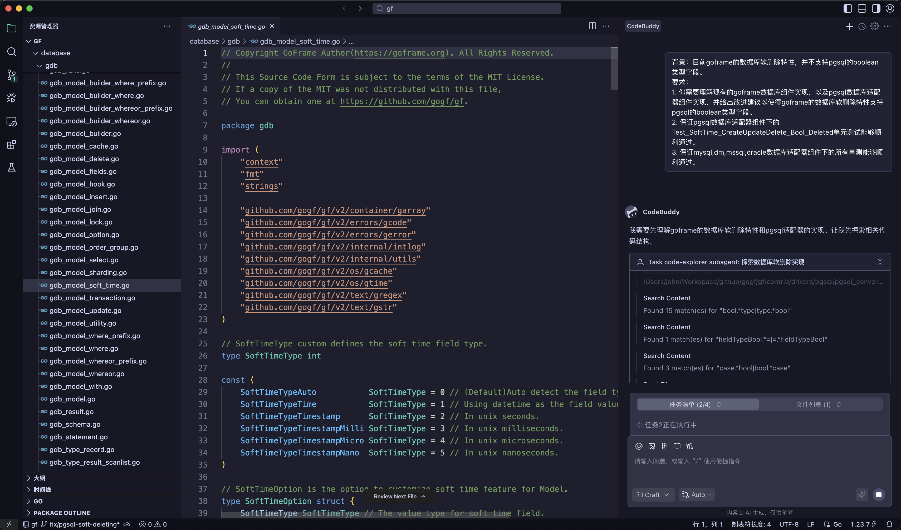

## 前言

2025年是`AI`代码开发工具大爆发的一年，各大厂商纷纷推出自己的`AI`编程助手，`AI`开发工具也越来越普及。作为开发者，面对琳琅满目的选择，如何找到最适合自己的工具成为一个重要问题。

笔者一直以来使用过多款`AI`开发工具，包括`Cursor`、`Windsurf`、`Copilot`、`Trae`等，基于这些实际使用经验，笔者梳理了这篇文章，希望能帮助大家做工具选型，提高开发效率。

## 1. Cursor

### 基本介绍

`Cursor`是由`Anysphere`公司开发的`AI`原生代码编辑器，基于`VS Code`深度定制。它将`AI`能力深度集成到编辑器的每个环节，提供代码补全、智能重构、多文件编辑、`Agent`模式等功能。`Cursor`的核心理念是让`AI`成为开发者的"结对编程伙伴"，通过深度理解项目上下文，提供精准的代码建议和自动化能力。

2024年底`Cursor`推出了`2.0`版本，引入了全新的`Composer`界面和`Agent`模式，支持后台自动执行任务，大幅提升了自动化编程能力。

### 优点

- **深度IDE集成**：基于`VS Code`，保留了熟悉的开发体验，同时深度集成`AI`能力
- **强大的上下文理解**：支持索引整个代码库，`AI`能够理解项目结构和依赖关系
- **多文件编辑能力**：`Composer`功能支持跨多个文件进行智能编辑和重构
- **Agent模式**：支持后台自动执行复杂任务，如代码审查、Bug修复等
- **丰富的模型选择**：支持`OpenAI`、`Claude`、`Gemini`等多种主流模型
- **Tab补全体验优秀**：代码补全响应快速，建议质量高

### 缺点

- **价格较高**：`Pro`版本$20/月，`Pro+`版本$60/月，`Ultra`版本$200/月
- **资源消耗较大**：相比普通`VS Code`，内存占用更高
- **学习曲线**：充分发挥其能力需要一定的学习成本
- **偶尔的稳定性问题**：在大型项目中可能出现卡顿
- **Claude模型计费不透明**：2025年6月`Cursor`调整了`Pro`计划的计费方式，从原来的`500`次快速响应改为`$20`额度按`API`费率计费。由于`Anthropic`的`Claude`模型（尤其是`Claude Opus 4`）单次请求成本较高，许多用户反映使用几次`Claude`模型后额度就快速耗尽，甚至有用户在不知情的情况下被额外扣费。这一变化引发了大量用户投诉，`Cursor`官方后来道歉并承诺退款，但计费透明度问题仍被开发者诟病（笔者也是因此弃坑😤）

### 特色功能

- **MCP协议支持**：支持`Model Context Protocol`，可连接外部工具和数据源，如数据库、API、文档等，扩展`Agent`能力边界
- **Rules自定义规则**：支持项目级和全局级的自定义规则（`.cursor/rules`），让`AI`按照你的编码规范和偏好工作
- **Slash Commands**：支持自定义斜杠命令，将常用提示词封装为可复用的命令
- **Background Agents**：支持后台`Agent`在远程机器上并行工作，可同时处理多个任务分支
- **Browser Control**：内置浏览器控制能力，`Agent`可以截图、捕获控制台日志、网络请求等
- **Hooks扩展**：支持在`Agent`生命周期的关键节点运行自定义脚本，如自动格式化、安全检查等
- **Composer模型**：自研的`Composer`编码模型，专为代码生成优化，速度比同级模型快4倍

### 使用价格

| 套餐 | 价格 | 主要限制 |
|------|------|----------|
| Hobby（免费） | $0 | 有限的`Agent`请求和`Tab`补全次数 |
| Pro | $20/月 | 扩展的`Agent`限制，无限`Tab`补全 |
| Pro+ | $60/月 | 3倍模型使用量 |
| Ultra | $200/月 | 20倍模型使用量，优先访问新功能 |

### 国内支付说明

`Cursor`支持使用支付宝付费订阅，也支持使用`Visa`/`MasterCard`的信用卡订阅，通常国内信用卡也可以直接绑定订阅使用。

### 支持的模型

- 主流模型，包括`OpenAI`系列、`Anthropic`系列、`Google`系列等
- 支持自定义`API`接入

### 维护厂商

**Anysphere** - 美国AI创业公司，专注于AI编程工具开发

### 官网地址

https://cursor.com

## 2. Windsurf

### 基本介绍

`Windsurf`（原`Codeium`）是由`Codeium`公司开发的`AI`原生`IDE`，定位为"`Agentic IDE`"。它强调深度的上下文感知能力，能够在生产级代码库中提供精准的建议。`Windsurf`的核心特色是`Cascade`功能，这是一个能够理解整个项目上下文、自动规划和执行多步骤任务的`AI Agent`。

`Windsurf`的`Tab`补全功能被认为是业界领先的，能够预测开发者的下一步操作并提供智能建议。作者对该功能也是大赞👍，虽然有时会使用其他编辑器，但时不时会切回到`Windsurf`用它的自动补全功能😅。但有时也会因为补全提示太快，干扰我写内容，真是甜蜜的烦恼😅。

### 优点

- **免费版本慷慨**：提供永久免费的个人版本，功能相对完整
- **Cascade Agent强大**：深度上下文感知，支持复杂的多步骤任务
- **Tab补全体验极佳**：响应速度快，预测准确度高
- **轻量级**：相比`Cursor`资源占用更少
- **支持多种IDE插件**：除了独立`IDE`，还提供`VS Code`、`JetBrains`等插件

### 缺点

- **生态相对较新**：社区和插件生态不如`Cursor`成熟
- **高级功能需付费**：部分高级`Agent`功能需要`Pro`版本
- **文档相对较少**：学习资源不如竞品丰富
- **企业功能有限**：大型团队协作功能还在完善中

### 特色功能

- **MCP协议支持**：内置多个预配置的`MCP Server`，支持自定义配置，可连接`Figma`、数据库、`API`等外部工具
- **Memories记忆系统**：`Cascade`可以自动生成和管理跨对话的上下文记忆，无需重复说明项目背景
- **Rules规则系统**：支持全局和项目级的自定义规则，规范`AI`行为和输出风格
- **Workflows工作流**：支持定义可复用的工作流（`Markdown`格式），通过斜杠命令快速执行重复性任务
- **Cascade Hooks**：支持在`Cascade`执行的关键节点插入自定义脚本，如代码格式化、安全检查等
- **SWE-1.5模型**：自研的`SWE-1.5`代码搜索模型，专为代码理解和搜索优化
- **Turbo Mode**：自动执行模式，减少确认步骤，提升开发效率
- **实时协作预览**：内置预览功能，点击元素即可让`Cascade`修改

### 使用价格

| 套餐 | 价格 | 主要限制 |
|------|------|----------|
| Free | $0 | 基础功能，有限的`Cascade`使用次数 |
| Pro | $15/月 | 扩展的`Cascade`额度，更多模型选择 |
| Teams | $30/用户/月 | 团队管理功能 |
| Enterprise | 定制 | 私有部署，高级安全功能 |

### 国内支付说明

`Windsurf`支持使用`Visa`/`MasterCard`的信用卡订阅，通常国内信用卡也可以直接绑定订阅使用。

### 支持的模型

- 主流模型，包括`OpenAI`系列、`Anthropic`系列、`Google`系列等
- 支持自定义`API`接入

### 维护厂商

**Codeium** - 美国AI编程工具公司，由前Google工程师创立

### 官网地址

https://windsurf.com

## 3. GitHub Copilot

### 基本介绍

`GitHub Copilot`是由`GitHub`（微软旗下）与`OpenAI`合作开发的`AI`编程助手，是目前市场占有率最高的`AI`代码工具。它以插件形式集成到`VS Code`、`JetBrains`、`Neovim`等主流IDE中，提供代码补全、聊天对话、代码审查等功能。

2025年，`Copilot`推出了`Coding Agent`功能，可以自动创建`Pull Request`、修复`Issue`，进一步提升了自动化能力。同时还推出了`Pro+`版本，提供更多高级模型的访问权限。

### 优点

- **广泛的IDE支持**：支持`VS Code`、`JetBrains`全家桶、`Neovim`、`Xcode`等几乎所有主流IDE
- **与GitHub深度集成**：可以直接在GitHub上使用，支持Issue修复、PR审查等
- **稳定可靠**：微软背书，服务稳定性有保障
- **丰富的模型选择**：支持`GPT-5`、`Claude Sonnet 4.5`、`Gemini`等最新模型
- **学生和开源维护者免费**：对学生、教师和热门开源项目维护者免费（笔者长期维护知名的`GoFrame`开源项目，使用至今从未需要付费😜，笔者直夸良心工具）
- **Coding Agent**：可以自动处理`Issue`并创建`PR`

### 缺点

- **需要订阅**：没有真正的免费版本（仅有限制较多的Free版）
- **上下文理解有限**：相比`Cursor`，对大型项目的理解能力稍弱
- **插件形式限制**：作为插件，集成深度不如原生`AI IDE`
- **Premium请求限制**：高级模型使用有额度限制

### 特色功能

- **MCP协议支持**：2025年全面支持`MCP`，可连接外部工具和服务，原有的`GitHub App`扩展方式将于2025年11月废弃
- **Agent Mode**：自主编程模式，可以分析代码库、提出编辑方案、执行终端命令，并自动迭代修复错误
- **Coding Agent**：可以自动处理`GitHub Issue`并创建`Pull Request`，实现端到端的自动化开发
- **多IDE支持**：支持`VS Code`、`JetBrains`全家桶、`Eclipse`、`Xcode`、`Neovim`等几乎所有主流`IDE`
- **GitHub深度集成**：与`GitHub`平台无缝集成，支持代码审查、`Issue`管理、`PR`创建等
- **Next Edit Suggestions**：下一步编辑建议，预测开发者的下一步操作
- **Custom Instructions**：支持自定义指令，定义代码风格、测试框架等偏好

### 使用价格

| 套餐 | 价格 | 主要限制 |
|------|------|----------|
| Free | $0 | 50次Agent/Chat请求/月，2000次补全/月 |
| Pro | $10/月 | 无限GPT-5 mini交互，300次Premium请求 |
| Pro+ | $39/月 | 5倍Premium请求，访问所有模型 |
| Business | $19/用户/月 | 企业管理功能 |
| Enterprise | $39/用户/月 | 代码库索引，高级安全功能 |

### 国内支付说明

`GitHub Copilot`可以使用支持`Visa`/`MasterCard`的信用卡订阅。学生、教师和热门开源项目维护者可申请免费使用😬。

### 支持的模型

- 主流模型，包括`OpenAI`系列、`Anthropic`系列、`Google`系列等
- 支持自定义`API`接入

### 维护厂商

**GitHub**（微软旗下） - 全球最大的代码托管平台

### 官网地址

https://github.com/features/copilot

## 4. Trae

### 基本介绍

`Trae`是由字节跳动（`ByteDance`）开发的`AI`原生`IDE`，于2025年1月正式发布。它基于`VS Code`架构，将编辑器、终端、预览浏览器和`AI Agent`整合到一个环境中。`Trae`强调"上下文工程"（`Context Engineering`），让`AI Agent`能够深度理解整个项目，规划和执行多步骤任务。

`Trae`的一大特色是`SOLO`模式，这是一个高度自动化的工作流，AI可以自主规划、创建和完成功能开发，开发者只需要审核结果。

### 优点

- **价格优惠**：`Pro`版本每月$10（首月仅$3），年付每月$7.5，价格仅为`Cursor`的一半
- **强大的Agent能力**：`SOLO`模式支持端到端的自动化开发
- **深度上下文理解**：支持项目级别的代码理解和规划
- **VS Code兼容**：支持`VS Code`插件和扩展
- **集成预览功能**：内置浏览器预览，适合前端开发
- **中文支持友好**：对中文开发者体验较好

### 缺点

- **数据隐私顾虑**：作为字节跳动产品，部分用户对数据安全有顾虑
- **Linux支持不完善**：目前仅支持`macOS`和`Windows`
- **相对较新**：产品成熟度不如`Cursor`和`Copilot`
- **遥测数据收集**：有第三方分析指出其数据收集较为广泛
- **不再支持Claude模型**：2025年11月，由于`Anthropic`对中资公司的限制令，`Trae`宣布不再提供`Claude`模型的访问权限，这对习惯使用`Claude`进行代码开发的用户是一大损失

### 特色功能

- **MCP协议支持**：全面支持`MCP`协议，可连接`Figma`、数据库、`Blender`等外部工具，甚至支持音乐创作
- **自定义智能体**：支持创建自定义智能体，配置专属的提示词、工具和`MCP Server`，打造个人"AI研发伙伴"
- **SOLO模式**：高度自动化的工作流，`AI`可自主规划、创建和完成功能开发，开发者只需审核结果
- **Builder智能体**：内置通用智能体`@Builder`，通过简单指令实现"需求即代码"
- **Trae Rules**：支持自定义`AI`工作规则，让`AI`按照个性化需求执行任务
- **丰富的上下文理解**：支持联网搜索、文档解析、`Figma`链接、代码仓库信息理解等多种上下文输入
- **自动运行模式**：支持开启"自动运行"功能，最大限度实现任务自动化
- **Chat与Builder融合**：打破传统以代码为中心的`IDE`模式，走向"对话即编程"

### 使用价格

| 套餐 | 价格 | 主要限制 |
|------|------|----------|
| Free | $0 | 基础功能，有限的模型访问次数 |
| Pro | $10/月（首月$3） | 每月`600`次快速请求，无限自动补全和慢速请求 |
| 年付 | $7.5/月 | 与`Pro`相同权益，价格更优惠 |

### 国内支付说明

`Trae`海外版支持支付宝充值，国内用户支付较为便捷。国内版目前仍提供免费使用。

### 支持的模型

- `OpenAI`系列：`GPT-4o`、`GPT-5`等
- `Google`系列：`Gemini 2.5 Pro`等
- `DeepSeek`系列：`DeepSeek V3`等
- `Kimi`系列：`Kimi K2`等
- 支持自定义`API`接入

> ⚠️ **注意**：2025年11月起，`Trae`已不再提供`Anthropic Claude`系列模型的访问权限，这是由于`Anthropic`对中资控股公司的限制政策所致。

### 维护厂商

**ByteDance**（字节跳动） - 通过新加坡子公司`SPRING(SG)PTE.LTD`发布

### 官网地址

https://www.trae.ai

## 5. CodeBuddy

### 基本介绍

`CodeBuddy`是腾讯云推出的`AI`代码编辑器，基于腾讯元宝代码大模型（`Tencent Yuanbao Code Large Model`）打造。它提供代码补全、错误诊断、技术问答、性能优化等功能，官方宣称可提升编码效率`90%`，降低代码错误率`35%`。

`CodeBuddy`深度集成了微信小程序开发工具，对于微信生态的开发者来说具有独特优势。它还支持`Craft`模式和`MCP`协议，提供更智能的开发体验。

### 优点

- **微信小程序深度集成**：对微信生态开发者非常友好
- **中文优化**：针对中文开发者优化，理解中文需求更准确
- **腾讯云生态**：与腾讯云服务无缝集成
- **企业级支持**：适合企业级应用开发
- **本土化服务**：国内访问速度快，服务稳定

### 缺点

- **生态相对封闭**：主要面向腾讯生态
- **国际化程度低**：主要服务国内用户
- **需要邀请码**：目前采用邀请制
- **功能相对基础**：`Agent`能力不如`Cursor`等成熟
- **社区较小**：用户社区和学习资源较少

### 特色功能

- **MCP协议支持**：全面兼容`MCP`开放生态，可通过`MCP`市场一键安装插件（如`TAPD`），在`IDE`内直接创建项目需求工单
- **Craft智能体**：全新开发智能体，支持通过自然语言生成完整代码仓库
- **微信生态知识库**：内置微信小程序开发知识库，对微信生态开发者特别友好
- **双模型驱动**：基于腾讯混元大模型 + `DeepSeek V3`双轮模型架构
- **自定义智能体与指令**：支持团队知识库管理、自定义智能体与指令管理
- **多Agent能力**：提供代码补全、单元测试、代码诊断、智能评审等多`Agent`能力
- **企业账号集成**：支持企业账号集成，适合团队协作
- **CNB MCP Server**：支持腾讯云原生构建服务的`MCP Server`，实现"需求-编码-部署"自动化链路

### 使用价格

| 套餐 | 价格 | 主要限制 |
|------|------|----------|
| 基础版 | 免费 | 基础代码补全和问答 |
| 专业版 | 待定 | 高级功能和更多额度 |

*注：目前处于邀请测试阶段*

### 国内支付说明

`CodeBuddy`作为腾讯云产品，支持支付宝、微信等国内主流支付方式，对国内用户非常友好。

### 支持的模型

- 腾讯元宝代码大模型（腾讯混元）
- `GPT-5`
- `DeepSeek V3`
- 其他模型支持待扩展

### 维护厂商

**腾讯云** - 中国领先的云计算服务提供商

### 官网地址

https://www.codebuddy.ai

## 6. Claude Code

### 基本介绍

`Claude Code`是`Anthropic`公司推出的`AI`编程工具，与其他工具不同，它是一个基于终端的命令行工具，让开发者可以直接在终端中与`Claude`进行交互，委托复杂的工程任务。

`Claude Code`的设计理念是让开发者能够将大型工程任务直接委托给`AI`，包括代码重构、Bug修复、功能开发等。它可以访问`shell`环境、读写文件、执行命令，实现真正的自主编程。2025年11月，`Anthropic`还推出了`Claude Code on the web`，支持在浏览器中分配多个编程任务。

### 优点

- **强大的自主能力**：可以独立完成复杂的工程任务
- **终端原生**：对于习惯命令行的开发者非常友好
- **深度系统集成**：可以访问文件系统、执行命令、使用`git`等
- **Claude模型优势**：使用`Anthropic`最强的`Claude`模型
- **后台任务支持**：可以在后台运行长时间任务
- **GitHub集成**：支持通过`gh CLI`与`GitHub`交互

### 缺点

- **学习曲线陡峭**：需要熟悉命令行操作
- **没有图形界面**：不适合习惯`GUI`的开发者
- **价格较高**：使用`Claude API`按量计费，成本可能较高
- **需要API访问**：需要`Anthropic API`账户
- **安全风险**：给予AI较大的系统权限需要谨慎
- **中国大陆无法使用**：`Anthropic`于2025年9月更新服务条款，明确禁止中国大陆用户及中国控股公司使用其服务，包括`Claude Code`

### 特色功能

- **MCP协议原生支持**：作为`MCP`协议的发明者，`Claude Code`原生支持`MCP`，可连接各种外部工具和数据源
- **Plugins插件系统**：支持自定义插件，包括斜杠命令、`Agents`、`MCP Servers`和`Hooks`，一键安装分享配置
- **自定义Agents**：支持创建自定义`Agent`，定义专属的工具集和行为模式
- **Slash Commands**：支持自定义斜杠命令，封装常用操作为可复用命令
- **Hooks扩展**：支持在执行生命周期的关键节点运行自定义脚本
- **Claude Code on the web**：支持在浏览器中分配多个编程任务，无需本地安装
- **深度系统集成**：可访问文件系统、执行`shell`命令、使用`git`等，实现真正的自主编程
- **后台任务**：支持在后台运行长时间任务，不阻塞其他工作
- **Claude Agent SDK**：提供`Agent SDK`，支持开发者构建自定义`Agent`应用

### 使用价格

`Claude Code`通过`Anthropic API`计费，使用`Claude Pro/Team/Enterprise`订阅或`API`按量付费：

| 计费方式 | 价格 | 说明 |
|----------|------|------|
| Claude Pro | $20/月 | 包含一定的使用额度 |
| Claude Team | $30/用户/月 | 团队协作功能 |
| API按量付费 | 按token计费 | 根据使用的模型和token数量 |

### 国内支付说明

⚠️ **中国大陆用户无法使用**。`Anthropic`于2025年9月更新服务条款，明确禁止中国大陆用户及中国控股公司（持股超过50%）使用其所有服务，包括`Claude Code`、`Claude API`和`Claude Web`。这是出于法律、监管和安全风险的考虑。

### 支持的模型

- `Claude`全系列

### 维护厂商

**Anthropic** - 美国`AI`安全公司，由前`OpenAI`成员创立

### 官网地址

https://www.anthropic.com/claude-code

## 工具选型建议

### 工具对比

| 工具 | 厂商 | 免费版 | 付费起价 | MCP支持 | 自定义Agent | 核心优势 |
|------|------|--------|----------|---------|-------------|----------|
| `Cursor` | `Anysphere` | ✅ 有限 | $20/月 | ✅ | ✅ `Rules/Hooks` | 深度`IDE`集成，`Agent`强大 |
| `Windsurf` | `Codeium` | ✅ 慷慨 | $15/月 | ✅ | ✅ `Workflows/Memories` | `Tab`补全优秀，性价比高 |
| `Copilot` | `GitHub/微软` | ✅ 有限 | $10/月 | ✅ | ✅ `Custom Instructions` | 生态最广，稳定可靠 |
| `Trae` | `字节跳动` | ✅ 国内免费 | $10/月 | ✅ | ✅ 自定义智能体 | 价格优惠，`SOLO`模式 |
| `CodeBuddy` | `腾讯云` | ✅ 邀请制 | 待定 | ✅ | ✅ `Craft`智能体 | 微信生态，中文优化 |
| `Claude Code` | `Anthropic` | ❌ | $20/月起 | ✅ | ✅ `Plugins/Agents` | 终端原生，自主能力强 |

### 如果你是...

**初学者/学生**
- 推荐：`Trae`（完全免费）或 `Copilot Free`
- 理由：零成本入门，功能足够学习使用

**个人开发者/独立开发者**
- 推荐：`Windsurf` 或 `Cursor`
- 理由：性价比高，功能全面，适合日常开发

**企业团队**
- 推荐：`GitHub Copilot Business/Enterprise` 或 `Cursor Teams`
- 理由：稳定可靠，企业级支持，安全合规

**微信生态开发者**
- 推荐：`CodeBuddy`
- 理由：深度集成微信小程序开发，中文支持好

**命令行爱好者/高级开发者**
- 推荐：`Claude Code`
- 理由：终端原生，自主能力强，适合复杂任务

**注重隐私的开发者**
- 推荐：`Cursor`（支持本地模型）或 `Copilot`（微软背书）
- 理由：隐私控制选项较多，企业信誉有保障

## 不得不提的JetBrains

说到代码开发工具，不得不提`JetBrains`。作为`IDE`领域的老牌厂商，`JetBrains`的开发工具（`IntelliJ IDEA`、`PyCharm`、`WebStorm`等）一直做得非常出色，而且对开源社区贡献颇多，深受开发者喜爱。

`JetBrains`很早就开始布局`AI`编程助手，推出了`JetBrains AI Assistant`，集成到其全系列`IDE`中。2025年还推出了免费版本，支持本地模型和云端模型，提供代码补全、聊天、多文件编辑等功能。

然而，从目前的市场反馈来看，`JetBrains AI Assistant`并没有做出特别的亮点。与`Cursor`、`Copilot`等竞品相比，它的`AI`能力显得中规中矩：
- 代码补全质量不如`Cursor`和`Windsurf`
- `Agent`能力相对较弱
- 多文件编辑体验不够流畅
- 社区反馈普遍认为"够用但不惊艳"

用一句俗话来说：**赶了个早集，却没赶上好价钱**。

`JetBrains`的优势在于其`IDE`本身的强大功能和成熟生态，但在AI能力的竞争中，它似乎还没有找到自己的差异化定位。对于`JetBrains IDE`的忠实用户来说，`AI Assistant`是一个不错的补充，但如果你追求最强的AI编程体验，可能还是需要考虑`Cursor`或`Copilot`。

## 结语

`AI`代码开发工具正在快速演进，每个工具都有其独特的定位和优势。选择工具时，建议考虑以下因素：

1. **预算**：免费版是否满足需求，付费版性价比如何
2. **使用场景**：个人项目还是团队协作，开源还是商业项目
3. **技术栈**：工具对你使用的语言和框架支持如何
4. **隐私要求**：对代码隐私的要求程度
5. **学习成本**：是否愿意投入时间学习新工具

最后，建议大家多尝试几款工具，找到最适合自己工作流的那一个。毕竟，最好的工具是能让你效率最高的工具。

