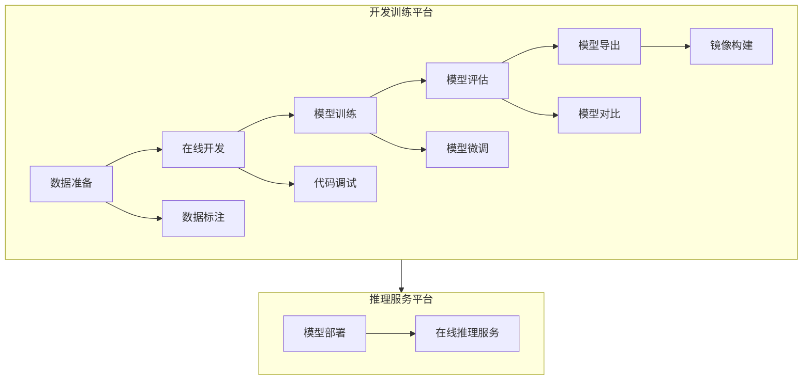
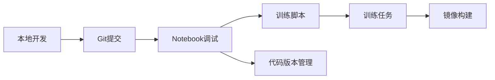
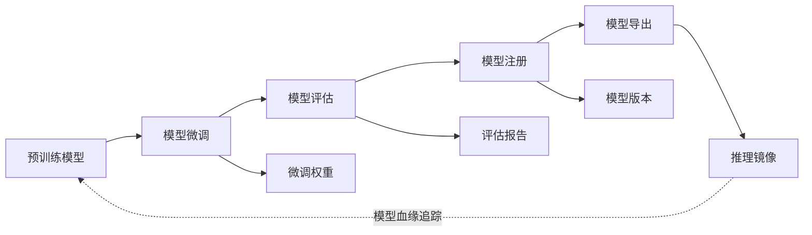
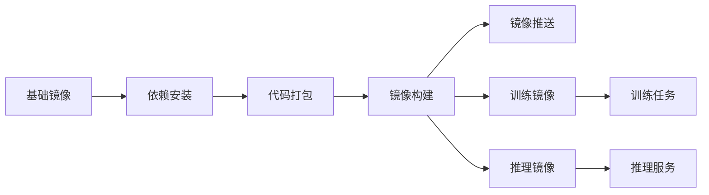
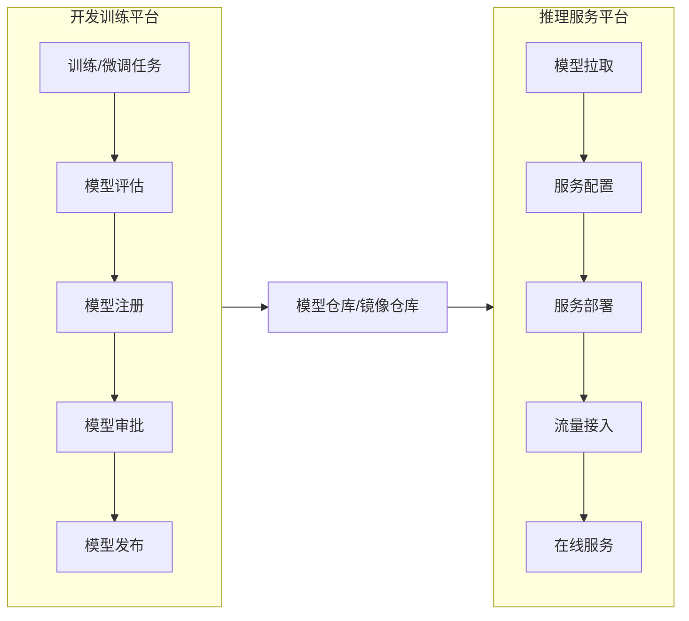

## 1. 平台定位与职责

模型开发训练平台是面向AI大模型全生命周期的开发、训练、微调的统一管理平台。平台提供从数据准备到模型产出的端到端能力，与下游推理服务平台形成完整的`MLOps`闭环。

**核心职责：**
- 提供AI模型开发、训练、微调的全流程支撑能力
- 管理和调度异构算力资源（`GPU/NPU`等）
- 实现数据、代码、模型等资产的统一管理
- 支持多租户资源隔离与配额管理
- 输出标准化模型产物供推理服务使用

## 2. 核心功能特性

### 2.1 数据管理

#### 2.1.1 数据集管理
| 功能项 | 功能描述 |
|--------|----------|
| 数据集创建 | 支持从本地上传、对象存储导入、数据库导入等多种方式创建数据集 |
| 数据集版本管理 | 对数据集进行版本控制，支持版本回溯和对比 |
| 数据集预览 | 支持文本、图片、音频、视频等多模态数据的在线预览 |
| 数据集分割 | 支持按比例自动分割训练集、验证集、测试集 |
| 数据集共享 | 支持跨项目、跨租户的数据集共享与权限控制 |

#### 2.1.2 数据标注
| 功能项 | 功能描述 |
|--------|----------|
| 标注任务管理 | 创建、分配、跟踪标注任务，支持多人协作标注 |
| 多模态标注工具 | 提供文本分类、NER、图像分类、目标检测、语义分割等标注工具 |
| 智能预标注 | 利用已有模型进行预标注，提升标注效率 |
| 标注质检 | 支持抽样审核、交叉验证等质检机制，确保标注质量 |
| 标注数据导出 | 支持导出为`COCO`、`VOC`、`JSON`等主流格式 |

#### 2.1.3 数据处理
| 功能项 | 功能描述 |
|--------|----------|
| 数据清洗 | 去重、去噪、格式标准化等数据清洗能力 |
| 数据增强 | 支持图像旋转、裁剪、文本回译等数据增强策略 |
| 特征工程 | 提供特征提取、特征选择、特征转换等能力 |
| 数据血缘 | 追踪数据从原始到处理后的完整链路 |

### 2.2 在线开发（Notebook）

#### 2.2.1 开发环境管理
| 功能项 | 功能描述 |
|--------|----------|
| `Notebook`实例创建 | 支持创建`JupyterLab`、`VS Code Server`等在线开发环境 |
| 镜像管理 | 提供预置镜像（含主流深度学习框架），支持自定义镜像 |
| 资源规格选择 | 支持选择`CPU/GPU/NPU`等不同算力规格 |
| 环境持久化 | 开发环境数据持久化存储，支持停止后恢复 |
| `SSH`远程连接 | 支持通过`SSH`连接到`Notebook`实例进行开发 |

#### 2.2.2 开发辅助能力
| 功能项 | 功能描述 |
|--------|----------|
| 代码版本管理 | 集成`Git`，支持代码提交、分支管理、代码对比 |
| 数据集挂载 | 将数据集直接挂载到开发环境，方便数据访问 |
| 模型调试 | 支持在`Notebook`中进行模型调试和小规模验证 |
| 依赖管理 | 支持`pip/conda`等包管理工具，管理`Python`依赖 |
| 终端访问 | 提供`Web Terminal`，支持命令行操作 |

### 2.3 模型训练

#### 2.3.1 训练任务管理
| 功能项 | 功能描述 |
|--------|----------|
| 单机训练 | 支持单机单卡/多卡训练任务提交 |
| 分布式训练 | 支持多机多卡分布式训练，支持`PyTorch DDP`、`Horovod`、`DeepSpeed`等框架 |
| 训练任务模板 | 提供常用训练任务模板，降低使用门槛 |
| 任务生命周期管理 | 支持任务创建、启动、暂停、恢复、停止、删除等操作 |
| 任务队列管理 | 基于`Volcano`实现任务队列管理，支持优先级调度 |

#### 2.3.2 训练配置
| 功能项 | 功能描述 |
|--------|----------|
| 超参数配置 | 支持通过界面或配置文件设置训练超参数 |
| 资源配置 | 配置`CPU`、`内存`、`GPU/NPU`等计算资源 |
| 环境变量配置 | 支持设置训练任务所需的环境变量 |
| 挂载配置 | 配置数据集、代码、模型输出等存储挂载 |
| 网络配置 | 配置分布式训练的网络模式（如`RDMA/InfiniBand`） |

#### 2.3.3 训练监控
| 功能项 | 功能描述 |
|--------|----------|
| 训练日志 | 实时查看训练日志输出 |
| 训练指标可视化 | 集成`TensorBoard`，可视化`loss`、`accuracy`等训练指标 |
| 资源监控 | 监控`GPU`利用率、显存使用、网络带宽等资源指标 |
| 训练进度 | 展示训练进度、预估剩余时间 |
| 告警通知 | 训练异常、完成等事件的告警通知 |

#### 2.3.4 训练优化
| 功能项 | 功能描述 |
|--------|----------|
| 自动超参调优 | 支持`Grid Search`、`Random Search`、`Bayesian Optimization`等调参策略 |
| 早停机制 | 支持基于验证集指标的早停策略 |
| 断点续训 | 支持从`Checkpoint`恢复训练，避免资源浪费 |
| 弹性训练 | 支持训练过程中动态调整`Worker`数量 |

### 2.4 模型微调（Fine-tuning）

#### 2.4.1 预训练模型管理
| 功能项 | 功能描述 |
|--------|----------|
| 模型仓库 | 提供主流开源预训练模型（`LLaMA`、`Qwen`、`ChatGLM`等） |
| 模型导入 | 支持从`HuggingFace`、`ModelScope`等平台导入模型 |
| 模型版本管理 | 对预训练模型进行版本管理 |
| 模型元数据 | 记录模型架构、参数量、适用场景等元信息 |

#### 2.4.2 微调能力
| 功能项 | 功能描述 |
|--------|----------|
| 全参数微调 | 支持对模型全部参数进行微调 |
| 参数高效微调 | 支持`LoRA`、`QLoRA`、`P-Tuning`、`Prefix-Tuning`等PEFT方法 |
| 指令微调 | 支持基于指令数据集的`SFT`（`Supervised Fine-Tuning`） |
| `RLHF` | 支持基于人类反馈的强化学习微调 |
| 多任务微调 | 支持同时在多个任务上进行微调 |

#### 2.4.3 微调配置
| 功能项 | 功能描述 |
|--------|----------|
| 微调数据集配置 | 配置用于微调的数据集，支持多种数据格式 |
| `LoRA`参数配置 | 配置`LoRA`的`rank`、`alpha`、`target modules`等参数 |
| 量化配置 | 配置`INT8/INT4`量化参数，降低显存占用 |
| 学习率策略 | 配置学习率调度策略（`Cosine`、`Linear`等） |

### 2.5 模型管理

#### 2.5.1 模型注册
| 功能项 | 功能描述 |
|--------|----------|
| 模型注册 | 将训练/微调产出的模型注册到模型仓库 |
| 模型版本管理 | 对模型进行版本控制，支持版本对比和回滚 |
| 模型元数据管理 | 记录模型的训练参数、数据集、指标等元信息 |
| 模型标签管理 | 支持为模型添加标签，便于检索和分类 |

#### 2.5.2 模型评估
| 功能项 | 功能描述 |
|--------|----------|
| 离线评估 | 在测试集上进行模型离线评估 |
| 评估指标 | 支持`Accuracy`、`F1`、`BLEU`、`ROUGE`等多种评估指标 |
| 模型对比 | 支持多个模型版本的指标对比 |
| 评估报告 | 生成详细的模型评估报告 |

#### 2.5.3 模型转换与优化
| 功能项 | 功能描述 |
|--------|----------|
| 格式转换 | 支持`PyTorch`、`TensorFlow`、`ONNX`等格式互转 |
| 模型量化 | 支持`INT8/INT4/FP16`等量化，减小模型体积 |
| 模型剪枝 | 支持结构化/非结构化剪枝，压缩模型 |
| 推理优化 | 支持`TensorRT`、`vLLM`等推理优化 |

#### 2.5.4 模型导出
| 功能项 | 功能描述 |
|--------|----------|
| 模型文件导出 | 导出模型权重文件（`.pt`、`.safetensors`等） |
| 推理镜像构建 | 基于模型自动构建推理服务镜像 |
| 模型卡片生成 | 生成标准化的`Model Card`，描述模型信息 |

### 2.6 镜像管理

#### 2.6.1 镜像仓库
| 功能项 | 功能描述 |
|--------|----------|
| 公共镜像 | 提供预置的训练/推理基础镜像 |
| 私有镜像 | 支持用户上传和管理私有镜像 |
| 镜像版本管理 | 对镜像进行版本管理和标签管理 |
| 镜像扫描 | 对镜像进行安全漏洞扫描 |

#### 2.6.2 镜像构建
| 功能项 | 功能描述 |
|--------|----------|
| `Dockerfile`构建 | 支持基于`Dockerfile`构建镜像 |
| 在线构建 | 提供`Web`界面进行镜像在线构建 |
| 构建缓存 | 支持构建缓存，加速镜像构建 |
| 自动构建 | 支持代码提交触发自动镜像构建 |

### 2.7 资源管理

#### 2.7.1 算力资源管理
| 功能项 | 功能描述 |
|--------|----------|
| 资源池管理 | 管理`GPU/NPU`等异构算力资源池 |
| 资源配额 | 基于租户/项目设置资源配额 |
| 资源监控 | 实时监控资源使用情况和利用率 |
| 资源调度 | 基于`Volcano`实现高级调度策略（`Gang`调度、优先级抢占等） |

#### 2.7.2 存储资源管理
| 功能项 | 功能描述 |
|--------|----------|
| 存储卷管理 | 管理`PV/PVC`，支持多种存储后端 |
| 共享存储 | 提供`NFS/CephFS`等共享存储，支持多任务共享数据 |
| 对象存储集成 | 集成`S3/MinIO`等对象存储，存储大规模数据集 |
| 存储配额 | 设置租户/项目的存储配额 |

### 2.8 实验管理

#### 2.8.1 实验跟踪
| 功能项 | 功能描述 |
|--------|----------|
| 实验记录 | 自动记录每次训练的参数、指标、产出 |
| 实验对比 | 支持多个实验的参数和指标对比 |
| 实验复现 | 基于实验记录一键复现训练 |
| 实验分组 | 支持对实验进行分组管理 |

#### 2.8.2 流水线（Pipeline）
| 功能项 | 功能描述 |
|--------|----------|
| 流水线编排 | 支持可视化编排数据处理→训练→评估→部署流水线 |
| 流水线模板 | 提供常用流水线模板 |
| 定时触发 | 支持定时触发流水线执行 |
| 流水线监控 | 监控流水线执行状态和各阶段耗时 |

### 2.9 多租户与权限

| 功能项 | 功能描述 |
|--------|----------|
| 租户管理 | 支持多租户隔离，每个租户独立的资源空间 |
| 项目管理 | 租户下支持多项目管理 |
| 用户管理 | 用户账号管理，支持`LDAP/OAuth`集成 |
| 角色权限 | 基于`RBAC`的细粒度权限控制 |
| 操作审计 | 记录用户操作日志，支持审计追溯 |

## 3. 平台工作流与物料流转

### 3.1 整体工作流

### 3.2 输入物料

| 物料类型 | 物料描述 | 来源 | 存储方式 |
|----------|----------|------|----------|
| **原始数据** | 未经处理的原始数据（文本、图片、音视频等） | 业务系统、公开数据集、爬虫采集 | 对象存储（`S3/MinIO`） |
| **标注数据** | 经过人工或自动标注的数据集 | 数据标注模块产出 | 对象存储 + 元数据库 |
| **训练数据集** | 格式化后用于训练的数据集 | 数据处理模块产出 | 共享存储（`NFS/CephFS`） |
| **训练代码** | 模型训练脚本和配置文件 | 开发人员编写、Git仓库 | Git仓库 + 共享存储 |
| **预训练模型** | 开源或自研的预训练模型权重 | `HuggingFace`、`ModelScope`、自研 | 模型仓库（共享存储） |
| **基础镜像** | 包含深度学习框架的容器镜像 | 镜像仓库 | `Harbor/Docker Registry` |
| **配置文件** | 训练超参数、环境配置等 | 开发人员编写 | `Git`仓库 + `ConfigMap` |

### 3.3 输出物料

| 物料类型 | 物料描述 | 产出环节 | 存储方式 | 下游使用 |
|----------|----------|----------|----------|----------|
| **模型权重文件** | 训练/微调后的模型参数文件（`.pt`、`.safetensors`、`.bin`等） | 模型训练/微调 | 模型仓库（共享存储） | 推理服务加载 |
| **LoRA权重** | 参数高效微调产出的增量权重 | 模型微调 | 模型仓库 | 与基座模型合并后推理 |
| **模型配置** | 模型架构配置文件（`config.json`等） | 模型训练/微调 | 模型仓库 | 推理服务加载 |
| **Tokenizer文件** | 分词器配置和词表文件 | 模型训练/微调 | 模型仓库 | 推理服务加载 |
| **训练镜像** | 包含训练代码和依赖的容器镜像 | 镜像构建 | 镜像仓库 | 训练任务使用 |
| **推理镜像** | 包含模型和推理框架的容器镜像 | 镜像构建 | 镜像仓库 | 推理服务部署 |
| **训练日志** | 训练过程的日志和指标数据 | 模型训练 | 日志系统 | 问题排查、实验分析 |
| **评估报告** | 模型评估指标和分析报告 | 模型评估 | 元数据库 | 模型选型决策 |
| **Model Card** | 模型说明文档 | 模型导出 | 模型仓库 | 模型使用说明 |

### 3.4 物料流转详细流程

#### 3.4.1 数据流转

**详细说明：**
1. **原始数据导入**：从业务系统或公开数据源导入原始数据到对象存储
2. **数据清洗**：去重、去噪、格式标准化，产出清洗后数据
3. **数据标注**：人工或智能预标注，产出标注数据
4. **数据增强**：根据需要进行数据增强，扩充数据集
5. **数据集发布**：将处理后的数据发布为可用数据集，记录版本

#### 3.4.2 代码流转

**详细说明：**
1. **本地开发**：开发人员在本地编写训练代码
2. **Git提交**：代码提交到`Git`仓库进行版本管理
3. **Notebook调试**：在`Notebook`环境中进行代码调试和小规模验证
4. **训练脚本**：调试完成后，整理为可提交的训练脚本
5. **训练任务**：将代码打包或挂载到训练任务中执行

#### 3.4.3 模型流转

**详细说明：**
1. **预训练模型**：从模型仓库获取预训练模型
2. **模型微调**：使用业务数据进行微调，产出微调权重
3. **模型评估**：在测试集上评估模型效果，产出评估报告
4. **模型注册**：将合格模型注册到模型仓库，记录版本
5. **模型导出**：导出模型文件或构建推理镜像

#### 3.4.4 镜像流转

**详细说明：**
1. **基础镜像**：选择包含深度学习框架的基础镜像
2. **依赖安装**：安装训练/推理所需的`Python`包和系统依赖
3. **代码打包**：将训练代码或推理代码打包到镜像
4. **镜像构建**：构建`Docker`镜像
5. **镜像推送**：推送到镜像仓库供后续使用

### 3.5 与推理服务平台的对接

#### 3.5.1 对接方式

| 对接方式 | 描述 | 适用场景 |
|----------|------|----------|
| **模型文件对接** | 将模型权重文件存储到共享存储，推理服务直接加载 | 模型更新频繁、需要热更新 |
| **推理镜像对接** | 将模型打包到镜像中，推理服务部署镜像 | 模型稳定、需要版本化部署 |
| **模型仓库对接** | 通过统一的模型仓库`API`进行模型交付 | 需要模型元数据和版本管理 |

#### 3.5.2 对接流程

#### 3.5.3 交付物清单

| 交付物 | 格式 | 用途 |
|--------|------|------|
| 模型权重 | `.pt / .safetensors / .bin` | 推理服务加载模型参数 |
| 模型配置 | `config.json` | 推理服务构建模型架构 |
| `Tokenizer` | `tokenizer.json / vocab.txt` | 推理服务进行文本预处理 |
| 推理镜像 | `Docker Image` | 推理服务容器化部署 |
| `Model Card` | `README.md` | 模型使用说明和限制 |
| 推理配置 | `inference_config.yaml` | 推理服务参数配置 |

