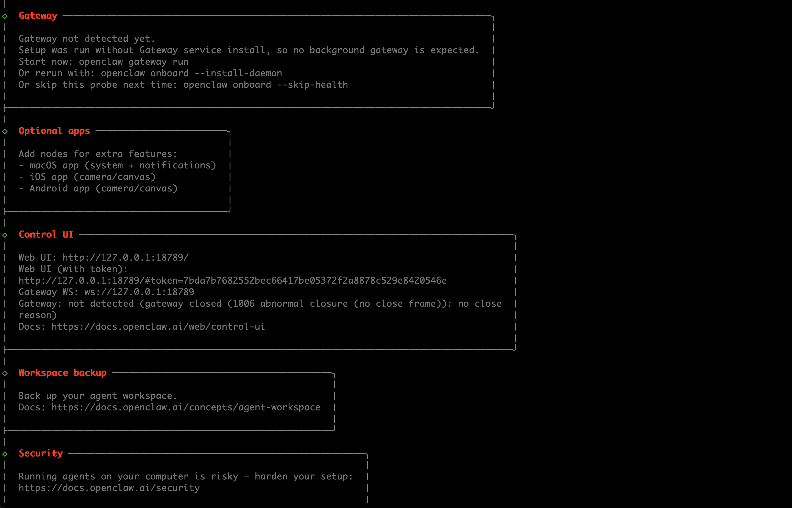
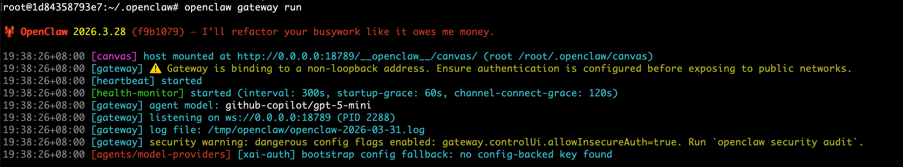
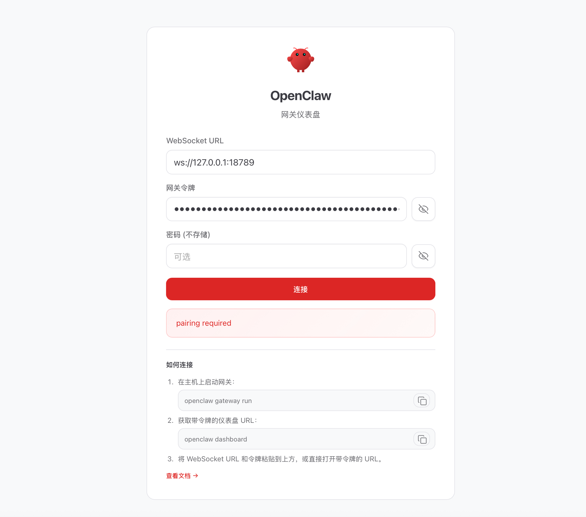
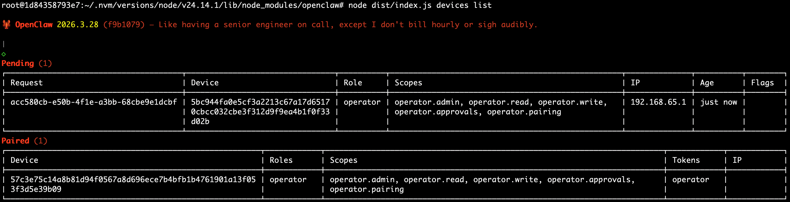
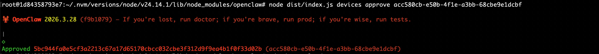
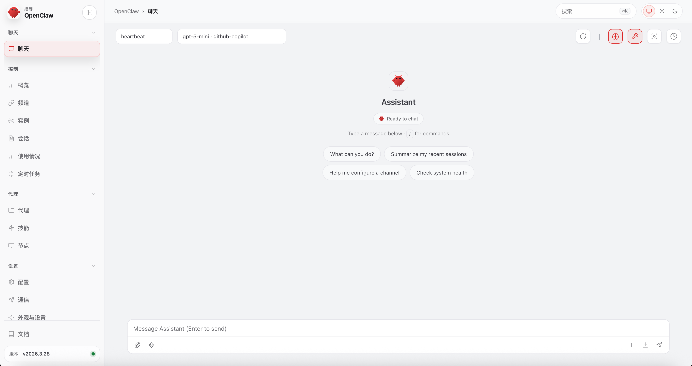
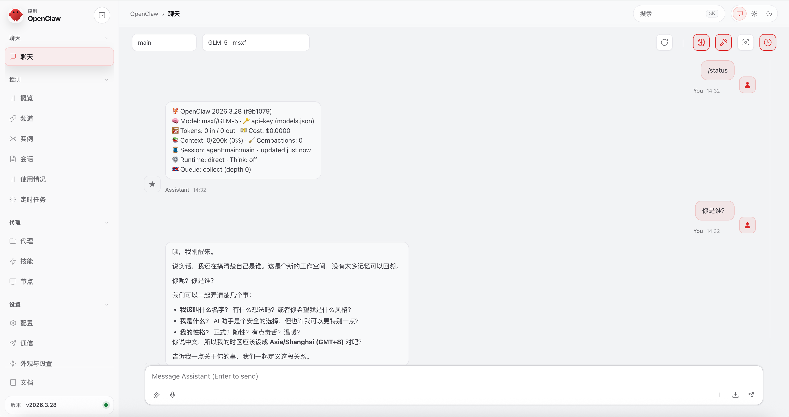

## 准备Ubuntu镜像


使用`docker volume`实现对关键数据的持久化，特别是平时`OpenClaw`会用到的一些工具：
```bash
docker volume create ubuntu-etc
docker volume create ubuntu-home
docker volume create ubuntu-opt
docker volume create ubuntu-root
docker volume create ubuntu-usr
docker volume create ubuntu-var
```

> 如果需要删除持久卷则使用以下指令：
> ```bash
> docker volume rm ubuntu-data ubuntu-etc ubuntu-home ubuntu-opt ubuntu-root ubuntu-usr ubuntu-var
> ```

使用以下指令将关键的内容拷贝到空的持久卷中，便于后续使用持久卷保存指定目录的文件内容：
```bash
docker run --name ubuntu-init \
  --rm -it \
  -v ubuntu-etc:/tmp/etc \
  -v ubuntu-home:/tmp/home \
  -v ubuntu-opt:/tmp/opt \
  -v ubuntu-root:/tmp/root \
  -v ubuntu-usr:/tmp/usr \
  -v ubuntu-var:/tmp/var \
  ubuntu:24.04 \
  bash -c "cp -r /etc/* /tmp/etc/ && \
           cp -r /home/* /tmp/home/ && \
           cp -r /root/* /tmp/root/ && \
           cp -r /usr/* /tmp/usr/ && \
           cp -r /var/* /tmp/var/"
```

## 安装OpenClaw


使用以下指令启动`Ubuntu`容器，可以看到关键的目录已经使用持久卷挂载了，每次进入都不会丢失数据：
```bash
docker run --name ubuntu-server \
  --rm -it \
  -p 18789:18789 \
  -v ubuntu-etc:/etc \
  -v ubuntu-home:/home \
  -v ubuntu-opt:/opt \
  -v ubuntu-root:/root \
  -v ubuntu-usr:/usr \
  -v ubuntu-var:/var \
  ubuntu:24.04 \
  bash
```

参考官方文档一步一步安装即可，由于这里使用到的`Ubuntu`镜像是一个精简镜像，中间会涉及安装一些依赖：https://docs.openclaw.ai/install

如果遇到安装太慢甚至超时，那么可以切换`npm`源为国内源，如下：
```bash
# 切换到阿里源
npm config set registry https://registry.npmmirror.com

# 查看是否成功
npm config get registry

# 切回官方
npm config set registry https://registry.npmjs.org
```

### OpenClaw配置初始化

安装指令执行后除了安装各种依赖和`openclaw`工具，还会自动执行`openclaw onboard`指令进行配置的初始化。

安装完成后会生成一系列配置文件在`/root/.openclaw/`目录下。



其中终端提示的`Control UI`的地址如`http://127.0.0.1:18789/#token=7bda7b7682552bec66417be05372f2a8878c529e8420546e`是后面登录管理后台的地址，其中的`token`是随机生成的。咱们先保存这个地址。

### 修改配置openclaw.json配置

其中的`openclaw.json`文件是`OpenClaw`的关键配置文件，配置文件中的`gateway`配置项默认只会监听本地`127.0.0.1`地址，导致宿主机访问不了`OpenClaw`，因此需要修改如下：
```json title="/root/.openclaw/openclaw.json"
  "gateway": {
    "port": 18789,
    "mode": "local",
    "bind": "lan", // 这里从loopback修改为lan，表示监听所有地址
    "controlUi": {
      "allowInsecureAuth": true
    },
    // ...
  },
```

### 启动OpenClaw gateway


通过`openclaw gateway run`指令启动`OpenClaw`的`gateway`服务。




## 访问OpenClaw


宿主机浏览器打开前面保存的管理页面的地址`http://127.0.0.1:18789/#token=7bda7b7682552bec66417be05372f2a8878c529e8420546e`，大概是这样：



会报错`pairing required`，这是因为我们是使用的容器启动的`OpenClaw`，不是本机直接使用`OpenClaw`。我们需要让`OpenClaw`允许当前宿主机浏览器打开管理后台页面。

我们执行以下命令进入到容器：
```bash
docker exec -it ubuntu-server bash
```


查询当前`Pending`的秘钥配对请求：
```bash
cd /root/.nvm/versions/node/v24.14.1/lib/node_modules/openclaw/
node dist/index.js devices list
```

> 如果不知道`openclaw`安装包的具体路径，可以使用该命令查找：`find / -name "index.js" | grep "dist/index.js"`

终端输出：


执行以下指令允许秘钥配对：
```bash
node dist/index.js devices approve acc580cb-e50b-4f1e-a3bb-68cbe9e1dcbf
```



随后再次返回宿主机浏览器时，可以看到`OpenClaw`的管理页面已经可以正常访问了：




## 常见配置

### 修改对接的模型配置

通常可以通过`openclaw config`指令或者直接修改`openclaw.json`配置文件实现。

我们这里直接修改`/root/.openclaw/openclaw.json`，增加或修改以下配置，我这里增加的是公司通过`NewAPI`自建的模型服务：

```json title="/root/.openclaw/openclaw.json"
  "models": {
    "mode": "merge",
    "providers": {
      "msxf": {
        "baseUrl": "https://coremind.msxf.com/v1",
        "apiKey": "sk-iIeHbU5aPVXA3qT8lJAcSgeVwP51WZVYGyHHkYApF7pcQvFQ",
        "api": "openai-completions",
        "models": [
              {"id":"Kimi-K2.5", "name": "Kimi-K2.5"},
              {"id":"GLM-5", "name": "GLM-5"},
              {"id":"MiniMax-M2.7", "name": "MiniMax-M2.7"}
        ]
      }
    }
  },
  "agents": {
    "defaults": {
      "model": {
        "primary": "msxf/MiniMax-M2.7"
      },
      "models": {
        "msxf/MiniMax-M2.7": {},
        "msxf/GLM-5": {},
        "msxf/Kimi-K2.5": {}
      },
      "workspace": "/root/.openclaw/workspace"
    }
  },
```

保存后，`OpenClaw`的`gateway`会自动重加载配置无须手动重启`gateway`（如果不放心也可以手动重启`openclaw gateway restart`）。随后在`OpenClaw`聊天页面通过`/status`命令检查是否生效：




## 常见问题

### control ui requires device identity (use HTTPS or localhost secure context)

`OpenClaw`的`Control UI`强制要求在安全上下文 (`Secure Context`) 下运行，以生成设备身份密钥。你通过`HTTP` + 局域网 IP（如 `http://192.168.x.x:18789`）访问时，浏览器因非安全上下文而拒绝运行 `WebCrypto`，导致无身份验证，网关拒绝连接。

建议通过配置`HTTPS`（自签证书 / 反向代理）：

**Step1：生成证书**
```bash
mkdir -p ~/.openclaw/ssl
openssl req -x509 -newkey rsa:4096 -keyout ~/.openclaw/ssl/key.pem -out ~/.openclaw/ssl/cert.pem -days 365 -nodes
```

**Step2：修改配置`~/.openclaw/config.json`**

```json
{
  "gateway": {
    "bind": "lan",
    "tls": {
      "enabled": true,
      "cert": "/home/你的用户名/.openclaw/ssl/cert.pem",
      "key": "/home/你的用户名/.openclaw/ssl/key.pem"
    },
    "controlUi": {
      "allowedOrigins": ["https://192.168.1.100:18789"]
    }
  }
}
```
访问`https://<局域网IP>:18789`（需信任证书）

如果页面报错`pairing required`，那么请参考前面介绍的处理方式。
