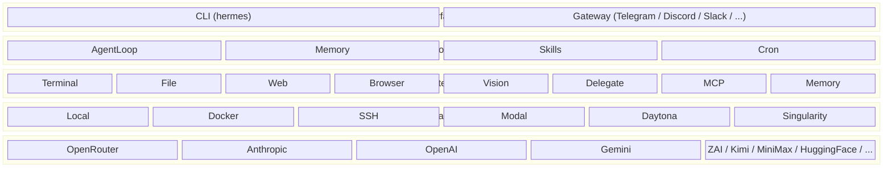
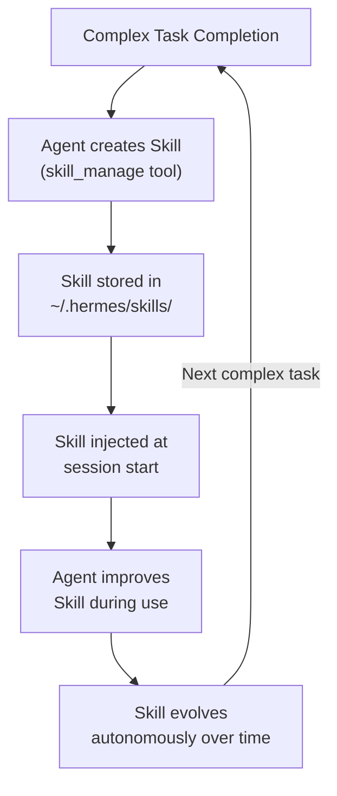
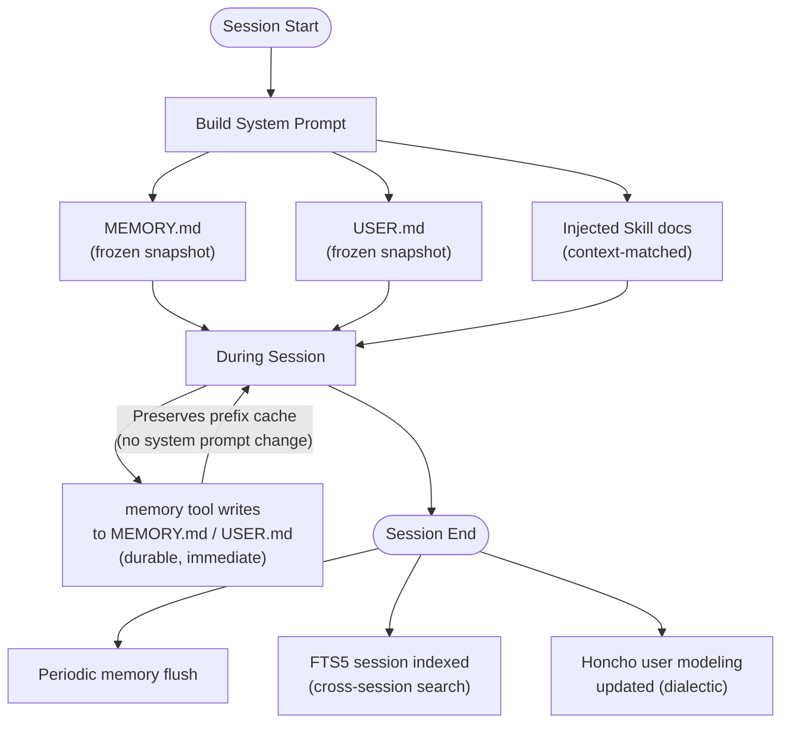

## 什么是 Hermes Agent

`Hermes Agent`是由 [Nous Research](https://nousresearch.com) 开发并开源的**自主 AI 智能体框架**，项目地址为 [https://github.com/NousResearch/hermes-agent](https://github.com/NousResearch/hermes-agent)。

`Hermes Agent`的核心定位是"**能够自我改进的`AI`智能体**"（`the self-improving AI agent`）。与大多数`AI`助手框架不同，它内置了完整的**学习闭环**——智能体会从与用户的每一次复杂交互中提炼经验并创建技能（`Skills`），在后续使用中不断改进这些技能，通过全文检索跨会话回想历史对话，并基于`Honcho`辩证性用户建模系统持续深化对用户的认知。

> 一句话总结：`Hermes Agent`不只是一个工具调用框架，而是一个**会成长、会记忆、会学习**的个人`AI`助理平台。

`Hermes Agent`与同类项目`OpenClaw`（基于`badlogic`的`Pi Agent`框架开发的编码智能体）面向相同的用户群体。为方便`OpenClaw`用户平滑过渡，`Hermes Agent`内置了完整的迁移工具链（`hermes claw migrate`），可自动导入`OpenClaw`的记忆、技能、`API Key`等配置。


## 解决的核心问题

当前`AI`智能体框架普遍存在以下痛点，`Hermes Agent`针对性地给出了解法：

| 痛点 | Hermes Agent 的解法 |
|---|---|
| **每次会话结束即遗忘，无跨会话记忆** | 三层记忆体系：持久化`MEMORY.md`、用户画像`USER.md`、`FTS5`全文检索历史会话 |
| **`Agent`只能使用固定能力，无法自我扩展** | 内置技能创建闭环，任务后自动提炼经验为可复用的`Skill` |
| **与单一模型/平台深度绑定** | 支持`OpenRouter`（`200+`模型）、`Anthropic`、`OpenAI`、`Gemini`、本地`LLM`等，`hermes model`一键切换 |
| **智能体只能在本地运行，无法远程使用** | `Gateway`支持`Telegram`、`Discord`、`Slack`、`WhatsApp`、`Signal`等平台，随时随地发消息使用 |
| **只支持本地执行，计算资源受限** | 六种终端后端：本地、`Docker`、`SSH`、`Daytona`、`Singularity`、`Modal`，支持云端`GPU`集群 |
| **重复性任务需手动触发** | 内置`Cron`定时调度，自然语言描述任务，结果自动推送到任意平台 |
| **长任务中上下文溢出导致崩溃** | 内置上下文感知压缩（`/compress`），自动检测并压缩历史消息 |
| **复杂任务无法并行处理** | `delegate_task`工具：生成隔离的子`Agent`并行执行多个工作流 |


## 架构设计

`Hermes Agent`采用**分层模块化架构**，各层职责清晰，可独立扩展。



### 整体架构

整个系统由以下核心模块构成：

```text
hermes-agent/
├── hermes_cli/          # CLI 入口层 — 命令注册、TUI 界面、配置管理
├── agent/               # 智能体核心 — AgentLoop、消息处理、流式输出
├── tools/               # 工具系统 — 40+ 工具实现
│   └── environments/    # 终端后端 — local/docker/ssh/modal/daytona
├── gateway/             # 消息网关 — 多平台集成
│   └── platforms/       # 平台适配器 — Telegram/Discord/Slack/...
├── cron/                # 定时调度系统
├── skills/              # 内置技能库
├── optional-skills/     # 可选技能库
├── acp_adapter/         # ACP 协议适配器 (VS Code/Zed/JetBrains)
├── hermes_constants.py  # 共享常量
└── toolsets.py          # 工具集定义
```


### 各组件介绍

#### hermes_cli — CLI 入口层

`hermes_cli/`是整个系统的命令行入口层，负责：

- **TUI 终端界面**（`curses_ui.py`）：全功能的终端用户界面，支持多行编辑、历史回滚、流式工具输出、斜杠命令自动补全
- **命令注册**（`main.py`、`commands.py`）：所有`hermes <subcommand>`命令的注册和分发
- **配置管理**（`config.py`）：读取和写入`~/.hermes/config.yaml`
- **模型切换**（`model_switch.py`、`providers.py`）：多`Provider`管理，`hermes model`交互式切换
- **技能管理**（`skills_hub.py`、`skills_config.py`）：技能市场（`Skills Hub`）的拉取、安装、更新
- **认证管理**（`auth.py`、`auth_commands.py`）：`Nous Portal OAuth`、`GitHub Copilot` 等认证流程
- **Setup 向导**（`setup.py`）：首次运行引导，自动检测并迁移`OpenClaw`配置
- **Doctor 诊断**（`doctor.py`）：一键诊断配置、`Provider` 连通性、依赖项问题

#### agent — 智能体核心

`agent/`模块实现了`Hermes Agent`的核心推理循环（`AgentLoop`）：

- 接收用户消息，构建系统提示词（注入记忆快照、用户画像、技能文档、上下文文件）
- 调用`LLM`获取推理结果（支持流式输出）
- 解析工具调用请求并执行（支持并行工具调用）
- 将工具结果反馈给`LLM`，驱动下一轮推理
- 处理用户中断（`Ctrl+C`或`Gateway`中的`/stop`）和会话重置

每个会话拥有独立的`task_id`，用于隔离终端进程、文件缓存等会话状态。

#### tools — 工具系统

工具系统是`Hermes Agent`能力的核心所在，内置**`40+`工具**，按功能分为多个工具集（`Toolset`）：

| 工具集 | 包含工具 | 说明 |
|---|---|---|
| `terminal` | `terminal`、`process` | 命令执行与进程管理 |
| `file` | `read_file`、`write_file`、`patch`、`search_files` | 文件读写与搜索 |
| `web` | `web_search`、`web_extract` | 网络搜索与内容提取 |
| `browser` | `browser_navigate`、`browser_click`等`10`个工具 | 浏览器自动化 |
| `vision` | `vision_analyze` | 图像分析 |
| `image_gen` | `image_generate` | 图像生成 |
| `skills` | `skills_list`、`skill_view`、`skill_manage` | 技能管理 |
| `memory` | `memory` | 持久化记忆读写 |
| `delegate` | `delegate_task` | 子`Agent`委托 |
| `code` | `execute_code` | 代码执行（跨后端支持） |
| `todo` | `todo` | 任务列表管理 |
| `mcp` | 任意`MCP`工具 | `MCP`协议扩展 |

工具系统支持**条件激活**：每个工具可提供`check_fn`检测依赖是否满足（如`send_message`仅在`Gateway`运行时激活，`ha_*`工具仅在`HASS_TOKEN`存在时激活）。

##### 终端后端（Execution Environments）

`tools/environments/`实现了六种终端执行后端，通过统一的`BaseEnvironment`接口抽象，上层工具代码无感知后端差异：

| 后端 | 特点 | 适用场景 |
|---|---|---|
| `local` | 直接在本机执行 | 开发调试、个人使用 |
| `docker` | 隔离的`Docker`容器 | 安全隔离、可复现环境 |
| `ssh` | 远程服务器 | 使用强力远程硬件 |
| `modal` | `Modal`云无服务器沙箱 | `GPU`集群、按需付费 |
| `daytona` | `Daytona`云开发环境 | 团队协作、持久工作区 |
| `singularity` | `Singularity`/`Apptainer`容器 | HPC 集群场景 |

#### gateway — 消息网关

`gateway/`实现了**多平台消息网关**，让用户可以从任意即时通讯平台与智能体交谈：

**支持的平台**：

| 平台 | 文件 | 特性亮点 |
|---|---|---|
| `Telegram` | `platforms/telegram.py` | 表情反应、群组话题绑定、审批按钮 |
| `Discord` | `platforms/discord.py` | 原生斜杠命令、线程管理、频道控制 |
| `Slack` | `platforms/slack.py` | 线程自动跟进、`mrkdwn`格式支持 |
| `WhatsApp` | `platforms/whatsapp.py` | 消息收发、媒体传输 |
| `Signal` | `platforms/signal.py` | 图片/语音/视频发送 |
| `Matrix` | `platforms/matrix.py` | E2EE 加密、房间管理、Synapse 兼容 |
| `Mattermost` | `platforms/mattermost.py` | 文件附件支持 |
| 飞书 | `platforms/feishu.py` | 卡片式审批按钮 |
| 企业微信 | `platforms/wecom.py` | 企业内部使用 |
| 钉钉 | `platforms/dingtalk.py` | 国内企业场景 |
| `Email` | `platforms/email.py` | 通过邮件交互 |
| `SMS` | `platforms/sms.py` | 短信交互 |
| `Home Assistant` | `platforms/homeassistant.py` | 智能家居集成 |
| `Webhook` | `platforms/webhook.py` | 自定义推送目标 |

**Gateway 核心机制**：

- **会话管理**（`session.py`）：每个用户/频道对应独立的会话状态
- **审批系统**（`hooks.py`）：危险命令发送到平台供用户`/approve`或`/deny`
- **流式消费**（`stream_consumer.py`）：将`Agent`的流式输出实时推送到对应平台
- **配对系统**（`pairing.py`）：通过`DM`配对实现安全的用户身份验证
- **镜像模式**（`mirror.py`）：将消息镜像到多个频道/平台

#### cron — 定时调度

`cron/`模块实现了自然语言驱动的定时任务系统：

- 通过`/cron`命令或`cronjob`工具创建定时任务，用自然语言描述执行内容
- 支持标准`Cron`表达式，也支持自然语言时间描述（由`LLM`转换）
- 任务执行结果自动推送到指定平台（`Telegram`、`Discord`等）
- 内置**基于活跃度的超时控制**：正在活跃执行的任务不会被强制终止
- 支持预执行脚本注入（用于数据采集和变更检测）

#### skills — 技能系统

技能（`Skill`）是`Hermes Agent`最核心的创新之一，对应**过程记忆**的概念——将完成某类任务的经验固化为可复用的指导文档。

技能是存储在`~/.hermes/skills/`下的`Markdown`文件，每个技能包含：

- 功能描述和触发条件
- 执行步骤和最佳实践
- 可选的配置要求（`skill_config_interface`）
- 可选的依赖工具列表

技能的生命周期：



`Hermes Agent`还提供了**技能市场（Skills Hub）**，对接 [agentskills.io](https://agentskills.io) 开放标准，用户可以：

- `hermes skills list` — 浏览可用技能
- `hermes skills install <name>` — 安装社区技能
- `hermes skills tap <repo>` — 添加自定义技能源
- `/skills` — 在对话中实时浏览和调用技能


## 记忆与学习闭环

`Hermes Agent`拥有完整的**跨会话持久化记忆体系**，这是它区别于普通聊天机器人的核心特征：

### 三层记忆体系



| 记忆层 | 文件/系统 | 作用 |
|---|---|---|
| 代理记忆 | `~/.hermes/memories/MEMORY.md` | 智能体学习到的环境、项目、工具信息 |
| 用户画像 | `~/.hermes/memories/USER.md` | 用户偏好、沟通风格、工作习惯 |
| 历史检索 | `FTS5`全文索引 | 搜索过去任意会话的内容 |
| 用户建模 | `Honcho`辩证系统 | 多维度持续深化的用户认知模型 |
| 结构化记忆 | `mem0` / `RetainDB` | 可选的矢量/图数据库记忆后端 |

### 跨会话搜索

`session_search`工具使智能体可以搜索所有历史会话内容，配合 LLM 摘要生成，实现跨会话的知识回忆：

```python
# 智能体在新会话中可以这样使用：
session_search(query="上次那个 Docker Compose 配置是怎么写的")
# => 返回历史对话中相关片段及 LLM 生成的摘要
```


## 安装与快速上手

### 快速安装

```bash
# 支持 Linux、macOS、WSL2、Android (Termux)
curl -fsSL https://raw.githubusercontent.com/NousResearch/hermes-agent/main/scripts/install.sh | bash

# 重载 shell
source ~/.bashrc   # 或 source ~/.zshrc

# 启动！
hermes
```

### 首次配置

```bash
# 一键运行配置向导（推荐首次使用）
hermes setup

# 单独配置模型提供商
hermes model

# 配置可用工具
hermes tools

# 设置单个配置项
hermes config set model.default "anthropic/claude-opus-4.6"

# 诊断问题
hermes doctor
```

### 开发者安装

```bash
git clone https://github.com/NousResearch/hermes-agent.git
cd hermes-agent

# 使用 uv 安装（推荐）
curl -LsSf https://astral.sh/uv/install.sh | sh
uv venv venv --python 3.11
source venv/bin/activate
uv pip install -e ".[all,dev]"

# 运行测试
python -m pytest tests/ -q
```


## 配置详解

`Hermes Agent`的主配置文件位于`~/.hermes/config.yaml`，完整配置示例见项目根目录的`cli-config.yaml.example`。

### 模型配置

```yaml
model:
  # 默认模型，格式为 provider/model-name
  default: "anthropic/claude-opus-4.6"

  # 推理 Provider，可选值：
  #   auto       - 自动从凭据检测
  #   openrouter - OpenRouter（200+ 模型）
  #   nous       - Nous Portal OAuth
  #   nous-api   - Nous Portal API Key
  #   anthropic  - 直连 Anthropic API
  #   openai-codex - OpenAI Codex
  #   copilot    - GitHub Copilot
  #   gemini     - Google AI Studio
  #   zai        - z.ai / ZhipuAI GLM
  #   kimi-coding - Kimi / Moonshot AI
  #   minimax    - MiniMax
  #   custom     - 任意 OpenAI 兼容端点（Ollama/vLLM/LM Studio）
  provider: "auto"

  base_url: "https://openrouter.ai/api/v1"
  # api_key: "your-key"  # 也可写在 .env 文件中

  # max_tokens: 8192     # 可选：限制单次输出 token 数
  # context_length: 131072  # 可选：手动指定上下文窗口
```

**使用本地模型（Ollama 示例）**：

```yaml
model:
  provider: "ollama"     # 等价于 "custom"
  base_url: "http://localhost:11434/v1"
  default: "qwen2.5-coder:32b"
```

### 智能模型路由

```yaml
# 低复杂度请求用廉价模型，高复杂度请求用主模型
smart_model_routing:
  enabled: true
  max_simple_chars: 160
  max_simple_words: 28
  cheap_model:
    provider: openrouter
    model: google/gemini-2.5-flash
```

### 终端后端配置

`Hermes Agent`支持六种终端后端，在`config.yaml`中选择一种：

**本地执行（默认）**：

```yaml
terminal:
  backend: "local"
  cwd: "."
  timeout: 180
  lifetime_seconds: 300
```

**Docker 容器**：

```yaml
terminal:
  backend: "docker"
  cwd: "/workspace"
  timeout: 180
  docker_image: "nikolaik/python-nodejs:python3.11-nodejs20"
  docker_mount_cwd_to_workspace: true
  container_cpu: 2
  container_memory: 8192    # 8GB
  container_disk: 51200     # 50GB
  container_persistent: true
```

**SSH 远程主机**：

```yaml
terminal:
  backend: "ssh"
  cwd: "/home/myuser/project"
  timeout: 180
  ssh_host: "my-server.example.com"
  ssh_user: "myuser"
  ssh_port: 22
  ssh_key: "~/.ssh/id_rsa"
```

**Modal 云（GPU 支持）**：

```yaml
terminal:
  backend: "modal"
  cwd: "/workspace"
  timeout: 300
  modal_image: "nikolaik/python-nodejs:python3.11-nodejs20"
  container_cpu: 4
  container_memory: 16384
  container_persistent: true
```

**主要终端配置参数说明**：

| 参数 | 类型 | 默认值 | 说明 |
|---|---|---|---|
| `backend` | `string` | `local` | 执行后端类型 |
| `cwd` | `string` | `.` | 工作目录（本地相对路径或远程绝对路径） |
| `timeout` | `int` | `180` | 单条命令超时（秒） |
| `lifetime_seconds` | `int` | `300` | 终端会话生命周期（秒） |
| `container_cpu` | `int` | `1` | 容器 CPU 核数 |
| `container_memory` | `int` | `5120` | 容器内存（MB） |
| `container_disk` | `int` | `51200` | 容器磁盘（MB） |
| `container_persistent` | `bool` | `true` | 容器文件系统是否跨会话持久化 |

### 消息网关配置

```bash
# 启动 Gateway 配置向导
hermes gateway setup

# 启动 Gateway
hermes gateway start

# 查看 Gateway 状态
hermes gateway status
```

典型的 Gateway 配置（`~/.hermes/gateway.yaml`）：

```yaml
telegram:
  token: "your-telegram-bot-token"
  allowed_users:
    - 123456789   # 你的 Telegram 用户 ID

discord:
  token: "your-discord-bot-token"
  allowed_guilds:
    - 987654321

slack:
  bot_token: "xoxb-..."
  app_token: "xapp-..."
```

### OpenRouter Provider 路由

```yaml
# 仅在使用 OpenRouter 时有效
provider_routing:
  sort: "throughput"         # 按吞吐量排序
  # sort: "price"            # 按价格排序（默认）
  # only: ["anthropic"]      # 只使用指定 Provider
  # ignore: ["deepinfra"]    # 排除指定 Provider
  data_collection: "deny"   # 不允许数据被存储
```


## 使用示例

### 示例一：基本 CLI 对话

```bash
# 启动交互式会话
hermes

# 在对话中使用斜杠命令
/model anthropic/claude-opus-4.6     # 切换模型
/compress                             # 压缩上下文
/usage                                # 查看 token 用量
/retry                                # 重试上一轮
/new                                  # 开始新会话
/skills                               # 浏览可用技能
```

### 示例二：带工作区上下文的代码任务

`Hermes Agent`支持**上下文文件**（Context Files），在项目目录放置`AGENTS.md`或`HERMES.md`，智能体每次对话都会自动注入该文件内容作为项目背景：

```markdown
<!-- AGENTS.md — 放在项目根目录 -->
# 项目说明

这是一个 Go 语言的 API 网关项目，使用 Gin 框架和 GORM ORM。

## 约定
- 所有 JSON 操作通过 common.Marshal / Unmarshal 进行
- 数据库兼容 SQLite、MySQL 和 PostgreSQL
- 前端使用 Bun 作为包管理器
```

```bash
cd ~/my-project
hermes
# 智能体会自动读取 AGENTS.md，具备项目上下文
```

### 示例三：配置消息网关（Telegram）

```bash
# 1. 在 BotFather 创建 Bot，获取 Token
# 2. 配置 Gateway
hermes gateway setup

# 3. 启动 Gateway（作为后台服务）
hermes gateway start

# 4. 在 Telegram 向 Bot 发送消息即可开始使用
# 支持的命令：
#   /new      — 开始新会话
#   /stop     — 中断当前任务
#   /approve  — 批准待审批的命令
#   /deny     — 拒绝待审批的命令
#   /usage    — 查看 token 用量
#   /model    — 切换模型
```

### 示例四：定时任务

通过自然语言创建定时任务，结果自动推送到 Telegram：

```text
用户: 每天早上 8 点给我发一份今日天气预报和科技资讯摘要

Hermes: 好的！我来创建这个定时任务。

[调用 cronjob 工具]
{
  "name": "morning_briefing",
  "schedule": "0 8 * * *",
  "prompt": "搜索今日天气预报和最新科技资讯，整理成简洁的早报格式发送给用户",
  "delivery_platform": "telegram"
}

✅ 定时任务已创建，每天早上 8:00 执行。
```

```bash
# 查看所有定时任务
hermes cron list

# 手动触发一次
hermes cron run morning_briefing
```

### 示例五：子 Agent 并行委托

对于复杂的多路并行任务，智能体可以自动分解并委托给多个子`Agent`：

```text
用户: 帮我分析三个竞品（A、B、C）的官网，总结各自的核心卖点

Hermes: 我来并行分析这三个竞品。

[调用 delegate_task，同时生成 3 个子 Agent]

子 Agent 1 → 分析竞品 A 官网
子 Agent 2 → 分析竞品 B 官网  
子 Agent 3 → 分析竞品 C 官网

[三个子 Agent 并行执行，完成后汇总结果]

主 Agent 整合报告：
- 竞品 A：主打...
- 竞品 B：主打...
- 竞品 C：主打...
```

### 示例六：技能创建与复用

```text
用户: 帮我把这个 Python 项目打包成 Docker 镜像并推送到 Docker Hub

[Hermes 完成任务后]

Hermes: 任务完成！我注意到这是你第二次要求做类似的 Docker 打包操作。
我来创建一个技能文档，方便以后复用。

[调用 skill_manage 创建技能]

✅ 已创建技能 "docker-build-push"，下次你只需要说
"用 docker-build-push 技能打包项目"，我就知道该怎么做了。
```


## 安全机制

`Hermes Agent`内置了多层安全防护，这对于一个有权执行终端命令的智能体至关重要：

### 命令审批系统

```yaml
# ~/.hermes/config.yaml
approval:
  # "always"  — 每次执行都需要审批（最安全）
  # "never"   — 从不审批（最方便，仅限受信环境）
  # "smart"   — 只对高风险命令审批（推荐）
  mode: "smart"

  # 永久允许的命令模式（正则表达式）
  allowlist:
    - "git (status|log|diff|branch)"
    - "cat .*\\.md"
    - "ls .*"
```

### 记忆内容扫描

写入`MEMORY.md`的内容会自动扫描提示词注入攻击特征（如`ignore previous instructions`、`curl`外泄敏感变量等），发现可疑内容会拒绝写入并记录日志。

### MCP 包安全检查

安装`MCP`扩展包时，`Hermes Agent`会通过`OSV`数据库检查已知漏洞，并支持`OAuth 2.1 PKCE`标准认证。

### 跨会话隔离

定时任务（`Cron`）和子`Agent`（`Delegate`）之间实施严格的路径隔离，防止越权访问其他会话的文件。


## 研究与训练特性

`Hermes Agent`不仅是一个实用工具，也是`Nous Research`构建下一代工具调用模型的数据生成平台：

### 批量轨迹生成

```bash
# 批量生成 Agent 轨迹数据（用于 SFT/RL 训练）
python batch_runner.py --config datagen-config-examples/web_research.yaml
```

`datagen-config-examples/`目录提供了多种轨迹生成配置模板：
- `web_research.yaml` — 网络调研任务
- `trajectory_compression.yaml` — 轨迹压缩训练

### Atropos RL 环境

通过`tinker-atropos`子模块，`Hermes Agent`可作为`Atropos RL`框架的环境，支持：
- 强化学习（RL）训练数据采集
- 工具调用策略的在线优化
- 轨迹压缩以提高训练效率


## 与 OpenClaw 对比

`OpenClaw`（[github.com/openclaw/openclaw](https://github.com/openclaw/openclaw)）是与`Hermes Agent`定位最为相近的同类开源项目——两者都主打"多平台消息网关 + 自主智能体"，都支持`Telegram`、`Discord`、`Slack`、`WhatsApp`、`Signal`、`Matrix`等主流即时通讯平台，且都拥有活跃的开源社区。正因如此，`Hermes Agent`专门提供了`hermes claw migrate`迁移工具，方便`OpenClaw`用户无缝切换。

### 基础信息

| 维度 | Hermes Agent | OpenClaw |
|---|---|---|
| 开发者 | `Nous Research` | `openclaw` 社区 |
| 开源协议 | `MIT` | `MIT` |
| 实现语言 | `Python 3.11+` | `TypeScript / Node.js 22+` |
| 安装方式 | `pip install` / `shell` 脚本 | `npm install -g openclaw` |
| 配置格式 | `YAML（~/.hermes/config.yaml）` | `YAML（~/.openclaw/）` |

### 平台与渠道支持

两者都覆盖了主流即时通讯平台，但`OpenClaw`的渠道数量更多，尤其是在亚洲本土平台和原生客户端方面有独特优势：

| 渠道 | Hermes Agent | OpenClaw |
|---|---|---|
| `Telegram` | ✅ | ✅ |
| `Discord` | ✅ | ✅ |
| `Slack` | ✅ | ✅ |
| `WhatsApp` | ✅ | ✅（`Baileys`） |
| `Signal` | ✅ | ✅（`signal-cli`） |
| `Matrix` | ✅（`E2EE`） | ✅ |
| `Mattermost` | ✅ | ✅ |
| 飞书 | ✅ | ✅ |
| 企业微信 | ✅ | ✅ |
| 钉钉 | ✅ | ❌ |
| `IRC` | ❌ | ✅ |
| `iMessage` | ❌ | ✅（`BlueBubbles`/`legacy`） |
| `Microsoft Teams` | ❌ | ✅ |
| `LINE` | ❌ | ✅ |
| `Google Chat` | ❌ | ✅ |
| `Nostr` / `Tlon` / `Twitch` | ❌ | ✅ |
| `WebChat`（内置 Web UI） | ❌ | ✅ |
| `SMS` | ✅ | ❌ |
| `Email`（IMAP/SMTP） | ✅ | ❌ |
| `Home Assistant` | ✅ | ❌ |

### 记忆与学习能力

这是两者**差距最大**的维度，也是`Hermes Agent`的核心设计优势：

| 能力 | Hermes Agent | OpenClaw |
|---|---|---|
| 跨会话持久化记忆（`MEMORY.md`） | ✅ 内置，自动注入系统提示 | ✅ 基础支持（`memory-core` 扩展） |
| 用户画像（`USER.md`） | ✅ 内置，持续深化 | ❌ |
| 历史会话全文检索（`FTS5`） | ✅ 内置 | ❌ |
| `Honcho`辩证用户建模 | ✅ | ❌ |
| `mem0` / `RetainDB` 矢量记忆 | ✅（可选后端） | ✅（`memory-lancedb` 扩展） |
| **技能自主创建与演化** | ✅ `Agent`任务后自动提炼并持续改进 | ❌ 技能需手动编写，不自动创建 |
| **自我改进学习闭环** | ✅ 核心设计，内置激励机制 | ❌ |

### 工具与执行环境

| 能力 | Hermes Agent | OpenClaw |
|---|---|---|
| 终端命令执行 | ✅ | ✅ |
| 文件读写 | ✅ | ✅ |
| 网络搜索 | ✅ | ✅（多`Provider`） |
| 浏览器自动化 | ✅（`Browser Use` / `Firecrawl`） | ✅（专用 `Chromium`） |
| 图像分析 | ✅ | ✅ |
| 图像生成 | ✅ | ✅ |
| 代码执行（`execute_code`） | ✅ | ❌（依赖 `bash` 工具） |
| 多`Agent`并行委托 | ✅（`delegate_task`） | ✅（`sessions_*` 工具） |
| `Canvas`（可交互`UI`画布） | ❌ | ✅（`macOS/iOS/Android`） |
| 设备感知（摄像头、位置） | ❌ | ✅（`iOS/Android`节点） |
| 语音通话模式 | ✅（`TTS` + 转录） | ✅（`Talk Mode`） |

**终端执行后端对比**是另一项重要差异：

| 后端 | Hermes Agent | OpenClaw |
|---|---|---|
| 本地 | ✅ | ✅ |
| `Docker`容器 | ✅（完整配置） | ✅（`sandbox`模式，`group`会话隔离） |
| `SSH`远程 | ✅ | ❌ |
| `Modal`云（GPU） | ✅ | ❌ |
| `Daytona`云 | ✅ | ❌ |
| `Singularity/HPC` | ✅ | ❌ |

`Hermes Agent`在执行后端的广度上更胜一筹，尤其支持`GPU`云集群（`Modal`）和`HPC`环境（`Singularity`），更适合需要在服务器端运行计算密集型任务的场景。

### 技能系统

两者均有技能（`Skills`）系统，但设计理念完全不同：

| 维度 | Hermes Agent | OpenClaw |
|---|---|---|
| 技能格式 | `Markdown`文档（`SKILL.md`） | `Markdown`文档（`SKILL.md`） |
| 技能市场 | `agentskills.io` | `ClawHub` |
| 技能自动创建 | ✅ `Agent`任务后自主提炼 | ❌ 纯人工编写 |
| 技能自动改进 | ✅ 使用中持续演化 | ❌ |
| IDE 扩展安装 | ❌ | ✅（`VS Code` / `Zed` / `JetBrains` via `ACP`） |
| 每平台独立启用/禁用 | ✅ | ✅ |

`OpenClaw`的技能更像静态的"工具说明书"，由人类编写后供智能体参考；`Hermes Agent`的技能则是动态的"学习成果"，能由智能体自主创建并随使用持续演化。

### MCP 协议

| 维度 | Hermes Agent | OpenClaw |
|---|---|---|
| `MCP` 客户端支持 | ✅（`stdio + HTTP`） | ✅（`stdio + HTTP + SSE`） |
| `MCP OAuth 2.1 PKCE` | ✅ | ❌ |
| `MCP` 包安全扫描（`OSV`） | ✅ | ❌ |
| `MCP` 服务端（`mcp_serve.py`） | ✅ | ✅（通过 `ACP` 扩展） |

### 定时调度

| 维度 | Hermes Agent | OpenClaw |
|---|---|---|
| `Cron` 内置支持 | ✅ | ✅ |
| 自然语言描述任务 | ✅ | ✅ |
| `Gmail Pub/Sub` 触发 | ❌ | ✅ |
| `Webhook` 触发 | ✅ | ✅ |
| 基于活跃度的超时控制 | ✅（活跃任务不超时） | ✅ |

### 模型支持

| 维度 | Hermes Agent | OpenClaw |
|---|---|---|
| `OpenRouter`（`200+` 模型） | ✅ | ✅ |
| `Anthropic`（直连） | ✅ | ✅ |
| `OpenAI`（直连） | ✅ | ✅ |
| `Google Gemini` | ✅ | ✅ |
| 本地 `LLM`（`Ollama`/`vLLM`） | ✅ | ✅（`litellm`/`vllm` 扩展） |
| `GitHub Copilot` | ✅ | ✅ |
| 模型故障自动降级 | ✅（`fallback provider`） | ✅（`model failover`） |
| 智能路由（简单请求用廉价模型） | ✅（`smart_model_routing`） | ❌ |

### 研究与训练

| 维度 | Hermes Agent | OpenClaw |
|---|---|---|
| 批量轨迹生成（`SFT/RL`数据） | ✅ | ❌ |
| `Atropos RL` 环境集成 | ✅ | ❌ |
| 轨迹压缩 | ✅ | ❌ |

### 选型建议

两个项目各有侧重，适合不同的使用场景：

**优先考虑 Hermes Agent 的场景：**
- 希望智能体能从交互中**自主学习、创建和改进技能**，越用越聪明
- 需要在**服务器、GPU 集群或 HPC 环境**中运行计算密集型任务
- 有`AI`模型训练需求，需要生成**轨迹数据**或进行**强化学习**实验
- 需要**深度用户画像**和跨会话记忆，打造真正个性化的 AI 助手

**优先考虑 OpenClaw 的场景：**
- 需要接入**更多即时通讯平台**（`iMessage`、`Teams`、`LINE`、`Google Chat` 等）
- 希望拥有**原生桌面/移动客户端**（`macOS App`、`iOS/Android` 节点）
- 依赖**设备感知能力**（摄像头、位置、屏幕录制、设备通知等）
- 需要**Canvas 可交互 UI 画布**实现富媒体交互
- 已有大量 `Node.js` 生态工具，希望利用 `JavaScript` 扩展能力


## 总结

`Hermes Agent`代表了`AI`智能体框架的一个重要演进方向：从"工具调用机器"走向"能够自我进化的数字同事"。

它的核心价值在于：

1. **学习闭环**：技能自主创建和演化、跨会话记忆、用户画像，让智能体随着使用越来越了解你
2. **无处不在**：无论是`CLI`、`Telegram`、`Discord`还是`WhatsApp`，随时随地访问同一个智能体
3. **无锁定**：`200+`模型可选，`hermes model`一键切换，终端后端从本地到`GPU`集群随需迁移
4. **安全可控**：命令审批、记忆扫描、跨会话隔离，多层防护让自主执行更安心
5. **研究就绪**：批量轨迹生成和`RL`训练支持，是构建和评估下一代工具调用模型的平台

对于希望拥有一个**真正个性化、持续进化的`AI`助手**的用户，或希望研究**自主智能体系统**的开发者，`Hermes Agent`是目前开源社区中功能最为全面的选择之一。

## 参考资料

- 官方文档：[hermes-agent.nousresearch.com/docs](https://hermes-agent.nousresearch.com/docs)
- GitHub：[github.com/NousResearch/hermes-agent](https://github.com/NousResearch/hermes-agent)