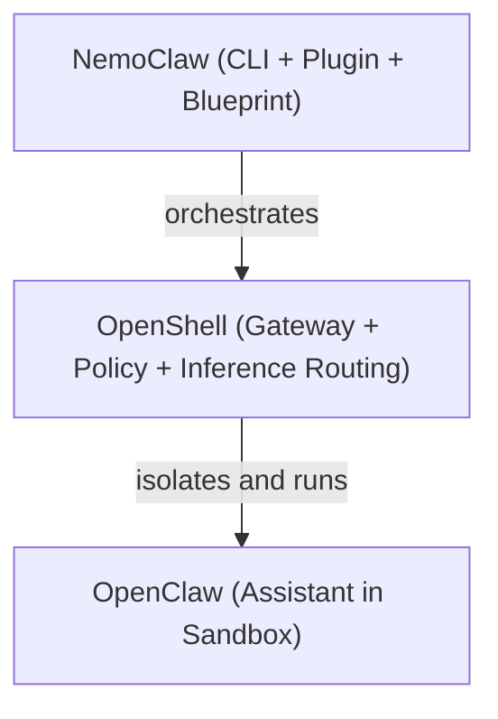
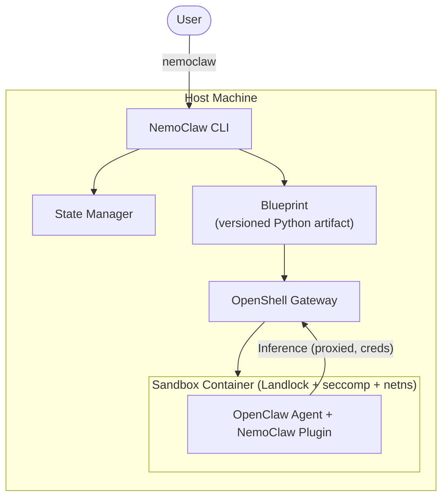
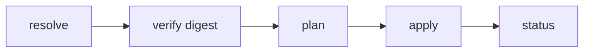
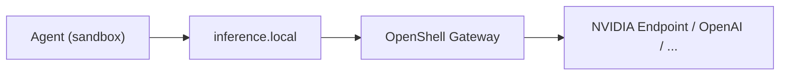

## 什么是 NemoClaw

`NemoClaw` 是 `NVIDIA` 开源的参考运行栈（Reference Stack），专门为在 `OpenShell` 沙箱中安全运行 [OpenClaw](https://openclaw.ai) 常驻`AI`助手而设计。项目地址为 [https://github.com/NVIDIA/NemoClaw](https://github.com/NVIDIA/NemoClaw)，于 **2026 年 3 月 16 日**进入早期预览阶段（Alpha）。

简单来说，`NemoClaw`做的事情是：**一条命令，让 OpenClaw 在安全沙箱中开箱即用**。它安装 `NVIDIA OpenShell` 运行时，通过受版本控制的蓝图（`Blueprint`）在隔离容器中自动完成沙箱创建、推理路由配置和网络策略应用，从而让自主智能体能以更安全、更可重复的方式运行在云端、本地`PC`以及 `DGX Spark` 等 `NVIDIA` 硬件平台上。

### 解决的核心问题

自主`AI`智能体（如`OpenClaw`）具备自主发起网络请求、访问宿主机文件系统、调用任意推理端点的能力。如果缺乏防护措施，在无人值守的情况下持续运行会带来安全、成本和合规方面的风险：

| 问题 | NemoClaw 的解法 |
|---|---|
| 智能体可发起任意出站网络请求，难以审计 | 声明式网络策略 + 默认拒绝，未知主机须运营者审批才可放行 |
| 宿主机文件系统暴露，存在数据泄露风险 | `Landlock`文件系统隔离，智能体仅可读写指定数据目录 |
| 外部模型接口凭证难以安全传递给沙箱 | 凭证驻留宿主，`OpenShell`网关在出口处注入，沙箱内不持有真实密钥 |
| 手动搭建沙箱步骤繁多、容易出错 | 一条命令（`nemoclaw onboard`）驱动完整安装流程 |
| 沙箱重建不可复现，升级维护困难 | 版本化蓝图 + 摘要验证，保证不同机器上重建结果一致 |
| 智能体状态跨机迁移时可能泄露凭证 | 状态快照时自动剥离凭证并进行完整性校验 |


## NemoClaw 与 OpenClaw 的区别

要理解`NemoClaw`，首先需要厘清它在整个生态中的定位。`OpenClaw`、`OpenShell`与`NemoClaw`三个项目各司其职，共同构成了一套完整的常驻智能体部署方案。

### 三者的关系



| 项目 | 职责范围 |
|---|---|
| `OpenClaw` | 智能体本体：运行时、工具、记忆和沙箱内的行为逻辑。不负责定义沙箱或宿主网关。 |
| `OpenShell` | 执行环境：沙箱生命周期、网络/文件系统/进程策略、推理路由，以及面向运营者的`openshell`命令行。 |
| `NemoClaw` | `NVIDIA`参考栈：`nemoclaw` CLI + 插件、版本化蓝图、渠道消息配置、状态迁移工具——以文档化、可重复的方式让`OpenClaw`运行在`OpenShell`内。 |

### 与原始 OpenClaw 的能力对比

`OpenClaw`本身已提供完善的多渠道接入、多模型支持和技能扩展能力（详见[OpenClaw 介绍](/ai/openclaw-introduction-and-setup)）。`NemoClaw`在此之上重点补齐了**安全性**与**可运维性**两个维度：

| 能力维度 | 原生 OpenClaw | NemoClaw |
|---|---|---|
| 多渠道接入（Telegram/Discord/Slack 等） | ✅ 原生支持 | ✅ 由`OpenShell`管理，自动配置 |
| 多模型/多提供商推理 | ✅ 支持 | ✅ 通过`OpenShell`网关路由，凭证不进沙箱 |
| 沙箱隔离（Landlock + seccomp + netns） | ❌ 无 | ✅ `OpenShell`提供，`NemoClaw`蓝图进一步收紧 |
| 文件系统访问控制 | ❌ 无 | ✅ 仅`/sandbox-data`、`/tmp`等路径可读写，其余只读 |
| 出站网络策略（默认拒绝） | ❌ 无 | ✅ `YAML`声明式规则，未知主机实时审批 |
| 进程权限限制（seccomp + ulimit） | ❌ 无 | ✅ 禁止权限提升，进程数上限`512` |
| 推理凭证隔离 | ❌ 凭证在本地明文 | ✅ 凭证驻宿主，网关注入，沙箱不持真实密钥 |
| 镜像安全加固 | ❌ 无 | ✅ 剥离`gcc`、`make`、`netcat`等工具，减小攻击面 |
| 版本化蓝图与摘要校验 | ❌ 无 | ✅ 蓝图下载前校验摘要，保证供应链完整性 |
| 一键安装引导 | `openclaw onboard` | `nemoclaw onboard`（含前置检查、提供商验证） |
| 跨机状态迁移 | ❌ 无 | ✅ 快照时剥离凭证，完整性验证后恢复 |

### 与 `openshell sandbox create --from openclaw` 的对比

`OpenShell`本身提供了社区沙箱，运行 `openshell sandbox create --from openclaw` 可以直接得到一个带`OpenShell`隔离的`OpenClaw`环境。`NemoClaw`在此基础上进一步增强：

| 能力项 | `openshell sandbox create --from openclaw` | `nemoclaw onboard` |
|---|---|---|
| 沙箱隔离 | ✅ | ✅（更严格的基线策略） |
| 推理提供商自动配置 | ❌ 手动创建`provider` | ✅ 向导自动注册，凭证不进沙箱 |
| 镜像加固（移除编译器/网络探针） | ❌ 保留通用系统工具 | ✅ 移除`gcc`、`g++`、`make`、`netcat` |
| 文件系统策略（更严格只读布局） | ❌ 社区默认策略 | ✅ `/sandbox`家目录只读，仅特定数据路径可写 |
| 渠道消息自动配置 | ❌ 手动配置`provider`和`OpenClaw`渠道 | ✅ 向导收集`Token`，自动注册并烘焙`placeholder` |
| 版本化蓝图及摘要验证 | ❌ 无蓝图 | ✅ 摘要验证保障供应链安全 |
| 状态跨机迁移 | ❌ 无 | ✅ |
| 进程数限制（防`fork bomb`） | ❌ | ✅ `ulimit -u 512` |
| 敏感环境变量过滤 | ❌ | ✅ 构建时过滤`API Key`等变量，防止泄露到镜像 |


## 架构设计

`NemoClaw`由两个主要组件构成：一个集成到`OpenClaw CLI`的`TypeScript`插件，以及一个编排`OpenShell`资源的`Python`蓝图。

### 系统总览



### 核心组件

#### NemoClaw Plugin（TypeScript 插件）

插件是一个轻量的`TypeScript`包，在沙箱内与`OpenClaw`网关进程一起运行。其职责包括：

- 在`OpenClaw`内注册`/nemoclaw`斜杠命令（查看状态、重新引导等）
- 向蓝图运行时委托编排工作
- 管理蓝图制品的下载、版本兼容性校验与摘要验证

```text
nemoclaw/
├── src/
│   ├── index.ts          -- 插件入口：注册所有命令
│   ├── cli.ts            -- Commander.js 子命令配置
│   ├── commands/
│   │   ├── launch.ts     -- 全新安装到 OpenShell
│   │   ├── connect.ts    -- 交互式进入沙箱 Shell
│   │   ├── status.ts     -- 蓝图运行状态 + 沙箱健康检查
│   │   ├── logs.ts       -- 流式输出蓝图和沙箱日志
│   │   └── slash.ts      -- /nemoclaw 聊天命令处理
│   └── blueprint/
│       ├── resolve.ts    -- 版本解析与缓存管理
│       ├── fetch.ts      -- 从 OCI 注册表下载蓝图
│       ├── verify.ts     -- 摘要验证与兼容性检查
│       ├── exec.ts       -- 以子进程执行蓝图运行器
│       └── state.ts      -- 持久化状态（运行 ID 等）
├── openclaw.plugin.json  -- 插件清单
└── package.json
```

#### NemoClaw Blueprint（Python 蓝图）

蓝图是独立版本发布的`Python`制品，包含创建沙箱、应用策略、配置推理提供商的所有编排逻辑。插件负责下载、校验并以子进程方式执行蓝图。

```text
nemoclaw-blueprint/
├── blueprint.yaml                 -- 清单：版本、配置文件、兼容性约束
├── policies/
│   └── openclaw-sandbox.yaml     -- 默认网络 + 文件系统策略
```

##### 蓝图生命周期



1. **Resolve**：插件定位蓝图制品，校验版本是否满足`blueprint.yaml`中的`min_openshell_version`和`min_openclaw_version`约束。
2. **Verify**：校验制品摘要，保障供应链完整性。
3. **Plan**：确定需要创建或更新哪些`OpenShell`资源（网关、提供商、沙箱、推理路由、策略）。
4. **Apply**：执行计划，调用`openshell` CLI 命令完成资源创建。
5. **Status**：上报当前状态。

#### OpenShell Gateway（安全网关）

`OpenShell`网关是`NemoClaw`底层的执行环境，提供：

- **凭证存储**：`API Key`等敏感信息存储在宿主机侧，沙箱内仅获得占位符`token`
- **推理代理**：拦截所有来自沙箱的推理请求，在出口处注入真实凭证并转发给上游提供商
- **策略引擎**：执行网络出站策略，拦截未授权连接并呈现给运营者审批
- **设备认证**：控制面板访问的设备鉴权

#### Sandbox Container（隔离沙箱）

沙箱基于 `ghcr.io/nvidia/openshell-community/sandboxes/openclaw` 容器镜像。沙箱内：

- `OpenClaw`与`NemoClaw`插件均已预装
- 推理调用通过`OpenShell`路由，不直接连接提供商
- 网络出站受基线策略管控
- 文件系统访问仅限于`/sandbox`和`/tmp`等指定路径

### 保护层

`NemoClaw`在四个层面实施安全防护：

| 保护层 | 防护内容 | 是否支持热重载 |
|---|---|---|
| 网络层 | 阻断未授权出站连接，未知主机须运营者实时审批 | ✅ 运行时热重载 |
| 文件系统层 | 仅允许`/sandbox-data`、`/tmp`等路径可读写，其余只读 | ❌ 沙箱创建时锁定 |
| 进程层 | 禁止权限提升、屏蔽危险系统调用，进程数上限 512 | ❌ 沙箱创建时锁定 |
| 推理层 | 所有模型`API`调用重定向到受控后端，凭证不暴露 | ✅ 运行时热重载 |

### 推理路由流程



沙箱内的智能体只知道`inference.local`这个内部地址，对真实上游提供商和凭证无感知。`OpenShell`网关在宿主机侧管理凭证并路由流量。


## 安装与配置

### 系统要求

#### 硬件要求

| 资源 | 最低配置 | 推荐配置 |
|---|---|---|
| `CPU` | 4 vCPU | 4+ vCPU |
| 内存 | 8 GB RAM | 16 GB RAM |
| 磁盘 | 20 GB 可用空间 | 40 GB 可用空间 |

沙箱镜像压缩后约 2.4 GB。内存低于 8 GB 时可配置 8 GB 以上的`Swap`作为补偿，但性能会下降。

#### 软件依赖

| 依赖 | 版本要求 |
|---|---|
| Node.js | 22.16 或更高版本 |
| npm | 10 或更高版本 |
| 容器运行时 | 见下表 |

#### 支持的平台与容器运行时

| 操作系统 | 容器运行时 | 状态 | 说明 |
|---|---|---|---|
| Linux | Docker | ✅ 已测试 | 主要测试路径 |
| macOS（Apple Silicon） | Colima、Docker Desktop | ⚠️ 有限支持 | 需安装 Xcode Command Line Tools |
| DGX Spark | Docker | ✅ 已测试 | 使用标准安装脚本和`nemoclaw onboard` |
| Windows WSL2 | Docker Desktop（WSL 后端） | ⚠️ 有限支持 | 需要 WSL2 + Docker Desktop WSL 后端 |

### 一键安装

```bash
curl -fsSL https://www.nvidia.com/nemoclaw.sh | bash
```

安装脚本会自动检测并安装 Node.js（通过`nvm`），然后启动交互式引导向导完成沙箱创建、推理配置和安全策略应用。安装完成后，终端会显示如下摘要：

```text
──────────────────────────────────────────────────
Sandbox      my-assistant (Landlock + seccomp + netns)
Model        nvidia/nemotron-3-super-120b-a12b (NVIDIA Endpoints)
──────────────────────────────────────────────────
Run:         nemoclaw my-assistant connect
Status:      nemoclaw my-assistant status
Logs:        nemoclaw my-assistant logs --follow
──────────────────────────────────────────────────
[INFO]  === Installation complete ===
```

> **注意**：安装器以普通用户身份运行，无需`sudo`。Docker 本身的安装可能需要特权，但 NemoClaw 安装过程不需要。

### 网络策略配置

`NemoClaw`采用**默认拒绝**网络策略。安装向导提供三种策略层级：

| 层级 | 包含预设 | 适用场景 |
|---|---|---|
| Restricted（受限） | 无 | 仅允许推理和核心工具，无第三方网络访问 |
| Balanced（均衡，默认） | npm、pypi、huggingface、brew、brave | 完整开发工具链和网页搜索，无消息平台访问 |
| Open（开放） | npm、pypi、huggingface、brew、brave、slack、discord、telegram、jira、outlook | 包含消息平台在内的广泛第三方服务访问 |

选择层级后，向导还会提供精细化的预设开关，允许按需启用/禁用单个服务，并配置读（`GET`）或读写（`GET`+`POST`/`PUT`）权限模式。

### 推理提供商配置

`nemoclaw onboard`向导支持以下推理提供商（需提供对应`API Key`）：

| 提供商 | 环境变量 | 推荐模型示例 |
|---|---|---|
| `NVIDIA Endpoints` | `NVIDIA_API_KEY` | `nvidia/nemotron-3-super-120b-a12b` |
| `OpenAI` | `OPENAI_API_KEY` | `gpt-5.4`、`gpt-5.4-mini` |
| `Anthropic` | `ANTHROPIC_API_KEY` | `claude-sonnet-4-6`、`claude-opus-4-6` |
| `Google Gemini` | `GEMINI_API_KEY` | `gemini-2.5-pro`、`gemini-2.5-flash` |
| 兼容`OpenAI`的自定义端点 | `COMPATIBLE_API_KEY` | 自定义 |
| 兼容`Anthropic`的自定义端点 | `COMPATIBLE_ANTHROPIC_API_KEY` | 自定义 |
| 本地`Ollama` | 无需`API Key` | 安装向导自动检测已安装模型 |
| 本地`NVIDIA NIM`（实验性） | 需要`NEMOCLAW_EXPERIMENTAL=1` | 同时需要兼容`NIM`的 GPU |
| 本地`vLLM`（实验性） | 需要`NEMOCLAW_EXPERIMENTAL=1` | 需要`localhost:8000`已运行`vLLM` server |

### 宿主机侧配置文件

| 文件路径 | 用途 |
|---|---|
| `~/.nemoclaw/credentials.json` | 引导时保存的提供商凭证（明文 JSON，受文件系统权限保护） |
| `~/.nemoclaw/sandboxes.json` | 已注册的沙箱元数据及默认沙箱选择 |
| `~/.openclaw/openclaw.json` | 宿主机`OpenClaw`配置（NemoClaw 迁移时快照/恢复） |

### 常用环境变量

| 变量 | 用途 |
|---|---|
| `TELEGRAM_BOT_TOKEN` | `Telegram Bot Token`，在`nemoclaw onboard`之前提供 |
| `TELEGRAM_ALLOWED_IDS` | 逗号分隔的`Telegram`用户或群组 ID 白名单 |
| `NEMOCLAW_POLICY_TIER` | 非交互安装时指定策略层级（`restricted`/`balanced`/`open`） |
| `NEMOCLAW_ACCEPT_THIRD_PARTY_SOFTWARE` | 设为`1`时在非交互模式下自动接受第三方软件声明 |
| `NEMOCLAW_EXPERIMENTAL` | 设为`1`时开启实验性本地推理选项（NIM、vLLM） |
| `BRAVE_API_KEY` | 非交互模式下启用`Brave Search` |
| `NEMOCLAW_FROM_DOCKERFILE` | 非交互模式下指定自定义`Dockerfile`路径 |


## CLI 命令参考

### `/nemoclaw` 斜杠命令（沙箱内）

在`OpenClaw`聊天界面中可用：

| 命令 | 说明 |
|---|---|
| `/nemoclaw` | 显示斜杠命令帮助 |
| `/nemoclaw status` | 显示沙箱和推理状态 |
| `/nemoclaw onboard` | 显示引导状态和重配置指引 |
| `/nemoclaw eject` | 显示回滚为宿主安装的操作指引 |

### 宿主机侧命令

| 命令 | 说明 |
|---|---|
| `nemoclaw onboard` | 运行交互式安装向导（新安装推荐） |
| `nemoclaw list` | 列出所有已注册沙箱及其模型、提供商和策略预设 |
| `nemoclaw <name> connect` | 进入指定名称的沙箱 Shell |
| `nemoclaw <name> status` | 查看沙箱和蓝图运行状态 |
| `nemoclaw <name> logs --follow` | 流式查看沙箱和蓝图日志 |
| `nemoclaw --version` / `-v` | 打印已安装的 CLI 版本 |
| `nemoclaw help` | 显示命令帮助 |


## 使用示例

### 示例一：快速安装并运行首个沙箱智能体

```bash
# 一键安装（按向导提示选择推理提供商和策略层级）
curl -fsSL https://www.nvidia.com/nemoclaw.sh | bash

# 进入沙箱
nemoclaw my-assistant connect

# 在沙箱内启动 OpenClaw TUI
openclaw tui

# 或发送单条消息
openclaw agent --agent main --local -m "你好，帮我搜索最新的 AI 论文" --session-id test
```

### 示例二：非交互式安装（CI/CD 或远程部署）

```bash
# 使用 NVIDIA Endpoints 提供商，均衡策略层级，非交互安装
export NVIDIA_API_KEY="nvapi-xxxxxxxxxxxx"
export NEMOCLAW_POLICY_TIER=balanced
export NEMOCLAW_ACCEPT_THIRD_PARTY_SOFTWARE=1

nemoclaw onboard --non-interactive
```

### 示例三：运行时切换推理模型

无需重启沙箱，通过`OpenShell`命令热切换模型：

```bash
# 切换到 NVIDIA Endpoints 的另一个模型
openshell inference set --provider nvidia-prod --model nvidia/nemotron-3-super-120b-a12b

# 切换到 OpenAI
openshell inference set --provider openai-api --model gpt-5.4

# 切换到 Anthropic
openshell inference set --provider anthropic-prod --model claude-sonnet-4-6

# 切换到 Google Gemini
openshell inference set --provider gemini-api --model gemini-2.5-flash
```

### 示例四：配置 Telegram 频道并启用消息接入

```bash
# 在引导前设置 Telegram Bot Token 和用户白名单
export TELEGRAM_BOT_TOKEN="1234567890:ABCDEFxxxxxxxxxxxx"
export TELEGRAM_ALLOWED_IDS="123456789,987654321"

# 运行向导，向导会自动配置 OpenShell Provider 和 OpenClaw 渠道设置
nemoclaw onboard
```

### 示例五：使用自定义 Dockerfile 构建沙箱

```bash
# 准备自定义 Dockerfile（放置在某个目录中）
# Dockerfile 可引用 NemoClaw 注入的构建参数
# (NEMOCLAW_MODEL, NEMOCLAW_PROVIDER_KEY, NEMOCLAW_INFERENCE_BASE_URL 等)

nemoclaw onboard --from /path/to/my/Dockerfile
```

### 示例六：网络策略运营者审批

当智能体尝试访问未在策略中列出的主机时，`OpenShell`会拦截请求并在终端`UI`中提示：

```bash
# 查看被拦截的网络请求（在 TUI 中）
openshell term

# 运行官方演示脚本（tmux 分屏：左侧 TUI + 右侧 Agent）
./scripts/walkthrough.sh
```

批准后，该端点在当前会话内有效。如需持久化，需手动将其添加到`nemoclaw-blueprint/policies/openclaw-sandbox.yaml`并重新运行`nemoclaw onboard`。

### 示例七：卸载 NemoClaw

```bash
# 完整卸载（交互式确认）
curl -fsSL https://raw.githubusercontent.com/NVIDIA/NemoClaw/refs/heads/main/uninstall.sh | bash

# 跳过确认
curl -fsSL https://raw.githubusercontent.com/NVIDIA/NemoClaw/refs/heads/main/uninstall.sh | bash -s -- --yes

# 保留 openshell 二进制文件
curl -fsSL https://raw.githubusercontent.com/NVIDIA/NemoClaw/refs/heads/main/uninstall.sh | bash -s -- --keep-openshell

# 同时删除 NemoClaw 拉取的 Ollama 模型
curl -fsSL https://raw.githubusercontent.com/NVIDIA/NemoClaw/refs/heads/main/uninstall.sh | bash -s -- --delete-models
```


## 典型应用场景

| 场景 | 说明 |
|---|---|
| 常驻 AI 助手 | 以受控网络访问和运营者审批机制运行`OpenClaw`，适合 24×7 无人值守部署 |
| 沙箱测试 | 在锁定环境中验证智能体行为，授予更广权限前的安全预检 |
| 远程 GPU 部署 | 将沙箱化智能体部署到远程 GPU 实例，实现低延迟、持续运行 |
| 企业合规部署 | 通过声明式出站策略满足数据本地化和网络合规要求 |


## 何时选择 NemoClaw

| 场景 | 推荐选择 |
|---|---|
| 希望最小化装配步骤、采用`NVIDIA`默认配置的`OpenClaw`常驻助手 | **NemoClaw** |
| 需要最大灵活性、自定义镜像或不符合`NemoClaw`蓝图布局的工作负载 | **OpenShell**（自定义集成） |
| 希望标准化为`NVIDIA`参考栈，含策略管控和推理路由 | **NemoClaw** |
| 构建内部平台抽象，`NemoClaw` CLI 或蓝图不适合融入现有工具链 | **OpenShell**（自行编排） |


## 总结

`NemoClaw`填补了`OpenClaw`作为个人`AI`助手在**企业级安全**和**可运维性**上的空白。它并不是`OpenClaw`的替代品，而是在`OpenShell`平台之上为`OpenClaw`构建了一套经过`NVIDIA`验证的参考运行栈。

对于希望长期、安全、可重复地运行常驻`AI`智能体的开发者和企业而言，`NemoClaw`提供了从安装到运维的完整路径：

- **安全**：沙箱隔离、凭证隔离、声明式网络策略、进程级防护
- **可运维**：版本化蓝图、一键安装、热切换推理、跨机状态迁移
- **可扩展**：支持`NVIDIA Endpoints`、`OpenAI`、`Anthropic`、`Gemini`、本地`Ollama`/`NIM`/`vLLM`等多种推理后端，可自定义`Dockerfile`与网络策略

项目目前处于`Alpha`阶段，接口和行为可能随迭代发生变化，建议关注 [GitHub Release 页面](https://github.com/NVIDIA/NemoClaw/releases)获取最新动态。
