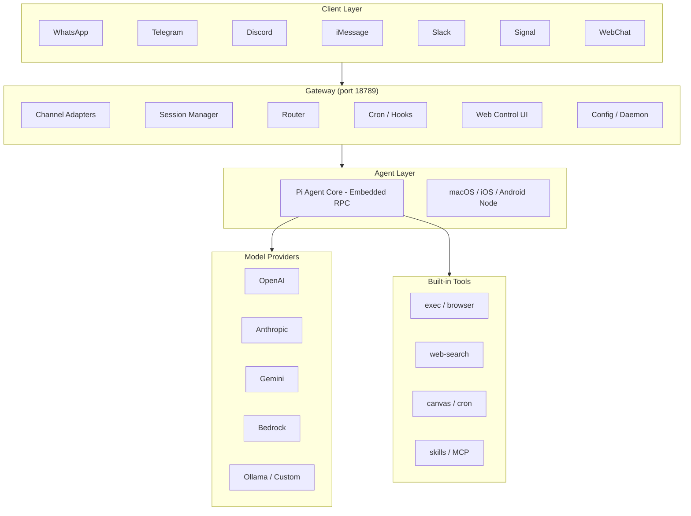

## 什么是 OpenClaw

`OpenClaw` 是一款**开源的自托管个人 AI 助手网关**，项目主页地址为 [https://openclaw.ai](https://openclaw.ai)，`GitHub`地址为 [https://github.com/openclaw/openclaw](https://github.com/openclaw/openclaw)。它允许你在自己的设备上运行一个统一的`Gateway`进程，将`WhatsApp`、`Telegram`、`Discord`、`iMessage`、`Slack`、`Signal`等`20`余款主流即时通讯应用与 AI 编码代理（内置`Pi agent`）连接起来，让你随时随地都能与自己的`AI`助手对话。

简言之，`OpenClaw`做的事情是：**一次部署，多端可用**。你无需为每款`App`单独配置`AI Bot`，只需启动一个`Gateway`进程，所有已配置的渠道就都能接入同一个`AI`后端。

### 解决的核心问题

| 痛点 | OpenClaw 的解法 |
|---|---|
| `AI`服务依赖云厂商，数据出境不可控 | 自托管，数据不离境，规则自己定 |
| 多款消息`App`各需单独集成`AI Bot` | 单一`Gateway`同时服务所有渠道 |
| 缺乏工具调用与长上下文记忆能力 | 内置`Pi agent`支持工具调用、会话记忆、多代理路由 |
| 移动端无法灵活触发`AI`工作流 | 配套`iOS`/`Android node`，支持语音唤醒和实时`Canvas` |
| 安装配置门槛高 | 交互式`openclaw onboard`向导引导完成全流程 |

---

## 架构设计

`OpenClaw`采用分层架构设计，核心控制平面是`Gateway`，负责管理会话、路由、工具和事件。



### 核心组件

#### Gateway（控制平面）

`Gateway`是`OpenClaw`的控制中枢，默认监听在`18789`端口，对外提供：

- **WebSocket 控制接口**：所有`Channel`连接以及`Web Control UI`与`Gateway`之间均通过 `WebSocket`通信。
- **REST API**：供`CLI`和远程管理调用。
- **配置热重载**：`Gateway`监视`openclaw.json`文件变化，配置修改后立即生效，无需重启。
- **守护进程管理**：在`macOS`上使用`launchd`、在`Linux`上使用`systemd`，以用户服务方式常驻后台。

#### Channel Adapters（渠道适配器）

每个渠道通过独立的适配器实现，同一`Gateway`可以同时连接多个渠道：

| 渠道 | 库/协议 | 典型用途 |
|---|---|---|
| `WhatsApp` | `Baileys`（`Web`协议） | 个人最常用的移动端入口 |
| `Telegram` | `grammY` | Bot 生态最完善，推荐首选 |
| `Discord` | `discord.js` | 社区协作和开发团队 |
| `Slack` | `Bolt SDK` | 企业内部`AI`助手 |
| `Signal` | `signal-cli` | 高隐私场景 |
| `iMessage/BlueBubbles` | `BlueBubbles`（推荐）/ `imsg` | `Apple`设备用户 |
| `IRC` | 内置协议 | 极客社区 |
| `Microsoft Teams` | `Teams API` | 企业`Office`场景 |
| `Matrix` | 内置适配 | 去中心化通信 |
| `Feishu` | `飞书 API` | 中国企业用户 |
| `WebChat` | 内置 `WebSocket` | 网页端直接聊天 |

此外还支持`LINE`、`Mattermost`、`Nextcloud Talk`、`Nostr`、`Synology Chat`、`Tlon`、`Twitch`、`Zalo`、`WeChat`等平台（部分通过扩展包提供）。

#### Agent Runtime（智能体运行时）

`OpenClaw`内置`Pi agent`作为默认智能体运行时，通过`RPC`模式调用。它负责：

- **工具调用**：`exec`（代码执行）、`browser`（网页浏览）、`canvas`（画布渲染）等
- **跨对话记忆**：会话`Transcript`以`JSONL`格式持久化存储于`~/.openclaw/agents/<agentId>/sessions/`
- **Bootstrap 文件注入**：每次新会话开始时，自动将`AGENTS.md`、`SOUL.md`、`USER.md`等文件注入上下文，赋予智能体持久「个性」和「记忆」
- **多代理路由**：可配置多个`Agent`实例，通过`bindings`规则将不同渠道、账号或用户路由到不同代理

#### Web Control UI（管理面板）

浏览器控制台，默认地址为`http://127.0.0.1:18789`，提供以下功能：

- 实时聊天，与`AI`助手直接对话
- 可视化配置编辑（表单模式和`Raw JSON`模式）
- 会话列表与历史查看
- 节点管理（配对`macOS/iOS/Android`）

#### CLI（命令行工具）

`openclaw`命令行提供完整的管理能力：

```bash
# 启动/查看 Gateway 状态
openclaw gateway start
openclaw gateway status

# 交互式引导配置
openclaw onboard

# 配置管理
openclaw config get agents.defaults.workspace
openclaw config set agents.defaults.model.primary "anthropic/claude-sonnet-4-6"

# 发送消息
openclaw message send --to +1234567890 --message "Hello"

# 诊断
openclaw doctor
openclaw doctor --fix

# 更新
openclaw update --channel stable
```

#### Skills 与 Plugins

`OpenClaw`通过`Skills`和`Plugins`提供可扩展能力：

- **Skills**：轻量级技能包，可以是`Bundled`（内置）、`Managed`（`~/.openclaw/skills`）或 `Workspace`级别（`<workspace>/skills`），用于扩展智能体的专项能力（如图片生成、搜索等）。
- **Plugins**：通过`npm`包发布，挂载到`Gateway`生命周期，可提供新渠道适配、工具或后端能力。
- **MCP**：通过`mcporter`桥接`MCP`协议服务，不需要内置到核心就能灵活扩展工具。

---

## 配置详解

`OpenClaw`的配置文件为`~/.openclaw/openclaw.json`，使用`JSON5`格式（支持注释和尾随逗号）。所有字段均为可选，缺省时使用安全默认值。

> **提示**：修改配置后`Gateway`会自动热重载，无需手动重启；`openclaw doctor`可检测配置合法性并在必要时自动修复。

### 顶层结构总览

| 顶层字段 | 类型 | 说明 |
|---|---|---|
| `auth` | `object` | 认证配置 |
| `gateway` | `object` | `Gateway` 绑定、TLS、端口等 |
| `agents` | `object` | 智能体列表与默认值 |
| `bindings` | `array` | 渠道路由绑定规则 |
| `channels` | `object` | 各渠道连接配置 |
| `models` | `object` | 模型提供商与模型定义 |
| `tools` | `object` | 工具开关与参数 |
| `skills` | `object` | `Skill` 条目配置 |
| `plugins` | `object` | 插件配置 |
| `session` | `object` | 会话范围与重置策略 |
| `cron` | `object` | 定时任务 |
| `hooks` | `object` | 事件钩子 |
| `web` | `object` | `WebSocket/WhatsApp` 连接参数 |
| `logging` | `object` | 日志级别与文件配置 |
| `secrets` | `object` | 密钥引用（支持环境变量和文件） |
| `env` | `object` | 内联环境变量注入 |
| `ui` | `object` | 控制台主题和`AI`助手名称 |
| `update` | `object` | 自动更新策略 |
| `discovery` | `object` | `mDNS/Bonjour` 和广域发现 |
| `canvasHost` | `object` | `Canvas` 画布服务器配置 |
| `talk` | `object` | `TTS`（文字转语音）配置 |
| `nodeHost` | `object` | 移动端节点主机配置 |

### Gateway 配置

```javascript
// ~/.openclaw/openclaw.json
{
  gateway: {
    port: 18789,            // 监听端口（默认 18789）
    bind: "loopback",       // 绑定模式：loopback | lan | auto | custom | tailnet
    host: "127.0.0.1",      // bind=custom 时的主机地址
    tls: {
      enabled: false,       // 是否启用 TLS
      autoGenerate: true,   // 缺少证书时自动生成自签名
      certPath: "/path/to/cert.pem",
      keyPath: "/path/to/key.pem",
    },
    auth: {
      mode: "token",        // none | token | password | trusted-proxy
      token: "your-long-random-token",
    },
    controlUi: {
      enabled: true,
      basePath: "/",        // 控制台 URL 前缀
      allowedOrigins: [],   // 允许跨域访问的域名列表
    },
    tailscale: {
      mode: "off",          // off | serve | funnel
      resetOnExit: false,
    },
    healthMonitor: {
      enabled: true,
    },
  },
}
```

`gateway.bind`绑定模式说明：

| 值 | 说明 |
|---|---|
| `loopback` | 仅监听`127.0.0.1`（最安全，默认值） |
| `lan` | 监听所有本地网络接口`0.0.0.0` |
| `auto` | 自动选择（通常等同于`lan`） |
| `custom` | 使用`gateway.host`指定的地址 |
| `tailnet` | 通过`Tailscale`网络暴露 |

### 模型配置

`OpenClaw`支持多种模型提供商，通过`models.providers`进行配置：

```javascript
{
  models: {
    mode: "merge",        // merge | replace（是否合并内置模型列表）
    providers: {
      // 自定义或自建模型服务（如 NewAPI / One-API）
      "my-provider": {
        baseUrl: "https://api.example.com/v1",
        apiKey: { env: "MY_API_KEY" },
        api: "openai-completions",    // 使用的 API 协议
        models: [
          {
            id: "my-model",
            name: "My Custom Model",
            api: "openai-completions",
            reasoning: false,
            input: ["text", "image"],
            cost: { input: 0, output: 0, cacheRead: 0, cacheWrite: 0 },
            contextWindow: 128000,
            maxTokens: 4096,
          },
        ],
      },
    },
  },
}
```

支持的`api`协议类型：

| 协议标识 | 说明 |
|---|---|
| `openai-completions` | `OpenAI Chat Completions`格式 |
| `openai-responses` | `OpenAI Responses API` |
| `anthropic-messages` | `Anthropic Messages API` |
| `google-generative-ai` | `Google Gemini API` |
| `bedrock-converse-stream` | `AWS Bedrock Converse` |
| `ollama` | 本地`Ollama`服务 |
| `azure-openai-responses` | `Azure OpenAI`服务 |

在智能体默认值中设置主模型和降级模型：

```javascript
{
  agents: {
    defaults: {
      model: {
        primary: "anthropic/claude-sonnet-4-6",
        fallbacks: ["openai/gpt-4.1"],
      },
    },
  },
}
```

### 智能体（Agent）配置

```javascript
{
  agents: {
    defaults: {
      workspace: "~/.openclaw/workspace",  // 工作目录
      thinkingDefault: "low",              // 默认思考级别：off | minimal | low | medium | high | xhigh | adaptive
      blockStreamingDefault: "off",        // 流式块传输：off | on
      heartbeat: {
        every: "2h",                       // 心跳检测间隔
        model: "openai/gpt-4.1-mini",      // 心跳使用的轻量模型
      },
      sandbox: {
        enabled: false,                    // 沙盒隔离开关
        workspaceRoot: "~/.openclaw/sandboxes",
      },
    },
    list: [
      {
        id: "main",
        default: true,
        name: "Assistant",
        workspace: "~/.openclaw/workspace",
        model: { primary: "anthropic/claude-sonnet-4-6" },
      },
      {
        id: "code-agent",
        name: "Code Agent",
        workspace: "~/.openclaw/workspace-code",
        model: { primary: "openai/o3" },
        skills: ["exec", "browser"],       // 只允许使用指定技能
      },
    ],
  },
}
```

### 渠道路由绑定

通过`bindings`数组将不同渠道路由到指定智能体：

```javascript
{
  bindings: [
    {
      type: "route",
      agentId: "code-agent",
      comment: "Discord 中的 #coding 频道路由到专属代码代理",
      match: {
        channel: "discord",
        peer: { kind: "channel", id: "123456789012345678" },
      },
    },
    {
      type: "route",
      agentId: "main",
      match: {
        channel: "telegram",
      },
    },
  ],
}
```

### 渠道（Channels）配置

所有渠道共享`DM`访问策略：

| 策略值 | 说明 |
|---|---|
| `pairing`（默认） | 陌生人发来消息时，要求对方输入配对码方可通过 |
| `allowlist` | 仅允许`allowFrom`白名单中的用户 |
| `open` | 开放所有入站`DM`（需同时设置`allowFrom: ["*"]`） |
| `disabled` | 忽略所有 `DM` |

**Telegram 渠道示例**：

```javascript
{
  channels: {
    telegram: {
      enabled: true,
      botToken: "123456:ABCDEF...",         // Bot Token
      dmPolicy: "pairing",
      allowFrom: ["tg:123456789"],           // 白名单（tg:<用户 ID>）
      groups: {
        "*": { requireMention: true },       // 群组中需要 @ 机器人才回复
      },
      streaming: "partial",                 // 流式消息：off | partial | block | progress
      historyLimit: 50,                     // 拉取历史消息条数
      proxy: "socks5://localhost:9050",     // 代理设置（国内必备）
    },
  },
}
```

**Discord 渠道示例**：

```javascript
{
  channels: {
    discord: {
      enabled: true,
      token: "your-bot-token",
      dmPolicy: "pairing",
      allowFrom: ["1234567890"],
      guilds: {
        "123456789012345678": {
          requireMention: false,
          channels: {
            general: { allow: true },
          },
        },
      },
      textChunkLimit: 2000,
      streaming: "off",
      actions: {
        reactions: true,
        threads: true,
        polls: true,
      },
    },
  },
}
```

**WhatsApp 渠道示例**：

```javascript
{
  channels: {
    whatsapp: {
      dmPolicy: "pairing",
      allowFrom: ["+8613900001234"],         // 国际格式手机号
      groupPolicy: "allowlist",
      groups: {
        "*": { requireMention: true },
      },
      sendReadReceipts: true,
      textChunkLimit: 4000,
    },
  },
  web: {
    enabled: true,
    heartbeatSeconds: 60,
  },
}
```

### 会话（Session）配置

```javascript
{
  session: {
    scope: "per-sender",              // per-sender | global
    dmScope: "main",                  // main | per-peer | per-channel-peer
    typingMode: "thinking",           // never | instant | thinking | message
    reset: {
      mode: "daily",                  // daily | idle
      atHour: 3,                      // 每天 3 点重置会话
    },
    resetByType: {
      direct: { mode: "idle", idleMinutes: 60 },
      group: { mode: "daily", atHour: 0 },
    },
    maintenance: {
      pruneAfter: "30d",              // 清理 30 天前的会话
      maxEntries: 500,
    },
  },
}
```

### 定时任务（Cron）

```javascript
{
  cron: {
    jobs: [
      {
        id: "daily-summary",
        schedule: "0 8 * * *",          // 每天 8:00 触发
        agentId: "main",
        message: "请总结今天的待办事项",
        deliverTo: "tg:123456789",       // 结果发送到 Telegram
      },
    ],
  },
}
```

### 工具（Tools）配置

```javascript
{
  tools: {
    exec: {
      enabled: true,
      applyPatch: false,              // 是否开启 apply_patch 工具
      safeBinProfile: "default",      // 安全白名单 profile
    },
    browser: {
      enabled: true,
      sandbox: true,
    },
    webSearch: {
      enabled: true,
      provider: "brave",             // brave | perplexity | firecrawl
    },
  },
}
```

### 密钥（Secrets）管理

`OpenClaw`支持多种密钥引入方式，避免明文写入配置文件：

```javascript
{
  secrets: {
    // 定义密钥引用
    refs: {
      "openai-key": { env: "OPENAI_API_KEY" },        // 从环境变量读取
      "telegram-token": { file: "~/.secrets/tg.txt" }, // 从文件读取
    },
  },
  // 使用密钥引用
  channels: {
    telegram: {
      botToken: { secretRef: "telegram-token" },
    },
  },
}
```

也可以直接使用环境变量简写方式：

```javascript
{
  channels: {
    telegram: {
      botToken: { env: "TELEGRAM_BOT_TOKEN" },
    },
  },
}
```

---

## 快速入门

### 安装

```bash
# macOS / Linux（推荐）
curl -fsSL https://openclaw.ai/install.sh | bash

# 或通过 npm
npm install -g openclaw@latest
```

运行时要求：**Node.js 24**（推荐）或`Node 22.14+`。

### 运行向导

```bash
openclaw onboard --install-daemon
```

交互式向导会引导你完成以下步骤：
1. 选择模型提供商并填入`API Key`
2. 配置`Gateway`绑定和认证
3. 连接第一个渠道（推荐`Telegram`，上手最快）
4. 安装后台守护进程（`launchd`/`systemd`）

### 验证运行

```bash
openclaw gateway status       # 查看 Gateway 状态
openclaw doctor               # 检测配置问题
openclaw dashboard            # 在浏览器打开控制台
```

### 最小化配置示例

以下是一个连接`Telegram`并限制访问白名单的最小配置：

```javascript
// ~/.openclaw/openclaw.json
{
  agents: {
    defaults: {
      workspace: "~/.openclaw/workspace",
      model: {
        primary: "anthropic/claude-sonnet-4-6",
      },
    },
  },
  channels: {
    telegram: {
      enabled: true,
      botToken: { env: "TELEGRAM_BOT_TOKEN" },
      dmPolicy: "pairing",
    },
  },
}
```

---

## 安全说明

`OpenClaw`的安全设计遵循以下原则：

- **最小权限默认值**：陌生人发来的消息默认触发配对流程（`dmPolicy: "pairing"`），不直接处理；
- **认证保护**：`Gateway`在绑定非本地接口时强烈建议配置`gateway.auth.token`；
- **提示注入防御**：建议使用最新一代强模型（如`claude-opus`、`gpt-4`），以降低提示注入风险；
- **沙盒隔离**：通过`agents.defaults.sandbox.enabled: true`为非主会话启用工作区隔离；
- **`openclaw doctor`检测**：运行`openclaw doctor`可扫描出危险的配置组合（如`dmPolicy: "open"`同时缺少认证）。
