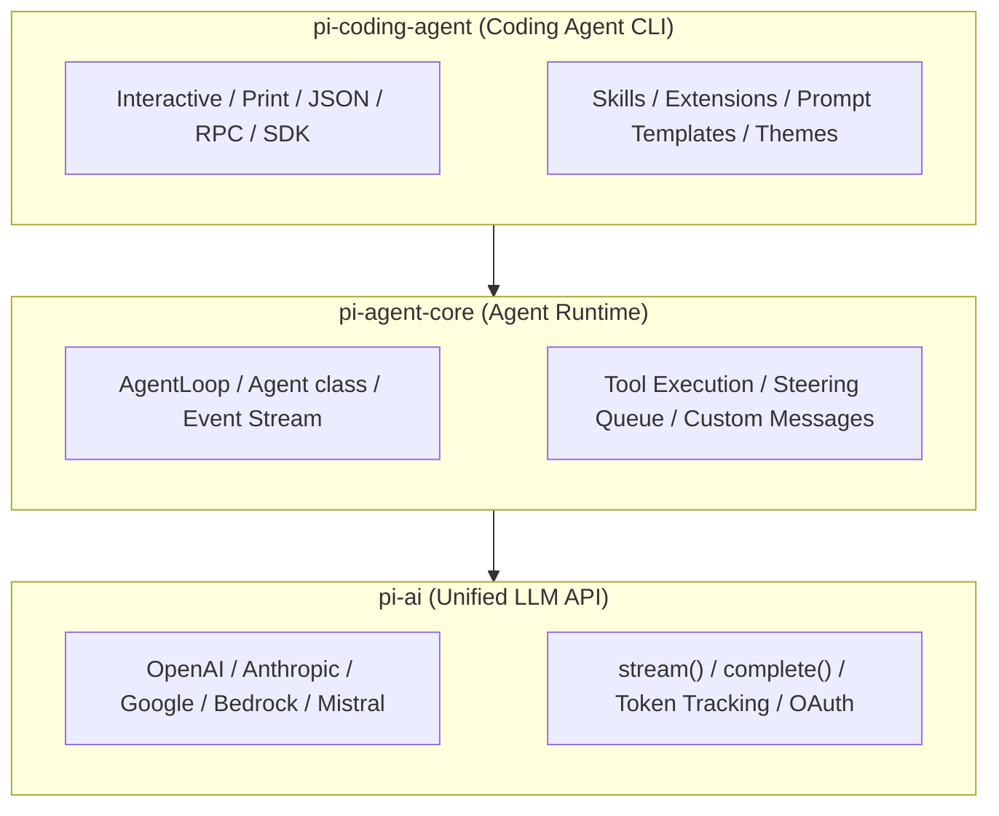
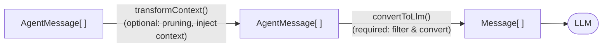
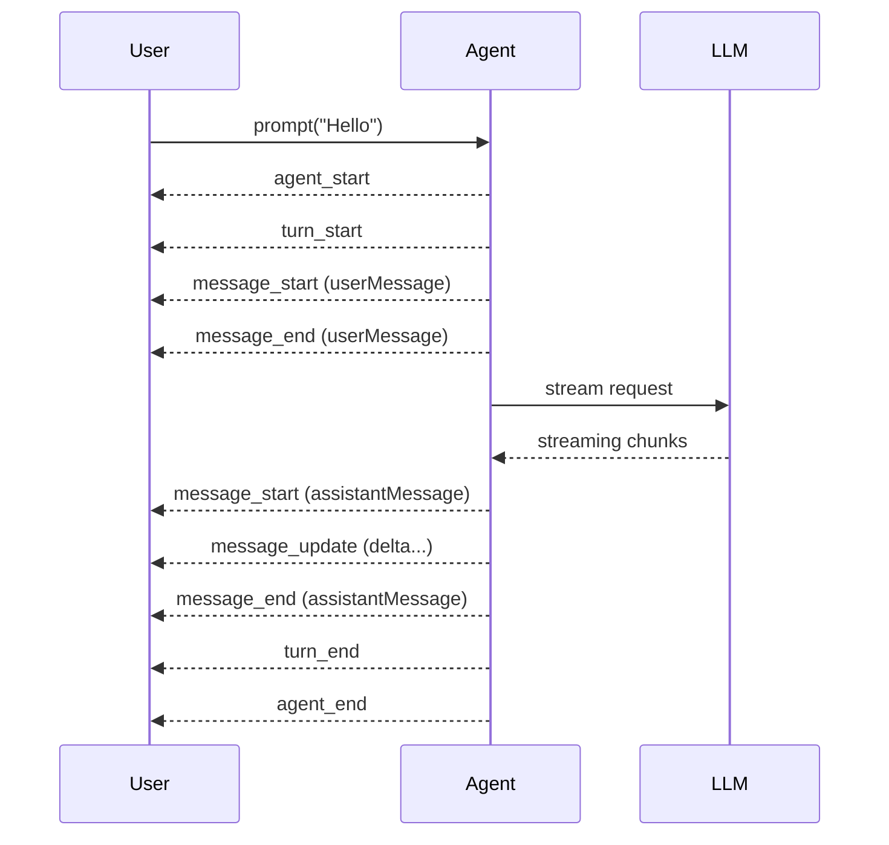
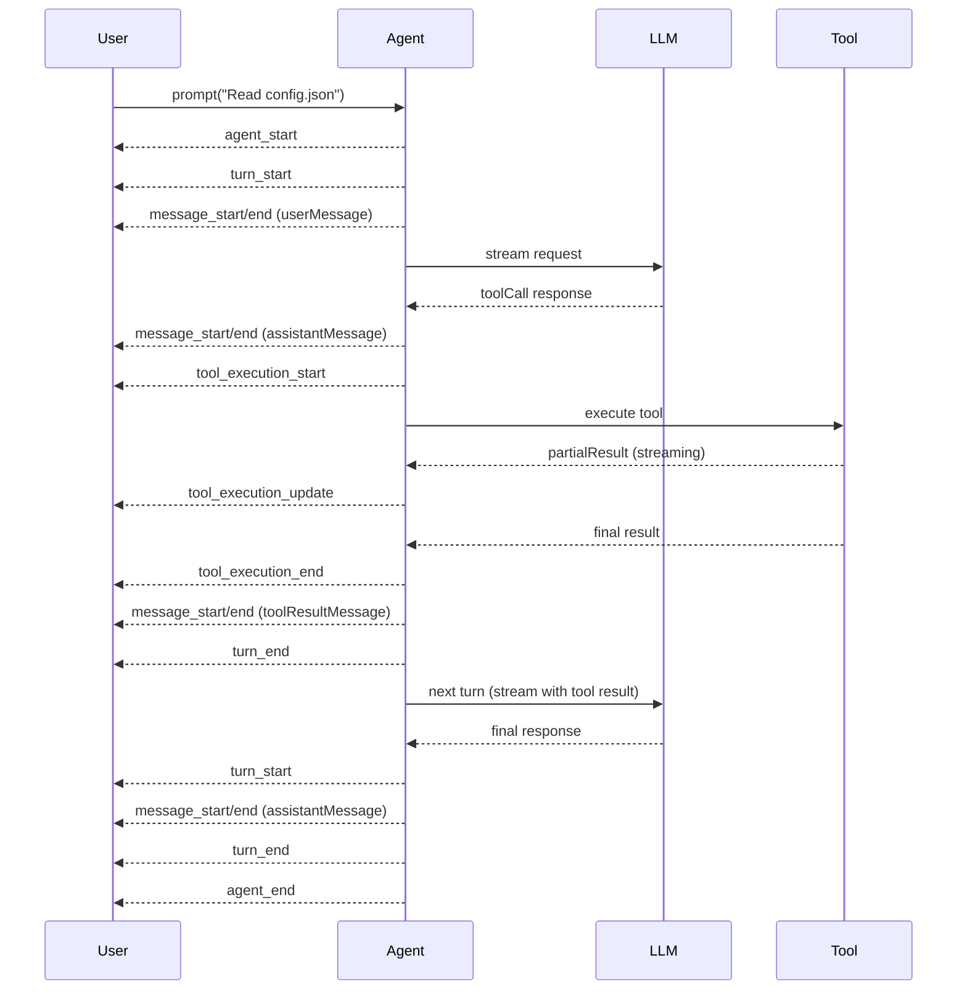

## 什么是 Pi Agent

`Pi Agent`是一个开源的`TypeScript`智能体框架，项目地址为 [https://github.com/badlogic/pi-mono](https://github.com/badlogic/pi-mono)。

`Pi Agent`以`Monorepo`的形式组织，核心目标是提供一套**轻量、可组合、高度可扩展**的工具集，用于构建基于大语言模型（`LLM`）的智能体应用。它并不是一个"大而全"的`Agent`平台，而是遵循`Unix`哲学——每个组件做好一件事，组合使用完成复杂任务。

`OpenClaw`底层的`Agent`正是基于`Pi Agent`框架实现的（具体而言，`OpenClaw`通过`RPC`模式或`SDK`方式集成了`pi-coding-agent`）。因此，理解`Pi Agent`的设计理念和架构，有助于更深入地认识`OpenClaw`的工作原理和扩展能力。


## 解决的核心问题

市面上存在许多`LLM`编排框架，但大多数框架存在以下问题：

| 问题 | Pi Agent 的解法 |
|---|---|
| 与单一模型提供商深度绑定，迁移成本高 | `pi-ai`统一封装`20+`个主流模型提供商，接口完全一致 |
| 零值字段被`omitempty`静默丢弃，导致请求语义错误 | 使用指针类型保留显式零值，精确控制发往上游的请求内容 |
| 框架内置逻辑不可扩展/替换，需`fork`修改源码 | `Extensions`、`Skills`、自定义工具三层扩展机制，无需修改框架本身 |
| 长会话上下文溢出无处理，导致崩溃或截断 | 内置自动压缩（`Compaction`），支持手动和自动两种触发模式 |
| 无法在运行时从外部系统嵌入/控制`Agent` | 提供 `RPC` 模式（`stdin/stdout JSON`协议）和 `SDK` 两种嵌入方式 |
| 工具调用串行执行，效率低 | 支持并行工具调用（`parallel mode`）与串行模式可配置切换 |


## 架构设计

`Pi Agent`采用三层分层架构，各层职责清晰，可单独使用也可组合使用。



整个`Monorepo`包含以下主要包：

| 包名 | npm 包 | 职责 |
|---|---|---|
| `ai` | `@mariozechner/pi-ai` | 统一多模型`LLM API`抽象层 |
| `agent` | `@mariozechner/pi-agent-core` | `Agent`运行时（工具调用、事件流、状态管理） |
| `coding-agent` | `@mariozechner/pi-coding-agent` | 交互式编码智能体`CLI`与`SDK` |
| `mom` | `@mariozechner/pi-mom` | `Slack Bot`，将消息委托给编码 Agent |
| `tui` | `@mariozechner/pi-tui` | 终端`UI`库（差量渲染） |
| `web-ui` | `@mariozechner/pi-web-ui` | `AI`对话`Web`组件 |
| `pods` | `@mariozechner/pi-pods` | `GPU Pod`上`vLLM`部署管理`CLI` |

### pi-ai：统一 LLM 抽象层

`@mariozechner/pi-ai`是整个框架的基础，提供对`20+`个主流大模型提供商的统一封装，所有提供商都使用相同的接口。

**支持的提供商：**

| 类型 | 提供商 |
|---|---|
| `API Key` | `OpenAI`、`Anthropic`、`Google Gemini`、`Vertex AI`、`Amazon Bedrock`、`Mistral`、`Groq`、`Cerebras`、`xAI`、`OpenRouter`、`MiniMax` |
| `OAuth`订阅 | `Claude Pro/Max`、`GitHub Copilot`、`ChatGPT Plus/Pro（Codex）`、`Google Gemini CLI` |
| `OpenAI`兼容 | `Ollama`、`vLLM`、`LM Studio`等任意`OpenAI`兼容`API` |

**核心特性：**

- **流式与非流式**：`stream()`和`complete()`两种调用方式，事件类型包括`text_delta`、`toolcall_start`、`toolcall_end`、`thinking_delta`等
- **思考/推理支持**：统一的`thinkingLevel`接口（`off`/`minimal`/`low`/`medium`/`high`/`xhigh`），自动处理各提供商差异
- **Token 与费用追踪**：每次响应自动统计输入/输出/缓存读写`Token`数量及费用
- **跨模型切换**：`Context`可序列化，支持在不同提供商之间无缝传递对话上下文
- **工具调用**：基于`TypeBox`的类型安全工具定义，支持流式部分参数解析

**基本使用示例：**

```typescript
import { Type, getModel, stream, complete, Context, Tool } from '@mariozechner/pi-ai';

const model = getModel('anthropic', 'claude-sonnet-4-20250514');

const tools: Tool[] = [{
  name: 'get_weather',
  description: 'Get current weather for a location',
  parameters: Type.Object({
    city: Type.String({ description: 'City name' })
  })
}];

const context: Context = {
  systemPrompt: 'You are a helpful assistant.',
  messages: [{ role: 'user', content: 'What is the weather in Tokyo?' }],
  tools
};

const s = stream(model, context);

for await (const event of s) {
  if (event.type === 'text_delta') {
    process.stdout.write(event.delta);
  } else if (event.type === 'toolcall_end') {
    console.log(`Tool called: ${event.toolCall.name}`);
  } else if (event.type === 'done') {
    console.log(`Stop reason: ${event.reason}`);
  }
}

const finalMessage = await s.result();
console.log(`Cost: $${finalMessage.usage.cost.total.toFixed(4)}`);
```

### pi-agent-core：Agent 运行时

`@mariozechner/pi-agent-core`构建在`pi-ai`之上，提供有状态的`Agent`运行时，核心是`Agent`类和`AgentLoop`。

#### AgentMessage 与消息流

`Agent`运行时引入了`AgentMessage`类型，它是`LLM Message`的超集——除了标准的`user`、`assistant`、`toolResult`消息外，应用还可以通过声明合并添加自定义消息类型（如通知、状态更新等）。

消息流转路径如下：



#### 事件模型

`Agent`通过事件驱动方式工作，所有操作都以事件流的形式对外暴露，便于`UI`实时响应。

**无工具调用时的事件序列：**



**有工具调用时的事件序列：**



**完整事件类型说明：**

| 事件 | 触发时机 |
|---|---|
| `agent_start` | `Agent`开始处理 |
| `agent_end` | `Agent`处理完成（所有订阅者`await`结束后才`resolve`） |
| `turn_start` | 新一轮`LLM`调用开始 |
| `turn_end` | 本轮`LLM`调用结束（含工具执行结果） |
| `message_start` | 任意消息开始（`user/assistant/toolResult`） |
| `message_update` | 仅限`assistant`消息，包含流式增量`delta` |
| `message_end` | 消息完整接收 |
| `tool_execution_start` | 工具开始执行 |
| `tool_execution_update` | 工具流式进度更新 |
| `tool_execution_end` | 工具执行结束 |

#### 工具执行模式

工具调用支持两种执行模式：

| 模式 | 说明 |
|---|---|
| `parallel`（默认） | 对所有工具调用先逐个做`preflight`验证，然后并发执行允许的工具，结果按`assistant`返回顺序发出 |
| `sequential` | 工具调用逐个准备、执行并`finalize`，模拟历史默认行为 |

#### 转向消息与跟进消息

`Pi Agent`支持在`Agent`运行期间注入消息，无需等待`Agent`停止：

- **Steering（转向消息）**：在当前`turn`执行工具结束后、下次`LLM`调用前注入，可用于"打断并重新引导"
- **Follow-up（跟进消息）**：在`Agent`完成所有工作之后注入，用于追加新任务

```typescript
// 向正在工作的 Agent 发送转向指令
agent.steer({ role: "user", content: "Stop! Focus on file X instead.", timestamp: Date.now() });

// 等 Agent 彻底完成后追加任务
agent.followUp({ role: "user", content: "Now write a summary.", timestamp: Date.now() });
```

#### Agent 配置项

```typescript
const agent = new Agent({
  initialState: {
    systemPrompt: 'You are a helpful assistant.',
    model: getModel('anthropic', 'claude-sonnet-4-20250514'),
    thinkingLevel: 'medium',  // off | minimal | low | medium | high | xhigh
    tools: [],
    messages: [],
  },

  // 将 AgentMessage[] 转换为 LLM 可理解的 Message[]
  convertToLlm: (messages) => messages.filter(
    m => m.role === 'user' || m.role === 'assistant' || m.role === 'toolResult'
  ),

  // 每次 LLM 调用前对上下文进行裁剪或注入
  transformContext: async (messages, signal) => pruneOldMessages(messages),

  // 工具调用前的拦截钩子（可阻断执行）
  beforeToolCall: async ({ toolCall, args, context }) => {
    if (toolCall.name === 'bash' && args.command.includes('rm -rf')) {
      return { block: true, reason: 'Dangerous command blocked' };
    }
  },

  // 工具调用后的后处理钩子
  afterToolCall: async ({ toolCall, result, isError, context }) => {
    if (!isError) {
      return { details: { ...result.details, audited: true } };
    }
  },

  toolExecution: 'parallel',       // parallel | sequential
  steeringMode: 'one-at-a-time',   // one-at-a-time | all
  followUpMode: 'one-at-a-time',   // one-at-a-time | all
});
```

### pi-coding-agent：交互式编码智能体

`@mariozechner/pi-coding-agent`是面向开发者的编码`Agent`，构建在`pi-agent-core`之上，提供完整的交互式终端界面，并暴露`SDK`和`RPC`接口供外部系统集成（`OpenClaw`就是通过这种方式嵌入`pi`的）。

#### 运行模式

| 模式 | 说明 |
|---|---|
| `Interactive` | 全功能终端`UI`，支持实时流式响应、命令、快捷键 |
| `Print` / `JSON` | 非交互式输出，适合脚本集成 |
| `RPC` | 通过 `stdin/stdout JSON` 协议控制 `Agent`，适合跨进程集成 |
| `SDK` | 直接在 `TypeScript/Node.js` 代码中嵌入 `Agent` 能力 |

#### 内置工具

| 工具 | 功能 |
|---|---|
| `read` | 读取文件内容 |
| `write` | 写入文件内容 |
| `edit` | 精确编辑文件（基于字符串替换） |
| `bash` | 执行 Shell 命令 |
| `grep` | 文件内容搜索 |

#### 扩展机制

`pi-coding-agent`提供三个层次的扩展能力，均无需修改框架源码：

**1. Skills（技能）**

基于 [Agent Skills 标准](https://agentskills.io)，以`Markdown`文件形式打包。`Agent`启动时加载技能列表（仅描述），需要时读取完整的`SKILL.md`内容。支持`/skill:name`命令手动触发。

```markdown
<!-- ~/.pi/agent/skills/my-skill/SKILL.md -->
# My Skill

Use this skill when the user asks about deployment.

## Steps
1. Check the current cluster status
2. Run the deployment script
```

**2. Extensions（扩展）**

`TypeScript`模块，可注册自定义工具、命令、事件处理器和`TUI`组件：

```typescript
import type { ExtensionAPI } from "@mariozechner/pi-coding-agent";
import { Type } from "@sinclair/typebox";

export default function(pi: ExtensionAPI) {
  // 注册自定义工具
  pi.registerTool({
    name: "deploy",
    label: "Deploy",
    description: "Deploy the application to the cluster",
    parameters: Type.Object({
      env: Type.String({ description: "Target environment" }),
    }),
    async execute(toolCallId, params, signal, onUpdate, ctx) {
      return {
        content: [{ type: "text", text: `Deployed to ${params.env}` }],
        details: {},
      };
    },
  });

  // 拦截工具调用
  pi.on("tool_call", async (event, ctx) => {
    if (event.toolName === "bash" && event.input.command?.includes("rm -rf")) {
      const ok = await ctx.ui.confirm("Warning", "Allow rm -rf?");
      if (!ok) return { block: true, reason: "Blocked by user" };
    }
  });

  // 注册自定义命令
  pi.registerCommand("status", {
    description: "Show cluster status",
    handler: async (args, ctx) => {
      ctx.ui.notify("Cluster: OK", "info");
    },
  });
}
```

**3. Prompt Templates（提示词模板）**

可复用的`Markdown`提示词文件，支持变量插值，通过`/template-name`触发：

```markdown
<!-- ~/.pi/agent/prompts/review.md -->
Review this code for bugs, security issues, and performance problems.
Focus on: {{focus}}
```

#### Pi Packages

将`Extensions`、`Skills`、`Prompt Templates`、`Themes`打包为`npm`或`git`包，便于团队共享：

```bash
pi install npm:@foo/pi-tools       # 从 npm 安装
pi install git:github.com/user/repo # 从 git 安装
pi list                             # 查看已安装包
pi update                           # 更新所有包
pi config                           # 启用/禁用各组件
```

#### 会话管理

会话以`JSONL`格式存储，支持树状分支，所有历史保存在单个文件中：

```bash
pi -c                  # 继续最近的会话
pi -r                  # 浏览历史会话并选择
pi --no-session        # 临时模式（不保存会话）
pi --session <path>    # 使用指定会话文件
pi --fork <path>       # 从指定会话 fork 一个新会话
```

在交互模式中，`/tree`命令可以在会话树中导航、切换分支或从历史任意节点继续。`/compact`命令触发上下文压缩，保留近期消息并摘要旧内容，避免上下文窗口溢出。


## 配置参考

### 全局与项目级配置

| 路径 | 作用域 |
|---|---|
| `~/.pi/agent/settings.json` | 全局（所有项目） |
| `.pi/settings.json` | 项目级（覆盖全局） |

### 主要配置项

#### 模型与思考

| 配置项 | 类型 | 默认值 | 说明 |
|---|---|---|---|
| `defaultProvider` | `string` | — | 默认模型提供商（如`anthropic`） |
| `defaultModel` | `string` | — | 默认模型`ID` |
| `defaultThinkingLevel` | `string` | `off` | 思考级别：`off`/`minimal`/`low`/`medium`/`high`/`xhigh` |
| `hideThinkingBlock` | `boolean` | `false` | 是否隐藏思考模块输出 |

#### 上下文压缩

| 配置项 | 类型 | 默认值 | 说明 |
|---|---|---|---|
| `compaction.enabled` | `boolean` | `true` | 是否启用自动压缩 |
| `compaction.reserveTokens` | `number` | `16384` | 为`LLM`响应预留的`Token`数 |
| `compaction.keepRecentTokens` | `number` | `20000` | 不压缩的近期`Token`数 |

#### 重试策略

| 配置项 | 类型 | 默认值 | 说明 |
|---|---|---|---|
| `retry.enabled` | `boolean` | `true` | 是否启用自动重试 |
| `retry.maxRetries` | `number` | `3` | 最大重试次数 |
| `retry.baseDelayMs` | `number` | `2000` | 指数退避基础延迟（毫秒） |
| `retry.maxDelayMs` | `number` | `60000` | 超出此延迟直接报错而非等待 |

**配置示例：**

```json
{
  "defaultProvider": "anthropic",
  "defaultModel": "claude-sonnet-4-20250514",
  "defaultThinkingLevel": "medium",
  "compaction": {
    "enabled": true,
    "reserveTokens": 16384,
    "keepRecentTokens": 20000
  },
  "retry": {
    "enabled": true,
    "maxRetries": 3,
    "baseDelayMs": 2000,
    "maxDelayMs": 60000
  }
}
```


## 使用示例

### 最小化 SDK 集成

```typescript
import { createAgentSession } from "@mariozechner/pi-coding-agent";

const { session } = await createAgentSession();

session.subscribe((event) => {
  if (event.type === "message_update" && event.assistantMessageEvent.type === "text_delta") {
    process.stdout.write(event.assistantMessageEvent.delta);
  }
});

await session.prompt("What files are in the current directory?");
```

### 指定模型与自定义工具集

```typescript
import {
  createAgentSession,
  createCodingTools,
  SessionManager,
  AuthStorage,
  ModelRegistry,
} from "@mariozechner/pi-coding-agent";

const authStorage = AuthStorage.create();
const modelRegistry = ModelRegistry.create(authStorage);

const cwd = "/path/to/project";

const { session } = await createAgentSession({
  cwd,
  tools: createCodingTools(cwd),        // read/write/edit/bash，绑定到指定 cwd
  sessionManager: SessionManager.inMemory(),
  authStorage,
  modelRegistry,
});

session.subscribe((event) => {
  if (event.type === "message_update" && event.assistantMessageEvent.type === "text_delta") {
    process.stdout.write(event.assistantMessageEvent.delta);
  }
});

await session.prompt("Refactor the main.ts file to use async/await.");
```

### 直接使用 pi-agent-core 构建自定义 Agent

```typescript
import { Agent } from "@mariozechner/pi-agent-core";
import { getModel, Type } from "@mariozechner/pi-ai";

const agent = new Agent({
  initialState: {
    systemPrompt: "You are a code review assistant.",
    model: getModel("anthropic", "claude-sonnet-4-20250514"),
    thinkingLevel: "low",
    tools: [
      {
        name: "read_file",
        label: "Read File",
        description: "Read the content of a file",
        parameters: Type.Object({
          path: Type.String({ description: "File path to read" }),
        }),
        async execute(toolCallId, params) {
          const content = await fs.readFile(params.path, "utf-8");
          return {
            content: [{ type: "text", text: content }],
            details: { path: params.path },
          };
        },
      },
    ],
  },
  convertToLlm: (messages) =>
    messages.filter(
      (m) => m.role === "user" || m.role === "assistant" || m.role === "toolResult"
    ),
  toolExecution: "parallel",
});

agent.subscribe((event) => {
  if (event.type === "message_update" && event.assistantMessageEvent.type === "text_delta") {
    process.stdout.write(event.assistantMessageEvent.delta);
  }
});

await agent.prompt("Review the code in src/main.ts and identify potential bugs.");
```

### RPC 模式集成（OpenClaw 的集成方式）

`OpenClaw`通过启动`pi`的`RPC`子进程来嵌入编码`Agent`，外部通过`stdin/stdout`传递`JSON`协议消息：

```bash
pi --mode rpc --provider anthropic --model claude-sonnet-4-20250514
```

向`Agent`发送用户提示：

```json
{"id": "req-1", "type": "prompt", "message": "Read the README.md file"}
```

在`Agent`运行期间发送转向指令：

```json
{"type": "prompt", "message": "Actually, focus on CHANGELOG.md", "streamingBehavior": "steer"}
```

等`Agent`完成后追加跟进任务：

```json
{"type": "prompt", "message": "Summarize what you found", "streamingBehavior": "followUp"}
```


## 与 OpenClaw 的关系

`OpenClaw`将`Pi Agent`作为其智能体运行时的核心基础。在`OpenClaw`的架构中，`Gateway`负责管理渠道接入、会话路由和工具注册，而实际的`Agent`运行时则由嵌入的`pi-coding-agent`提供。具体来说：

- `OpenClaw`通过`RPC`模式或`SDK`方式启动并控制`pi`进程
- 用户发送的消息经`Gateway`路由后，通过`prompt`命令发送给`pi`
- `pi`调用大模型并执行工具，将流式事件回传给`Gateway`
- `Gateway`再将结果转发到对应的消息渠道（`WhatsApp`、`Telegram`等）

正是这种分层设计，使得`OpenClaw`可以聚焦于多渠道接入和`Gateway`管理，将复杂的`Agent`推理和工具执行能力完全委托给经过充分测试的`Pi Agent`框架。

理解`Pi Agent`的事件模型、工具系统和扩展机制，是深入开发`OpenClaw`自定义能力（如注册新工具、编写`Extension`、实现自定义`Skill`）的重要基础。
