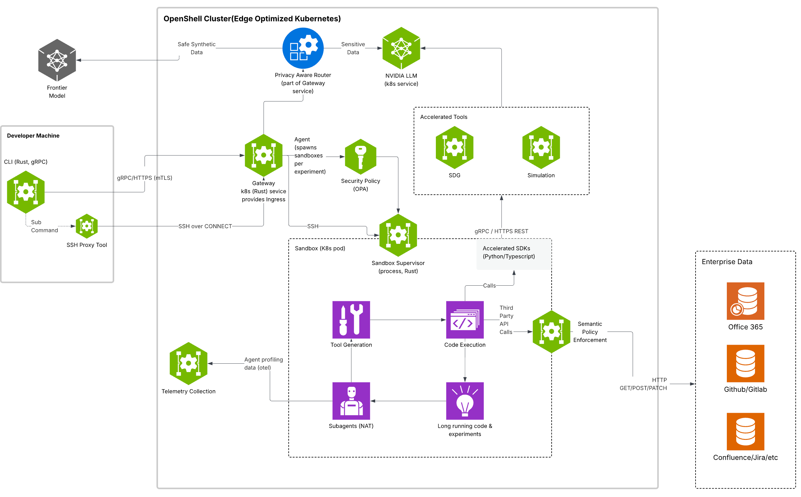
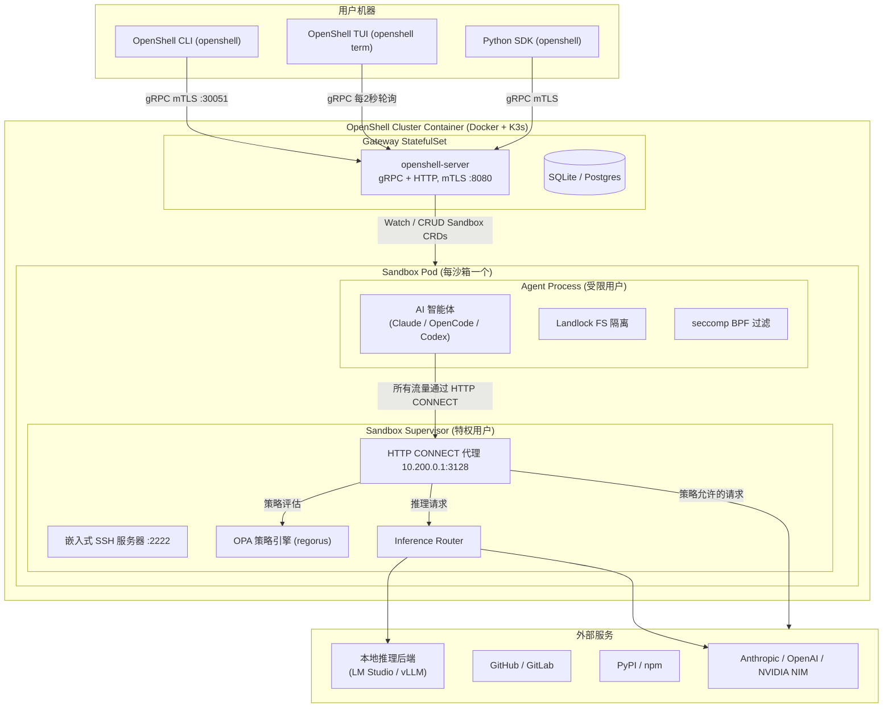

## 什么是 OpenShell

`OpenShell` 是 `NVIDIA` 开源的**自治 AI 智能体安全沙箱运行时**（`Safe Private Runtime for Autonomous AI Agents`），`GitHub` 地址为 [https://github.com/NVIDIA/OpenShell](https://github.com/NVIDIA/OpenShell)，官方文档地址为 [https://docs.nvidia.com/openshell/latest/index.html](https://docs.nvidia.com/openshell/latest/index.html)。

当前 AI 编程智能体（如`Claude Code`、`OpenCode`、`Codex`、`GitHub Copilot CLI`等）在开发者本机或云服务器上运行时，往往拥有无限制的文件系统访问权限、任意出站网络权限以及执行任意命令的能力。这种"信任一切"的运行模式带来了严重的安全隐患：智能体可以读取 SSH 私钥、泄露代码仓库、向任意外部服务发送数据，甚至通过第三方依赖投毒导致供应链攻击。

`OpenShell` 正是为了解决这一问题而生。它为每个 AI 智能体提供**独立的隔离容器**（沙箱），通过声明式`YAML`策略文件，从文件系统、网络、进程、推理四个层面全面管控智能体的行为，做到"零信任、最小权限"。策略文件中静态部分（文件系统、进程）在沙箱创建时锁定，动态部分（网络、推理路由）支持在不重启沙箱的情况下热加载，兼顾安全性与灵活性。

> **当前版本状态**：`Alpha`（单用户模式）。`OpenShell` 目前专注于单开发者、单环境、单`Gateway`的使用场景，团队正在向多租户企业部署演进。




## 解决的核心问题

AI 智能体在没有隔离机制的情况下运行，面临以下主要风险：

| 风险类型 | 具体危害 |
|---|---|
| **数据泄露** | 智能体读取`~/.ssh`、`~/.aws`等敏感目录并上传至外部 |
| **凭据滥用** | 智能体将`API Key`泄露给未授权的第三方服务 |
| **基础设施越权** | 智能体通过`kubectl`、`aws CLI` 对生产环境执行破坏性操作 |
| **网络滥用** | 智能体向任意目标发送出站请求，绕过企业安全策略 |
| **供应链攻击** | 恶意包通过代码执行渗透开发者主机 |

`OpenShell` 的解决方案核心是**防御纵深**（`Defense in Depth`）：

- **文件系统隔离**：通过 `Linux Landlock LSM`限制智能体只能访问策略允许的路径。
- **网络隔离**：所有出站流量强制经过`HTTP CONNECT`代理，由`OPA/Rego`策略引擎逐连接审查。
- **进程隔离**：`seccomp BPF`过滤危险系统调用，阻止提权操作。
- **推理层隔离**：`API Key`不直接注入智能体进程，而是通过`Privacy Router`在代理层动态替换，保证凭据不进入智能体内存。


## 架构设计

`OpenShell`采用分层架构：用户侧工具（`CLI / TUI / SDK`）通过`mTLS gRPC`与运行在`Docker`容器内的`K3s`集群通信；集群中的`Gateway`控制平面管理沙箱生命周期，每个沙箱作为独立的`Kubernetes Pod`运行，内置代理、策略引擎和`SSH`服务。



### 组件介绍

#### Gateway（控制平面）

`Gateway`（`openshell-server`）是整个系统的控制平面，部署为`K3s`集群中的`StatefulSet`。它通过单一端口（集群内`8080`，宿主机`NodePort 30051`）同时提供`gRPC`和`HTTP`服务，使用`mTLS`双向认证保障通信安全。

| 核心职责 | 说明 |
|---|---|
| 沙箱生命周期管理 | 通过`Kubernetes CRD`创建、删除、监控沙箱`Pod` |
| 策略存储与下发 | 持久化`YAML`策略并通过`gRPC`下发给沙箱 |
| 凭据管理 | 存储`Provider`（`API Key`、`Token` 等），在运行时安全注入沙箱 |
| SSH 隧道中继 | 将 `CLI` 的`SSH`连接桥接到沙箱内的`SSH`服务器 |
| 推理路由配置 | 存储集群级推理路由，下发`Bundle`给沙箱本地路由器 |
| 日志收集 | 聚合沙箱日志并对外暴露查询接口 |

`Gateway`使用`SQLite`（默认）或`PostgreSQL`持久化数据，支持`SQLite`的持久卷挂载用于生产部署。其内部协议复用器（`MultiplexService`）根据`Content-Type`将`gRPC`和普通`HTTP`流量分流到不同处理器。

#### Sandbox（沙箱）

**每个沙箱是一个独立的`Kubernetes Pod`**，内部运行两类进程：

- **Sandbox Supervisor**（特权用户）：负责代理、策略引擎、`SSH`服务和证书管理，是安全隔离机制的执行者。
- **Agent Process**（受限用户）：实际运行的`AI`智能体进程，受`Landlock`文件系统隔离和`seccomp`系统调用过滤双重约束。

沙箱的网络命名空间（`Network Namespace`）通过`veth`对实现隔离：智能体进程只能访问`10.200.0.2`，所有出站流量经由`10.200.0.1:3128`代理，由`OPA`策略引擎审查后决定放行、路由或拒绝。

#### Policy Engine（策略引擎）

策略引擎基于`OPA/Rego`（通过`regorus Rust crate` 内嵌），在代理中对每一个出站连接进行评估。策略分为静态与动态两类：

| 类型 | 字段 | 是否可热更新 |
|---|---|---|
| 静态 | `filesystem_policy`、`landlock`、`process` | 否（沙箱创建时锁定） |
| 动态 | `network_policies` | 是（`openshell policy set`热加载） |

动态策略通过轮询机制更新：沙箱每`30`秒向`Gateway`拉取最新策略版本，检测到版本变更时原子替换`OPA`引擎实例，旧引擎不中断（最后一个良好版本策略保留）。

#### Privacy Router / Inference Router（推理路由器）

这是`OpenShell`最具特色的设计之一。`AI`智能体访问`inference.local`这个虚拟主机来发起推理请求，代理拦截后：

1. `TLS`终结（`MITM`），解析`HTTP`请求。
2. 检测推理`API`模式（`OpenAI`、`Anthropic`等格式）。
3. **剥离智能体携带的凭据，注入真实的后端 API Key**，再转发给实际推理后端。

这确保了`AI`智能体**永远不会直接持有真实的 API Key**，即使智能体被攻击或被操纵，也无法将凭据泄露给攻击者。

支持的推理协议：

| 协议 | 路径 | 方法 |
|---|---|---|
| `openai_chat_completions` | `/v1/chat/completions` | `POST` |
| `openai_completions` | `/v1/completions` | `POST` |
| `openai_responses` | `/v1/responses` | `POST` |
| `anthropic_messages` | `/v1/messages` | `POST` |
| `model_discovery` | `/v1/models` / `/v1/models/*` | `GET` |

#### TUI（终端用户界面）

`openshell term`启动一个受`k9s`启发的实时终端仪表盘，无需反复输入 CLI 命令即可监控集群状态：

```
┌─────────────────────────────────────────────────────────────────┐
│  OpenShell ─ my-cluster ─ Dashboard  ● Healthy                  │
├─────────────────────────────────────────────────────────────────┤
│  (Dashboard or Sandboxes view content)                          │
├─────────────────────────────────────────────────────────────────┤
│  [1] Dashboard  [2] Sandboxes  │  [?] Help  [q] Quit            │
├─────────────────────────────────────────────────────────────────┤
│  :                                                              │
└─────────────────────────────────────────────────────────────────┘
```

`Dashboard`视图展示集群整体状态、Provider 配置和全局设置；`Sandboxes`视图展示所有沙箱的名称、状态、年龄、镜像和 Provider 信息，状态以颜色区分（绿色=就绪，黄色=启动中，红色=错误）。

#### Provider（凭据管理）

`Provider`是`OpenShell`对外部服务凭据的一级抽象实体，每个`Provider`具有名称（`name`）、类型（`type`）、凭据映射（`credentials`）和配置映射（`config`）。

内置的`Provider`类型及自动发现机制：

| Provider 类型 | 自动发现的环境变量 | 自动发现的配置文件 |
|---|---|---|
| `claude` | `ANTHROPIC_API_KEY`、`CLAUDE_API_KEY` | `~/.claude.json`、`~/.claude/credentials.json` |
| `opencode` | `OPENCODE_API_KEY`、`OPENROUTER_API_KEY`、`OPENAI_API_KEY` | `~/.config/opencode/config.json` |
| `codex` | `OPENAI_API_KEY` | `~/.config/codex/config.json` |
| `github` | `GITHUB_TOKEN`、`GH_TOKEN` | `~/.config/gh/hosts.yml` |
| `gitlab` | `GITLAB_TOKEN`、`GLAB_TOKEN`、`CI_JOB_TOKEN` | `~/.config/glab-cli/config.yml` |
| `nvidia` | `NVIDIA_API_KEY` | — |

凭据在沙箱内通过占位符替换机制注入：智能体进程看到的是占位符环境变量，代理在出站请求时将占位符替换为真实凭据后再转发。


### 保护层级

`OpenShell`在四个层面实施防御：

| 层级 | 保护内容 | 何时生效 |
|---|---|---|
| **文件系统** | 防止读写策略外路径（基于`Landlock LSM`） | 沙箱创建时锁定 |
| **网络** | 阻断未授权出站连接（基于`OPA/Rego` + `HTTP CONNECT`代理） | 运行时热加载 |
| **进程** | 阻止提权和危险系统调用（基于`seccomp BPF`） | 沙箱创建时锁定 |
| **推理** | 凭据不注入智能体，API 调用强制经过受控路由 | 运行时热加载 |

网络策略支持 L7（应用层）粒度的控制，例如允许`GET /repos`但拒绝`POST /repos`（防止写操作），且无需重启沙箱即可动态生效。


## 安装与部署

### 前置条件

- 已安装并运行`Docker`（`Docker Desktop` 或 `Docker Daemon`）。
- `Linux` 主机（用于 `GPU` 支持）或`macOS`/`Linux`开发机（基本功能）。

### 安装 OpenShell CLI

**方式一：Install Script（推荐）**

```bash
curl -LsSf https://raw.githubusercontent.com/NVIDIA/OpenShell/main/install.sh | sh
```

**方式二：通过 PyPI（需要 uv）**

```bash
uv tool install -U openshell
```

安装完成后可验证：

```bash
openshell --version
```

### 初始化 Gateway

首次创建沙箱时`Gateway`会自动初始化：

```bash
openshell sandbox create -- claude
```

`CLI`会自动在`Docker`中启动一个包含`K3s`的容器，并在其中部署`Gateway`和沙箱。若需要连接到远程主机：

```bash
openshell sandbox create --remote user@host -- claude
```


## 策略配置

策略文件为`YAML`格式，包含静态和动态两部分。以下是完整的策略结构示例：

```yaml
version: 1

# 静态部分：文件系统策略（沙箱创建时锁定）
filesystem_policy:
  include_workdir: true   # 自动将 --workdir 加入 read_write
  read_only:
    - /usr
    - /lib
    - /proc
    - /dev/urandom
    - /app
    - /etc
    - /var/log
  read_write:
    - /sandbox
    - /tmp
    - /dev/null

# 静态部分：Landlock LSM 兼容性
landlock:
  compatibility: best_effort   # best_effort | strict

# 静态部分：进程策略
process:
  run_as_user: sandbox
  run_as_group: sandbox

# 动态部分：网络策略（可热更新）
network_policies:
  github_api:                  # 策略块名称（任意标识符）
    name: github-api-readonly
    endpoints:
      - host: api.github.com
        port: 443
        protocol: rest         # rest | grpc | inference（用于推理路由）
        enforcement: enforce   # enforce | monitor（仅记录不拦截）
        access: read-only      # read-only | read-write（HTTP 方法预设）
    binaries:
      - { path: /usr/bin/curl }
      - { path: /usr/bin/git }
```

### 应用策略到运行中的沙箱

```bash
# 应用策略（热加载，无需重启）
openshell policy set my-sandbox --policy examples/policy.yaml

# 等待策略加载完成再返回
openshell policy set my-sandbox --policy examples/policy.yaml --wait

# 查看当前生效策略
openshell policy get my-sandbox
```


## 使用示例

### 示例一：创建基础沙箱并运行 Claude Code

```bash
# 1. 确保 ANTHROPIC_API_KEY 已设置
export ANTHROPIC_API_KEY=sk-ant-xxx

# 2. 创建 Provider（CLI 会自动从环境变量发现）
openshell provider create --type claude --from-existing

# 3. 创建沙箱并启动 Claude Code
openshell sandbox create -- claude

# 4. 此时 Claude Code 在沙箱内以最小权限运行
# 默认网络策略为 deny-all，Claude 只能访问 Anthropic API
```

### 示例二：网络策略演示（默认拒绝 + 动态放行）

```bash
# 1. 创建一个无 Provider 的裸沙箱（网络完全拒绝）
openshell sandbox create \
  --name policy-demo \
  --keep \
  --no-auto-providers \
  --no-tty \
  -- echo "sandbox ready"

# 2. 进入沙箱，测试被阻断的请求
openshell sandbox connect policy-demo
sandbox$ curl -sS https://api.github.com/zen
# → curl: (56) Received HTTP code 403 from proxy after CONNECT

# 3. 退出沙箱，在宿主机应用 GitHub API 只读策略
sandbox$ exit
openshell policy set policy-demo --policy policy.yaml --wait

# 4. 重新进入沙箱，验证 GET 请求已放行
openshell sandbox connect policy-demo
sandbox$ curl -sS https://api.github.com/zen
# → Anything added dilutes everything else.

# 5. 验证 POST 请求被 L7 策略拦截
sandbox$ curl -sS -X POST https://api.github.com/repos/octocat/hello-world/issues \
  -d '{"title":"oops"}'
# → {"error":"policy_denied","detail":"POST /repos/... not permitted by policy"}
```

### 示例三：配置本地推理路由（使用 NVIDIA NIM）

```bash
# 1. 创建 NVIDIA Provider
openshell provider create --name nvidia --type nvidia \
  --credential NVIDIA_API_KEY

# 2. 配置集群推理路由
openshell inference set \
  --provider nvidia \
  --model meta/llama-3.1-8b-instruct

# 3. 创建沙箱，智能体通过 inference.local 访问模型
openshell sandbox create \
  --policy examples/local-inference/sandbox-policy.yaml \
  -- claude

# 4. 沙箱内智能体调用 inference.local 时，不持有任何真实 API Key
# OpenShell 自动将请求路由到 NVIDIA NIM 并注入凭据
```

### 示例四：运行 OpenClaw 智能体沙箱

```bash
# 使用社区沙箱镜像启动 OpenClaw，转发 18789 端口
openshell sandbox create --forward 18789 --from openclaw -- openclaw-start

# 访问 OpenClaw Web 控制台
open http://127.0.0.1:18789/
```

### 示例五：GPU 直通沙箱（实验性）

```bash
# 在支持 NVIDIA GPU 的主机上，自动引导 GPU 网关
openshell sandbox create \
  --gpu \
  --from ghcr.io/my-org/gpu-sandbox:latest \
  -- Claude
```


## 常用命令速查

| 命令 | 说明 |
|---|---|
| `openshell sandbox create -- <agent>` | 创建沙箱并启动智能体 |
| `openshell sandbox connect [name]` | `SSH` 进入运行中的沙箱 |
| `openshell sandbox list` | 列出所有沙箱 |
| `openshell sandbox delete <name>` | 删除沙箱 |
| `openshell sandbox logs <name> --tail` | 实时流式查看沙箱日志 |
| `openshell provider create --type <t> --from-existing` | 从本地环境自动发现并创建 `Provider` |
| `openshell provider list` | 列出所有 `Provider` |
| `openshell policy set <name> --policy file.yaml` | 对运行中沙箱应用或更新策略 |
| `openshell policy get <name>` | 查看当前生效策略 |
| `openshell inference set --provider <p> --model <m>` | 配置集群推理路由 |
| `openshell inference get` | 查看当前推理路由配置 |
| `openshell term` | 启动实时终端仪表盘 |
| `openshell status` | 检查 `Gateway` 健康状态 |


## 支持的智能体

| 智能体 | 沙箱来源 | Provider 凭据 |
|---|---|---|
| `Claude Code` | `base`（内置） | `ANTHROPIC_API_KEY` |
| `OpenCode` | `base`（内置） | `OPENAI_API_KEY` 或 `OPENROUTER_API_KEY` |
| `Codex` | `base`（内置） | `OPENAI_API_KEY` |
| `GitHub Copilot CLI` | `base`（内置） | `GITHUB_TOKEN` 或 `COPILOT_GITHUB_TOKEN` |
| `OpenClaw` | 社区镜像 | `OPENCLAW_API_KEY` |
| `Ollama` | 社区镜像 | — |


## 显著优点

### 零信任最小权限

传统的`AI`智能体运行在开发者主机上，默认可以访问一切。`OpenShell`扭转这一范式：**一切默认拒绝，策略显式授权**。即使是最受信任的`AI`模型，也在严格的沙箱边界内运行。

### 声明式策略，动态热更新

网络策略是声明式`YAML`，版本化管理，支持在不重启沙箱的情况下热加载。策略变更有完整的版本历史和状态跟踪（`pending`/`loaded`/`failed`），支持回滚到已知良好版本。

### 凭据永不接触智能体内存

`Privacy Router`机制确保`API Key`等敏感凭据**永远只存在于`Supervisor`进程内存**中，智能体进程只持有无意义的占位符，即使智能体被`prompt injection`攻击也无法窃取凭据。

### 本地推理优先，自主可控

通过`inference.local`虚拟端点和推理路由器，可以将智能体的推理请求路由到`vLLM`、`LM Studio`等本地推理服务，无需联网，数据完全自主可控。

### 社区生态与自定义沙箱

通过`--from`参数支持从[OpenShell Community](https://github.com/NVIDIA/OpenShell-Community)镜像库、本地`Dockerfile`或任意容器镜像创建沙箱，便于构建定制化的智能体运行环境（`BYOC —— Bring Your Own Container`）。

### Agent-First 开发理念

`OpenShell`项目本身也遵循智能体驱动的开发工作流：`.agents/skills/`目录中包含用于`CLI`使用、集群调试、推理排障、策略生成等场景的智能体技能文件，所有实现工作均由人工审批后交由智能体执行。这赋予了`OpenShell`独特的自我进化能力。


## 同类项目对比

随着`AI`智能体安全隔离需求的兴起，业界已经出现了若干定位相近的开源和商业项目。以下从部署模式、隔离机制、策略能力、`AI`针对性等维度对它们进行横向比较。

### 主要同类项目简介

- **E2B**（[https://e2b.dev](https://e2b.dev) · GitHub: [e2b-dev/E2B](https://github.com/e2b-dev/E2B) ⭐11.7k）是目前与`OpenShell`最为接近的项目，专为`AI`编程智能体提供云端隔离沙箱，提供开源`SDK`，支持`Python`/`JavaScript`调用。沙箱以轻量虚拟机（`Firecracker microVM`）为基础，启动速度快（约`500ms`），主要用于云端托管场景。

- **Daytona**（[https://daytona.io](https://daytona.io) · GitHub: [daytonaio/daytona](https://github.com/daytonaio/daytona) ⭐72.3k）是一个开源的`AI`代码沙箱基础设施平台，通过`Dev Container`规范提供安全、弹性的执行环境，适用于`AI`生成代码的运行与隔离。

- **gVisor**（[https://gvisor.dev](https://gvisor.dev) · GitHub: [google/gvisor](https://github.com/google/gvisor) ⭐18.1k）是`Google`开源的容器沙箱运行时，通过用户态内核（`Sentry`）拦截系统调用实现强隔离，与`containerd`/`Docker`集成，是通用的容器安全加固方案，不针对`AI`智能体场景。

- **Kata Containers**（[https://katacontainers.io](https://katacontainers.io) · GitHub: [kata-containers/kata-containers](https://github.com/kata-containers/kata-containers) ⭐7.8k）通过轻量虚拟机为每个容器提供强隔离，与`OCI`运行时兼容，安全隔离强度高，但资源开销相对更大，同样不专门针对`AI`场景。

- **Runloop**（[https://runloop.ai](https://runloop.ai)）是面向`AI`智能体的云端沙箱平台，提供托管的隔离执行环境和文件系统快照能力，商业闭源，以`SaaS API`形式提供服务。

- **Modal**（[https://modal.com](https://modal.com)）是云端无服务器计算平台，提供容器化隔离执行，面向通用`AI/ML` 工作负载，不专注`AI`智能体安全策略。

- **Firejail**（GitHub: [netblue30/firejail](https://github.com/netblue30/firejail) ⭐7.3k）是 `Linux` 下的通用应用沙箱工具，利用`Linux namespace`和`seccomp`提供轻量隔离，成熟稳定，但缺乏`AI`智能体专用的凭据管理和推理路由能力。

- **OpenSandbox**（[https://open-sandbox.ai](https://open-sandbox.ai) · GitHub: [alibaba/OpenSandbox](https://github.com/alibaba/OpenSandbox)）是阿里巴巴开源的**通用 AI 应用沙箱平台**，提供Python/Java/TypeScript/Go/C# 多语言`SDK`、统一沙箱生命周期`API`，以及`Docker`/`Kubernetes`两种运行时，覆盖编程智能体（`Claude Code`/`Gemini CLI`/`Codex`等）、浏览器自动化（`Playwright`/`Chrome VNC`）、桌面环境和强化学习训练等场景。底层支持`gVisor`、`Kata Containers`、`Firecracker microVM`等安全容器运行时加固，内置`Ingress` + `Egress`流量管控，并提供`MCP Server`直接集成`LLM`工具调用链。已入选`CNCF Landscape`。

### 功能对比表

| 特性 | OpenShell | E2B | gVisor | Kata Containers | Daytona | OpenSandbox | Firejail |
|---|---|---|---|---|---|---|---|
| **GitHub ⭐** | [NVIDIA/OpenShell](https://github.com/NVIDIA/OpenShell) ⭐5k | [e2b-dev/E2B](https://github.com/e2b-dev/E2B) ⭐11.7k | [google/gvisor](https://github.com/google/gvisor) ⭐18.1k | [kata-containers/kata-containers](https://github.com/kata-containers/kata-containers) ⭐7.8k | [daytonaio/daytona](https://github.com/daytonaio/daytona) ⭐72.3k | [alibaba/OpenSandbox](https://github.com/alibaba/OpenSandbox) | [netblue30/firejail](https://github.com/netblue30/firejail) ⭐7.3k |
| **开源协议** | `Apache 2.0` | `Apache 2.0` | `Apache 2.0` | `Apache 2.0` | `AGPL-3.0` | `Apache 2.0` | `GPL-2.0` |
| **部署模式** | 自托管（本地/远程） | 云托管为主 | 自托管 | 自托管 | 自托管 | 自托管（Docker/K8s）| 本地 |
| **AI 智能体专用** | ✅ | ✅ | ❌ | ❌ | ❌ | ✅ | ❌ |
| **网络策略（L4）** | ✅ `OPA/Rego` | 基础隔离 | ✅ | ✅ | ❌ | ✅ Egress 控制 | ✅ `namespace` |
| **网络策略（L7）** | ✅ `HTTP` 方法级 | ❌ | ❌ | ❌ | ❌ | ❌ | ❌ |
| **策略热更新** | ✅ 无需重启 | ❌ | ❌ | ❌ | ❌ | ❌ | ❌ |
| **文件系统隔离** | ✅ `Landlock LSM` | ✅ VM 隔离 | ✅ | ✅ VM 隔离 | ✅ Docker 容器 | ✅ Docker 容器 | ✅ `namespace` |
| **进程隔离** | ✅ `seccomp BPF` | ✅ VM 隔离 | ✅ 用户态内核 | ✅ VM 隔离 | 基础 | ✅ 可选安全运行时 | ✅ `seccomp` |
| **凭据安全注入** | ✅ 占位符替换 | ❌ | ❌ | ❌ | ❌ | ❌ | ❌ |
| **推理路由（Privacy Router）** | ✅ | ❌ | ❌ | ❌ | ❌ | ❌ | ❌ |
| **GPU 直通** | ✅ 实验性 | ✅ | ❌ | ✅ | ❌ | ❌ | ❌ |
| **自定义沙箱镜像（BYOC）** | ✅ | ✅ | ✅ | ✅ | ✅ | ✅ | ❌ |
| **SSH 访问沙箱** | ✅ | ✅ | ❌ | ❌ | ✅ | ❌ | ❌ |
| **MCP Server 支持** | ❌ | ❌ | ❌ | ❌ | ✅ | ✅ | ❌ |
| **多语言 SDK** | Python | Python/JS | ❌ | ❌ | Python/TS/Go/Ruby/Java | Python/Java/TS/Go/C# | ❌ |
| **Kubernetes 原生** | ✅ K3s | ❌ | ✅ | ✅ | ❌ | ✅ | ❌ |
| **终端仪表盘（TUI）** | ✅ | ❌ | ❌ | ❌ | ❌ | ❌ | ❌ |
| **启动速度** | 中（K3s 初始化） | 快（~500ms） | 中 | 慢（VM 启动） | 中（含预热池）| 中 | 快 |
| **成熟度** | `Alpha` | `GA` | `GA` | `GA` | `GA` | `Beta` | `GA` |

### 选型建议

| 场景 | 推荐方案 |
|---|---|
| 本地/私有化部署 AI 智能体，需完整安全策略 | **OpenShell** |
| 云端快速启动 AI 沙箱，不关心自托管 | **E2B** 或 **Runloop** |
| 通用容器安全加固，不涉及 AI 场景 | **gVisor** 或 **Kata Containers** |
| 开发环境标准化（非安全隔离目的） | **Daytona** |
| 通用 AI 应用平台，需 K8s 大规模调度与多语言 SDK | **OpenSandbox** |
| 单机简单应用沙箱 | **Firejail** |

`OpenShell`的核心差异化在于：它是目前唯一将**L7 网络策略热更新**、**凭据占位符隔离**、**推理 API 路由**三者合一、专门面向 AI 编程智能体设计的自托管开源方案。对于有私有化部署需求、对 AI 智能体凭据安全有严格要求的团队，`OpenShell`是目前最接近生产就绪的选择。

---

## 总结

`OpenShell`代表了`AI`智能体基础设施安全的一个重要方向：当`AI`编程助手逐渐具备自主执行代码、访问网络和操作文件系统的能力时，如何在不牺牲效率的前提下为其套上可控的"围栏"，成为每个企业和开发团队必须面对的课题。`OpenShell`通过`Linux`内核安全机制（`Landlock`、`seccomp`）、应用层策略引擎（`OPA/Rego`）、隐私路由器和声明式策略的有机结合，提供了一套生产级的解决方案参考，值得在`AI`智能体大规模落地之前认真研究和部署。
