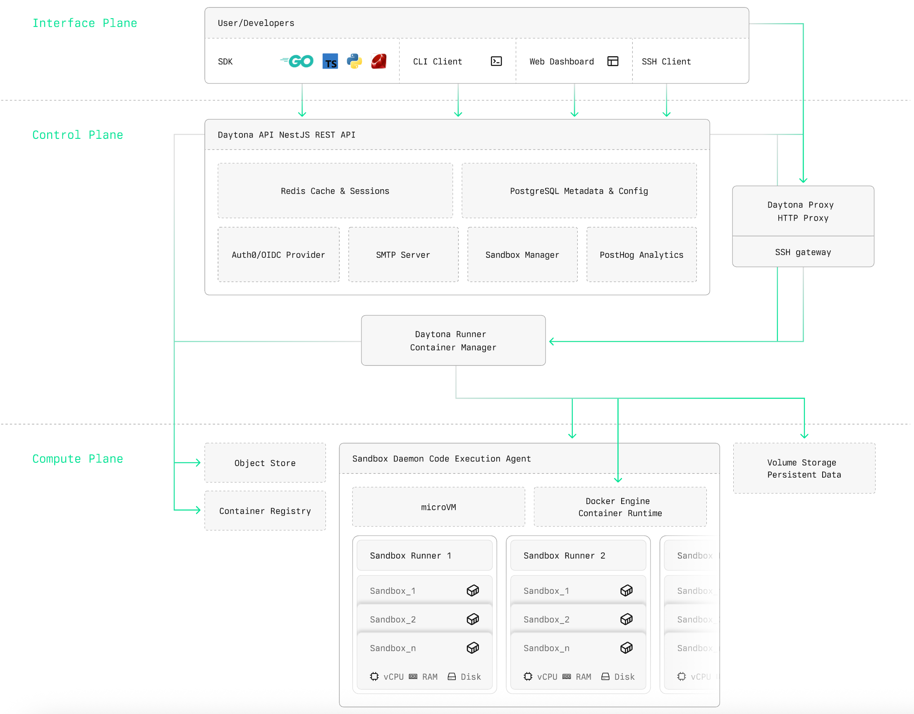
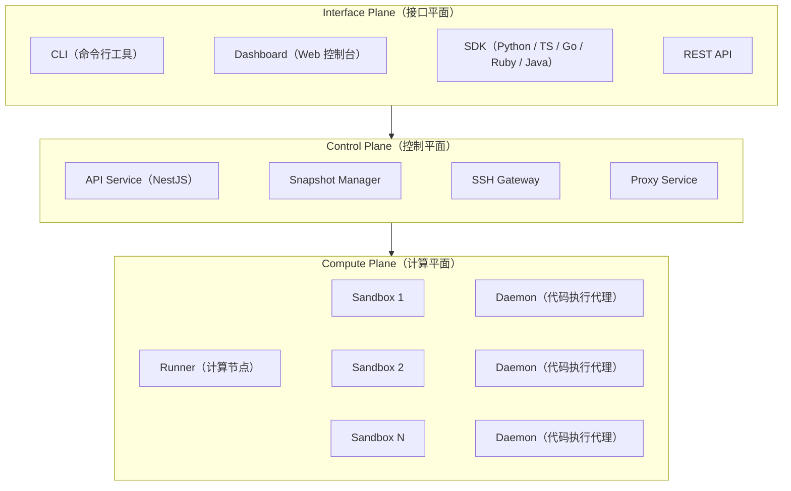
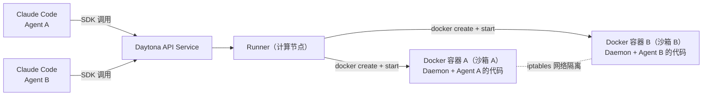

## 什么是 Daytona

`Daytona`是一个**开源的安全弹性基础设施运行时**，专为`AI`生成代码的安全执行与智能体工作流设计，项目地址为 [https://github.com/daytonaio/daytona](https://github.com/daytonaio/daytona)。

`Daytona`的核心抽象是**沙箱（Sandbox）**——一种完全隔离的可组合计算单元，具备独立的内核、文件系统、网络栈以及独立分配的`vCPU`、`RAM`与磁盘资源。沙箱从创建到可执行代码的时间不超过`90ms`，原生支持`Python`、`TypeScript`和`JavaScript`三种语言的代码执行。基于`OCI/Docker`兼容性、大规模并行化能力以及无限持久化特性，沙箱为智能体工作流提供了一致且可预测的运行环境。

智能体和开发者可以通过`Daytona SDK`、`REST API`和`CLI`与沙箱进行编程交互，覆盖沙箱生命周期管理、文件系统操作、进程与代码执行以及运行时配置等各类操作。`Daytona`的有状态环境 **快照（Snapshot）** 机制支持跨会话的持久化智能体操作，使其成为构建`AI`智能体架构的理想底层基础设施。



## 解决的核心问题

在`AI`智能体（`Agent`）系统日趋成熟的今天，让`LLM`（大语言模型）直接生成并在生产环境中执行代码是一个显著的安全隐患。现有方案在安全性、弹性与开发体验上存在以下痛点：

| 问题 | Daytona 的解法 |
|---|---|
| `LLM`生成的代码直接运行在宿主机，存在系统命令注入、文件越权等安全风险 | 每个沙箱拥有独立内核与网络栈，完全隔离于宿主机和其他沙箱 |
| 传统`Docker`容器启动缓慢（秒级），无法满足智能体实时响应需求 | 沙箱冷启动时间不超过`90ms`，显著降低智能体响应延迟 |
| 代码执行环境难以跨会话保持状态，智能体任务中断后无法恢复 | 提供有状态快照机制，支持沙箱状态持久化与跨会话恢复 |
| 多智能体并发执行时资源竞争严重，扩缩容复杂 | 基于弹性计算平面（`Compute Plane`），支持大规模并行沙箱调度 |
| 开发者需要同时维护多套语言运行时和环境配置 | 统一的`SDK`接口支持`Python`/`TypeScript`/`Go`/`Ruby`/`Java`等多语言 |
| 缺乏对智能体与沙箱交互的细粒度观测与审计能力 | 内置`OpenTelemetry`支持、审计日志及`Webhook`事件机制 |

## 核心优势

### 极速冷启动

沙箱从创建到可执行代码的时间控制在`90ms`以内，无论是单次按需执行还是大批量并行任务，都能获得极低的启动延迟。这一特性是通过预热池（`Warm Pool`）机制实现的：系统提前创建并保持一批待命的沙箱实例，在接受请求时直接分配，而非从零创建。

### 完全资源隔离

每个沙箱都是一个完整的虚拟计算节点，拥有独立分配的`vCPU`、内存和磁盘配额。沙箱之间以及沙箱与宿主机之间在默认情况下完全网络隔离，从根本上杜绝了跨租户数据泄露及宿主机被攻击的风险。

### 有状态快照

`Daytona`支持将沙箱当前状态（文件系统、已安装软件包、运行上下文等）保存为**快照（Snapshot）**，后续创建沙箱时可直接基于快照启动，无需重复初始化环境，大大缩短了依赖项安装等预热时间。

### 多语言 SDK 支持

官方提供`Python`、`TypeScript`、`Go`、`Ruby`和`Java`五种语言的`SDK`，以及基于`OpenAPI`自动生成的`REST API`客户端和`Toolbox API`客户端，可无缝集成到现有的智能体框架和应用代码中。

### 开放可扩展

`Daytona`以`Apache-2.0`/`AGPL-3.0`协议开源，支持完全自托管部署（基于`Docker Compose`），也可使用官方托管服务`app.daytona.io`，还支持混合模式——`Daytona`控制平面托管，计算节点在自有机器上运行。


## 架构设计

`Daytona`平台采用**三平面架构**，各平面职责清晰、边界明确：



### 接口平面（Interface Plane）

接口平面为用户和智能体提供与`Daytona`平台交互的所有入口，包括：

- **CLI**：`Go`实现的命令行工具，提供沙箱管理的核心操作入口
- **Dashboard**：基于`Web`的可视化控制台，用于沙箱管理、日志查看与实时监控
- **SDK**：多语言客户端库，是智能体与沙箱交互的主要编程接口
- **REST API**：基于`OpenAPI`规范的`HTTP`接口，所有`SDK`底层均调用此`API`

### 控制平面（Control Plane）

控制平面负责编排所有沙箱操作，是`Daytona`平台的"大脑"。

#### API Service

基于`NestJS`框架实现的`RESTful`服务，是所有平台操作的主要入口点。负责：

- 沙箱的生命周期管理（创建、启动、停止、归档、删除）
- 快照的构建、存储与版本管理
- 用户认证（`OIDC`/`JWT`）与`API Key`管理
- 组织级配额与计费管理
- 路由请求至计算平面的`Runner`节点

#### Snapshot Manager

快照管理器负责协调沙箱快照的创建流程：

- 触发`Runner`对指定沙箱执行快照操作
- 将快照镜像推送至`OCI`镜像仓库（内置`Harbor`/`Registry`）
- 维护快照的元数据与区域分发信息

#### SSH Gateway

独立运行的`SSH`网关，接受已认证的`SSH`连接请求，将其转发至对应沙箱内的`Daemon`进程，提供完整的终端访问能力。

#### Proxy Service

反向代理服务，为沙箱内运行的`Web`应用提供预览`URL`路由（格式如`http://{{PORT}}-{{sandboxId}}.proxy.domain`）及自定义域名代理能力。

### 计算平面（Compute Plane）

计算平面负责实际运行和管理沙箱实例。

#### Runner（计算节点）

`Runner`是`Daytona`计算平面的核心组件，以`Go`实现，部署在实际的计算节点上。每个`Runner`：

- 接受控制平面的调度指令，负责沙箱的创建、启停、销毁
- 维护本节点上所有沙箱的运行状态
- 上报节点资源使用情况（`CPU`/内存/磁盘），供控制平面进行调度决策
- 管理沙箱镜像的本地缓存与镜像拉取

#### Sandbox（沙箱）

沙箱是`Daytona`的核心执行单元，基于`OCI`容器技术实现，每个沙箱拥有：

- 独立分配的`vCPU`、内存和磁盘资源
- 完整的独立网络栈（可配置网络隔离模式）
- 持久化文件系统（支持挂载持久化卷）
- 内置`Git`支持与代码仓库操作能力

**沙箱的底层容器实现**

`Daytona`的沙箱底层是标准的`Docker`容器。`Runner`组件直接调用`Docker SDK`（`github.com/docker/docker/client`）来创建和管理容器，每个沙箱对应宿主机上的一个独享`Docker`容器。以多个`Claude Code`编码智能体为例，其运行关系如下：



几个关键实现细节值得关注：

- **启动即容器**：调用`daytona.create()`时，`Runner`会执行`docker create` + `docker start`，在宿主机上创建一个独立的`Docker`容器，容器的`Hostname`即为沙箱`ID`
- **Daemon 注入**：容器的`entrypoint`被替换为`Daytona Daemon`二进制（以只读`bind-mount`方式注入），`Daemon`在容器内启动后作为`Toolbox API`服务端运行，`SDK`通过`HTTP`与之通信
- **特权模式**：容器以`--privileged`特权模式运行，这是`Daemon`进程能执行任意代码所必需的
- **冷启动加速**：`<90ms`冷启动依赖**预热池（`Warm Pool`）**机制——`Runner`提前创建并保持一批待命容器，新请求到来时直接分配，而非从零执行`docker create`
- **网络双重隔离**：容器间网络隔离不仅依赖`Docker`原生网络，还在宿主机上通过`iptables`规则（`NetRulesManager`）对每个容器的`IP`单独设置出入站访问控制，实现更细粒度的网络管控
- **资源配额**：`CPUQuota`、`Memory`、`MemorySwap`直接映射到`container.HostConfig.Resources`，磁盘配额在`xfs`文件系统上通过`StorageOpt size`实现
- **Docker-in-Docker（DinD）**：`Runner`本身以`docker:28.2.2-dind-alpine3.22`为基础镜像构建，容器启动时先运行`dockerd-entrypoint.sh`在容器内拉起`Docker`守护进程，再启动`daytona-runner`二进制。因此`Runner`自带完整的`Docker`引擎，部署时`runner`服务无需挂载宿主机的`/var/run/docker.sock`，只需设置`privileged: true`即可。

**运行时支持范围**

`Daytona`目前**仅支持`Docker`作为容器运行时后端**，不支持直接对接裸`containerd`守护进程或通过`CRI`接口（如`cri-containerd`、`CRI-O`）接入容器运行时，也没有`Kubernetes Adapter`。尽管项目的`go.mod`中可以看到`github.com/containerd/containerd/v2`等大量`containerd`相关包，但它们全部是`github.com/docker/docker`客户端`SDK`的**传递依赖**，`Daytona`自身代码只引用了`containerd/errdefs`用于错误类型判断（如`errdefs.IsConflict(err)`），并不调用`containerd`的运行时`API`。

值得了解的是，`Docker Engine`自`1.11`版本起已在内部将`containerd`作为默认容器运行时（通过`shim`调用），所以`Daytona`通过`Docker`间接使用了`containerd`，但这对用户完全透明——部署`Daytona`只需保证宿主机（或`DinD`容器内）有可用的`Docker Engine`即可，无需额外安装`containerd`客户端。

同理，`Daytona`也**没有`Kubernetes`集成**：`API Service`的`runner-adapter`目录中只有`v0`和`v2`两个版本的适配器（均为`HTTP API`封装），无`K8s Operator`或`Pod`调度能力。计算节点的选择完全由`API Service`内置的自研调度器管理（基于`CPU`使用率、内存、磁盘、已分配资源等七维加权打分），与`Kubernetes`调度器无关。

#### Daemon（执行代理）

`Daemon`是运行在每个沙箱内部的代码执行代理，以`Go`实现，提供`Toolbox API`服务：

| 功能模块 | 说明 |
|---|---|
| `process` | 进程执行（`exec`命令、`code_run`代码解释）|
| `fs` | 文件系统操作（上传、下载、搜索、替换）|
| `git` | `Git`仓库操作（克隆、提交、推送等）|
| `lsp` | 语言服务器协议支持（代码补全、诊断）|
| `terminal` | 伪终端（`PTY`）会话管理 |
| `session` | 有状态代码解释器会话 |
| `computeruse` | 计算机使用能力（屏幕截图、鼠标键盘控制）|
| `recording` | 终端会话录制 |
| `ssh` | `SSH`服务端，供`SSH Gateway`转发连接 |

### 数据存储与中间件

`Daytona`控制平面依赖以下存储与中间件组件：

| 组件 | 用途 |
|---|---|
| `PostgreSQL` | 沙箱、快照、组织、用户等核心元数据存储 |
| `Redis` | 分布式锁、缓存与会话状态 |
| `MinIO`（`S3`兼容）| 快照镜像的对象存储后端 |
| `OCI Registry`（`Harbor`）| 沙箱镜像的`OCI`格式存储与分发 |
| `Dex`（`OIDC Provider`）| 身份认证与`SSO`集成 |


## 核心功能详解

### 沙箱（Sandbox）

沙箱是`Daytona`最核心的概念。每个沙箱在创建时可以配置以下关键参数：

| 参数 | 类型 | 说明 |
|---|---|---|
| `image` | `string` | 基础镜像（如`python:3.12-slim`） |
| `language` | `string` | 代码解释器语言（`python`/`javascript`/`typescript`）|
| `resources.cpu` | `int` | 分配的`vCPU`核数 |
| `resources.memory` | `int` | 分配的内存（单位：`GB`）|
| `resources.disk` | `int` | 分配的磁盘（单位：`GB`）|
| `volumes` | `list` | 挂载的持久化卷列表 |
| `network_block_all` | `bool` | 是否完全阻断网络访问 |
| `network_allow_list` | `string` | 网络白名单（`CIDR`格式）|
| `labels` | `dict` | 自定义标签，用于分类与筛选 |
| `auto_archive` | `bool` | 是否自动归档（暂停不活跃沙箱）|
| `auto_delete` | `bool` | 是否自动删除（归档后自动清理）|

**沙箱规格（Class）**

`Daytona`使用`class`字段区分三种预置规格，对应不同的资源配置：

| 规格 | vCPU | 内存 | 磁盘 |
|---|---|---|---|
| `small`（默认）| 4 核 | 8 GB | 30 GB |
| `medium` | 8 核 | 16 GB | 60 GB |
| `large` | 12 核 | 24 GB | 90 GB |

自托管部署时，以上配额直接映射到`Docker`容器的`HostConfig.Resources`（`CPUQuota`、`Memory`），可视宿主机配置自行调整。

**沙箱是"任务粒度"而非"用户粒度"**

`Daytona`的沙箱不是"每个开发者永久占用一个容器"，而是**按智能体任务的生命周期来创建和销毁容器**。以`Codex CLI`为例：`Codex CLI`本身运行在开发者的本地机器上，它调用`Daytona SDK`在沙箱中安全执行所生成的代码——一个`Codex CLI`编码会话通常对应**一个**`Daytona`沙箱，会话内的多次命令执行（代码生成、测试、修复……）都在同一个沙箱中进行，状态持续保留，会话结束后沙箱被删除。

这种"任务粒度"的优势在于并行扩展能力：同一个开发者或`AI Agent`可以同时持有并行的多个沙箱——例如批量运行`1000`个独立测试用例时同时启动`1000`个沙箱，每个沙箱独占隔离的`CPU`、内存和文件系统，互不干扰，运行结束后统一销毁。

**规模上限与水平扩展**

`Daytona`没有内置的"最大并发容器数"硬限制，实际容量由以下三个层次共同决定：

| 层次 | 控制机制 |
|---|---|
| 物理资源 | 单台`Runner`宿主机的`CPU`/内存/磁盘总量，Runner 调度以 7 维加权评分选最优节点 |
| 水平扩展 | 向集群注册更多`Runner`节点即可线性扩容，无需改动控制平面 |
| 组织配额 | 管理员可为每个组织设置`totalCpuQuota`和`totalMemoryQuota`（跨 Runner 汇总），超限则拒绝新建沙箱 |

官方托管服务`app.daytona.io`通过多区域（`SHARED`/`DEDICATED`/`CUSTOM`）多`Runner`集群，理论上可以支持数千个沙箱同时运行，具体上限取决于用户购买的资源计划。

**闲置资源自动回收（Auto-Archive）**

容器运行是有成本的，`Daytona`通过**自动归档**机制避免资源浪费：沙箱在无活跃 API 调用超过`autoArchiveInterval`分钟后会被自动归档（默认`7天`，最长`30天`），归档时将容器文件系统快照到对象存储（`MinIO`/`S3`），容器本身被销售，从而释放`Runner`上的`CPU`和内存。下次使用时从快照恢复，整个过程对调用者透明。这意味着**长期不活跃的沙箱不会持续占用算力资源**，只有真正"在跑"的沙箱才消耗宿主机资源。

### 快照（Snapshot）

快照是沙箱状态的持久化镜像，支持：

- **声明式构建**：通过`YAML`配置描述沙箱的依赖环境，由`Daytona`自动构建快照
- **按需创建**：对正在运行的沙箱手动触发快照
- **基于快照创建沙箱**：以某个快照为基础，快速创建新沙箱，跳过依赖安装步骤
- **多区域分发**：快照可在多个计算区域之间分发，加速就近启动

### 卷（Volume）

持久化卷（`Volume`）使数据可以在多个沙箱之间共享或跨生命周期持久化，支持：

- 将同一卷挂载到不同沙箱的不同路径
- 通过`subpath`参数实现多租户数据隔离（每个租户只看到卷的特定子路径）
- 跨沙箱的数据共享（如共享模型文件、数据集等大体积资源）

### 网络控制

`Daytona`提供细粒度的网络访问控制：

- **完全隔离模式**：设置`network_block_all=True`，沙箱无法访问任何外部网络
- **白名单模式**：通过`network_allow_list`指定允许访问的`IP`段或域名
- **默认模式**：沙箱可访问互联网，但与其他沙箱之间网络隔离

### MCP Server

`Daytona`内置`MCP`（`Model Context Protocol`）服务器支持，允许`LLM`通过标准`MCP`协议直接调用沙箱能力（代码执行、文件操作等），无需额外编写工具封装层。

### 计算机使用（Computer Use）

沙箱支持图形化操作能力，通过`VNC`协议和`PTY`终端，`AI`智能体可以操控沙箱内的鼠标、键盘，获取屏幕截图，实现"计算机使用"（`Computer Use`）类任务。


## 安装与配置

### 托管服务快速上手

最快的使用方式是注册`Daytona`官方托管服务：

1. 访问 [app.daytona.io](https://app.daytona.io) 注册账号
2. 在`Dashboard` → `API Keys`页面创建`API Key`
3. 配置环境变量：

```bash
export DAYTONA_API_KEY="your-api-key"
export DAYTONA_API_URL="https://app.daytona.io/api"
```

### 自托管部署（Docker Compose）

`Daytona`支持通过`Docker Compose`完整本地部署，以下是关键部署步骤：

**第一步**，克隆仓库并进入`docker`目录：

```bash
git clone https://github.com/daytonaio/daytona.git
cd daytona/docker
```

**第二步**，修改`docker-compose.yaml`中的关键配置项：

| 配置项 | 说明 | 示例值 |
|---|---|---|
| `ENCRYPTION_KEY` | 数据加密密钥（必须修改）| `your-32-char-secret-key` |
| `ENCRYPTION_SALT` | 加密盐值（必须修改）| `your-salt-value` |
| `DB_PASSWORD` | `PostgreSQL`数据库密码 | `your-db-password` |
| `OIDC_CLIENT_ID` | `OIDC`客户端`ID` | `daytona` |
| `PROXY_DOMAIN` | 代理域名（预览`URL`格式用）| `proxy.yourdomain.com` |
| `DEFAULT_RUNNER_DOMAIN` | 计算节点`Runner`地址 | `runner:3003` |
| `SMTP_HOST` | 邮件服务器（用于邮件通知）| `smtp.example.com` |

**第三步**，启动所有服务：

```bash
docker compose up -d
```

服务正常启动后，`API`服务监听`3000`端口，`Dashboard`可通过 http://localhost:3000/dashboard 访问。

### SDK 安装

各语言`SDK`均可通过对应包管理器安装：

```bash
# Python
pip install daytona

# TypeScript / Node.js
npm install @daytona/sdk

# Go
go get github.com/daytonaio/daytona/libs/sdk-go

# Ruby
gem install daytona
```

### SDK 初始化配置

`SDK`支持环境变量和代码两种配置方式：

**环境变量方式**（推荐用于生产环境）：

```bash
export DAYTONA_API_KEY="your-api-key"
export DAYTONA_API_URL="https://app.daytona.io/api"
export DAYTONA_TARGET="us"   # 指定目标区域
```

**代码初始化方式**（适用于多环境切换）：

```go
import (
    "log"
    "github.com/daytonaio/daytona/libs/sdk-go/pkg/daytona"
    "github.com/daytonaio/daytona/libs/sdk-go/pkg/types"
)

client, err := daytona.NewClientWithConfig(&types.DaytonaConfig{
    APIKey: "your-api-key",
    APIUrl: "https://app.daytona.io/api",
    Target: "us",
})
if err != nil {
    log.Fatal(err)
}
```


## 使用示例

### 示例一：创建沙箱并执行代码

最基础的使用场景——创建一个沙箱，在其中执行`Go`代码并获取结果：

```go
package main

import (
    "context"
    "fmt"
    "log"
    "time"

    "github.com/daytonaio/daytona/libs/sdk-go/pkg/daytona"
    "github.com/daytonaio/daytona/libs/sdk-go/pkg/options"
    "github.com/daytonaio/daytona/libs/sdk-go/pkg/types"
)

func main() {
    client, err := daytona.NewClient()
    if err != nil {
        log.Fatal(err)
    }

    ctx := context.Background()

    // 创建自定义资源配置的沙箱
    params := types.ImageParams{
        SandboxBaseParams: types.SandboxBaseParams{
            Name: "go-sandbox",
        },
        Image: "golang:1.22-bookworm",
        Resources: &types.Resources{
            CPU:    1,
            Memory: 2,
            Disk:   5,
        },
    }
    sandbox, err := client.Create(ctx, params, options.WithTimeout(150*time.Second))
    if err != nil {
        log.Fatal(err)
    }
    defer sandbox.Delete(ctx)

    // 执行 shell 命令
    response, err := sandbox.Process.ExecuteCommand(ctx, `echo "Hello, Daytona!"`)
    if err != nil {
        log.Fatal(err)
    }
    if response.ExitCode != 0 {
        fmt.Printf("执行失败：%d - %s\n", response.ExitCode, response.Result)
    } else {
        fmt.Println(response.Result) // 输出：Hello, Daytona!
    }

    // 编写并运行 Go 程序
    goCode := []byte(`package main
import "fmt"
func main() { fmt.Println("Hello from Daytona sandbox!") }`)
    if err := sandbox.FileSystem.UploadFile(ctx, goCode, "/tmp/main.go"); err != nil {
        log.Fatal(err)
    }
    result, err := sandbox.Process.ExecuteCommand(ctx, "go run /tmp/main.go",
        options.WithExecuteTimeout(30*time.Second),
    )
    if err != nil {
        log.Fatal(err)
    }
    fmt.Println(result.Result) // 输出：Hello from Daytona sandbox!
}
```

### 示例二：沙箱生命周期管理

演示沙箱的完整生命周期操作——创建、停止、重启、列举以及删除：

```go
package main

import (
    "context"
    "fmt"
    "log"
    "time"

    "github.com/daytonaio/daytona/libs/sdk-go/pkg/daytona"
    "github.com/daytonaio/daytona/libs/sdk-go/pkg/options"
    "github.com/daytonaio/daytona/libs/sdk-go/pkg/types"
)

func main() {
    client, err := daytona.NewClient()
    if err != nil {
        log.Fatal(err)
    }

    ctx := context.Background()

    // 创建沙箱并添加标签
    sandbox, err := client.Create(ctx, types.SnapshotParams{
        SandboxBaseParams: types.SandboxBaseParams{
            Labels: map[string]string{"project": "my-agent", "env": "dev"},
        },
    }, options.WithTimeout(90*time.Second))
    if err != nil {
        log.Fatal(err)
    }

    // 停止沙箱（状态保留，不删除资源）
    if err := sandbox.Stop(ctx); err != nil {
        log.Fatal(err)
    }

    // 重新启动沙箱
    if err := sandbox.Start(ctx); err != nil {
        log.Fatal(err)
    }

    // 通过 ID 获取已有沙箱
    existing, err := client.Get(ctx, sandbox.ID)
    if err != nil {
        log.Fatal(err)
    }
    fmt.Printf("沙箱状态: %s\n", existing.State)

    // 列举所有沙箱
    page, limit := 1, 10
    result, err := client.List(ctx, nil, &page, &limit)
    if err != nil {
        log.Fatal(err)
    }
    fmt.Printf("当前共有 %d 个沙箱\n", result.Total)

    // 删除沙箱
    if err := sandbox.Delete(ctx); err != nil {
        log.Fatal(err)
    }
}
```

### 示例三：文件系统操作

演示在沙箱内进行文件上传、下载、搜索以及内容替换等文件系统操作：

```go
package main

import (
    "context"
    "encoding/json"
    "fmt"
    "log"
    "time"

    "github.com/daytonaio/daytona/libs/sdk-go/pkg/daytona"
    "github.com/daytonaio/daytona/libs/sdk-go/pkg/options"
    "github.com/daytonaio/daytona/libs/sdk-go/pkg/types"
)

func main() {
    client, err := daytona.NewClient()
    if err != nil {
        log.Fatal(err)
    }

    ctx := context.Background()
    sandbox, err := client.Create(ctx, types.SnapshotParams{},
        options.WithTimeout(90*time.Second))
    if err != nil {
        log.Fatal(err)
    }
    defer sandbox.Delete(ctx)

    // 创建目录
    if err := sandbox.FileSystem.CreateFolder(ctx, "project",
        options.WithMode("0755")); err != nil {
        log.Fatal(err)
    }

    // 上传脚本文件（从本地路径）
    if err := sandbox.FileSystem.UploadFile(ctx,
        "local_script.go", "project/script.go"); err != nil {
        log.Fatal(err)
    }

    // 上传配置文件（从内存字节）
    configData, _ := json.MarshalIndent(
        map[string]any{"debug": true, "maxConnections": 10}, "", "  ")
    if err := sandbox.FileSystem.UploadFile(ctx,
        configData, "project/config.json"); err != nil {
        log.Fatal(err)
    }

    // 搜索文件
    matches, err := sandbox.FileSystem.FindFiles(ctx, "project", "*.json")
    if err != nil {
        log.Fatal(err)
    }
    fmt.Println("找到的 JSON 文件:", matches)

    // 替换文件内容
    if _, err := sandbox.FileSystem.ReplaceInFiles(ctx,
        []string{"project/config.json"},
        `"debug": true`, `"debug": false`); err != nil {
        log.Fatal(err)
    }

    // 下载文件到本地
    localPath := "local-config.json"
    if _, err := sandbox.FileSystem.DownloadFile(ctx,
        "project/config.json", &localPath); err != nil {
        log.Fatal(err)
    }
}
```

### 示例四：网络隔离与白名单控制

演示如何控制沙箱的网络访问权限，适用于沙箱执行不可信代码时的安全加固：

```go
package main

import (
    "context"
    "fmt"
    "log"
    "time"

    "github.com/daytonaio/daytona/libs/sdk-go/pkg/daytona"
    "github.com/daytonaio/daytona/libs/sdk-go/pkg/options"
    "github.com/daytonaio/daytona/libs/sdk-go/pkg/types"
)

func main() {
    client, err := daytona.NewClient()
    if err != nil {
        log.Fatal(err)
    }

    ctx := context.Background()

    // 完全阻断网络（最高安全级别，适合执行完全不可信的代码）
    sandboxIsolated, err := client.Create(ctx, types.SnapshotParams{
        SandboxBaseParams: types.SandboxBaseParams{
            NetworkBlockAll: true,
        },
    }, options.WithTimeout(90*time.Second))
    if err != nil {
        log.Fatal(err)
    }
    defer sandboxIsolated.Delete(ctx)

    // 仅允许访问指定网段（如内网服务）
    allowList := "10.0.0.0/8,192.168.1.100/32"
    sandboxRestricted, err := client.Create(ctx, types.SnapshotParams{
        SandboxBaseParams: types.SandboxBaseParams{
            NetworkAllowList: &allowList,
        },
    }, options.WithTimeout(90*time.Second))
    if err != nil {
        log.Fatal(err)
    }
    defer sandboxRestricted.Delete(ctx)

    // 在隔离沙箱中测试网络访问
    result, err := sandboxIsolated.Process.ExecuteCommand(ctx,
        `curl -s --max-time 3 https://example.com && echo "网络访问成功" || echo "网络访问被阻断"`)
    if err != nil {
        log.Fatal(err)
    }
    fmt.Println(result.Result)
}
```

### 示例五：持久化卷跨沙箱共享数据

演示如何利用持久化卷在多个沙箱间共享数据，以及通过`subpath`实现多租户隔离：

```go
package main

import (
    "context"
    "fmt"
    "log"
    "time"

    "github.com/daytonaio/daytona/libs/sdk-go/pkg/daytona"
    "github.com/daytonaio/daytona/libs/sdk-go/pkg/options"
    "github.com/daytonaio/daytona/libs/sdk-go/pkg/types"
)

func main() {
    client, err := daytona.NewClient()
    if err != nil {
        log.Fatal(err)
    }

    ctx := context.Background()

    // 创建持久化卷并等待就绪
    volume, err := client.Volume.Create(ctx, "shared-data")
    if err != nil {
        log.Fatal(err)
    }
    volume, err = client.Volume.WaitForReady(ctx, volume, 60*time.Second)
    if err != nil {
        log.Fatal(err)
    }
    defer client.Volume.Delete(ctx, volume)

    // 第一个沙箱：写入数据到卷
    sandbox1, err := client.Create(ctx, types.SnapshotParams{
        SandboxBaseParams: types.SandboxBaseParams{
            Volumes: []types.VolumeMount{
                {VolumeID: volume.ID, MountPath: "/data"},
            },
        },
    }, options.WithTimeout(90*time.Second))
    if err != nil {
        log.Fatal(err)
    }
    defer sandbox1.Delete(ctx)

    if err := sandbox1.FileSystem.UploadFile(ctx,
        []byte("Hello from sandbox1!"), "/data/message.txt"); err != nil {
        log.Fatal(err)
    }

    // 第二个沙箱：从同一卷读取数据
    sandbox2, err := client.Create(ctx, types.SnapshotParams{
        SandboxBaseParams: types.SandboxBaseParams{
            Volumes: []types.VolumeMount{
                {VolumeID: volume.ID, MountPath: "/shared"},
            },
        },
    }, options.WithTimeout(90*time.Second))
    if err != nil {
        log.Fatal(err)
    }
    defer sandbox2.Delete(ctx)

    content, err := sandbox2.FileSystem.DownloadFile(ctx, "/shared/message.txt", nil)
    if err != nil {
        log.Fatal(err)
    }
    fmt.Println("读取到的数据:", string(content)) // 输出：Hello from sandbox1!

    // 多租户隔离：通过 subpath 让不同沙箱只看到卷的特定子路径
    subpath := "users/alice"
    sandboxAlice, err := client.Create(ctx, types.SnapshotParams{
        SandboxBaseParams: types.SandboxBaseParams{
            Volumes: []types.VolumeMount{
                {VolumeID: volume.ID, MountPath: "/home/daytona", Subpath: &subpath},
            },
        },
    }, options.WithTimeout(90*time.Second))
    if err != nil {
        log.Fatal(err)
    }
    defer sandboxAlice.Delete(ctx)
}
```

### 示例六：在 AI 智能体工作流中集成沙箱执行

以下示例展示如何将`Daytona Go SDK`集成到`AI`智能体工作流中，构建一个能在沙箱中安全执行`LLM`所生成`Go`代码的代码生成智能体：

```go
package main

import (
    "context"
    "fmt"
    "log"
    "time"

    "github.com/daytonaio/daytona/libs/sdk-go/pkg/daytona"
    "github.com/daytonaio/daytona/libs/sdk-go/pkg/options"
    "github.com/daytonaio/daytona/libs/sdk-go/pkg/types"
)

// executeLLMCode 在沙箱中安全运行 LLM 生成的 Go 代码，返回执行输出
func executeLLMCode(ctx context.Context, sandbox *daytona.Sandbox, code string) (string, error) {
    // 将代码写入沙箱临时文件
    if err := sandbox.FileSystem.UploadFile(ctx, []byte(code), "/tmp/llm_result.go"); err != nil {
        return "", fmt.Errorf("上传代码失败: %w", err)
    }
    // 编译并执行
    result, err := sandbox.Process.ExecuteCommand(ctx, "go run /tmp/llm_result.go",
        options.WithExecuteTimeout(30*time.Second),
    )
    if err != nil {
        return "", err
    }
    if result.ExitCode != 0 {
        return "", fmt.Errorf("代码执行失败 (exit %d): %s", result.ExitCode, result.Result)
    }
    return result.Result, nil
}

func main() {
    client, err := daytona.NewClient()
    if err != nil {
        log.Fatal(err)
    }

    ctx := context.Background()

    // 为本次智能体任务创建专属沙箱（整个对话周期共享同一沙箱）
    sandbox, err := client.Create(ctx, types.ImageParams{
        SandboxBaseParams: types.SandboxBaseParams{
            Labels: map[string]string{"task": "code-generator", "agent": "llm"},
        },
        Image: "golang:1.22-bookworm",
    }, options.WithTimeout(150*time.Second))
    if err != nil {
        log.Fatal(err)
    }
    defer sandbox.Delete(ctx)

    // ------- 此处调用 LLM 接口获取生成代码（示意，实际替换为 LLM API 调用） -------
    generatedCode := `package main

import "fmt"

func fibonacci(n int, memo map[int]int) int {
    if n <= 1 { return n }
    if v, ok := memo[n]; ok { return v }
    memo[n] = fibonacci(n-1, memo) + fibonacci(n-2, memo)
    return memo[n]
}

func main() {
    memo := make(map[int]int)
    fmt.Println(fibonacci(10, memo)) // 输出：55
}`
    // -----------------------------------------------------------------------

    // 在沙箱中安全执行 LLM 生成的代码，不影响宿主机
    output, err := executeLLMCode(ctx, sandbox, generatedCode)
    if err != nil {
        fmt.Printf("执行失败: %v\n", err)
        return
    }
    fmt.Printf("智能体验证结果：\n%s\n", output)
}
```


## 平台功能总览

`Daytona`的功能体系按用途分为五大类：

### 平台管理（Platform）

面向组织和运维管理员的治理与运营控制功能：

| 功能 | 说明 |
|---|---|
| 组织管理 | 多组织隔离，支持成员、权限与配额管理 |
| `API Key`管理 | 生成、撤销和查看`API`密钥 |
| 配额与限制 | 每个组织可设置`CPU`/内存/磁盘/快照的总量与单沙箱上限 |
| 计费 | 按实际资源使用量计费 |
| 审计日志 | 记录所有操作行为，支持合规审计 |
| `OpenTelemetry` | 基于`OTEL`协议的链路追踪与指标采集 |
| 集成 | 与主流`AI`框架和工具的官方集成指南 |

### 沙箱能力（Sandboxes）

沙箱本身提供的核心计算与存储能力：

| 功能 | 说明 |
|---|---|
| 环境配置 | 基础镜像、资源规格、环境变量等配置 |
| 快照 | 有状态环境快照，支持跨会话恢复 |
| 声明式构建器 | 通过`YAML`描述依赖环境，自动构建快照 |
| 卷存储 | 持久化卷，支持跨沙箱数据共享 |
| 多区域部署 | 在不同地理区域启动沙箱，降低延迟 |

### 智能体工具（Agent Tools）

智能体通过`SDK`或`API`调用的编程能力：

| 功能 | 说明 |
|---|---|
| 进程与代码执行 | `exec`命令执行与有状态代码解释器 |
| 文件系统操作 | 文件上传、下载、搜索、替换等 |
| 语言服务器协议 | `LSP`支持，为`AI`编码智能体提供代码感知能力 |
| 计算机使用 | 截图、鼠标键盘操控、屏幕交互 |
| `MCP Server` | 标准`MCP`协议服务端，供`LLM`直接调用 |
| `Git`操作 | 仓库克隆、提交、分支管理等 |
| 伪终端 | 交互式`PTY`会话 |
| 日志流式传输 | 实时流式获取沙箱执行日志 |

### 人工工具（Human Tools）

供人类用户直接访问和操控沙箱的界面：

| 功能 | 说明 |
|---|---|
| `Dashboard` | `Web`可视化控制台 |
| `Web`终端 | 浏览器内嵌终端，直接访问沙箱 |
| `SSH`访问 | 标准`SSH`客户端连接沙箱 |
| `VNC`访问 | 图形桌面远程访问 |
| `VPN`连接 | 通过`VPN`组网接入沙箱 |
| 预览代理 | 为沙箱内`Web`应用生成可公开访问的预览`URL` |
| 操场（`Playground`）| 在线快速体验沙箱能力 |

### 系统工具（System Tools）

平台级钩子和控制能力：

| 功能 | 说明 |
|---|---|
| `Webhook` | 沙箱生命周期事件的`Webhook`通知 |
| 网络限制 | 细粒度的沙箱出入站网络访问控制 |


## 典型应用场景

### AI 代码生成与验证

在`LLM`代码生成管道中，将`Daytona`作为安全的代码执行沙箱：`LLM`生成代码 → 沙箱中执行并运行测试 → 返回执行结果给`LLM`进行自我修正 → 输出验证通过的代码。这个闭环完全在隔离的沙箱环境中完成，对宿主系统零风险。

### 多租户代码执行平台

构建面向多用户的在线代码执行服务（如`Jupyter`替代方案、在线编程竞赛平台、数据分析工作台）时，利用`Daytona`的快速启动和严格资源隔离特性，每个用户获得独立的计算环境，资源使用互不影响。

### 自动化智能体任务

在复杂的多步骤智能体任务中（如数据分析流水线、代码重构智能体、`DevOps`自动化），利用`Daytona`快照功能保存中间状态，允许任务在中断后从检查点恢复，避免从头重新执行耗时的初始化步骤。

### 安全沙箱化插件执行

在插件化架构的`AI`产品中（如编程助手、数据科学工具），用户安装和运行的第三方插件或工具在`Daytona`沙箱中执行，天然隔离于主应用进程，防止恶意插件对系统造成影响。


## 与同类项目的对比

以下对比基于三个项目的公开源码与官方文档，围绕定位、安全模型、SDK 支持、部署方式、网络控制、AI 集成等核心维度展开。

### OpenSandbox（阿里巴巴）

`OpenSandbox` 以**协议标准化**为核心设计理念，通过 `OpenAPI` 规范定义沙箱生命周期接口（`sandbox-lifecycle.yml`）和执行接口（`execd-api.yaml`），将沙箱能力抽象为统一的`API`层。同一套接口可接入 `Docker`、`Kubernetes`/`BatchSandbox` 不同运行时，以及 `gVisor`、`Kata-Containers`（支持 `QEMU`、`Firecracker`、`CLH`）等多种安全运行时，适合需要在多种`AI`框架和运行环境之间灵活切换的团队。

其内置的 `Egress` 边车组件基于 `FQDN` 白名单 + `nftables` 实现出站流量拦截，`Ingress` 网关支持基于`Header`和 `URI` 的路由，网络策略开箱即用。官方 `MCP Server`（`opensandbox-mcp`）使 `Claude Code`、`Cursor` 等工具可直接通过 `MCP` 协议操作沙箱。项目已进入 `CNCF Landscape`，是三者中唯一具备沙箱协议标准化愿景的项目。

### Daytona（daytonaio）

`Daytona` 定位为**面向`AI`生成代码的弹性基础设施**，强调快速启动（`< 90ms`）、状态持久化与平台完整性。每个沙箱是一个以 `OCI/Docker` 标准容器为基础的隔离执行单元，拥有独立分配的 `vCPU`、`RAM`、磁盘和网络栈。架构分为三个平面：接口层（`CLI`、`Dashboard`、`SDK`、`REST API`），控制面（`NestJS API` 负责编排、`Snapshot Manager`、`SSH Gateway`、`Proxy`）和计算面（`Runner` 节点 + 沙箱内 `Daemon` 代理）。

底层实现上，`Runner` 直接调用 `Docker SDK` 创建容器（`--privileged` 特权模式），并通过宿主机 `iptables` 规则对每个容器的 `IP` 单独设置出入站限制，实现比 `Docker` 原生网络隔离更细粒度的管控。`< 90ms` 冷启动依赖**预热池（`Warm Pool`）**——提前维持一批待命容器，请求到来时直接分配。`Daytona` 目前**仅支持 `Docker` 运行时**，没有 `gVisor`/`Kata` 等内核级安全运行时，也无 `Kubernetes` 适配器，计算节点选择由内置的`7`维加权调度器管理。

面向开发者的功能极为完整：`Dashboard`（`Web UI`）、`Web Terminal`、`SSH`、`VNC`、`VPN`、预览 `URL`、`LSP` 支持、`Computer Use`、`Git` 操作、日志流等。`Snapshots` 功能支持将容器状态序列化为 `OCI` 镜像，后续沙箱可直接从快照启动，为跨会话的 `Agent` 工作流提供持久化保障。多语言 `SDK` 覆盖 `Python`、`TypeScript`、`Ruby`、`Go`、`Java` 共五种语言。已推出托管云服务（`app.daytona.io`），同时支持自托管（`Docker Compose`）和混合部署（托管控制面 + 自有计算节点）。

### OpenShell（NVIDIA）

`OpenShell` 是三者中安全机制最为深度的项目，定位为**自主 AI Agent 的安全隐私运行时**。核心思路是"纵深防御"：在`Linux`内核层面叠加四层隔离——`Landlock LSM`（文件系统访问控制）、`Seccomp BPF`（系统调用过滤）、网络命名空间（隔离出站流量，经 `HTTP CONNECT` 代理中转）和 `OPA`/`Rego` 策略引擎（基于进程身份 + 目标 `FQDN` + `HTTP Method/Path` 的七层决策）。

网络侧还引入了 **Privacy Router**（推理路由器），能够透明拦截对`AI Inference API`的请求，剥离调用方凭据并注入后端凭据，避免`API Key`泄露至沙箱文件系统。策略以声明式 `YAML` 描述，静态字段（文件系统/进程）在创建时锁定，动态字段（网络/推理路由）支持热更新（`openshell policy set`），无需重启沙箱。内置对 `Claude Code`、`OpenCode`、`Codex`、`GitHub Copilot CLI` 的原生支持，凭据通过 **`Provider`** 机制注入为环境变量（从不写入磁盘）。基础设施以 `K3s`（轻量级 `Kubernetes`）内嵌于单一 `Docker` 容器中运行，支持 `GPU` 直通（`--gpu`，实验性）。当前为 `Alpha` 阶段，主打单机开发者场景，企业级多租户部署在路线图中。

### 三维对比速查表

| 维度 | `OpenSandbox`（阿里巴巴） | `Daytona`（daytonaio） | `OpenShell`（NVIDIA） |
|---|---|---|---|
| **项目定位** | 协议标准化的`AI`沙箱平台 | `AI`代码执行弹性基础设施 | 自主`Agent`安全隐私运行时 |
| **开源协议** | `Apache 2.0` | `Apache 2.0` / `AGPL-3.0` | `Apache 2.0` |
| **核心语言** | `Python`（服务端）+ 多语言 `SDK` | `Go`（`CLI/Runner`）+ `TypeScript`（`API`）+ 多语言 `SDK` | `Rust`（核心）+ `Python SDK` |
| **多语言 SDK** | `Python`·`Java/Kotlin`·`TypeScript`·`C#/.NET`·`Go` | `Python`·`TypeScript`·`Ruby`·`Go`·`Java` | `Python`（主要），`CLI` 为主入口 |
| **沙箱隔离机制** | `gVisor`/`Kata`（`QEMU`/`Firecracker`/`CLH`）/`runc`（可选） | `OCI/Docker` 容器（`--privileged`）+ `iptables` 双重网络隔离；无 `gVisor`/`Kata` 硬化运行时 | `Landlock LSM` + `Seccomp BPF` + 网络命名空间 + `OPA` 策略引擎（四层纵深防御） |
| **容器运行时** | `Docker` / `containerd`（经 `Kubernetes CRI`）；安全运行时（`gVisor`/`Kata`）均为 `OCI`兼容 `shim` | 仅 `Docker Engine`（`Runner` 以 `DinD` 模式运行，内部依赖 `Docker` 守护进程；无裸 `containerd CRI` 接入） | `containerd`（`K3s` 默认容器运行时；沙箱以 `K8s Pod` 运行于内嵌 `K3s` 集群中） |
| **网络出口控制** | `Egress` 边车：`FQDN` 白名单 + `nftables` | `network_block_all` 全封断 / `network_allow_list` CIDR 白名单 + `iptables` 细粒度规则 | `OPA`/`Rego` 七层策略 + 热更新；`Privacy Router` 推理路由 |
| **AI 推理隐私保护** | 无内置机制 | 无内置机制 | 有（`Privacy Router`：剥离来源凭据，注入后端凭据） |
| **凭据管理** | 无内置机制 | 无内置机制 | `Provider` 机制（环境变量注入，从不落盘） |
| **MCP 集成** | 官方 `MCP Server`（`opensandbox-mcp`） | 官方 `MCP Server` | 无 |
| **GPU 支持** | 无 | 无 | `--gpu` 直通（实验性） |
| **状态快照** | 无 | `Snapshots`（OCI 镜像快照，跨会话持久化） | 无 |
| **部署方式** | `Docker` / `Kubernetes` | `Docker Compose`（自托管）/ 托管云 / 混合部署 | `K3s-in-Docker`（单容器）/ 远程主机 |
| **人工操作界面** | `CLI`（`osb`） | `Dashboard`·`Web Terminal`·`SSH`·`VNC`·`VPN`·预览 URL | `TUI`（类 `k9s`）·`SSH` |
| **协议标准化** | `OpenAPI` 规范（`sandbox-lifecycle.yml` + `execd-api.yaml`）；`CNCF Landscape` | 自有 `REST API`（无统一沙箱协议规范） | `gRPC`（`proto/sandbox.proto`）；无通用标准 |
| **大规模调度** | `Kubernetes` 原生（`BatchSandbox`/`agent-sandbox`） | 多 `Region` + 多 `Runner` 节点水平扩展 | `Alpha` 阶段，单机为主；企业级多租户待支持 |
| **调度器** | `Kubernetes` 原生调度器（`kube-scheduler`）—— `K8s` 运行时模式；`Docker` 模式无集中调度 | 自研 `7` 维加权调度器（按 `CPU`/内存/磁盘/已分配资源等评分，选最优 `Runner` 节点；无 `Kubernetes` 依赖） | `K3s` 内嵌 `kube-scheduler`；`Alpha` 阶段为单节点，多节点调度尚未支持 |
| **成熟度** | 生产可用，`CNCF Landscape` | 生产可用，已有托管云 | `Alpha`，主打开发者个人场景 |
| **适用场景** | `AI`框架集成、代码沙箱标准化、大规模 `K8s` 批量任务 | `AI Coding Agent` 平台、持久化 `Agent` 工作流、组织级管控 | 单机 `Coding Agent` 安全运行、`AI` 推理隐私保护 |

### 如何选择

- 若需要**将沙箱能力统一接入多个 AI 框架**，或需要大规模 `Kubernetes` 批量沙箱调度，`OpenSandbox` 的协议标准化设计和原生 `K8s` 支持是最优选。
- 若需要构建一个**面向组织的 AI Coding Agent 平台**，需要完整的用户管理、持久化快照、`Dashboard`、多区域部署和丰富的人工交互界面（`VNC`/`SSH`/`VPN`），`Daytona` 提供了最完整的平台工程体验。
- 若是开发者个人使用 `Claude Code`/`Codex` 等 Agent，关注**凭据安全、推理隐私和网络访问控制**，希望用声明式 `YAML` 策略精细限制 Agent 的文件/网络行为，`OpenShell` 提供了目前最深度的安全纵深防御机制，但需接受其 `Alpha` 阶段的稳定性现状。


## 总结

`Daytona`以沙箱为核心，构建了一套专为`AI`智能体时代设计的安全弹性代码执行基础设施。它解决了`AI`生成代码在生产环境中安全执行的核心难题，通过不超过`90ms`的冷启动速度、严格的资源与网络隔离、有状态快照机制以及丰富的多语言`SDK`，为智能体工作流提供了坚实的执行底座。

无论是构建代码生成验证管道、多租户执行平台，还是需要有状态复现的复杂智能体任务，`Daytona`都提供了从单机本地部署到云端全托管的灵活选择，是`AI`应用开发者值得深入了解和应用的基础设施工具。
