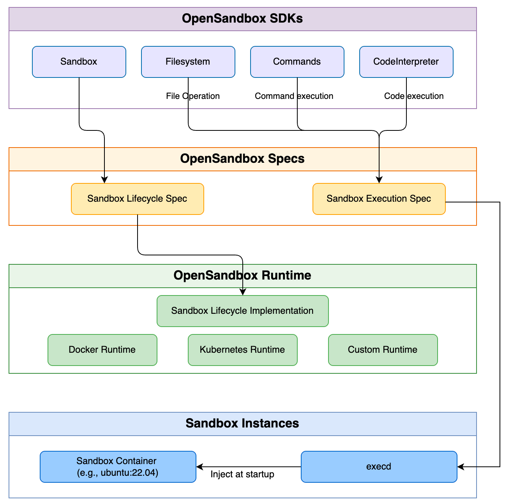
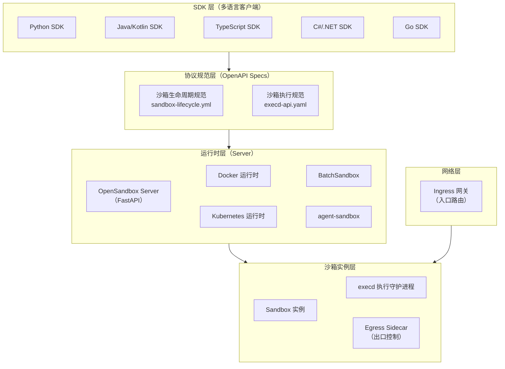

## 什么是 OpenSandbox

`OpenSandbox`是**阿里巴巴开源的通用`AI`应用沙箱平台**，项目地址为 [https://github.com/alibaba/OpenSandbox](https://github.com/alibaba/OpenSandbox)，已被 [CNCF Landscape](https://landscape.cncf.io/?item=orchestration-management--scheduling-orchestration--opensandbox) 收录。

该项目以`Apache 2.0`协议开源，旨在为`AI`应用提供一套**多语言`SDK`、统一沙箱`API`和灵活运行时**的完整解决方案，覆盖以下典型场景：

- **`Coding Agent`**（编程智能体）：如`Claude Code`、`Qwen Code`、`Codex CLI`等在沙箱中安全执行`AI`生成的代码
- **`GUI Agent`**（图形界面智能体）：在沙箱中运行桌面环境、浏览器自动化（`Playwright`、`Chrome`）
- **智能体评估（`Agent Evaluation`）**：大批量并行沙箱支持智能体的自动化评测
- **`AI`代码执行（`AI Code Execution`）**：多语言代码解释器，为数据分析、在线教育等提供安全执行环境
- **强化学习训练（`RL Training`）**：在隔离沙箱中运行强化学习训练循环



## 解决的核心问题

随着`AI`智能体系统的快速发展，让大语言模型（`LLM`）直接生成代码并在宿主机上执行存在显著的安全与工程挑战。现有方案在安全隔离、扩展性与开发体验上普遍存在以下痛点：

| 痛点 | `OpenSandbox`的解法 |
|---|---|
| `AI`生成的代码直接在宿主机执行，存在命令注入、文件越权等安全风险 | 每个沙箱运行在独立容器中，支持`gVisor`/`Kata`/`Firecracker`等安全运行时，与宿主机完全隔离 |
| 多语言智能体框架需要各自维护沙箱接入逻辑，开发重复且维护成本高 | 提供`Python`/`Java`/`Go`/`TypeScript`/`C#`五种`SDK`，统一的生命周期与执行`API` |
| 沙箱的出入口网络缺乏管控，存在数据泄露和恶意外联风险 | 内置`Ingress`网关和`Egress`出口控制，支持`FQDN`级别的出口策略，默认默认拒绝所有出站流量 |
| 大规模智能体评估和`RL`训练场景下，沙箱调度和资源管理复杂 | 原生支持`Kubernetes`运行时，对接`BatchSandbox`/`agent-sandbox`进行大规模分布式沙箱调度 |
| 沙箱内的代码执行缺乏标准化协议，难以跨运行时复用 | 定义`execd`执行协议（`OpenAPI`规范），将命令执行、文件操作、代码解释器统一标准化 |
| 现有代码执行平台难以与`MCP`等`AI`工具协议直接集成 | 提供官方`MCP Server`，可直接被`Claude Code`、`Cursor`等客户端调用 |

## 核心优势

### 统一沙箱协议

`OpenSandbox`定义了两套核心`OpenAPI`规范：**沙箱生命周期规范**（`sandbox-lifecycle.yml`）和**沙箱执行规范**（`execd-api.yaml`）。这一协议层保证了`SDK`与运行时实现之间的解耦，任何满足协议的自定义运行时都可无缝接入生态。

### 多语言原生`SDK`支持

官方提供覆盖主流编程语言的`SDK`，开发者无需适配底层`API`即可完整操控沙箱：

| 语言 | 包名 | 安装方式 |
|---|---|---|
| `Python` | `opensandbox` | `pip install opensandbox` |
| `Java`/`Kotlin` | `com.alibaba.opensandbox:sandbox` | `Maven`/`Gradle` |
| `JavaScript`/`TypeScript` | `@alibaba-group/opensandbox` | `npm install @alibaba-group/opensandbox` |
| `C#`/`.NET` | `Alibaba.OpenSandbox` | `dotnet add package Alibaba.OpenSandbox` |
| `Go` | `github.com/alibaba/OpenSandbox/sdks/sandbox/go` | `go get` |

### 双运行时支持

- **`Docker`运行时**：适合本地开发和单机部署，生产就绪，配置简单
- **`Kubernetes`运行时**：适合大规模分布式部署，支持`BatchSandbox`和`agent-sandbox`两种工作负载提供者

### 强安全隔离

支持以下安全容器运行时，在容器级别之上提供更强的隔离保障：

| 运行时 | 隔离机制 | 启动开销 | 最适场景 |
|---|---|---|---|
| `runc`（默认） | 进程级`cgroup` | 约`0ms` | 受信任工作负载、本地开发 |
| `gVisor` | 用户态内核（系统调用拦截） | 约`10~50ms` | 通用工作负载，低开销 |
| `Kata`（`QEMU`） | 完整虚拟机（`QEMU`超虚拟化） | 约`500ms` | 最强兼容性与隔离需求 |
| `Kata`（`Firecracker`） | 轻量`MicroVM` | 约`125ms` | 高密度部署，极小内存占用 |
| `Kata`（`CLH`） | `Cloud Hypervisor` | 约`200ms` | 性能与隔离的均衡选择 |

### 沙箱隔离模型：每人独占一个沙箱

**`OpenSandbox`的沙箱在设计上是独占的（`per-session`/`per-user`），不支持多人共用同一个沙箱实例。** 以`Codex CLI`沙箱为例：

- 沙箱内仅有一个`execd`守护进程入口，没有实现用户级隔离或多路复用
- 每个沙箱拥有唯一的文件系统命名空间，多人写入同一工作区会产生冲突
- 进程空间在沙箱内完全可见，不同用户的进程可以相互感知，破坏隔离语义
- 沙箱的`TTL`到期或`Kill`操作是整体生效的，一个用户的操作会影响所有使用者

**正确的使用模式**是：**每位开发者/每次会话独占一个沙箱实例**，平台负责按需批量创建和回收。这正是`OpenSandbox`的`Kubernetes`运行时（`BatchSandbox`/`agent-sandbox`）所擅长的场景——面向大规模并发用户快速分配和调度沙箱资源，既保持了强隔离，又实现了弹性扩缩容。

### 完整的网络策略

- **`Ingress`入口网关**：基于请求头或`URI`路径将外部流量路由到指定沙箱的指定端口，支持`Header`模式和`URI`模式
- **`Egress`出口控制**：以`Sidecar`方式注入沙箱网络命名空间，通过`DNS`代理和`nftables`实现基于`FQDN`的出站流量管控，默认拒绝所有出站流量

### `MCP`原生集成

官方提供`opensandbox-mcp`服务，将沙箱创建、命令执行、文件操作等能力以`MCP`协议暴露，可直接被`Claude Code`、`Cursor`等智能体客户端调用，无需编写额外的集成代码。

## 架构设计

`OpenSandbox`采用**四层架构**：`SDK`层、协议规范层、运行时层和沙箱实例层，各层职责清晰、边界明确。



### SDK 层

`SDK`层为开发者提供高层次的编程抽象，封装了与生命周期`API`和执行`API`的所有通信细节。各语言`SDK`的核心组件完全一致：

- **`Sandbox`类**：沙箱生命周期管理（创建、查询、暂停、恢复、销毁）
- **`Commands`组件**：在沙箱内执行`Shell`命令，支持前台同步执行与后台异步执行，通过`SSE`流式输出
- **`Filesystem`组件**：沙箱内的文件系统操作，包括增删改查、批量上传下载、`glob`搜索
- **`CodeInterpreter`组件**：多语言有状态代码解释器，基于`Jupyter`内核协议

### 协议规范层

`OpenSandbox`以`OpenAPI`规范定义了两套核心传输契约，确保`SDK`与任意满足协议的运行时实现之间的互操作性：

**生命周期规范（`sandbox-lifecycle.yml`）** 核心接口：

| 操作 | 接口 | 说明 |
|---|---|---|
| 创建沙箱 | `POST /sandboxes` | 从容器镜像创建新沙箱实例 |
| 列举沙箱 | `GET /sandboxes` | 分页查询沙箱列表 |
| 获取沙箱 | `GET /sandboxes/{id}` | 查询沙箱详情与状态 |
| 删除沙箱 | `DELETE /sandboxes/{id}` | 终止并销毁沙箱 |
| 暂停沙箱 | `POST /sandboxes/{id}/pause` | 暂停运行中的沙箱 |
| 恢复沙箱 | `POST /sandboxes/{id}/resume` | 恢复暂停的沙箱 |
| 续期沙箱 | `POST /sandboxes/{id}/renew-expiration` | 延长沙箱`TTL` |
| 获取端点 | `GET /sandboxes/{id}/endpoints/{port}` | 获取指定端口的公网`URL` |

**执行规范（`execd-api.yaml`）** 核心接口（由注入每个沙箱的`execd`守护进程实现）：

| 类别 | 接口 | 说明 |
|---|---|---|
| 健康检查 | `GET /ping` | 存活探针 |
| 代码执行 | `POST /code` | 执行代码，`SSE`流式输出结果 |
| 代码执行 | `POST /code/context` | 创建有状态执行上下文 |
| 命令执行 | `POST /command` | 执行`Shell`命令 |
| 文件操作 | `GET /files/info` | 获取文件元数据 |
| 文件操作 | `GET /files/search` | 按`glob`模式搜索文件 |
| 文件操作 | `POST /files/mv` | 移动/重命名文件 |
| 文件操作 | `POST /files/permissions` | 修改文件权限 |

### 运行时层（Server）

`OpenSandbox Server`是基于`FastAPI`构建的生产级服务，作为控制平面负责管理沙箱生命周期。核心能力包括：

- 标准化的`REST`生命周期接口
- 可插拔的运行时后端（`Docker`/`Kubernetes`）
- 可配置的`TTL`清理模式（自动过期或手动`DELETE`）
- `API Key`认证
- 多种网络模式（`host`/`bridge`/自定义网络）
- 支持`CPU`/内存资源限额
- 异步沙箱创建，降低响应延迟
- 重启后自动恢复过期计时器

### execd 执行守护进程

`execd`是注入到每个沙箱容器中的**轻量级执行守护进程**，是沙箱执行能力的核心载体。`SDK`通过`execd`暴露的`HTTP API`与沙箱内部进行交互，执行命令、操作文件、运行代码。

`execd`的镜像由`[runtime].execd_image`配置项指定，在沙箱创建时由运行时自动注入，用户无需手动管理。

### Ingress 入口网关

`Ingress`网关是`HTTP/WebSocket`反向代理，将外部流量路由到对应的沙箱实例及其端口。支持两种路由模式：

**`Header`模式（默认）**：基于`OpenSandbox-Ingress-To`请求头或`Host`请求头路由，格式为`<sandbox-id>-<port>`。

```bash
# 通过请求头路由到沙箱的 8080 端口
curl -H "OpenSandbox-Ingress-To: my-sandbox-8080" https://ingress.opensandbox.io/api/users
```

**`URI`模式**：基于`URI`路径路由，格式为`/<sandbox-id>/<port>/<path>`。

```bash
# 通过 URI 路由，请求转发给沙箱的 /api/users
curl https://ingress.opensandbox.io/my-sandbox/8080/api/users
```

`Ingress`网关还支持**按访问自动续期**（`OSEP-0009`）：当沙箱被访问时，自动通过`Redis`队列向`Server`发送续期信号，实现"按需保活"。

### Egress 出口控制

`Egress Sidecar`以`Sidecar`容器的形式与沙箱应用容器共享网络命名空间，提供`FQDN`级别的出站流量管控：

**工作机制**：
- **`DNS`代理（第一层）**：在`127.0.0.1:15353`运行自定义`DNS`代理，`iptables`规则将所有`53`端口的`DNS`请求重定向到此代理，对不在允许列表中的域名返回`NXDOMAIN`
- **`nftables`网络过滤（第二层，`dns+nft`模式）**：将已解析的允许域名`IP`动态写入`nftables`，实现`IP`层的默认拒绝+域名放行

**核心特性**：
- 支持通配符域名（如`*.pypi.org`）
- 无需应用程序感知（透明拦截）
- 运行时通过`HTTP API`动态更新策略
- 支持`DoH`/`DoT`阻断
- 支持出站被拒时通过`Webhook`发送告警

## 使用与配置

### 快速启动服务端

`OpenSandbox Server`以`Python`包的形式分发，推荐使用`uv`安装：

```bash
pip install opensandbox-server
```

初始化配置文件（以`Docker`运行时为例）：

```bash
opensandbox-server init-config ~/.sandbox.toml --example docker
```

启动服务：

```bash
opensandbox-server
# 或
opensandbox-server --config /path/to/sandbox.toml
```

健康检查：

```bash
curl http://127.0.0.1:8080/health
# → {"status": "healthy"}
```

服务启动后可访问`Swagger UI`（`http://localhost:8080/docs`）查看完整`API`文档。

### 核心配置项参考

配置文件为`TOML`格式，默认路径`~/.sandbox.toml`，支持通过`SANDBOX_CONFIG_PATH`环境变量或`--config`参数覆盖。

**`[server]`服务配置**：

| 配置项 | 类型 | 默认值 | 说明 |
|---|---|---|---|
| `host` | `string` | `"0.0.0.0"` | `HTTP API`监听地址 |
| `port` | `integer` | `8080` | 监听端口 |
| `log_level` | `string` | `"INFO"` | 日志级别 |
| `api_key` | `string` | `null` | 若设置则启用`API Key`认证，通过`OPEN-SANDBOX-API-KEY`请求头传递 |
| `eip` | `string` | `null` | 沙箱端点`URL`中使用的公网`IP`或主机名 |
| `max_sandbox_timeout_seconds` | `integer` | `null` | 沙箱`TTL`上限（秒），不设置则不做限制 |

**`[runtime]`运行时配置（必填）**：

| 配置项 | 类型 | 说明 |
|---|---|---|
| `type` | `string` | `"docker"`或`"kubernetes"` |
| `execd_image` | `string` | 注入沙箱的`execd`守护进程`OCI`镜像地址 |

**`[docker]`Docker运行时配置**：

| 配置项 | 类型 | 默认值 | 说明 |
|---|---|---|---|
| `network_mode` | `string` | `"host"` | 网络模式：`host`/`bridge`/自定义网络，`Egress`功能需要`bridge`模式 |
| `no_new_privileges` | `boolean` | `true` | 阻止沙箱容器提权 |
| `pids_limit` | `integer` | `4096` | 沙箱最大进程数，`null`表示不限制 |
| `drop_capabilities` | `list` | 见源码 | 从沙箱容器中移除的`Linux Capabilities` |

**`[kubernetes]`Kubernetes运行时配置**：

| 配置项 | 类型 | 默认值 | 说明 |
|---|---|---|---|
| `namespace` | `string` | `null` | 沙箱工作负载所在命名空间 |
| `workload_provider` | `string` | `null` | `"batchsandbox"`或`"agent-sandbox"` |
| `sandbox_create_timeout_seconds` | `integer` | `60` | 等待沙箱就绪的超时时间（秒） |
| `informer_enabled` | `boolean` | `true` | 是否启用`Informer`缓存，减少`API Server`压力 |

**`[secure_runtime]`安全运行时配置**：

| 配置项 | 类型 | 说明 |
|---|---|---|
| `type` | `string` | `"gvisor"`/`"kata"`/`"firecracker"`，为空则使用标准`runc` |

**完整`Docker`运行时配置示例**：

```toml
[server]
host = "0.0.0.0"
port = 8080
log_level = "INFO"
api_key = "your-secret-api-key"

[runtime]
type = "docker"
execd_image = "sandbox-registry.cn-zhangjiakou.cr.aliyuncs.com/opensandbox/execd:latest"

[docker]
network_mode = "bridge"
no_new_privileges = true
pids_limit = 4096

[egress]
image = "sandbox-registry.cn-zhangjiakou.cr.aliyuncs.com/opensandbox/egress:latest"
```

### 使用 CLI 工具

`OpenSandbox`提供`osb`命令行工具，覆盖常见的沙箱操作流程：

```bash
# 安装
pip install opensandbox-cli

# 初始化配置
osb config init
osb config set connection.domain localhost:8080
osb config set connection.protocol http

# 创建沙箱
osb sandbox create --image python:3.12 --timeout 30m -o json

# 在沙箱中执行命令
osb command run <sandbox-id> -o raw -- python -c "print(1 + 1)"

# 查看沙箱列表
osb sandbox list

# 删除沙箱
osb sandbox delete <sandbox-id>
```

### 配置 MCP Server

`OpenSandbox MCP Server`可将沙箱能力以`MCP`协议暴露给`Claude Code`、`Cursor`等智能体客户端：

```bash
pip install opensandbox-mcp
opensandbox-mcp --domain localhost:8080 --protocol http
```

在`MCP`客户端中添加如下配置：

```json
{
  "mcpServers": {
    "opensandbox": {
      "command": "opensandbox-mcp",
      "args": ["--domain", "localhost:8080", "--protocol", "http"]
    }
  }
}
```

## 使用示例

以下示例均使用`Go SDK`（`github.com/alibaba/OpenSandbox/sdks/sandbox/go`）演示，运行前需确保`OpenSandbox Server`已启动，并通过环境变量`OPEN_SANDBOX_DOMAIN`和`OPEN_SANDBOX_API_KEY`配置连接信息。

### 示例一：基础沙箱创建与命令执行

最基础的使用场景：创建一个`Python`沙箱，在其中执行`Shell`命令，程序退出时自动销毁沙箱。

```go
package main

import (
    "context"
    "fmt"
    "os"
    "time"

    opensandbox "github.com/alibaba/OpenSandbox/sdks/sandbox/go"
)

func main() {
    ctx, cancel := context.WithTimeout(context.Background(), 60*time.Second)
    defer cancel()

    config := opensandbox.ConnectionConfig{
        Domain:   getEnv("OPEN_SANDBOX_DOMAIN", "localhost:8080"),
        APIKey:   os.Getenv("OPEN_SANDBOX_API_KEY"),
        Protocol: "http",
    }

    // 创建沙箱，defer Kill 确保程序退出时自动销毁
    sb, err := opensandbox.CreateSandbox(ctx, config, opensandbox.SandboxCreateOptions{
        Image: "python:3.12",
    })
    if err != nil {
        fmt.Fprintf(os.Stderr, "创建沙箱失败: %v\n", err)
        os.Exit(1)
    }
    defer sb.Kill(context.Background())

    fmt.Printf("沙箱已就绪: %s\n", sb.ID())

    // 在沙箱中执行命令
    exec, err := sb.RunCommand(ctx, `python -c "print('Hello from sandbox!')"`, nil)
    if err != nil {
        fmt.Fprintf(os.Stderr, "命令执行失败: %v\n", err)
        os.Exit(1)
    }
    fmt.Println(exec.Text())
}

func getEnv(key, fallback string) string {
    if v := os.Getenv(key); v != "" {
        return v
    }
    return fallback
}
```

### 示例二：多语言代码解释器

`CodeInterpreter`组件支持在有状态会话中执行多种编程语言的代码块，变量在同一上下文（`Context`）中跨次调用持久化。

```go
package main

import (
    "context"
    "fmt"
    "os"
    "time"

    opensandbox "github.com/alibaba/OpenSandbox/sdks/sandbox/go"
)

func main() {
    ctx, cancel := context.WithTimeout(context.Background(), 2*time.Minute)
    defer cancel()

    config := opensandbox.ConnectionConfig{
        Domain: getEnv("OPEN_SANDBOX_DOMAIN", "localhost:8080"),
        APIKey: os.Getenv("OPEN_SANDBOX_API_KEY"),
    }

    // 创建代码解释器沙箱（使用官方 code-interpreter 镜像）
    ci, err := opensandbox.CreateCodeInterpreter(ctx, config, opensandbox.CodeInterpreterCreateOptions{
        ReadyTimeout: 60 * time.Second,
    })
    if err != nil {
        fmt.Fprintf(os.Stderr, "创建代码解释器失败: %v\n", err)
        os.Exit(1)
    }
    defer ci.Kill(context.Background())
    fmt.Printf("代码解释器已就绪: %s\n", ci.ID())

    // 创建 Python 执行上下文（变量在同一上下文中持久存在）
    pyCtx, err := ci.CreateContext(ctx, opensandbox.CreateContextRequest{Language: "python"})
    if err != nil {
        fmt.Fprintf(os.Stderr, "创建 Python 上下文失败: %v\n", err)
        os.Exit(1)
    }

    // 第一次执行：定义变量
    ci.ExecuteCode(ctx, opensandbox.RunCodeRequest{
        Context: pyCtx,
        Code:    "import platform\npy_ver = platform.python_version()\nprint('Python:', py_ver)",
    }, nil)

    // 第二次执行：复用上一次定义的变量 py_ver（跨调用持久化）
    pyResult, _ := ci.ExecuteCode(ctx, opensandbox.RunCodeRequest{
        Context: pyCtx,
        Code:    "print('Version again:', py_ver)",
    }, nil)
    fmt.Println("[Python]", pyResult.Text())

    // 创建 Java 执行上下文并执行
    javaCtx, _ := ci.CreateContext(ctx, opensandbox.CreateContextRequest{Language: "java"})
    javaResult, _ := ci.ExecuteCode(ctx, opensandbox.RunCodeRequest{
        Context: javaCtx,
        Code:    `System.out.println("Hello from Java!"); int r = 2 + 3; System.out.println("2+3=" + r);`,
    }, nil)
    fmt.Println("[Java]", javaResult.Text())
}

func getEnv(key, fallback string) string {
    if v := os.Getenv(key); v != "" {
        return v
    }
    return fallback
}
```

### 示例三：在沙箱中运行 Codex CLI

将`Codex CLI`运行在隔离沙箱中，实现`AI`编程智能体的安全执行。**注意：每位开发者应独占一个沙箱实例，不应将同一个沙箱实例共享给多人使用**（详见"沙箱隔离模型"章节）。

```go
package main

import (
    "context"
    "fmt"
    "os"
    "time"

    opensandbox "github.com/alibaba/OpenSandbox/sdks/sandbox/go"
)

func main() {
    ctx, cancel := context.WithTimeout(context.Background(), 5*time.Minute)
    defer cancel()

    openaiKey := os.Getenv("OPENAI_API_KEY")
    if openaiKey == "" {
        fmt.Fprintln(os.Stderr, "OPENAI_API_KEY 不能为空")
        os.Exit(1)
    }

    config := opensandbox.ConnectionConfig{
        Domain: getEnv("OPEN_SANDBOX_DOMAIN", "localhost:8080"),
        APIKey: os.Getenv("OPEN_SANDBOX_API_KEY"),
    }

    // 每位开发者独占一个沙箱，将 OpenAI 认证信息注入环境变量
    sb, err := opensandbox.CreateSandbox(ctx, config, opensandbox.SandboxCreateOptions{
        Image: "sandbox-registry.cn-zhangjiakou.cr.aliyuncs.com/opensandbox/code-interpreter:v1.0.2",
        Env: map[string]string{
            "OPENAI_API_KEY": openaiKey,
        },
    })
    if err != nil {
        fmt.Fprintf(os.Stderr, "创建沙箱失败: %v\n", err)
        os.Exit(1)
    }
    defer sb.Kill(context.Background())

    // 安装 Codex CLI（Node.js 已预装在 code-interpreter 镜像中）
    if _, err := sb.RunCommand(ctx, "npm i -g @openai/codex@latest", nil); err != nil {
        fmt.Fprintf(os.Stderr, "安装 Codex CLI 失败: %v\n", err)
        os.Exit(1)
    }

    // 运行 Codex CLI 执行编码任务
    result, err := sb.RunCommand(ctx,
        `codex --approval-mode=full-auto "Write a Go hello world program"`, nil)
    if err != nil {
        fmt.Fprintf(os.Stderr, "Codex CLI 执行失败: %v\n", err)
        os.Exit(1)
    }
    fmt.Println(result.Text())
}

func getEnv(key, fallback string) string {
    if v := os.Getenv(key); v != "" {
        return v
    }
    return fallback
}
```

### 示例四：并发多沙箱任务编排

`OpenSandbox`的每个沙箱独立隔离，天然适合并发编排。下面演示用`Go`协程并发创建多个沙箱，每个任务在**独立沙箱**中互不干扰地并行执行：

```go
package main

import (
    "context"
    "fmt"
    "os"
    "sync"
    "time"

    opensandbox "github.com/alibaba/OpenSandbox/sdks/sandbox/go"
)

// runTask 在独立沙箱中执行单个任务，任务结束后自动销毁沙箱
func runTask(ctx context.Context, config opensandbox.ConnectionConfig, taskID int, code string) (string, error) {
    sb, err := opensandbox.CreateSandbox(ctx, config, opensandbox.SandboxCreateOptions{
        Image: "python:3.12",
        Metadata: map[string]string{
            "task_id": fmt.Sprintf("%d", taskID),
        },
    })
    if err != nil {
        return "", fmt.Errorf("任务 %d 沙箱创建失败: %w", taskID, err)
    }
    defer sb.Kill(context.Background())

    exec, err := sb.RunCommand(ctx, fmt.Sprintf("python -c %q", code), nil)
    if err != nil {
        return "", fmt.Errorf("任务 %d 执行失败: %w", taskID, err)
    }
    return exec.Text(), nil
}

func main() {
    ctx, cancel := context.WithTimeout(context.Background(), 3*time.Minute)
    defer cancel()

    config := opensandbox.ConnectionConfig{
        Domain: getEnv("OPEN_SANDBOX_DOMAIN", "localhost:8080"),
        APIKey: os.Getenv("OPEN_SANDBOX_API_KEY"),
    }

    // 三个任务并发运行，每个任务在独立沙箱中执行，互不干扰
    tasks := []string{
        "print('Task 1:', sum(range(100)))",
        "print('Task 2:', 2**32)",
        "print('Task 3:', ','.join(str(i) for i in range(5)))",
    }

    var wg sync.WaitGroup
    results := make([]string, len(tasks))
    errs := make([]error, len(tasks))

    for i, code := range tasks {
        wg.Add(1)
        go func(idx int, c string) {
            defer wg.Done()
            results[idx], errs[idx] = runTask(ctx, config, idx+1, c)
        }(i, code)
    }

    wg.Wait()

    for i, result := range results {
        if errs[i] != nil {
            fmt.Fprintf(os.Stderr, "任务 %d 错误: %v\n", i+1, errs[i])
        } else {
            fmt.Printf("任务 %d 输出: %s\n", i+1, result)
        }
    }
}

func getEnv(key, fallback string) string {
    if v := os.Getenv(key); v != "" {
        return v
    }
    return fallback
}
```

### 示例五：Egress 出口策略配置

在沙箱创建时指定网络策略，仅允许访问`pypi.org`安装`Python`包，其他所有出站请求均被拒绝：

```go
package main

import (
    "context"
    "fmt"
    "os"
    "time"

    opensandbox "github.com/alibaba/OpenSandbox/sdks/sandbox/go"
)

func main() {
    ctx, cancel := context.WithTimeout(context.Background(), 2*time.Minute)
    defer cancel()

    config := opensandbox.ConnectionConfig{
        Domain: getEnv("OPEN_SANDBOX_DOMAIN", "localhost:8080"),
        APIKey: os.Getenv("OPEN_SANDBOX_API_KEY"),
    }

    // 通过 NetworkPolicy 指定出口规则，默认拒绝所有出站流量
    // 只允许访问 pypi.org 及其子域名
    sb, err := opensandbox.CreateSandbox(ctx, config, opensandbox.SandboxCreateOptions{
        Image: "python:3.12",
        NetworkPolicy: &opensandbox.NetworkPolicy{
            DefaultAction: "deny",
            Egress: []opensandbox.NetworkRule{
                {Action: "allow", Target: "*.pypi.org"},
                {Action: "allow", Target: "pypi.org"},
            },
        },
    })
    if err != nil {
        fmt.Fprintf(os.Stderr, "创建沙箱失败: %v\n", err)
        os.Exit(1)
    }
    defer sb.Kill(context.Background())

    // 安装依赖（仅 pypi.org 出站被允许，其他外联请求将被拒绝）
    result, err := sb.RunCommand(ctx, "pip install requests", nil)
    if err != nil {
        fmt.Fprintf(os.Stderr, "安装失败: %v\n", err)
        os.Exit(1)
    }
    fmt.Println(result.Text())
}

func getEnv(key, fallback string) string {
    if v := os.Getenv(key); v != "" {
        return v
    }
    return fallback
}
```

## 支持的沙箱环境

`OpenSandbox`内置并维护了多种专用沙箱镜像，覆盖主要`AI`智能体应用场景：

| 类别 | 镜像/示例 | 说明 |
|---|---|---|
| **代码解释器** | `opensandbox/code-interpreter` | 支持`Python`/`Java`/`Go`/`JavaScript`/`Bash`的多语言执行环境 |
| **`Claude Code`** | `claude-code`示例 | 在沙箱中运行`Anthropic Claude Code CLI` |
| **`Qwen Code`** | `qwen-code`示例 | 在沙箱中运行通义千问代码智能体 |
| **`Gemini CLI`** | `gemini-cli`示例 | 在沙箱中运行`Google Gemini CLI` |
| **`Codex CLI`** | `codex-cli`示例 | 在沙箱中运行`OpenAI Codex CLI` |
| **`Kimi Code`** | `kimi-cli`示例 | 在沙箱中运行`Kimi Code CLI`（月之暗面） |
| **浏览器自动化** | `opensandbox/playwright` | 无头`Chromium + Playwright`，用于网页抓取与`GUI Agent` |
| **`Chrome DevTools`** | `chrome`示例 | 暴露`DevTools`端口的无头`Chromium`，用于远程调试 |
| **桌面环境** | `desktop`示例 | `VNC`桌面（`Xvfb + x11vnc`），用于`GUI Agent`测试 |
| **`VS Code Web`** | `vscode`示例 | 在沙箱中运行`code-server`，提供浏览器访问的`IDE`环境 |
| **强化学习训练** | `rl-training`示例 | 在沙箱内运行`RL`训练循环 |
| **`LangGraph`** | `langgraph`示例 | `LangGraph`智能体与沙箱工具编排 |
| **`Google ADK`** | `google-adk`示例 | `Google Agent Development Kit`集成示例 |

## 与同类项目的对比

以下对比基于三个项目的公开源码与官方文档，围绕定位、安全模型、SDK 支持、部署方式、网络控制、AI 集成等核心维度展开。

### OpenSandbox（阿里巴巴）

`OpenSandbox` 以**协议标准化**为核心设计理念，通过 `OpenAPI` 规范定义沙箱生命周期接口（`sandbox-lifecycle.yml`）和执行接口（`execd-api.yaml`），将沙箱能力抽象为统一的`API`层。同一套接口可接入 `Docker`、`Kubernetes`/`BatchSandbox` 不同运行时，以及 `gVisor`、`Kata-Containers`（支持 `QEMU`、`Firecracker`、`CLH`）等多种安全运行时，适合需要在多种`AI`框架和运行环境之间灵活切换的团队。

其内置的 `Egress` 边车组件基于 `FQDN` 白名单 + `nftables` 实现出站流量拦截，`Ingress` 网关支持基于`Header`和 `URI` 的路由，网络策略开箱即用。官方 `MCP Server`（`opensandbox-mcp`）使 `Claude Code`、`Cursor` 等工具可直接通过 `MCP` 协议操作沙箱。项目已进入 `CNCF Landscape`，是三者中唯一具备沙箱协议标准化愿景的项目。

### Daytona（daytonaio）

`Daytona` 定位为**面向 AI 生成代码的弹性基础设施**，强调快速启动（`< 90ms`）、状态持久化与平台完整性。每个沙箱是一台"可组合计算机"，拥有独立内核、文件系统、网络栈以及分配的 `vCPU`/`RAM`/磁盘，基于 `OCI`/`Docker` 兼容运行时构建。其架构分为接口层（`CLI`、`Dashboard`、`API`），控制面（`NestJS API`，负责编排）和计算面（`Runner` 节点，负责运行沙箱）。

面向开发者的功能尤为完整：`Dashboard`（`Web UI`）、`Web Terminal`、`SSH`、`VNC`、`VPN`、预览`URL`、`LSP` 支持、`Computer Use`、`Git` 操作、日志流等。`Snapshots` 功能支持沙箱状态快照与恢复，为跨会话的`Agent`工作流提供持久化保障。多语言 `SDK` 覆盖 `Python`、`TypeScript`、`Ruby`、`Go`、`Java` 共五种语言，由 `OpenAPI` 自动生成客户端，一致性高。已推出托管云服务（`app.daytona.io`），同时支持自托管（`Docker Compose`）和混合部署（托管控制面 + 自有计算节点）。

### OpenShell（NVIDIA）

`OpenShell` 是三者中安全机制最为深度的项目，定位为**自主 AI Agent 的安全隐私运行时**。核心思路是"纵深防御"：在`Linux`内核层面叠加四层隔离——`Landlock LSM`（文件系统访问控制）、`Seccomp BPF`（系统调用过滤）、网络命名空间（隔离出站流量，经 `HTTP CONNECT` 代理中转）和 `OPA`/`Rego` 策略引擎（基于进程身份 + 目标 `FQDN` + `HTTP Method/Path` 的七层决策）。

网络侧还引入了 **Privacy Router**（推理路由器），能够透明拦截对`AI Inference API`的请求，剥离调用方凭据并注入后端凭据，避免`API Key`泄露至沙箱文件系统。策略以声明式 `YAML` 描述，静态字段（文件系统/进程）在创建时锁定，动态字段（网络/推理路由）支持热更新（`openshell policy set`），无需重启沙箱。内置对 `Claude Code`、`OpenCode`、`Codex`、`GitHub Copilot CLI` 的原生支持，凭据通过 **`Provider`** 机制注入为环境变量（从不写入磁盘）。基础设施以 `K3s`（轻量级 `Kubernetes`）内嵌于单一 `Docker` 容器中运行，支持 `GPU` 直通（`--gpu`，实验性）。当前为 `Alpha` 阶段，主打单机开发者场景，企业级多租户部署在路线图中。

### 三维对比速查表

| 维度 | `OpenSandbox`（阿里巴巴） | `Daytona`（daytonaio） | `OpenShell`（NVIDIA） |
|---|---|---|---|
| **项目定位** | 协议标准化的`AI`沙箱平台 | `AI`代码执行弹性基础设施 | 自主`Agent`安全隐私运行时 |
| **开源协议** | `Apache 2.0` | `Apache 2.0` | `Apache 2.0` |
| **核心语言** | `Python`（服务端）+ 多语言 `SDK` | `Go`（`CLI/Runner`）+ `TypeScript`（`API`）+ 多语言 `SDK` | `Rust`（核心）+ `Python SDK` |
| **多语言 SDK** | `Python`·`Java/Kotlin`·`TypeScript`·`C#/.NET`·`Go` | `Python`·`TypeScript`·`Ruby`·`Go`·`Java` | `Python`（主要），`CLI` 为主入口 |
| **沙箱隔离机制** | `gVisor`/`Kata`（`QEMU`/`Firecracker`/`CLH`）/`runc`（可选） | 独立内核（`OCI` 容器 + 完整网络栈） | `Landlock LSM` + `Seccomp BPF` + 网络命名空间 + `OPA` 策略引擎（四层纵深防御） |
| **网络出口控制** | `Egress` 边车：`FQDN` 白名单 + `nftables` | `Network Limits` 系统钩子 | `OPA`/`Rego` 七层策略 + 热更新；`Privacy Router` 推理路由 |
| **AI 推理隐私保护** | 无内置机制 | 无内置机制 | 有（`Privacy Router`：剥离来源凭据，注入后端凭据） |
| **凭据管理** | 无内置机制 | 无内置机制 | `Provider` 机制（环境变量注入，从不落盘） |
| **MCP 集成** | 官方 `MCP Server`（`opensandbox-mcp`） | 官方 `MCP Server` | 无 |
| **GPU 支持** | 无 | 无 | `--gpu` 直通（实验性） |
| **状态快照** | 无 | `Snapshots`（跨会话持久化） | 无 |
| **部署方式** | `Docker` / `Kubernetes` | `Docker Compose`（自托管）/ 托管云 / 混合部署 | `K3s`-in-`Docker`（单容器）/ 远程主机 |
| **人工操作界面** | `CLI`（`osb`） | `Dashboard`·`Web Terminal`·`SSH`·`VNC`·`VPN`·预览 URL | `TUI`（类 `k9s`）·`SSH` |
| **协议标准化** | `OpenAPI` 规范（`sandbox-lifecycle.yml` + `execd-api.yaml`）；`CNCF Landscape` | 自有 `REST API`（无统一沙箱协议规范） | `gRPC`（`proto/sandbox.proto`）；无通用标准 |
| **大规模调度** | `Kubernetes` 原生（`BatchSandbox`/`agent-sandbox`） | 多 `Region` + `Runner` 计算节点 | `Alpha` 阶段，单机为主；企业级多租户待支持 |
| **成熟度** | 生产可用，`CNCF Landscape` | 生产可用，已有托管云 | `Alpha`，主打开发者个人场景 |
| **适用场景** | `AI`框架集成、代码沙箱标准化、大规模 `K8s` 批量任务 | `AI Coding Agent` 平台、持久化 `Agent` 工作流、组织级管控 | 单机 `Coding Agent` 安全运行、`AI` 推理隐私保护 |

### 如何选择

- 若需要**将沙箱能力统一接入多个 AI 框架**，或需要大规模 `Kubernetes` 批量沙箱调度，`OpenSandbox` 的协议标准化设计和原生 `K8s` 支持是最优选。
- 若需要构建一个**面向组织的 AI Coding Agent 平台**，需要完整的用户管理、持久化快照、`Dashboard`、多区域部署和丰富的人工交互界面（`VNC`/`SSH`/`VPN`），`Daytona` 提供了最完整的平台工程体验。
- 若是开发者个人使用 `Claude Code`/`Codex` 等 Agent，关注**凭据安全、推理隐私和网络访问控制**，希望用声明式 `YAML` 策略精细限制 Agent 的文件/网络行为，`OpenShell` 提供了目前最深度的安全纵深防御机制，但需接受其 `Alpha` 阶段的稳定性现状。

## 总结

`OpenSandbox`以**协议标准化**为核心，构建了一套从`SDK`到运行时、从网络管控到安全隔离的完整`AI`应用沙箱平台。其主要价值体现在：

- **统一的沙箱协议**解决了不同`AI`框架、不同运行时之间的接入碎片化问题
- **多语言`SDK`** 让各技术栈的团队都能以最小成本接入沙箱能力
- **`Docker`+`Kubernetes`双运行时**兼顾了本地开发便利性和生产大规模部署需求
- **`gVisor`/`Kata`/`Firecracker`安全运行时**为多租户场景下的`AI`代码执行提供了硬件级隔离保障
- **`Egress/Ingress`网络策略**提供了开箱即用的精细网络访问控制，有效降低出站数据泄露风险
- **`MCP`原生集成**让其能够无缝嵌入以`Claude Code`、`Cursor`为代表的新一代`AI`编程工具链

对于正在构建`Coding Agent`、智能体评估平台或`AI`代码执行服务的团队，`OpenSandbox`提供了一个经过生产验证、协议规范明确、生态持续扩展的基础设施选择。
