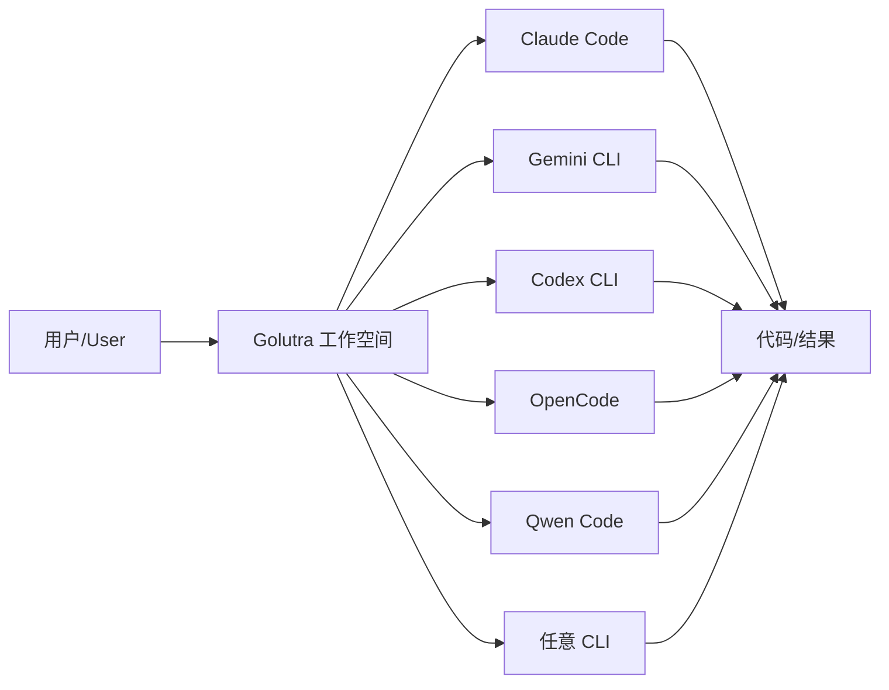
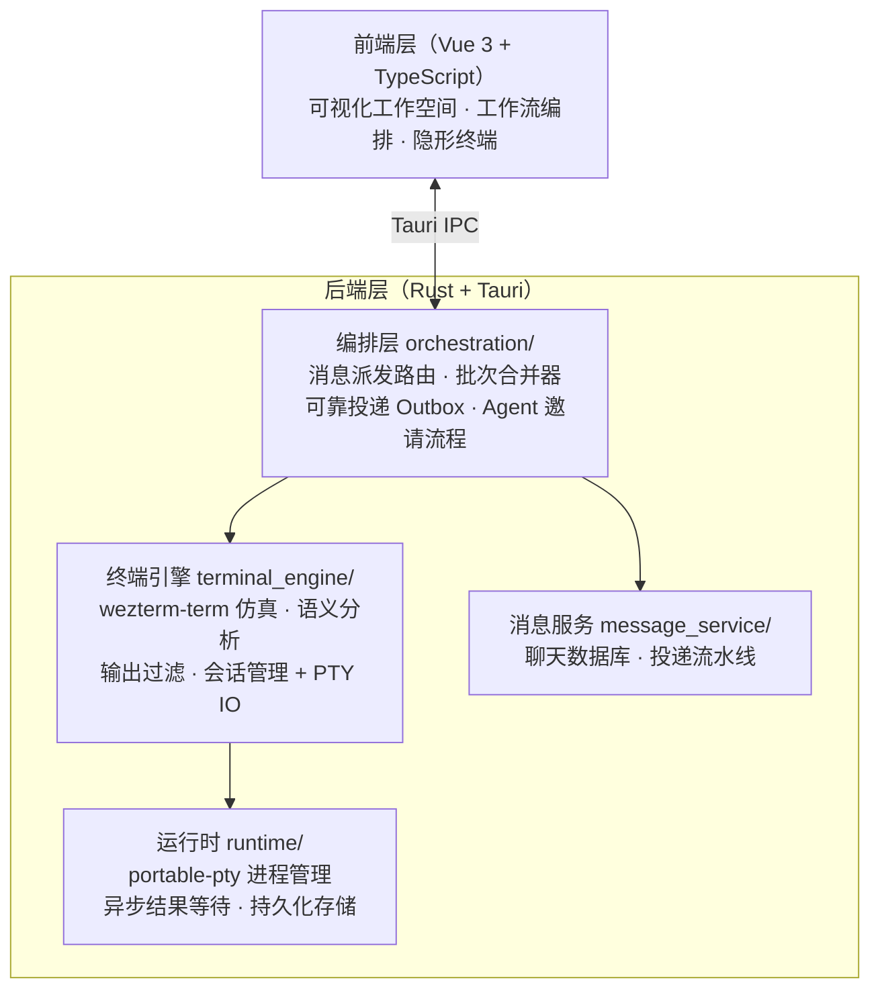
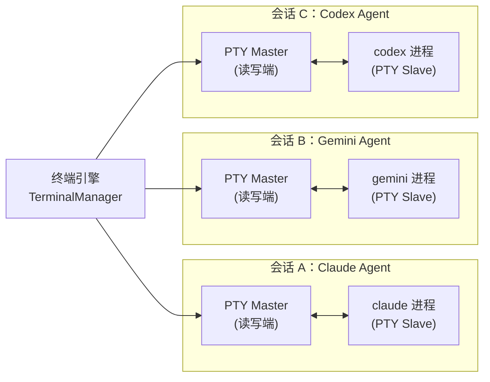
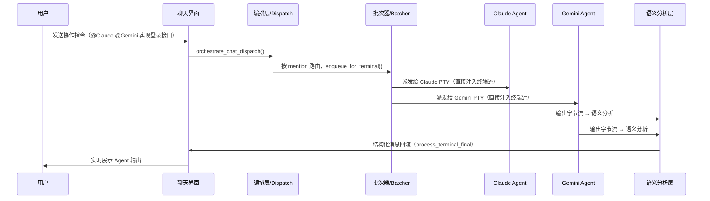
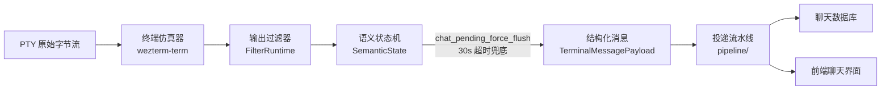

## 什么是 Golutra

`Golutra` 是一款新一代**多智能体工作空间**桌面应用，标语为"**一个人，一个 AI 军团**"（`One Person. One AI Squad.`）。项目地址：[https://github.com/golutra/golutra](https://github.com/golutra/golutra)，官网：[https://www.golutra.com/](https://www.golutra.com/)。

它由独立开发者 [seekskyworld](https://github.com/seekskyworld) 历经三个月打磨，采用`Vue 3 + Rust`，基于`Tauri`桌面架构构建，支持`Windows`、`macOS`和`Linux`三平台。

`Golutra`的核心价值主张是：**不要求你改变任何现有习惯**——不迁移项目、不重学命令、不切换终端——只用你已经熟悉的`AI CLI`工具（`Claude Code`、`Gemini CLI`、`Codex CLI`、`OpenCode`、`Qwen Code`等），把它们全部接入同一个可视化编排中枢，实现多智能体并行执行与自动化协作。



## 解决的核心问题

传统`AI`辅助开发模式存在三大瓶颈：

| 传统痛点 | golutra 的解法 |
|---|---|
| 多个`CLI`工具需要手动切换，上下文割裂 | 统一编排层，所有`Agent`在同一界面管理 |
| 单线程串行执行，等待`AI`响应浪费时间 | 多`Agent`无限并行，充分利用`CPU`与等待时间 |
| 每次会话需要重新解释需求，无法复用 | 工作流模板一键导入导出，上下文跨会话复用 |
| 工具与工具之间结果无法自动流转 | 消息派发系统，输出自动回传到同一工作流 |
| 迁移`AI`工具成本极高（重学、迁移代码） | `CLI`兼容层，保留原工具原命令，零迁移成本 |

`golutra`的目标场景不只是短时对话，更着力于**长期运行的 AI 协作系统**：一人公司的`AI`团队、自动化写作与内容发布、视频制造流水线、游戏推演（如狼人杀模板）等跨行业场景，都可以作为同一套系统下的不同工作流模板来运行。

## 技术架构

`golutra`整体采用**前后端分离 + 跨进程 PTY 管理**的分层架构，前端负责可视化编排与状态展示，后端（`Rust`）负责进程管理、终端仿真、消息投递与编排逻辑。

### 整体架构图



### 各模块介绍

#### 编排层（`orchestration/`）

编排层是`golutra`多智能体协作的核心大脑，负责**跨模块自动化编排逻辑**：

| 文件 | 职责 |
|---|---|
| `dispatch.rs` | 接收编排指令，按目标`Agent`列表自动创建/复用会话，并行派发消息 |
| `chat_dispatch_batcher.rs` | 聊天派发批次器，合并并发输入，以语义`flush`为释放门槛 |
| `chat_outbox.rs` | 异步 `Outbox Worker`，带重试与指数退避，保障消息可靠投递 |
| `terminal_friend_invite.rs` | `Agent`邀请与初始化流程编排，管理启动后引导步骤 |

#### 终端引擎（`terminal_engine/`）

终端引擎是`golutra` `PTY`子系统的核心，对外提供`Tauri`命令接口：

| 模块 | 职责 |
|---|---|
| `emulator.rs` | 基于`tattoy-wezterm-term`实现终端仿真，生成`ANSI`快照 |
| `semantic.rs` | 语义层，将终端原始输出整理为聊天侧可读的结构化消息 |
| `filters/` | 按`CLI`类型加载输出过滤规则，清洗噪音行 |
| `default_members/` | 预置各`CLI`工具的成员配置（命令、权限标志、启动步骤） |
| `session/` | 会话状态机、`PTY`读写管线、快照服务、流控管理 |

终端会话状态机定义了四种状态：`Connecting`→`Online`↔`Working`→`Offline`，精确反映每个 `Agent` 的当前执行状态，驱动前端`UI`实时展示。

#### 运行时（`runtime/`）

| 文件 | 职责 |
|---|---|
| `pty.rs` | 基于`portable-pty`创建跨平台 `PTY` 进程，管理读写端与子进程生命周期 |
| `command_center.rs` | 基于`Mutex + Condvar`的异步结果槽，支持外部命令异步等待 |
| `storage.rs` | 基于`redb`（嵌入式`Key-Value`数据库）的持久化存储层 |
| `settings.rs` | 全局设置读写，包含默认终端配置等 |

#### 消息服务（`message_service/`）

消息服务层承载聊天存储、消息写入与事件广播：

| 子模块 | 职责 |
|---|---|
| `chat_db/` | 聊天数据库，含会话成员、消息状态、`Outbox`表 |
| `pipeline/` | 分阶段投递流水线：`normalize → plan → policy → throttle → deliver` |
| `project_data.rs` | 项目级数据管理 |
| `project_members.rs` | 项目成员管理 |

## 沙箱技术

`golutra`底层采用**基于`PTY`（伪终端）的进程级隔离**作为沙箱机制，而非虚拟机或容器。

### PTY 隔离原理

每个`AI Agent`在`golutra`中对应一个独立的`PTY`进程实例，通过`Rust`的`portable-pty crate` 实现跨平台`PTY`创建：



`PTY`隔离的优势在于：

- **进程隔离**：每个`Agent`运行在独立的操作系统进程中，互不影响
- **完整终端语义**：支持颜色、光标移动、进度条等全量`ANSI`转义序列，与`CLI`工具原生行为完全一致
- **轻量高效**：相比`Docker`容器，`PTY`进程启动无额外开销，毫秒级响应
- **跨平台**：`portable-pty`在`Windows`（`ConPTY`）、`macOS`、`Linux`上均有原生实现

### 各 CLI 的权限配置

`golutra`为每种`CLI`工具预置了一套**权限松绑标志**（`unlimited_access_flag`），在"无限权限"模式下自动附加，避免`AI`工具频繁弹出确认对话框阻塞自动化流程：

| CLI 工具 | 权限松绑标志 | 会话恢复命令 |
|---|---|---|
| `Claude Code` | `--dangerously-skip-permissions` | 不支持 |
| `Gemini CLI` | `--yolo` | 不支持 |
| `Codex CLI` | `--dangerously-bypass-approvals-and-sandbox` | `resume {session_id}` |
| `OpenCode` | `--dangerously-skip-permissions` | 不支持 |
| `Qwen Code` | `--yolo` | 不支持 |

### 终端仿真器

`golutra`使用`tattoy-wezterm-term`（`WezTerm`终端仿真库的`fork`版本）实现终端输出的语义解析。仿真器负责：

- 解析`ANSI/VT`转义序列（`CSI`、`OSC`等），维护完整的屏幕缓冲区
- 生成可回放的`ANSI`快照（`snapshot_ansi`），供前端还原真实渲染效果
- 支持滚动历史（最多`2000`行屏幕 + `5000`行语义层），兼顾内存占用与信息保留

## 多智能体协作设计

多智能体协作是`golutra`最核心的技术亮点，本节重点介绍其设计思路与实现细节。

### 协作模型概述

`golutra`的多`Agent`协作基于 **"终端会话即`Agent`"** 的设计理念：每个 `Agent` 就是一个持久化的 `PTY` 终端会话，用户通过**消息派发**的方式向指定 `Agent` 或多个 `Agent` 广播指令，`Agent` 的输出经过**语义分析**后回流到统一的聊天界面，形成完整的协作闭环。



### 核心协作流程

#### 派发路由（Orchestration Dispatch）

当用户发送一条携带`@成员`或`@角色`标记的消息时，`orchestrate_chat_dispatch()`函数负责按`mention`规则进行路由：

1. 从消息中解析目标`Agent`列表（`ChatDispatchMentions`）
2. 对每个目标调用`ensure_backend_session()`，若会话不存在则**自动创建**
3. 将消息文本注入对应`PTY`的终端流（`terminal_dispatch_chat`）

关键代码逻辑（`dispatch.rs`）：

```rust
pub fn orchestrate_dispatch_impl(
    app: &AppHandle,
    payload: OrchestrationPayload,
) -> Result<(), String> {
    // 对每个目标 Agent 并行派发
    for target in payload.targets {
        let terminal_id = ensure_backend_session(
            app, window, state, &target,
            payload.workspace_id.as_deref(),
            payload.cwd.as_deref(),
        )?;
        terminal_dispatch_chat(
            app.clone(), state.clone(),
            terminal_id,
            payload.text.clone(),
            payload.context.clone(),
        )?;
    }
    Ok(())
}
```

#### 批次合并器（Chat Dispatch Batcher）

在高并发场景下（多个用户消息同时到达，或工作流触发多条派发），`ChatDispatchBatcher`负责**智能合并**：

- 若目标终端当前有消息正在执行（`inflight`），新消息进入`pending`队列等待
- 若终端空闲，批次立即派发
- 多条`pending`消息按`\n\n`分隔符合并为一次派发，减少`CLI`输入误判
- 以**语义`flush`完成**（即`Agent`输出稳定后）作为释放门槛，而非固定时间窗口

这一设计解决了向`AI CLI`工具注入过快导致"指令混淆"的问题。

#### 可靠投递（Chat Outbox）

`ChatOutboxWorker`是一个异步后台线程，负责持久化的消息可靠投递：

| 参数 | 值 | 说明 |
|---|---|---|
| 轮询间隔 | `280ms` | 低延迟的近实时投递 |
| 单次领取上限 | `8 条` | 避免单批次积压 |
| 租约时长 | `8 秒` | 防止重复投递 |
| 最大重试次数 | `6 次` | 指数退避，基础间隔 `800ms`，上限 `30s` |

消息在派发前会持久化到`redb`数据库的`Outbox`表中，投递成功后标记`sent`，失败超过上限后标记`failed`，确保**即使应用崩溃也不丢失派发指令**。

#### 语义分析与输出回流

每个`PTY`会话都有一个独立的`semantic_worker`线程，持续将终端输出字节流转化为结构化消息：



语义层的核心控制参数（均可调优）：

| 参数 | 默认值 | 作用 |
|---|---|---|
| `CHAT_SILENCE_TIMEOUT_MS` | `3000ms` | 输出静默超过此值触发`flush` |
| `CHAT_IDLE_DEBOUNCE_MS` | `1000ms` | 防抖，避免短暂停顿误触发 |
| `CHAT_PENDING_FORCE_FLUSH_MS` | `30000ms` | 超时兜底，避免进度条阻塞派发 |
| `STATUS_WORKING_SILENCE_TIMEOUT_MS` | `4500ms` | `Working` 状态回落静默阈值 |

#### Agent 启动后引导（Post-Ready Flow）

`golutra`为每种`CLI`工具定义了**启动后引导步骤**（`TerminalPostReadyPlan`），在`Agent`就绪后自动执行初始化序列，无需人工介入：

以`Codex CLI`为例，启动后自动执行：

```rust
post_ready_steps: &[
    // 1. 发送 /status 命令检测就绪状态
    TerminalPostReadyStep::Input { input: "/status", require_stable: true },
    // 2. 确认回车
    TerminalPostReadyStep::Input { input: "\r", require_stable: true },
    // 3. 等待 "model" 特征出现，确认 Codex 完全加载
    TerminalPostReadyStep::WaitForPattern { pattern: "model" },
    // 4. 提取会话 ID（用于后续 resume）
    TerminalPostReadyStep::ExtractSessionId { keyword: "session:" },
    // 5. 注入个性化引导提示词
    TerminalPostReadyStep::Introduction { prompt_type: "onboarding" },
]
```

引导提示词会根据用户语言设置（中/英文）自动适配，并携带`Agent`的名称作为"身份标识"，让`Agent`了解自己是团队的一员，例如：

> "agent-1，这是你的名字，现在正在和团队解决问题"

### 与其他框架的多智能体对比

`golutra`与其他主流多智能体框架在协作模式上有根本性差异：

| 维度 | golutra | AutoGen | CrewAI | MetaGPT | OpenHands |
|---|---|---|---|---|---|
| 接入方式 | `CLI`兼容，零迁移 | `Python SDK`，需重写 | `Python SDK`，需重写 | `Python SDK`，需重写 | `Web UI + Docker` |
| `Agent` 隔离 | `PTY` 进程隔离 | `API` 调用无隔离 | `API` 调用无隔离 | `API` 调用无隔离 | 容器隔离 |
| LLM 灵活性 | 用你已有的 `CLI` | 需配 `API Key` | 需配 `API Key` | 需配 `API Key` | 内置 `LLM` |
| 并行能力 | 真并行（多进程） | 异步并行 | 顺序为主 | 顺序为主 | 单 `Agent` |
| 可视化 | 桌面 `GUI`（聊天+终端） | 无 `GUI` | 无 `GUI` | 无 `GUI` | `Web UI` |
| 工作流模板 | 支持导入导出 | 代码定义 | 代码定义 | 代码定义 | 不支持 |
| 跨平台 | `Win/macOS/Linux` | 依赖 `Python` 环境 | 依赖 `Python` 环境 | 依赖 `Python` 环境 | `Linux/macOS` |
| 会话恢复 | 支持（`Codex`） | 不支持 | 不支持 | 不支持 | 不支持 |

`golutra`最显著的优势在于：它**不是一个框架，而是一个工具**——你无需学习新的编程范式，只需要告诉`golutra`"用哪些 `Agent`，做什么事"，它负责剩下的一切。

## 使用与配置

### 安装

从 [GitHub Releases](https://github.com/golutra/golutra/releases) 下载对应平台的安装包：

- `Windows`：`.exe`安装程序
- `macOS`：`.dmg`磁盘镜像
- `Linux`：`.AppImage`或`.deb`包

### 前置依赖

在使用`golutra`前，需要在系统中安装你想要使用的`AI CLI`工具：

```bash
# 安装 Claude Code
npm install -g @anthropic-ai/claude-code

# 安装 Gemini CLI
npm install -g @google/gemini-cli

# 安装 Codex CLI
npm install -g @openai/codex

# 安装 OpenCode
npm install -g opencode-ai

# 安装 Qwen Code
npm install -g qwencode
```

### 基本配置

`golutra`采用`JSON`格式存储全局配置（`global-settings.json`），核心配置项：

| 配置项 | 类型 | 说明 |
|---|---|---|
| `members.defaultTerminalName` | `string` | 默认终端工具名称 |
| `members.defaultTerminalPath` | `string` | 默认终端可执行文件路径 |

### 使用示例

#### 示例一：单 Agent 快速启动

打开`golutra`，在工作空间界面点击"添加成员"，选择`Claude Code`类型，`golutra`会自动：

1. 创建一个`PTY`终端会话，执行`claude --dangerously-skip-permissions`
2. 等待`Claude`启动就绪（检测`OSC 633;A`信号）
3. 自动注入引导提示词，告知`Agent`身份
4. `Agent`状态变为`Online`，可以开始接收任务

随后在聊天框输入任意指令，`golutra`会将其直接注入 `Claude` 的终端流中执行。

#### 示例二：多 Agent 并行开发

场景：让`Claude`负责后端`API`实现，`Gemini`负责单元测试，`Codex`负责文档生成，三者同时工作。

1. 在工作空间中依次添加三个成员：`Claude Code`、`Gemini CLI`、`Codex CLI`
2. 等待三个`Agent`全部就绪（状态均为`Online`）
3. 在聊天框输入并`@指定成员`：

    ```text
    @Claude 实现用户登录接口，使用 JWT 鉴权，接口路径 /api/auth/login

    @Gemini 为用户登录接口编写完整的单元测试，覆盖正常登录、密码错误、用户不存在三种场景

    @Codex 根据 /api/auth/login 接口生成 OpenAPI 文档
    ```

4. 三个`Agent`同时开始工作，`golutra`编排层会：
   - 将三条指令分别路由到对应的`PTY`终端
   - 实时监控每个`Agent`的执行状态（`Working`/`Online`）
   - 将每个`Agent`的输出经语义分析后回流到聊天界面

5. 点击任意`Agent`头像可随时查看其完整终端日志，也可手动注入追加指令

#### 示例三：使用工作流模板进行自动化写作

`golutra`支持自定义工作流并一键导入导出。以自动化博客写作为例，可以定义一个包含以下角色的工作流模板：

```json
{
  "name": "博客写作流水线",
  "members": [
    {
      "id": "researcher",
      "name": "研究员",
      "terminalType": "claude",
      "role": "负责搜索资料、整理观点、生成文章大纲"
    },
    {
      "id": "writer",
      "name": "写作助手",
      "terminalType": "gemini",
      "role": "根据大纲撰写完整文章"
    },
    {
      "id": "editor",
      "name": "编辑审校",
      "terminalType": "codex",
      "role": "检查文章内容、优化措辞、输出最终版本"
    }
  ]
}
```

保存为模板后，下次只需一键导入即可复用整套协作架构，无需重新配置。

#### 示例四：直接向 Agent 注入提示词

在`golutra`的隐形终端（`Stealth Terminal`）模式下，可以直接向指定`Agent`的终端流注入文本，实现**精细化控制**：

1. 点击目标`Agent`的头像，展开其终端视图
2. 在终端输入框直接输入内容并回车，内容会通过`PTY`直接注入`CLI`的`stdin`
3. `Agent`立即响应，就如同用户直接在终端操作一样

这个功能特别适合：在`Agent`卡住时手动介入、提供补充上下文、修正执行方向。

## 与类似开源项目对比

### 对比维度分析

`golutra`与市面上主流的多智能体/`AI`自动化开源项目有以下主要区别：

#### golutra vs AutoGen（微软）

`AutoGen`是微软推出的代码优先多智能体框架，需要用户编写`Python`代码定义`Agent`角色、通信协议和工作流。**与`golutra`的根本区别在于：`AutoGen`是一个编程框架，而`golutra`是一个终端用户工具**。

- `golutra`：零代码，保留现有`CLI`工具，开箱即用
- `AutoGen`：需编写代码，适合有开发能力且需要深度定制的团队

#### golutra vs CrewAI

`CrewAI`是基于角色（`Role`）和任务（`Task`）抽象的多智能体框架，同样需要`Python`代码定义。它的`Agent`本质上是对`LLM API`的封装调用，**不存在进程级隔离**，`Agent`之间通过内存传递上下文。

- `golutra`：每个`Agent`是独立的`CLI`进程（`PTY`），拥有真实的工具调用能力（文件读写、命令执行等）
- `CrewAI`：每个`Agent`是一次`API`调用，工具调用需要额外实现

#### golutra vs Dify

`Dify`是一款低代码`AI`应用构建平台，通过可视化拖拽定义工作流。与`golutra`的区别在于：

- `Dify`是`Web`应用（需要部署服务器），工作流以`API`调用为中心
- `golutra`是桌面应用，工作流以`CLI`进程为中心，更贴近开发者本地工作流

#### golutra vs OpenHands（OpenDevin）

`OpenHands`是专注于代码执行的`AI`开发`Agent`，使用`Docker`容器隔离代码执行环境，主要面向自动化代码生成与修复。

- `OpenHands`是单`Agent`系统（虽然有多`Agent`实验性支持），面向代码任务
- `golutra`是通用的多`Agent`编排层，不限定任务类型（写作、代码、内容生成等均可）

#### golutra vs n8n

`n8n`是通用工作流自动化工具，支持数百个应用集成。与`golutra`的区别：

- `n8n`以`HTTP API`集成为核心，不擅长管理交互式`CLI`终端
- `golutra`专为`AI CLI`工具设计，原生支持`PTY`交互式终端

### 综合对比表

| 项目 | 类型 | 技术栈 | 多 Agent | CLI 兼容 | 可视化 | 开源协议 |
|---|---|---|---|---|---|---|
| `golutra` | 桌面`APP` | `Vue 3 + Rust/Tauri` | 原生支持 | 核心特性 | 桌面`GUI` | `BSL 1.1` |
| `AutoGen` | `Python`框架 | `Python` | 支持 | 不适用 | 无 | `MIT` |
| `CrewAI` | `Python`框架 | `Python` | 支持 | 不适用 | 无 | `MIT` |
| `MetaGPT` | `Python`框架 | `Python` | 支持 | 不适用 | 无 | `MIT` |
| `OpenHands` | `Web`应用 | `Python + React` | 实验性 | 不适用 | `Web UI` | `MIT` |
| `Dify` | `SaaS`/自托管 | `Python + Next.js` | 工作流形式 | 不适用 | 可视化编排 | `Apache 2.0` |
| `n8n` | 自托管 | `Node.js + Vue` | 工作流形式 | 不适用 | 可视化编排 | `Fair-code` |
| `LangGraph` | `Python`框架 | `Python` | 图结构 | 不适用 | 无 | `MIT` |

### golutra 的独特定位

`golutra`的独特之处在于它填补了一个空白：**面向真实开发者使用习惯的、无侵入式的多`Agent`协作工具**。

- 不是"另一个`AI`框架"——它不要求你重写任何代码
- 不是"另一个`Web`平台"——它是本地桌面应用，数据不上传
- 不是"另一个单`Agent`工具"——它从设计之初就为多`Agent`并行而优化

## 路线图与未来规划

`golutra`当前处于早期阶段，官方公布的后续规划包括：

| 能力 | 描述 |
|---|---|
| **CEO Agent** | 顶层自主调度者，目标是一个月无人监管持续运行并产出价值 |
| **无限扩展的 Agent 网络** |`AI`自动创建`Agent`，随目标演化扩展协作规模 |
| **Agent 自我进化** | 智能体动态优化自身角色边界与分工，提升长期运行效率 |
| **跨设备迁移** | 系统在不同设备和环境间自主迁移，延续执行状态 |
| **移动端远程操控** | 手机端监控`Agent`、查看日志、干预任务 |
| **统一 Agent 接口** | 标准化协议，方便第三方`CLI`无缝接入编排层 |

## 总结

`golutra`代表了一种新的`AI`协作范式：**不改变你的工具，只升级你的协作方式**。

它通过`PTY`进程隔离、语义分析、消息批次器和可靠投递`Outbox`四层机制，将多个`AI CLI`工具编织成一个有机协作的团队。相比代码优先的多智能体框架，`golutra`的上手门槛极低；相比单纯的终端复用器，它又提供了远超预期的协作智能。

对于希望用最少的学习成本组建"AI 军团"的独立开发者、小团队或一人公司来说，`golutra`是一个值得关注的选项。

- 项目地址：[https://github.com/golutra/golutra](https://github.com/golutra/golutra)
- 官方网站：[https://www.golutra.com/](https://www.golutra.com/)
- 相关仓库：[golutra-mcp](https://github.com/golutra/golutra-mcp)（通过`MCP`协议稳定连接`golutra-cli`）
