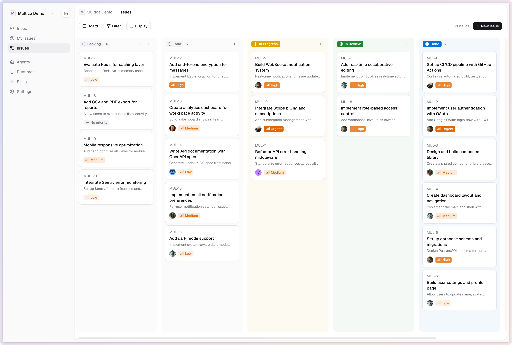
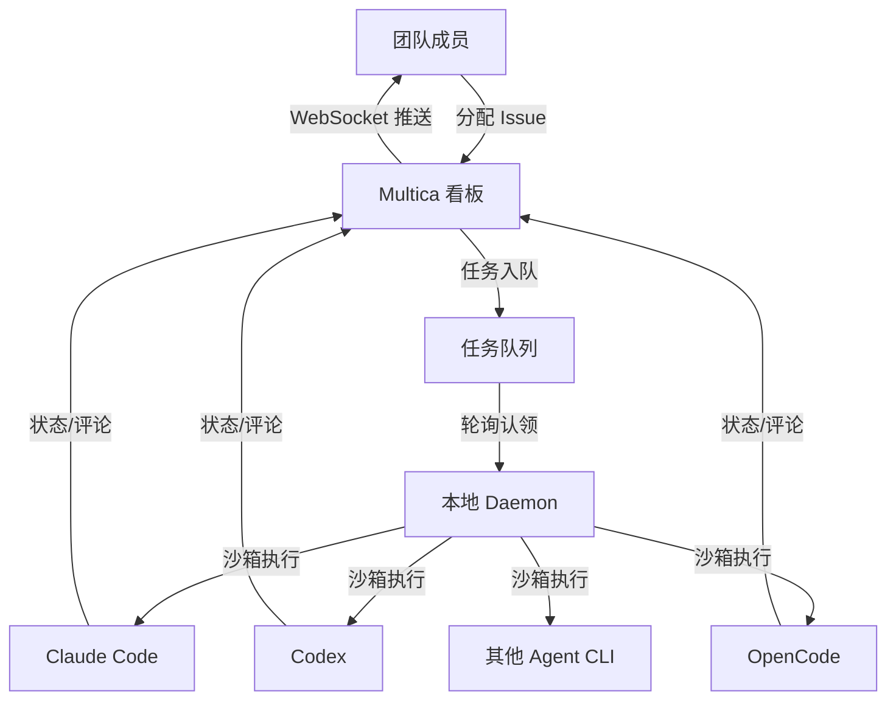
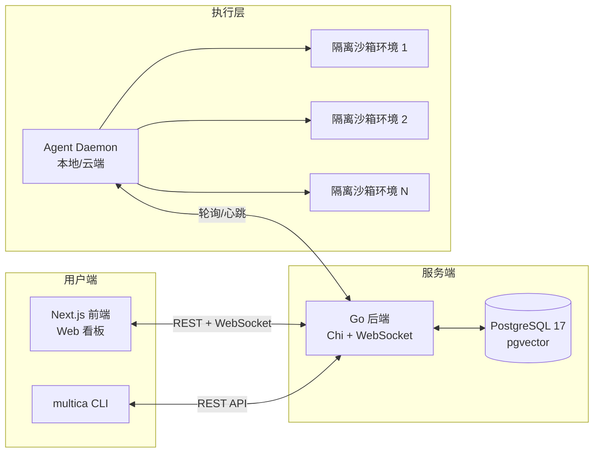
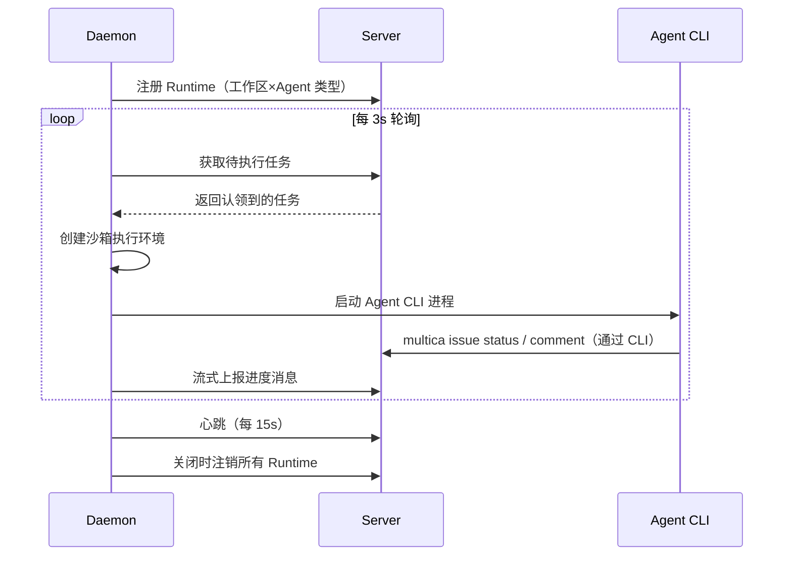
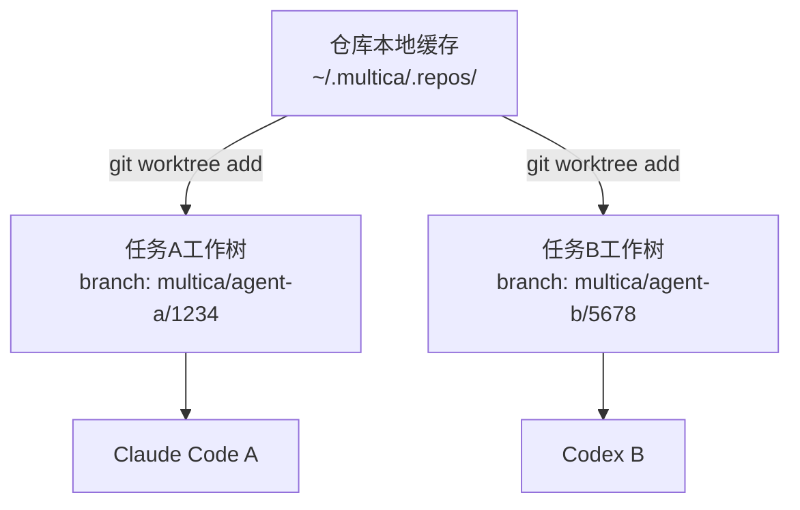
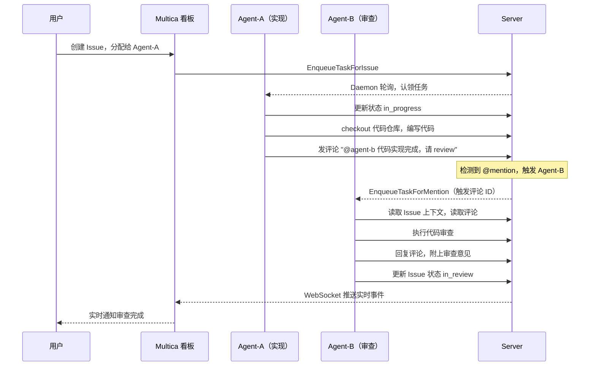

## 什么是 Multica

`Multica` 是一个**开源的`Managed Agents`平台**，项目口号是"你的下一批员工，不是人类"（ *`Your next 10 hires won't be human`* ）。它将`Claude Code`、`Codex`、`OpenCode`、`OpenClaw`、`Hermes`、`Gemini`、`Pi`、`Cursor Agent`等主流`AI`编码智能体转化为真正的**团队成员**——可以像分配任务给同事一样，把`Issue`分配给`Agent`，`Agent`会自主接手工作、编写代码、更新状态、报告阻塞问题。

项目地址：[https://github.com/multica-ai/multica](https://github.com/multica-ai/multica)



`Multica`解决了当前`AI`辅助开发中的核心痛点：

- **割裂的工作流**：开发者需要在编辑器、命令行和任务看板之间频繁切换，把`AI`输出手动搬运到项目管理系统。
- **缺少管理层**：没有统一的入口对多个`AI`工具进行任务分配、进度追踪和成果沉淀。
- **厂商绑定**：各家`AI`工具有自己的`UI`和工作流，难以在团队中统一规范。
- **技能无法复用**：每次让`AI`做类似工作都要重写`Prompt`，团队的最佳实践无法沉淀。



## 核心特性

| 特性 | 说明 |
|------|------|
| `Agent`即队友 | `Agent`有个人档案，出现在看板，可发评论、创建`Issue`、主动报告阻塞 |
| 自主任务执行 | 任务全生命周期自动管理：排队→认领→执行→完成/失败 |
| 可复用技能 | 每个解决方案都可沉淀为全团队共享的 `Skill`，随时间持续增强团队能力 |
| 统一运行时 | 一个控制台管理本地 `Daemon` 和云端运行时，自动检测可用 `CLI` |
| 多工作区 | 工作区级别隔离，各自独立的 `Agent`、`Issue` 和配置 |
| 厂商中立 | 同时支持 8 种主流`AI`编码 `Agent CLI`，无厂商锁定 |
| 自部署支持 | 完整开源，支持 Docker 自部署，数据完全掌控 |

## 架构设计

### 整体架构

`Multica`采用三层架构：**前端`Web`应用**、**`Go`后端服务**和**本地`Daemon`**。三者通过`HTTP REST API`和`WebSocket`进行通信。



### 技术栈明细

| 层级 | 技术栈 | 说明 |
|------|--------|------|
| 前端 | `Next.js 16`（`App Router`） | `React 18`，实时看板`UI` |
| 后端 | `Go`（`Chi router`、`sqlc`、`gorilla/websocket`） | 单二进制，高性能 |
| 数据库 | `PostgreSQL 17` + `pgvector` | 支持向量搜索 |
| `Agent`运行时 | 本地 `Daemon` | 托管多种 `AI CLI` 的执行 |
| 部署 | `Docker Compose` | 自部署一键启动 |

### 各组件详解

#### 前端（Next.js Web 应用）

前端提供项目看板、`Issue`管理、`Agent`配置、运行时监控等全套`UI`。其关键设计要点：

- 使用`staleTime: Infinity`配合`WebSocket`推送驱动数据更新，避免频繁轮询：
- 通过`WebSocket`订阅工作区级别事件总线，实时接收`issue:created`、`issue:updated`、任务进度流等事件；
- `JWT`鉴权 + `WebSocket Origin`白名单双重安全控制。

#### 后端（Go 服务）

后端是整个系统的核心调度层，主要模块如下：

| 模块 | 路径 | 职责 |
|------|------|------|
| `Handler`层 | `server/internal/handler/` | `HTTP`路由处理，参数校验，响应序列化 |
| `Service`层 | `server/internal/service/` | 核心业务逻辑：任务调度、`Autopilot`等 |
| `Daemon`层 | `server/internal/daemon/` | `Agent Daemon`逻辑实现 |
| `Realtime`层 | `server/internal/realtime/` | `WebSocket Hub`，管理订阅连接 |
| `Events`层 | `server/internal/events/` | 进程内事件总线（发布/订阅） |
| `Auth`层 | `server/internal/auth/` | `JWT` + `PAT`（个人访问令牌）认证 |
| `Mention`层 | `server/internal/mention/` | `Issue`标识符（如`MUL-117`）展开为链接 |

使用`sqlc`生成类型安全的数据库访问层，避免手写`SQL`映射。

#### 实时事件总线

`server/internal/events/bus.go`实现了一个进程内同步发布/订阅事件总线：

```go
// 订阅特定事件
bus.Subscribe("issue:created", func(e Event) { ... })

// 全局订阅（接收所有事件）
bus.SubscribeAll(func(e Event) { ... })

// 发布事件（各 handler 可调用）
bus.Publish(events.Event{
    Type:        "issue:updated",
    WorkspaceID: workspaceID,
    Payload:     payload,
})
```

事件总线连接服务端业务逻辑与`WebSocket`推送层，解耦各模块。

#### Agent Daemon

`Daemon`是运行在用户本地机器（或云实例）上的 `Agent` 执行引擎，源码位于`server/internal/daemon/`，这是 `Multica` 区别于其他平台最关键的组件：

**启动流程：**

1. 从`CLI`配置文件加载认证`token`；
2. 调用`API`获取用户所有工作区，为每个工作区、每个检测到的 `Agent CLI` 注册一个`Runtime`；
3. 启动`workspaceSyncLoop`（每`30s`）发现新工作区；
4. 启动`heartbeatLoop`（默认每`15s`）维持心跳；
5. 启动`gcLoop`清理完成任务的沙箱目录；
6. 进入`pollLoop`（默认每`3s`）轮询并认领任务。



## 沙箱技术：隔离执行环境

`Multica`的`Agent`执行隔离采用**文件系统级进程隔离**方案，源码位于`server/internal/daemon/execenv/`。

> 注意：`Multica`当前版本的沙箱不依赖`container`或`VM`层，而是通过**独立目录树 + Git Worktree**实现环境隔离。这是一种轻量级沙箱，优先保证速度和可移植性，适合编码类任务。

### 目录结构

每个任务运行时，`Daemon`在`~/multica_workspaces/<workspace_id>/<task_id_short>/`下创建一套独立目录：

```text
~/multica_workspaces/
└── <workspace_id>/
    └── <task_id_short>/          # 任务根目录 (envRoot)
        ├── workdir/              # Agent 的工作目录（代码在此）
        ├── output/               # 任务输出文件
        ├── logs/                 # 执行日志
        ├── .gc_meta.json         # GC 元数据（issue_id, workspace_id, 完成时间）
        └── codex-home/           # 仅 Codex：per-task CODEX_HOME
```

### Git Worktree 代码隔离

当`Agent`需要操作代码仓库时，通过`multica repo checkout <url>`命令：

1. `Daemon`调用`git worktree add`在`workdir/`下创建独立工作树，分支命名为`multica/<agent-name>/<timestamp>`；
2. 每个任务获得独立的`Git`分支，`Agent`的代码修改互不影响；
3. 支持同一工作区多个`Agent`同时在同一个代码仓库的不同分支上并行工作；
4. 任务完成后，`GC`循环自动清理工作树和沙箱目录。



### 运行时配置注入

不同`Agent CLI`使用不同的配置文件约定，`Multica` 通过`InjectRuntimeConfig`函数统一处理：

| Agent | 注入文件 | 说明 |
|-------|---------|------|
| `claude` | `CLAUDE.md` | `Claude Code` 原生读取工作目录下的 `CLAUDE.md` |
| `codex` | `AGENTS.md` + `CODEX_HOME/skills/` | `Codex` 通过 `AGENTS.md` 和 `CODEX_HOME` 发现技能 |
| `opencode` | `AGENTS.md` | `OpenCode` 原生读取 `AGENTS.md` |
| `openclaw` | `AGENTS.md` | `OpenClaw` 原生读取 `AGENTS.md` |
| `gemini` | `GEMINI.md` | `Gemini CLI` 原生读取 `GEMINI.md` |
| `cursor` | `AGENTS.md` | `Cursor Agent` 原生读取 `AGENTS.md` |
| `pi` | `AGENTS.md` | `Pi CLI` 原生读取 `AGENTS.md` |

注入内容包括：`Agent`身份信息、可用的`multica CLI`命令列表、仓库列表和工作流指引，赋予`Agent`完整的上下文感知能力。

### GC 机制

`gcLoop`定期扫描`multica_workspaces/`目录，读取每个子目录的`.gc_meta.json`，对完成时间超过保留期（默认 `7` 天）的任务目录执行清理，防止磁盘无限膨胀。

## 多 Agent 协作机制

### 设计哲学

`Multica`的多`Agent`协作核心思路是：**用`Issue`作为协作的基本单元**，多个`Agent`可以围绕同一个 `Issue` 进行异步协作，而不需要在`Agent`间建立直接的通信通道。这使协作模型更接近人类团队的实际工作方式。

### 协作触发机制

`Multica`支持两种触发`Agent`执行任务的方式：

#### 分配触发（Assignment Trigger）

将`Issue`分配给`Agent`时自动触发：

```text
Issue 分配给 Agent-A
    → TaskService.EnqueueTaskForIssue()
    → 创建 agent_task_queue 记录
    → Daemon 轮询认领
    → Agent-A 开始执行
```

#### @mention 触发（Mention Trigger）

在`Issue`评论中`@mention`特定`Agent`，触发该`Agent`参与协作：

```text
评论内容：@agent-b 请帮我做代码审查
    → TaskService.EnqueueTaskForMention()
    → Agent-B 收到任务，上下文为触发评论 ID
    → Agent-B 读取评论内容，响应并执行
```

这使多个`Agent`可以在同一个`Issue`下进行接力或并行协作。

### 多 Agent 协作完整流程



### 任务上下文传递

为了让`Agent`在接手任务时理解完整上下文，`Multica`会将以下信息注入到执行环境中：

- `IssueID`：当前处理的 `Issue` 编号；
- `TriggerCommentID`：触发本次执行的评论`ID`（区分是分配触发还是评论触发）；
- `AgentID` / `AgentName`：`Agent` 的身份；
- `AgentInstructions`：`Agent` 的个性化指令（人设/技能方向）；
- `AgentSkills`：`Agent` 已安装的技能列表；
- `Repos`：工作区已注册的代码仓库列表。

`Agent`通过`multica CLI` 工具与平台交互，读取和更新 `Issue` 状态：

```bash
# Agent 在执行过程中可调用的命令
multica issue get <id> --output json          # 读取 Issue 详情
multica issue comment list <id> --output json # 读取所有评论
multica issue comment add <id> --content "..." # 发布评论
multica issue status <id> in_progress          # 更新状态
multica repo checkout <url>                    # 检出代码仓库
```

### 与其他项目相比的优势

| 维度 | Multica | OpenDevin | AutoGen | CrewAI |
|------|---------|-----------|---------|--------|
| 集成方式 | 包装现有成熟 `CLI`（`Claude Code` 等） | 自有 `Agent` 框架 | 自有框架 | 自有框架 |
| 多 `Agent` 协作 | `Issue + @mention` 异步协作 | 任务规划 + 子 `Agent` | `Agent` 对话轮转 | 角色分工，顺序/并行 |
| 人机协作模式 | 看板式，与人类工作流无缝融合 | 主要面向自动化管道 | 代码优先，程序化 | 代码优先，程序化 |
| 技术底座 | 成熟的 `AI CLI` 工具 | 独立沙箱 + 自有 `LLM` 接入 | `Python`，`LLM API` | `Python`，`LLM API` |
| 团队协作 | 原生多用户多 `Agent` | 单用户为主 | 单用户为主 | 单用户为主 |
| 技能复用 | `Skills` 系统，团队共享 | `Memory` 系统 | 有限 | 无内建机制 |
| 部署方式 | `Docker` 自部署 / 云服务 | 自部署 | 本地`Python` | 本地`Python` |

**Multica 的核心优势在于：**

1. **零框架锁定**：不自研 `Agent` 框架，直接集成业界最优秀的`Claude Code`、`Codex`等 `CLI`，充分利用这些工具已有的代码理解、工具调用和上下文管理能力；
2. **团队原生设计**：多用户、多角色、多工作区是第一公民，而非后期补丁；
3. **与人类工作流融合**：看板模型是大多数开发团队最熟悉的工作方式，`Agent` 参与到已有流程中，而不是要求团队适应新工作方式；
4. **异步协作**：基于 `Issue`/评论的异步协作模型天然支持跨时区、跨人机的复杂工作场景。

## Skills 技能系统

`Skills`是 `Multica` 的知识积累和复用机制。每个技能是一个结构化的 `Markdown` 文档，描述特定领域的工作流程或最佳实践。

### 技能的工作方式

1. 团队成员在 `Multica` 平台上创建并管理 `Skills`；
2. `Agent` 被创建时，可以为其分配一组 `Skills`；
3. 任务执行前，`Daemon` 将 `Agent` 的 `Skills` 写入沙箱执行环境对应位置（`Claude` 写入`.claude/skills/`，`Codex` 写入`CODEX_HOME/skills/`等）；
4. `Agent CLI` 在启动时自动发现并加载这些技能作为上下文。

### 技能锁文件

项目使用`skills-lock.json`管理技能依赖（类似`package-lock.json`的思路）：

```json
{
  "version": 1,
  "skills": {
    "frontend-design": {
      "source": "anthropics/skills",
      "sourceType": "github",
      "computedHash": "063a0..."
    },
    "shadcn": {
      "source": "shadcn/ui",
      "sourceType": "github",
      "computedHash": "507f0..."
    }
  }
}
```

`Skills` 支持从 `GitHub` 拉取社区贡献的技能包，实现跨团队知识共享。

## 安装与配置

### 快速安装（推荐）

```bash
# macOS / Linux，通过 Homebrew 安装
brew install multica-ai/tap/multica

# 一键配置：连接 Multica Cloud，登录，启动 Daemon
multica setup
```

### 自部署（Self-Hosting）

```bash
# 方式一：安装脚本（自动部署服务端 + 安装 CLI）
curl -fsSL https://raw.githubusercontent.com/multica-ai/multica/main/scripts/install.sh | bash -s -- --with-server
multica setup self-host

# 方式二：手动克隆部署
git clone https://github.com/multica-ai/multica.git
cd multica
make selfhost

# CLI 安装和配置
brew install multica-ai/tap/multica
multica setup self-host
```

自部署后访问：

- 前端：http://localhost:3000
- 后端`API`：http://localhost:8080
- 登录验证码（非生产环境）：`888888`

### Daemon 配置参数

| 配置项 | 环境变量 | 默认值 | 说明 |
|--------|---------|--------|------|
| 轮询间隔 | `MULTICA_DAEMON_POLL_INTERVAL` | `3s` | 检查新任务的频率 |
| 心跳间隔 | `MULTICA_DAEMON_HEARTBEAT_INTERVAL` | `15s` | 存活心跳频率 |
| Agent 超时 | `MULTICA_AGENT_TIMEOUT` | `2h` | 单个任务最长运行时间 |
| 最大并发任务 | `MULTICA_DAEMON_MAX_CONCURRENT_TASKS` | `20` | 同时执行的最大任务数 |
| Daemon ID | `MULTICA_DAEMON_ID` | 主机名 | 唯一标识 |
| 工作区根目录 | `MULTICA_WORKSPACES_ROOT` | `~/multica_workspaces` | 沙箱目录根路径 |

### Agent CLI 路径覆盖

如果 `Agent CLI` 不在系统`PATH`中，可通过环境变量指定：

| 变量 | 说明 |
|------|------|
| `MULTICA_CLAUDE_PATH` | `claude`二进制的自定义路径 |
| `MULTICA_CLAUDE_MODEL` | 覆盖使用的 `Claude` 模型 |
| `MULTICA_CODEX_PATH` | `codex`二进制的自定义路径 |
| `MULTICA_CODEX_MODEL` | 覆盖使用的 `Codex` 模型 |
| `MULTICA_GEMINI_PATH` | `gemini`二进制的自定义路径 |
| `MULTICA_GEMINI_MODEL` | 覆盖使用的 `Gemini` 模型 |

## 使用示例

### 示例一：分配第一个任务给 Agent

```bash
# 1. 安装 CLI 和至少一个 Agent CLI
brew install multica-ai/tap/multica
# 确保 claude 或 codex 在 PATH 上

# 2. 一键配置并启动
multica setup

# 3. 创建一个 Issue
multica issue create --title "实现用户注册功能" --description "需要添加邮件验证"

# 4. 查看 Issue 列表，获取 ID
multica issue list --output json

# 5. 将 Issue 分配给 Agent（在 Web UI 中操作，或使用 CLI）
multica issue assign <issue-id> --to "Claude"
```

### 示例二：通过 @mention 触发多 Agent 协作

假设`Agent-A`（`Claude Code`）已完成功能实现，现在需要`Agent-B`（`Codex`）进行代码审查：

```bash
# 在 Issue 的评论中 @mention Agent-B
multica issue comment add <issue-id> \
  --content "@codex-reviewer 功能实现已完成，请审查代码质量并提出改进建议"
```

`Multica`后端检测到`@mention`后自动为`Agent-B`创建任务，`Agent-B`读取评论上下文后自主开展审查。

### 示例三：查看 Daemon 状态和日志

```bash
# 查看 Daemon 运行状态
multica daemon status

# 实时跟踪日志
multica daemon logs -f

# 查看 JSON 格式的详细状态（包含已注册的 Runtime 信息）
multica daemon status --output json
```

### 示例四：自定义 Agent 超时和并发

```bash
# 启动 Daemon 时指定参数
multica daemon start \
  --agent-timeout 4h \
  --max-concurrent-tasks 5 \
  --poll-interval 5s
```

### 示例五：多工作区管理

```bash
# 查看当前所有工作区
multica workspace list

# 切换工作区
multica workspace use <workspace-slug>

# 在特定工作区创建 Issue
multica issue create --title "后端优化" --workspace <workspace-id>
```

## 与同类项目对比

### Multica vs Golutra

| 维度 | Multica | Golutra |
|------|---------|---------|
| 定位 | 团队`AI Agent`协作管理平台 | 个人多`Agent`工作空间桌面应用 |
| 架构 | 云端/自部署服务 + 本地 `Daemon` | 本地 `Tauri` 桌面应用（`Rust + Vue 3`） |
| 用户模型 | 多人团队，角色权限 | 单人，一人军团 |
| 看板 | 项目看板（`Issue` 驱动） | 桌面 `GUI` 面板 |
| 沙箱 | 文件系统 + `Git Worktree` | `PTY` 伪终端进程级隔离 |
| `Agent` 协作 | `Issue + @mention` 异步协作 | 并行 `PTY` 面板，手动派发 |
| 技能系统 | `Skills`（团队共享） | 无内建机制 |
| 适用场景 | 工程团队，长期项目 | 个人高强度多任务并行 |

### Multica vs Paperclip

`Multica` 官方文档直接对标 `Paperclip`，核心差异如下：

| 维度 | Multica | Paperclip |
|------|---------|-----------|
| 定位 | 团队`AI Agent`协作平台 | 个人`AI Agent`公司模拟器 |
| 用户模型 | 多人团队，角色权限 | 单人 `Board Operator` |
| `Agent` 交互 | `Issue` + 评论会话 | `Issue` + 心跳轮询 |
| 部署模式 | 云端优先，支持自部署 | 本地优先 |
| 管理深度 | 轻量（`Issue` / `Project` / `Labels`） | 重度（组织架构 / 审批 / 预算） |
| 扩展性 | `Skills` 系统 | `Skills` + 插件系统 |

### Multica vs OpenDevin（All-Hands）

| 维度 | Multica | OpenDevin |
|------|---------|-----------|
| 框架 | 包装外部 `CLI` | 自研 `Agent` 框架 |
| 沙箱 | 文件系统 + `Git Worktree` | `Docker` 容器级隔离 |
| 使用门槛 | 低（现有工具直接接入） | 中（需理解框架） |
| 扩展能力 | 依赖外部 `CLI` 能力 | 框架内可深度定制 |
| 团队协作 | 原生支持，多用户 | 主要单用户模式 |
| 适用场景 | 团队日常开发协作 | 复杂自动化管道探索 |

## 开发者接入

对于想参与 `Multica` 贡献的开发者，本地开发环境搭建：

**环境依赖：**

- `Node.js v20+`
- `pnpm v10.28+`
- `Go v1.26+`
- `Docker`

```bash
git clone https://github.com/multica-ai/multica.git
cd multica

# 一键启动开发环境（自动检测主仓库或 worktree）
make dev
```

`make dev`会自动完成：创建环境配置文件、安装 `JS` 依赖、启动 `PostgreSQL` 容器、初始化数据库、执行迁移、启动后端和前端。

对于需要并行开发多个功能的贡献者，项目提供了`Git Worktree`支持，每个`worktree`使用独立数据库（通过端口哈希自动分配隔离端口），互不干扰。

## 总结

`Multica`代表了一种务实的`AI`团队协作思路：**不重新发明`AI`框架，而是为最优秀的现有`AI CLI`工具构建一层团队协作管理层**。它的 `Issue` 驱动、`@mention` 协作、`Skills` 技能积累和 `Git Worktree` 隔离等设计，使`AI Agent`能够真正融入工程团队的日常工作流，而非成为需要单独维护的独立系统。

对于希望在团队中引入`AI Agent`协作、同时保持厂商中立和数据自主的工程团队，`Multica`值得认真评估。
