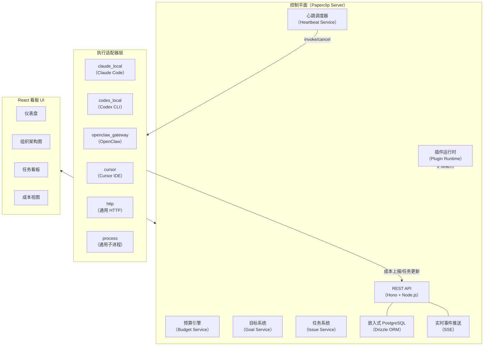
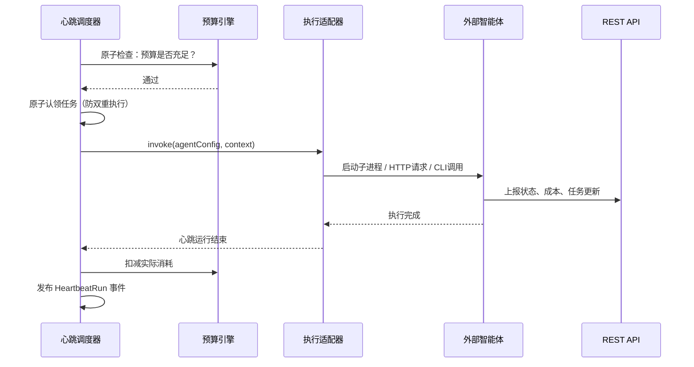
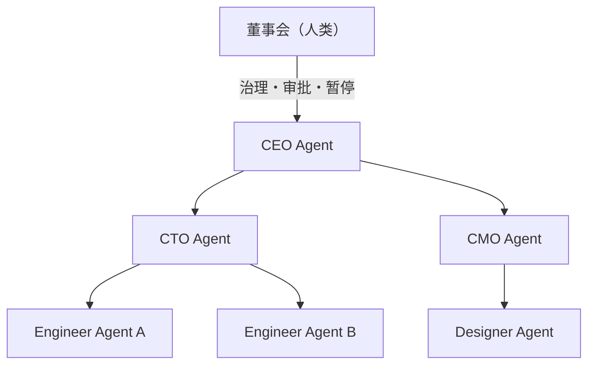
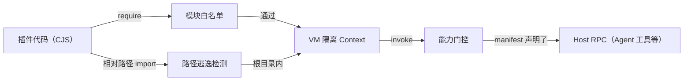

## 什么是 Paperclip

`Paperclip` 是一个开源的**多智能体公司级编排控制平面**，项目口号是「`Open-source orchestration for zero-human companies`」（零人力公司的开源编排）。其使命是成为自主经济的底层基础设施——让一组`AI`智能体像真实公司员工一样被组织、调度、考核和管理，从而将`AI`劳动力规模化地应用于商业场景。

项目地址：[https://github.com/paperclipai/paperclip](https://github.com/paperclipai/paperclip)

> 如果说`OpenClaw`是一个「员工」，那么`Paperclip`就是那家「公司」。

`Paperclip`从技术形态上看是一个`Node.js`服务器加`React`看板`UI`，但其核心价值在于引入了一套企业级的组织模型：组织架构图（`Org Chart`）、分级目标（`Goal Hierarchy`）、心跳调度（`Heartbeat`）、预算控制（`Budget`）、治理审批（`Governance`）和多公司数据隔离（`Multi-Company Isolation`）。

与目前流行的`LangChain`、`CrewAI`、`AutoGen`等`AI`编排框架相比，`Paperclip`并不告诉你如何构建智能体，而是告诉你如何**运营一家由智能体组成的公司**。

## 核心问题与解决方案

### Paperclip 解决的核心痛点

当工程师同时使用多个`AI`编码智能体时，会遭遇一系列系统性问题：

| 痛点 | 描述 |
|---|---|
| 失控的并发会话 | 同时打开 `20` 个`Claude Code`终端，重启即丢失所有上下文，无从追踪谁在做什么 |
| 手动汇总上下文 | 每次启动新任务都要手动把多处分散的信息整理给智能体 |
| 碎片化配置管理 | 各种智能体配置文件散落各处，任务管理、通信和协调机制各自为政 |
| 不受控的成本 | 智能体循环失控时，可能在发现前就耗尽数百美元的`Token`额度 |
| 定时任务缺失 | 客服、报告、社媒发布等周期性工作，依赖人工手动触发 |

`Paperclip`用一套统一的控制平面解决上述问题：任务基于工单（`Ticket`）管理，对话上下文跨会话持久化，目标由任务向上溯源至公司使命，预算硬上限自动暂停失控的智能体，心跳机制驱动定时执行。

### 核心设计理念

`Paperclip`的设计哲学可以概括为以下几点：

**公司即产品，不是工具集。** `Paperclip`将组织结构、目标、预算、治理视为一等公民，而不是可选的插件。

**控制平面与执行运行时分离。** `Paperclip`不运行智能体，只编排它们。智能体在自己的运行时中独立执行，通过`Heartbeat`机制和`REST API`与控制平面通信。

**原子执行保证。** 任务的认领（`Checkout`）与预算扣减操作是原子的，杜绝双重执行和超额消费。

**最小接入门槛。** 任何能够接收调用的程序都可以成为`Paperclip`的智能体，不要求特定框架，不要求上报回调。

## 系统架构

### 整体架构概览

`Paperclip`采用两层架构：**控制平面**（`Control Plane`）负责编排调度，**执行适配器**（`Execution Adapters`）负责驱动各类外部智能体运行。



### 核心服务模块

`Paperclip`服务端按职责划分为以下核心模块：

| 服务模块 | 文件 | 职责 |
|---|---|---|
| `heartbeat` | `heartbeat.ts` | 心跳调度：按计划触发适配器、管理运行会话、聚合运行日志 |
| `issues` | `issues.ts` | 任务生命周期：创建、分配、状态流转、评论、子任务 |
| `agents` | `agents.ts` | 智能体注册：身份、组织位置、配置版本管理、`API Key` |
| `budgets` | `budgets.ts` | 预算管理：按周期/总量设置硬上限，触发时暂停智能体 |
| `goals` | `goals.ts` | 目标层级：公司使命→项目→里程碑→任务的上下文链 |
| `costs` | `costs.ts` | 成本追踪：按智能体、任务、项目、公司汇总`Token`消耗 |
| `execution-workspace` | `execution-workspaces.ts` | 执行工作区：`Git Worktree`和隔离目录管理 |
| `plugin-runtime-sandbox` | `plugin-runtime-sandbox.ts` | 插件沙箱：`VM`隔离执行插件工作进程 |
| `company-skills` | `company-skills.ts` | Skills 系统：可复用的技能包在公司范围内分发给智能体 |
| `live-events` | `live-events.ts` | 实时推送：`SSE`事件流将控制平面状态变更推送到`UI` |
| `secrets` | `secrets.ts` | 密钥管理：加密存储、导出时脱敏处理 |
| `approvals` | `approvals.ts` | 审批网关：为高影响决策（雇用、策略变更）设置人工审批门 |

### 数据库层

`Paperclip`使用**嵌入式`PostgreSQL`**（由`@electric-sql/pglite`提供），启动时无需用户自行安装和配置数据库实例。数据访问层通过`Drizzle ORM`实现，`Schema`定义在`packages/db`包中，包含`agents`、`issues`、`goals`、`heartbeatRuns`、`costEvents`、`budgetPolicies`等核心表。

### UI 层

前端是基于`React 18` + `Vite`构建的单页应用，采用组件化看板设计，提供：

- 组织架构图（`Org Chart SVG`）可视化
- 任务看板（`Kanban`）与评论线程
- 实时心跳运行日志流
- 成本与预算仪表盘
- 智能体配置与`Skills`管理
- 插件管理界面

UI 通过`SSE`（`Server-Sent Events`）订阅控制平面的实时事件，实现零刷新的动态更新。

## 多智能体协作机制

这是`Paperclip`区别于其他项目的**核心设计**，值得重点展开。

### 心跳协议（Heartbeat Protocol）

`Paperclip`的多智能体协作不是通过消息总线或`RPC`调用实现的，而是通过一套**心跳驱动的调度协议**：



心跳调度器在触发每一次运行前都会**原子性地**完成预算校验和任务认领，确保：

- 不会因并发调度出现同一任务被两个智能体同时执行的情况
- 预算耗尽时不会再启动新的运行，且当前运行会收到优雅终止信号

每次心跳运行的全量日志、`Token`消耗、任务更新都被持久化为`HeartbeatRun`记录，提供完整的审计轨迹。

### 组织架构与委托机制

`Paperclip`的多智能体协作以**层级组织架构图**为骨架，`CEO`智能体位于顶层，下设`CTO`、`CMO`等管理层，再往下是工程师、设计师、营销等执行层智能体。



**组织架构图不是访问控制，而是委托与汇报线。** 任何智能体都可以查看整个组织架构、所有任务和所有智能体的信息，组织架构定义的是任务的委托路径和成本归因路径。

#### 跨团队任务委托

智能体可以在汇报线之外向其他团队的智能体分配任务，这是跨团队协作的核心机制。`Paperclip`制定了明确的任务接收规则：

| 场景 | 处理方式 |
|---|---|
| 同意执行任务且有能力完成 | 直接完成任务 |
| 同意执行任务但无力完成 | 将任务标记为`blocked` |
| 质疑任务是否值得做 | 不得自行取消，必须转交给自己的经理决定 |

跨团队请求会携带**委托深度**（`depth`）整数字段，记录任务经历了多少跳才到达当前执行者，方便管理者理解工作是如何在组织中流动的。

#### 成本归因（Billing Code）

每个任务都携带`billing code`，智能体`B`执行智能体`A`发起的任务时，`B`产生的`Token`成本会归因到`A`的请求。这使整个组织的成本可以按发起方追溯，管理者可以精确知道哪条任务链消耗了多少资源。

### 目标对齐（Goal Alignment）

`Paperclip`维护一个**目标层级链**：

```
公司使命（Company Mission）
  └─ 目标（Goal / Initiative）
       └─ 项目（Project）
            └─ 里程碑（Milestone）
                 └─ 任务（Issue）
                      └─ 子任务（Sub-Issue）
```

每个任务在执行时都携带完整的目标祖先链，智能体在运行时始终能知道「为什么要做这件事」，而不仅仅是看到一个孤立的任务标题。这种上下文传递方式（称为「`Goal-Aware Execution`」）显著提升了智能体决策的一致性。

### 任务状态机

`Paperclip`的任务状态不是单纯的`UI`标签，而是附带了明确的执行语义：

| 状态 | 语义 |
|---|---|
| `backlog` | 不可操作，安全休眠 |
| `todo` | 可执行但未认领，可以有分配者 |
| `in_progress` | 必须有认领者；对智能体任务，控制平面会保持执行心跳 |
| `blocked` | 等待外部条件，智能体暂停执行 |
| `in_review` | 执行暂停，等待评审者或人工审批 |
| `done` | 终态，工作完成 |

`in_progress`是严格的执行状态，系统会主动避免其成为无人跟进的「沉默死状态」（`silent dead state`）。

### 持久化会话与跨重启恢复

区别于无状态的调用模型，`Paperclip`通过`agentTaskSessions`表维护每个智能体的任务会话状态。对于`claude_local`、`codex_local`、`cursor`等本地会话型适配器，重启后可以恢复到上次的会话上下文，而不是从头重新开始，极大降低了因宕机或重启导致的上下文丢失。

### Skills 技能系统

`Paperclip`提供一个公司级的`Skills`系统：技能包（`Skill`）是可复用的指令集或工具集，可以在控制平面中统一管理，并在心跳触发时注入到智能体的运行时上下文中。这个机制实现了：

- **运行时技能注入**：智能体无需重新训练即可学会新的`Paperclip`工作流
- **最佳实践沉淀**：团队的`Prompt`经验封装为技能包，自动分发给所有相关智能体
- **公司级统一策略**：管理层可以为整个组织的智能体下发统一的行为规范

### 公司模板（Company Templates）

整个公司的组织配置（智能体定义、组织架构、适配器配置、角色描述、密钥脱敏后的外壳）可以导出为**可移植的公司模板**。导入时支持碰撞检测（`Collision Handling`）。模板分两种形式：

| 模式 | 内容 | 用途 |
|---|---|---|
| `Template Export` | 组织结构 + 配置骨架 + 少量种子任务 | 复制公司蓝图，快速启动新公司 |
| `Snapshot Export` | 完整状态（结构 + 当前任务 + 智能体状态） | 完整快照，可用于恢复或 Fork |

## 底层沙箱技术

### 插件运行时沙箱

`Paperclip`的插件系统（`Plugin Runtime`）使用`Node.js`内置的`vm`模块构建沙箱，在隔离的`VM Context`中加载插件的工作进程（`Plugin Worker`）。沙箱具备以下安全特性：

- **全局变量白名单。** 沙箱`Context`中仅注入显式许可的全局对象（`console`、`setTimeout`、`URL`、`TextEncoder`等），不暴露`process`、`fs`等危险对象。

- **模块导入白名单。** 裸模块（`Bare Module Specifier`）需要在`allowedModuleSpecifiers`中显式列出，未在允许列表中的模块一律拒绝导入，防止插件意外访问主机敏感资源。

- **路径逃逸防护。** 相对导入路径经过`realpathSync`解析后，会严格检查是否落在插件根目录（`pluginRoot`）之内，防止通过`../`路径逃逸访问插件目录以外的文件。

- **执行超时。** 使用`vm.Script.runInContext`的`timeout`参数限制脚本执行时间（默认`2000ms`），防止插件中的无限循环挂起服务器进程。

- **能力门控（`Capability Gating`）。** 每个插件需要在`manifest`中声明自己的能力列表（`capabilities`），通过`CapabilityScopedInvoker`包装的主机`RPC`调用在执行前都会经过`CapabilityValidator`校验，不在声明范围内的操作一律拒绝。

- **仅支持`CommonJS`。** 沙箱加载器只支持`CommonJS`格式，`ESM`模块会被检测并拒绝（通过`looksLikeEsm`函数判断），以确保沙箱的初始化时序和超时机制能够正确覆盖模块体执行。



### 执行工作区隔离

对于需要文件系统访问的智能体（如`Claude Code`、`Codex`），`Paperclip`提供三种执行工作区策略：

| 策略 | 机制 | 适用场景 |
|---|---|---|
| `project_primary` | 所有任务共享同一项目主目录 | 单任务串行执行 |
| `git_worktree` | 为每个任务创建独立的`Git Worktree`分支 | 多任务并发隔离执行 |
| `adapter_managed` | 适配器自行管理工作区（如云沙箱） | 云端或容器化执行 |

`git_worktree`策略是多任务并发场景下的推荐方案：每个任务在独立的`Worktree`分支上工作，互不干扰，任务完成后可以自动创建`Pull Request`。

## 使用方法与配置示例

### 快速启动

最简单的启动方式（本地受信模式，无需登录）：

```bash
npx paperclipai onboard --yes
```

局域网访问模式（需要登录认证）：

```bash
npx paperclipai onboard --yes --bind lan
```

`Tailscale`专网模式：

```bash
npx paperclipai onboard --yes --bind tailnet
```

从源码启动：

```bash
git clone https://github.com/paperclipai/paperclip.git
cd paperclip
pnpm install
pnpm dev
```

启动后，`API`服务默认监听`http://localhost:3100`，嵌入式`PostgreSQL`数据库自动初始化，无需额外安装。

### 部署模式配置

`Paperclip`支持三种运行时模式，通过配置文件或命令行参数选择：

| 模式 | 人工认证 | 适用场景 |
|---|---|---|
| `local_trusted` | 不需要 | 单人本地机器，最快启动 |
| `authenticated` + `private` | 需要登录 | 局域网 / `VPN` / `Tailscale` 私有访问 |
| `authenticated` + `public` | 需要登录 | 互联网公开部署，需配置显式公网 `URL` |

### 创建第一家 AI 公司

以下是通过`Paperclip`创建一家软件公司的典型流程：

**第一步：定义公司使命**

在`UI`中创建公司，填写使命（`Mission`），例如：

```
Build the #1 AI note-taking app to $1M MRR.
```

**第二步：雇用 CEO 智能体**

在「`Agents`」页面创建`CEO`智能体，选择适配器类型（以`claude_local`为例）并配置：

```json
{
  "adapterType": "claude_local",
  "name": "Alice CEO",
  "role": "ceo",
  "title": "Chief Executive Officer",
  "budgetMonthlyCents": 5000,
  "adapterConfig": {
    "model": "claude-opus-4-5",
    "workingDirectory": "~/projects/my-app"
  }
}
```

**第三步：批准战略计划**

`CEO`的首次心跳会审查公司使命，提出组织架构拆解和战略计划，控制平面会触发人工审批网关（`Board Approval Gate`），在你批准后`CEO`才开始分配任务。

**第四步：智能体自动接管**

`CEO`向`CTO`委托技术任务，`CTO`进一步拆分给各工程师智能体，整个执行过程可在看板中实时追踪，每一条评论、每一次工具调用都有完整记录。

### 配置 Codex 适配器示例

```json
{
  "adapterType": "codex_local",
  "name": "Bob Engineer",
  "role": "engineer",
  "title": "Software Engineer",
  "reportsTo": "alice-cto-agent-id",
  "budgetMonthlyCents": 2000,
  "adapterConfig": {
    "model": "o4-mini",
    "workingDirectory": "~/projects/my-app",
    "approvalMode": "auto-edit"
  }
}
```

### 配置执行工作区（Git Worktree 隔离）

在项目设置中启用`Git Worktree`隔离策略：

```json
{
  "executionWorkspacePolicy": {
    "enabled": true,
    "defaultMode": "isolated_workspace",
    "workspaceStrategy": {
      "type": "git_worktree",
      "baseRef": "main",
      "branchTemplate": "agent/{agentSlug}/{issueId}"
    },
    "pullRequestPolicy": {
      "autoCreate": true,
      "targetBranch": "main"
    }
  }
}
```

### 配置预算策略

为公司设置月度`Token`预算硬上限：

```json
{
  "budgetPolicy": {
    "scopeType": "company",
    "windowKind": "monthly",
    "hardLimitCents": 50000,
    "softAlertThreshold": 0.8
  }
}
```

触达软警报阈值（`80%`）时发出通知，触达硬上限时自动暂停所有智能体，控制平面通知人工介入。

### 设置定时例行任务（Routine）

配置一个每日定时触发的`SEO`内容智能体：

```json
{
  "routine": {
    "name": "Daily Content Generation",
    "agentId": "content-agent-id",
    "schedule": "0 9 * * *",
    "goalId": "traffic-growth-goal-id"
  }
}
```

### 安装 Skills 技能包

通过`Skills`管理界面从`GitHub`安装公共技能包，或在公司内创建私有技能：

```bash
# 从 GitHub 安装官方 Paperclip Skills
paperclipai skills install https://github.com/paperclipai/skills/paperclip-workflow
```

安装后，在智能体配置中引用该技能，心跳触发时技能内容会被自动注入到运行时上下文。

## 与同类开源项目的对比

下表从多个维度对`Paperclip`与主流同类开源项目进行横向比较：

| 对比维度 | Paperclip | Multica | CrewAI | AutoGen | LangGraph | OpenClaw |
|---|---|---|---|---|---|---|
| **定位** | 公司级多智能体编排控制平面 | 多智能体任务管理平台 | 角色扮演多智能体框架 | 对话式多智能体框架 | 状态机工作流编排 | 单体 `AI` 编码智能体 |
| **组织架构** | 完整`Org Chart`，层级管理汇报 | 扁平任务分配 | 角色列表 | 对话组 | 无 | 无 |
| **目标对齐** | 使命→目标→项目→任务完整链 | 项目→任务 | 无 | 无 | 无 | 无 |
| **心跳调度** | 内置，按 `Cron` 定时唤醒 | 内置 | 无 | 无 | 无 | 无 |
| **预算控制** | 按智能体/项目/公司分级预算 | 基础成本追踪 | 无 | 无 | 无 | 无 |
| **治理审批** | 内置审批网关，可回滚 | 无 | 无 | 无 | 无 | 无 |
| **沙箱隔离** | `VM` 沙箱（插件）+ `Git Worktree`（工作区） | `Git Worktree` | 无 | 无 | 无 | 无 |
| **智能体来源** | 任意（`BYOA`）| `Claude/Codex/OpenClaw` 等 | 框架内 `Agent` | 框架内 `Agent` | 框架内 `Node` | 自身 |
| **持久会话** | 跨重启恢复任务上下文 | 支持 | 无 | 部分 | 无 | 无 |
| **多公司隔离** | 完整数据隔离，单实例多公司 | 单项目 | 无 | 无 | 无 | 无 |
| **公司模板** | 导入/导出整套公司配置 | 无 | 无 | 无 | 无 | 无 |
| **插件系统** | 内置，`VM` 沙箱隔离 | 无 | 工具插件 | 工具插件 | 工具插件 | 无 |
| **移动端** | 可通过浏览器访问 | 无 | 无 | 无 | 无 | 无 |

### Paperclip vs Multica

`Multica`和`Paperclip`是目前设计理念最接近的两个项目，都致力于将多个`AI`编码智能体统一管理到单一平台。主要差异在于：

- **目标层次**：`Paperclip`引入了公司使命→目标→项目的完整层级链，`Multica`以项目和任务为顶层概念。
- **组织模型**：`Paperclip`有完整的`Org Chart`、汇报层级和跨团队委托协议，`Multica`是扁平分配模型。
- **治理机制**：`Paperclip`内置人工审批网关和配置回滚，`Multica`无对应设计。
- **技术栈**：`Paperclip`使用`Node.js` + 嵌入式`PostgreSQL`，`Multica`使用`Go` + `PostgreSQL`（含`pgvector`）。

### Paperclip vs CrewAI / AutoGen

`CrewAI`和`AutoGen`是**代码优先**的多智能体框架，需要用`Python`代码定义智能体的角色、工具和协作流程，适合开发者构建特定用途的`AI`应用。`Paperclip`则是**平台优先**的编排系统，通过`UI`和配置管理整个「公司」，不需要编写框架代码，适合需要长期运营多个异构智能体的场景。

### Paperclip vs LangGraph

`LangGraph`是基于有向图的工作流编排引擎，擅长定义精确的状态机流程，适合确定性的、有固定拓扑结构的`AI`流水线。`Paperclip`解决的是更宏观的组织协调问题，不限定智能体的内部执行逻辑，只管理它们之间的任务分发、通信和治理。

## 显著优势总结

与同类项目相比，`Paperclip`有以下几点最为突出的优势：

- **真正的「带你自己的智能体」（`BYOA`）。** 任何能接收调用的程序都是合法的`Paperclip`智能体，无需特定`SDK`或框架，`Claude Code`、`Codex`、自定义`Python`脚本、`HTTP Webhook`都可以无缝接入。

- **企业级组织建模。** `Org Chart`、`Goal Hierarchy`、`Budget`、`Governance`等这些在企业软件中司空见惯的概念，被首次系统性地引入到`AI`多智能体协作领域。

- **原子化执行保证。** 任务认领和预算扣减的原子性处理是大多数开源项目忽略的工程细节，`Paperclip`在架构层面解决了多智能体并发调度的经典双重执行问题。

- **跨重启持久会话。** 对本地会话型适配器（`Claude Code`、`Codex`等）提供任务上下文的持久化，使智能体的工作状态能够在服务器重启后无缝恢复。

- **可移植的公司模板。** 整个公司的组织配置可以被打包、分享和复用，这让「一键复制一家`AI`公司」变成了现实，也是向「`Clipmart`」（公司模板市场）生态演进的基础。

## 项目现状与展望

截至`2026`年`4`月，`Paperclip`已完成以下里程碑：

- 插件系统（`VM`沙箱隔离）
- `OpenClaw`和多类本地编码智能体的适配器
- 公司导入/导出与组织模板
- `Skills`技能管理系统
- 定时例行任务（`Routines`）
- 改进的预算管理
- 智能体评审与审批流程

正在规划中的重要方向包括：

- **多人类用户**：多名人类运营者共同监管同一家`AI`公司
- **云/沙箱智能体**：支持`e2b`等云端沙箱执行环境
- **工作成果（`Artifacts`）**：将智能体的输出（代码、文档、部署产物）作为一等公民管理
- **记忆与知识库**：为公司和智能体提供持久记忆和知识检索能力
- **`MAXIMIZER MODE`**：更高自主度的执行模式，智能体主动分解和规划，减少人工介入
- **`Clipmart`**：一键下载和部署完整公司模板的市场生态

`Paperclip`代表了`AI`多智能体系统从「工具集」向「组织系统」演进的重要方向，是目前开源社区中为数不多真正将「智能体即员工」落地为完整产品的项目。对于希望构建长期运行的自主`AI`业务的团队来说，`Paperclip`提供了一个值得深入研究和实践的参考实现。
