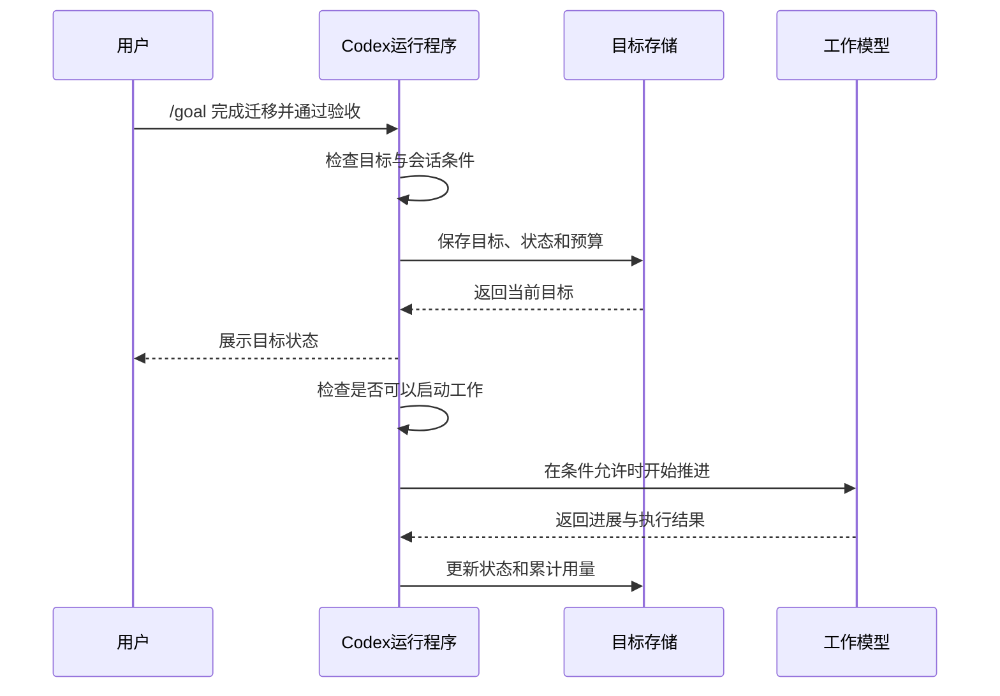
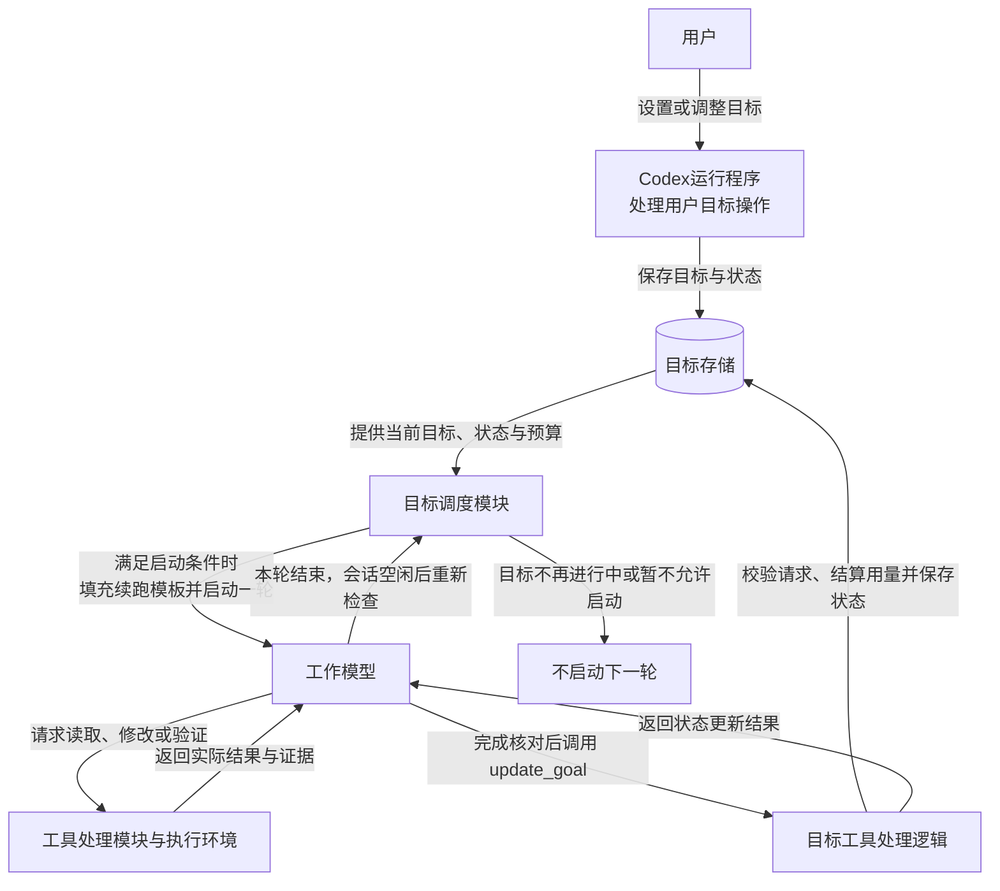
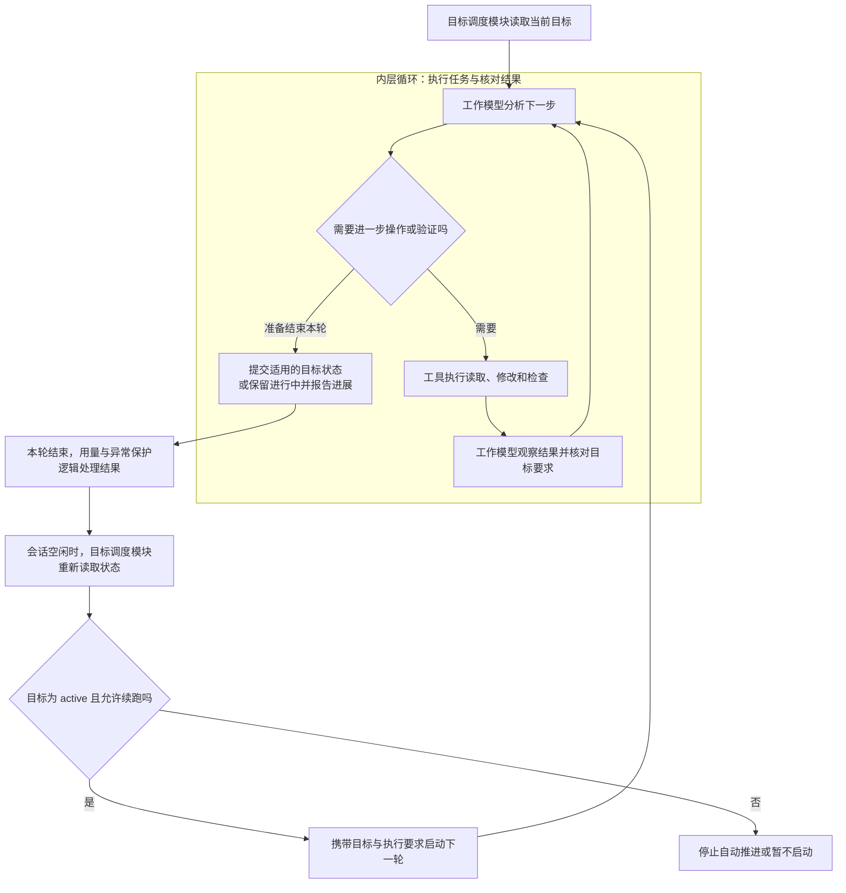
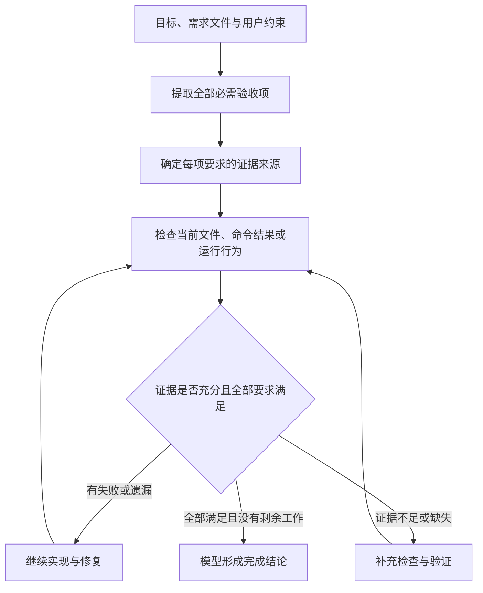
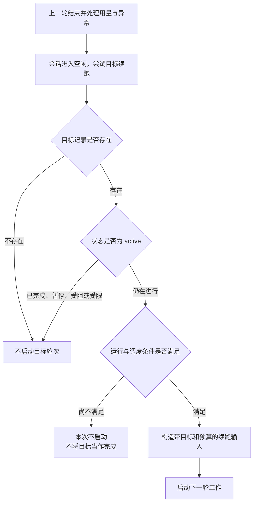
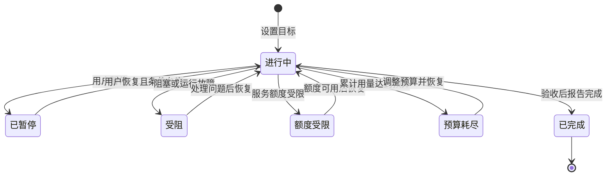
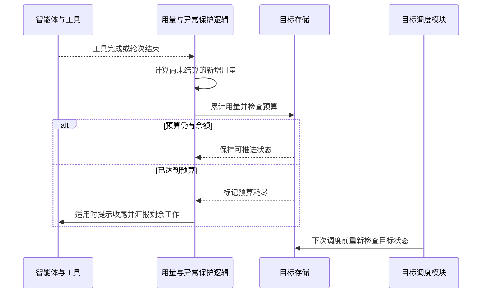
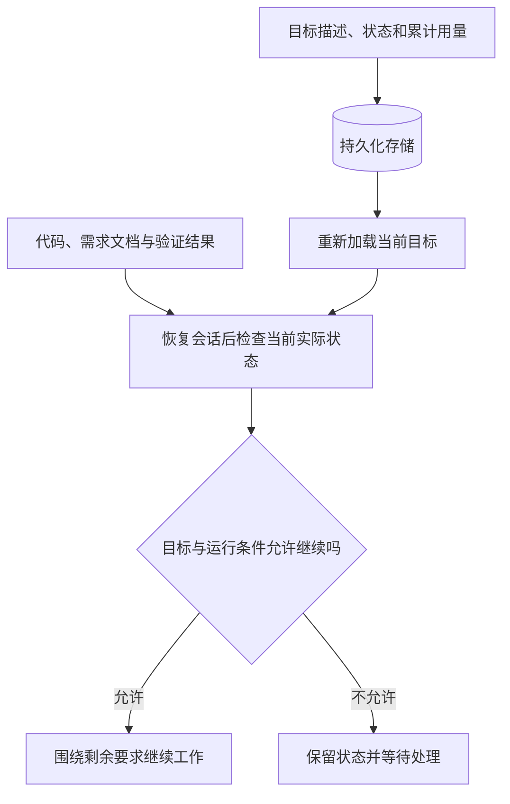

## 引言

### 长任务为什么总需要人反复催促

使用`AI Coding`工具修改一个函数，通常只需要说明需求，智能体就能读取代码、调整实现、运行检查。但是，当任务变成“完成整个认证模块迁移，并保证全部调用方和测试都正常”，开发者往往还得一直守在旁边。

它可能修改完第一个文件就结束回复，也可能列出详细计划后停下来，等待一句“继续”。经过多轮工作，它还可能把“完成迁移”逐渐收缩成“让当前几个测试通过”，遗漏原本要求覆盖的场景。开发者因此需要反复提醒剩余工作、核对目标，甚至替智能体决定下一步做什么。

如果只是要求“不要停止，一直做下去”，又会出现另一个问题：缺少停止条件的持续执行，可能演变成重复尝试、无效等待和不断增长的用量。

这些现象背后，是长任务协作中三个相互关联的缺口。

| 缺口 | 开发者面对的问题 |
| :---: | --- |
| **工作衔接** | 一轮回复结束后，谁来决定是否继续 |
| **完成标准** | 如何确认整个需求已经完成，而不只是完成了一部分 |
| **运行边界** | 何时暂停、何时报告阻塞、最多消耗多少资源 |

**一轮对话结束，不等于一个工程目标完成**。当任务跨越多个文件、多个阶段甚至多次会话恢复时，需要有人持续维护这一区别。

### 用`/goal`让工作围绕目标持续推进

为了解决这些问题，以`Claude Code`、`Codex`为代表的主流`AI Coding`工具陆续推出了`/goal`斜杠指令，将“围绕目标持续工作”变成可以直接使用的能力。

用户不必把每一步都拆成新的提示，而是先说明最终希望达到什么状态。例如：

```text
/goal 完成认证模块迁移，更新全部调用方，并确认相关测试通过
```

工具会持续跟踪这个目标，在条件允许时衔接后续轮次，并在完成、暂停、受阻或达到资源限制时停止自动推进。这样，开发者可以把精力更多地放在需求和验收上，减少反复输入“继续”的调度工作。

从使用体验看，它是一条命令；从设计上看，它把**目标记录、连续执行、结果验收和停止条件**连接成了一个闭环。


### 主流工具中的目标能力

| 工具名称 | 目标能力介绍 |
| --- | --- |
| <span style={{whiteSpace: 'nowrap'}}>`Claude Code`</span> | 使用`/goal <条件>`设置完成条件，每轮工作结束后由小型快速模型依据对话中的证据评估；未满足时继续推进，满足或被判定为不可能满足时结束目标。支持通过`/goal`查看状态、`/goal clear`清除目标。 |
| `Codex` | 使用`/goal <目标>`创建当前会话的持续目标，支持查看、编辑、暂停、恢复和清除。保存目标状态与累计用量，在目标仍需推进且会话允许执行时衔接下一轮，适合迁移、跨文件修改和按验收清单完成需求。 |
| `Grok Build` | 已确认提供`/loop`周期任务和`/workflow`后台工作流，可按间隔触发检查，或组织后台工作与验证。 |

以`Codex`为例，目标的日常管理可以通过以下命令完成。

| 命令 | 用途 |
| --- | --- |
| `/goal <目标>` | 设置目标 |
| `/goal` | 查看当前目标 |
| `/goal edit` | 修改目标描述 |
| `/goal pause` | 暂停目标 |
| `/goal resume` | 恢复目标 |
| `/goal clear` | 清除目标 |


## 原理解析

以下以`Codex`为例，先明确目标执行中各个参与方的职责，再介绍它们如何协作推进任务。

平时我们会把整套系统统称为“智能体”，但理解`/goal`时，需要区分**负责理解和判断的工作模型**，以及**负责执行规则和调度的运行程序**。工具提供行动能力，目标存储则保存跨轮次共享的任务状态。

| 参与方 | 类型 | 主要职责 |
| --- | --- | --- |
| **用户** | 目标提出者 | 给出目标、验收条件和约束，按需调整、暂停或恢复目标 |
| **工作模型** | 大语言模型 | 理解需求、安排步骤、选择工具，并根据工具返回的证据判断目标是否完成 |
| **`Codex`运行程序** | 程序逻辑 | 调度模型请求和工作轮次，处理工具调用、状态更新、用量结算与异常保护 |
| **工具与执行环境** | 行动与观察能力 | 通过文件操作、终端命令、浏览器等执行具体操作，返回文件内容、测试结果或实际运行状态 |
| **目标存储** | 持久化数据 | 保存目标描述、状态、预算和累计用量，供后续轮次和恢复后的会话读取 |

运行程序内部还有不同职责。后文用“目标调度模块”指负责检查续跑条件、构造续跑输入和启动轮次的逻辑；用“工具处理模块”指负责接收模型工具请求、校验参数并交给相应工具执行的逻辑；“用量与异常保护逻辑”则负责结算消耗、检测运行故障，并在达到限制时更新目标状态。这些都是程序职责，不是不同的模型，也不意味着需要分别部署成独立服务。

例如，工作模型可以决定运行测试，但实际命令由工具执行，结果再交回模型；工作模型可以判断目标已经完成，但需要通过目标工具把结论写入目标存储；随后，目标调度模块才能依据保存的状态决定是否续跑。**理解结果、执行操作、保存状态和调度下一轮，分别发生在不同环节**。

### 把一句需求变成可以管理的目标

普通提示主要存在于对话中，而`/goal`会把目标登记成一份独立管理的记录。记录中不仅有“要做什么”，还有当前状态、可选预算、累计用量和执行时间。

可以把它理解成一张持续更新的任务单。对话会向前推进，执行策略可以调整，但任务单始终回答几个基本问题。

| 记录内容 | 解决的问题 |
| --- | --- |
| **目标描述** | 最终需要达到什么结果 |
| **所属会话与目标标识** | 这项工作属于哪次目标 |
| **当前状态** | 现在应继续、暂停，还是已经结束 |
| **预算与累计用量** | 还能投入多少资源 |
| **执行时间与更新时间** | 工作已经推进了多久 |

每个会话维护一条当前目标记录。替换目标时，需要区分新旧目标，避免把旧工作产生的延迟结果误计入新目标。

目标设置之后，`Codex`会保存记录、更新界面，并在会话空闲且执行条件允许时尝试启动工作。如果会话正在执行，相关变化则通过运行时协调，而不是简单再开一份重复任务。



目标描述应当简洁，但不需要把全部需求都挤在一行里。`Codex`官方建议将较长的要求放进文件，再让目标引用该文件。目标文本本身最多为`4000`个字符；复杂任务可以通过需求文档保留完整的范围和验收条件。

### 用两层循环衔接长任务

`/goal`的核心问题，是一轮工作结束以后，如何决定任务应该继续还是结束。这里需要区分两个判断：**目标是否真正达成，由工作模型结合证据判断；是否再启动一轮，由目标调度模块根据目标状态和运行条件决定**。

#### 谁负责引导工作模型

在这里，持续引导来自运行程序注入的提示，`/goal`本身并没有另设一个“引导模型”。需要续跑时，目标调度模块读取当前目标和用量，把目标描述、已用预算、剩余预算填入预先定义的提示模板，再将生成的输入交给当前会话的工作模型。

模板还包含固定的执行要求，例如保持原始目标范围、检查上一轮是否取得实际进展、核实后台任务、在报告完成前逐项审查证据。这些要求帮助工作模型在后续轮次继续围绕目标行动。**程序负责提供目标、约束和检查要求，工作模型负责结合现场情况决定下一步做什么**。

因此，续跑提示并不是另一个模型分析工程后给出的新计划，目标调度模块也不负责判断具体代码应该怎样修改。下面的协作图将这些职责分开表示。



图中的目标调度模块、工具处理模块和目标工具处理逻辑，都属于`Codex`运行程序；目标工具处理逻辑是处理目标状态请求的具体工具实现。工作模型通过这些工具与真实环境和目标记录交互，不是直接修改数据库或自行启动新的会话轮次。

一项任务也可能使用子智能体辅助实现或审查，但那属于具体任务的分工，并不是`/goal`运行的必要条件。这里的两层循环，描述的是执行与调度的两个层次，不代表必须有两个模型。

#### 两层循环分别负责什么

先区分“一次模型请求”和“一轮智能体工作”。一轮工作通常包含多次模型请求和工具调用：读取文件，修改代码，运行测试，再根据结果继续处理。这种“分析、行动、观察结果”的反复执行，就是智能体执行循环，也称`Agent Loop`。

内层循环由工作模型与运行程序共同推进：工作模型分析并提出工具调用，工具处理模块执行请求、返回结果，工作模型再据此决定下一步。在这个过程中，工作模型既可以继续调用工具，也可以核对验收条件、报告目标状态，或者结束当前轮次并留下阶段性结果。

外层循环由目标调度模块负责衔接轮次。当前轮次结束后，运行程序中的用量与异常保护逻辑先结算用量、处理相关运行异常；当会话进入空闲时，目标调度模块再读取目标状态。如果目标仍处于进行中，即`active`，并且运行条件允许，就准备下一轮输入。



这意味着**模型结束本轮回复，并不会自动把目标标记为完成**。例如，模型说“认证入口已经迁移，接下来需要处理其他调用方”，本轮可以结束，但目标仍然处于进行中，后续轮次继续承担剩余工作。

#### 工作模型如何形成完成判断

自然语言目标通常包含多项要求，无法只用“有没有报错”来判断完成。目标工具说明和续跑提示中的执行要求，会引导工作模型进行完成审计，也就是在报告成功前，将原始需求与当前证据逐项核对。这一步由工作模型完成，目标调度模块只负责后续的启动判断。

这个过程可以分成四步。

1. **找全要求**。从目标描述、引用的需求文件，以及用户补充的约束中提取必须完成的内容，不能只检查当前已经做过的部分。
2. **确定证据**。为每项要求明确什么结果能够证明它成立，例如构建成功、回归测试通过、页面交互符合预期，或者外部任务进入成功状态。
3. **检查当前结果**。通过工具读取实际文件、运行命令或观察系统状态，确认检查对应的是当前版本，而不是依赖早先的结论或记忆。
4. **逐项判定**。只有每个必需项都有充分证据，而且没有剩余的必需工作，才能报告目标完成；存在缺失、失败或无法验证的项目时，应继续处理。

以认证模块迁移为例，证据应该与要求一一对应。

| 要求 | 可以使用的证据 |
| --- | --- |
| **全部调用方已迁移** | 调用位置检查、类型检查或构建结果 |
| **过期凭证被正确拒绝** | 对应回归测试的实际运行结果 |
| **公开接口保持兼容** | 接口契约检查与相关集成测试 |
| **原有行为没有回归** | 覆盖相关功能的测试结果 |

每项证据还需要判断强弱。测试未运行、日志来自修改之前、检查只覆盖部分调用方，都不能算作该项要求已经完成。

| 当前证据 | 应得出的结论 |
| --- | --- |
| **足以证明要求已满足** | 该项可以通过验收 |
| **明确显示失败或尚有遗漏** | 继续修复或补齐工作 |
| **只有间接迹象，不能充分证明** | 补充更可靠的验证 |
| **尚未获得证据** | 保持未验证，不能视为完成 |



**“检查通过”只有在检查覆盖了原始要求时，才有意义**。删除失败测试、缩小验证范围，或者只检查与改动无关的文件，都不能证明目标完成。执行要求也明确约束模型，不能因为预算快用完了，或者准备结束回复，就降低成功标准。

后台工作同样如此。启动了测试进程，只能证明测试已经开始，不能证明测试通过。模型需要检查对应进程或任务的当前状态，并取得有效结果。如果观察超时，应继续核查原任务，不能直接把超时当作任务完成或失败。

这里的“完成审计”是工作模型在执行上下文中进行的判断，并不表示每轮结束后另有一个独立模型替它验收，也不表示程序会把自然语言需求自动转换成一套能够证明业务正确性的检查。测试、日志和页面结果提供证据，模型负责理解这些证据与目标的关系。

#### 完成判断如何变成可执行的停止信号

模型认为目标已经达成后，需要调用`update_goal`，提交完成状态。下面展示的是模型工具调用的参数，不是用户需要输入的新斜杠命令。

```json
{
  "status": "complete"
}
```

这次结构化调用，把“我判断已经完成”转换成程序能够处理的状态更新。目标工具处理逻辑会检查状态值是否合法、当前目标是否存在，调用用量结算逻辑，将完成状态写入目标存储，并把更新结果返回给工作模型。

只有更新成功，后续调度才能读取到“已完成”。如果调用失败，就不能把“尝试提交了完成状态”等同于“完成状态已经生效”，智能体需要根据工具返回结果处理问题。


完成状态可以在当前轮次内部提交，不必等到最终回复以后才判断。状态更新本身也不是立即强制终止模型输出；模型仍可以完成交付说明、汇报验证结果和用量。它影响的是后续是否还需要自动续跑。

这里有一个重要边界：**目标更新工具接受的是状态，没有要求模型同时提交一份由程序逐项验证的验收证明**。目标工具处理逻辑会校验请求并保存状态，但不会在收到`complete`后独立重跑全部测试、重新理解全部业务要求。

因此，如果模型误判并成功提交了完成状态，外层循环也会停止。结构化状态让调度行为明确，却不能消除模型对业务结果的误判。清晰的验收条件、可靠的验证工具，以及必要的持续集成和人工审阅，仍然决定着完成声明的可信度。

#### 外层循环如何决定下一步

对负责外层循环的目标调度模块而言，判断依据是**当前保存的目标状态与运行条件**，而不是回复里有没有“完成”“成功”之类的词。

一轮工作结束后，用量与异常保护逻辑会结算消耗、处理适用的故障，必要时更新目标状态。会话进入空闲后，目标调度模块重新读取目标，决定是否启动下一轮。为了便于理解，可以将其决策归纳为三类。

| 情况 | 目标调度模块的处理 |
| --- | --- |
| 目标已经完成、暂停、受阻、受限，或已被清除 | 不再按该目标自动续跑 |
| 目标仍在进行，但当前不具备启动条件 | 本次不启动，不能据此认定目标完成 |
| 目标仍在进行，且启动条件满足 | 构造续跑输入并启动新轮次 |



图中合并了多项调度检查。实际启动时，还需要确认目标能力和持久化条件可用、会话仍然存在、没有延期续跑标记，也没有与之冲突的运行轮次。需要优先处理的输入不能被自动工作抢占，`Plan`模式也不能被自动续跑绕过。

例如，模型虽然输出了“已经完成”，却没有成功更新目标状态；如果目标仍为`active`，也没有其他停止或延期条件，系统仍可能发起下一轮。反过来，预算耗尽会让续跑停止，但这只能说明资源边界被触发，不能说明需求已经完成。

当需要续跑时，目标调度模块通过模板构造的新输入会重新带入目标、预算信息和执行要求。工作模型应检查上一轮取得了什么实际进展，核实仍在等待的后台任务，并围绕尚未完成的要求采取下一步行动。反复陈述状态、重复一份未执行的计划，并不算实际进展。

#### 一次完整任务如何收敛到结束

仍以“完成认证模块迁移，并保证接口兼容、相关测试通过”为例，可以把一次目标执行过程理解为下面几个阶段。实际任务不一定恰好需要这些轮次，表格只是说明完成判断如何影响续跑。

| 阶段 | 观察到的结果 | 判断与后续动作 |
| --- | --- | --- |
| **第一轮修改** | 新解析器已接入，但还有调用方使用旧接口 | 工作未完成，保留进行中状态并继续处理 |
| **第二轮验证** | 调用方已更新，但过期凭证测试失败 | 证据明确不满足要求，继续修复 |
| **第三轮验收** | 相关测试通过，但尚未检查公开接口兼容性 | 仍有未验证项，补充接口检查 |
| **完成核对** | 全部必需项获得有效验证，没有剩余工作 | 提交`complete`，成功后汇报结果 |
| **随后空闲** | 目标调度模块读到已完成状态 | 不再启动目标续跑 |

这个例子中，“测试通过”并不是唯一结束条件。只有当目标中的其他要求也得到验证，模型才应该报告完成。如果最终发现必须等待外部系统恢复才能继续，则应按阻塞规则处理；如果用户要求暂停，则保存暂停状态。两者都属于停止推进，而不是成功完成。

**整个闭环由三步连接起来：工作模型核对证据，目标工具保存结论，目标调度模块根据状态决定是否续跑**。目标存储负责在这些环节之间保留一致的任务记录，用量与异常保护逻辑则为持续执行设置资源和故障边界。

### 用状态区分完成、暂停和阻塞

长任务会因为多种原因停下。如果只记录“运行”和“结束”，开发者无法知道它究竟完成了，还是因为额度不足而停住。

`Codex`用不同状态记录这些情况。可以把这种管理方式理解为一张规则表：发生某种事件后，任务进入相应状态，只有满足条件才重新开始。

| 状态 | 含义 |
| --- | --- |
| **进行中** | 目标仍需推进，条件允许时可以续跑 |
| **已暂停** | 用户要求暂时停止目标推进 |
| **受阻** | 当前无法有效推进，需要处理阻塞或运行故障 |
| **额度受限** | 达到模型服务的使用额度限制 |
| **预算耗尽** | 达到当前目标设置的用量预算 |
| **已完成** | 智能体报告目标已达成 |



这张图展示的是主要变化路径。无论因为哪种原因停下，**停止自动推进都不等于目标已经完成**。

模型用于更新目标的工具，也有明确边界：它可以报告完成、阻塞和用户要求的暂停，但不能通过这个工具自行恢复目标、增加预算或设置系统限制状态。程序校验允许的状态值，模型指令则约束何时应该报告这些状态。

对用户来说，暂停适合暂时停止推进，清除则意味着不再追踪当前目标。`/goal clear`不会自动撤销已经发生的代码修改；恢复一个预算耗尽的目标，也不能仅靠切换状态绕过用量检查，需要先让预算条件重新满足。

### 用预算和异常保护约束持续执行

让任务持续工作，就需要同时考虑成本和无效循环。`Codex`为目标维护可选的`Token`预算，并在工具完成、轮次结束等检查点结算新增消耗。

目标预算与上下文窗口不同。上下文窗口限制一次请求可以携带多少信息，目标预算记录围绕目标累计投入了多少用量。压缩历史对话能够减轻后续请求的上下文负担，但不会让已经消耗的目标预算归零。

当前目标记账口径可以概括为：**输入`Token`减去命中缓存的输入`Token`，再加上输出`Token`**。例如，一次新增用量包含`40000`个输入`Token`，其中`30000`个命中缓存，输出为`2000`个，则计入目标的用量为`12000`。这是一种目标预算口径，不能直接当作实际账单金额。

如果任务使用了子智能体，它们产生的相关用量也会汇入根目标的记账范围。否则，把工作分发出去就可能绕开目标成本限制。这里的用量汇总不意味着每次使用`/goal`都会自动启动多个智能体。



达到预算后，用量结算逻辑将目标更新为预算耗尽，目标调度模块据此停止为该目标自动开启新轮次。运行程序还会在适用的执行检查点向工作模型注入收尾提示，要求说明已完成内容、剩余工作和下一步。

因为预算按检查点结算，已经在途的请求和收尾仍可能增加消耗，所以它不是逐个`Token`精确截断的计费开关。记录了执行时间，也不等于自动设置了强制截止时间。

**目标预算默认没有固定数值上限**。如果既没有为目标单独指定预算，也没有配置`goals.max_goal_token_budget`，就不会因达到某个默认`Token`数量而触发预算耗尽。具体取值遵循以下规则。

| 设置情况 | 新目标的预算 |
| --- | --- |
| 未指定目标预算，也未配置预算上限 | 不设置目标级`Token`上限 |
| 仅配置`goals.max_goal_token_budget` | 使用该配置值作为默认预算 |
| 为目标单独指定预算 | 使用指定值；若配置了预算上限，指定值不能超过它 |

例如，在支持该配置项的版本中，可以在`config.toml`中设置：

```toml
[goals]
max_goal_token_budget = 100000
```

这里的`100000`是示例值，**不是产品默认值**。该配置同时充当新目标的默认预算和允许设置的预算上限。没有目标预算上限，也不意味着能够无限运行：服务使用额度、权限限制和异常保护仍然生效。

无效循环则需要另外处理。`Codex`会检测连续空响应、特定工具执行故障和不可继续的轮次错误，并在相应条件下将目标转为受阻状态。例如，连续三次自动续跑都只有空最终答复、没有实际活动时，就会触发阻塞保护。

这里需要区分“任务本身还没解决”和“执行机制已经失效”。业务测试失败，可能意味着需要继续修复；工具运行基础设施持续故障，则可能意味着继续请求模型只会浪费资源。不能把异常保护理解为“任意测试失败三次就必须停止”。

对于模型识别出的业务阻塞，执行要求还强调：应先尝试能够继续推进的合理动作；同一真实阻塞连续出现至少三轮、确实无法再取得进展时，再报告阻塞。这个判断依赖模型理解现场，与程序统计空响应的保护机制分别工作。

### 用持久化和调度协调保持任务连续性

任务运行较长时，可能遇到对话压缩、程序重启、目标调整，以及用户输入与工具结果同时到达。要持续推进，就不能只依赖模型记得之前聊过什么。

`Codex`会将目标保存到本地持久化存储中，并记录相关会话事件。恢复会话时，系统重新读取目标和用量，重建运行状态，再检查是否允许继续工作。目标使用`SQLite`存储，使其可以独立于某一段对话摘要保存下来。



这并不意味着目标会在关闭所有运行进程后继续执行。持久化负责保存任务状态，真正推进工作仍需要运行中的会话和调度程序。保存目标也不等于保存了全部工程证据，恢复后仍应检查代码、测试结果和外部系统的现状。

用户调整目标时，系统也需要把新要求传递给正在工作的智能体。后续工作应围绕更新后的目标展开，而已发生的修改仍需要结合新要求判断是否保留。编辑目标不会自动回滚旧工作。

另外，多个事件同时到达时必须相互协调。例如，用户刚暂停目标，空闲调度又准备启动下一轮；或者两个工具几乎同时结束，都要结算用量。`Codex`会协调目标状态更新与启动检查，串行处理关键记账步骤，并利用目标标识区分新旧工作，降低重复启动和重复记账的风险。

这些机制共同保证了一个基本原则：**是否继续，取决于当前目标和当前状态，而不是某一轮对话里留下的旧判断**。

## 如何写出真正有用的目标

理解了设计原理，使用`/goal`时最值得投入精力的，就是把目标写成可以验收的结果。

“优化认证模块”只有方向，没有清晰终点。下面这样的目标更容易支撑持续执行与最终复核：

```text
/goal 将认证模块从旧Token解析器迁移到新解析器，更新src/auth及其全部调用方；
新增过期、错误签名和空Token的回归用例；
运行npm run test:auth与npm run lint并确认退出码为0；
不修改公开HTTP接口，不删除或跳过已有测试。
完成后列出修改文件和实际验证结果。
```

这是同一个目标的多行展示，实际使用时按工具输入方式提交即可。示例假设项目存在对应目录和检查脚本，需要替换为真实项目中的内容。

| 目标要素 | 应说明的内容 |
| --- | --- |
| **最终结果** | 系统应该达到什么状态 |
| **工作范围** | 必须覆盖哪些模块、调用方和交付物 |
| **验证方式** | 用什么命令或可观察结果证明完成 |
| **重要约束** | 哪些接口、行为和测试必须保持 |
| **交付说明** | 如何让开发者复核修改与验证结果 |

对较大的任务，可以把要求和验收项写进版本控制中的文档，再让目标明确引用它。需求文档提供稳定的依据，后续轮次也更容易核对是否遗漏工作。

验证方式还要与目标匹配。接口迁移需要构建、调用方检查和相关测试；页面调整需要检查实际渲染与交互；外部服务配置需要观察服务的真实结果。不能用一种方便执行的检查替代所有验收。

最后，持续执行不会自动扩大权限。目标机制负责决定是否继续工作，权限与沙箱机制负责限制允许执行的动作。设置`/goal`不代表自动授权部署、发送消息或修改生产数据；这些操作仍受任务范围和现有权限约束。

`/goal`减少的是开发者反复推动下一步的负担。需求是否清楚、证据是否充分、交付是否符合预期，仍然决定着一次长任务的质量。把这几件事准备好，自动续跑才更有可能持续接近真正需要的结果。

## 常见问题


### 使用`/goal`后，为什么`Token`用量变多了

最直接的原因，是任务在一轮回复结束后仍可能继续推进。普通对话如果停在“已完成主要修改”，用量也会暂时停止增长；设置目标后，工作模型可能接着检查遗漏的调用方、补充测试、修复新发现的问题，直到能够给出完整的验收结论。这些后续工作都会带来新的模型请求。

可以从以下几个方面理解增加的消耗。

| 消耗来源 | 为什么可能增加 |
| --- | --- |
| **更多执行轮次** | 目标尚未完成时，目标调度模块自动启动后续轮次，模型继续分析和调用工具 |
| **验收与修复** | 工作模型需要检查实际证据；发现失败或遗漏后，还要修复并再次验证 |
| **后续请求的上下文** | 请求会携带所需的目标、执行要求、对话上下文和工具结果，相关内容会形成输入用量 |
| **可选的子智能体工作** | 如果任务委派了子智能体，相关模型调用也会产生用量，并纳入目标记账范围 |

其中，运行一个本地测试进程本身不等于消耗模型`Token`；模型生成调用请求、读取返回的日志并分析结果，才涉及相应的模型用量。如果反复读取大量无关日志，或者在没有新证据时重复分析，也会产生开销，却未必推进目标。

### 自动停止了，是否就能认为任务已经完成

不能。暂停、受阻、预算耗尽和服务额度受限，都可能让自动推进停止。首先应查看目标状态，区分“成功结束”和“当前无法继续”。

即使状态为已完成，也表示工作模型已经提交了完成判断，并不等于程序独立证明了全部业务要求。交付时仍应查看实际变更和验证结果；关键接口、生产配置等重要工作，还需要结合持续集成和必要的人工审阅确认。`/goal`负责持续推进，不会自动消除模型误判。

### 关闭终端或退出程序后，目标还会继续执行吗

目标状态能够保存下来，不代表执行进程仍然存在。如果目标所在的运行进程已经退出，就没有该进程继续调度模型、调用工具和推进任务。是否关闭窗口会终止工作，取决于对应客户端是否还有承载会话的运行进程，不能仅凭使用了`/goal`来判断。

重新打开并恢复原会话后，系统可以读取之前保存的目标和用量，再检查是否允许续跑。工作模型仍需要核对当前文件和外部任务的真实状态。持久化提供的是恢复依据，并不是后台托管或定时运行的保证。

### 执行过程中，可以修改目标或手动接管吗

可以。需要改变要求时，使用`/goal edit`调整目标；需要先人工处理时，使用`/goal pause`暂停自动推进；处理完毕后，再通过`/goal resume`恢复。若不再需要追踪该目标，可以使用`/goal clear`清除目标。

暂停或清除目标不会撤销已经完成的文件修改，也不能代替对独立后台进程的管理。手动接管时，应查看当前工作和仍在运行的任务，避免双方同时修改同一部分内容。恢复后，也应让工作模型检查人工修改后的状态，并按更新后的要求继续验证。
