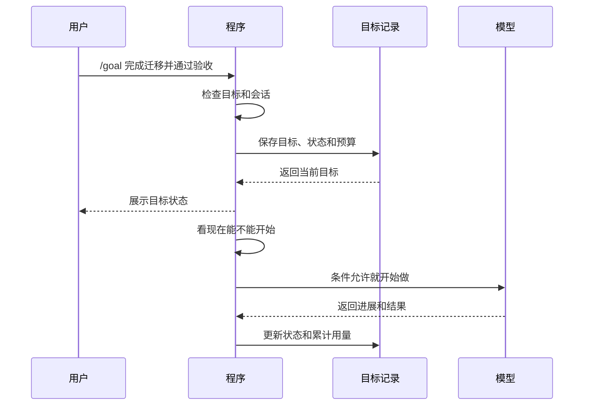
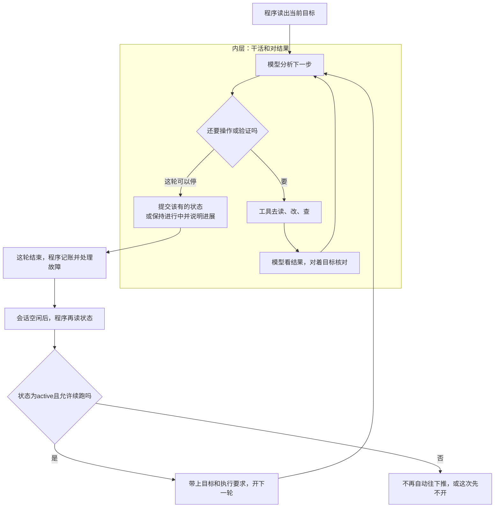
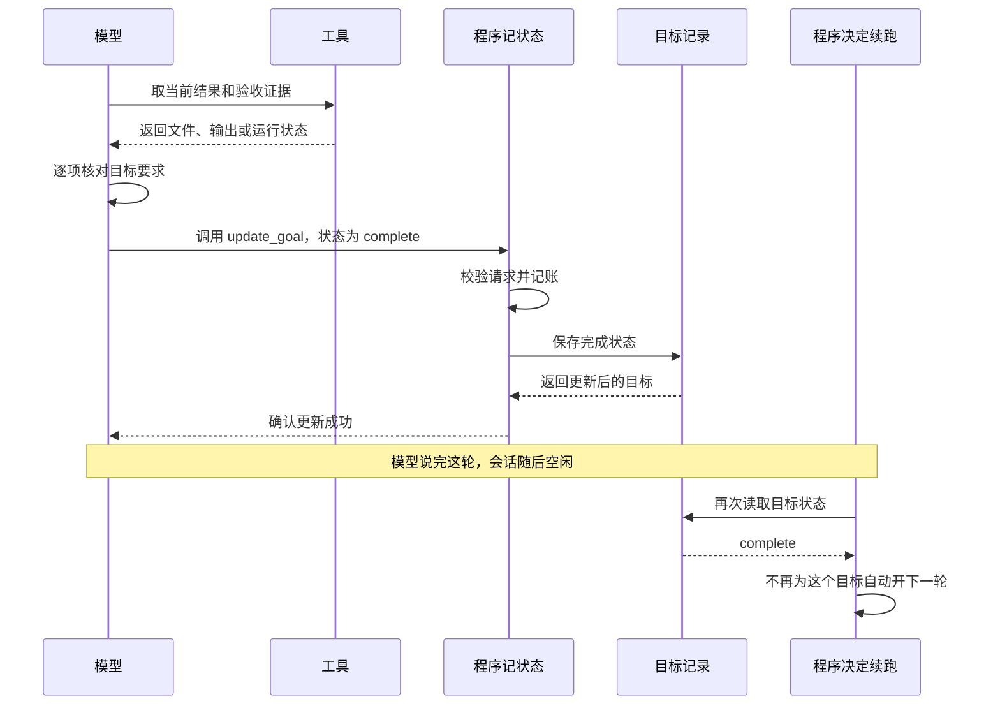
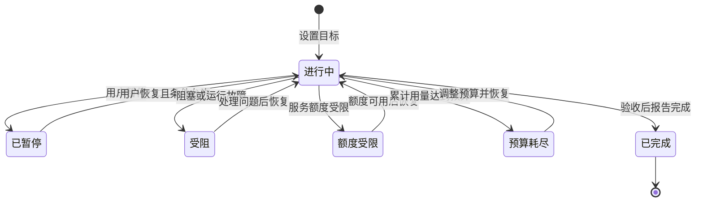
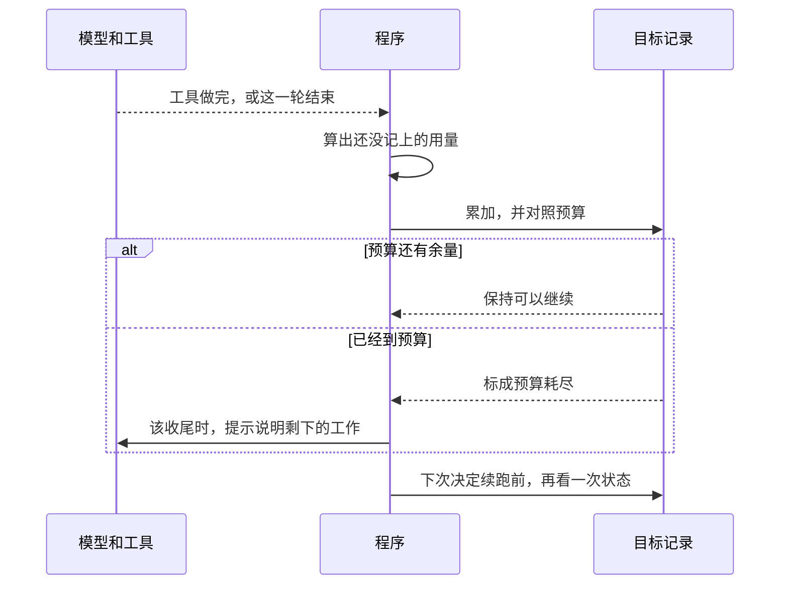

## 引言

### 长任务为什么总需要人反复催促

使用`AI Coding`工具改一个函数，说清楚需求就行。它会读代码、改实现、跑检查。任务一旦变成“完成整个认证模块迁移，并保证全部调用方和测试都正常”，你往往还得守在旁边。

它可能改完第一个文件就停，也可能列完计划，等你说一句“继续”。做着做着，它还会把“完成迁移”做成“眼下这几个测试过了”，原先要覆盖的场景被落下。你得一遍遍提醒还剩什么、核对目标，甚至替它决定下一步。

如果只说“别停，一直做”，又会出另一个问题。没有停止条件，它可能来回试、干等，用量一直往上涨。

说白了，有三件事没人盯：

- 这一轮结束了，谁来开下一轮
- 怎样才算整件事做完，而不只是做了一部分
- 什么时候该停、该告诉你卡住了、最多花多少用量

**聊完一轮，不代表活干完了**。文件一多，中途还可能关掉再打开，就得有个地方一直记着这件事。

### 用`/goal`让工作接着往下做

`Claude Code`和`Codex`都提供了`/goal`。你先写清楚最后要变成什么样，不用把每一步拆成新的提示。例如：

```text
/goal 完成认证模块迁移，更新全部调用方，并确认相关测试通过
```

它会盯着这个目标接着做，你就少敲很多次“继续”。做到哪一步停，两家不一样。`Claude Code`看完成条件有没有满足。`Codex`还可以暂停、恢复，卡住或者用量到了也会停。

用起来就是一条命令。记下目标、接着做、拿结果对账、到点停，这几件事是连着的。


### 主流工具里的目标能力

| 工具名称 | 目标能力介绍 |
| --- | --- |
| <span style={{whiteSpace: 'nowrap'}}>`Claude Code`</span> | 用`/goal <条件>`设置完成条件。每轮结束后，由一个小的快速模型根据对话里的证据评估。没满足就继续；满足了，或者判定不可能满足，就结束。`/goal`查看状态，`/goal clear`清除目标。 |
| `Codex` | 用`/goal <目标>`给当前会话设一个持续目标，可以查看、修改、暂停、恢复和清除。它保存目标状态和累计用量。目标还要推进、会话也允许执行时，就接下一轮。适合迁移、跨文件修改，以及按验收清单把需求做完。 |
| `Grok Build` | 没有同名的`/goal`。过一阵再检查，用`/loop`。把一段后台工作和检查串起来，用`/workflow`。 |

以`Codex`为例，目标的日常管理就这几条命令。

| 命令 | 用途 |
| --- | --- |
| `/goal <目标>` | 设置目标 |
| `/goal` | 查看当前目标 |
| `/goal edit` | 修改目标描述 |
| `/goal pause` | 暂停目标 |
| `/goal resume` | 恢复目标 |
| `/goal clear` | 清除目标 |

## 如何写出真正有用的目标

目标好不好用，差别在能不能验收。

“优化认证模块”只有方向，没有终点。写成下面这样，后面才知道做到哪一步可以停：

```text
/goal 将认证模块从旧Token解析器迁移到新解析器，更新src/auth及其全部调用方；
新增过期、错误签名和空Token的回归用例；
运行npm run test:auth与npm run lint并确认退出码为0；
不修改公开HTTP接口，不删除或跳过已有测试。
完成后列出修改文件和实际验证结果。
```

这是同一个目标的多行展示，实际使用时按工具的输入方式提交即可。示例里的目录和脚本要换成你项目里真实存在的。

写的时候尽量交代清楚这几件：

- 最后要变成什么样
- 必须覆盖哪些模块、调用方和交付物
- 用什么命令，或什么看得见的结果，证明做完了
- 哪些接口、行为和测试必须保持原样
- 做完后怎样列出改动和验证结果，方便你复核

任务比较大时，把要求和验收写进仓库里的文档，目标里点名引用它。`Codex`的目标文本最多`4000`个字符，长要求本来也不适合全挤在命令里。文档摆在那里，后面每一轮都按它核对，不容易漏。

验证要和目标对得上。迁接口，就看构建、调用方和相关测试；改页面，就看真实渲染和交互；改外部服务，就看服务的真实结果。拿一个好跑的检查代替所有验收，对不上。

`/goal`决定的是要不要继续做。能执行哪些动作，仍由权限和沙箱管着。设了它，也不会因此就能部署、发消息或改生产数据。

`/goal`省掉的是你反复催“继续”。需求写没写清、证据够不够、交出来的东西是不是你要的，还是得你把关。这几件准备好了，它才知道做到哪一步可以停。

## 原理解析

只想会用，看到上一节就可以动手了。想知道它为什么还会自己往下跑，下面以`Codex`为例。

平时把整套系统叫“智能体”就够。看`/goal`时，分成四件事更清楚。

| 谁 | 干什么 |
| --- | --- |
| **你** | 给出目标、验收和约束，需要时修改、暂停或恢复 |
| **模型** | 理解需求、安排步骤、选择工具，再根据工具返回的结果判断做完没有 |
| **程序** | 安排每一轮、执行工具、记账、保存状态，出了故障就停住 |
| **工具** | 读文件、改代码、跑命令、看页面，把真实结果交回模型 |

程序里面还有分工：一段看要不要开下一轮，一段执行工具，一段记账并在故障时改状态。都是同一份程序，不用当成好几个模型，也不用分开部署。

模型可以决定跑测试，命令是工具去执行的，结果再交回模型。模型可以判断已经做完，但要把结论写进目标记录，程序下一轮才看得到。想、做、记账、决定要不要继续，发生在不同环节。

### 把目标记成一张任务单

普通提示留在对话里。`/goal`会另外记一条记录：要做什么、现在什么状态、预算、已经用了多少、做了多久。

对话会往前走，做法也可以变。任务单一直回答这几个问题。

| 记录内容 | 解决的问题 |
| --- | --- |
| **目标描述** | 最终要达到什么结果 |
| **所属会话与目标标识** | 这项工作属于哪一次目标 |
| **当前状态** | 现在该继续、暂停，还是已经结束 |
| **预算与累计用量** | 还能投入多少 |
| **执行时间与更新时间** | 已经推进了多久 |

每个会话一条当前目标。换成新目标时，要和旧的分开，避免旧工作晚到的结果记到新目标上。

设好之后，`Codex`会保存记录、更新界面。会话空着、条件也允许，就开始做。它要是正在干活，你改目标或暂停，程序把这个变化交给当前这次执行，不会另开一份同样的任务。



目标本身尽量写短。`Codex`官方建议把长要求放进文件，目标里引用它。字符上限就是上一节说的`4000`个字符。

### 一轮做完，谁决定要不要继续

这里有两件分开的事。目标真做完没有，由模型对照证据判断。要不要再开一轮，由程序看保存的状态，以及现在能不能跑。

还是认证迁移。第一轮，新解析器接上了，有的调用方还在用旧接口，这轮可以先停，活没做完。第二轮，调用方改完了，过期凭证的测试失败，得继续改。第三轮，相关测试过了，公开接口兼容还没查，不能就此收工。直到目标里写的每条都有证据，才有资格说做完。

`Claude Code`用一个小模型来评估完成条件。`Codex`要继续时，程序读出当前目标和用量，把目标描述、已用预算、剩余预算填进准备好的模板，交给当前正在干活的模型。

模板里还有几条固定要求：保持原来的目标范围，看上一轮有没有真进展，核对还在跑的后台任务，报告完成前逐项对证据。程序给出目标、约束和这些检查。下一步做什么、代码怎么改，由模型看现场决定。

任务里可以另派子智能体去实现或审查，那是这次任务自己的分工。这里的两层，是干活，以及这一轮结束后要不要再开一轮。

#### 两层分别干什么

先分清一次模型请求和一轮工作。一轮里通常有多次请求和工具调用：读文件，改代码，跑测试，再按结果往下处理。这种分析、动手、看结果的来回，就是智能体执行循环，也叫`Agent Loop`。

内层由模型和程序一起推进。模型提出工具调用，程序执行并把结果交回，模型再决定下一步。这一轮里，它可以继续用工具，也可以对验收、报告状态，或者先停下来，留下阶段性结果。

外层由程序衔接轮次。这一轮结束后，程序先记账、处理运行故障。会话空下来，再读目标状态。状态仍是进行中，也就是`active`，而且允许启动，就准备下一轮的输入。



所以模型结束这轮回复，不会自动把目标标成完成。比如它说“认证入口已经迁了，接下来要处理其他调用方”，这轮可以结束，目标还在进行中，后面的轮次接着做剩下的。上面第三轮也是这样：测试过了，公开接口还没查，状态仍是进行中，程序还会再开一轮。

#### 怎样才算做完

目标里通常有好几条要求，有没有报错说明不了全部。工具说明和续跑提示会让模型在报告成功前对一遍账，把原始需求和眼前的证据逐条对上。对账的是正在干活的模型。程序只负责之后要不要再开一轮。

可以分成四步。

1. **找全要求**。从目标描述、引用的需求文件，以及你补充的约束里，把必须完成的内容都找出来。不能只看已经做过的部分。
2. **确定证据**。每条要求用什么结果来证明，要先定好。比如构建成功、回归测试通过、页面交互符合预期，或者外部任务进入成功状态。
3. **检查当前结果**。用工具读现在的文件、跑命令，或看系统现在的状态。对上的是当前版本，不是早先的结论，也不是记忆。
4. **逐项判定**。每条必需项都有充分证据，而且没有剩下的必需工作，才能报告完成。有缺失、失败或没法验证的，就继续处理。

认证迁移里，证据要和要求对上。

| 要求 | 拿什么当证据 |
| --- | --- |
| **全部调用方已迁移** | 调用位置检查、类型检查或构建结果 |
| **过期凭证被正确拒绝** | 对应回归测试的实际运行结果 |
| **公开接口保持兼容** | 接口契约检查和相关集成测试 |
| **原有行为没有回归** | 覆盖这些功能的测试结果 |

证据还有强弱。测试没跑、日志来自修改之前、检查只覆盖了一部分调用方，都不能算这条已经完成。

| 眼前的证据 | 该怎么看 |
| --- | --- |
| **足以证明这条已经满足** | 这条可以通过 |
| **明确失败，或还有遗漏** | 继续修，或把缺的补上 |
| **只有间接迹象，证明不了** | 补更靠得住的验证 |
| **还没有证据** | 保持未验证，不能当成完成 |

检查通过，得先确认检查盖住了原来的要求。删掉失败的测试、把验证范围做小、只查和改动无关的文件，都不能说明目标完成。提示里也写了：不能因为预算快用完，或者这轮想结束了，就把成功标准放低。

后台任务一样。测试进程启动了，只能说明测试开始了，不能说明通过了。模型要看这个进程或任务现在的状态，拿到有效结果。观察超时了，继续查原来那个任务。超时本身既不是完成，也不是失败。

#### 完成要写成程序认的状态

模型认为做完了，要调用`update_goal`，提交完成。下面是工具参数，不是一条新的斜杠命令。

```json
{
  "status": "complete"
}
```

这次调用把“我判断做完了”写成程序能处理的状态。程序会检查状态合不合法、当前目标还在不在，记上用量，把完成写进记录，再把结果交回模型。

只有更新成功，后面才会读到已完成。调用失败时，完成状态还没写上，模型要根据工具返回继续处理。



完成可以在这一轮中途提交，不用等到最后一句回复。更新状态也不会立刻掐断输出，模型还可以把改了什么、验证结果和用量说完。受影响的是后面还会不会自动续跑。

有一点要记住：这个工具收的是状态。程序会检查请求、把状态存好。收到`complete`之后，它不会自己把全部测试重跑一遍，也不会重新理解全部业务要求。

模型要是看错了，又成功提交了完成，外层也会停。状态让“开不开下一轮”这件事清楚了，挡不住模型看错业务结果。验收写清楚、验证靠得住，再加上持续集成，必要的话人再看一遍，完成声明才可信。

#### 程序看状态决定续不续

程序看的是存下来的状态，以及现在能不能跑，不是回复里有没有“完成”“成功”这几个字。

一轮结束后，程序先记账、处理故障，必要时改状态。会话空闲后重读目标，决定开不开下一轮。可以分成三种。

| 情况 | 程序怎么处理 |
| --- | --- |
| 目标已经完成、暂停、受阻、受限，或已被清除 | 不再按这个目标自动续跑 |
| 目标还在进行，但这会儿不能启动 | 这次不开。不能据此认为目标已经完成 |
| 目标还在进行，而且可以启动 | 带上目标，开新的一轮 |

真正开下一轮之前，还会再确认几件事：这套目标能力还在、目标确实存下来了、会话还在、没有被要求延期、也没有另一轮正在跑。你有更急的输入时，自动任务让路。当前如果是`Plan`模式，自动续跑也不会绕过它。

模型嘴上说“已经完成”，却没把状态更新成功，就会出现另一种情况。目标还是`active`，也没有别的停止或延期条件，程序仍可能开下一轮。反过来，预算用尽会让续跑停住。这只说明用量到了，不说明需求做完了。

需要继续时，新的输入会再次带上目标、预算和那些执行要求。模型要看上一轮真正推进了什么，核对还在等的后台任务，对着没完成的要求做下一步。把状态复述一遍，或者把一份没执行的计划再说一遍，不算进展。

回到这次认证迁移，按轮次看就是下面这样。实际任务不一定正好这几轮，表格只说明完成判断怎么影响续跑。

| 阶段 | 看到什么 | 接着怎样 |
| --- | --- | --- |
| **第一轮修改** | 新解析器已接入，还有调用方用旧接口 | 没做完，保持进行中，继续处理 |
| **第二轮验证** | 调用方已更新，过期凭证测试失败 | 明确不满足，继续修 |
| **第三轮验收** | 相关测试通过，公开接口兼容还没查 | 还有未验证项，补查接口 |
| **完成核对** | 该有的验证都有了，没有剩下的必做项 | 提交`complete`，成功后汇报结果 |
| **随后空闲** | 程序读到已完成 | 不再自动续跑 |

这个例子里，测试通过不是唯一的结束条件。目标里的其他要求也验证了，模型才该报告完成。如果必须等外部系统恢复才能继续，按卡住处理。如果你要求暂停，就记下暂停。这两种都是停下来，不是成功做完。

模型对证据，程序把结论存下来，再决定要不要续跑。目标记录让这几步用的是同一份任务。记账和故障保护管用量，也管出错时要不要停。

### 停下来，要分清做完和卡住

长任务会因为很多原因停下。如果只记“在跑”和“停了”，你分不清它是做完了，还是额度不够。

`Codex`用不同状态记下这些情况。出了某件事，就进入对应状态，满足条件才重新开始。

| 状态 | 含义 |
| --- | --- |
| **进行中** | 目标还要推进，条件允许时可以续跑 |
| **已暂停** | 你要求暂时停止推进 |
| **受阻** | 这会儿推不动，要处理阻塞或运行故障 |
| **额度受限** | 达到模型服务的使用额度限制 |
| **预算耗尽** | 达到当前目标自己的用量预算 |
| **已完成** | 模型报告目标已经达成 |



这张图是主要路径。无论因为什么停下，自动不再往下跑，都不等于目标已经做完。

模型用来更新目标的工具有边界。它可以报告完成、卡住，以及你要求的暂停。它不能用这个工具自己恢复目标、加预算，或写下额度受限、预算耗尽这类系统状态。程序会检查状态值是否允许。提示里则约束什么时候该报告这些状态。

暂停是暂时停住。清除是不再追踪这个目标。`/goal clear`不会把已经改过的代码改回去。预算耗尽之后要恢复，不能只靠改状态绕过用量检查，得先让预算重新够用。

### 用量预算和故障保护

让任务一直做下去，就要同时管住花费和空转。`Codex`可以为目标设一个可选的`Token`预算，在工具做完、一轮结束这些点上，把新产生的用量记上。

目标预算记的是围绕这个目标一共花了多少。上下文窗口管的是一次请求能带多少内容。把历史对话压短，能减轻后面请求的负担。已经花掉的预算不会因此归零。

当前这笔账这样算：**输入`Token`减去命中缓存的输入`Token`，再加上输出`Token`**。一次新增用量里，输入`40000`，其中`30000`命中缓存，输出`2000`，计入目标的是`12000`。这是目标预算的算法，不能直接当成账单金额。

如果派了子智能体，相关用量也记进这个目标，这样把活分出去也绕不开预算。`/goal`本身不会因此自动拉起好几个智能体。



到了预算，程序把目标标成预算耗尽，不再为它自动开新的一轮。合适的检查点上，还会塞一句收尾提示，让模型说明做了什么、还剩什么、下一步是什么。

预算按这些检查点记。已经发出去的请求，还有收尾说明，仍可能再花一些，所以它不是按每一个`Token`立刻截断。记了做了多久，也不会自动到点截止。

**目标预算默认没有固定上限**。如果既没有单独给这个目标指定预算，也没有配置`goals.max_goal_token_budget`，就不会因为到了某个默认`Token`数而变成预算耗尽。规则如下。

| 设置情况 | 新目标的预算 |
| --- | --- |
| 未指定目标预算，也未配置预算上限 | 不设置目标级`Token`上限 |
| 仅配置`goals.max_goal_token_budget` | 用该配置值作为默认预算 |
| 为目标单独指定预算 | 用指定值。若配置了预算上限，指定值不能超过它 |

例如，在支持该配置的版本里，可以在`config.toml`中这样写：

```toml
[goals]
max_goal_token_budget = 100000
```

这里的`100000`是示例值，**不是产品默认值**。这项配置同时是新目标的默认预算，也是允许设置的上限。没有目标预算上限时，服务额度、权限和故障保护仍然生效。

空转要另外处理。`Codex`会看连续的空响应、特定的工具故障，以及没法继续的轮次错误，条件满足就把目标转为受阻。连续三次自动续跑都只有空的最终答复、没有实际动作，就会触发。

测试没过，说明代码还要改，目标会继续。上面说的叫停，针对的是空回复、工具故障，以及这一轮已经没法继续。工具一直坏着，再请求模型多半是在浪费用量。

模型自己看出的业务阻塞，按提示先试还能推进的合理做法。同一个真实阻塞连续至少三轮、确实推不动了，再报告阻塞。这是模型看现场做的判断，和程序统计空回复各管各的。

### 关掉之后，靠什么接着做

任务跑得久，会遇到对话被压缩、程序重启、目标被改，以及你的输入和工具结果同时到达。要接着做，不能只靠模型记得之前聊过什么。

`Codex`把目标存到本地，用的是`SQLite`，所以它不依赖某一段对话摘要。同时会记下相关的会话事件。恢复会话时，重新读出目标和用量，把运行状态建回来，再看允不允许继续。

存下来的是任务状态。窗口关了、进程没了，就没有人再调度模型、调用工具。保存目标，也不等于把全部证据都存下了。恢复之后，仍要看代码、测试结果和外部系统现在什么样。

你改目标时，新要求会传给正在干活的模型。后面按更新后的目标做。已经改过的代码不会自动退回去，还得对照新要求决定留不留。

几件事同时到，要排队。你刚点了暂停，程序又准备开下一轮，这两件事不能抢着执行。记账一笔一笔来，避免算重。换成新目标之后，旧任务晚到的结果不会记到新目标上。

所以要不要继续，看的是当前目标和当前状态，不是某一轮对话里留下的旧判断。

## 常见问题

### 使用`/goal`后，为什么`Token`用量变多了

最直接的原因是，一轮回复结束，它还可能接着做。普通对话停在“主要改动做完了”，用量会暂时停涨。设了目标，模型可能继续查漏掉的调用方、补测试、修新发现的问题，直到能把验收对完。这些都会变成新的请求。

多出来的用量，通常来自这几处：

- 目标还没完成时，程序会自动开后续轮次，模型继续分析、调用工具
- 对证据时发现失败或遗漏，还得修，再验证一次
- 后面的请求会带上目标、执行要求、对话和工具结果
- 如果派了子智能体，那些调用也算，并计入这个目标

在本地跑一个测试进程，本身不花模型`Token`。模型写出调用、读返回的日志、分析结果，才会花。反反复复读大量无关日志，或者没有新证据还在分析，也会产生开销，目标却不一定前进。

### 自动停了，是不是就能当任务做完

先看目标状态。暂停、受阻、预算耗尽、服务额度受限，都会让自动推进停下来。要分清是做成了，还是这会儿过不去。

状态是已完成，也只是模型提交了完成判断。程序没有自己把全部业务要求证明一遍。交付时仍要看实际改动和验证结果。关键接口、生产配置，还要结合持续集成，必要的话人再看一遍。

### 关掉终端或退出程序后，目标还会继续跑吗

状态会留下来，进程不会。这个目标所在的进程已经退出，就没有人再调度模型、调用工具、往下做。关窗口会不会把活停掉，取决于这个客户端还有没有承载会话的进程。用了`/goal`，也不等于它在后台接着跑。

重新打开并恢复原来的会话后，可以读出之前的目标和用量，再看允不允许续跑。模型仍要核对当前文件和外部任务的真实状态。存下来的是恢复时用的依据。它不是后台托管，也不是到点自动跑。

### 做的过程中，可以改目标或自己接手吗

可以。要改变要求，用`/goal edit`。要先自己处理，用`/goal pause`。处理完，用`/goal resume`恢复。不再追踪这个目标，用`/goal clear`清除。

暂停或清除不会撤销已经改过的文件，也不能代替你去管那些单独的后台进程。自己接手时，先看当前改到哪了、还有什么在跑，避免两边同时改同一处。恢复之后，让模型先看你改过的状态，再按更新后的要求继续验证。
