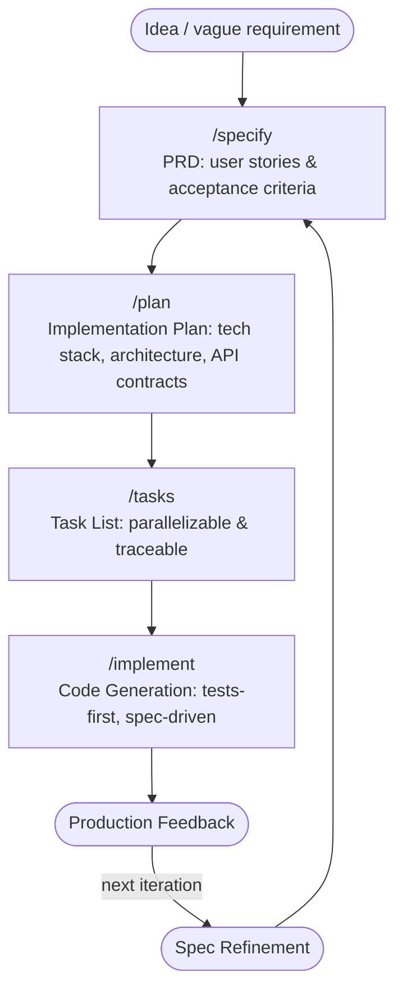

## 前言

`AI`编程工具的大规模普及，正在深刻改变软件开发的工作方式。在`Cursor`、`Claude Code`、`GitHub Copilot`等工具的加持下，开发者可以用自然语言描述需求，`AI`即可自动生成大量代码。这一变化令人兴奋，但也带来了新的困惑：代码越来越容易生成，但高质量、可维护的软件却越来越难以把控。

在这个背景下，一种新的软件开发方法论逐渐兴起——**规范驱动开发（Spec-Driven Development，SDD）**。

## 传统开发范式的痛点


### "凭感觉编码"的危机

`AI`编程工具普及后，一种被称为 **"Vibe Coding"**（随兴编码）的现象愈发普遍：开发者在没有清晰规范的情况下，凭借感觉或即兴的自然语言提示，直接让`AI`生成代码。这种方式在探索性的原型阶段或许无可厚非，但在构建真正的产品时，却会带来严重问题：

- **不可预测性**：每次对话生成的代码风格、架构不一致，积累的技术债难以偿还
- **上下文漂移**：随着对话轮次增加，`AI`对整体目标的理解不断偏移，导致实现越来越偏离最初意图
- **难以协作与追溯**：需求和技术决策只留存于碎片化的聊天记录中，团队缺乏共同的"事实来源"（`source of truth`）；新成员`Onboarding`只能翻记录猜测意图，线上出现问题时也无法追溯"当初为什么这样设计"
- **幻觉难以发现**：没有规范可供核对，根本无从判断`AI`的输出是否符合最初意图——幻觉的代码就这样悄无声息地进入了代码库

### 传统`SDLC`在`AI`时代的局限

传统的软件开发生命周期（`SDLC`，`Software Development Life Cycle`）将需求、设计、编码、测试视为严格串行的独立阶段。在`AI`工具介入后，这种刚性流程暴露出明显局限：

- **规范与代码脱节**：`PRD`、设计文档只是"指导代码"的材料，随着代码迭代，文档往往迅速过时
- **变更风险高**：需求发生变化时，需要手动在文档、设计和代码三处同步更新，稍有疏漏就会导致不一致
- **反馈循环太慢**：需求变更需要走完整的流程才能落地，无法适应现代产品快速迭代的节奏
- **治理机制跟不上`AI`速度**：`AI`大幅提速了代码产出，但需求变更的治理机制并没有同步跟上——代码产出越来越快，规范与实现之间的落差反而越来越大
- **`AI`能力未被充分利用**：让`AI`仅仅做"代码自动补全"，远未发挥其在需求理解、架构规划、一致性检查等方面的潜力

### 症结：代码是"真相"，规范却是"辅助"

这些问题背后有一个共同的根源：在传统范式中，**代码是唯一的"真相"（`source of truth`）**，规范文档只是生产代码的辅助材料，一旦代码写出来，文档就可以被抛弃。

这种权力结构决定了：规范与实现之间永远存在"鸿沟"，团队要么花大量精力维护文档来缩小这道鸿沟，要么干脆放任文档腐烂。无论哪种选择，代价都极为高昂。

## 什么是SDD规范驱动开发


### 核心思想：权力的倒置

**SDD（Spec-Driven Development）** 提出的答案是：**彻底颠覆这一权力结构**。

在`SDD`中，规范不再服务于代码——代码服务于规范。`PRD`不再是"指导实现"的参考文件，而是直接**生成实现的源头**。技术计划不再是"告知编码"的文档，而是**驱动代码生成的精确定义**。

正如`Spec-kit`项目所定义的：

> Specifications don't serve code—code serves specifications. The Product Requirements Document (PRD) isn't a guide for implementation; it's the source that generates implementation.

这不是对现有开发流程的增量改进，而是对软件开发驱动力的**根本性重构**。

### 为什么现在可以做到

`SDD`得以在今天落地，依赖于三个关键条件：

**第一，`AI`能力到达临界点。** 现代大语言模型（`LLM`）已经能够理解复杂的自然语言规范，并可靠地将其转化为结构化的技术计划和可执行代码。规范与实现之间的"鸿沟"第一次有望被技术手段彻底消除，而非只是缩小。

**第二，软件复杂度持续攀升。** 现代系统集成数十个服务、框架和依赖，手动维护所有模块与原始意图的一致性愈发困难。`SDD`通过以规范为核心驱动代码生成，提供了系统性的一致性保障机制。

**第三，变更节奏空前加快。** 今天的需求变更已经不再是"例外"，而是常态。`SDD`将需求变更从"障碍"转化为"正常工作流"——修改`PRD`中的核心需求，技术计划将自动标记受影响的决策；更新用户故事，对应的`API`端点将自动重新生成。

### SDD的核心原则

| 原则 | 含义 |
|------|------|
| **规范是通用语言** | 规范是首要制品，代码是其在特定语言和框架中的表达 |
| **可执行规范** | 规范必须足够精确、完整和无歧义，以直接生成可工作的系统 |
| **持续精化** | 一致性验证不是一次性门禁，而是`AI`持续分析规范中歧义、矛盾与遗漏的过程 |
| **研究驱动的上下文** | 研究代理全程收集技术选型、性能影响和组织约束等关键上下文 |
| **双向反馈** | 生产环境的指标与故障不只触发热修复，而是驱动规范的持续演进 |
| **分支探索** | 从同一规范生成多个实现方案，探索性能、可维护性、用户体验等不同优化路径 |

### SDD的工作流程

`SDD`的完整工作流可以概括为 **规范 → 计划 → 任务 → 实现** 四个阶段，但这四个阶段并非刚性串行，而是支持随时迭代：



在这个流程中，维护软件意味着**演进规范**，调试则意味着**修复生成了错误代码的规范或计划**。整个开发工作流围绕规范作为核心事实来源重新组织，技术计划和代码只是持续再生的输出物。

### 与传统方式的对比

以"构建一个实时聊天功能"为例：

**传统方式：**

```text
1. 编写PRD文档                     (2-3小时)
2. 创建设计文档                     (2-3小时)
3. 搭建项目结构                     (30分钟)
4. 编写技术规范                     (3-4小时)
5. 编写测试计划                     (2小时)
合计：约12小时的文档工作
```

**SDD方式：**

```bash
# 第1步：创建功能规范（5分钟）
/specify 实时聊天系统，支持消息历史记录与用户在线状态

# 第2步：生成实现计划（5分钟）
/plan 使用WebSocket实现实时消息推送，PostgreSQL存储历史消息，Redis管理用户在线状态

# 第3步：生成可执行任务列表（5分钟）
/tasks

# 合计：约15分钟，产出：
# - spec.md（用户故事与验收标准）
# - plan.md（技术选型与方案说明）
# - data-model.md、contracts/、research.md
# - tasks.md（可并行的任务列表）
```

同样的产物，从12小时压缩到15分钟——而且质量更加一致、可追溯。

## SDD相关工具

在目前开源实践中，有多个团队推出了支持`SDD`方法论的工具，其中最具代表性的两款是`OpenSpec`和`Spec-kit`。它们都以规范为核心驱动代码生成，但在设计哲学、功能覆盖和用户体验上各有侧重。

### OpenSpec

#### 项目简介

`OpenSpec`（[GitHub](https://github.com/Fission-AI/OpenSpec)）是由`Fission AI`开发的一款轻量级`SDD`工具，其核心理念是"流动而非刚性（`fluid not rigid`）"。它在`AI`编程助手的聊天界面中通过`slash commands`（斜杠命令）驱动整个规范→实现流程，支持`20+`种主流`AI`编程工具，包括`Claude Code`、`Cursor`、`Windsurf`、`GitHub Copilot`等。

`OpenSpec`的哲学：

```text
→ fluid not rigid         (流动而非刚性)
→ iterative not waterfall (迭代而非瀑布)
→ easy not complex        (简单而非复杂)
→ built for brownfield    (为存量项目而生，不只是绿地项目)
→ scalable from personal to enterprise (从个人项目到企业级皆可适用)
```

#### 安装与初始化

`OpenSpec`通过`npm`全局安装，要求`Node.js 20.19.0`或更高版本：

```bash
npm install -g @fission-ai/openspec@latest
```

在项目目录中初始化：

```bash
cd your-project
openspec init
```

初始化完成后，在`AI`助手中即可使用`/opsx:*`系列命令。

#### 目录结构

`OpenSpec`在项目中创建一个`openspec/`目录，包含两个核心区域：

```text
openspec/
├── specs/          # 事实来源（当前系统行为）
│   ├── auth/
│   │   └── spec.md
│   ├── payments/
│   │   └── spec.md
│   └── ui/
│       └── spec.md
└── changes/        # 变更提案（每个变更一个独立文件夹）
    ├── add-dark-mode/
    │   ├── proposal.md
    │   ├── specs/
    │   ├── design.md
    │   └── tasks.md
    └── archive/
        └── 2025-01-23-add-dark-mode/
```

- **`specs/`**：系统当前行为的"事实来源"，按领域组织
- **`changes/`**：每个变更一个独立文件夹，包含提案、规范增量、设计和任务列表，直到归档前不影响`specs/`

这种分离机制使多个变更可以并行推进而不产生冲突，也便于在合并前对单个变更进行审查。

#### 核心命令

##### 默认快速路径（core profile）

| 命令 | 作用 |
|------|------|
| `/opsx:propose` | 一步创建变更并生成所有规划制品 |
| `/opsx:explore` | 在提交变更前自由探索想法和方案 |
| `/opsx:apply` | 执行任务列表，完成代码实现 |
| `/opsx:archive` | 归档已完成的变更，将增量规范合并回`specs/` |

##### 扩展工作流命令

| 命令 | 作用 |
|------|------|
| `/opsx:new` | 创建新变更脚手架 |
| `/opsx:continue` | 按依赖顺序逐步创建下一个规划制品 |
| `/opsx:ff` | 快进：一次性创建所有规划制品 |
| `/opsx:verify` | 验证实现是否与制品匹配 |
| `/opsx:sync` | 将增量规范合并回主规范 |
| `/opsx:onboard` | 引导新成员完整走一遍工作流 |

#### 典型使用示例

```text
提示: /opsx:propose add-dark-mode

AI:  已创建 openspec/changes/add-dark-mode/
     ✓ proposal.md   (原因与目标)
     ✓ specs/        (需求与场景)
     ✓ design.md     (技术方案)
     ✓ tasks.md      (实现任务清单)
     已就绪，可以开始实现！

提示: /opsx:apply

AI:  正在执行任务...
     ✓ 1.1 添加主题上下文提供者
     ✓ 1.2 创建切换组件
     ✓ 2.1 添加 CSS 变量
     ✓ 2.2 连接 localStorage
     所有任务已完成！

提示: /opsx:archive

AI:  已归档至 openspec/changes/archive/2025-01-23-add-dark-mode/
     规范已更新，可以开始下一个功能。
```

#### 规范文件格式

`OpenSpec`使用基于`RFC 2119`关键字的结构化`Markdown`规范：

```markdown
## Requirements

### Requirement: 用户认证
系统 SHALL 在登录成功后签发 JWT Token。

#### Scenario: 凭证有效
用户持有有效凭证并提交登录表单后，系统应返回 JWT Token，并将用户重定向至仪表盘。
```

| 元素 | 说明 |
|------|------|
| `## Purpose` | 该规范领域的高层描述 |
| `### Requirement:` | 系统必须具备的具体行为（"什么"） |
| `#### Scenario:` | 需求的具体示例，可被验证（"何时"） |
| `SHALL`/`MUST`/`SHOULD` | `RFC 2119`关键字，表示需求强度 |

#### 支持的`AI`工具

`OpenSpec`支持`20+`种主流`AI`编程助手，包括`Claude Code`、`Cursor`、`Windsurf`、`GitHub Copilot`（`VS Code`中）、`Gemini CLI`、`Codex CLI`等，通过各工具的自定义斜杠命令机制集成。

### Spec-kit

#### 项目简介

`Spec-kit`（[GitHub](https://github.com/github/spec-kit)）是由`GitHub`官方开发并开源的`SDD`工具套件，同样旨在帮助开发者"构建更高质量的软件"。相比`OpenSpec`的轻量灵活，`Spec-kit`更加注重**结构化**与**完备性**，提供了从原则（`Constitution`）到规范（`Spec`）、从计划（`Plan`）到任务（`Tasks`）的完整方法论框架，并通过`specify-cli`命令行工具和`/speckit.*`系列命令实现。

`Spec-kit`的核心哲学：

> An open source toolkit that allows you to focus on product scenarios and predictable outcomes instead of vibe coding every piece from scratch.

#### 安装

`Spec-kit`通过`uv`工具安装`specify-cli`：

```bash
# 持久化安装（推荐）
uv tool install specify-cli --from git+https://github.com/github/spec-kit.git

# 在新项目中初始化（以 Claude Code 为例）
specify init my-project --ai claude

# 在已有项目中初始化
specify init . --ai copilot
```

`specify init`支持`--ai`参数指定使用的`AI`助手，支持`claude`、`gemini`、`copilot`、`cursor-agent`、`windsurf`等多种选项。

#### 支持的`AI`工具

| 工具 | 支持情况 |
|------|---------|
| `Claude Code` | ✅ 完全支持 |
| `GitHub Copilot` | ✅ 完全支持 |
| `Cursor` | ✅ 完全支持 |
| `Windsurf` | ✅ 完全支持 |
| `Gemini CLI` | ✅ 完全支持 |
| `Codex CLI` | ✅ 完全支持 |
| `Roo Code` | ✅ 完全支持 |
| `Amazon Q Developer CLI` | ⚠️ 部分支持（自定义参数受限） |

#### 核心命令

初始化完成后，`AI`助手中将可用以下`/speckit.*`系列命令：

##### 核心工作流命令

| 命令 | 作用 |
|------|------|
| `/speckit.constitution` | 创建或更新项目的宪法（治理原则与开发规范） |
| `/speckit.specify` | 定义要构建的功能（需求与用户故事） |
| `/speckit.plan` | 基于指定技术栈创建技术实现计划 |
| `/speckit.tasks` | 从实现计划生成可执行的任务列表 |
| `/speckit.implement` | 按计划执行所有任务，完成功能实现 |

##### 可选质量增强命令

| 命令 | 作用 |
|------|------|
| `/speckit.clarify` | 对规范中未明确的部分进行澄清（建议在`/plan`前运行） |
| `/speckit.analyze` | 跨制品一致性与覆盖度分析（建议在`/tasks`后、`/implement`前运行） |
| `/speckit.checklist` | 生成自定义质量检查清单，验证需求完整性、清晰性与一致性 |

#### 项目宪法（Constitution）

`Spec-kit`最具特色的机制是**项目宪法（`constitution`）**——一组不可变的架构原则，存储于`memory/constitution.md`，作为所有规范生成的基础约束。

宪法定义了九条治理条款，涵盖：

- **库优先原则**（Article I）：每个功能必须先作为独立库实现，禁止直接在应用代码中实现
- **`CLI`接口规范**（Article II）：所有库必须通过命令行界面暴露功能，确保可观测性和可测试性
- **测试优先命令**（Article III）：绝对无法通融——必须先编写并通过验收的测试，代码才能开始实现
- **简洁性原则**（Article VII）：初始实现最多3个项目，额外项目需要书面论证
- **反抽象原则**（Article VIII）：直接使用框架特性，禁止无必要的封装层
- **集成优先测试**（Article IX）：优先使用真实数据库和服务实例，而非`mock`

宪法通过实现计划模板的"预实现门禁（`Phase -1 Gates`）"在代码生成前强制执行这些原则：

```text
预实现门禁阶段

[简洁性门禁 - 第七条]
- [ ] 项目数量是否不超过3个？
- [ ] 是否避免了过度超前设计？

[反抽象门禁 - 第八条]
- [ ] 是否直接使用框架特性？
- [ ] 是否使用单一模型表示？

[集成优先门禁 - 第九条]
- [ ] 是否已定义契约（Contracts）？
- [ ] 是否已编写契约测试？
```

#### 完整工作流示例

以构建实时聊天系统为例：

```bash
# Step 1: 建立项目宪法（首次初始化时）
/speckit.constitution 制定聚焦代码质量、测试规范、用户体验一致性与性能要求的项目原则

# Step 2: 创建功能规范（5分钟）
/speckit.specify 实时聊天系统，支持消息历史记录与用户在线状态

# 自动创建：
# - Branch "003-chat-system"
# - specs/003-chat-system/spec.md （含用户故事和验收标准）

# Step 3: 生成实现计划（5分钟）
/speckit.plan 使用WebSocket实现实时消息推送，PostgreSQL存储历史消息，Redis管理用户在线状态

# 自动创建：
# - specs/003-chat-system/plan.md
# - specs/003-chat-system/research.md
# - specs/003-chat-system/data-model.md
# - specs/003-chat-system/contracts/

# Step 4: 生成任务列表（5分钟）
/speckit.tasks

# 自动创建：
# - specs/003-chat-system/tasks.md （含并行任务标记 [P]）

# Step 5: 执行实现
/speckit.implement
```

#### 开发阶段支持

`Spec-kit`明确支持三种典型开发场景：

| 阶段 | 场景 | 核心活动 |
|------|------|---------|
| **0到1开发**（绿地项目） | 从零生成 | 高层需求→规范→实现计划→生产就绪应用 |
| **创意探索** | 并行实现 | 探索多种技术栈与架构，实验`UX`模式 |
| **迭代增强**（存量项目） | 棕地现代化 | 迭代新增功能、遗留系统现代化 |

### OpenSpec与Spec-kit的对比

两个工具都落地了`SDD`方法论，但设计取向不同：

| 维度 | `OpenSpec` | `Spec-kit` |
|------|-----------|-----------|
| **定位** | 轻量、流动、低仪式感 | 结构化、完备、强约束 |
| **安装方式** | `npm`全局安装 | `uv`工具安装`Python`包 |
| **核心亮点** | 双区域（`specs/` + `changes/`）增量管理 | 项目宪法与预实现门禁 |
| **阶段门禁** | 无刚性门禁，随时迭代 | 有明确门禁阶段，确保质量 |
| **适合项目** | 个人项目到企业，存量项目友好 | 需要严格架构约束的项目 |
| **社区生态** | `Fission AI`驱动，`Discord`社区 | `GitHub`官方背书 |
| **命令风格** | `/opsx:*` | `/speckit.*` |

## 总结

进入`AI`时代，软件开发的核心矛盾已经从"如何快速生成代码"转变为"如何在快速生成代码的同时保证质量与可维护性"。`SDD`（规范驱动开发）通过将规范提升为软件系统唯一的"事实来源"，让代码成为规范的自动化表达，从根本上解决了传统开发中规范与实现长期脱节的顽疾。

`OpenSpec`和`Spec-kit`作为`SDD`方法论的两款主流落地工具，分别代表了轻量灵活与严格结构两种风格，为不同规模和不同约束的团队提供了可操作的选择。

无论选择哪款工具，`SDD`的核心理念是一致的：**先对齐，再构建（agree before you build）**。在`AI`能够将高质量规范直接转化为可工作代码的今天，一份清晰、精确的规范，正是从"随兴编码"迈向"可预测工程"的关键一步。

## 参考资料

- [OpenSpec GitHub 仓库](https://github.com/Fission-AI/OpenSpec)
- [Spec-kit GitHub 仓库](https://github.com/github/spec-kit)
