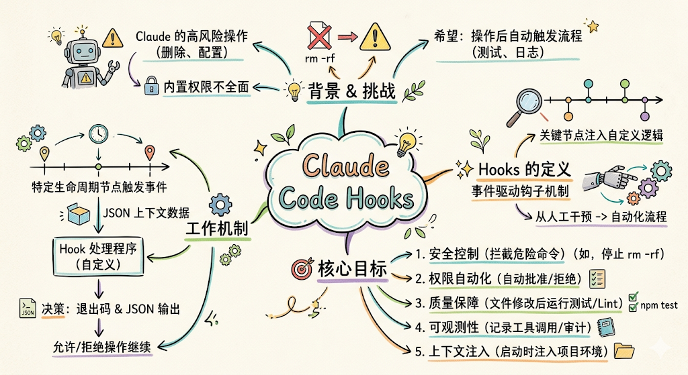
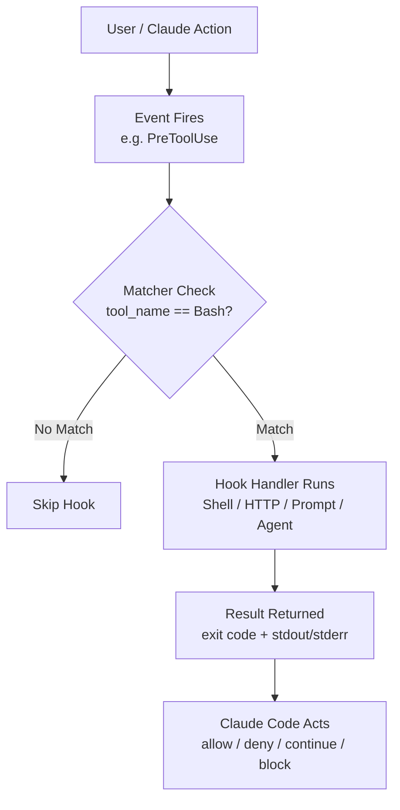
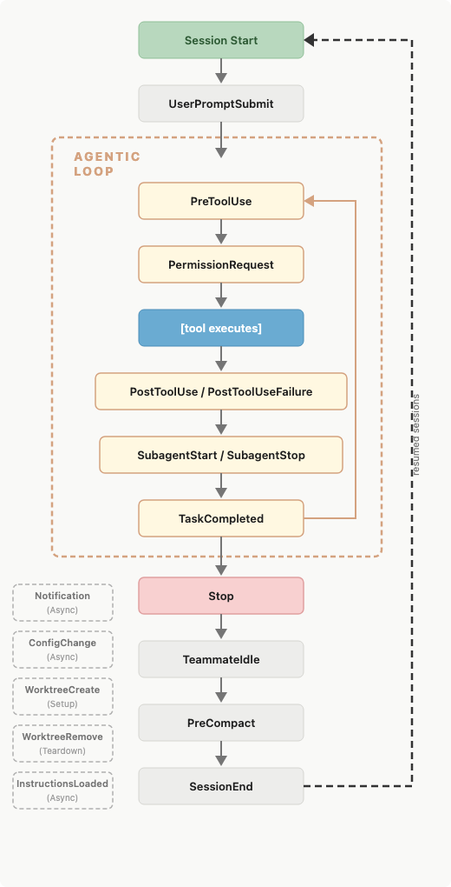
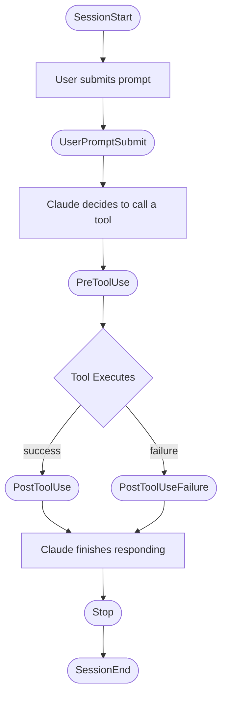

## 前言

在使用`Claude Code`进行日常开发工作时，我们常常面临一些挑战：`Claude`有时会执行一些需要谨慎对待的操作（如删除文件、修改生产配置），而内置的权限提示并不总能覆盖所有自定义场景；同时，我们也希望在`Claude`完成某些操作后自动触发代码检查、测试运行、日志记录等流程。

`Hooks`正是为了解决这类问题而设计的。它是`Claude Code`提供的一套事件驱动钩子机制，允许开发者在智能体工作流的关键节点注入自定义逻辑，将原本需要人工干预或事后检查的步骤变成自动化、可编程的流程。

## 什么是Hooks



### 设计目标

`Hooks`的核心目标是让开发者对`Claude Code`的行为拥有精细的控制权，主要解决以下几类问题：

- **安全控制**：在`Claude`执行危险命令前进行拦截，例如阻止`rm -rf`等破坏性操作
- **权限自动化**：根据规则自动批准或拒绝权限请求，减少频繁的人工确认
- **质量保障**：在`Claude`修改文件后自动运行代码风格检查、单元测试等
- **可观测性**：记录每次工具调用日志、跟踪会话行为，满足审计需求
- **上下文注入**：在会话启动或提示词提交时自动注入环境信息、项目上下文

### 工作原理

`Hooks`基于事件驱动模型。当`Claude Code`运行到特定生命周期节点时（如即将调用某工具、刚完成某操作、会话结束等），会触发对应的事件。如果开发者为该事件配置了`Hook`，`Claude Code`会将事件的`JSON`上下文数据传递给`Hook`处理程序。处理程序可以根据数据做出决策，通过退出码和`JSON`输出告知`Claude Code`是否允许该操作继续执行。

整个处理流程如下：



### 四种处理程序类型

`Hooks`支持四种不同类型的处理程序，适用于不同复杂度的场景：

| 类型 | 说明 | 适用场景 |
|------|------|---------|
| `command` | 执行`Shell`命令或脚本 | 命令验证、文件检查、日志记录 |
| `http` | 向`HTTP`端点发送`POST`请求 | 调用外部服务、远程审批系统 |
| `prompt` | 调用`LLM`进行单轮评估 | 需要语义理解的内容审查 |
| `agent` | 启动一个具有工具访问权限的子智能体 | 需要读取文件、检查代码的复杂验证 |

## Hook生命周期



### 事件总览

`Hooks`在`Claude Code`会话的不同阶段触发。以下是完整的事件列表：

| 事件名称 | 触发时机 | 支持阻断 |
|---------|---------|--------|
| `SessionStart` | 会话启动或恢复时 | 否 |
| `InstructionsLoaded` | 加载`CLAUDE.md`或规则文件时 | 否 |
| `UserPromptSubmit` | 用户提交提示词、`Claude`处理前 | 是 |
| `PreToolUse` | 工具调用执行前 | 是 |
| `PermissionRequest` | 出现权限确认对话框前 | 是 |
| `PostToolUse` | 工具调用成功完成后 | 否（可提供反馈）|
| `PostToolUseFailure` | 工具调用失败后 | 否（可提供反馈）|
| `Notification` | `Claude Code`发送通知时 | 否 |
| `SubagentStart` | 子智能体启动时 | 否 |
| `SubagentStop` | 子智能体完成时 | 是 |
| `Stop` | `Claude`完成当前响应时 | 是 |
| `TeammateIdle` | 团队协作中某成员即将空闲时 | 是 |
| `TaskCompleted` | 任务被标记为完成时 | 是 |
| `ConfigChange` | 会话中配置文件发生变化时 | 是 |
| `WorktreeCreate` | 创建`Git Worktree`时 | 是（替换默认行为）|
| `WorktreeRemove` | 移除`Git Worktree`时 | 否 |
| `PreCompact` | 执行上下文压缩前 | 否 |
| `SessionEnd` | 会话结束时 | 否 |

### 生命周期顺序

在`Agentic Loop`（智能体循环）中，`Hook`事件的触发顺序如下：



## 配置方式

### 配置文件位置

`Hook`可以定义在不同的配置文件中，生效范围各不相同：

| 配置文件 | 生效范围 | 可提交到代码仓库 |
|---------|---------|--------------|
| `~/.claude/settings.json` | 所有项目 | 否（仅本机）|
| `.claude/settings.json` | 单个项目 | 是 |
| `.claude/settings.local.json` | 单个项目 | 否（已`.gitignore`）|
| 企业托管策略配置 | 组织全局 | 是（管理员控制）|
| `Plugin hooks/hooks.json` | 插件启用时 | 是（随插件分发）|

### 配置结构

`Hook`配置采用三层嵌套结构：

```json
{
  "hooks": {
    "<EventName>": [
      {
        "matcher": "<regex pattern>",
        "hooks": [
          {
            "type": "command",
            "command": "your-script.sh"
          }
        ]
      }
    ]
  }
}
```

- **第一层**：选择要响应的事件，如`PreToolUse`、`Stop`
- **第二层**：配置匹配器（`matcher`），过滤何时触发
- **第三层**：定义一个或多个处理程序（`Hook Handler`）

### 匹配器规则

`matcher`字段是一个正则表达式，用于过滤事件触发条件。不同事件类型匹配的字段不同：

| 事件 | 匹配字段 | 示例值 |
|------|---------|-------|
| `PreToolUse`、`PostToolUse`、`PermissionRequest` | 工具名称 | `Bash`、`Edit\|Write`、`mcp__.*` |
| `SessionStart` | 启动方式 | `startup`、`resume`、`clear`、`compact` |
| `SessionEnd` | 结束原因 | `clear`、`logout`、`other` |
| `Notification` | 通知类型 | `permission_prompt`、`idle_prompt` |
| `SubagentStart`、`SubagentStop` | 智能体类型 | `Bash`、`Explore`、`Plan` |
| `ConfigChange` | 配置来源 | `user_settings`、`project_settings` |

省略`matcher`或设置为`"*"`时，对所有事件触发。`UserPromptSubmit`、`Stop`等事件不支持`matcher`，每次都会触发。

### 处理程序公共字段

| 字段 | 必填 | 说明 |
|------|------|------|
| `type` | 是 | `"command"`、`"http"`、`"prompt"`或`"agent"` |
| `timeout` | 否 | 超时秒数，`command`默认`600`秒，`prompt`默认`30`秒，`agent`默认`60`秒 |
| `statusMessage` | 否 | 执行时显示的自定义状态提示 |

`command`类型额外字段：

| 字段 | 必填 | 说明 |
|------|------|------|
| `command` | 是 | 要执行的`Shell`命令 |
| `async` | 否 | 设为`true`时后台运行，不阻塞`Claude` |

## Hook输入与输出

### 公共输入字段

所有`Hook`事件都会收到以下`JSON`数据（通过标准输入`stdin`传入）：

| 字段 | 说明 |
|------|------|
| `session_id` | 当前会话标识符 |
| `transcript_path` | 会话记录文件路径 |
| `cwd` | 当前工作目录 |
| `permission_mode` | 当前权限模式（`default`、`plan`、`acceptEdits`等）|
| `hook_event_name` | 触发的事件名称 |

### 退出码语义

`Shell`命令的退出码决定了`Claude Code`的后续行为：

| 退出码 | 含义 |
|-------|------|
| `0` | 成功，解析`stdout`中的`JSON`输出 |
| `2` | 阻断性错误：`stderr`内容反馈给`Claude`，触发阻断行为 |
| 其他非零 | 非阻断错误：仅在`verbose`模式显示`stderr`，继续执行 |

### JSON输出字段

退出码`0`时，可在`stdout`输出`JSON`进行精细控制：

| 字段 | 默认值 | 说明 |
|------|-------|------|
| `continue` | `true` | 设为`false`时强制停止`Claude`处理 |
| `stopReason` | 无 | `continue`为`false`时展示给用户的消息 |
| `suppressOutput` | `false` | 设为`true`时隐藏`verbose`模式的输出 |
| `systemMessage` | 无 | 展示给用户的警告消息 |

### 各事件决策控制

不同事件支持不同的决策控制方式：

| 事件 | 决策格式 | 可用值 |
|------|---------|-------|
| `PreToolUse` | `hookSpecificOutput.permissionDecision` | `allow`/`deny`/`ask` |
| `PermissionRequest` | `hookSpecificOutput.decision.behavior` | `allow`/`deny` |
| `UserPromptSubmit`、`PostToolUse`、`Stop` | 顶层`decision` | `"block"` |
| `WorktreeCreate` | `stdout`输出路径 | 新`worktree`的绝对路径 |

## 使用示例

### 阻止危险Shell命令

在`PreToolUse`中拦截包含`rm -rf`的命令，防止`Claude`意外删除文件。

在`.claude/hooks/block-dangerous.sh`中创建脚本：

```bash
#!/bin/bash
# 从 stdin 读取 JSON 输入，检查命令是否危险
COMMAND=$(cat | jq -r '.tool_input.command // empty')

if echo "$COMMAND" | grep -qE 'rm\s+-rf|rm\s+--no-preserve-root'; then
  echo "Blocked: destructive command detected: $COMMAND" >&2
  exit 2  # 退出码2触发阻断，stderr内容反馈给Claude
fi

exit 0  # 允许执行
```

在`.claude/settings.json`中配置：

```json
{
  "hooks": {
    "PreToolUse": [
      {
        "matcher": "Bash",
        "hooks": [
          {
            "type": "command",
            "command": "\"$CLAUDE_PROJECT_DIR\"/.claude/hooks/block-dangerous.sh"
          }
        ]
      }
    ]
  }
}
```

### 文件修改后自动执行代码检查

每次`Claude`写入或编辑文件后，自动运行代码风格检查，并将结果反馈给`Claude`。

在`.claude/hooks/lint-check.sh`中创建脚本：

```bash
#!/bin/bash
INPUT=$(cat)
FILE_PATH=$(echo "$INPUT" | jq -r '.tool_input.file_path // empty')

# 只检查 TypeScript/JavaScript 文件
if [[ "$FILE_PATH" != *.ts && "$FILE_PATH" != *.js ]]; then
  exit 0
fi

# 运行 ESLint
RESULT=$(npx eslint "$FILE_PATH" 2>&1)
EXIT_CODE=$?

if [ $EXIT_CODE -ne 0 ]; then
  # decision: "block" 让 Claude 收到反馈并修正代码
  echo "{\"decision\": \"block\", \"reason\": \"ESLint check failed:\\n$RESULT\"}"
  exit 0
fi

exit 0
```

配置：

```json
{
  "hooks": {
    "PostToolUse": [
      {
        "matcher": "Write|Edit",
        "hooks": [
          {
            "type": "command",
            "command": "\"$CLAUDE_PROJECT_DIR\"/.claude/hooks/lint-check.sh"
          }
        ]
      }
    ]
  }
}
```

### 会话启动时注入环境上下文

在每次新会话启动时，自动将当前`Git`分支、最近提交、未提交变更等信息注入`Claude`的上下文中。

在`.claude/hooks/session-context.sh`中创建脚本：

```bash
#!/bin/bash
BRANCH=$(git branch --show-current 2>/dev/null || echo "unknown")
LAST_COMMIT=$(git log -1 --pretty=format:"%h %s" 2>/dev/null || echo "none")
DIRTY=$(git status --short 2>/dev/null | head -5)

# 通过 hookSpecificOutput 注入 Claude 可见的上下文
cat <<EOF
{
  "hookSpecificOutput": {
    "hookEventName": "SessionStart",
    "additionalContext": "Current branch: $BRANCH\nLast commit: $LAST_COMMIT\nUncommitted changes:\n$DIRTY"
  }
}
EOF
exit 0
```

配置（仅对新会话启动触发）：

```json
{
  "hooks": {
    "SessionStart": [
      {
        "matcher": "startup",
        "hooks": [
          {
            "type": "command",
            "command": "\"$CLAUDE_PROJECT_DIR\"/.claude/hooks/session-context.sh"
          }
        ]
      }
    ]
  }
}
```

### 自动评估任务是否真正完成

使用`Prompt Hook`，在`Claude`完成响应前，让`LLM`评估任务是否真正完成：

```json
{
  "hooks": {
    "Stop": [
      {
        "hooks": [
          {
            "type": "prompt",
            "prompt": "You are evaluating whether Claude should stop working. Context: $ARGUMENTS\n\nCheck: 1) Are all user-requested tasks complete? 2) Are there any unresolved errors? 3) Is follow-up work needed?\n\nRespond with JSON: {\"ok\": true} to allow stopping, or {\"ok\": false, \"reason\": \"explanation\"} to continue.",
            "timeout": 30
          }
        ]
      }
    ]
  }
}
```

### 异步运行测试套件

文件修改后，在后台异步运行测试，不阻塞`Claude`继续工作，测试完成后将结果反馈到下一次对话轮次。

在`.claude/hooks/run-tests-async.sh`中创建脚本：

```bash
#!/bin/bash
INPUT=$(cat)
FILE_PATH=$(echo "$INPUT" | jq -r '.tool_input.file_path // empty')

# 仅对源文件运行测试
if [[ "$FILE_PATH" != *.go ]]; then
  exit 0
fi

RESULT=$(go test ./... 2>&1)
EXIT_CODE=$?

if [ $EXIT_CODE -eq 0 ]; then
  echo "{\"systemMessage\": \"All tests passed after editing $FILE_PATH\"}"
else
  echo "{\"systemMessage\": \"Tests FAILED after editing $FILE_PATH:\\n$RESULT\"}"
fi
```

配置时设置`async: true`：

```json
{
  "hooks": {
    "PostToolUse": [
      {
        "matcher": "Write|Edit",
        "hooks": [
          {
            "type": "command",
            "command": "\"$CLAUDE_PROJECT_DIR\"/.claude/hooks/run-tests-async.sh",
            "async": true,
            "timeout": 300
          }
        ]
      }
    ]
  }
}
```

### 审计所有配置变更

记录会话中发生的所有配置文件变更，用于安全审计：

```json
{
  "hooks": {
    "ConfigChange": [
      {
        "hooks": [
          {
            "type": "command",
            "command": "bash -c 'echo \"[$(date)] Config changed: $(cat | jq -r .source) - $(cat | jq -r .file_path // empty)\" >> ~/claude-audit.log'"
          }
        ]
      }
    ]
  }
}
```

## 管理与调试

### 使用/hooks菜单

在`Claude Code`中输入`/hooks`可打开交互式`Hook`管理界面，无需手动编辑`JSON`配置文件即可查看、添加和删除`Hook`。菜单中每个`Hook`会标注来源：

- `[User]`：来自`~/.claude/settings.json`
- `[Project]`：来自`.claude/settings.json`
- `[Local]`：来自`.claude/settings.local.json`
- `[Plugin]`：来自插件，只读

### 调试方法

使用`--debug`参数启动`Claude Code`可查看详细的`Hook`执行日志：

```bash
claude --debug
```

输出示例：

```
[DEBUG] Executing hooks for PostToolUse:Write
[DEBUG] Found 1 hook matchers in settings
[DEBUG] Matched 1 hooks for query "Write"
[DEBUG] Executing hook command: .claude/hooks/lint-check.sh with timeout 600000ms
[DEBUG] Hook command completed with status 0: <stdout output>
```

在交互模式下，按`Ctrl+O`可切换`verbose`模式，实时查看`Hook`的执行进度。

### 禁用Hooks

临时禁用所有`Hook`而不删除配置，可在`settings.json`中添加：

```json
{
  "disableAllHooks": true
}
```

注意：通过托管策略配置的企业`Hook`不受此设置影响，只有在托管策略层级设置`disableAllHooks`才能禁用。

## 安全注意事项

`Hook`命令以当前用户的完整权限运行，编写时需遵守以下安全实践：

- **始终验证和清理输入**：不要盲目信任`stdin`中的`JSON`数据
- **必须引用Shell变量**：使用`"$VAR"`而非`$VAR`，防止路径和命令注入
- **阻止路径穿越**：检查文件路径中是否存在`..`
- **使用绝对路径**：脚本引用使用完整路径，项目根目录用`"$CLAUDE_PROJECT_DIR"`
- **避免处理敏感文件**：跳过`.env`、`.git/`、密钥文件等

此外，`Claude Code`在启动时会对`Hook`配置拍摄快照，会话中途对配置文件的外部修改不会立即生效——需要通过`/hooks`菜单审核后才会应用，以防止恶意`Hook`注入。

## 参考资料

- https://code.claude.com/docs/en/hooks