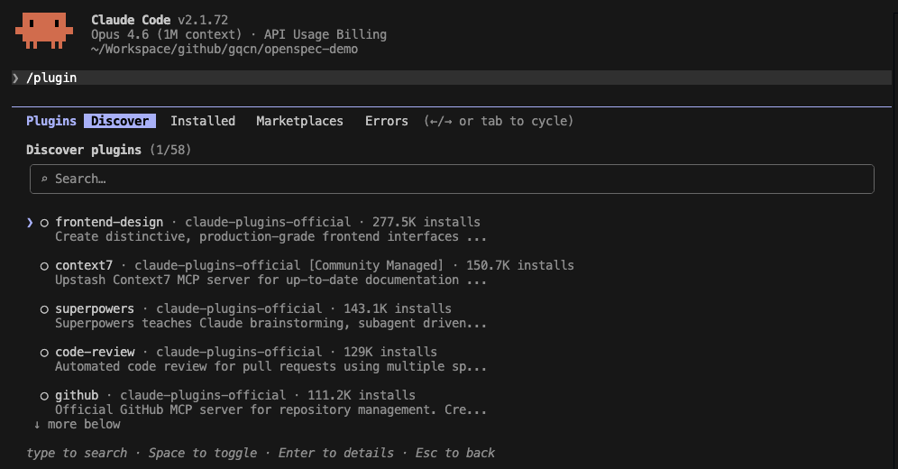

## 前言

在使用`Claude Code`进行团队协作开发时，工程师们经常面临这样的困境：费心打磨的自定义`Skills`只能在当前项目中使用，精心设计的`Hooks`审计规则无法轻松同步给团队其他成员，优化过的`MCP`服务器配置也无法打包分发。每换一个项目或一台机器，就必须重新手动配置一遍。

`Plugins`正是为了彻底解决这一痛点而诞生的。它是`Claude Code`提供的一套标准化的功能打包与分发机制，将`Skills`、`Agents`、`Hooks`、`MCP`服务器、`LSP`语言服务器等所有自定义扩展整合进一个自包含的目录，通过统一的插件市场进行安装、更新和共享。

## 什么是Plugins


### 设计目标

`Plugins`的核心目标是实现`Claude Code`扩展能力的**可打包、可版本化、可分发**，主要解决以下几类问题：

- **跨项目复用**：同一套`Skills`和`Hooks`可以安装到多个项目，不再重复编写
- **团队协作**：通过版本控制（`project`作用域）或私有插件市场将配置共享给整个团队
- **社区分发**：通过官方或第三方市场发布插件，供更广泛的社区使用
- **依赖隔离**：插件自带`MCP`服务器和脚本，与宿主环境解耦，安装即可用
- **命名空间隔离**：插件内的`Skills`自动以插件名作为前缀（如`/my-plugin:hello`），避免多插件间命名冲突

### 核心概念

一个`Plugin`本质上是一个**目录**，其中可以包含以下五类组件：

| 组件类型 | 目录/文件 | 作用 |
|----------|----------|------|
| `Skills` | `skills/` | 提供`/plugin-name:skill-name`斜杠快捷指令，由用户或`Claude`调用 |
| `Agents` | `agents/` | 提供专用子智能体，`Claude`可在合适场景自动调用 |
| `Hooks` | `hooks/hooks.json` | 在`Claude Code`生命周期事件节点自动触发脚本或`LLM`评估 |
| `MCP Servers` | `.mcp.json` | 捆绑外部工具服务，提供`Claude`可调用的工具集 |
| `LSP Servers` | `.lsp.json` | 提供语言服务协议支持，让`Claude`获得实时代码诊断和智能跳转能力 |

所有组件共用同一个插件清单文件（`.claude-plugin/plugin.json`），统一描述插件的元信息与组件路径。

### 工作原理

```text
Plugin Directory
├── .claude-plugin/
│   └── plugin.json        (Manifest: name, version, component paths)
├── skills/skill-name/
│   └── SKILL.md           (Skill instructions + frontmatter)
├── agents/
│   └── agent-name.md      (Agent system prompt + frontmatter)
├── hooks/
│   └── hooks.json         (Event handlers: PreToolUse, PostToolUse, ...)
├── .mcp.json              (MCP server definitions)
├── .lsp.json              (LSP server configs)
└── scripts/               (Helper scripts for hooks/MCP)
```

`Claude Code`安装插件时，会将插件目录复制到本地缓存（`~/.claude/plugins/cache`），并在下一次启动时自动加载其中的所有组件。开发阶段可以通过`--plugin-dir`标志临时加载，无需安装。

## 如何使用Plugins

### 安装和管理插件

**从市场安装插件：**

```bash
# 安装到用户作用域（默认，适用于所有项目）
claude plugin install plugin-name

# 安装到项目作用域（写入.claude/settings.json，可提交版本库）
claude plugin install plugin-name --scope project

# 安装到本地作用域（写入.claude/settings.local.json，不提交版本库）
claude plugin install plugin-name --scope local

# 从指定市场安装
claude plugin install formatter@my-marketplace
```
也可以通过斜杠命令`/plugin`进行插件的安装管理：



**插件管理命令：**

```bash
# 卸载插件
claude plugin uninstall plugin-name

# 禁用插件（保留配置，下次可快速启用）
claude plugin disable plugin-name

# 重新启用插件
claude plugin enable plugin-name

# 更新插件到最新版本
claude plugin update plugin-name
```

**安装作用域说明：**

| 作用域 | 配置文件 | 适用场景 |
|--------|----------|----------|
| `user` | `~/.claude/settings.json` | 个人插件，对所有项目生效（默认） |
| `project` | `.claude/settings.json` | 团队插件，通过版本库共享 |
| `local` | `.claude/settings.local.json` | 项目本地插件，不提交版本库 |
| `managed` | 受管理的配置 | 企业统一管理（只读） |

### 开发阶段临时加载插件

在开发和测试阶段，使用`--plugin-dir`标志临时加载插件，无需安装：

```bash
# 加载单个插件
claude --plugin-dir ./my-plugin

# 同时加载多个插件
claude --plugin-dir ./plugin-one --plugin-dir ./plugin-two
```

进入`Claude Code`后，修改插件文件后使用`/reload-plugins`命令热重载，无需重启。

### 创建第一个插件

#### 完整目录结构

```text
my-plugin/
├── .claude-plugin/
│   └── plugin.json          # 插件清单（可选，不存在时自动探索）
├── skills/                  # Skills组件
│   └── greet/
│       └── SKILL.md
├── agents/                  # Agents组件
│   └── reviewer.md
├── hooks/                   # Hooks组件
│   └── hooks.json
├── .mcp.json                # MCP服务器定义
├── .lsp.json                # LSP服务器配置
├── scripts/                 # Hook和MCP使用的辅助脚本
│   └── format.sh
└── settings.json            # 插件默认设置
```

#### 插件清单（plugin.json）

```json
{
  "name": "my-plugin",
  "version": "1.0.0",
  "description": "A sample plugin demonstrating core features",
  "author": {
    "name": "Your Name",
    "email": "you@example.com",
    "url": "https://github.com/you"
  },
  "homepage": "https://github.com/you/my-plugin",
  "repository": "https://github.com/you/my-plugin",
  "license": "MIT",
  "keywords": ["development", "automation"]
}
```

`plugin.json`中的`name`字段会成为所有`Skills`的命名空间前缀。清单文件是可选的——若不存在，`Claude Code`会自动探索默认目录，并以目录名作为插件名。

#### 环境变量

在`hooks`和`MCP`服务器的路径配置中，使用`${CLAUDE_PLUGIN_ROOT}`环境变量引用插件根目录的绝对路径，确保无论安装在哪里路径都正确：

```json
{
  "hooks": {
    "PostToolUse": [{
      "hooks": [{
        "type": "command",
        "command": "${CLAUDE_PLUGIN_ROOT}/scripts/format.sh"
      }]
    }]
  }
}
```

## 实用示例

### 代码审查插件

将代码审查`Skill`和审查后自动运行测试的`Hook`打包为一个插件：

**目录结构：**

```text
code-review-plugin/
├── .claude-plugin/
│   └── plugin.json
├── skills/
│   └── review/
│       └── SKILL.md
└── hooks/
    └── hooks.json
```

**`.claude-plugin/plugin.json`：**

```json
{
  "name": "code-review",
  "version": "1.0.0",
  "description": "Code review skill with automated test hook",
  "author": { "name": "Dev Team" }
}
```

**`skills/review/SKILL.md`：**

```markdown
---
name: review
description: Performs comprehensive code review. Use when reviewing code changes, PRs, or analyzing code quality.
---

When reviewing code, check for:
1. Code clarity and readability
2. Error handling completeness
3. Potential security vulnerabilities
4. Test coverage gaps
5. Performance concerns

Provide feedback in a structured format with severity levels: CRITICAL, WARNING, SUGGESTION.
```

安装后通过`/code-review:review`调用，或者`Claude`在合适场景自动触发此`Skill`。

**`hooks/hooks.json`（写入文件后自动运行lint）：**

```json
{
  "hooks": {
    "PostToolUse": [
      {
        "matcher": "Write|Edit",
        "hooks": [
          {
            "type": "command",
            "command": "jq -r '.tool_input.file_path' | xargs -I{} sh -c 'echo {} | grep -q \\.js$ && npx eslint {} --fix || true'"
          }
        ]
      }
    ]
  }
}
```

### 自动化格式检查插件

一个在每次文件变更后自动触发代码格式化和类型检查的插件，适合`TypeScript`项目团队共享：

**目录结构：**

```text
ts-quality-plugin/
├── .claude-plugin/
│   └── plugin.json
├── hooks/
│   └── hooks.json
└── scripts/
    └── check.sh
```

**`scripts/check.sh`：**

```bash
#!/bin/bash
# Receive hook context from stdin
INPUT=$(cat)
FILE_PATH=$(echo "$INPUT" | jq -r '.tool_input.file_path // empty')

if [[ "$FILE_PATH" == *.ts || "$FILE_PATH" == *.tsx ]]; then
  echo "Running type check on $FILE_PATH..."
  npx tsc --noEmit 2>&1 | head -20
fi
```

**`hooks/hooks.json`：**

```json
{
  "hooks": {
    "PostToolUse": [
      {
        "matcher": "Write|Edit|MultiEdit",
        "hooks": [
          {
            "type": "command",
            "command": "${CLAUDE_PLUGIN_ROOT}/scripts/check.sh"
          }
        ]
      }
    ]
  }
}
```

使用前确保脚本有执行权限：

```bash
chmod +x ts-quality-plugin/scripts/check.sh
```

安装到项目作用域，团队成员拉取代码后即可使用：

```bash
claude plugin install ts-quality@team-marketplace --scope project
```

### 数据库工具插件（含MCP）

将数据库操作`MCP`服务器和相关`Skill`打包在一起：

**目录结构：**

```text
db-tools-plugin/
├── .claude-plugin/
│   └── plugin.json
├── skills/
│   └── query/
│       └── SKILL.md
├── .mcp.json
└── servers/
    └── db-server        # 编译好的MCP服务器二进制
```

**`.mcp.json`：**

```json
{
  "mcpServers": {
    "db-tools": {
      "command": "${CLAUDE_PLUGIN_ROOT}/servers/db-server",
      "args": ["--config", "${CLAUDE_PLUGIN_ROOT}/config.json"],
      "env": {
        "DB_PATH": "${CLAUDE_PLUGIN_ROOT}/data"
      }
    }
  }
}
```

**`skills/query/SKILL.md`：**

```markdown
---
name: query
description: Execute database queries and explain results. Use when user needs to query the database or analyze data.
---

Use the db-tools MCP server to execute database queries.
Always explain the query logic and result interpretation in plain language.
Warn the user before executing any write operations (INSERT, UPDATE, DELETE).
```

插件安装后，`MCP`服务器自动启动，`/db-tools:query`指令即可在会话中调用。

### LSP语言服务插件

为`Claude`提供`Go`语言的实时代码诊断能力：

**`.lsp.json`：**

```json
{
  "go": {
    "command": "gopls",
    "args": ["serve"],
    "extensionToLanguage": {
      ".go": "go"
    }
  }
}
```

**`plugin.json`：**

```json
{
  "name": "go-lsp",
  "version": "1.0.0",
  "description": "Go language server for real-time diagnostics and code intelligence",
  "lspServers": "./.lsp.json"
}
```

> 注意：`LSP`插件只配置连接方式，不包含语言服务器二进制本身。用户安装插件后需自行安装`gopls`：`go install golang.org/x/tools/gopls@latest`

## 调试与常见问题

### 调试命令

启动时加`--debug`标志可查看插件加载详情：

```bash
claude --debug --plugin-dir ./my-plugin
```

在`Claude Code`内部使用`/plugin validate`命令验证插件清单语法。

### 常见问题排查

| 问题现象 | 可能原因 | 解决方法 |
|----------|----------|----------|
| 插件加载但找不到`Skill` | `skills/`目录放在了`.claude-plugin/`内 | 将`skills/`移到插件根目录 |
| `Hook`不触发 | 脚本没有执行权限 | 执行`chmod +x scripts/your-script.sh` |
| `Hook`事件名不匹配 | 事件名大小写错误 | 事件名区分大小写，如`PostToolUse`不是`postToolUse` |
| `MCP`服务器启动失败 | 路径中未使用`${CLAUDE_PLUGIN_ROOT}` | 所有路径使用该环境变量 |
| `LSP`找不到可执行文件 | 语言服务器二进制未安装 | 按插件说明安装对应的`LSP`二进制 |
| 修改插件后`Skill`未更新 | 未热重载 | 在`Claude Code`内执行`/reload-plugins` |

### 路径注意事项

- 插件内所有路径必须使用相对路径，且以`./`开头
- 插件安装到缓存后无法引用插件目录之外的文件（不支持`../`跳出目录）
- 若需引用外部文件，可在插件目录内创建符号链接：`ln -s /path/to/external ./external`

## 版本管理与分发

遵循语义化版本规范管理插件版本：

```json
{
  "name": "my-plugin",
  "version": "2.1.0"
}
```

- `MAJOR`：不兼容的破坏性变更
- `MINOR`：向后兼容的新功能
- `PATCH`：向后兼容的`Bug`修复

> 重要：修改插件代码后必须同步更新`version`字段，否则已安装用户不会收到更新（`Claude Code`依赖版本号判断是否需要更新缓存）。

## 参考资料

- [Claude Code Plugins官方文档](https://code.claude.com/docs/en/plugins)
- [Plugins Reference（完整技术规范）](https://code.claude.com/docs/en/plugins-reference)
- [Plugin Marketplaces（创建和管理市场）](https://code.claude.com/docs/en/plugin-marketplaces)
- [Discover and Install Plugins（发现和安装插件）](https://code.claude.com/docs/en/discover-plugins)
- [Skills文档](https://code.claude.com/docs/en/skills)
- [Hooks文档](https://code.claude.com/docs/en/hooks)
- [MCP文档](https://code.claude.com/docs/en/mcp)
