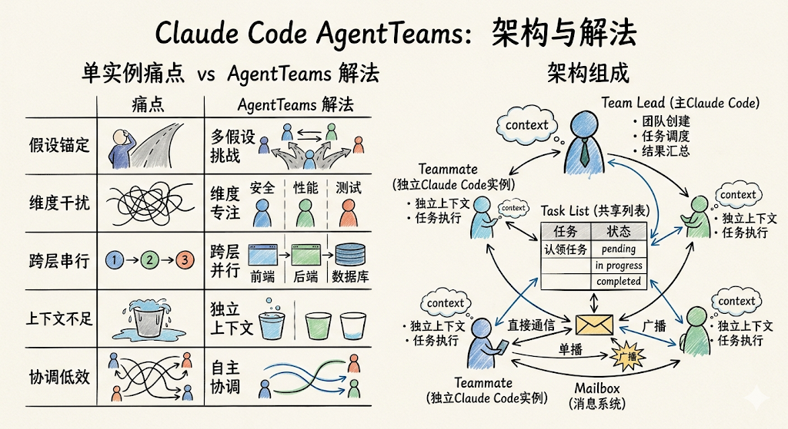
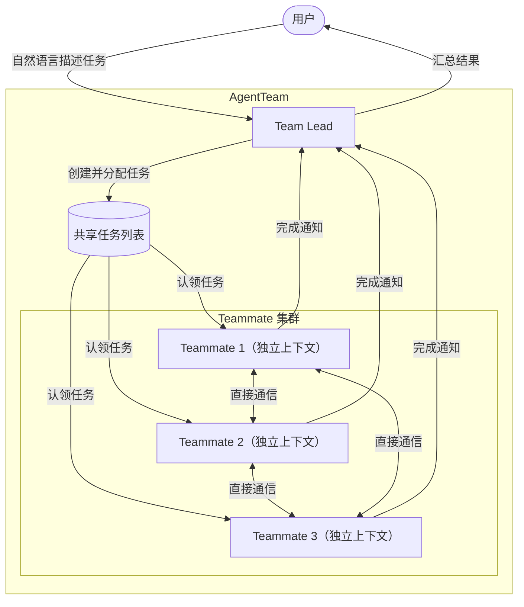

## 前言

即使是能力强大的`Claude Code`单实例，面对需要同时探索多个方向的复杂任务时仍会遇到瓶颈：单线程思维在调查大规模`Bug`时容易被第一个看似合理的假设所锚定；并行代码审查若只有一个审查者，安全、性能、测试覆盖率等维度会相互干扰；跨前后端、数据库的大型功能开发若由单一实例处理，则难以真正并行推进。

`AgentTeams（智能体团队）`正是为了应对这类场景而设计的。它允许多个`Claude Code`实例作为团队协同工作——一个实例担任`Team Lead`负责协调，其余实例作为`Teammate`各自独立完成任务，并能直接相互通信，由此实现真正的并行探索与协作。

:::warning 实验性功能
`Agent Teams`目前是实验性功能，默认处于关闭状态。已知存在会话恢复、任务协调和关闭行为等方面的问题，使用前请了解相关限制。
:::

## 什么是AgentTeams



`AgentTeams`是`Claude Code`提供的多智能体并行协作机制。它协调多个`Claude Code`实例共同工作：一个会话担任团队`Lead`，负责创建团队、生成任务列表、调度`Teammate`并汇总结果；各`Teammate`各自运行在独立的上下文窗口中，能够直接相互通信，也可以被用户直接操控，而非只能通过`Lead`间接交互。

与`SubAgents`相比，`AgentTeams`最核心的区别在于 **`Teammate`之间可以直接通信并共享任务列表** ，这使得需要相互讨论、共同校验、协作推进的复杂任务成为可能。

## AgentTeams解决的问题

### 单实例的瓶颈

`Claude Code`单实例在以下场景中存在明显局限：

- **并行探索受限**：调查复杂`Bug`时，单实例容易被第一个假设锚定，难以同时追踪多条排查路径
- **审查维度干扰**：代码审查需要同时关注安全、性能、测试覆盖等多个维度，单实例会在维度之间切换，注意力分散
- **跨层开发串行化**：涉及前端、后端、数据库多层改动的功能，单实例只能逐层推进，无法真正并行
- **上下文窗口不足**：超大规模任务的中间状态积累会快速消耗上下文

### AgentTeams的解法

`AgentTeams`通过多实例并行和直接通信解决上述问题：

| 问题 | AgentTeams的解法 |
|------|----------------|
| 假设锚定 | 多个`Teammate`分别持有不同假设，相互挑战验证 |
| 审查维度干扰 | 每个`Teammate`专注单一维度，互不干扰 |
| 跨层开发串行 | 不同`Teammate`分别负责不同层，真正并行推进 |
| 上下文不足 | 每个`Teammate`拥有独立上下文，互不影响 |
| 协调低效 | 共享任务列表+直接通信，自主协调而非集中管控 |

## 设计原理

### 架构组成

一个`AgentTeam`由4个核心部分构成：

| 组件 | 说明 |
|------|------|
| `Team Lead` | 主`Claude Code`会话，负责创建团队、调度任务、汇总结果 |
| `Teammate` | 独立的`Claude Code`实例，各自持有独立的上下文窗口，完成分配给自己的任务 |
| `Task List` | 共享任务列表，`Teammate`从中认领任务，状态包括`pending`、`in progress`、`completed` |
| `Mailbox` | 消息系统，实现智能体之间的直接通信，支持单播和广播 |

团队配置与任务列表存储在本地：

```text
~/.claude/teams/{team-name}/config.json   # Team配置，包含成员列表
~/.claude/tasks/{team-name}/              # 任务列表
```

### 工作流程



### 与SubAgents的核心区别

`AgentTeams`和`SubAgents`都支持并行工作，但在通信模式上有本质差异：

| 对比维度 | SubAgents | AgentTeams |
|---------|-----------|------------|
| 上下文 | 独立上下文窗口，结果返回给调用方 | 独立上下文窗口，完全独立 |
| 通信方式 | 只能向主智能体报告结果 | `Teammate`之间可直接通信 |
| 协调机制 | 主智能体管理所有工作 | 共享任务列表+自主协调 |
| 最适场景 | 只关心结果的专注任务 | 需要讨论、协作和共同校验的复杂任务 |
| `Token`消耗 | 较低：结果摘要返回主上下文 | 较高：每个`Teammate`都是独立的`Claude`实例 |

**选择建议**：当任务工作者不需要相互通信时，选`SubAgents`；当队友需要共享发现、相互挑战、自主协调时，选`AgentTeams`。

## 启用AgentTeams

`AgentTeams`默认关闭，需要通过设置环境变量来启用。推荐通过`settings.json`配置：

```json
{
  "env": {
    "CLAUDE_CODE_EXPERIMENTAL_AGENT_TEAMS": "1"
  }
}
```

也可以直接设置在`Shell`环境中：

```bash
export CLAUDE_CODE_EXPERIMENTAL_AGENT_TEAMS=1
```

## 创建与使用AgentTeams

### 创建首个团队

启用`AgentTeams`后，直接用自然语言描述任务和团队结构，`Claude`会自动创建团队并调度`Teammate`：

```text
I'm designing a CLI tool that helps developers track TODO comments across
their codebase. Create an agent team to explore this from different angles:
one teammate on UX, one on technical architecture, one playing devil's advocate.
```

`Claude`会：
1. 创建共享任务列表
2. 按照你描述的角色调度相应数量的`Teammate`
3. 在`Lead`的终端列出所有`Teammate`及其当前任务
4. 完成后尝试自动清理团队

### 控制团队

#### 选择显示模式

`AgentTeams`支持两种显示模式：

| 模式 | 说明 | 前置条件 |
|------|------|---------|
| `in-process`（进程内模式） | 所有`Teammate`运行在主终端内，通过`Shift+Down`循环切换 | 无需额外配置，任何终端均可用 |
| `split-panes`（分屏模式） | 每个`Teammate`独占一个窗格，可同时看到所有输出 | 需要`tmux`或`iTerm2` |

默认模式（`"auto"`）：若已在`tmux`会话中则使用分屏模式，否则使用进程内模式。可在`settings.json`中覆盖：

```json
{
  "teammateMode": "in-process"
}
```

或通过命令行参数指定：

```bash
claude --teammate-mode in-process
```

分屏模式需要安装`tmux`或`iTerm2 it2 CLI`：

```bash
# 安装 tmux（macOS）
brew install tmux

# 验证 tmux 可用
which tmux
```

#### 指定队友数量和模型

可以明确告诉`Lead`需要多少`Teammate`及使用哪款模型：

```text
Create a team with 4 teammates to refactor these modules in parallel.
Use Sonnet for each teammate.
```

#### 要求计划审批

对于高风险任务，可要求`Teammate`先制定计划，经`Lead`审批后再执行：

```text
Spawn an architect teammate to refactor the authentication module.
Require plan approval before they make any changes.
```

`Teammate`会在只读计划模式下工作，制定完计划后向`Lead`发送审批请求。`Lead`审批通过后`Teammate`才开始执行。若被拒绝，`Teammate`修订计划后重新提交。

可以在提示词中给`Lead`设置审批标准，例如：

```text
Only approve plans that include test coverage.
Reject plans that modify the database schema directly.
```

#### 直接与Teammate通信

每个`Teammate`都是完整的独立`Claude Code`会话，可以直接与任意`Teammate`交互：

- **进程内模式**：`Shift+Down`循环切换到目标`Teammate`，直接输入消息发送；按`Enter`进入`Teammate`会话，`Escape`中断当前轮次；`Ctrl+T`切换任务列表显示
- **分屏模式**：点击对应`Teammate`的窗格直接交互

#### 任务认领

共享任务列表协调团队工作。任务有三种状态：`pending`、`in progress`、`completed`，并支持任务依赖（依赖未完成的任务不可认领）。`Lead`可以显式分配，也可以让`Teammate`自主认领：

```text
# 显式分配
Tell the backend teammate to take the database migration task.

# 让 Lead 等待 Teammate 完成再继续
Wait for your teammates to complete their tasks before proceeding.
```

任务认领使用文件锁防止多个`Teammate`同时认领同一任务时出现竞态条件。

#### 关闭Teammate

优雅关闭某个`Teammate`：

```text
Ask the researcher teammate to shut down.
```

`Teammate`可以批准（正常退出）或拒绝（附带原因说明）。

#### 清理团队

工作完成后：

```text
Clean up the team.
```

:::warning 清理注意事项
必须通过`Lead`执行清理。`Teammate`不应发起清理，其团队上下文解析可能不正确，可能导致资源状态不一致。清理前需确保所有`Teammate`已关闭，否则`Lead`会检测到活跃`Teammate`并拒绝清理。
:::

### 使用Hooks自动化质量门控

借助`Hooks`可以在`Teammate`完工或任务完成时自动执行检查：

| Hook事件 | 触发时机 | 典型用途 |
|---------|---------|---------|
| `TeammateIdle` | `Teammate`即将进入空闲 | 退出码`2`可发送反馈并让`Teammate`继续工作 |
| `TaskCompleted` | 任务即将被标记为完成 | 退出码`2`可阻止完成并发送反馈 |

## 使用示例

### 并行多维度代码审查

单个审查者倾向于一次专注于一类问题。将审查维度拆分给独立的`Teammate`，可以让安全、性能、测试覆盖率同时得到充分关注：

```text
Create an agent team to review PR #142. Spawn three reviewers:
- One focused on security implications
- One checking performance impact
- One validating test coverage
Have them each review and report findings.
```

三位审查者从同一`PR`出发，各自应用不同的审查视角，`Lead`在全部完成后汇总结论。

### 竞争假设并行调试

当`Bug`根因不明时，单一智能体容易找到一个看似合理的解释就停止探索。通过让多个`Teammate`分别持有不同假设并相互挑战，大幅提升找到真实根因的概率：

```text
Users report the app exits after one message instead of staying connected.
Spawn 5 agent teammates to investigate different hypotheses. Have them talk to
each other to try to disprove each other's theories, like a scientific debate.
Update the findings doc with whatever consensus emerges.
```

这里的排他性设计是关键机制：每个`Teammate`不仅要验证自己的假设，还要主动攻击其他`Teammate`的假设。能在"辩论"中存活的理论，更可能就是真实根因。

### 跨层功能并行开发

前端、后端、数据库层可以分别交给不同的`Teammate`，真正实现并行推进：

```text
Create an agent team to implement the user notification feature.
Spawn three teammates:
- Frontend teammate: implement the notification UI components in src/components/
- Backend teammate: implement the notification API endpoints in src/api/
- Database teammate: write the migration and data access layer in src/db/
Each teammate should only modify files in their assigned directory.
```

### 设置安全审查后置门控

结合`Hooks`，可以在每个`Teammate`完成任务后自动触发安全扫描：

```bash
# .claude/hooks/teammate-idle.sh
#!/bin/bash
# 在 Teammate 空闲前检查是否有安全问题
if grep -r "eval\|exec\|__import__" src/ --include="*.py" -q; then
  echo "Security check failed: dangerous functions detected"
  exit 2  # 阻止 Teammate 进入空闲，要求其修复
fi
```

### 带计划审批的架构重构

```text
Spawn an architect teammate to refactor the authentication module.
Require plan approval before they make any changes.
Only approve plans that:
- Include unit tests for all modified functions
- Don't change the public API interface
- Include a rollback strategy
```

## 最佳实践

### 团队规模建议

- **推荐起点**：`3-5`个`Teammate`，平衡并行收益与协调开销
- **任务分配**：每个`Teammate`对应`5-6`个任务，保持工作饱满度同时避免过度上下文切换
- **扩大规模的条件**：工作可以真正独立并行推进时再考虑增加`Teammate`数量，3个专注的`Teammate`通常优于5个分散的

### 上下文与提示词

`Teammate`启动时会自动加载项目上下文（`CLAUDE.md`、`MCP Server`、`Skills`），但**不会继承`Lead`的对话历史**。在调度提示词中需要包含任务所需的关键背景：

```text
Spawn a security reviewer teammate with the prompt: "Review the authentication
module at src/auth/ for security vulnerabilities. Focus on token handling,
session management, and input validation. The app uses JWT tokens stored in
httpOnly cookies. Report any issues with severity ratings."
```

### 任务粒度建议

| 任务粒度 | 问题 |
|---------|------|
| 过小 | 协调开销超过并行收益 |
| 过大 | `Teammate`长时间无检查点，出错代价大 |
| 适中 | 能产出清晰可交付物（一个函数、一个测试文件、一份审查报告） |

### 避免文件冲突

两个`Teammate`同时编辑同一个文件会导致内容覆盖。**务必将工作拆分为每个`Teammate`负责独立的文件集**。

### 主动监控与引导

不要让团队长时间无人监管。检查`Teammate`的进度，对偏离方向的`Teammate`及时调整，主动汇总阶段性结果，防止方向偏差导致大量无效工作。

## 常见问题排查

### Teammate未出现

- **进程内模式**：`Teammate`可能已在运行但不可见，按`Shift+Down`切换查看
- **任务不够复杂**：`Claude`根据任务复杂度决定是否调度`Teammate`，可以明确说"请创建一个团队"
- **分屏模式**：检查`tmux`是否已安装（`which tmux`），若用`iTerm2`则需确认`it2 CLI`已安装且`Python API`已在偏好设置中开启

### 权限请求过多

`Teammate`的权限请求会汇报给`Lead`，可能产生大量确认交互。在调度`Teammate`前，在`权限设置`中预先批准常见操作。

### Teammate遭遇错误后停止

用`Shift+Down`（进程内模式）或点击对应窗格（分屏模式）查看`Teammate`输出，随后：
- 直接给`Teammate`发送额外指令
- 或调度一个新`Teammate`来接续工作

### Lead在工作完成前关闭

告诉`Lead`继续工作，或预先在提示词中加入约束：

```text
Wait for your teammates to complete their tasks before proceeding.
```

### tmux会话残留

```bash
# 列出所有 tmux 会话
tmux ls

# 删除指定会话
tmux kill-session -t <session-name>
```

## 当前限制

| 限制项 | 说明 |
|--------|------|
| 无会话恢复（进程内模式） | `/resume`和`/rewind`不会恢复进程内`Teammate` |
| 任务状态滞后 | `Teammate`有时无法自动将任务标记为完成，需手动更新状态 |
| 关闭较慢 | `Teammate`需完成当前请求或工具调用后才能关闭 |
| 每会话仅一个团队 | `Lead`同时只能管理一个团队 |
| 不支持嵌套团队 | `Teammate`不能调度自己的子团队 |
| `Lead`不可转移 | 创建团队的会话始终是`Lead`，不能提升`Teammate`为`Lead` |
| 权限在调度时确定 | `Teammate`继承`Lead`的权限模式，调度后可单独修改但无法在调度时差异化设置 |
| 分屏模式限制 | 需要`tmux`或`iTerm2`，不支持`VS Code`集成终端、`Windows Terminal`或`Ghostty` |

## 参考资料

- [Claude Code AgentTeams官方文档](https://code.claude.com/docs/en/agent-teams)
- [Claude Code SubAgents使用指南](https://code.claude.com/docs/en/sub-agents)
- [Claude Code Hooks使用指南](https://code.claude.com/docs/en/hooks)
- [Claude Code 成本说明](https://code.claude.com/docs/en/costs)
