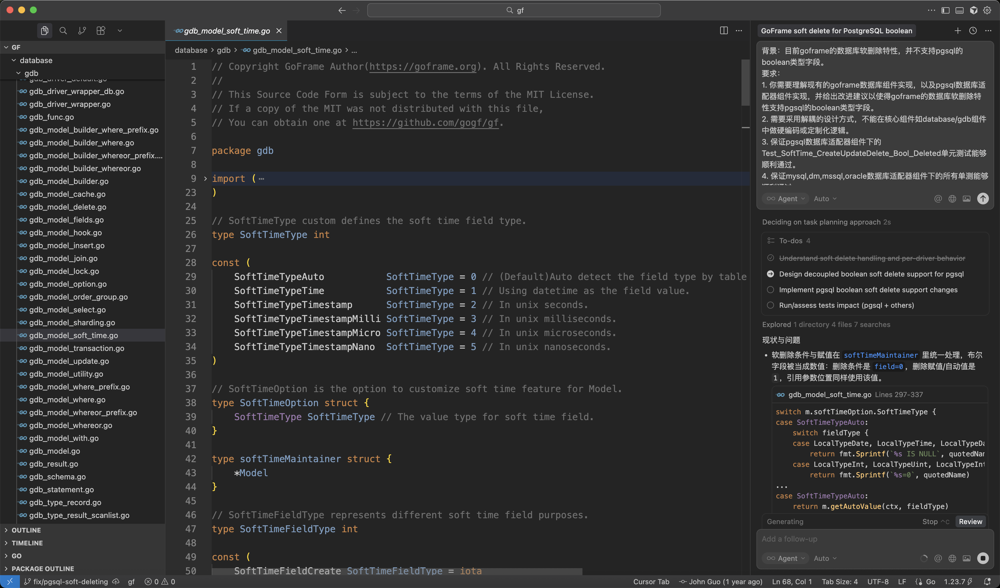
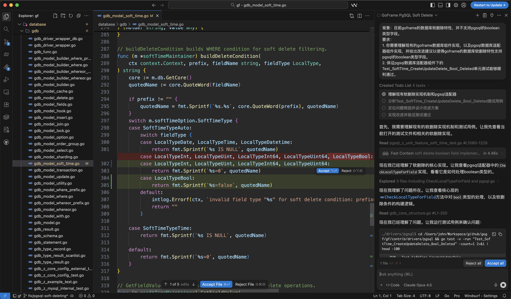
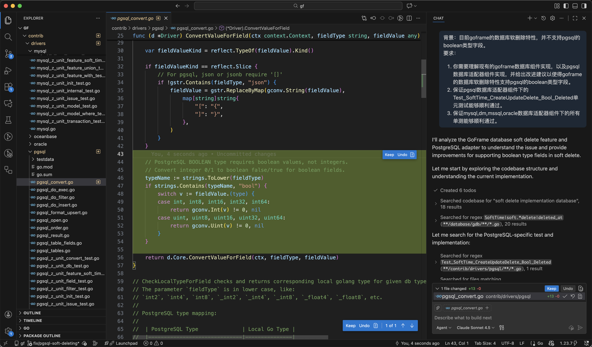
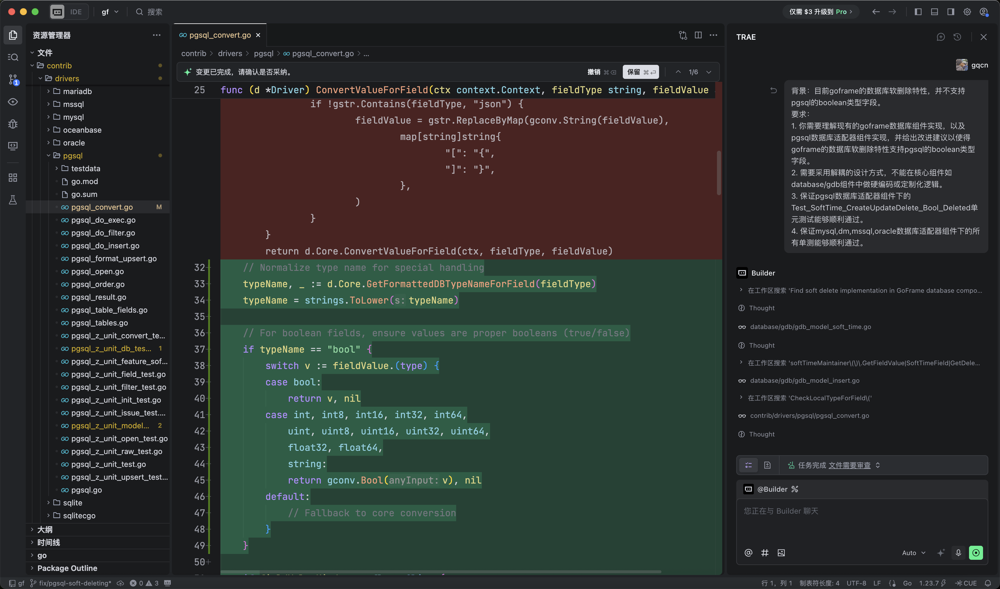
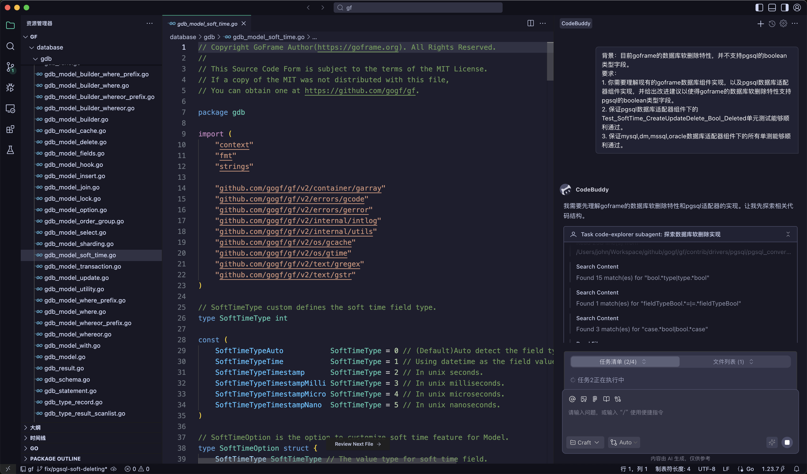
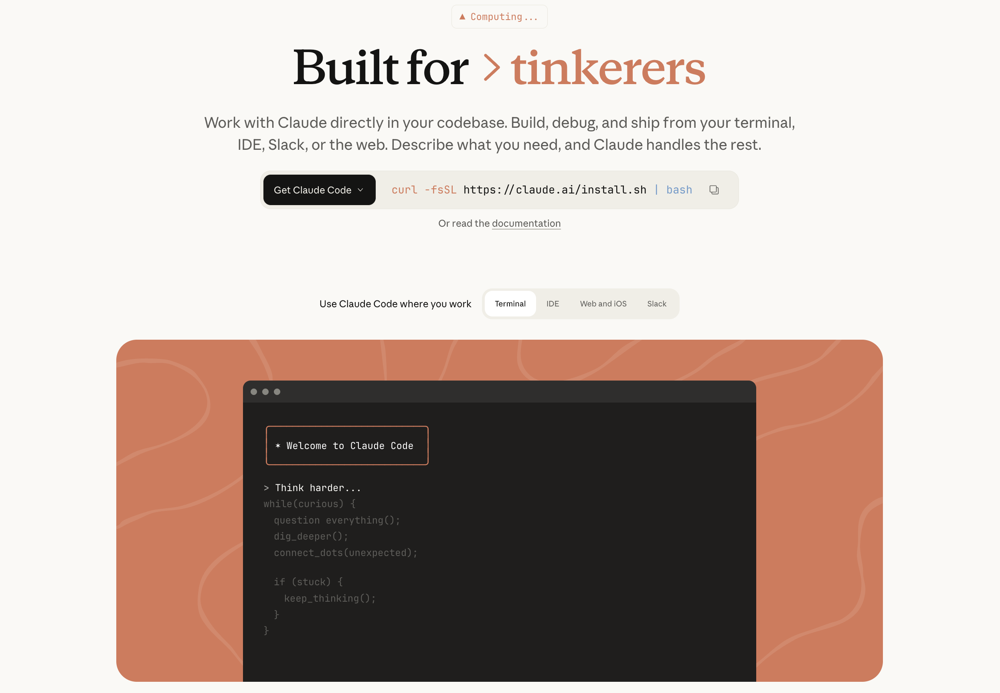
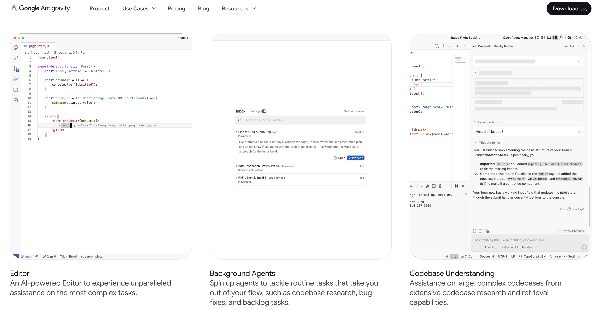

## 前言

近年来，`AI`代码开发工具迎来大爆发，各大厂商纷纷推出自己的`AI`编程助手，`AI`开发工具也日趋普及。作为开发者，面对琳琅满目的选择，如何找到最适合自己的工具成为一个重要问题。

笔者一直以来使用过多款`AI`开发工具，包括`Cursor`、`Windsurf`、`Copilot`、`Trae`等，基于这些实际使用经验，笔者梳理了这篇文章，希望能帮助大家做工具选型，提高开发效率。

## Cursor

### 基本介绍

`Cursor`是由`Anysphere`公司开发的`AI`原生代码编辑器，基于`VS Code`深度定制。它将`AI`能力深度集成到编辑器的每个环节，提供代码补全、智能重构、多文件编辑、`Agent`模式等功能。`Cursor`的核心理念是让`AI`成为开发者的"结对编程伙伴"，通过深度理解项目上下文，提供精准的代码建议和自动化能力。`Cursor`引入了全新的`Composer`界面和`Agent`模式，支持后台自动执行任务及`Cloud Agents`远程并行处理，大幅提升了自动化编程能力。

### 官网

https://cursor.com

### 优点

- **深度IDE集成**：基于`VS Code`，保留了熟悉的开发体验，同时深度集成`AI`能力
- **强大的上下文理解**：支持索引整个代码库，`AI`能够理解项目结构和依赖关系
- **多文件编辑能力**：`Composer`功能支持跨多个文件进行智能编辑和重构
- **Agent模式**：支持后台自动执行复杂任务，如代码审查、Bug修复等
- **丰富的模型选择**：支持`OpenAI`、`Claude`、`Gemini`等多种主流模型
- **Tab补全体验优秀**：代码补全响应快速，建议质量高

### 缺点

- **价格较高**：`Pro`版本$20/月，`Pro+`版本$60/月，`Ultra`版本$200/月
- **资源消耗较大**：相比普通`VS Code`，内存占用更高
- **学习曲线**：充分发挥其能力需要一定的学习成本
- **偶尔的稳定性问题**：在大型项目中可能出现卡顿
- **Claude模型计费不透明**：`Cursor`调整`Pro`计划计费方式后，从固定次数改为按`API`费率的额度计费。由于`Anthropic`的`Claude`模型（尤其是`Claude Opus`系列）单次请求成本较高，许多用户反映额度耗尽过快，甚至有用户被额外扣费。这一计费方式引发大量投诉，`Cursor`官方虽道歉并承诺退款，但计费透明度问题仍被开发者诟病（笔者也是因此弃坑😤）

### 特色功能

- **MCP协议支持**：支持`Model Context Protocol`，可连接外部工具和数据源，如数据库、`API`、文档等，扩展`Agent`能力边界
- **Rules自定义规则**：支持项目级和全局级的自定义规则（`.cursor/rules`），让`AI`按照你的编码规范和偏好工作
- **Slash Commands**：支持自定义斜杠命令，将常用提示词封装为可复用的命令
- **Background Agents**：支持后台`Agent`在远程机器上并行工作，可同时处理多个任务分支
- **Browser Control**：内置浏览器控制能力，`Agent`可以截图、捕获控制台日志、网络请求等
- **Hooks扩展**：支持在`Agent`生命周期的关键节点运行自定义脚本，如自动格式化、安全检查等
- **Composer模型**：自研的`Composer`编码模型，专为代码生成优化，速度比同级模型快4倍

### 使用价格

| 套餐 | 价格 | 主要限制 |
|------|------|----------|
| `Hobby`（免费） | `$0` | 有限的`Agent`请求和`Tab`补全次数 |
| `Pro` | `$20`/月 | 扩展的`Agent`限制，无限`Tab`补全，含`Cloud Agents` |
| `Pro+` | `$60`/月 | `3`倍模型使用量 |
| `Ultra` | `$200`/月 | `20`倍模型使用量，优先访问新功能 |
| `Teams` | `$40`/用户/月 | 共享规则和命令，团队管理，`SAML/OIDC SSO` |

### 国内支付说明

`Cursor`支持使用支付宝付费订阅，也支持使用`Visa`/`MasterCard`的信用卡订阅，通常国内信用卡也可以直接绑定订阅使用。

### 支持的模型

- 主流模型，包括`OpenAI`系列、`Anthropic`系列、`Google`系列等
- 支持自定义`API`接入

### 维护厂商

**Anysphere** - 美国AI创业公司，专注于AI编程工具开发

## Windsurf

### 基本介绍

`Windsurf`（原`Codeium`）是由`Codeium`公司开发的`AI`原生`IDE`，定位为"`Agentic IDE`"。它强调深度的上下文感知能力，能够在生产级代码库中提供精准的建议。`Windsurf`的核心特色是`Cascade`功能，这是一个能够理解整个项目上下文、自动规划和执行多步骤任务的`AI Agent`。

`Windsurf`的`Tab`补全功能被认为是业界领先的，能够预测开发者的下一步操作并提供智能建议。作者对该功能也是大赞👍，虽然有时会使用其他编辑器，但时不时会切回到`Windsurf`用它的自动补全功能😅。但有时也会因为补全提示太快，干扰我写内容，真是甜蜜的烦恼😅。

### 官网

https://windsurf.com

### 优点

- **免费版额度有限**：免费版每月仅25个`Prompt Credits`，对于频繁使用`AI`功能的开发者较为有限
- **Cascade Agent强大**：深度上下文感知，支持复杂的多步骤任务
- **Tab补全体验极佳**：响应速度快，预测准确度高
- **轻量级**：相比`Cursor`资源占用更少
- **支持多种IDE插件**：除了独立`IDE`，还提供`VS Code`、`JetBrains`等插件

### 缺点

- **生态相对较新**：社区和插件生态不如`Cursor`成熟
- **高级功能需付费**：部分高级`Agent`功能需要`Pro`版本
- **文档相对较少**：学习资源不如竞品丰富
- **企业功能有限**：大型团队协作功能还在完善中

### 特色功能

- **MCP协议支持**：内置多个预配置的`MCP Server`，支持自定义配置，可连接`Figma`、数据库、`API`等外部工具
- **Memories记忆系统**：`Cascade`可以自动生成和管理跨对话的上下文记忆，无需重复说明项目背景
- **Rules规则系统**：支持全局和项目级的自定义规则，规范`AI`行为和输出风格
- **Workflows工作流**：支持定义可复用的工作流（`Markdown`格式），通过斜杠命令快速执行重复性任务
- **Cascade Hooks**：支持在`Cascade`执行的关键节点插入自定义脚本，如代码格式化、安全检查等
- **SWE-1.5模型**：自研的`SWE-1.5`代码搜索模型，专为代码理解和搜索优化
- **Turbo Mode**：自动执行模式，减少确认步骤，提升开发效率
- **实时协作预览**：内置预览功能，点击元素即可让`Cascade`修改

### 使用价格

| 套餐 | 价格 | 主要限制 |
|------|------|----------|
| `Free` | `$0` | `25 Prompt Credits`/月，无限`Tab`补全和内联编辑 |
| `Pro` | `$15`/月 | `500 Prompt Credits`/月，可按`$10/250 Credits`追加，支持`SWE-1.5`模型 |
| `Teams` | `$30`/用户/月 | `500 Credits`/用户/月，团队管理，零数据留存 |
| `Enterprise` | 定制 | `1000+ Credits`/用户/月，私有部署，高级安全功能 |

### 国内支付说明

`Windsurf`支持使用`Visa`/`MasterCard`的信用卡订阅，通常国内信用卡也可以直接绑定订阅使用。

### 支持的模型

- 主流模型，包括`OpenAI`系列、`Anthropic`系列、`Google`系列、`xAI`系列等
- 自研`SWE-1.5`快速`Agent`模型
- 支持自定义`API`接入

### 维护厂商

**Codeium**（旗下品牌`Windsurf`） - 美国`AI`编程工具公司，由前`Google`工程师创立

## GitHub Copilot

### 基本介绍

`GitHub Copilot`是由`GitHub`（微软旗下）与`OpenAI`合作开发的`AI`编程助手，是目前市场占有率最高的`AI`代码工具。它以插件形式集成到`VS Code`、`JetBrains`、`Neovim`等主流`IDE`中，提供代码补全、聊天对话、代码审查等功能。

`Copilot`推出了`Coding Agent`功能，可以自动创建`Pull Request`、修复`Issue`，进而实现端到端的自动化开发。`Pro+`版本则提供更多高级模型的访问权限，满足重度`AI`用户的需求。

### 官网

https://github.com/features/copilot

### 优点

- **广泛的IDE支持**：支持`VS Code`、`JetBrains`全家桶、`Neovim`、`Xcode`等几乎所有主流IDE
- **与GitHub深度集成**：可以直接在`GitHub`上使用，支持`Issue`修复、`PR`审查等
- **稳定可靠**：微软背书，服务稳定性有保障
- **丰富的模型选择**：支持`GPT-5.1`、`GPT-5.4`、`Claude Opus 4.6`、`Claude Sonnet 4.6`、`Gemini 3.1 Pro`等众多主流最新模型
- **学生和开源维护者免费**：对学生、教师和热门开源项目维护者免费（笔者长期维护知名的`GoFrame`开源项目，使用至今从未需要付费😜，笔者直夸良心工具）
- **Coding Agent**：可以自动处理`Issue`并创建`PR`

### 缺点

- **需要订阅**：没有真正的免费版本（仅有限制较多的Free版）
- **上下文理解有限**：相比`Cursor`，对大型项目的理解能力稍弱
- **插件形式限制**：作为插件，集成深度不如原生`AI IDE`
- **Premium请求限制**：高级模型使用有额度限制

### 特色功能

- **MCP协议支持**：全面支持`MCP`，原有`GitHub App`扩展方式已逐步迁移至`MCP`体系，可连接外部工具和服务
- **Agent Mode**：自主编程模式，可以分析代码库、提出编辑方案、执行终端命令，并自动迭代修复错误
- **Coding Agent**：可以自动处理`GitHub Issue`并创建`Pull Request`，实现端到端的自动化开发
- **多IDE支持**：支持`VS Code`、`JetBrains`全家桶、`Eclipse`、`Xcode`、`Neovim`等几乎所有主流`IDE`
- **GitHub深度集成**：与`GitHub`平台无缝集成，支持代码审查、`Issue`管理、`PR`创建等
- **Next Edit Suggestions**：下一步编辑建议，预测开发者的下一步操作
- **Custom Instructions**：支持自定义指令，定义代码风格、测试框架等偏好

### 使用价格

| 套餐 | 价格 | 主要限制 |
|------|------|----------|
| `Free` | `$0` | `50`次`Agent/Chat`请求/月，`2000`次补全/月，有限模型访问 |
| `Pro` | `$10`/月（`$100`/年） | 无限`GPT-5 mini`交互，`300`次`Premium`请求/月，`Coding Agent` |
| `Pro+` | `$39`/月（`$390`/年） | `1500`次`Premium`请求/月（`5`倍`Pro`），访问所有模型 |
| `Business` | `$19`/用户/月 | `300`次`Premium`请求/用户/月，企业管理功能 |
| `Enterprise` | `$39`/用户/月 | `1000`次`Premium`请求/用户/月，代码库索引，高级安全功能 |

### 国内支付说明

`GitHub Copilot`可以使用支持`Visa`/`MasterCard`的信用卡订阅。学生、教师和热门开源项目维护者可申请免费使用😬。

### 支持的模型

- `GPT-5 mini`（免费版可用）、`GPT-5.1`、`GPT-5.1-Codex`、`GPT-5.4`等`OpenAI`系列
- `Claude Haiku 4.5`（免费版可用）、`Claude Sonnet 4.6`、`Claude Opus 4.6`等`Anthropic`系列
- `Gemini 2.5 Pro`、`Gemini 3 Pro`、`Gemini 3.1 Pro`等`Google`系列
- `Grok Code Fast 1`（`xAI`）等其他主流模型

### 维护厂商

**GitHub**（微软旗下） - 全球最大的代码托管平台

## Trae

### 基本介绍

`Trae`是由字节跳动（`ByteDance`）开发的`AI`原生`IDE`，基于`VS Code`架构，将编辑器、终端、预览浏览器和`AI Agent`整合到一个环境中。`Trae`强调"上下文工程"（`Context Engineering`），让`AI Agent`能够深度理解整个项目，规划和执行多步骤任务。

`Trae`的一大特色是`SOLO`模式，这是一个高度自动化的工作流，`AI`可以自主规划、创建和完成功能开发，开发者只需要审核结果。

### 官网

https://www.trae.ai

### 优点

- **价格优惠**：`Pro`版本每月`$10`（首月仅`$3`），年付每月`$7.5`，价格仅为`Cursor`的一半
- **强大的Agent能力**：`SOLO`模式支持端到端的自动化开发
- **深度上下文理解**：支持项目级别的代码理解和规划
- **VS Code兼容**：支持`VS Code`插件和扩展
- **集成预览功能**：内置浏览器预览，适合前端开发
- **中文支持友好**：对中文开发者体验较好

### 缺点

- **数据隐私顾虑**：作为字节跳动产品，部分用户对数据安全有顾虑
- **Linux支持不完善**：目前仅支持`macOS`和`Windows`
- **相对较新**：产品成熟度不如`Cursor`和`Copilot`
- **遥测数据收集**：有第三方分析指出其数据收集较为广泛
- **不再支持Claude模型**：由于`Anthropic`对中资控股公司的服务限制政策，`Trae`已不再提供`Claude`模型的访问权限，这对习惯使用`Claude`进行代码开发的用户是一大损失

### 特色功能

- **MCP协议支持**：全面支持`MCP`协议，可连接`Figma`、数据库、`Blender`等外部工具，甚至支持音乐创作
- **自定义智能体**：支持创建自定义智能体，配置专属的提示词、工具和`MCP Server`，打造个人"AI研发伙伴"
- **SOLO模式**：高度自动化的工作流，`AI`可自主规划、创建和完成功能开发，开发者只需审核结果
- **Builder智能体**：内置通用智能体`@Builder`，通过简单指令实现"需求即代码"
- **Trae Rules**：支持自定义`AI`工作规则，让`AI`按照个性化需求执行任务
- **丰富的上下文理解**：支持联网搜索、文档解析、`Figma`链接、代码仓库信息理解等多种上下文输入
- **自动运行模式**：支持开启"自动运行"功能，最大限度实现任务自动化
- **Chat与Builder融合**：打破传统以代码为中心的`IDE`模式，走向"对话即编程"

### 使用价格

| 套餐 | 价格 | 主要限制 |
|------|------|----------|
| `Free` | `$0` | 基础功能，每月`5000`次自动补全，`SOLO`模式有限使用 |
| `Lite` | `$3`/月 | `$5`基础用量额度，无限自动补全 |
| `Pro` | `$10`/月（含`14`天免费试用） | `$20`基础用量额度，无限自动补全，完整`SOLO`模式 |
| `Pro+` | `$30`/月 | `Pro`的`3.5`倍用量额度 |
| `Ultra` | `$100`/月 | `Pro`的`20`倍用量额度，优先访问新模型 |

### 国内支付说明

`Trae`海外版支持支付宝充值，国内用户支付较为便捷。国内版目前仍提供免费使用。

### 支持的模型

- `OpenAI`系列：`GPT-4.1`、`GPT-5`等
- `Google`系列：`Gemini 2.5 Pro`等
- `DeepSeek`系列：`DeepSeek V3`等
- `Kimi`系列：`Kimi K2`等
- 支持自定义`API`接入

> ⚠️ **注意**：由于`Anthropic`对中资控股公司的服务限制政策，`Trae`已不再提供`Claude`系列模型的访问权限。

### 维护厂商

**ByteDance**（字节跳动） - 通过新加坡子公司`SPRING(SG)PTE.LTD`发布

## CodeBuddy

### 基本介绍

`CodeBuddy`是腾讯云推出的`AI`代码编辑器，基于腾讯元宝代码大模型（`Tencent Yuanbao Code Large Model`）打造。它提供代码补全、错误诊断、技术问答、性能优化等功能，官方宣称可提升编码效率`90%`，降低代码错误率`35%`。

`CodeBuddy`深度集成了微信小程序开发工具，对于微信生态的开发者来说具有独特优势。它还支持`Craft`模式和`MCP`协议，提供更智能的开发体验。

### 官网

https://www.codebuddy.ai

### 优点

- **微信小程序深度集成**：对微信生态开发者非常友好
- **中文优化**：针对中文开发者优化，理解中文需求更准确
- **腾讯云生态**：与腾讯云服务无缝集成
- **企业级支持**：适合企业级应用开发
- **本土化服务**：国内访问速度快，服务稳定

### 缺点

- **生态相对封闭**：主要面向腾讯生态
- **国际化程度低**：主要服务国内用户
- **功能相对基础**：`Agent`能力不如`Cursor`等工具成熟
- **社区较小**：用户社区和学习资源较少

### 特色功能

- **MCP协议支持**：全面兼容`MCP`开放生态，可通过`MCP`市场一键安装插件（如`TAPD`），在`IDE`内直接创建项目需求工单
- **Craft智能体**：全新开发智能体，支持通过自然语言生成完整代码仓库
- **微信生态知识库**：内置微信小程序开发知识库，对微信生态开发者特别友好
- **双模型驱动**：基于腾讯混元大模型 + `DeepSeek V3`双轮模型架构
- **自定义智能体与指令**：支持团队知识库管理、自定义智能体与指令管理
- **多Agent能力**：提供代码补全、单元测试、代码诊断、智能评审等多`Agent`能力
- **企业账号集成**：支持企业账号集成，适合团队协作
- **CNB MCP Server**：支持腾讯云原生构建服务的`MCP Server`，实现"需求-编码-部署"自动化链路

### 使用价格

| 套餐 | 价格 | 主要限制 |
|------|------|----------|
| 基础版 | 免费 | 基础代码补全和问答 |
| 专业版 | 待定 | 高级功能和更多额度 |

### 国内支付说明

`CodeBuddy`作为腾讯云产品，支持支付宝、微信等国内主流支付方式，对国内用户非常友好。

### 支持的模型

- 腾讯元宝代码大模型（腾讯混元）
- `GPT-5`
- `DeepSeek V3`
- 其他模型支持待扩展

### 维护厂商

**腾讯云** - 中国领先的云计算服务提供商

## Claude Code

### 基本介绍

`Claude Code`是`Anthropic`公司推出的`AI`编程`Agent`工具，能够读取代码库、编辑文件、执行命令，并与开发工具深度集成。与其他`AI`编程工具不同，`Claude Code`并不局限于单一运行形态，可以在**终端（CLI）**、**`VS Code`插件**、**`JetBrains`插件**、**桌面应用**以及**浏览器（`Web`）**多种场景中使用，同时还支持接入`GitHub Actions`、`GitLab CI/CD`等`CI/CD`管道实现自动化。

`Claude Code`的设计理念是让开发者能够将复杂的工程任务直接委托给`AI`自主完成，包括代码重构、`Bug`修复、功能开发乃至端到端的`PR`创建。它可以访问`Shell`环境、读写文件、执行命令、通过`MCP`连接外部工具，实现真正意义上的自主编程。`CLAUDE.md`记忆文件等机制让`AI`能在工作全程保持对项目规范的理解。

### 官网

https://www.anthropic.com/claude-code

### 优点

- **强大的自主能力**：可以独立完成复杂的工程任务
- **多表面支持**：终端、`VS Code`、`JetBrains`、桌面应用、浏览器，灵活适应不同工作场景
- **深度系统集成**：可以访问文件系统、执行命令、使用`git`等
- **Claude模型优势**：使用`Anthropic`最强的`Claude`模型
- **CI/CD集成**：支持通过`GitHub Actions`、`GitLab CI/CD`自动化代码审查和任务处理
- **GitHub集成**：支持通过`gh CLI`与`GitHub`交互

### 缺点

- **价格较高**：使用`Claude API`按量计费，成本可能较高
- **需要API账户**：需要`Anthropic`订阅账户或`API Key`
- **安全风险**：给予`AI`较大的系统权限需要谨慎
- **中国大陆无法使用**：`Anthropic`已明确禁止中国大陆用户及中国控股公司（持股超过`50%`）使用其服务，包括`Claude Code`、`Claude API`和`Claude Web`（但可下载该工具并配置国内第三方模型使用）

### 特色功能

- **MCP协议原生支持**：作为`MCP`协议的发明者，`Claude Code`原生支持`MCP`，可连接各种外部工具和数据源
- **多表面运行**：可在终端（`CLI`）、`VS Code`、`JetBrains`、桌面应用及浏览器（`Web`）中统一使用，共享`CLAUDE.md`配置和`MCP Server`设置
- **Plugins插件系统**：支持自定义插件，包括斜杠命令、`Agents`、`MCP Servers`和`Hooks`，一键安装分享配置
- **CLAUDE.md记忆文件**：通过`CLAUDE.md`存储项目指令和记忆，`AI`在整个工作周期内保持对项目规范的理解
- **CI/CD集成**：原生支持接入`GitHub Actions`、`GitLab CI/CD`，实现自动化代码审查、`PR`创建和`Issue`处理
- **Chrome调试集成**：支持连接`Chrome`浏览器，调试实时运行的`Web`应用
- **后台任务**：支持在后台运行长时间任务，不阻塞其他工作
- **第三方模型支持**：终端和`VS Code`版本支持配置第三方`LLM`提供商，灵活替换底层模型

### 使用价格

`Claude Code`通过`Anthropic API`计费，使用`Claude Pro/Team/Enterprise`订阅或`API`按量付费：

| 计费方式 | 价格 | 说明 |
|----------|------|------|
| `Claude Pro` | `$20`/月 | 包含一定的使用额度 |
| `Claude Team` | `$30`/用户/月 | 团队协作功能 |
| API按量付费 | 按`token`计费 | 根据使用的模型和`token`数量 |

### 国内支付说明

⚠️ **中国大陆用户无法使用**。`Anthropic`明确禁止中国大陆用户及中国控股公司（持股超过`50%`）使用其所有服务，包括`Claude Code`、`Claude API`和`Claude Web`。但`Claude Code`工具本身可以下载，并通过配置第三方模型提供商来使用部分功能。

### 支持的模型

- `Claude`全系列

### 维护厂商

**Anthropic** - 美国`AI`安全公司，由前`OpenAI`成员创立

## Antigravity

### 基本介绍

`Antigravity`是`Google`推出的`AI`原生`IDE`，定位为真正的"`Agent`优先"开发平台，将`IDE`从传统的代码编辑器演变为`AI Agent`的"任务控制中心"。`Antigravity`基于`VS Code`架构进行了深度重新设计，让`AI Agent`拥有对编辑器、终端和浏览器的直接访问权限，而不只是作为辅助插件运行。

`Antigravity`的核心理念是让开发者专注于产品愿景和架构设计，而将具体的实现细节交给`AI Agent`自主完成。它引入了`Agent Manager`界面，支持同时管理多个`Agent`在不同项目和工作空间中并行工作。

### 官网

https://antigravity.google

### 优点

- **完全免费**：个人版对所有开发者完全免费，无使用门槛
- **Agent优先设计**：从底层为`Agent`自主工作而设计，而非简单的代码补全工具
- **深度系统集成**：`Agent`可直接访问编辑器、终端和浏览器，实现端到端任务管理
- **自主测试验证**：内置浏览器子`Agent`，可自动测试和验证`UI`功能
- **Agent Manager**：专用界面管理多个`Agent`并行工作，支持多工作空间
- **Gemini 3 Pro驱动**：使用`Google`最先进的`Gemini 3 Pro`模型，代码理解和生成能力强大
- **跨平台支持**：支持`macOS`、`Windows`和`Linux`
- **VS Code兼容**：可无缝导入`VS Code`或`Cursor`的设置、扩展和快捷键

### 缺点

- **产品较新**：生态和社区还在建设中
- **文档相对较少**：学习资源和最佳实践还在积累
- **预览阶段已结束**：正式版本已面向公众发布，功能趋于稳定
- **Agent权限较大**：给予`AI`较大的系统权限，需要谨慎使用
- **地区限制严格**：中国大陆、俄罗斯、伊朗、朝鲜、叙利亚、古巴、克里米亚等地区不支持使用
- **账号地区要求**：即使使用代理，`Google`账号的注册地区也必须是支持的国家，否则无法登录

### 特色功能

- **MCP协议支持**：全面支持`Model Context Protocol`，可通过`MCP Store`一键安装各种`MCP Server`（如`Firebase`、`GitHub`、`Linear`、`Notion`等）
- **Agent Manager界面**：专用的`Agent`管理界面，可监控和管理多个自主`Agent`跨项目并行工作
- **自主规划能力**：`Agent`可独立分析需求、分解任务、创建实施计划，无需人工干预
- **浏览器子Agent**：内置浏览器`Agent`，可启动`Chrome`、与应用`UI`交互、自动测试用户流程
- **进度工件生成**：自动生成待办清单、截图和进度报告，跟踪`Agent`工作并提供上下文反馈
- **自我验证**：`Agent`在`Chrome`中自主测试和验证工作成果，确保质量和正确性
- **持续学习**：`Agent`从反馈和历史工作中学习，改进对编码风格和项目需求的理解
- **任务导向开发**：通过描述想要构建的内容来操作，`Agent`处理实现细节
- **端到端自动化**：从单个提示出发，`Agent`创建子任务、执行、测试结果并生成完整的产品演示

### 使用价格

| 套餐 | 价格 | 主要说明 |
|------|------|----------|
| 个人版（`Individual`） | `$0`/月 | 完全免费，含`Gemini 3.1 Pro`、`Gemini 3 Flash`、`Claude Sonnet & Opus 4.6`、`gpt-oss-120b`，无限`Tab`补全，每周有速率限制 |
| 开发者版（`Developer`） | 包含于`Google One`会员（`AI Pro/Ultra`） | 更高速率限制，灵活的`AI Credits`额度池 |
| 团队版（`Team`） | 包含于`Google Workspace AI Ultra` | 团队级高速率限制 |
| 企业版（`Organization`） | 通过`Google Cloud`，即将推出 | 企业级功能，完整的管控和合规能力 |

### 国内支付说明

⚠️ **中国大陆用户使用受限**。`Antigravity`目前不支持中国大陆地区使用，即使使用代理也需要满足以下两个条件：

1. **网络环境要求**：需要使用高质量的国际代理（建议美国节点），并开启`TUN`模式（全局代理模式）
2. **Google账号地区要求**：`Google`账号的注册地区必须是支持的国家（如美国、日本、台湾等），不能是中国大陆或香港

> 💡 **提示**：`Google`账号每年只能变更一次地区，请谨慎操作。个人版对符合条件的用户完全免费。

### 支持的模型

- `Gemini 3.1 Pro`（`Google DeepMind`）- 默认`Agent`模型，针对代码任务优化
- `Gemini 3 Flash` - 快速响应轻量模型
- `Claude Sonnet 4.6`（`Anthropic`）- 强大的代码分析和生成能力
- `Claude Opus 4.6`（`Anthropic`）- 高端推理模型
- `gpt-oss-120b`（`OpenAI`）- 开放权重大型语言模型

### 维护厂商

**Google** - 全球领先的科技公司，`Gemini`和`Android`的开发者

## JetBrains AI

### 基本介绍

`JetBrains AI`是老牌`IDE`厂商`JetBrains`为其全系列开发工具推出的综合`AI`编程能力平台，深度集成在`IntelliJ IDEA`、`PyCharm`、`WebStorm`、`GoLand`等几乎所有`JetBrains IDE`中，同时也支持`Android Studio`和`VS Code`。`JetBrains AI`采用开放的生态理念，支持`Junie`（`JetBrains`自研编程`Agent`）、`Claude Agent`、`OpenAI Codex`，以及通过`Agent Client Protocol（ACP）`接入的外部`Agent`（包括`Cursor`）。`JetBrains`还研发了专属的`Mellum`代码补全模型，提供无限次代码补全，且完全免费使用。

作为`IDE`领域的老牌厂商，`JetBrains`的发展路径与`Cursor`、`Windsurf`等`AI`原生`IDE`截然不同——它选择在强大的`IDE`工具链基础上叠加`AI`能力，而不是新建一个`AI`优先的编辑器。这种路径的优势在于深度的语义理解，劣势在于`AI`功能的创新节奏相对滞后。不过近期`JetBrains`明显加速，频繁更新`AI`能力，值得持续关注。

### 官网

https://www.jetbrains.com/ai/

### 优点

- **深度IDE集成**：`AI`能力直接集成在`JetBrains`强大的语义分析引擎上，代码理解更加精准
- **无限代码补全免费**：基于自研`Mellum`模型的代码补全功能永久免费无限使用
- **多Agent支持**：同时支持`Junie`、`Claude Agent`、`Codex`等多种`Agent`，通过`ACP`协议还可接入第三方`Agent`（如`Cursor`）
- **无厂商锁定**：支持`JetBrains AI`托管、自带`API Key（BYOK）`或本地模型（`Ollama`），自由切换
- **MCP支持**：`AI Assistant`和`Junie`均支持`MCP`协议，可连接外部工具和数据源
- **隐私保护**：`JetBrains`承诺不使用用户代码训练模型，企业版还支持完全私有化部署

### 缺点

- **依赖JetBrains生态**：`AI`功能对非`JetBrains IDE`用户效果有限，切换有门槛
- **Agent高级功能付费**：`Junie`和云端`Agent`功能需要`AI Pro`或更高订阅
- **Credits体系较复杂**：云端`AI`功能基于`AI Credits`计费，高频使用时需升级计划或额外购买
- **Agent能力相对保守**：`Junie`与`Cursor`、`Windsurf`相比，自主任务执行的成熟度稍逊

### 特色功能

- **Junie编程Agent**：`JetBrains`自研编程`Agent`，可在`IDE`内完成代码规划、编写、重构和测试任务，深度理解项目结构
- **Mellum代码补全**：专为代码补全设计的自研`LLM`，提供快速精准的上下文感知代码建议，免费无限使用
- **多Agent协同**：在`AI`聊天界面可同时与`Junie`、`Claude Agent`和`Codex`等多个`Agent`协作
- **Agent Client Protocol（ACP）**：开放协议支持第三方`Agent`（如`Cursor`）接入`JetBrains IDE`，打造统一`AI`访问层
- **MCP扩展能力**：通过`MCP`协议连接文件系统、数据库、`API`及第三方服务，扩展`AI`工作上下文
- **BYOK支持**：支持自带`API Key`，可直接使用`OpenAI`、`Anthropic`、`Google`等提供商的模型
- **IDE原生语义理解**：直接利用`JetBrains`自研的代码分析引擎，实现框架级、语义级的代码理解

### 使用价格

| 套餐 | 价格 | 主要说明 |
|------|------|----------|
| `AI Free` | 免费 | 无限代码补全（`Mellum`），每月3 `AI Credits`（云端功能有限额），含30天`AI Pro`试用 |
| `AI Pro` | 约`$8.33`/月（按年付`$100`/年） | 每月10 `AI Credits`，支持随时追加购买 |
| `AI Ultimate` | 约`$25`/月（按年付`$300`/年） | 每月35 `AI Credits`，推荐深度使用`Junie`时选择 |
| `AI Enterprise` | `$60`/用户/月（按年付） | 最高`Credits`额度，企业安全，自定义`AI`集成 |

### 国内支付说明

`JetBrains`官方渠道支持支付宝付款，国内开发者购买十分便利。学生、教师可通过认证申请授权，开源项目贡献者也有专项优惠。

### 支持的模型

- 自研`Mellum`模型（代码补全专用，免费使用）
- `OpenAI`系列：`GPT-5.1`、`Codex`等
- `Anthropic`系列：`Claude Opus 4.6`、`Claude Sonnet 4.6`等
- `Google`系列：`Gemini 3 Pro`等
- 本地模型（通过`Ollama`等本地推理框架）
- 支持自带`API Key（BYOK）`接入主流提供商

### 维护厂商

**JetBrains** - `IDE`领域老牌厂商，旗下拥有`IntelliJ IDEA`、`PyCharm`、`GoLand`等众多深受开发者喜爱的`IDE`产品，总部位于捷克布拉格

## Amazon Q Developer

### 基本介绍

`Amazon Q Developer`是亚马逊云（`AWS`）推出的`AI`编程助手，深度集成在`AWS`开发生态中。它不仅提供代码补全、代码生成、代码解释和代码审查等常规`AI`编程功能，还具备独特的代码转换能力（可将`Java 8/11`自动升级至`Java 17/21`，协助`.NET`框架迁移），以及对`AWS`服务的深度知识和操作能力。

`Amazon Q Developer`以`IDE`插件形式集成在`VS Code`、`JetBrains`全家桶等主流`IDE`中，同时也原生嵌入`AWS`管理控制台，是进行`AWS`生态开发的用户的重要工具。

### 官网

https://aws.amazon.com/q/developer/

### 优点

- **AWS深度集成**：对`AWS`服务天然的深度理解，能帮助配置和调试`CloudFormation`、`Lambda`、`S3`、`CDK`等资源
- **代码转换能力**：独特的代码升级和框架迁移功能，适合遗留代码现代化改造场景
- **免费版可用**：免费版每月50次`Agent`请求，足够轻度使用
- **企业安全合规**：作为`AWS`服务，安全合规和数据隐私达到企业级标准，专业版自动不留存数据
- **多IDE支持**：支持`VS Code`、`JetBrains`全家桶、`AWS Cloud9`等主流环境

### 缺点

- **使用场景偏专**：主要面向`AWS`生态，非`AWS`用户使用价值有限
- **Agent额度较少**：免费版仅50次/月，超出后需付费升级
- **纯编程能力表现中等**：对比`Cursor`、`Copilot`等工具，代码补全和通用`Agent`能力处于中等水平
- **中文支持有限**：主要面向英文文档和开发场景，中文理解和响应质量相对偏低

### 特色功能

- **AWS服务知识库**：内置丰富的`AWS`服务知识，帮助开发者配置`IAM`策略、调试`CDK`代码、理解`CloudFormation`语法等
- **代码转换（Transform）**：支持将`Java 8/11`代码自动升级到`Java 17/21`，协助`.NET`应用框架迁移
- **AWS控制台集成**：嵌入`AWS`管理控制台，支持对`CloudWatch`日志、安全漏洞等进行智能问答
- **安全漏洞扫描**：内置代码安全扫描，发现`OWASP Top 10`等常见安全漏洞并给出修复建议
- **MCP支持**：支持`Model Context Protocol`，可扩展连接外部工具和数据源

### 使用价格

| 套餐 | 价格 | 主要限制 |
|------|------|----------|
| 免费版 | `$0` | 每月50次`Agent`请求，每月1000行`Java`代码转换（`Java`升级） |
| 专业版 | `$19`/用户/月 | 更高`Agent`额度，每月4000行代码转换，企业管理功能，数据不留存 |

### 国内支付说明

通过`AWS`账户计费，支持国际信用卡（`Visa`/`MasterCard`）及`AWS Marketplace`付款方式，国内信用卡可正常绑定使用。

### 支持的模型

- `Amazon Bedrock`上的`Claude`系列模型（`Anthropic`授权）
- 具体模型版本随`AWS`平台持续更新，可查看`AWS`官方文档

### 维护厂商

**Amazon Web Services（AWS）** - 全球领先的云计算服务提供商，亚马逊旗下

## Zed

### 基本介绍

`Zed`是一款以性能为核心设计目标的开源代码编辑器，由`Atom`编辑器和`Tree-sitter`语法解析工具的原班人马打造，使用`Rust`语言编写，以极低延迟和极高流畅度著称。`Zed`原生支持多人实时协作编辑，是目前为数不多真正实现多人协作的代码编辑器之一。

在`AI`能力方面，`Zed`提供`Agentic Editing`（`Agent`自主编辑）、内联`AI`助手、`Edit Prediction`（编辑预测）等功能，并支持多种`AI`接入方式：可使用`Zed`托管模型、自带`API Key（BYOK）`或通过`Ollama`在本地运行开源模型。

### 官网

https://zed.dev

### 优点

- **极致性能**：`Rust`编写，启动极快，大文件渲染流畅，响应延迟极低
- **原生多人协作**：内置多人实时协作，多人同时编辑代码体验顺滑自然
- **完全开源**：`Apache 2.0`协议开源，代码可审查，隐私透明
- **灵活的AI配置**：托管模型、自带`API Key`或本地模型（`Ollama`）三种方式任选
- **轻量简洁**：界面精简高效，资源占用低

### 缺点

- **插件生态有限**：扩展数量和种类远不及`VS Code`
- **Windows支持滞后**：目前主要支持`macOS`和`Linux`，`Windows`版本尚在完善中
- **AI Agent能力有差距**：相比`Cursor`、`Windsurf`等专注`AI`的工具，`Agent`自主能力仍有差距
- **用户基数相对小**：相比`VS Code`，社区规模和学习资源偏少

### 特色功能

- **Agentic Editing**：部署`Agent`执行跨代码库的整体编辑任务，`Agent`可自主操作终端和代码
- **Edit Prediction**：预测开发者下一步编辑操作，比普通补全更具前瞻性
- **原生多人协作**：同一编辑器内多人同时编辑，类似`Google Docs`的实时协作体验
- **Ollama本地模型**：内置`Ollama`集成，可在本地运行任意开源模型，完全保护代码隐私
- **MCP支持**：支持`Model Context Protocol`，扩展`AI`与外部工具的连接能力
- **Text Threads**：对代码内容开启`AI`对话线索，在代码上下文中直接展开讨论

### 使用价格

| 套餐 | 价格 | 主要说明 |
|------|------|----------|
| 自带`API Key`/本地模型 | 完全免费 | 使用`BYOK`或`Ollama`本地模型时无任何额外费用 |
| 托管模型（`Zed Pro`） | 按使用量计费 | 使用`Zed`托管的模型时按`token`用量计费 |

*注：使用自带`API Key`或本地模型时`Zed`完全免费。*

### 国内支付说明

使用自带`API Key`或`Ollama`本地模型时完全免费无需支付。如需使用`Zed`托管模型，通过信用卡付费即可。

### 支持的模型

- `Claude Sonnet 4.6`等`Anthropic`系列（`Zed`托管或`BYOK`）
- `GPT`系列（`OpenAI`，`BYOK`）
- `Gemini`系列（`Google`，`BYOK`）
- 通过`Ollama`运行任意本地开源模型
- 支持自带`API Key`接入主流模型提供商

### 维护厂商

**Zed Industries** - 由`Atom`编辑器和`Tree-sitter`原班人马创立的开源编辑器公司

## OpenCode

### 基本介绍

`OpenCode`是由`SST`团队开发的开源`AI`编程`Agent`工具，运行在终端中，提供类似`Claude Code`的自主编程能力，但完全开源且支持多种模型提供商。`OpenCode`基于`Go`语言编写，提供精美的`TUI`（终端用户界面），让开发者可以在命令行环境中与`AI`进行代码协作，执行文件读写、运行命令、调试代码等任务。

`OpenCode`的核心理念是提供一个开放、灵活的终端`AI`编程环境，开发者可以自由选择任意支持的模型提供商，无需依赖特定的商业服务，完全无供应商锁定。

### 官网

https://opencode.ai

### 优点

- **完全开源**：`MIT`协议开源，代码可审查，社区驱动
- **多模型支持**：支持`Anthropic`、`OpenAI`、`Google`、`AWS Bedrock`、`Azure`、`Groq`等主流提供商
- **终端原生**：精美的`TUI`终端界面，适合命令行工作流
- **无订阅费用**：自带`API Key`即可使用，无额外平台费用
- **LSP集成**：内置语言服务器协议支持，代码理解更精准
- **隐私友好**：所有请求直接发往所选的模型提供商，无第三方中间层

### 缺点

- **无图形界面**：仅支持终端，不提供`GUI`编辑器体验
- **需要自备API Key**：需要自行申请并管理各提供商的`API Key`
- **学习曲线**：对不熟悉终端工具的开发者有一定门槛
- **社区相对较小**：相比商业工具，社区规模和学习资源较少
- **功能相对基础**：与`Cursor`等成熟商业工具相比，部分高级功能仍在开发中

### 特色功能

- **MCP协议支持**：支持`Model Context Protocol`，可连接各类外部工具和数据源
- **LSP集成**：通过语言服务器协议深度理解代码库结构，提供精准的代码建议
- **多Provider支持**：无缝切换`Anthropic`、`OpenAI`、`Google`、`AWS Bedrock`、`Groq`等提供商
- **Session管理**：支持保存和恢复会话，维护任务上下文的连续性
- **完全自托管**：开源代码可自行修改和部署，完全掌控数据流向

### 使用价格

`OpenCode`本身完全免费开源，只需支付所使用模型的`API`费用：

| 计费方式 | 价格 | 说明 |
|----------|------|------|
| 工具本身 | 完全免费 | 开源`MIT`协议，无订阅费用 |
| `API`费用 | 按使用量计费 | 取决于所选模型提供商的定价 |

### 国内支付说明

`OpenCode`工具本身免费，`API`费用取决于所使用的模型提供商。国内用户可选择支持国内用户的提供商（如`DeepSeek`、`Kimi`等）降低使用门槛。

### 支持的模型

- `Anthropic`系列：`Claude Sonnet`、`Claude Opus`等
- `OpenAI`系列：`GPT-5`等
- `Google`系列：`Gemini`系列
- `AWS Bedrock`上的主流模型
- `Groq`上的模型
- 其他兼容`OpenAI API`格式的自定义提供商

### 维护厂商

**SST** - 知名开源`Serverless`应用框架团队，`OpenCode`是其推出的开源终端`AI`编程`Agent`工具

## 工具选型建议

### 工具对比

| 工具 | 厂商 | 免费版 | 付费起价 | 核心优势 |
|------|------|--------|----------|----------|
| `Cursor` | `Anysphere` | ✅ 有限 | `$20`/月 | 深度`IDE`集成，`Agent`能力强 |
| `Windsurf` | `Codeium` | ✅ 25次/月 | `$15`/月 | `Tab`补全优秀，`Cascade`上下文感知 |
| `Copilot` | `GitHub/微软` | ✅ 50次/月 | `$10`/月 | `GitHub`深度集成，生态最广 |
| `Trae` | `字节跳动` | ✅ 国内免费 | `$3`/月起 | 价格灵活，`SOLO`自动化模式 |
| `CodeBuddy` | `腾讯云` | ✅ 有限 | 待定 | 微信生态深度集成，中文优化 |
| `Claude Code` | `Anthropic` | ❌ | `$20`/月起 | 多平台`Agent`，自主完成复杂任务 |
| `Antigravity` | `Google` | ✅ 个人完全免费 | 含`Google One` | `Agent`优先设计，个人完全免费 |
| `JetBrains AI` | `JetBrains` | ✅ 无限补全 | 约`$8.33`/月 | 深度`IDE`原生集成，`Junie Agent` |
| `Amazon Q` | `AWS` | ✅ 50次/月 | `$19`/用户/月 | `AWS`生态深度集成，代码转换能力 |
| `Zed` | `Zed Industries` | ✅ `BYOK`完全免费 | 按用量计费 | 极致性能，原生多人协作，完全开源 |
| `OpenCode` | `SST` | ✅ 工具完全免费 | 仅`API`费用 | 开源终端`Agent`，多提供商支持，无供应商锁定 |

### 如果你是...

**初学者/学生**
- 推荐：`Antigravity`（个人完全免费）、`Trae`（国内免费）或`Copilot Free`
- 理由：零成本入门，功能足够学习使用

**个人开发者/独立开发者**
- 推荐：`Antigravity`（完全免费）、`Windsurf`或`Cursor`
- 理由：`Antigravity`完全免费且功能强大，`Windsurf`和`Cursor`性价比高、功能全面

**企业团队**
- 推荐：`GitHub Copilot Business/Enterprise`或`Cursor Teams`
- 理由：稳定可靠，企业级支持，安全合规

**微信生态开发者**
- 推荐：`CodeBuddy`
- 理由：深度集成微信小程序开发生态，中文支持好

**高级开发者/复杂任务**
- 推荐：`Claude Code`
- 理由：多形态`Agent`工具，终端/`IDE`/`Web`均可使用，自主完成复杂工程任务能力强

**AWS云端开发者**
- 推荐：`Amazon Q Developer`
- 理由：深度理解`AWS`服务，代码转换和遗留代码升级能力独特

**JetBrains用户**
- 推荐：`JetBrains AI`（免费代码补全，`AI Pro`使用`Junie`）
- 理由：无需切换`IDE`，与`JetBrains`工具链深度集成，代码补全永久免费

**注重性能/开源/隐私的开发者**
- 推荐：`Zed`（自带`API Key`完全免费）
- 理由：极致性能，完全开源，支持本地模型，代码隐私完全自控

**注重隐私的企业开发者**
- 推荐：`Cursor`（支持私有化）或`Copilot Enterprise`（微软背书）
- 理由：隐私控制选项多，企业信誉有保障

## 结语

`AI`代码开发工具正在持续快速演进，新工具层出不穷，但每款工具都有其独特的定位和优势。选择工具时，建议综合考虑以下因素：

1. **预算**：免费版是否满足需求，付费版性价比如何
2. **使用场景**：个人项目还是团队协作，开源还是商业项目
3. **技术栈**：工具对你使用的语言和框架支持如何
4. **隐私要求**：对代码隐私的要求程度
5. **学习成本**：是否愿意投入时间学习新工具

最后，建议大家多尝试几款工具，找到最适合自己工作流的那一个。毕竟，最好的工具是能让你效率最高的那一款。

