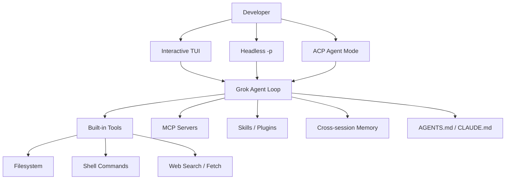

## 前言

在`AI`编程工具从“补全插件”演进到“终端智能体”的过程中，`Claude Code`、`Codex CLI`、`Gemini CLI`等产品已经把“在本地仓库里读代码、改文件、跑命令”变成了主流交互形态。`xAI`于`2026`年推出的`Grok Build`（日常口语中常称`Grok CLI`）正是这一赛道中的新成员：它把`Grok`模型能力封装成可在终端中完整落地的编程`Agent`，并强调对现有`AGENTS.md`、`Skills`、`MCP`、`Hooks`生态的兼容。

本文将围绕“日常主要使用`Grok CLI`”这一场景，说明`Grok`是什么、它与网页/`App`端`Grok`的差异，并展开安装更新、命令用法、`Grok 4.5`与`Composer 2.5`的模型选型、`Grok 4.5`的文本+图像多模态能力、配置体系、斜杠指令、`Skills`与记忆系统，最后与`Claude Code`做配置与记忆文件层面的对照，便于在两套工具之间切换或并行使用。

## 什么是Grok

### Grok产品谱系

“`Grok`”在不同上下文中可能指不同产品，理解边界有助于正确选型：

| 产品 | 说明 |
|------|------|
| **Grok（对话助手）** | 在`grok.com`、`X`应用等处使用的通用对话`AI`，偏聊天、搜索与内容生成 |
| **Grok模型（API）** | 通过`xAI API`调用的模型族（如`grok-4.5`），可嵌入自研`Agent`、`IDE`或业务系统；`grok-4.5`支持文本+图像输入，可用于图片识别、截图理解、设计稿分析等多模态任务 |
| **Grok Build / Grok CLI** | 面向软件工程的终端编程智能体，本文重点介绍；可执行文件名通常为`grok` |
| **Grok Desktop 等客户端** | 桌面侧体验入口，与终端`CLI`是不同的交互面 |

官方文档将编程侧产品正式命名为**Grok Build**：一个可扩展的编程`Agent`，既可交互式`TUI`使用，也可无头模式接入脚本/`CI`，还可通过`ACP`（`Agent Client Protocol`）被编辑器或其他应用托管。

### Grok Build的核心特点

`Grok Build`具备以下与“只聊天的`Grok`”明显不同的能力：

| 特点 | 说明 |
|------|------|
| **终端原生`Agent`循环** | 读取代码库、搜索、编辑文件、执行`Shell`、管理任务列表，形成闭环 |
| **丰富的`TUI`** | 全屏交互、滚动历史、内联`diff`、权限确认、鼠标与快捷键支持 |
| **Plan模式** | 复杂任务可先规划、审阅再执行，变更以清晰`diff`呈现 |
| **并行`Subagents`** | 可把探索、规划、实现等工作拆给子智能体并行处理 |
| **生态兼容** | 默认可读取`AGENTS.md`/`CLAUDE.md`、`.claude`/`.cursor`下的`Skills`/`Hooks`/`MCP`等 |
| **可扩展** | `MCP`服务器、插件市场、`Hooks`生命周期、自定义模型端点 |
| **无头与自动化** | `grok -p`输出纯文本/`JSON`/`streaming-json`，便于脚本与`CI` |
| **ACP集成** | `grok agent stdio`等模式对接`IDE`与自定义编排 |
| **多模态任务** | `Grok 4.5`可理解图片上下文；`/imagine`等入口可用于图片/视频生成 |
| **跨会话记忆** | 可选的实验性记忆系统，支持`/flush`、`/dream`、混合检索 |

架构上可以粗略理解为：



## Grok与Grok CLI的区别

日常交流里“`Grok`”与“`Grok CLI`”容易混用，可按下表区分：

| 维度 | Grok（对话产品 / 模型） | Grok CLI（Grok Build） |
|------|-------------------------|------------------------|
| **定位** | 通用助手 / 基础模型能力 | 本地仓库上的编程智能体 |
| **交互面** | 网页、`App`、部分桌面端 | 终端`TUI`、无头脚本、`ACP` |
| **能否改本地代码** | 通常不能直接操作系统文件 | 可读写本地文件、执行命令 |
| **项目上下文** | 依赖用户粘贴或上传 | 自动扫描仓库、规则文件与工具结果 |
| **扩展方式** | 插件/`API`因产品而异 | `MCP`、`Skills`、插件、`Hooks`、自定义模型 |
| **典型用户** | 泛用对话、搜索、创作 | 工程师日常开发、重构、排障、`CI`自动化 |
| **入口命令** | 浏览器访问`grok.com`等 | 安装后执行`grok` |

一句话概括：**Grok是能力与品牌；Grok CLI（Grok Build）是把该能力落到代码仓库上的工程化`Agent`工具。** 下文若无特别说明，“`Grok CLI`”均指`Grok Build`终端工具。

## 安装与更新

### 订阅与前置条件

官方早期`Beta`面向`SuperGrok`与`X Premium Plus`订阅用户开放。安装后首次启动通常会打开浏览器完成`grok.com`登录；无浏览器环境可使用`XAI_API_KEY`。

| 项 | 说明 |
|----|------|
| 操作系统 | `macOS`、`Linux`；`Windows`可用原生`PowerShell`安装脚本，或通过`Git Bash`/`WSL`使用`bash`脚本 |
| 终端 | 支持全屏/`alt-screen`的现代终端体验更佳 |
| 账号 | `SuperGrok` / `X Premium Plus`，或`console.x.ai`的`API Key` |

### 安装方法

**macOS / Linux / WSL（推荐）：**

```bash
curl -fsSL https://x.ai/cli/install.sh | bash
```

安装指定版本：

```bash
curl -fsSL https://x.ai/cli/install.sh | bash -s 0.1.42
```

**Windows PowerShell：**

```powershell
irm https://x.ai/cli/install.ps1 | iex
```

指定版本：

```powershell
$env:GROK_VERSION="0.1.42"; irm https://x.ai/cli/install.ps1 | iex
```

`PowerShell`安装器会把`%USERPROFILE%\.grok\bin`加入用户`PATH`。

验证安装：

```bash
grok --version
# 示例输出：grok 0.2.93 (...)
```

### 更新方式

```bash
# 检查并更新到最新
grok update

# 或重新执行安装脚本覆盖到最新
curl -fsSL https://x.ai/cli/install.sh | bash
```

配置中`[cli] auto_update = true`时，启动过程中也会检查更新。

### 登录与鉴权

```bash
# 交互登录（默认浏览器 OAuth）
grok login

# 无头/远程环境：设备码登录
grok login --device-auth

# 登出并清理本地凭证
grok logout
```

凭证默认写入`~/.grok/auth.json`，会自动刷新。`API Key`用法：

```bash
export XAI_API_KEY="xai-..."
grok
```

注意：若已存在有效会话令牌，会话令牌优先于`XAI_API_KEY`；需要强制走`API Key`时可先`grok logout`。

## 基础命令与使用

### 启动方式

```bash
# 进入项目后启动交互式 TUI
cd /path/to/your/project
grok

# 带初始提示启动
grok "解释这个代码库的架构"

# 指定工作目录
grok --cwd ~/projects/my-app

# 在新 git worktree 中启动（注意用 = 避免提示词被当成 worktree 名）
grok --worktree=feat "实现用户登录模块"
grok -w --ref main "从 main 基于实现功能"

# 全自动批准工具执行（谨慎使用）
grok --yolo
# 或
grok --always-approve

# 指定模型（当前常见：grok-4.5 / grok-composer-2.5-fast）
grok -m grok-4.5

# 追加会话级规则
grok --rules "始终使用 TypeScript；优先函数式组件"

# 启用跨会话记忆
grok --experimental-memory
```

### 会话管理

| 操作 | 命令 / 快捷键 |
|------|----------------|
| 继续当前目录最近会话 | `grok -c`或`grok --continue` |
| 恢复指定会话 | `grok --resume <session-id>` |
| 在`TUI`中恢复 | `/resume` |
| 新建会话 | `/new`或`Ctrl+N` |
| 查看上下文占用 | `/context`、`/session-info` |
| 压缩上下文 | `/compact` |

会话默认持久化在`~/.grok/sessions/`（按工作目录组织）。

### 常用CLI参数

| 参数 | 简写 | 说明 |
|------|------|------|
| `--model` | `-m` | 指定模型`ID` |
| `--continue` | `-c` | 继续最近会话 |
| `--resume` | `-r` | 恢复会话 |
| `--single` | `-p` | 无头单次提示并退出 |
| `--output-format` | | 无头输出：`plain`/`json`/`streaming-json` |
| `--always-approve` | | 自动批准全部工具（别名`--yolo`） |
| `--permission-mode` | | 权限模式，如`default`、`acceptEdits`、`auto`、`bypassPermissions`、`plan` |
| `--experimental-memory` | | 启用跨会话记忆 |
| `--no-memory` | | 强制关闭记忆（最高优先级） |
| `--no-subagents` | | 禁止派生子智能体 |
| `--worktree` | `-w` | 在新`git worktree`中启动 |
| `--rules` | | 向系统提示追加规则 |
| `--sandbox` | | 沙箱配置档（也可用`GROK_SANDBOX`） |
| `--cwd` | | 指定工作目录 |

### 交互式TUI要点

- **Scrollback**：展示用户消息、`Agent`回复、思考块、工具调用与任务列表
- **Prompt**：底部输入区；`Tab`在输入区与滚动区之间切换焦点
- **`@`引用文件**：`@src/main.rs`、`@src/main.rs:10-50`；`@!`可搜索被忽略/隐藏文件
- **权限**：默认对`Shell`与写文件等会询问；`Ctrl+O`可切换始终批准；也可`/always-approve`、`/auto`
- **取消当前轮次**：`Ctrl+C`

### 无头模式（脚本与CI）

```bash
# 纯文本输出
grok -p "Explain this codebase"

# JSON 输出，便于 jq 处理
grok -p "Review changes for bugs" --output-format json --yolo | jq -r '.text'

# 流式 NDJSON
grok -p "Explain the architecture" --output-format streaming-json
```

### 实用子命令示例

```bash
# 查看当前目录解析到的配置、规则、Skills、MCP 等
grok inspect
grok inspect --json

# 列出模型
grok models

# MCP 管理
grok mcp list
grok mcp add filesystem -- npx -y @modelcontextprotocol/server-filesystem /path/to/dir
grok mcp add --transport http sentry https://mcp.sentry.dev/mcp

# 记忆清理
grok memory clear --workspace
grok memory clear --all --yes

# 插件
grok plugin --help

# ACP：以 stdio 方式作为 Agent 服务
grok agent stdio

# Shell 补全
grok completions zsh
```

### 内置工具一览

| 工具 | 作用 |
|------|------|
| `read_file` / `search_replace` | 按行读取与精确编辑文件 |
| `grep` | 基于`ripgrep`的代码搜索 |
| `list_dir` | 列目录 |
| `run_terminal_command` | 执行`Shell`命令 |
| `web_search` / `web_fetch` | 联网搜索与抓取页面 |
| `todo_write` | 任务列表 |
| `spawn_subagent` | 并行子智能体 |
| `memory_search` / `memory_get` | 记忆检索（需开启记忆） |

## 模型选型：Grok 4.5与Composer 2.5

当前`Grok CLI`会话中，登录`grok.com`账号后常见可选模型为：

| 显示名 | 模型`ID`（`grok models`） | 角色定位 |
|--------|---------------------------|----------|
| **Grok 4.5** | `grok-4.5` | 当前默认模型；`xAI`面向编程与`Agent`任务的旗舰智能模型，同时支持文本+图像多模态输入 |
| **Composer 2.5** | `grok-composer-2.5-fast` | 集成在`Grok Build`中的高速编程模型，强调长任务执行与复杂指令遵循 |

可用`grok models`查看本机实际列表（订阅、区域与版本会影响可见模型）。官方说明：`Grok 4.5`是`Grok Build`的默认模型；`Composer 2.5`可通过`/model`菜单切换使用。涉及图片识别、截图分析、视觉稿评审时，应优先选择`Grok 4.5`；图片生成则通常通过`/imagine`或产品侧`Grok Imagine`能力完成，可先让`Grok 4.5`辅助整理提示词、约束与验收标准。

### 二者差异概览

二者不是“同一模型的两个别名”，而是不同体量与训练侧重的编程`Agent`模型：

| 维度 | Grok 4.5 | Composer 2.5 |
|------|----------|--------------|
| <span style={{whiteSpace: 'nowrap'}}><strong>来源定位</strong></span> | `xAI`最新旗舰，面向真实工程与`Agent`任务；与`Cursor`联合训练叙事相关 | 原`Cursor`生态中的高速编程模型，已接入`Grok Build` |
| **官方强调** | 复杂编码、`Agent`工作流、知识工作；工程评测与端到端交付能力强 | 速度快、适合长时运行任务，善于遵循复杂指令 |
| **多模态能力** | 支持文本+图像输入，适合图片识别、报错截图理解、`UI`截图审查、设计稿转需求等任务；图片生成可结合`/imagine`入口 | 主要定位高速编程执行，图片理解/生成任务优先交给`Grok 4.5`或专用生成入口 |
| **默认策略** | `Grok Build`默认模型（`default = "grok-4.5"`） | 需手动切换，适合作为“执行/冲刺”档 |
| **速度体感** | 官方称可达约`80 TPS`量级的快速服务，同时偏高质量推理 | 产品名中的`Fast`侧更突出低延迟、高吞吐交互 |
| **质量侧重** | 架构取舍、跨文件重构、疑难排障、长链推理通常更稳 | 机械性实现、按既定计划改代码、重复性工具循环更轻快 |
| **典型代价** | 单任务质量与步骤效率更高，但若滥用在琐碎改动上可能“过重” | 更省时、更适合高频小任务；复杂边界场景偶发需人审或回退到`Grok 4.5` |

> 说明：公开基准与社区体感会随版本变化；选型应以本仓库真实任务验收为准，而不是只看榜单。

### 如何选择

可按任务类型快速决策：

| 场景 | 更推荐 | 原因 |
|------|--------|------|
| **默认日常开发** | `Grok 4.5` | 官方默认；综合质量与工程能力更均衡 |
| **架构设计、跨模块重构、疑难`Bug`** | `Grok 4.5` | 需要更强推理与全局判断 |
| **`/plan`规划、代码评审、方案对比** | `Grok 4.5` | 规划质量直接影响后续改动成本 |
| **带图片的需求分析、报错截图、`UI`截图、设计稿理解** | `Grok 4.5` | 支持图像输入与视觉上下文理解，可把图片内容转成可执行的工程任务 |
| **图片生成、素材草图、封面图提示词迭代** | `Grok 4.5` + `/imagine` | `Grok 4.5`负责理解需求和生成提示词，`/imagine`或`Grok Imagine`负责出图 |
| **按已有计划批量改文件、补测试、修小问题** | `Composer 2.5` | 更快，适合执行向循环 |
| **长会话多轮工具调用（探索→改→跑测）** | `Composer 2.5`优先试，卡壳再切`Grok 4.5` | 官方强调长任务与指令遵循；失败时用旗舰兜底 |
| <span style={{whiteSpace: 'nowrap'}}><strong>`CI`/脚本化短任务、格式化、生成样板代码</strong></span> | `Composer 2.5` | 延迟与吞吐通常更友好 |
| **需要联网调研后综合决策再改代码** | `Grok 4.5` | 知识工作与工程判断更稳 |
| **子智能体`explore`大规模只读搜索** | 可用`Composer 2.5`或为`explore`单独指定轻模型 | 探索任务更吃速度与广度，主会话仍可用`Grok 4.5` |


## 配置文件详解

### 配置来源与优先级

配置按以下优先级合并（高者优先）：

1. **CLI标志**（如`--yolo`、`--model`、`--sandbox`）
2. **环境变量**（如`XAI_API_KEY`、`GROK_MEMORY`）
3. **`~/.grok/config.toml`**
4. **远程/托管设置**（企业`GrowthBook`等）
5. **内置默认值**

主要文件位置：

| 路径 | 说明 |
|------|------|
| `~/.grok/config.toml` | 主配置 |
| `~/.grok/pager.toml` | `TUI`外观与滚动行为 |
| `~/.grok/auth.json` | 登录凭证（自动管理） |
| `~/.grok/sessions/` | 会话持久化 |
| `~/.grok/memory/` | 跨会话记忆与索引 |
| `~/.grok/skills/` | 用户级`Skills` |
| `~/.grok/plugins/` | 用户级插件 |
| `~/.grok/agents/` | 用户级`Agent`定义 |
| `.grok/config.toml` | 项目级：`MCP`、插件、权限规则等 |
| `.grok/skills/`、`.grok/hooks/`、`.grok/agents/` | 项目级扩展 |

项目级`.grok/config.toml`主要贡献`[mcp_servers]`、`[plugins]`、`[permission]`；其它全局段仍以用户级`~/.grok/config.toml`为准。同名`MCP`服务器：项目配置整段覆盖用户配置。

### 常用config.toml片段

```toml
# ~/.grok/config.toml

[cli]
auto_update = true

[models]
default = "grok-4.5"                 # 旗舰默认；追求速度可改为 grok-composer-2.5-fast
web_search = "grok-4.20-multi-agent"

[ui]
simple_mode = true          # true=readline 输入；false=vim 式输入（实验）
vim_mode = false            # 滚动区是否启用 vim 导航键
show_thinking_blocks = true
group_tool_verbs = true
default_selected_permission = "always_allow_all_sessions"

[features]
telemetry = false
feedback = true
codebase_indexing = true
lsp_tools = false

[session]
auto_compact_threshold_percent = 85
load_envrc = true

[tools]
respect_gitignore = false   # true 时工具跳过 gitignored 文件
```

### 工具相关配置

```toml
[toolset.bash]
timeout_secs = 120.0
output_byte_limit = 20000

[toolset.ask_user_question]
timeout_enabled = true
timeout_secs = 1800

[toolset.web_fetch]
# proxy_endpoint = "https://proxy.example.com"
# allowed_domains = ["docs.rs", "x.ai"]
```

| 配置段 | 关键项 | 含义 |
|--------|--------|------|
| `[toolset.bash]` | `timeout_secs` | 前台命令超时（默认`120`秒） |
| `[toolset.bash]` | `output_byte_limit` | 捕获输出字节上限 |
| `[toolset.ask_user_question]` | `timeout_enabled` / `timeout_secs` | 向用户提问的等待策略 |
| `[tools]` | `respect_gitignore` | 是否全局尊重`.gitignore` |

也可用环境变量`GROK_RESPECT_GITIGNORE=1|0`覆盖`[tools] respect_gitignore`。

### MCP服务器配置

`stdio`本地进程：

```toml
[mcp_servers.github]
command = "npx"
args = ["-y", "@modelcontextprotocol/server-github"]
env = { GITHUB_PERSONAL_ACCESS_TOKEN = "ghp_xxx" }
enabled = true
startup_timeout_sec = 30
tool_timeout_sec = 6000
tool_timeouts = { create_issue = 120 }
```

`HTTP/SSE`远程：

```toml
[mcp_servers.my-streamable-server]
url = "https://mcp.example.com/api/mcp"
headers = { "x-mcp-session-id" = "{{session_id}}" }
```

`CLI`侧管理示例见上一节`grok mcp`。可用`MCP_TIMEOUT`（毫秒，兼容`Claude Code`命名）或`GROK_MCP_STARTUP_TIMEOUT_SECS`调整启动超时。

### 自定义模型

`Grok CLI`支持任意兼容`OpenAI`风格的端点，便于代理、企业网关或第三方模型：

```toml
[model.my-model]
model = "model-id"
base_url = "https://api.example.com/v1"
name = "Display Name"
description = "Optional"
api_key = "sk-..."
env_key = "OPENAI_API_KEY"
temperature = 0.7
top_p = 0.95
max_completion_tokens = 8192
context_window = 128000

[models]
default = "my-model"
```

凭证解析顺序：`api_key` > `env_key` > 已登录会话令牌 > `XAI_API_KEY`。

### 与Claude/Cursor的Harness兼容

默认会扫描`Claude`与`Cursor`的配置目录，降低迁移成本：

```toml
[compat.cursor]
skills = true
rules = true
agents = true
mcps = true
hooks = true

[compat.claude]
skills = true
rules = true
agents = true
mcps = true
hooks = true
```

关闭示例：`GROK_CLAUDE_SKILLS_ENABLED=false`。用`grok inspect`可查看兼容层实际加载了哪些条目。

### Skills路径配置

```toml
[skills]
paths = ["~/my-team-skills"]
ignore = ["~/my-team-skills/wip"]
# disabled = ["wip-skill"]
```

### 记忆系统配置（摘要）

```toml
[memory]
enabled = true

[memory.session]
save_on_end = true

[memory.watcher]
enabled = true

[memory.search]
max_results = 6
min_score = 0.35

[memory.initial_injection]
enabled = true
min_score = 0.0

[memory.embedding]
model = "embedding-beta-3-small"
dimensions = 1024

[memory.dream]
enabled = true
min_hours = 4
min_sessions = 3
```

记忆默认关闭，需`[memory] enabled = true`，或`--experimental-memory` / `GROK_MEMORY=1`。详见后文「记忆系统」。

### 子智能体配置

```toml
[subagents]
enabled = true

[subagents.toggle]
explore = true
plan = false

[subagents.models]
explore = "grok-composer-2.5-fast"   # 探索任务可走高速模型
```

内置子`Agent`类型包括`general-purpose`、`explore`（只读探索）、`plan`（规划不写代码）等。

### 关键环境变量

| 变量 | 作用 |
|------|------|
| `XAI_API_KEY` | `API`鉴权 |
| `GROK_HOME` | 覆盖配置根目录（默认`~/.grok`） |
| `GROK_MEMORY` | `1`启用 / `0`禁用记忆 |
| `GROK_SUBAGENTS` | 子智能体开关 |
| `GROK_SANDBOX` | 沙箱配置档 |
| `GROK_WEB_FETCH` | 网页抓取工具开关 |
| `GROK_AGENT` | 自定义`Agent`定义路径或名称 |
| `GROK_LOG_FILE` / `RUST_LOG` | 日志路径与级别 |
| `GROK_CLI_CHAT_PROXY_BASE_URL` | 覆盖聊天代理端点 |

### 项目规则：AGENTS.md

`Grok CLI`把项目指令写在`AGENTS.md`（及兼容的`CLAUDE.md`等）中，会话开始时注入：

| 位置 | 作用域 |
|------|--------|
| `~/.grok/AGENTS.md` | 全局用户规则 |
| `<repo-root>/AGENTS.md` | 仓库级 |
| `<cwd>/AGENTS.md` | 目录级（更深路径优先级更高） |

同目录可识别的文件名包括：`Agents.md`、`Claude.md`、`CLAUDE.md`、`CLAUDE.local.md`、`AGENT.md`、`AGENTS.md`。另会扫描`.grok/rules/`、以及兼容模式下的`.claude/rules/`、`.cursor/rules/`中的`*.md`。

示例：

```markdown
# Coding Standards

- Use TypeScript for all new code
- Prefer functional components with hooks
- Run `npm test` before committing
- Commit messages follow Conventional Commits
```

会话级临时规则：

```bash
grok --rules "Always use TypeScript. Prefer functional components."
```

## 斜杠指令

在`TUI`提示符输入`/`即可触发补全。来源包括：`Shell`内置、`Pager`内置、以及`user-invocable`的`Skills`。

### 会话与上下文

| 命令 | 说明 |
|------|------|
| `/new`（`/clear`） | 新会话 |
| `/resume` | 打开历史会话选择器 |
| `/compact [context]` | 压缩上下文，可指定需保留点 |
| `/context` | 上下文占用与统计 |
| `/session-info` | 会话详情 |
| `/sessions` | 切换/重命名/关闭活动会话 |
| `/fork` | 从当前点分叉新会话 |
| `/rewind` | 回退到更早轮次 |
| `/copy`、`/export` | 复制或导出对话 |
| `/rename`（`/title`） | 重命名会话 |
| `/quit`（`/exit`） | 退出 |
| `/home`（`/welcome`） | 返回欢迎页 |

### 模型与模式

| 命令 | 说明 |
|------|------|
| `/model <name>`（`/m`） | 切换模型，如`grok-4.5`、`grok-composer-2.5-fast`；推理模型可带`effort` |
| `/effort <level>` | `low`/`medium`/`high`/`xhigh` |
| `/always-approve` | 始终批准工具 |
| `/auto` | 分类器自动批准安全操作 |
| `/yolo` | `/always-approve`别名；`/yolo off`关闭 |
| `/plan` | 进入规划模式 |
| `/view-plan` | 查看当前计划 |
| `/multiline`（`/ml`） | 多行输入切换 |
| `/vim-mode` | 滚动区`vim`键位 |
| `/compact-mode` | 紧凑显示 |

### 记忆相关

需开启实验记忆；`/remember`始终可用。

| 命令 | 说明 |
|------|------|
| `/memory`（`/mem`） | 浏览/开关记忆 |
| `/flush` | 立刻用`LLM`总结并写入记忆 |
| `/dream` | 记忆整理合并 |
| `/remember <note>` | 手动记一条 |

### 扩展与其它

| 命令 | 说明 |
|------|------|
| `/hooks`、`/plugins`、`/marketplace`、`/skills` | 扩展管理模态框各页 |
| `/mcps` | `MCP`管理 |
| `/settings`（`/config`） | 设置面板 |
| `/import-claude` | 从`~/.claude`导入权限、环境变量、`MCP`、`Hooks`等 |
| `/config-agents`（`/agents`） | `Agent`定义管理 |
| `/personas` | 子智能体人格 |
| `/imagine`、`/imagine-video` | 图像/视频生成；可先用`Grok 4.5`分析需求、整理提示词，再通过生成入口出图或生成视频 |
| `/loop [interval] <prompt>` | 周期性执行提示（最短`60`秒，最长约`7`天自动过期） |
| `/goal` | 自主目标（功能开启时） |
| `/login`、`/logout`、`/usage`、`/privacy` | 账号与用量 |
| `/docs` | 内置指南与在线文档 |
| `/feedback` | 反馈 |
| `/btw` | 旁白式补充，不打断当前任务 |

`Skills`可作为斜杠命令调用，例如`/commit fix typo`。重名时用限定名：`/local:commit`、`/user:commit`。内置斜杠名优先于同名`Skill`。

## Skills技能系统

### 是什么

`Skill`是包含`SKILL.md`的目录，把可复用流程（提交流程、发版、代码审查清单等）固化为可自动触发或斜杠调用的指令包。比`AGENTS.md`更具体，比每次口头重说更稳定。

### 发现路径与优先级

| 位置 | 作用域 | 优先级 |
|------|--------|--------|
| `./.grok/skills/`、`./.grok/commands/` | 当前目录 | 最高 |
| `<repo>/.grok/skills/` | 仓库 | 高 |
| `~/.grok/skills/` | 用户 | 较低 |
| `.agents/skills/`（各层级） | 社区常见约定 | 随层级 |
| `.claude/skills/`、`.cursor/skills/` | 兼容层 | 可配置 |

同名`Skill`由高优先级覆盖低优先级。也可用`[skills].paths`追加扫描目录，用`ignore`/`disabled`排除。

### 创建与调用

```text
# TUI 中交互创建
/create-skill

# 调用
/commit fix the build
/local:commit
/user:commit
```

也可用自然语言触发：描述写得好时，`Agent`会自动匹配`Skill`。用`grok inspect`可查看已发现`Skills`及其来源（`project`/`user`/`plugin:...`）。

## 记忆系统

### 定位

跨会话记忆让新会话能回忆先前约定、排障路径与架构决策。该能力为**实验特性，默认关闭**。

启用方式：

```bash
grok --experimental-memory
export GROK_MEMORY=1
# 或 config.toml: [memory] enabled = true
```

强制关闭：`--no-memory`或`GROK_MEMORY=0`（`--no-memory`优先级最高）。会话内可用`/memory on|off`临时切换（不写回配置文件）。

### 存储布局

| 路径 | 作用域 |
|------|--------|
| `~/.grok/memory/MEMORY.md` | 全局偏好与跨项目事实 |
| `~/.grok/memory/<project-slug>-<hash8>/MEMORY.md` | 工作区/项目记忆 |
| `~/.grok/memory/<project-slug>-<hash8>/sessions/` | 会话摘要与日志 |
| 同目录`index`（`SQLite`） | `FTS5`全文 + 可选向量检索 |

工作区目录名附带仓库身份哈希（优先`origin`的`org/repo`），因此同一远程仓库的多个克隆/`worktree`会共享同一项目记忆目录。

### 写入与整理

| 机制 | 说明 |
|------|------|
| 会话结束自动保存 | 元数据摘要（主题、消息数等），不调`LLM`；琐碎会话会跳过 |
| `/flush` | `LLM`生成高信息密度摘要写入日志 |
| `/remember` | 人工写入一条；可确认后落盘 |
| 自然语言 “remember …” | 追加到全局或工作区`MEMORY.md` |
| `/dream` | 合并去重、整理主题；也可按`[memory.dream]`自动触发 |
| 直接编辑文件 | `watcher`会在下次检索前重建索引 |

### 读取与注入

- **首轮注入**：新会话第一轮自动检索相关记忆注入上下文（`[memory.initial_injection]`）
- **压缩后补回**：自动`compact`后会再搜记忆，降低上下文丢失
- **混合检索**：默认向量权重`0.7` + `BM25`权重`0.3`，`min_score`默认`0.35`
- **时间衰减**：会话记忆可按半衰期衰减；全局/工作区`MEMORY.md`不衰减

```bash
# CLI 清理
grok memory clear              # 默认工作区
grok memory clear --global
grok memory clear --all --yes
```

### 记忆配置参考表

| 键 | 默认 | 说明 |
|----|------|------|
| `memory.enabled` | `false` | 总开关 |
| `memory.session.save_on_end` | `true` | 结束时写元数据摘要 |
| `memory.watcher.enabled` | `true` | 监视外部编辑 |
| `memory.search.max_results` | `6` | 最大结果数 |
| `memory.search.min_score` | `0.35` | 最低相关性 |
| `memory.initial_injection.enabled` | `true` | 首轮注入 |
| `memory.dream.enabled` | `true` | 自动整理 |
| `memory.dream.min_hours` | `4` | 两次整理最小间隔小时 |
| `memory.dream.min_sessions` | `3` | 整理所需最少会话数 |

## 与Claude Code的对比

二者同属“终端编程`Agent`”范式，但厂商、默认文件约定与生态重心不同。以下从产品层与配置/记忆层对比。

### 产品与能力对照

| 维度 | Grok CLI（Grok Build） | Claude Code |
|------|------------------------|-------------|
| <span style={{whiteSpace: 'nowrap'}}><strong>厂商</strong></span> | `xAI` | `Anthropic` |
| <span style={{whiteSpace: 'nowrap'}}><strong>默认模型生态</strong></span> | 默认`grok-4.5`，支持文本+图像多模态输入；另有`Composer 2.5`（`grok-composer-2.5-fast`）等；可配自定义端点 | `Claude`系列（`Sonnet`/`Opus`等） |
| <span style={{whiteSpace: 'nowrap'}}><strong>订阅/计费入口</strong></span> | `SuperGrok` / `X Premium Plus` / `XAI_API_KEY` | `Claude`订阅或`API` |
| <span style={{whiteSpace: 'nowrap'}}><strong>项目指令主文件</strong></span> | `AGENTS.md`（兼容`CLAUDE.md`） | `CLAUDE.md` |
| <span style={{whiteSpace: 'nowrap'}}><strong>用户配置根目录</strong></span> | `~/.grok/` | `~/.claude/` |
| <span style={{whiteSpace: 'nowrap'}}><strong>主配置格式</strong></span> | `config.toml`（+`pager.toml`） | 多为`settings.json`等`JSON`系 |
| <span style={{whiteSpace: 'nowrap'}}><strong>Skills路径</strong></span> | `.grok/skills/`、`~/.grok/skills/`；兼容`.claude`/`.cursor`/`.agents` | `.claude/skills/`、`~/.claude/skills/` |
| <span style={{whiteSpace: 'nowrap'}}><strong>MCP配置</strong></span> | `config.toml`的`[mcp_servers.*]` | `~/.claude.json` / 项目设置等 |
| <span style={{whiteSpace: 'nowrap'}}><strong>Hooks</strong></span> | 支持；`/hooks`与`.grok/hooks/` | 成熟的`Hooks`体系 |
| <span style={{whiteSpace: 'nowrap'}}><strong>记忆</strong></span> | 实验性，默认关；`~/.grok/memory/` | `Auto Memory` + `CLAUDE.md`；`~/.claude/projects/.../memory/` |
| <span style={{whiteSpace: 'nowrap'}}><strong>并行子智能体</strong></span> | 一等公民`spawn_subagent` + 类型/人格 | `Subagents` / `Agent Teams`等 |
| <span style={{whiteSpace: 'nowrap'}}><strong>Plan模式</strong></span> | `/plan` | Plan Mode |
| <span style={{whiteSpace: 'nowrap'}}><strong>无头模式</strong></span> | `grok -p` | `claude -p`等 |
| <span style={{whiteSpace: 'nowrap'}}><strong>兼容策略</strong></span> | 主动读取`~/.claude`与`~/.cursor`（可关） | 以自身格式为主 |
| <span style={{whiteSpace: 'nowrap'}}><strong>迁移辅助</strong></span> | `/import-claude` | — |

### 记忆与规则文件对照

| 用途 | Grok CLI | Claude Code |
|------|----------|-------------|
| <span style={{whiteSpace: 'nowrap'}}><strong>项目级手写规则</strong></span> | `AGENTS.md`、`.grok/rules/*.md` | `CLAUDE.md`、`.claude/CLAUDE.md`、`.claude/rules/` |
| <span style={{whiteSpace: 'nowrap'}}><strong>用户级手写规则</strong></span> | `~/.grok/AGENTS.md` | `~/.claude/CLAUDE.md` |
| <span style={{whiteSpace: 'nowrap'}}><strong>本地不入库覆盖</strong></span> | 可用`CLAUDE.local.md`等（被`Grok`识别） | `CLAUDE.local.md` |
| <span style={{whiteSpace: 'nowrap'}}><strong>自动/跨会话记忆</strong></span> | `~/.grok/memory/**`（含`MEMORY.md`与会话日志） | `~/.claude/projects/<project>/memory/`等 |
| <span style={{whiteSpace: 'nowrap'}}><strong>首轮加载策略</strong></span> | 规则全量注入 + 可选记忆检索注入 | 规则加载 + `Auto Memory`前缀行数限制等 |
| <span style={{whiteSpace: 'nowrap'}}><strong>手动记一条</strong></span> | `/remember`、自然语言 remember | 依赖对话中“请记住”等与自动机制 |
| <span style={{whiteSpace: 'nowrap'}}><strong>整理压缩记忆</strong></span> | `/dream`、自动 dream | 产品内记忆整理策略（命名与交互不同） |

### 配置项与路径速查

| 类别 | Grok CLI | Claude Code |
|------|----------|-------------|
| <span style={{whiteSpace: 'nowrap'}}><strong>配置根</strong></span> | `~/.grok/` | `~/.claude/` |
| <span style={{whiteSpace: 'nowrap'}}><strong>主配置</strong></span> | `~/.grok/config.toml` | `~/.claude/settings.json`等 |
| <span style={{whiteSpace: 'nowrap'}}><strong>项目配置目录</strong></span> | `.grok/` | `.claude/` |
| <span style={{whiteSpace: 'nowrap'}}><strong>项目`MCP`</strong></span> | `.grok/config.toml` → `[mcp_servers]` | 项目/用户`MCP`设置 |
| <span style={{whiteSpace: 'nowrap'}}><strong>全局`Skills`</strong></span> | `~/.grok/skills/` | `~/.claude/skills/` |
| <span style={{whiteSpace: 'nowrap'}}><strong>项目`Skills`</strong></span> | `.grok/skills/` | `.claude/skills/` |
| <span style={{whiteSpace: 'nowrap'}}><strong>插件</strong></span> | `~/.grok/plugins/`、市场 | Plugins 体系（路径与市场不同） |
| <span style={{whiteSpace: 'nowrap'}}><strong>会话数据</strong></span> | `~/.grok/sessions/` | 项目下会话存储（布局不同） |
| <span style={{whiteSpace: 'nowrap'}}><strong>检查解析结果</strong></span> | `grok inspect` | 各`/status`、`/memory`等内置命令 |

## 总结

`Grok CLI`（官方产品名`Grok Build`）是`xAI`面向软件工程的终端编程智能体：它不是网页聊天机器人的简单套壳，而是具备工具循环、`Plan`、并行子智能体、`MCP`/`Skills`/插件扩展、无头自动化与`ACP`集成的完整`Agent`运行时。安装一条命令即可，配置中心在`~/.grok/config.toml`，项目约定以`AGENTS.md`为主并兼容`CLAUDE.md`。内置模型侧，默认以支持文本+图像多模态输入的`Grok 4.5`为旗舰，可处理图片识别、截图理解、视觉稿评审等任务；图片生成则可结合`/imagine`或`Grok Imagine`入口完成。`Composer 2.5`补齐高速执行场景，二者按任务切换通常比“锁死一个模型”更高效。

对已经使用`Claude Code`的开发者，最大的落地成本往往不在“会不会用`Agent`”，而在**文件约定与记忆存储的差异**：`CLAUDE.md`与`AGENTS.md`、`.claude/`与`.grok/`、两套`MEMORY`目录。好在`Grok CLI`默认兼容层与`/import-claude`降低了迁移摩擦。结合官方文档（[Grok Build Overview](https://docs.x.ai/build/overview)）与本地`~/.grok/docs/user-guide/`，即可按本文路径完成从安装到深度配置的完整上手。
