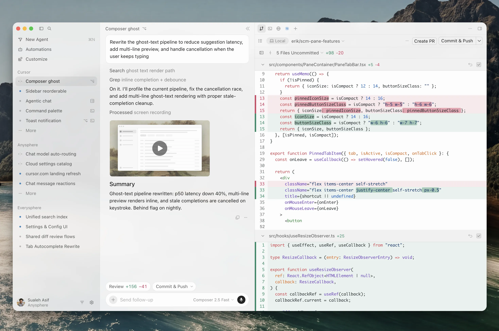

## 前言

`Cursor`已经从“带有代码补全的编辑器”发展为一套包含桌面`IDE`、终端`CLI`、云端`Agent`、插件市场和团队治理能力的`AI`开发平台。它的优势不只在模型选择，而在于把代码索引、文件编辑、终端、浏览器、`MCP`和`Git`工作流组合成一个可执行的智能体循环。




## `Cursor`是什么

### 产品定位

`Cursor`由`Anysphere`开发，基于`VS Code`技术栈深度定制。它保留了`VS Code`的大部分编辑器体验和扩展生态，同时把`AI`能力放在文件、代码搜索、终端和版本控制的核心路径上。

可以把`Cursor`理解为三层产品：

| 层次 | 入口 | 适合的任务 |
| :---: | --- | --- |
| **本地编辑器** | `Cursor IDE`、`Agent`、`Tab` | 需要实时查看代码、审阅差异和运行本地测试 |
| **本地终端** | `Cursor CLI`，命令名为`agent` | 终端工作流、脚本、`CI`和不想打开编辑器的场景 |
| **云端智能体** | `Cloud Agents`、`Agents Window`、`Projects` | 长时间任务、多个分支、后台执行和跨设备跟进 |

它与普通聊天窗口的区别是：模型不只生成文本，还可以根据权限调用搜索、读取文件、编辑文件、运行终端、操作浏览器和访问`MCP`服务器。每次调用的结果都会反馈给模型，形成“观察—计划—执行—验证”的循环。

### 核心能力

| 能力 | 作用 | 典型用法 |
| --- | --- | --- |
| `Tab`补全 | 预测下一段代码或下一次编辑 | 写函数、补全重复代码、接受局部重构建议 |
| `Agent` | 自主拆解任务并修改多个文件 | “为接口增加鉴权，并补齐测试” |
| `Ask`模式 | 只读分析，不修改文件 | 了解调用链、解释报错、评估重构风险 |
| `Plan`模式 | 先生成执行计划，再进入实现 | 大型迁移、跨模块改造、复杂需求澄清 |
| `Debug`模式 | 聚焦错误、日志和复现过程 | 修复测试失败、定位运行时异常 |
| 代码库索引 | 建立项目语义检索上下文 | 查找跨目录引用、理解陌生仓库 |
| 浏览器工具 | 打开页面、交互、截图和读取控制台 | 前端验收、回归测试、复现页面问题 |
| `MCP` | 连接外部工具与数据 | 数据库、设计工具、工单、文档和内部服务 |
| `Cloud Agents` | 在云端分支和机器上持续执行 | 创建`PR`、修复`Issue`、后台跑测试 |
| `Hooks` | 在`Agent`生命周期前后运行脚本 | 格式化、密钥扫描、限制危险命令 |

`Agent`不会自动获得整个仓库的全部内容。它会根据当前文件、代码索引、用户输入、规则和工具结果选择上下文。使用`@`可以显式附加文件、目录、终端输出、历史聊天或浏览器内容，减少模型猜测。

### `Agent`、`Composer`与`Tab`的关系

`Tab`是低延迟的内联补全，适合保持开发者的输入节奏；`Agent`是可以调用工具的任务执行者；`Composer`是面向多文件生成和编辑的工作界面或模型入口。三者可以使用不同模型和不同的上下文策略，不应把一次`Tab`补全与一次完整`Agent`请求等价计算。

## `Cursor CLI`

### 安装与启动

官方安装脚本会把`agent`命令安装到本地：

```bash
# macOS、Linux、WSL
curl https://cursor.com/install -fsS | bash

# Windows PowerShell
irm 'https://cursor.com/install?win32=true' | iex
```

在项目根目录启动交互式会话：

```bash
cd /path/to/project
agent
```

也可以在启动时直接给出任务：

```bash
agent "为订单接口增加幂等校验，并运行相关测试"
```

### 交互模式、打印模式和权限

`Cursor CLI`支持和编辑器相同的`Agent`、`Plan`、`Ask`模式：

```bash
agent --mode=plan "先分析迁移到 PostgreSQL 的步骤"
agent --mode=ask "解释这个仓库的认证流程"
```

脚本和`CI`使用打印模式（`print mode`）：

```bash
agent -p "检查当前 Git 改动中的安全问题" --output-format text
agent -p "修复失败的测试" --model "gpt-5"
```

执行涉及文件写入或终端命令的任务前，应配置权限和沙箱。项目级`cli.json`只允许配置权限，其他`CLI`设置放在全局配置中：

```text
~/.cursor/cli-config.json       # macOS、Linux
%USERPROFILE%\.cursor\cli-config.json  # Windows
<project>/.cursor/cli.json      # 项目级权限
```

一个最小配置示例：

```json
{
  "version": 1,
  "editor": {
    "vimMode": false
  },
  "permissions": {
    "allow": ["Shell(ls)", "Shell(git status)"],
    "deny": ["Shell(rm -rf *)"]
  },
  "sandbox": {
    "mode": "workspace-write",
    "networkAccess": "limited"
  },
  "approvalMode": "auto-review",
  "display": {
    "showLineNumbers": true,
    "showThinkingBlocks": false
  }
}
```

`allowlist`、`auto-review`和`unrestricted`分别代表白名单确认、自动审查和不限制确认。团队环境应优先使用最小权限，并把危险命令写入`deny`，不要用“全自动”替代代码审阅。

### `CLI`斜杠指令

在交互式`CLI`中输入`/`可以查看指令。常用指令如下：

| 指令 | 作用 |
| --- | --- |
| `/model [filter]` | 选择模型 |
| `/plan [prompt]` | 进入或查看`Plan`模式 |
| `/ask` | 切换只读`Ask`模式 |
| `/debug [prompt]` | 进入调试模式 |
| `/run-everything [on\|off\|status]` | 查看或切换自动运行权限；`/auto-run`是别名 |
| `/summarize` | 压缩当前对话上下文；`/compress`是别名 |
| `/fork` | 从当前会话分叉新会话 |
| `/resume` | 恢复历史会话 |
| `/clear`、`/new` | 开始新会话 |
| `/shell [command]` | 进入`Shell`模式；`/sh`和`/run`是别名 |
| `/mcp` | 查看或管理`MCP`服务器和工具 |
| `/config` | 交互式修改`CLI`配置 |
| `/sandbox` | 配置沙箱和网络访问 |
| `/about` | 查看版本、系统和账号信息 |
| `/quit`、`/exit` | 退出会话 |

`Cursor IDE`中的斜杠入口还包括内置和自定义`Skills`，例如`/create-rule`、`/create-skill`、`/review`、`/debug`。自定义工作流可以通过`Customize`页面、插件或`SKILL.md`提供，不要把编辑器中的技能指令和`CLI`的固定指令混为一谈。

## 配置体系总览

`Cursor`的配置可以按作用域分为用户级、项目级、团队级和云端运行时级。配置越靠近项目，越适合版本控制；配置越靠近用户，越适合个人偏好和密钥。

| 配置对象 | 用户级 | 项目级 | 团队或企业级 |
| --- | --- | --- | --- |
| <span style={{whiteSpace: 'nowrap'}}>`Agent`规则</span> | `Cursor Settings`中的`User Rules` | `.cursor/rules/*.mdc`或`AGENTS.md` | `Dashboard`中的`Team Rules` |
| `Skills` | `~/.cursor/skills/`、`~/.agents/skills/` | `.cursor/skills/`、`.agents/skills/` | 插件市场或团队市场 |
| `MCP` | `~/.cursor/mcp.json` | `.cursor/mcp.json` | `Team Marketplace`、企业策略 |
| `Hooks` | `~/.cursor/hooks.json` | `.cursor/hooks.json` | 团队和企业托管`Hooks` |
| `CLI` | `~/.cursor/cli-config.json` | `.cursor/cli.json`只配置权限 | 组织权限和模型策略 |
| 子`Agent` | 用户配置或插件 | `.cursor/agents/` | 团队插件 |

### 工具配置：`MCP`、`Hooks`与子`Agent`

#### `MCP`服务器

`MCP`把外部系统暴露为`Agent`可以按需调用的工具、提示词、资源和交互式应用。项目级配置放在`.cursor/mcp.json`，用户级配置放在`~/.cursor/mcp.json`。

```json
{
  "mcpServers": {
    "project-db": {
      "type": "stdio",
      "command": "npx",
      "args": ["-y", "@example/mcp-postgres"],
      "env": {
        "DATABASE_URL": "${env:DATABASE_URL}"
      }
    },
    "internal-docs": {
      "url": "https://docs.example.com/mcp",
      "headers": {
        "Authorization": "Bearer ${env:DOCS_TOKEN}"
      }
    }
  }
}
```

常见传输方式包括本地`stdio`、远程`SSE`和可流式传输的`HTTP`。不要把真实密钥写入仓库；使用环境变量插值，并在`MCP`服务器端限制可读写的资源。

#### `Hooks`

`Hooks`通过`.cursor/hooks.json`定义，在`preToolUse`、`postToolUse`、`beforeShellExecution`、`afterFileEdit`、`subagentStart`、`stop`等生命周期节点运行脚本。它们可以观察事件、阻止操作或注入上下文。

适合放在项目中的例子：

```json
{
  "version": 1,
  "hooks": {
    "afterFileEdit": [
      {
        "command": "./.cursor/hooks/format.sh"
      }
    ],
    "beforeShellExecution": [
      {
        "command": "./.cursor/hooks/check-dangerous-command.sh",
        "timeout": 30,
        "matcher": "rm -rf|curl|wget"
      }
    ]
  }
}
```

`Hooks`是治理层，不是提示词层。格式化、密钥检测和危险命令拦截适合使用`Hooks`；代码架构约束应写入`Rules`；领域知识和多步骤流程应封装为`Skills`。

#### 子`Agent`

内置的`Explore`、`Bash`和`Browser`子`Agent`会隔离高噪声输出。需要自定义角色时，可以在`.cursor/agents/`下创建`Markdown`文件：

```markdown
---
name: verifier
description: Verify completed changes, run focused tests, and report remaining risks.
---

You are a verification agent. Inspect the diff, run the smallest relevant checks,
and report evidence instead of rewriting the implementation.
```

子`Agent`文件应描述职责、可使用的工具和输出格式，不要把整个项目规范复制进去。共享规范应由`Rules`提供。

### `Rules`配置

#### 项目规则：`.cursor/rules/*.mdc`

项目规则是版本控制中的`Markdown`文件，扩展名必须是`.mdc`。普通的`.md`文件放在`.cursor/rules`中不会被规则系统识别，因为它没有规则元数据。

```text
.cursor/
├── rules/
│   ├── 00-project.mdc
│   ├── frontend.mdc
│   └── backend.mdc
└── mcp.json
```

一个按路径自动应用的规则：

```markdown
---
description: Frontend component conventions
globs: "src/components/**/*.{ts,tsx}"
alwaysApply: false
---

- Use named exports for components.
- Keep data fetching outside presentational components.
- Add a focused test for new interactive behavior.
```

规则的三个关键字段如下：

| 字段 | 含义 | 使用方式 |
| --- | --- | --- |
| `alwaysApply` | 是否每次会话都注入 | 项目总规范可以设为`true` |
| `globs` | 文件匹配模式 | 只对前端、后端或特定目录生效 |
| `description` | 给`Agent`的相关性描述 | 由`Agent`判断是否加载 |

如果三个字段都不产生自动匹配，规则可以在对话中使用`@rule-name`手动附加。规则内容应保持短小，把完整的参考手册放进`Skills`或项目文档，避免每次会话消耗大量上下文。

#### `AGENTS.md`

`AGENTS.md`是`.cursor/rules`的简单替代方案，适合跨工具共享一份目录级开发指引。可以在仓库根目录放置全局规范，也可以在子目录放置更具体的规则：

```markdown
# AGENTS.md

- Use pnpm for dependency management.
- Run `pnpm lint` and the focused test before opening a pull request.
- Never edit generated files under `dist/`.
```

需要路径匹配、手动触发和规则描述时，使用`.mdc`；需要让`Claude Code`、`Codex`、`GitHub Copilot`和`Cursor`共同读取时，优先使用`AGENTS.md`，或者在各工具目录中建立薄适配层。

#### 规则优先级

当前官方文档给出的合并顺序是：`Team Rules`→`Project Rules`→`User Rules`。所有适用规则会合并到模型上下文中，团队规则可以被管理员设为强制启用。规则冲突时，应减少不同层级的重复约束，并把可自动检查的要求交给`Linter`或`CI`。

### `Skills`配置

`Agent Skills`是一个开放标准。一个技能至少包含一个目录和其中的`SKILL.md`，还可以附带脚本、参考资料、模板和资源。

#### 路径

| 作用域 | 路径 | 说明 |
| --- | --- | --- |
| 项目级 | `.agents/skills/<name>/SKILL.md` | 跨工具共享，适合提交到仓库 |
| 项目级 | `.cursor/skills/<name>/SKILL.md` | `Cursor`专属项目技能 |
| 用户级 | `~/.agents/skills/<name>/SKILL.md` | 本地个人技能 |
| 用户级 | `~/.cursor/skills/<name>/SKILL.md` | `Cursor`个人技能，可同步到`Cloud Agents` |
| 兼容路径 | `.claude/skills/`、`.codex/skills/`及对应用户目录 | `Cursor`会读取其中的`SKILL.md` |

`Cursor`会递归发现项目中的技能目录，适合`monorepo`在不同子项目旁边放置专属技能。只有`~/.cursor/skills/`可以通过设置同步给`Cloud Agents`；本机的`.agents/skills`和`~/.agents/skills`不会自动上传。

#### `SKILL.md`示例

```markdown
---
name: release-check
description: Check release readiness, changelog, tests, and version metadata.
---

# Release check

1. Read the current version and changelog.
2. Run the focused tests and the production build.
3. Report failures with the exact command and output.

Use `scripts/check-release.sh` for the final validation.
```

技能的`name`和`description`会先以轻量信息被发现，完整内容在用户输入匹配或用户用`/技能名`调用时加载。这种“渐进式披露”让`Rules`承载稳定的静态上下文，`Skills`承载按需加载的流程和领域知识。

### 斜杠指令与自定义命令

`Cursor`当前把可调用的自定义能力集中在`Customize`页面，可以管理插件、`Rules`、`Skills`、子`Agent`、`Commands`、`MCP`和`Hooks`。内置命令包括：

| 命令 | 作用 |
| --- | --- |
| `/create-rule` | 生成带正确元数据的项目规则 |
| `/create-skill` | 生成`SKILL.md`及技能目录 |
| `/create-subagent` | 创建自定义子`Agent` |
| `/review` | 选择合适的代码审查`Agent` |
| `/shell` | 按字面执行一条`Shell`命令 |
| `/migrate-to-skills` | 将适合的旧规则或命令迁移为`Skills` |
| `/update-cli-config` | 修改`~/.cursor/cli-config.json` |
| `/statusline` | 配置`CLI`状态栏 |
| `/loop` | 按间隔重复执行提示词或技能 |

插件可以把命令、`Rules`、`Skills`、`Hooks`和`MCP`打包后分发。团队和企业计划可以使用团队市场；需要跨项目复用时，优先做成插件或标准`SKILL.md`，不要把一段很长的提示词散落在个人聊天记录里。

## `Cursor`的记忆系统

### 先区分“上下文”和“跨会话记忆”

模型的上下文是当前会话的工作记忆，包含用户消息、工具结果、文件内容和模型输出；它会受到上下文窗口限制。`/summarize`或`/compress`可以压缩当前对话，`/fork`和`/resume`可以管理会话分支和历史。

`Cursor`的官方配置重点不是一个叫`memory.md`的自动记忆文件，而是以下几层：

| 层次 | 机制 | 是否适合放入`Git` |
| --- | --- | --- |
| **稳定规范** | `AGENTS.md`、`.cursor/rules/*.mdc` | 是，项目规则应共享 |
| **动态能力** | `SKILL.md`及其脚本 | 是，项目技能应共享 |
| **外部上下文** | `MCP`资源和工具 | 配置可提交，密钥不可提交 |
| **会话历史** | `/resume`、`@Chats`、对话搜索 | 通常不提交 |
| **长期项目上下文** | `Projects`共享文件和研究产物 | 由云端项目管理 |

官方帮助文档说明，`Agent`可以搜索过去的对话；使用`@Chats`也能把历史聊天显式加入上下文。这个能力和`Claude Code`的`Auto Memory`不同：`Cursor`没有一个对开发者承诺稳定文件路径、由`Agent`自动维护的`~/.cursor/memory/`目录。需要可审阅、可迁移的知识时，应主动写入`Rules`、`Skills`或项目文档。

### 推荐的记忆分层

1. 把“永远适用”的内容写入根目录`AGENTS.md`，例如包管理器、测试入口和禁止操作。
2. 把“只对某类文件适用”的内容写入`.cursor/rules/*.mdc`，利用`globs`限制作用范围。
3. 把“需要步骤、脚本或参考资料”的内容写入`.agents/skills/<name>/SKILL.md`。
4. 把“会变化的事实”放在仓库文档或`MCP`数据源，不要写成永久规则。
5. 会话压缩后检查计划、未解决问题和测试证据，避免只依赖模型自动摘要。

## 价格、模型与请求次数

### 官方套餐

截至**2026年9月24日**，官方个人与团队价格如下。价格通常不含税，团队和企业可能按地区、合同及用量策略变化。

| 套餐 | 价格 | 主要内容 |
| --- | --- | --- |
| `Hobby` | 免费 | 不需要信用卡，有限的`Agent`请求，可使用`Composer` |
| `Pro` | `$20/月` | 扩展`Agent`用量、无限`Tab`补全、`MCP`、`Skills`、`Hooks`、`Cloud Agents` |
| `Pro Plus` | `$60/月` | 比`Pro`更高的模型用量，适合日常`Agent`用户 |
| `Ultra` | `$200/月` | 更高的模型用量，适合多`Agent`、自动化和重度用户 |
| `Teams` | `$40/用户/月` | 团队管理、共享内容、集中计费和`SSO`等 |
| `Enterprise` | 定制 | 共享用量池、发票/采购单、`SCIM`、模型和仓库访问控制 |

官方价格页还列出印度地区的`Start`计划（₹649/月，含税）。该计划只覆盖`Cursor Models`池，不包含第三方模型池，地区限定且不能作为其他地区的通用价格。

### 两个用量池

当前计费已经从旧的“每月固定请求数”转为按模型用量计费。`Pro`、`Pro Plus`和`Ultra`都包含两个独立池，每个结算周期重置：

| 用量池 | 包含模型 | 计费特点 |
| --- | --- | --- |
| `Cursor Models` | `Grok 4.7`、`Grok 4.6`、`Grok 4.5`、`Composer 2.5` | 官方提供更多包含用量 |
| `Other Models` | 直接选择的第三方模型 | 按所选模型的`API`价格消耗，可按需追加 |

`Teams`和`Enterprise`使用第三方模型时，还会按每百万`Token`加收`$0.25`的`Cursor Token Rate`。直接调用第一方`Grok`和`Composer`模型不收取这项附加费。不同模型的输入、缓存读写和输出价格不同，因此“一个请求”没有固定成本。

### 当前模型价格示例

官方模型价目以“每百万`Token`”为单位。下面列出与本文主题相关的示例，名称和价格可能随页面更新：

| 模型 | 输入 | 缓存写入 | 缓存读取 | 输出 |
| --- | ---: | ---: | ---: | ---: |
| `Claude Fable 5.1` | `$10` | `$12.5` | `$0.25` | `$50` |
| `Claude Opus 5.5` | `$4` | `$5` | `$0.2` | `$20` |
| `Claude Sonnet 5` | `$2` | `$2.5` | `$0.2` | `$10` |
| `GPT-5.6 Luna` | `$0.2` | `$0.25` | `$0.02` | `$1.2` |
| `Gemini 3.1 Pro` | `$2` | 不适用 | `$0.2` | `$12` |

用户常提到的`GPT-6`并不在上述官方页面列出的模型中；如果未来账户出现`GPT-6`，应以`Cursor`模型选择器和用量面板显示的实际价格计算。`Claude 5.5`也要区分具体型号，例如官方页面列出的是`Claude Opus 5.5`，不能把它和`Sonnet 5`按同一单价估算。

### Pro套餐能请求多少次

当前套餐没有官方承诺的固定请求次数。可以用下面的公式估算一次请求的模型成本：

```text
请求成本 = 输入 Token × 输入单价
         + 缓存写入 Token × 缓存写入单价
         + 缓存读取 Token × 缓存读取单价
         + 输出 Token × 输出单价
```

例如，假设一次请求包含`10,000`个输入`Token`和`2,000`个输出`Token`，忽略缓存：

| 模型 | 单次模型费估算 | 以`$20`模型预算折算的理论次数 |
| --- | ---: | ---: |
| `Claude Opus 5.5` | `$0.08` | 约`250`次 |
| `Claude Sonnet 5` | `$0.04` | 约`500`次 |
| `GPT-5.6 Luna` | `$0.0044` | 约`4,545`次 |

表格只是“假设有整整`$20`可用于该模型”的数学换算，不是`Pro`套餐的保证次数。实际会受到代码库上下文、工具调用、缓存命中、模型思考输出、并行`Agent`和`Cursor`内部用量池规则影响。一个包含几十个文件、运行多轮测试的`Agent`任务，可能消耗几十次简单聊天的用量。

实际选择建议：

- 只使用`Tab`和少量`Agent`的开发者，通常`Pro`足够入门。
- 每天使用`Agent`、经常跨文件修改的开发者，官方建议考虑`Pro Plus`。
- 同时运行多个`Agent`、`Cloud Agents`或自动化任务的开发者，再考虑`Ultra`或团队用量。
- 在设置中的用量面板观察两个池的剩余量；超过包含用量后，要么开启按需计费，要么升级套餐。

旧版`request-based`套餐可以按请求数统计，并支持`Max Mode`按`API`价格加成；它属于历史计费模型，不应拿旧文章中的“每月多少次”套用到当前套餐。

## 与`Claude Code`、`Codex`的区别

### 产品形态与工作重心

| 维度 | `Cursor` | `Claude Code` | `Codex` |
| :---: | --- | --- | --- |
| **产品形态** | `VS Code`系编辑器、`CLI`与`Cloud Agents` | 终端优先的代码`Agent`，也有桌面和编辑器集成 | `Codex CLI`、网页/桌面`Agent`及编辑器插件 |
| <span style={{whiteSpace: 'nowrap'}}><strong>默认工作面</strong></span> | 编辑器工作区、代码索引和差异视图 | 当前终端目录和`Shell`工作流 | 本地终端、沙箱和`AGENTS.md` |
| **模型来源** | `Cursor Models`、`OpenAI`、`Anthropic`、`Google`等 | 以`Anthropic`模型为主 | 以`OpenAI`模型为主，也可接入配置的第三方服务 |
| **并行方式** | `Agents Window`、`Cloud Agents`、`worktree`、子`Agent` | 子`Agent`、`worktree `、`Agent Teams` | 子任务、并行会话和沙箱；能力随客户端版本变化 |
| **远程执行** | `Cloud Agents`、`Projects` | 通过终端或托管环境扩展 | `Codex Web/Cloud`与本地`CLI`分开 |
| **最强场景** | 编辑器内多文件修改和视觉验收 | 终端自动化、复杂推理和可组合工作流 | 受控沙箱、脚本化执行和`OpenAI`生态 |

这不是简单的“谁更聪明”比较。`Cursor`把模型、编辑器和云端协作整合在一起；`Claude Code`更像可编排的终端工程师；`Codex`更强调沙箱、权限和`AGENTS.md`驱动的命令行执行。

### 配置文件和记忆文件对比

| 维度 | `Cursor` | <span style={{whiteSpace: 'nowrap'}}>`Claude Code`</span> | `Codex CLI` |
| --- | --- | --- | --- |
| <span style={{whiteSpace: 'nowrap'}}>项目级规则/记忆</span> | `.cursor/rules/*.mdc`、`AGENTS.md` | `CLAUDE.md`、<wbr/>`.claude/rules/` | `AGENTS.md`，支持父子目录逐级覆盖 |
| <span style={{whiteSpace: 'nowrap'}}>用户级规则/记忆</span> | `User Rules`、`~/.cursor/skills/` | `~/.claude/CLAUDE.md` | 通过用户目录下的`AGENTS.md`或配置 |
| <span style={{whiteSpace: 'nowrap'}}>`Skills`路径</span> | `.agents/skills/`、<wbr/>`.cursor/skills/` | `.claude/skills/`、`~/.claude/skills/` | `.agents/skills/`、`~/.codex/skills/` |
| <span style={{whiteSpace: 'nowrap'}}>自动记忆特点</span> | 官方重点是`Rules`、`Skills`、对话搜索和`Projects`，没有固定`Auto Memory`目录 | `Auto Memory`写入`~/.claude/projects/`<wbr/>`<project>/memory/` | 以`AGENTS.md`和会话/记忆功能为主，具体能力随`CLI`版本变化 |

如果一个仓库要同时服务三种工具，可以采用以下结构：

```text
project/
├── AGENTS.md                 # Cursor、Codex及其他兼容工具的共用规范
├── CLAUDE.md                 # Claude Code 专属补充说明
├── .cursor/
│   ├── rules/                # Cursor 的路径化规则
│   ├── skills/               # Cursor 项目技能
│   ├── mcp.json              # 项目 MCP
│   └── hooks.json            # Cursor Hooks
├── .claude/
│   ├── rules/                # Claude Code 模块化规则
│   └── skills/               # Claude Code 技能
└── .agents/
    └── skills/               # 跨工具 Agent Skills
```

不要把同一条规范复制到四五个文件后期待模型自动解决冲突。共用事实写入`AGENTS.md`，`Cursor`的路径匹配写入`.cursor/rules`，`Claude Code`的自动记忆交给`Auto Memory`，工具专属命令放在对应目录。

### 配置项差异

| 配置问题 | `Cursor` | `Claude Code` | `Codex` |
| --- | --- | --- | --- |
| 权限控制 | `cli-config.json`、`UI`设置、`Hooks`、沙箱 | `settings.json`、权限规则、`Hooks`、沙箱 | `config.toml`、`approval`、`sandbox`模式 |
| 外部工具 | `.cursor/mcp.json`、`Customize`、插件 | `.mcp.json`、`~/.claude.json`或`CLI`配置 | `config.toml`中的`MCP`配置 |
| 可复用命令 | `Customize`、`Plugins`、`Skills`、`CLI`斜杠指令 | `.claude/commands`和`Skills` | 内置斜杠指令、`Skills`和脚本 |
| <span style={{whiteSpace: 'nowrap'}}>生命周期扩展</span> | `.cursor/hooks.json` | `.claude/settings.json`中的`Hooks` | 以脚本、`MCP`和配置为主，`Hooks`能力取决于版本 |
| 上下文压缩 | `/summarize`、`/compress` | 自动压缩和上下文管理 | 自动摘要/记忆与会话控制 |
| 并行隔离 | `Agents Window`、`worktree`、子`Agent` | 子`Agent`、`worktree`、`Agent Teams` | 子任务、沙箱和会话并行 |

上表中的文件名是各工具当前常见的配置入口，不代表所有版本都支持同样的字段。升级工具后应先查看`/about`、`--help`或官方文档，再复制旧配置。


## 参考资料

- [Cursor 官方价格](https://cursor.com/pricing)
- [Cursor Models & Pricing](https://cursor.com/docs/models-and-pricing)
- [Cursor Agent](https://cursor.com/docs/agent/overview)
- [Cursor Agents Window](https://cursor.com/docs/agent/agents-window)
- [Cursor CLI](https://cursor.com/docs/cli/overview)
- [CLI 配置](https://cursor.com/docs/cli/reference/configuration)
- [CLI 斜杠指令](https://cursor.com/docs/cli/reference/slash-commands)
- [Rules](https://cursor.com/docs/rules)
- [Agent Skills](https://cursor.com/docs/skills)
- [MCP](https://cursor.com/docs/mcp)
- [Hooks](https://cursor.com/docs/hooks)
- [Customize Cursor](https://cursor.com/docs/customize-cursor)
- [Claude Code 使用指南](../100-Claude%20Code/1000-Claude-Code使用指南.md)
- [Codex CLI 使用指南](../300-Codex/1000-Codex-CLI使用指南.md)
- [主流 AI Coding 工具记忆文件与 Skills 路径指南](../4000-主流AI%20Coding工具记忆文件与Skills路径指南.md)
