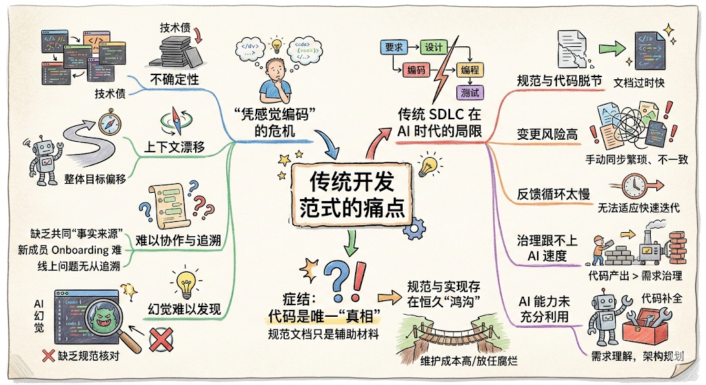
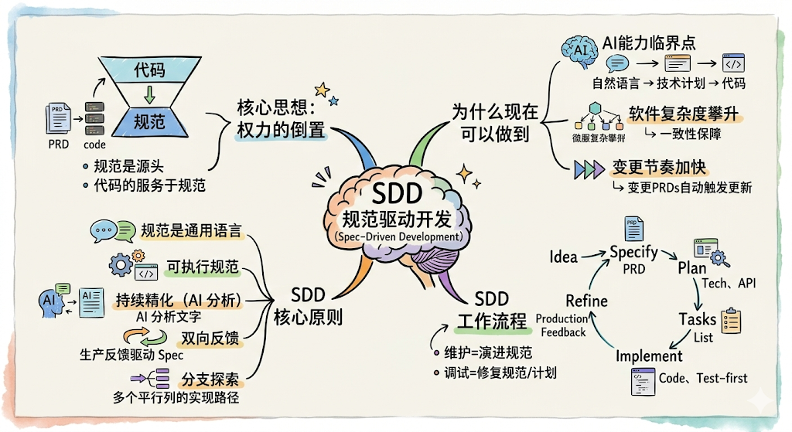
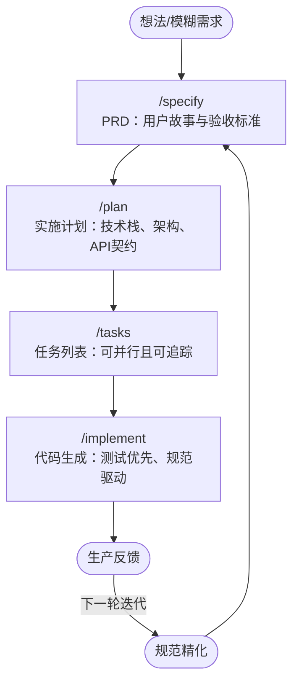

## 前言

`AI`编程工具的大规模普及，正在深刻改变软件开发的工作方式。在`Cursor`、`Claude Code`、`GitHub Copilot`等工具的加持下，开发者可以用自然语言描述需求，`AI`即可自动生成大量代码。这一变化令人兴奋，但也带来了新的困惑：代码越来越容易生成，但高质量、可维护的软件却越来越难以把控。

在这个背景下，一种新的软件开发方法论逐渐兴起——**规范驱动开发（Spec-Driven Development，SDD）**。

## 传统开发范式的痛点



### "凭感觉编码"的危机

`AI`编程工具普及后，一种被称为 **"Vibe Coding"**（随兴编码）的现象愈发普遍：开发者在没有清晰规范的情况下，凭借感觉或即兴的自然语言提示，直接让`AI`生成代码。这种方式在探索性的原型阶段或许无可厚非，但在构建真正的产品时，却会带来严重问题：

- **不可预测性**：每次对话生成的代码风格、架构不一致，积累的技术债难以偿还
- **上下文漂移**：随着对话轮次增加，`AI`对整体目标的理解不断偏移，导致实现越来越偏离最初意图
- **难以协作与追溯**：需求和技术决策只留存于碎片化的聊天记录中，团队缺乏共同的"事实来源"（`source of truth`）；新成员`Onboarding`只能翻记录猜测意图，线上出现问题时也无法追溯"当初为什么这样设计"
- **幻觉难以发现**：没有规范可供核对，根本无从判断`AI`的输出是否符合最初意图——幻觉的代码就这样悄无声息地进入了代码库

### 传统`SDLC`在`AI`时代的局限

传统的软件开发生命周期（`SDLC`，`Software Development Life Cycle`）将需求、设计、编码、测试视为严格串行的独立阶段。在`AI`工具介入后，这种刚性流程暴露出明显局限：

- **规范与代码脱节**：`PRD`、设计文档只是"指导代码"的材料，随着代码迭代，文档往往迅速过时
- **变更风险高**：需求发生变化时，需要手动在文档、设计和代码三处同步更新，稍有疏漏就会导致不一致
- **反馈循环太慢**：需求变更需要走完整的流程才能落地，无法适应现代产品快速迭代的节奏
- **治理机制跟不上`AI`速度**：`AI`大幅提速了代码产出，但需求变更的治理机制并没有同步跟上——代码产出越来越快，规范与实现之间的落差反而越来越大
- **`AI`能力未被充分利用**：让`AI`仅仅做"代码自动补全"，远未发挥其在需求理解、架构规划、一致性检查等方面的潜力

### 症结：代码是"真相"，规范却是"辅助"

这些问题背后有一个共同的根源：在传统范式中，**代码是唯一的"真相"（`source of truth`）**，规范文档只是生产代码的辅助材料，一旦代码写出来，文档就可以被抛弃。

这种权力结构决定了：规范与实现之间永远存在"鸿沟"，团队要么花大量精力维护文档来缩小这道鸿沟，要么干脆放任文档腐烂。无论哪种选择，代价都极为高昂。

## 什么是SDD规范驱动开发



### 核心思想：权力的倒置

**SDD（Spec-Driven Development）** 提出的答案是：**彻底颠覆这一权力结构**。

在`SDD`中，规范不再服务于代码——代码服务于规范。`PRD`不再是"指导实现"的参考文件，而是直接**生成实现的源头**。技术计划不再是"告知编码"的文档，而是**驱动代码生成的精确定义**。

正如`Spec-kit`项目所定义的：

> Specifications don't serve code—code serves specifications. The Product Requirements Document (PRD) isn't a guide for implementation; it's the source that generates implementation.

这不是对现有开发流程的增量改进，而是对软件开发驱动力的**根本性重构**。

### 为什么现在可以做到

`SDD`得以在今天落地，依赖于三个关键条件：

**第一，`AI`能力到达临界点。** 现代大语言模型（`LLM`）已经能够理解复杂的自然语言规范，并可靠地将其转化为结构化的技术计划和可执行代码。规范与实现之间的"鸿沟"第一次有望被技术手段彻底消除，而非只是缩小。

**第二，软件复杂度持续攀升。** 现代系统集成数十个服务、框架和依赖，手动维护所有模块与原始意图的一致性愈发困难。`SDD`通过以规范为核心驱动代码生成，提供了系统性的一致性保障机制。

**第三，变更节奏空前加快。** 今天的需求变更已经不再是"例外"，而是常态。`SDD`将需求变更从"障碍"转化为"正常工作流"——修改`PRD`中的核心需求，技术计划将自动标记受影响的决策；更新用户故事，对应的`API`端点将自动重新生成。

### SDD的核心原则

| 原则 | 含义 |
|------|------|
| **规范是通用语言** | 规范是首要制品，代码是其在特定语言和框架中的表达 |
| **可执行规范** | 规范必须足够精确、完整和无歧义，以直接生成可工作的系统 |
| **持续精化** | 一致性验证不是一次性门禁，而是`AI`持续分析规范中歧义、矛盾与遗漏的过程 |
| **研究驱动的上下文** | 研究代理全程收集技术选型、性能影响和组织约束等关键上下文 |
| **双向反馈** | 生产环境的指标与故障不只触发热修复，而是驱动规范的持续演进 |
| **分支探索** | 从同一规范生成多个实现方案，探索性能、可维护性、用户体验等不同优化路径 |

### SDD的工作流程

`SDD`的完整工作流可以概括为 **规范 → 计划 → 任务 → 实现** 四个阶段，但这四个阶段并非刚性串行，而是支持随时迭代：



在这个流程中，维护软件意味着**演进规范**，调试则意味着**修复生成了错误代码的规范或计划**。整个开发工作流围绕规范作为核心事实来源重新组织，技术计划和代码只是持续再生的输出物。

### 与传统方式的对比

以"构建一个实时聊天功能"为例：

**传统方式：**

```text
1. 编写PRD文档                     (2-3小时)
2. 创建设计文档                     (2-3小时)
3. 搭建项目结构                     (30分钟)
4. 编写技术规范                     (3-4小时)
5. 编写测试计划                     (2小时)
合计：约12小时的文档工作
```

**SDD方式：**

```bash
# 第1步：创建功能规范（5分钟）
/specify 实时聊天系统，支持消息历史记录与用户在线状态

# 第2步：生成实现计划（5分钟）
/plan 使用WebSocket实现实时消息推送，PostgreSQL存储历史消息，Redis管理用户在线状态

# 第3步：生成可执行任务列表（5分钟）
/tasks

# 合计：约15分钟，产出：
# - spec.md（用户故事与验收标准）
# - plan.md（技术选型与方案说明）
# - data-model.md、contracts/、research.md
# - tasks.md（可并行的任务列表）
```

同样的产物，从12小时压缩到15分钟——而且质量更加一致、可追溯。

## SDD相关工具

在目前开源实践中，有多个团队推出了支持`SDD`方法论的工具，其中最具代表性的三款是`OpenSpec`、`Spec-kit`和`Superpowers`。它们都以结构化规范和工程化流程为核心，解决`AI`编程中的上下文漂移与质量失控问题，但在设计哲学、触发机制和适用场景上各有侧重。

### OpenSpec

`OpenSpec`（[GitHub](https://github.com/Fission-AI/OpenSpec)）是由`Fission AI`开发的轻量级`SDD`工具，核心理念是"流动而非刚性（`fluid not rigid`）"。它通过`/opsx:*`系列斜杠命令驱动规范→实现流程，以`openspec/specs/`与`openspec/changes/`双区域设计管理系统规范和变更，支持`20+`种主流`AI`编程工具。其工作流程为：`/opsx:explore`（探索）→`/opsx:propose`（提案）→`/opsx:apply`（实现）→`/opsx:archive`（归档），所有阶段均需手动触发。

详细介绍与实战演示请参阅：[OpenSpec：轻量级AI工程规范管理框架](./2000-OpenSpec：轻量级AI工程规范管理框架.md)。

### Spec-kit

`Spec-kit`（[GitHub](https://github.com/github/spec-kit)）是由`GitHub`官方开发的`SDD`工具套件，更注重**结构化**与**完备性**。其最具特色的机制是**项目宪法（`constitution.md`）**——一组不可变的架构原则，约束所有后续规划和实现的技术决策。工作流程为：`/speckit.constitution`→`/speckit.specify`→`/speckit.plan`→`/speckit.tasks`→`/speckit.implement`，每个阶段均需手动触发，并在代码生成前设有预实现门禁（`Phase -1 Gates`）确保质量。支持`Claude Code`、`GitHub Copilot`、`Cursor`等`8+`种`AI`助手。

详细介绍与实战演示请参阅：[Spec-kit：SDD规范驱动开发的工程化工具](./3000-Spec-kit：SDD规范驱动开发的工程化工具.md)。

### Superpowers

`Superpowers`（[GitHub](https://github.com/obra/superpowers)）是一个开源的`AI`工程化技能框架，从**工程行为约束**出发，核心理念是**`Process over Prompt`（流程大于提示）**。与前两款工具的最大区别在于触发机制：`Superpowers`无需手动调用任何命令——只要有1%的可能某个技能适用，智能体就会**自动触发**对应技能。其工作流涵盖：头脑风暴设计（`brainstorming`）→`Git`工作树隔离→编写实现计划（`writing-plans`）→子智能体执行（`subagent-driven-development`）→测试驱动开发（`test-driven-development`）→验证收尾（`verification-before-completion`）。目前暂不支持`VSCode GitHub Copilot`。

详细介绍与实战演示请参阅：[Superpowers：为AI编程智能体赋予工程化超能力](./4000-Superpowers：为AI编程智能体赋予工程化超能力.md)。

### 三款工具综合对比

三款工具都以结构化规范和工程化流程为核心，执行流程上也高度一致——都经历需求澄清、规划设计、实现驱动、验证反馈这四个阶段，也都通过工件驱动`AI`从需求到实现的过程。差异主要体现在设计理念、触发机制和适用场景：

| 维度 | `OpenSpec` | `Spec-kit` | `Superpowers` |
|------|-----------|-----------|--------------|
| **定位** | 轻量规范层，低仪式感 | 结构化工具包，强约束 | 工程技能框架，行为约束 |
| **核心理念** | `fluid not rigid` | 宪法治理 + 门禁约束 | `Process over Prompt` |
| **触发方式** | 手动斜杠命令 | 手动斜杠命令 | **自动触发技能** |
| **安装方式** | `npm`全局安装 | `uv`安装`Python`包 | 插件 / `git`克隆 |
| **支持工具** | `20+`种 | `8+`种 | `Claude Code`/`Cursor`等 |
| **核心制品** | `proposal`/`delta specs`/`tasks` | `constitution`/`spec`/`plan`/`tasks` | 技能文件（`SKILL.md`） |
| **阶段门禁** | 无刚性门禁，随时迭代 | 有明确门禁阶段 | 技能触发机制约束 |
| **`TDD`内置** | ❌ | ⚠️（约束检查） | ✅（完整`TDD`循环） |
| **并行任务** | 无内置并行 | `[P]`标记支持 | 子智能体并行执行 |
| **存量项目** | ✅ 原生支持 | ✅ 支持 | ✅ 支持 |
| **社区背景** | `Fission AI` | `GitHub`官方 | 开源社区 |
| **命令风格** | `/opsx:*` | `/speckit.*` | 无命令，自动触发 |

## 工具选型建议

三款工具各有侧重，适合不同需求的团队和项目。以下决策框架帮助开发者根据实际情况做出选择。

### 选择OpenSpec

如果你的项目符合以下特征，`OpenSpec`是优先推荐的选择：

- **灵活性优先**：不希望引入复杂的规范流程，工作流需要足够流动，随时可以迭代
- **多`AI`工具混用**：团队成员使用不同的`AI`助手，需要一个统一的、工具无关的规范层
- **存量项目优先**：在已有代码库上增量引入`SDD`，`OpenSpec`的双区域设计（`specs/` + `changes/`）对存量项目尤为友好
- **低上手成本**：希望快速试用`SDD`方法论，`/opsx:propose`一条命令即可启动规范化流程，门槛最低

### 选择Spec-kit

如果你的项目符合以下特征，`Spec-kit`是优先推荐的选择：

- **架构一致性要求高**：需要通过"宪法"文件约束所有技术决策，防止多轮迭代后架构腐化
- **质量门控需求强**：希望在代码生成前有明确的质量检查（宪法门禁、规范完整性验证等）
- **完整制品体系**：希望每个特性都有正式的`spec`、`plan`、`data-model`、`contracts`等完整文档
- **团队协作**：`spec.md`和`plan.md`可天然作为需求评审和`Code Review`的基准文档，适合跨职能团队

### 选择Superpowers

如果你的项目符合以下特征，`Superpowers`是优先推荐的选择：

- **不想手动管理工作流**：希望`AI`自动判断并应用工程实践，而不是每次都手动调用阶段命令
- **`TDD`是团队规范**：`Superpowers`是三款工具中对`TDD`支持最完善的，强制执行红绿重构循环
- **复杂任务并行化**：需要多个子智能体并行执行独立任务，且每个任务有独立的质量评审
- **关注工程行为而非文档**：更关注`AI`的开发行为是否符合工程规范，而非维护一套规范文档体系
- **主要使用`Claude Code`或`Cursor`**：`Superpowers`在这两个平台上支持最为完善

> 注意：`Superpowers`目前暂不支持`VSCode GitHub Copilot`，这是选择时需要考虑的约束。

### 决策参考

```text
是否希望AI自动触发工作流（无需手动调用命令）？
├── 是 → Superpowers
└── 否
    ├── 是否需要严格架构约束（宪法机制）和质量门禁？
    │   ├── 是 → Spec-kit
    │   └── 否 → OpenSpec（轻量灵活，20+种AI工具支持）
    └── TDD是否是不可妥协的团队规范？
        ├── 是 → Superpowers 或 Spec-kit
        └── 否 → OpenSpec
```

三款工具并非互斥。部分团队会将`Spec-kit`（或`OpenSpec`）的规范文档与`Superpowers`的工程技能结合使用——前者负责"说清楚要做什么"，后者负责"保证做的过程符合工程规范"。

## 总结

进入`AI`时代，软件开发的核心矛盾已经从"如何快速生成代码"转变为"如何在快速生成代码的同时保证质量与可维护性"。`SDD`（规范驱动开发）通过将规范提升为软件系统唯一的"事实来源"，让代码成为规范的自动化表达，从根本上解决了传统开发中规范与实现长期脱节的顽疾。

`OpenSpec`、`Spec-kit`与`Superpowers`作为`SDD`方法论的三款主流落地工具，分别代表了轻量灵活、严格结构、行为约束三种不同的工程化风格，为不同需求的团队和项目提供了可操作的选择。三款工具的核心执行流程高度一致：需求澄清 → 规划设计 → 实现驱动 → 验证反馈，区别在于工件粒度、门禁严格程度，以及触发机制是手动命令还是自动感知。

无论选择哪款工具，`SDD`的核心理念是一致的：**先对齐，再构建（agree before you build）**。在`AI`能够将高质量规范直接转化为可工作代码的今天，一份清晰、精确的规范，正是从"随兴编码"迈向"可预测工程"的关键一步。

## 参考资料

- [OpenSpec GitHub 仓库](https://github.com/Fission-AI/OpenSpec)
- [Spec-kit GitHub 仓库](https://github.com/github/spec-kit)
- [Superpowers GitHub 仓库](https://github.com/obra/superpowers)
- [有赞AI研发全流程落地实践](https://juejin.cn/post/7592094358658138146)

