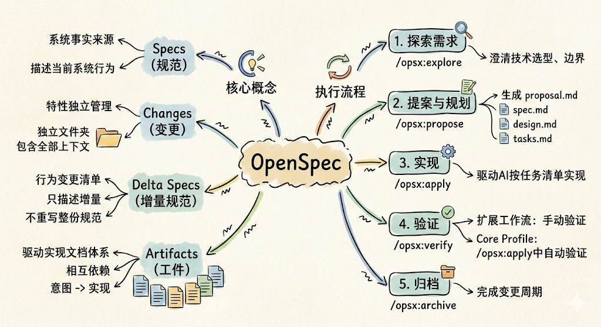
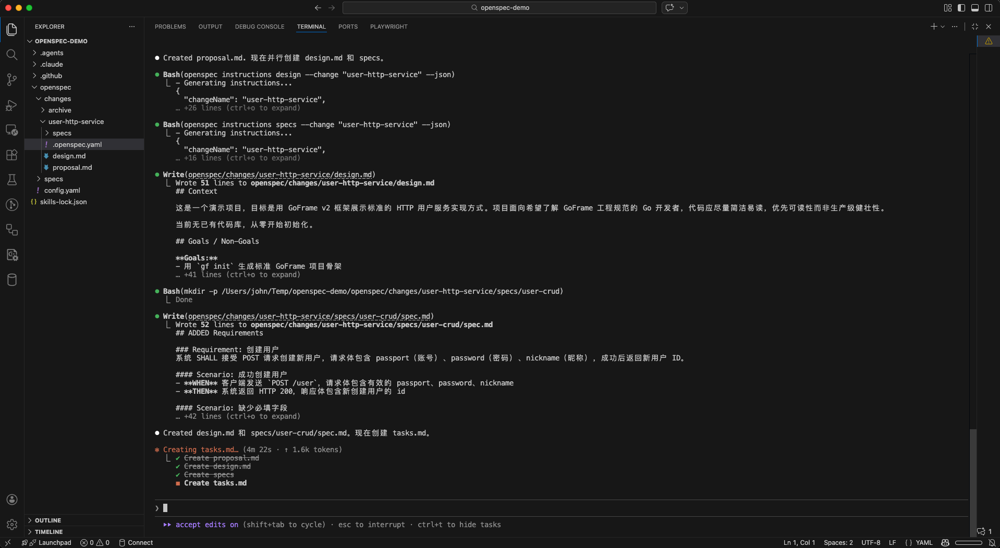
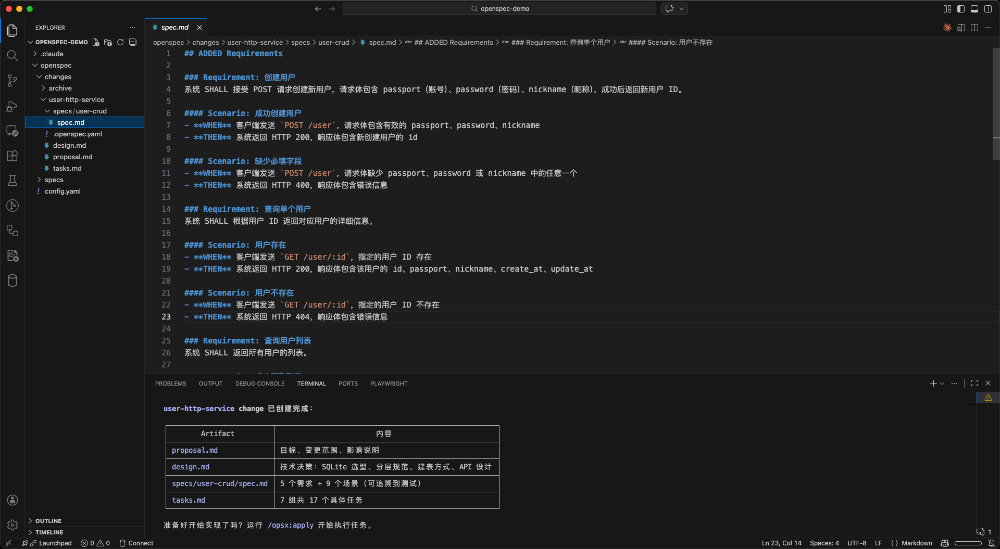
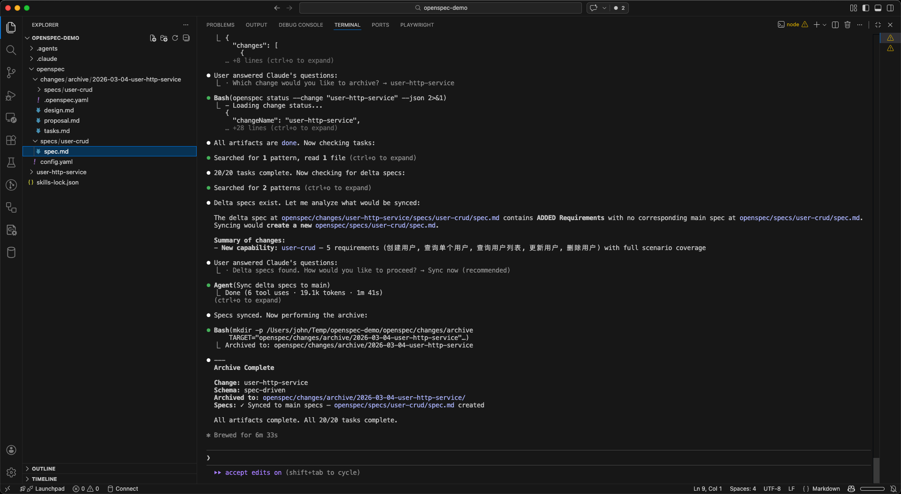

## 前言

在[《SDD规范驱动开发：AI时代的软件工程新范式》](./1000-SDD规范驱动开发：AI时代的软件工程新范式.md)一文中，我们详细介绍了`SDD`（`Spec-Driven Development`，规范驱动开发）的设计思想：以规范为核心驱动代码生成，在编写任何代码之前先让人与`AI`达成明确共识，从根本上解决`AI`编程中的上下文漂移、决策不透明、知识无法沉淀等工程痛点。

**`OpenSpec`** 是一款将`SDD`方法论工程化落地的开源工具。它不是另一套复杂的项目管理系统，而是一个轻量级的规范层：通过简洁的目录结构和斜杠命令，将每次特性开发组织为包含提案、规范、设计、任务清单的结构化变更单元，配合`20+`种主流`AI`助手开箱即用，帮助开发者在保持工程纪律的同时不增加额外的流程负担。

## 什么是OpenSpec



`OpenSpec`的官方定义是：

> **The most loved spec framework.**

其设计哲学可以概括为五条原则：

```text
→ fluid not rigid         (流动而非刚性)
→ iterative not waterfall (迭代而非瀑布)
→ easy not complex        (简单而非复杂)
→ built for brownfield    (面向存量系统而非只支持新项目)
→ scalable                (从个人项目到企业级均可适用)
```

`OpenSpec`通过在项目中引入一个`openspec/`目录，将每次特性开发或变更组织为包含提案、规范、设计、任务清单的结构化文件夹。配合`AI`助手的斜杠命令，开发者可以在几秒内启动一次规范化的变更流程，而不是直接让`AI`开始写代码。

### 与同类工具的对比

| 工具 | 定位 | 核心差异 |
|---|---|---|
| `OpenSpec` | 轻量级规范层，多工具支持 | 流程灵活、支持`20+`种`AI`助手、开箱即用 |
| `Spec-kit`（GitHub） | 重量级`SDD`工具包 | 功能完整但流程较重，需要更多配置 |
| `Kiro`（AWS） | 专属`IDE`集成 | 功能强大但锁定`IDE`和`Claude`模型 |
| 无规范 | 直接`Vibe Coding` | 快速启动但结果不可预测 |

## 核心概念

理解`OpenSpec`的工作原理，需要掌握以下几个核心概念。

### Specs（规范，系统的事实来源）

`specs/`目录是**整个项目**的"行为事实来源"（`source of truth`），描述系统当前的行为方式。它按领域组织：

```text
openspec/specs/
├── auth/
│   └── spec.md       # Authentication behavior
├── payments/
│   └── spec.md       # Payment processing
└── ui/
    └── spec.md       # UI behavior
```

规范文件采用结构化的需求格式，使用`SHALL`/`MUST`/`SHOULD`等`RFC 2119`关键字表达需求强度，并通过`Given/When/Then`场景使需求可验证。

### Changes（变更，每个特性独立管理）

每一次特性开发或变更都对应`changes/`下的一个独立文件夹，包含该变更所需的全部上下文信息：

```text
openspec/changes/add-dark-mode/
├── proposal.md        # Why and what
├── design.md          # How (technical approach)
├── tasks.md           # Implementation checklist
└── specs/             # Delta specs (what's changing)
    └── user-http-service/
        └── spec.md
```

这种"变更即文件夹"的设计带来了几个工程优势：多个变更可以并行进行而不互相污染；归档后的变更保留完整上下文，支持历史追溯；变更文件夹也是天然的代码审查单元。

### Delta Specs（增量规范）

想象一下，你和一个工程师对接需求时，不会让他读完整个系统文档，而是直接告诉他"这次迭代新增了什么、改了什么、去掉了什么"。增量规范的作用就是这样——它是每次变更专属的**行为变更清单**，存放在变更文件夹的`specs/<domain>/spec.md`中，只描述本次变更对系统行为的增量影响，而非重写整份规范。

增量规范使用三个标记描述变更类型：

- `ADDED`：本次新增的行为需求
- `MODIFIED`：本次修改的既有行为（标注旧值）
- `REMOVED`：本次移除的行为（标注移除原因）

每条需求以`Given/When/Then`场景格式表达，确保需求是可验证的而非模糊的描述。以用户服务为例：

```markdown
## ADDED Requirements

### Requirement: Create User
The system SHALL create a new user record when provided with valid registration data.

#### Scenario: Successful user creation
- WHEN a POST request is sent to /api/v1/users with valid username, email and password
- THEN the system SHALL return HTTP 200 with the new user's id
- AND the user record SHALL be persisted in the database

#### Scenario: Duplicate email
- WHEN a POST request is sent with an email already in use
- THEN the system SHALL return HTTP 400
```

增量规范在工作流中扮演"行为合同"的角色，贯穿整个变更生命周期的三个环节：

1. **驱动实现**：`/opsx:apply`执行时，`AI`以增量规范为基准，确保生成的代码满足每条场景定义的行为约束
2. **驱动验证**：`/opsx:verify`执行时，`AI`逐条核查代码实现是否与增量规范中的`Given/When/Then`场景一致
3. **沉淀为永久规范**：`/opsx:archive`执行时，`ADDED`需求追加到主规范，`MODIFIED`需求替换旧版本，`REMOVED`需求从主规范中移除，确保`openspec/specs/`始终反映系统的当前行为

这种设计的核心价值在于：`AI`不是凭感觉猜测你想要什么，而是按照明确的行为合同来实现和验证——需求、实现、验证三者形成闭环。

### Artifacts（工件，驱动实现的文档体系）

变更文件夹中的文档（工件）构成了一个相互依赖的信息体系，引导`AI`从意图到实现：

```text
proposal ──► specs ──► design ──► tasks ──► implement
  (why)      (what)    (how)     (steps)
```

| 工件 | 文件 | 作用 |
|---|---|---|
| 提案 | `proposal.md` | 记录变更动机、范围边界、整体思路 |
| 增量规范 | `specs/<domain>/spec.md` | 描述行为层面的变化（不涉及实现细节） |
| 设计 | `design.md` | 技术方案、架构决策、数据流设计 |
| 任务清单 | `tasks.md` | 具体实现步骤，支持逐条执行和验证 |

## 支持的AI工具

`OpenSpec`支持`20+`种主流`AI`编程助手，通过`openspec init`即可自动为所选工具生成对应的斜杠命令文件：

| AI助手 | 命令文件路径 |
|---|---|
| `Claude Code` | `.claude/commands/opsx/<id>.md` |
| `GitHub Copilot` | `.github/prompts/opsx-<id>.prompt.md` |
| `Cursor` | `.cursor/commands/opsx-<id>.md` |
| `Windsurf` | `.windsurf/workflows/opsx-<id>.md` |
| `Gemini CLI` | `.gemini/commands/opsx/<id>.toml` |
| `Amazon Q` | `.amazonq/prompts/opsx-<id>.md` |
| `Continue` | `.continue/prompts/opsx-<id>.prompt` |
| `Qwen Code` | `.qwen/commands/opsx-<id>.toml` |

## 核心工作流命令

`OpenSpec`通过 **`Profile`（配置模式）** 控制安装哪些斜杠命令，共有两种`Profile`。

:::warning 注意
由于不同`AI`工具对斜杠命令的命名规范有所差异，在`VSCode Github Copilot`中的斜杠命令名称与`Claude Code`下的略有不同。

:::

### 默认快捷路径（core profile）

`openspec init`默认安装`core profile`，只生成以下`4`个命令，适合大多数日常开发场景：

```text
/opsx:explore ──► /opsx:propose ──► /opsx:apply ──► /opsx:archive
```

| 命令 | 作用 |
|---|---|
| `/opsx:explore [topic]` | 探索性思考，不创建变更文件夹 |
| `/opsx:propose <name>` | 一步生成变更文件夹及全部规划工件 |
| `/opsx:apply` | 按`tasks.md`逐条实现 |
| `/opsx:archive` | 归档变更，合并增量规范到主规范 |

### 扩展工作流（expanded profile）

如需更细粒度的控制，可以切换到`custom profile`，从全部`11`个命令中按需选择安装：

```bash
# 切换到 custom profile 后重新初始化
openspec config profile custom
openspec init
```

`custom profile`在`core`的基础上新增了以下命令：

```text
/opsx:new ──► /opsx:ff (或 /opsx:continue) ──► /opsx:apply ──► /opsx:verify ──► /opsx:archive
```

| 命令 | 作用 |
|---|---|
| `/opsx:new <name>` | 创建变更文件夹脚手架（不自动生成工件内容） |
| `/opsx:continue` | 按依赖关系逐步生成下一个工件 |
| `/opsx:ff` | 快进：一次性生成所有规划工件 |
| `/opsx:verify` | 验证实现是否与增量规范一致 |
| `/opsx:sync` | 将增量规范合并到主规范（不归档变更文件夹） |
| `/opsx:bulk-archive` | 批量归档多个已完成的变更 |
| `/opsx:onboard` | 交互式教程，引导完整工作流 |

`Profile`配置保存在全局配置`~/.config/openspec/config.json`中，切换后执行`openspec init`即可重新生成对应的斜杠命令文件。

## 安装与初始化

### 安装OpenSpec CLI

`OpenSpec`通过`npm`发布，需要`Node.js 20.19.0`或更高版本：

```bash
# 全局安装
npm install -g @fission-ai/openspec@latest

# 也支持 pnpm / yarn / bun
pnpm add -g @fission-ai/openspec@latest
```

### 在项目中初始化

进入项目目录，运行初始化命令：

```bash
cd your-project
openspec init
```

初始化过程是交互式的，会询问：

1. 选择要配置的`AI`工具（可多选）
2. 选择工作流配置（`core`默认快捷路径，或`custom`扩展工作流）

以选择`Claude Code`为例，初始化完成后项目新增以下结构：

```text
your-project/
├── .claude/                              # Claude Code 集成目录
│   ├── commands/
│   │   └── opsx/                         # OpenSpec 斜杠命令
│   │       ├── apply.md                  # /opsx:apply 命令定义
│   │       ├── archive.md                # /opsx:archive 命令定义
│   │       ├── explore.md                # /opsx:explore 命令定义
│   │       └── propose.md                # /opsx:propose 命令定义
│   └── skills/
│       ├── openspec-apply-change/        # apply 工作流的行为指导技能
│       ├── openspec-archive-change/      # archive 工作流的行为指导技能
│       ├── openspec-explore/             # explore 工作流的行为指导技能
│       └── openspec-propose/             # propose 工作流的行为指导技能
└── openspec/                             # OpenSpec 核心规范目录
    ├── changes/                          # 进行中的变更（每个变更一个子目录）
    │   └── archive/                      # 已归档的历史变更记录
    ├── specs/                            # 系统行为规范（事实来源，初始为空）
    └── config.yaml                       # OpenSpec 项目配置
```

如果是选择了其他工具（如`GitHub Copilot`、`Cursor`等），相应的命令定义和技能文件会被生成到对应的集成目录中，使用方式与上述类似。

### 项目配置文件（config.yaml）

`openspec/config.yaml`是`OpenSpec`的项目级配置文件，在初始化时自动生成。它控制**工作流行为**和**AI 行为约束**，是项目个性化的核心入口。

配置文件支持三个字段：

| 字段 | 类型 | 必填 | 作用 |
|---|---|---|---|
| `schema` | `string` | 是 | 指定工作流`Schema`，默认`spec-driven` |
| `context` | `string` | 否 | 项目背景信息，注入所有工件生成的指令中，上限`50KB`。该内容会作为隐性约束注入到每次`AI`生成工件时的系统提示词中，但不会出现在工件文件里。适合放技术栈、编码规范、领域背景等跨变更通用的信息 |
| `rules` | `map` | 否 | 按工件`ID`设置约束规则，仅对指定工件（`proposal`/`specs`/`design`/`tasks`）生效 |

> `context`和`rules`的内容是**给`AI`看的约束，不是写入文件的内容**——`AI`在生成工件时会参照它们，但永远不会把这两个字段的内容原文复制进工件文件中。

配置示例：

```yaml
schema: spec-driven

context: |
  Tech stack: Go, GoFrame v2, SQLite (dev) / MySQL (prod)
  API style: RESTful, JSON responses wrapped in {code, message, data}
  Error codes: follow internal error code spec in docs/error-codes.md
  All new APIs must include pagination support
  Domain: multi-tenant SaaS platform

rules:
  proposal:
    - Keep proposals under 500 words
    - Always include a "Non-goals" section
    - Reference the related issue number in Why section
  specs:
    - All scenarios must include both success and error cases
    - HTTP status codes must follow RFC 7231
  tasks:
    - Break tasks into chunks completable in one session
    - Each task group must have a corresponding spec requirement
```


## 实战演示

下面通过一个完整的实例，演示如何使用`OpenSpec`进行`AI`工程管理实践：用`GoFrame`框架从头构建一个用户服务，提供以下`RESTful`接口：

| 方法 | 路径 | 说明 |
|---|---|---|
| `POST` | `/api/v1/users` | 创建用户 |
| `GET` | `/api/v1/users` | 查询用户列表（支持分页） |
| `GET` | `/api/v1/users/{id}` | 按`ID`查询用户 |
| `PUT` | `/api/v1/users/{id}` | 更新用户（支持部分更新） |
| `DELETE` | `/api/v1/users/{id}` | 删除用户 |

### 第一步：探索需求

在开始正式规划之前，先用`/opsx:explore`澄清技术选型和边界，执行以下指令开始：

```text
/opsx:explore
```
随后给`AI`自己的需求：
```text
我要用 GoFrame 框架构建一个用户服务，提供 RESTful CRUD 接口。数据库还没确定，SQLite 还是 MySQL？
```
随后根据和`AI`的多次交互逐步澄清需求和技术选型。探索阶段不会创建任何文件，纯粹是对齐认知的过程。所有的信息都存于对话的上下文里，因此在这个阶段你可以随时切换到其他话题，等到需求清晰了再回来继续规划，`AI`会记得之前的上下文，不会丢失。

:::warning 特别提醒
但如果探索的上下文过长，可能会引起上下文漂移，这时可以直接进入下一步，`AI`会根据当前的对话上下文和探索阶段的内容生成提案和规范工件。总之，探索阶段的核心价值在于让你和`AI`在正式进入规划和实现之前先达成共识，而不是追求一次性把所有细节都说清楚。
:::

### 第二步：提案与规划

需求清晰后，可以手动使用`/opsx:propose`一步生成完整的变更规划工件：

```text
/opsx:propose user-http-service
```

:::info 提示
其中的变更名称必须遵循`kebab-case`命名规范：只能包含**小写字母、数字和连字符**，以小写字母开头，不能以连字符开头或结尾，不能包含连续连字符。以下是一些合法的命名示例：

| 示例名称 | 说明 |
|---|---|
| `user-http-service` | 功能描述，推荐格式 |
| `add-user-auth` | 动宾结构 |
| `fix-login-timeout` | 问题修复 |
| `v001-user-crud` | 带版本前缀（点号`.`不合法，用数字代替） |
| `v20260304-user-crud` | 带日期前缀（推荐） |
| `refactor-db-layer` | 重构类变更 |
:::



生成的`4`个工件及其作用如下：

| 工件 | 作用 |
|---|---|
| `proposal.md` | 记录本次变更的动机（为什么做）、范围边界（做什么、不做什么）和整体思路，是后续工件的出发点 |
| `specs/user-crud/spec.md` | 增量规范（行为合同）：使用`ADDED`/`MODIFIED`/`REMOVED`标记描述本次变更对系统行为的增量影响，以`Given/When/Then`场景定义可验证的需求条件。它是整个变更的核心基准 - `/opsx:apply`按它驱动代码实现，`/opsx:verify`按它核查实现是否达标，`/opsx:archive`按它更新主规范 |
| `design.md` | 技术实现方案，包含架构决策、技术选型理由、数据流设计等，是任务拆解的依据 |
| `tasks.md` | 将设计方案拆解为可逐条执行的实现清单，`/opsx:apply`将按此清单驱动`AI`逐步完成实现 |

在进入实现之前，你可以直接编辑这些工件进行调整，`AI`的实现将完全以修改后的工件为准。这是`OpenSpec`规范先行理念的核心体现。




### 第三步：实现

工件确认无误后，运行`/opsx:apply`驱动`AI`按任务清单逐步实现：

```text
/opsx:apply
```

实现过程中如果发现设计需要调整，可以随时暂停，在更新工件中的任意内容后，再继续执行，`AI`会根据更新后的工件继续工作。

### 第四步：验证（扩展工作流）

如果启用了扩展工作流，可以在归档前使用`/opsx:verify`验证实现是否与规范一致，如果使用的是默认的`core profile`，那么该步骤将在`/opsx:apply`过程中自动进行。

```text
/opsx:verify
```

以下是对五个接口的实际验证示例：

```bash
# 创建用户
curl -s -X POST http://127.0.0.1:8080/api/v1/users \
  -H "Content-Type: application/json" \
  -d '{"username":"alice","email":"alice@example.com","password":"secret123"}'
# {"code":0,"message":"","data":{"id":1}}

# 查询用户列表
curl -s "http://127.0.0.1:8080/api/v1/users?page=1&pageSize=10"
# {"code":0,"message":"","data":{"list":[{"id":1,"username":"alice","email":"alice@example.com",...}],"total":1}}

# 按 ID 查询（password 字段不出现）
curl -s http://127.0.0.1:8080/api/v1/users/1
# {"code":0,"message":"","data":{"id":1,"username":"alice","email":"alice@example.com",...}}

# 部分更新
curl -s -X PUT http://127.0.0.1:8080/api/v1/users/1 \
  -H "Content-Type: application/json" \
  -d '{"username":"alice2"}'
# {"code":0,"message":"","data":{}}

# 删除用户
curl -s -X DELETE http://127.0.0.1:8080/api/v1/users/1
# {"code":0,"message":"","data":{}}
```

### 第五步：归档

验证通过后，运行`/opsx:archive`斜杠指令完成整个变更周期：

```text
/opsx:archive
```

归档操作会依次完成两件事：

1. **合并增量规范到主规范**：将`changes/user-http-service/specs/`下的增量规范按`ADDED`/`MODIFIED`/`REMOVED`规则合并到`openspec/specs/`，使主规范与代码的当前行为保持一致
2. **移动变更文件夹**：将`changes/user-http-service/`整体移入`changes/archive/`，从活跃变更列表中清除，同时完整保留本次变更的提案、设计、任务清单等所有上下文，支持日后追溯



归档后，`openspec/specs/user-crud/spec.md`就成为了用户服务行为的永久记录。下次任何人——无论是新成员还是`AI`——都可以通过读取`specs/`来理解系统当前的行为，而不需要翻历史聊天记录。

需要注意的是，归档是一个纯文档操作，不涉及任何代码文件，跳过这一步不会影响程序运行。但如果长期不执行归档，`openspec/specs/`会与代码实际行为产生偏差，`openspec list`中也会堆积大量已完成但未归档的"活跃变更"，最终导致`OpenSpec`的规范管理价值逐渐失效。

## CLI管理命令

除了斜杠命令，`OpenSpec`还提供了一套`CLI`命令用于日常管理：

```bash
# 列出所有活跃变更
openspec list

# 查看某个变更的详情
openspec show user-http-service

# 验证规范格式
openspec validate user-http-service

# 启动交互式仪表盘
openspec view

# 更新项目中的 AI 工具配置
openspec update
```

### CLI命令速查表

| 命令 | 作用 |
|---|---|
| `openspec init` | 初始化项目，配置`AI`工具集成 |
| `openspec update` | 刷新`AI`工具配置，同步最新斜杠命令 |
| `openspec list` | 列出活跃变更和规范 |
| `openspec show <name>` | 查看变更或规范的详细内容 |
| `openspec validate <name>` | 检查规范格式和结构问题 |
| `openspec view` | 打开交互式仪表盘 |
| `openspec archive <name>` | 从终端归档已完成的变更 |
| `openspec status` | 查看当前变更的工件进度 |
| `openspec config profile` | 切换工作流配置（`core`/`custom`） |

## 常见问题

### 为什么安装后只有 4 个命令？

`openspec init`默认使用`core profile`，只生成`/opsx:explore`、`/opsx:propose`、`/opsx:apply`、`/opsx:archive`这`4`个命令。这是有意为之的设计——对大多数日常开发场景，这`4`个命令已经足够完成完整的变更周期。

如果需要`/opsx:verify`、`/opsx:new`、`/opsx:ff`等更细粒度的控制命令，切换到`custom profile`后重新初始化即可：

```bash
openspec config profile custom
openspec init
```


### 跳过 `/opsx:archive` 归档会有什么影响？

归档是一个**纯文档操作**，不涉及任何代码文件，跳过它不会影响程序运行。但长期不归档会带来两个问题：

1. `openspec/specs/`（系统行为的事实来源）不会更新，与代码实际行为的偏差会随着未归档变更的堆积而越来越大，最终失去参考价值
2. `openspec list`会一直把已完成的变更列为"活跃状态"，难以区分真正进行中的变更

### 项目中同时存在多个需求时，AI 如何知道执行哪一个？

这由`/opsx:apply`等命令的定义文件来约束，`AI`的行为分三种情况：

**只有一个活跃变更**：自动选择并告知用户，例如：`Using change: user-http-service`。

**多个活跃变更，对话上下文中已提到变更名**：从上下文推断，直接使用。

**多个活跃变更，上下文不明确**：`AI`被强制要求先执行`openspec list --json`获取变更列表，然后通过交互提问让用户手动选择，而不是自行猜测。

也可以在命令中直接指定变更名，跳过上述判断：

```text
/opsx:apply user-http-service
```

### 项目积累了大量变更后，specs 会不会撑爆 AI 的上下文？

这是一个合理的担忧，但`OpenSpec`的设计从架构层面规避了这个问题——**`AI`每次工作时读取的是当前变更文件夹，而不是整个`openspec/specs/`目录**。

以`/opsx:apply`为例，命令定义文件明确规定`AI`只读取以下`contextFiles`：

```text
openspec/changes/<name>/proposal.md    # 本次变更动机
openspec/changes/<name>/specs/         # 本次增量规范（通常只有几百行）
openspec/changes/<name>/design.md      # 本次技术方案
openspec/changes/<name>/tasks.md       # 本次任务清单
```

无论`openspec/specs/`**主规范**积累了多少历史内容，`/opsx:apply`执行时一行也不会自动载入。`AI`始终工作在一个范围明确的"变更沙盒"里，上下文大小只与本次变更的复杂度正相关，与项目历史规模无关。

`/opsx:propose`命令在规划生成增量规范时，若需要了解已有行为，会自动通过`openspec instructions`命令按需读取对应领域的主规范文件（如`openspec/specs/user-crud/spec.md`），而不是把所有领域的规范一次性全部载入。

所以`openspec/specs/`即便长到几万行也不会影响日常使用——它主要是给人查阅的档案，不是每次都注入给`AI`的上下文。

本质上，`OpenSpec`的"增量规范"设计本身就是对上下文的一种天然分片——每次`AI`只需要理解"这次变更了什么"，而不需要理解"系统的一切"。

## 总结

`OpenSpec`提供了一种轻量而实用的方式来解决`AI`编程中最棘手的工程管理问题：如何在飞速的代码生成中保持工程纪律，如何让需求、设计、实现三者保持一致，如何让每一次技术决策都有迹可循。

它的核心价值不是增加流程负担，而是通过结构化的规范层，让人和`AI`在动手写代码之前先达成共识——**先对齐，再实现**。

对于正在构建`AI`辅助开发工作流的团队，`OpenSpec`是一个值得纳入工程工具箱的选择：安装简单、工具兼容性强、工作流灵活，并且完全开源（`MIT`协议）。

## 参考资料

- [OpenSpec GitHub 仓库](https://github.com/Fission-AI/OpenSpec)