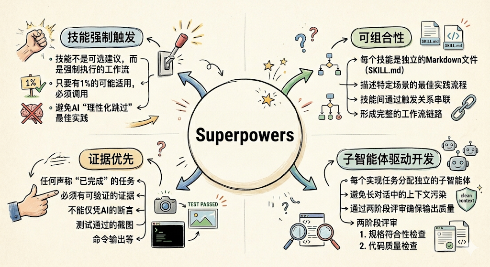
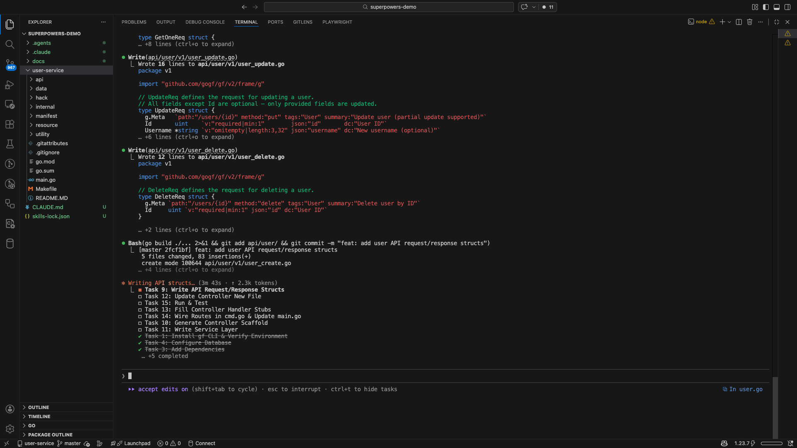
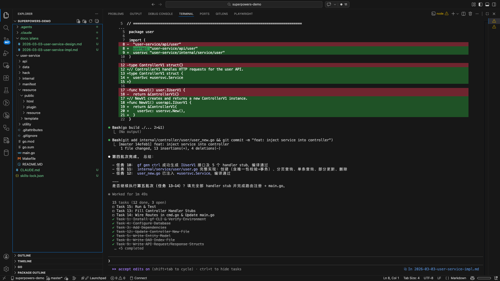

## 前言

随着`Claude Code`、`Cursor`、`GitHub Copilot`等`AI`编程工具的广泛普及，开发者的生产力得到了显著提升。然而，随之而来的问题也逐渐清晰：`AI`能生成代码，却不知道该"先做什么"；`AI`能回答问题，却不遵循团队的工程规范；`AI`能修复`Bug`，却常常改完一处又破坏另一处。

**`AI`编程工具缺少的不是智能，而是工程纪律。**

[Superpowers](https://github.com/obra/superpowers) 正是为解决这一问题而生的开源项目。它为`AI`编程智能体提供了一套完整的、可组合的软件工程工作流技能库，让`AI`不仅会写代码，更懂得如何"正确地"开展软件工程实践。

## 背景与痛点

### AI编程工具的工程管理困境

当前主流的`AI`编程工具在代码生成层面已经相当出色，但在**工程管理层面**却普遍存在以下问题：

| 痛点 | 具体表现 |
|---|---|
| **直接跳入实现** | 收到需求后立即写代码，跳过需求澄清和设计阶段 |
| **缺乏测试意识** | 先写实现代码，测试是事后补写的"装饰品" |
| **上下文漂移** | 长对话中逐渐偏离最初目标，产出越来越偏 |
| **验证不充分** | 声称"已完成"但未实际运行测试验证 |
| **调试方法随意** | 遇到问题凭感觉猜测，缺乏系统性排查流程 |
| **代码质量无保障** | 没有代码评审环节，质量依赖`AI`的"自觉" |

### 从"能用"到"好用"的鸿沟

以一个典型的功能开发场景为例：开发者说"帮我实现一个用户认证模块"，`AI`往往会立即开始写代码。但这种行为模式存在严重问题：

- 没有确认具体使用场景（`Web`？`CLI`？`API`？）
- 没有确认技术栈约束（使用哪种加密方式？会话管理方案？）
- 没有确认验收标准（怎样才算"完成"？）
- 直接产出的代码缺乏测试，后期维护困难

这本质上是`AI`缺乏软件工程的**工程纪律**——不是能力问题，是流程问题。

### Superpowers的解题思路

`Superpowers`的核心洞察是：**好的工程实践可以被编码为可复用的"技能"（`Skill`）**，并在合适的时机自动触发。

就像给工程师提供了一本详细的"工程手册"，`Superpowers`通过技能文件（`SKILL.md`）将最佳实践结构化，然后通过一套触发机制确保`AI`在合适的时机自动应用这些实践——不是建议，而是**强制执行**。

这一思路的本质是：**`Process over Prompt`（流程大于提示）**。

大多数人面对`AI`质量问题的本能反应是：换一个更好的模型，或者写一段更精妙的提示词。`Superpowers`的选择恰恰相反——它不依赖`AI`能力的提升，而是用**可重复的工程流程**约束`AI`的行为模式。

**`Superpowers`不会让`AI`变得更聪明，但会让`AI`的聪明变得可控。** 同一个模型，在没有工程流程约束之前可能产出杂乱的代码、跳过测试、声称完成却没有验证；加上`Superpowers`之后，同一个模型会先做设计、再做计划、再按批次执行、完成后用证据验收——产出质量的差异不来自模型本身，而来自**流程是否在场**。

## 什么是Superpowers



`Superpowers`是一个完整的软件开发工作流框架，构建于一套可组合的"技能"（`Skills`）之上。其官方定义是：

> A complete software development workflow for your coding agents, built on top of a set of composable "skills" and some initial instructions that make sure your agent uses them.

### 核心设计原则

`Superpowers`的设计体现了以下几个核心原则：

**技能强制触发（Mandatory Skill Invocation）：** 技能不是可选建议，而是强制执行的工作流。只要有1%的可能某个技能适用，智能体就必须调用它。这种强硬的设计避免了`AI`"理性化跳过"最佳实践的情况。

> `Superpowers`技能的强制触发原理是通过[Skill提示词](https://github.com/obra/superpowers/blob/main/skills/using-superpowers/SKILL.md)+[上下文注入](https://github.com/obra/superpowers/blob/main/hooks/session-start)实现。

**可组合性（Composability）：** 每个技能是独立的`Markdown`文件（`SKILL.md`），描述了特定场景下的最佳实践流程。技能之间通过触发关系串联，形成完整的工作流链路。

**子智能体驱动开发（Subagent-Driven Development）：** 通过为每个实现任务分配独立的子智能体，避免长对话中的上下文污染，同时通过两阶段评审（规格符合性检查 + 代码质量检查）确保输出质量。

**证据优先（Evidence Over Claims）：** 任何声称"已完成"的任务都必须有可验证的证据——测试通过的截图、命令输出等，不能仅凭`AI`的断言。

### 技能库一览

`Superpowers`当前提供以下技能：

**测试类**

| 技能名称 | 触发时机 | 功能描述 |
|---|---|---|
| `test-driven-development` | 实现任何功能或修复`Bug`前 | 强制执行红绿重构（`RED-GREEN-REFACTOR`）循环 |

**调试类**

| 技能名称 | 触发时机 | 功能描述 |
|---|---|---|
| `systematic-debugging` | 遇到难以定位的问题时 | 四阶段根因分析流程 |
| `verification-before-completion` | 声称任务完成前 | 确认问题真正修复而非表面通过 |

**协作与工作流类**

| 技能名称 | 触发时机 | 功能描述 |
|---|---|---|
| `brainstorming` | 任何创意性工作开始前 | 苏格拉底式设计精炼，生成设计文档 |
| `writing-plans` | 拥有规格/需求，准备编码前 | 编写详细的实现计划 |
| `executing-plans` | 执行实现计划时 | 批次执行，带人工检查点 |
| `subagent-driven-development` | 执行含独立任务的实现计划时 | 每任务分派独立子智能体，两阶段评审 |
| `dispatching-parallel-agents` | 需要并行执行多个独立任务时 | 并发子智能体工作流 |
| `requesting-code-review` | 提交代码评审前 | 预评审清单检查 |
| `receiving-code-review` | 收到代码评审反馈时 | 系统性响应评审意见 |
| `using-git-worktrees` | 开始需要隔离的功能开发前 | 创建隔离的`Git`工作树 |
| `finishing-a-development-branch` | 开发任务完成后 | 验证测试、选择合并/`PR`/保留/丢弃 |

**元技能类**

| 技能名称 | 触发时机 | 功能描述 |
|---|---|---|
| `writing-skills` | 创建新技能时 | 遵循最佳实践创建自定义技能 |
| `using-superpowers` | 任何对话开始时 | 建立如何查找和使用技能的基础规则 |

## 完整工作流

`Superpowers`的核心工作流按照以下步骤依次触发：


1. **阶段一：头脑风暴与设计（brainstorming）**
    - 用户表达需求想法
    - `AI`通过提问澄清需求（每次一个问题）
    - 提出`2-3`种实现方案及权衡分析
    - 分段展示设计方案，用户逐段确认
    - 保存设计文档到`docs/plans/YYYY-MM-DD-<topic>-design.md`
        
2. **阶段二：使用Git工作树（using-git-worktrees）**
   - 在独立`Git`工作树中开展开发

3. **阶段三：编写实现计划（writing-plans）**
   - 将设计拆解为`2-5`分钟的细粒度任务，每个任务包含：文件路径、完整代码、验证步骤

4. **阶段四：子智能体驱动开发（subagent-driven-development/executing-plans）**
   - 每个任务由独立子智能体执行，执行后经历两阶段评审：规格符合性 → 代码质量

5. **阶段五：测试驱动开发（test-driven-development）**
   - 每个实现任务遵循`RED-GREEN-REFACTOR`循环
   - 任务会按照批次执行，每批次完成`2-3`个任务，并在完成后使用`git`提交，然后等待用户确认继续下一批次

6. **阶段六：请求代码评审（requesting-code-review）**
   - 任务间进行代码评审，按严重程度分类问题

7. **阶段七：完成开发分支（finishing-a-development-branch）**
   - 验证测试，选择合并策略，清理工作树


这个流程的关键特性在于：**智能体会在合适时机自动调用对应技能**，开发者无需手动指挥每一步。

## 安装与配置

### Claude Code

`Claude Code`通过插件市场安装，是目前支持最完善的平台：

```bash
# 注册 Superpowers 插件市场
/plugin marketplace add obra/superpowers-marketplace

# 安装 Superpowers 插件
/plugin install superpowers@superpowers-marketplace
```

安装后，启动新会话时技能库会自动加载。更新：

```bash
/plugin update superpowers
```

### Cursor

在`Cursor`的`Agent`聊天中直接安装：

```text
/plugin-add superpowers
```

### Codex

克隆仓库并创建技能软链接：

```bash
# 克隆 Superpowers 仓库
git clone https://github.com/obra/superpowers.git ~/.codex/superpowers

# 创建技能发现软链接
mkdir -p ~/.agents/skills
ln -s ~/.codex/superpowers/skills ~/.agents/skills/superpowers
```

### OpenCode

```bash
# 克隆仓库
git clone https://github.com/obra/superpowers.git ~/.config/opencode/superpowers

# 注册插件
mkdir -p ~/.config/opencode/plugins
ln -s ~/.config/opencode/superpowers/.opencode/plugins/superpowers.js \
      ~/.config/opencode/plugins/superpowers.js

# 创建技能软链接
mkdir -p ~/.config/opencode/skills
ln -s ~/.config/opencode/superpowers/skills \
      ~/.config/opencode/skills/superpowers
```

### VSCode GitHub Copilot

暂不支持`VSCode GitHub Copilot`😨。

## 实践示例

以下通过一个完整的绿地项目（`Greenfield Project`）示例，展示如何使用`Superpowers`在`Claude Code`中从零到一构建一个用户服务：**使用`GoFrame`框架，创建一个`HTTP RESTful`风格的用户服务，实现基本的增删改查（`CRUD`）功能**。

> 本示例采用`Claude Code`作为`AI`编程工具，同时配合安装了[goframe-v2 Agent Skill](https://github.com/gogf/skills) - 一个专为`GoFrame`框架开发提供完整参考文档与最佳实践的技能包。

项目目标：使用`SQLite`作为数据库（学习/演示用途），实现以下接口：

| 方法 | 路径 | 说明 |
|------|------|------|
| `POST` | `/api/v1/users` | 创建用户 |
| `GET` | `/api/v1/users` | 分页查询用户列表 |
| `GET` | `/api/v1/users/{id}` | 按`ID`查询用户 |
| `PUT` | `/api/v1/users/{id}` | 更新用户（支持部分更新） |
| `DELETE` | `/api/v1/users/{id}` | 删除用户 |

### 阶段一：头脑风暴与设计（brainstorming）

向`Claude Code`发出如下提示词：

```text
我想从零开始，用 GoFrame 框架实现一个用户服务，提供 RESTful CRUD 接口，请帮我开始。
```

`AI`自动触发`brainstorming`技能，采用苏格拉底式提问逐步澄清需求：数据库选型、字段设计、接口规范、错误处理策略、验收标准……双方确认每个设计决策后，`AI`将设计方案分段呈现，用户逐段确认。

最终生成设计文档：`docs/plans/2026-03-03-user-service-design.md`（[示例文件](./assets/Superpowers：为AI编程智能体赋予工程化超能力/2026-03-03-user-service-design.md.txt)），内容包含目录结构、`API`规范、数据流图、错误处理策略等。


### 阶段二：编写实现计划（writing-plans）

`AI`自动触发`writing-plans`技能，将设计文档拆解为粒度为`2-5`分钟的细粒度任务，每个任务包含：文件路径、完整代码、验证步骤和`git`提交命令。

最终生成实现计划：`docs/plans/2026-03-03-user-service-impl.md`（[示例文件](./assets/Superpowers：为AI编程智能体赋予工程化超能力/2026-03-03-user-service-impl.md.txt)），共`13`个任务：

| 任务 | 说明 |
|------|------|
| `Task 1` | 安装`gf CLI`并验证环境（`CGO`、`Go`版本） |
| `Task 2` | 使用`gf init`初始化项目脚手架 |
| `Task 3` | 添加`SQLite`驱动依赖（`go get`） |
| `Task 4` | 配置数据库（`manifest/config/config.yaml`，`SQLite DSN`） |
| `Task 5` | 编写`entity`模型（`internal/model/entity/user.go`） |
| `Task 6` | 编写`DO`模型（`internal/model/do/user.go`） |
| `Task 7` | 编写`DAO Internal`层（`internal/dao/internal/user.go`） |
| `Task 8` | 编写`DAO Index`文件（`internal/dao/user.go`） |
| `Task 9` | 编写`API` `Request/Response`结构体 |
| `Task 10` | 执行`gf gen ctrl`生成控制器脚手架 |
| `Task 11` | 实现业务逻辑层（`internal/service/user/user.go`） |
| `Task 12` | 实现控制器处理函数 |
| `Task 13` | 注册路由、初始化`SQLite`建表、启动验证 |

### 阶段三：执行实现计划（executing-plans）

`AI`自动触发`executing-plans`技能，按批次顺序执行计划，每批次完成`2-3`个任务后进行`git`提交并等待用户确认，再继续下一批次。

以`Task 11`（业务逻辑层）为例，展示执行过程：

```text
[AI] 开始执行 Task 11: Write Service Layer
  读取任务描述与设计文档
  → 创建 internal/service/user/user.go
  → 实现 Create/GetList/GetOne/Update/Delete 共 5 个方法
  → 密码使用 SHA256 哈希处理（生产环境建议使用 bcrypt）
  → 通过 gerror 传递带业务语义的错误
  → 所有方法正确透传 ctx 至 DAO 层
  → go build ./... → 编译通过
  → git commit -m "feat: implement user service layer"
```

实际的`git`提交历史完整记录了每个任务的开发过程：

```bash
$ git log --oneline
ee26913 fix: correct SQLite DSN format and GetList count query
c13744b feat: wire routes and SQLite init in cmd
1739219 feat: implement controller handlers
14efeb1 feat: inject service into controller
8bec4fd feat: implement user service layer
c56ed39 feat: generate controller scaffold via gf gen ctrl
2fcf1bf feat: add user API request/response structs
ae42a15 feat: add DAO index file
ace2409 feat: add DAO internal layer
385a3c8 feat: add User DO model
f754e96 feat: add User entity model
e380b30 feat: configure SQLite database
4091b82 feat: add SQLite driver dependency
3963031 feat: init GoFrame project scaffold
```

任务会按照批次执行，每批次完成`2-3`个任务：



在任务批次完成后使用`git`提交，然后等待用户确认继续下一批次：



### 阶段四：验证（verification-before-completion）

所有任务完成后，`AI`自动触发`verification-before-completion`技能，启动服务进行集成验证，用实际输出为"已完成"提供证据：

```bash
# 启动服务（端口 :8080，SQLite 文件自动创建于 data/user.db）
cd user-service && gf run main.go

# 创建用户
curl -s -X POST http://127.0.0.1:8080/api/v1/users \
  -H "Content-Type: application/json" \
  -d '{"username":"alice","email":"alice@example.com","password":"secret123"}'
# {"code":0,"message":"","data":{"id":1}}

# 查询用户列表（分页参数为 pageSize）
curl -s "http://127.0.0.1:8080/api/v1/users?page=1&pageSize=10"
# {"code":0,"message":"","data":{"list":[{"id":1,"username":"alice","email":"alice@example.com",...}],"total":1,"page":1}}

# 按 ID 查询
curl -s http://127.0.0.1:8080/api/v1/users/1
# {"code":0,"message":"","data":{"id":1,"username":"alice","email":"alice@example.com","createdAt":"...","updatedAt":"..."}}

# 部分更新用户（只传需要修改的字段）
curl -s -X PUT http://127.0.0.1:8080/api/v1/users/1 \
  -H "Content-Type: application/json" \
  -d '{"username":"alice2"}'
# {"code":0,"message":"","data":{}}

# 删除用户
curl -s -X DELETE http://127.0.0.1:8080/api/v1/users/1
# {"code":0,"message":"","data":{}}
```

响应体中`password`字段因`entity`层配置了`json:"-"`标签而始终不出现在任何接口响应中，符合设计规范。

### 阶段五：收尾（finishing-a-development-branch）


## 总结

`Superpowers`为`AI`编程工具带来了真正意义上的工程纪律。它解决的不是`AI`的能力问题，而是`AI`的**工程行为模式**问题：

- **从"直接写代码"到"先设计后实现"**——`brainstorming`技能确保每次开发都有清晰的设计共识
- **从"测试是可选的"到"测试优先"**——`TDD`技能将红绿重构循环变为不可绕过的强制流程
- **从"声称完成"到"验证完成"**——`verification-before-completion`技能要求用证据而非断言说话
- **从"单一上下文污染"到"子智能体隔离执行"**——`subagent-driven-development`技能通过并行子智能体保持上下文纯净

`Superpowers`的核心理念可以用一句话概括：**`Process over Prompt`——流程大于提示**。当所有人都在追问"哪个模型更聪明"时，`Superpowers`给出了一个不同的答案：**`AI`不需要更聪明，它需要更可控**。一套结构化的工程流程，比任何精心调校的提示词都更能保证输出的稳定性与可预测性——因为流程约束的是行为本身，而不是某一次对话的结果。

在`AI`编程工具快速演进的今天，工程纪律与技术能力同等重要。`Superpowers`提供的不只是一套技能库，更是一种在`AI`时代践行严谨软件工程的方法论。

## 参考资料

- [Superpowers GitHub 仓库](https://github.com/obra/superpowers)