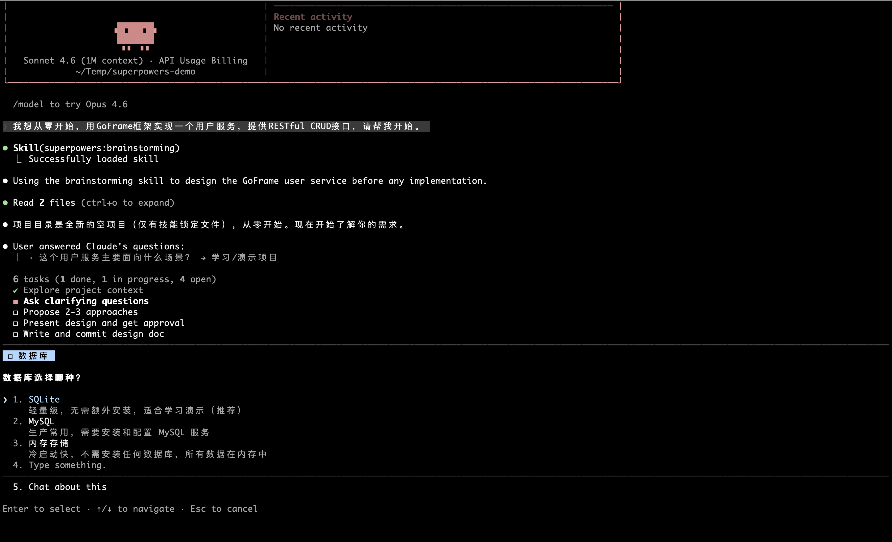
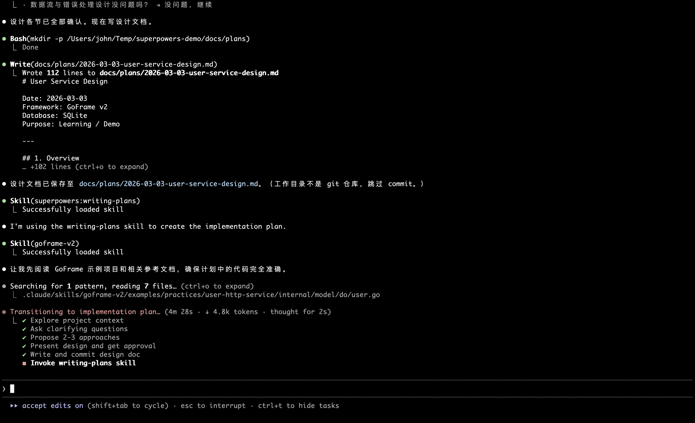

## 前言

随着`Claude Code`、`Cursor`、`GitHub Copilot`等`AI`编程工具的广泛普及，开发者的生产力得到了显著提升。然而，随之而来的问题也逐渐清晰：`AI`能生成代码，却不知道该"先做什么"；`AI`能回答问题，却不遵循团队的工程规范；`AI`能修复`Bug`，却常常改完一处又破坏另一处。

**`AI`编程工具缺少的不是智能，而是工程纪律。**

[Superpowers](https://github.com/obra/superpowers) 正是为解决这一问题而生的开源项目。它为`AI`编程智能体提供了一套完整的、可组合的软件工程工作流技能库，让`AI`不仅会写代码，更懂得如何"正确地"开展软件工程实践。

## 背景与痛点

### AI编程工具的工程管理困境

当前主流的`AI`编程工具在代码生成层面已经相当出色，但在**工程管理层面**却普遍存在以下问题：

| 痛点 | 具体表现 |
|---|---|
| **直接跳入实现** | 收到需求后立即写代码，跳过需求澄清和设计阶段 |
| **缺乏测试意识** | 先写实现代码，测试是事后补写的"装饰品" |
| **上下文漂移** | 长对话中逐渐偏离最初目标，产出越来越偏 |
| **验证不充分** | 声称"已完成"但未实际运行测试验证 |
| **调试方法随意** | 遇到问题凭感觉猜测，缺乏系统性排查流程 |
| **代码质量无保障** | 没有代码评审环节，质量依赖`AI`的"自觉" |

### 从"能用"到"好用"的鸿沟

以一个典型的功能开发场景为例：开发者说"帮我实现一个用户认证模块"，`AI`往往会立即开始写代码。但这种行为模式存在严重问题：

- 没有确认具体使用场景（`Web`？`CLI`？`API`？）
- 没有确认技术栈约束（使用哪种加密方式？会话管理方案？）
- 没有确认验收标准（怎样才算"完成"？）
- 直接产出的代码缺乏测试，后期维护困难

这本质上是`AI`缺乏软件工程的**工程纪律**——不是能力问题，是流程问题。

### Superpowers的解题思路

`Superpowers`的核心洞察是：**好的工程实践可以被编码为可复用的"技能"（`Skill`）**，并在合适的时机自动触发。

就像给工程师提供了一本详细的"工程手册"，`Superpowers`通过技能文件（`SKILL.md`）将最佳实践结构化，然后通过一套触发机制确保`AI`在合适的时机自动应用这些实践——不是建议，而是**强制执行**。

## 什么是Superpowers

`Superpowers`是一个完整的软件开发工作流框架，构建于一套可组合的"技能"（`Skills`）之上。其官方定义是：

> A complete software development workflow for your coding agents, built on top of a set of composable "skills" and some initial instructions that make sure your agent uses them.

### 核心设计原则

`Superpowers`的设计体现了以下几个核心原则：

**技能强制触发（Mandatory Skill Invocation）：** 技能不是可选建议，而是强制执行的工作流。只要有1%的可能某个技能适用，智能体就必须调用它。这种强硬的设计避免了`AI`"理性化跳过"最佳实践的情况。

**可组合性（Composability）：** 每个技能是独立的`Markdown`文件（`SKILL.md`），描述了特定场景下的最佳实践流程。技能之间通过触发关系串联，形成完整的工作流链路。

**子智能体驱动开发（Subagent-Driven Development）：** 通过为每个实现任务分配独立的子智能体，避免长对话中的上下文污染，同时通过两阶段评审（规格符合性检查 + 代码质量检查）确保输出质量。

**证据优先（Evidence Over Claims）：** 任何声称"已完成"的任务都必须有可验证的证据——测试通过的截图、命令输出等，不能仅凭`AI`的断言。

### 技能库一览

`Superpowers`当前提供以下技能：

**测试类**

| 技能名称 | 触发时机 | 功能描述 |
|---|---|---|
| `test-driven-development` | 实现任何功能或修复`Bug`前 | 强制执行红绿重构（`RED-GREEN-REFACTOR`）循环 |

**调试类**

| 技能名称 | 触发时机 | 功能描述 |
|---|---|---|
| `systematic-debugging` | 遇到难以定位的问题时 | 四阶段根因分析流程 |
| `verification-before-completion` | 声称任务完成前 | 确认问题真正修复而非表面通过 |

**协作与工作流类**

| 技能名称 | 触发时机 | 功能描述 |
|---|---|---|
| `brainstorming` | 任何创意性工作开始前 | 苏格拉底式设计精炼，生成设计文档 |
| `writing-plans` | 拥有规格/需求，准备编码前 | 编写详细的实现计划 |
| `executing-plans` | 执行实现计划时 | 批次执行，带人工检查点 |
| `subagent-driven-development` | 执行含独立任务的实现计划时 | 每任务分派独立子智能体，两阶段评审 |
| `dispatching-parallel-agents` | 需要并行执行多个独立任务时 | 并发子智能体工作流 |
| `requesting-code-review` | 提交代码评审前 | 预评审清单检查 |
| `receiving-code-review` | 收到代码评审反馈时 | 系统性响应评审意见 |
| `using-git-worktrees` | 开始需要隔离的功能开发前 | 创建隔离的`Git`工作树 |
| `finishing-a-development-branch` | 开发任务完成后 | 验证测试、选择合并/`PR`/保留/丢弃 |

**元技能类**

| 技能名称 | 触发时机 | 功能描述 |
|---|---|---|
| `writing-skills` | 创建新技能时 | 遵循最佳实践创建自定义技能 |
| `using-superpowers` | 任何对话开始时 | 建立如何查找和使用技能的基础规则 |

## 完整工作流

`Superpowers`的核心工作流按照以下步骤依次触发：


1. **brainstorming**
    - 用户表达需求想法
    - `AI`通过提问澄清需求（每次一个问题）
    - 提出`2-3`种实现方案及权衡分析
    - 分段展示设计方案，用户逐段确认
    - 保存设计文档到`docs/plans/YYYY-MM-DD-<topic>-design.md`
        
2. **using-git-worktrees**
   - 在独立`Git`工作树中开展开发

3. **writing-plans**
   - 将设计拆解为`2-5`分钟的细粒度任务，每个任务包含：文件路径、完整代码、验证步骤

4. **subagent-driven-development/executing-plans**
   - 每个任务由独立子智能体执行，执行后经历两阶段评审：规格符合性 → 代码质量

5. **test-driven-development**
   - 每个实现任务遵循`RED-GREEN-REFACTOR`循环

6. **requesting-code-review**
   - 任务间进行代码评审，按严重程度分类问题

7. **finishing-a-development-branch**
   - 验证测试，选择合并策略，清理工作树


这个流程的关键特性在于：**智能体会在合适时机自动调用对应技能**，开发者无需手动指挥每一步。

## 安装与配置

### Claude Code

`Claude Code`通过插件市场安装，是目前支持最完善的平台：

```bash
# 注册 Superpowers 插件市场
/plugin marketplace add obra/superpowers-marketplace

# 安装 Superpowers 插件
/plugin install superpowers@superpowers-marketplace
```

安装后，启动新会话时技能库会自动加载。更新：

```bash
/plugin update superpowers
```

### Cursor

在`Cursor`的`Agent`聊天中直接安装：

```text
/plugin-add superpowers
```

### Codex

克隆仓库并创建技能软链接：

```bash
# 克隆 Superpowers 仓库
git clone https://github.com/obra/superpowers.git ~/.codex/superpowers

# 创建技能发现软链接
mkdir -p ~/.agents/skills
ln -s ~/.codex/superpowers/skills ~/.agents/skills/superpowers
```

### OpenCode

```bash
# 克隆仓库
git clone https://github.com/obra/superpowers.git ~/.config/opencode/superpowers

# 注册插件
mkdir -p ~/.config/opencode/plugins
ln -s ~/.config/opencode/superpowers/.opencode/plugins/superpowers.js \
      ~/.config/opencode/plugins/superpowers.js

# 创建技能软链接
mkdir -p ~/.config/opencode/skills
ln -s ~/.config/opencode/superpowers/skills \
      ~/.config/opencode/skills/superpowers
```

### VSCode GitHub Copilot

暂不支持`VSCode GitHub Copilot`。

## 实践示例

以下通过一个完整的绿地项目（`Greenfield Project`）示例，展示如何使用`Superpowers`从零到一构建一个生产级服务：**使用`GoFrame`框架，创建一个`HTTP RESTful`风格的用户服务，实现基本的增删改查（`CRUD`）功能**。

### 阶段一：头脑风暴与设计（brainstorming）

**开发者：** 我想从零开始，用`GoFrame`框架实现一个用户服务，提供`RESTful CRUD`接口，请帮我开始。

**AI（应用`brainstorming`技能）：** 这是一个全新项目，我需要先了解一些背景信息。

第一个问题：用户数据需要持久化存储吗？如果需要，使用哪种数据库（如`MySQL`、`PostgreSQL`、`SQLite`）？

**开发者：** 使用`MySQL`，本地开发用`SQLite`做测试。

**AI：** 第二个问题：用户实体包含哪些核心字段？例如`id`、`username`、`email`、`password`、`created_at`等，还是有其他特殊需求？

**开发者：** 基础的就好：`id`、`username`、`email`、`password`（哈希存储）、`created_at`、`updated_at`。

**AI：** 第三个问题：`API`是否需要认证（如`JWT`），还是这次只关注基础`CRUD`功能本身？

**开发者：** 这次只关注`CRUD`，认证后续再加。

**AI：** 好的，我来提出三种项目结构方案：

方案一：**`GoFrame`标准分层架构**（推荐）——使用`gf`脚手架工具生成标准目录，按`api/controller/service/model/dao`分层。优点：遵循`GoFrame`最佳实践，代码生成工具支持完善，层次清晰易维护。

方案二：**精简单包结构**——所有代码放在少数几个文件中，不分层。优点：前期快速，代码少。缺点：规模稍大后难以维护，不符合`GoFrame`设计理念。

方案三：**`Clean Architecture`**——领域层、基础设施层、接口层严格分离。优点：极度解耦。缺点：对简单`CRUD`服务过度设计，且与`GoFrame`惯例不完全吻合。

推荐方案一，使用`GoFrame`标准分层架构，符合框架设计哲学，且后续扩展认证、权限等功能时有良好基础。

*（对话继续确认数据库配置方式、错误响应格式、分页策略等细节，最终生成`docs/plans/2026-03-03-user-service-design.md`）*



设计文档核心内容：

```text
# User Service Design

## Goal
RESTful CRUD API for User resource using GoFrame

## API Endpoints
GET    /api/v1/users        - List users (with pagination)
POST   /api/v1/users        - Create user
GET    /api/v1/users/{id}   - Get user by ID
PUT    /api/v1/users/{id}   - Update user
DELETE /api/v1/users/{id}   - Delete user

## Tech Stack
- GoFrame v2 (gf CLI scaffold)
- MySQL (production) / SQLite (testing)
- GoFrame ORM (gdb) for data access
- GoFrame validator for input validation

## Directory Structure (GoFrame standard)
api/v1/user.go          - Request/Response structs
controller/user/        - HTTP handler layer
service/user/           - Business logic layer
model/entity/user.go    - DB entity struct
model/do/user.go        - Data object for DB ops
dao/user.go             - Data access object
```

### 阶段二：创建工作树（using-git-worktrees）

设计获批后，`AI`自动创建隔离开发环境：

```bash
# AI 自动执行
mkdir user-service && cd user-service
git init
gf init . -n user-service          # 使用 GoFrame CLI 初始化项目
git add . && git commit -m "chore: init project with gf scaffold"
git worktree add .worktrees/feature-crud -b feature/user-crud
cd .worktrees/feature-crud
go test ./...    # 验证基线：脚手架默认测试通过
```

### 阶段三：编写实现计划（writing-plans）

`AI`生成详细的实现计划`docs/plans/2026-03-03-user-service.md`：

```markdown
# User Service CRUD Implementation Plan

> **For Claude:** REQUIRED SUB-SKILL: Use superpowers:executing-plans to implement this plan task-by-task.

**Goal:** Implement RESTful CRUD API for User resource using GoFrame v2

**Architecture:** GoFrame standard layered architecture (api/controller/service/model/dao)

**Tech Stack:** Go 1.22, GoFrame v2, MySQL, SQLite (test)

---

### Task 1: Define API request/response structs

**Files:**
- Create: `api/v1/user.go`

**Step 1: Write failing test**
(Verify struct fields and validation tags compile correctly)

**Step 2: Write implementation**

### Task 2: Define entity and data objects

**Files:**
- Create: `model/entity/user.go`
- Create: `model/do/user.go`

**Step 3: Generate DAO via gf CLI**
Run: `gf gen dao`

### Task 3: Implement service layer

**Files:**
- Create: `service/user/user.go`
- Create: `service/user/user_test.go`

**Step 1: Write failing test**

### Task 4: Implement controller layer

**Files:**
- Create: `controller/user/user.go`
- Create: `controller/user/user_test.go`

...（后续任务：路由注册、数据库配置、集成测试）
```

### 阶段四：子智能体驱动执行（subagent-driven-development）



以`Task 3`（业务逻辑层）为例，展示子智能体的执行过程：

```
[主智能体] 开始执行 Task 3: Implement service layer
  ↓
[子智能体 1-实现]
  读取任务描述与设计文档
  → 写失败测试 service/user/user_test.go
  → 运行 go test ./service/... → 确认 FAIL（函数未定义）
  → 实现 service/user/user.go（Create/List/Get/Update/Delete）
  → 运行 go test ./service/... → 确认全部 PASS
  → git commit -m "feat: implement user service layer"
  ↓
[子智能体 2-规格评审]
  对照设计文档检查：
  ✓ 5 个接口全部实现
  ✓ password 字段使用 bcrypt 哈希
  ✓ List 接口支持分页参数
  → 规格符合，通过
  ↓
[子智能体 3-质量评审]
  检查代码质量：
  ✓ 错误使用 gerror 包装，包含业务语义
  ✓ ctx 正确传递至 DAO 层
  ✓ 无裸 panic，边界条件有处理
  → 质量通过
  ↓
[主智能体] Task 3 完成，继续 Task 4 ...
```

各主要任务的核心代码如下：

**`service/user/user.go`（服务层）**

```go
package user

import (
    "context"

    "github.com/gogf/gf/v2/errors/gerror"
    "github.com/gogf/gf/v2/frame/g"

    "user-service/internal/dao"
    "user-service/internal/model/do"
    "user-service/internal/model/entity"
)

// Create 创建用户，password 使用 bcrypt 哈希存储
func Create(ctx context.Context, username, email, password string) (id uint, err error) {
    hashed, err := g.Func().BcryptEncode(password)
    if err != nil {
        return 0, gerror.Wrap(err, "password hash failed")
    }
    result, err := dao.User.Ctx(ctx).Insert(do.User{
        Username: username,
        Email:    email,
        Password: hashed,
    })
    if err != nil {
        return 0, gerror.Wrap(err, "create user failed")
    }
    lastID, err := result.LastInsertId()
    return uint(lastID), err
}

// List 分页查询用户列表
func List(ctx context.Context, page, size int) (users []*entity.User, total int, err error) {
    m := dao.User.Ctx(ctx)
    total, err = m.Count()
    if err != nil {
        return nil, 0, gerror.Wrap(err, "count users failed")
    }
    err = m.Page(page, size).Scan(&users)
    return
}

// Get 按 ID 查询单个用户
func Get(ctx context.Context, id uint) (user *entity.User, err error) {
    err = dao.User.Ctx(ctx).Where(dao.User.Columns().Id, id).Scan(&user)
    if err != nil {
        return nil, gerror.Wrap(err, "get user failed")
    }
    if user == nil {
        return nil, gerror.Newf("user %d not found", id)
    }
    return
}

// Update 更新用户信息
func Update(ctx context.Context, id uint, username, email string) error {
    _, err := dao.User.Ctx(ctx).Where(dao.User.Columns().Id, id).Update(do.User{
        Username: username,
        Email:    email,
    })
    return gerror.Wrap(err, "update user failed")
}

// Delete 删除用户
func Delete(ctx context.Context, id uint) error {
    _, err := dao.User.Ctx(ctx).Where(dao.User.Columns().Id, id).Delete()
    return gerror.Wrap(err, "delete user failed")
}
```

**`controller/user/user.go`（控制器层）**

```go
package user

import (
    "github.com/gogf/gf/v2/frame/g"
    "github.com/gogf/gf/v2/net/ghttp"

    v1 "user-service/api/v1"
    "user-service/internal/service/user"
)

type Controller struct{}

// Create POST /api/v1/users
func (c *Controller) Create(r *ghttp.Request) {
    var req v1.UserCreateReq
    if err := r.Parse(&req); err != nil {
        r.Response.WriteJsonExit(g.Map{"code": 400, "message": err.Error()})
    }
    id, err := user.Create(r.Context(), req.Username, req.Email, req.Password)
    if err != nil {
        r.Response.WriteJsonExit(g.Map{"code": 500, "message": err.Error()})
    }
    r.Response.WriteJsonExit(g.Map{"code": 0, "data": g.Map{"id": id}})
}

// List GET /api/v1/users
func (c *Controller) List(r *ghttp.Request) {
    page := r.GetQueryInt("page", 1)
    size := r.GetQueryInt("size", 20)
    users, total, err := user.List(r.Context(), page, size)
    if err != nil {
        r.Response.WriteJsonExit(g.Map{"code": 500, "message": err.Error()})
    }
    r.Response.WriteJsonExit(g.Map{
        "code": 0,
        "data": g.Map{"list": users, "total": total, "page": page, "size": size},
    })
}
```

**路由注册（`main.go`）**

```go
s := g.Server()
s.Group("/api/v1", func(group *ghttp.RouterGroup) {
    group.Middleware(ghttp.MiddlewareHandlerResponse)
    group.Bind(
        new(controller.User),
    )
})
s.Run()
```

### 阶段五：验证（verification-before-completion）

所有任务完成后，`AI`运行完整验证后才声称完成：

```bash
# 单元测试与覆盖率
go test ./... -v -cover
# --- PASS: TestUserCreate (0.03s)
# --- PASS: TestUserList (0.02s)
# --- PASS: TestUserGet (0.01s)
# --- PASS: TestUserUpdate (0.02s)
# --- PASS: TestUserDelete (0.01s)
# coverage: 83.4% of statements

# 启动服务进行集成验证
go run main.go &

# 创建用户
curl -s -X POST http://127.0.0.1:8080/api/v1/users \
  -H "Content-Type: application/json" \
  -d '{"username":"alice","email":"alice@example.com","password":"secret123"}'
# {"code":0,"data":{"id":1}}

# 查询用户列表
curl -s "http://127.0.0.1:8080/api/v1/users?page=1&size=10"
# {"code":0,"data":{"list":[...],"total":1,"page":1,"size":10}}

# 按 ID 获取
curl -s http://127.0.0.1:8080/api/v1/users/1
# {"code":0,"data":{"id":1,"username":"alice","email":"alice@example.com",...}}

# 更新用户
curl -s -X PUT http://127.0.0.1:8080/api/v1/users/1 \
  -H "Content-Type: application/json" \
  -d '{"username":"alice2","email":"alice2@example.com"}'
# {"code":0,"data":null}

# 删除用户
curl -s -X DELETE http://127.0.0.1:8080/api/v1/users/1
# {"code":0,"data":null}
```

### 阶段六：收尾（finishing-a-development-branch）

```
AI: 所有任务已完成：
  ✓ 5 个 CRUD 接口全部实现并通过测试
  ✓ 单元测试覆盖率 83.4%
  ✓ 集成验证全部通过

以下是本次开发的选项：

1. 合并到 main 分支（squash commit）
2. 创建 Pull Request（建议：便于 Code Review）
3. 保留分支，稍后处理
4. 丢弃所有更改

您的选择？
```

## 自定义技能

`Superpowers`支持创建完全自定义的技能，通过`writing-skills`技能来指导技能的创作。

### 技能文件结构

每个技能是一个`SKILL.md`文件，包含`YAML`前置元数据和`Markdown`内容：

```markdown
---
name: your-skill-name
description: "触发时机和功能描述，AI 通过此描述判断是否调用该技能"
---

# 技能名称

## 概述

简要描述技能的功能和核心原则。

## 何时使用

描述触发条件。

## 流程

1. 步骤一
2. 步骤二
...

## 检查清单

- [ ] 检查项一
- [ ] 检查项二
```

### 个人技能目录

除项目级技能外，还可以在用户级别创建个人技能：

```bash
# Codex / OpenCode 个人技能目录
~/.agents/skills/your-name/
```

这些个人技能在所有项目中均可使用，适合团队内部规范的沉淀与共享。

### 示例：创建代码评审清单技能

以下是一个针对`Go`语言项目的自定义代码评审清单技能示例：

```markdown
---
name: go-code-review
description: "Use before submitting any Go code for review - checks Go-specific best practices"
---

# Go Code Review Checklist

## Error Handling
- [ ] All errors are handled (no `_` discards without comment)
- [ ] Error messages are lowercase and descriptive
- [ ] Custom error types used for sentinel errors

## Goroutines & Concurrency
- [ ] All goroutines have clear ownership and termination conditions
- [ ] Channels are properly closed
- [ ] Race conditions checked with `go test -race`

## Performance
- [ ] No unnecessary allocations in hot paths
- [ ] Context propagation used correctly for cancellation

## Verification
Run: `go vet ./... && golangci-lint run`
```

## 总结

`Superpowers`为`AI`编程工具带来了真正意义上的工程纪律。它解决的不是`AI`的能力问题，而是`AI`的**工程行为模式**问题：

- **从"直接写代码"到"先设计后实现"**——`brainstorming`技能确保每次开发都有清晰的设计共识
- **从"测试是可选的"到"测试优先"**——`TDD`技能将红绿重构循环变为不可绕过的强制流程
- **从"声称完成"到"验证完成"**——`verification-before-completion`技能要求用证据而非断言说话
- **从"单一上下文污染"到"子智能体隔离执行"**——`subagent-driven-development`技能通过并行子智能体保持上下文纯净

在`AI`编程工具快速演进的今天，工程纪律与技术能力同等重要。`Superpowers`提供的不只是一套技能库，更是一种在`AI`时代践行严谨软件工程的方法论。

## 参考资料

- [Superpowers GitHub 仓库](https://github.com/obra/superpowers)