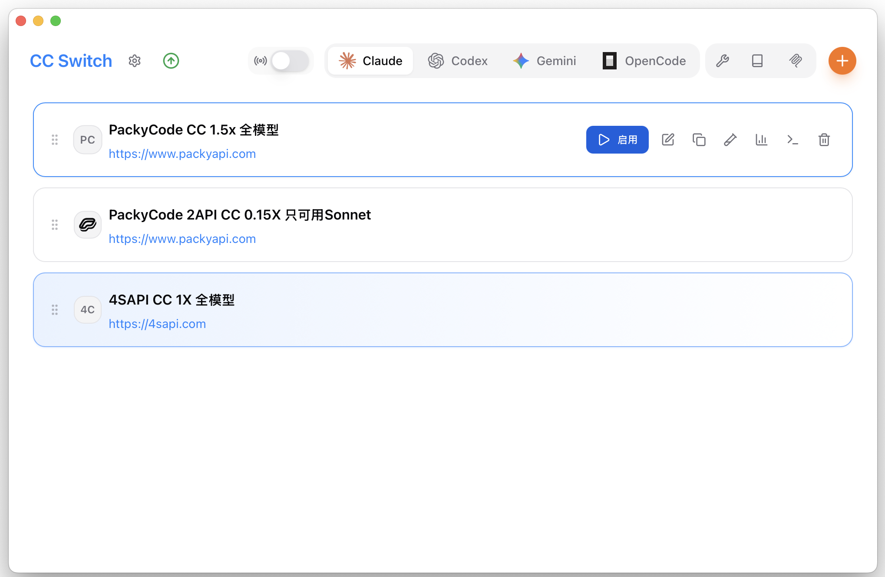

## 前言

在`AI`辅助编程领域，`Claude Code`是目前公认的最强大、最智能的`Agent`工具之一。与传统的代码补全工具不同，`Claude Code`是一个真正意义上的编程智能体——它不仅能理解你的代码库，还能主动规划、执行多步骤任务，包括读取文件、运行命令、修改代码、创建`Pull Request`等完整的开发工作流。

`Claude Code`由`Anthropic`开发，基于`Claude`大语言模型，通过精心设计的智能体循环（`Agentic Loop`）和工具系统，将强大的语言理解能力与实际的代码执行能力结合在一起。无论是快速理解一个陌生代码库、修复复杂的`Bug`、还是自动化大规模重构，`Claude Code`都能以接近资深工程师的水准完成工作。

本文将系统介绍`Claude Code`的安装方法、核心概念、设计原理以及常用命令，帮助开发者充分发挥其潜力。

## 什么是Claude Code


### 基本介绍

`Claude Code`是`Anthropic`推出的`AI`驱动的编程助手，运行在终端、`IDE`插件、桌面应用和浏览器等多种环境中。它的核心能力是：

- **全局代码理解**：读取整个项目的文件结构，理解各组件之间的关联
- **多步骤任务执行**：自主规划并执行跨文件的复杂修改
- **工具调用能力**：通过内置工具执行`Shell`命令、搜索文件、读写代码等
- **上下文持久化**：通过`CLAUDE.md`和自动记忆机制在会话间保持项目知识

与只能看到当前文件的内联补全工具不同，`Claude Code`能感知整个项目，并像资深工程师一样做出有全局视野的决策。

### 常见使用场景

| 场景 | 说明 |
|------|------|
| **理解新代码库** | 快速了解项目架构、技术栈和代码惯例 |
| **功能开发** | 从需求描述到代码实现的端到端开发 |
| **Bug修复** | 定位问题根源并验证修复效果 |
| **代码重构** | 大规模、跨文件的安全重构 |
| **单元测试** | 识别未覆盖代码并生成测试用例 |
| **文档生成** | 自动补充代码注释和`README` |
| **`Git`操作** | 生成提交信息、创建`Pull Request` |
| **`CI/CD`集成** | 非交互模式下作为自动化管道的一部分 |

## 安装与配置

### 安装Claude Code

`Claude Code`支持`macOS`、`Linux`、`WSL`和`Windows`，推荐使用官方脚本安装（不推荐使用`npm`安装）：

```bash
curl -fsSL https://claude.ai/install.sh | bash
```

`Windows`用户需要先安装 [Git for Windows](https://git-scm.com/downloads/win)。

**原生安装方式会自动在后台保持更新，始终运行最新版本。**

### 启动Claude Code

在任意项目目录下启动：

```bash
cd /path/to/your/project
claude
```

第一次进入项目时，建议运行`/init`命令，`Claude Code`会自动分析项目结构并生成`CLAUDE.md`文件：

```bash
/init
```

### CC Switch（可视化配置工具）

推荐使用[CC Switch](https://github.com/farion1231/cc-switch)来可视化管理`Claude Code`配置，并且管理多个`Token`服务商，进行便捷的服务切换。`CC Switch`是一款专为`Claude Code`、`Codex`、`Gemini CLI`、`OpenCode`和`OpenClaw`等`AI CLI`工具提供统一的可视化配置管理工具。它的核心价值在于消除手动编辑`JSON`/`TOML`/`.env`配置文件的繁琐操作——通过图形界面一键切换`API`供应商、管理`MCP`服务器与`Skills`，支持`Windows`、`macOS`和`Linux`全平台。



#### 主要功能

| 功能 | 说明 |
|------|------|
| **供应商管理** | 内置`50+`供应商预设，复制`API Key`即可一键导入并切换 |
| **统一`MCP`管理** | 单一面板管理多个`CLI`工具的`MCP`服务器配置，支持双向同步 |
| **`Skills`管理** | 从`GitHub`仓库或`ZIP`文件一键安装`Skills`，统一分发到各工具 |
| **系统托盘快速切换** | 无需打开界面，直接从系统托盘菜单即时切换供应商 |
| **云同步** | 通过`Dropbox`、`OneDrive`、`iCloud`或`WebDAV`跨设备同步配置 |
| **用量追踪** | 跨供应商追踪`API`支出、请求数和`Token`用量，提供趋势图表 |
| **会话管理** | 浏览、搜索和恢复全部`CLI`工具的历史对话记录 |

所有配置数据存储在本地`SQLite`数据库（`~/.cc-switch/cc-switch.db`），采用原子写入机制保护配置不被损坏，并自动保留最近`10`份备份。

#### 如何安装

**macOS（推荐使用`Homebrew`）：**

```bash
brew tap farion1231/ccswitch
brew install --cask cc-switch
```

**其他发行版：**

从 https://github.com/farion1231/cc-switch/releases 页面下载对应格式的安装包。


## 核心概念


### 智能体循环（Agentic Loop）

`Claude Code`的核心架构是智能体循环（`Agentic Loop`），这是它与普通聊天机器人的根本区别。

```
用户输入
    ↓
收集上下文（读取文件、执行搜索）
    ↓
分析与规划（模型推理）
    ↓
执行操作（文件编辑、Shell命令、Web搜索）
    ↓
验证结果（运行测试、检查输出）
    ↓
循环直到任务完成
    ↓
向用户报告结果
```

在这个循环中，`Claude`不是一次性回答问题，而是像人类工程师一样：逐步收集信息、做出判断、执行操作、根据结果调整策略，直到完成目标。

例如，当你说"修复失败的测试"时，`Claude Code`会：

1. 运行测试套件获取错误信息
2. 分析错误输出，定位到相关源文件
3. 阅读这些文件理解代码逻辑
4. 做出修改
5. 再次运行测试验证修复效果

整个过程可能涉及数十次工具调用，完全自主完成。

### 内置工具体系

`Claude Code`的智能来源于一套强大的内置工具，这些工具使其能够真正与开发环境交互：

| 工具类别 | 工具 | 功能 |
|----------|------|------|
| **文件操作** | `Read`、`Edit`、`Write` | 读取、修改、创建文件 |
| **搜索** | `Glob`、`Grep` | 按模式查找文件和内容 |
| **执行** | `Bash` | 运行`Shell`命令、测试、`Git`操作 |
| **`Web`** | `WebFetch`、`WebSearch` | 获取文档、搜索信息 |
| **代码智能** | `LSP` | 类型检查、跳转到定义、查找引用 |
| **子智能体** | `Agent` | 在独立上下文中生成子任务 |
| **任务管理** | `TaskCreate`、`TaskList` | 管理会话内的任务清单 |
| **计划模式** | `EnterPlanMode`、`ExitPlanMode` | 切换只读分析模式 |
| **`Worktree`** | `EnterWorktree`、`ExitWorktree` | 创建和切换隔离的工作树 |

`Claude`根据当前任务自主选择需要调用的工具，无需用户手动指定。

### Memory机制

`Claude Code`每次会话都是全新的上下文窗口，但它提供了两种跨会话保持知识的机制：

#### CLAUDE.md文件

`CLAUDE.md`是**开发者手动编写**的指令文件，可通过`/init`斜杠命令创建/更新（自动分析项目），`Claude Code`在每次会话启动时将其加载到上下文窗口中，整个会话期间持续生效。它相当于给`Claude`的"项目手册"：

```markdown
# 代码规范
- 使用 ES modules (import/export)，不使用 CommonJS (require)
- 函数名使用 camelCase，组件名使用 PascalCase

# 工作流
- 提交前必须运行类型检查：npm run typecheck
- 测试命令：npm test
- 优先运行单个测试而不是整个测试套件

# 架构说明
- API 处理器位于 src/api/handlers/
- 数据模型位于 src/models/
```

`CLAUDE.md`的存放位置决定了其作用范围：

| 文件位置 | 作用范围 | 用途 |
|----------|----------|------|
| `~/.claude/CLAUDE.md` | 个人全局 | 个人编码习惯和工具偏好 |
| `./CLAUDE.md`（项目根目录） | 项目团队共享 | 项目规范、架构、工作流 |
| `./子目录/CLAUDE.md` | 按需加载 | 特定模块的专项规则 |
| 系统管理目录（参见下方） | 企业全局 | 组织级安全策略和合规规范 |

企业管理员可以在以下位置部署组织级`CLAUDE.md`：
- `macOS`：`/Library/Application Support/ClaudeCode/CLAUDE.md`
- `Linux/WSL`：`/etc/claude-code/CLAUDE.md`
- `Windows`：`C:\Program Files\ClaudeCode\CLAUDE.md`

**编写高效的CLAUDE.md的原则：**

- 保持在`200`行以内，超出会降低`Claude`对指令的遵循度
- 使用具体、可验证的指令，例如"使用2空格缩进"而非"格式化代码"
- 只包含`Claude`无法从代码本身推断出的信息
- 通过`@path/to/file`语法引用其他文件，将详细内容外化

:::info 与Copilot Instructions的对比

`CLAUDE.md`与`GitHub Copilot`的`.github/copilot-instructions.md`（或`.instructions.md`）在概念上相同，都是"持久上下文指令文件"，在会话/对话启动时注入给模型。两者的主要区别如下：

| 特性 | `CLAUDE.md` | `Copilot Instructions` |
|------|-------------|------------------------|
| **触发方式** | 会话启动时一次性加载到上下文窗口 | 每次对话自动注入 |
| **作用范围** | 4级：企业/个人全局/项目/子目录 | 2级：项目/个人全局 |
| **行数限制** | 建议`200`行以内 | 无明确限制 |
| **文件引用** | 支持`@path`语法导入外部文件 | 不支持 |
| **路径范围规则** | `.claude/rules/`目录支持按文件路径按需加载 | `applyTo`模式匹配 |
| **配套记忆机制** | 有`MEMORY.md`（由`Claude`自动写入） | 无对应机制 |
:::

#### 自动记忆（Auto Memory）

自动记忆是`Claude Code`在与你协作过程中写给自己的笔记。当它发现有价值的经验时（如项目构建命令、调试技巧、你纠正它的偏好），会自动保存到本地文件：

```text
~/.claude/projects/<project>/memory/
├── MEMORY.md          # 索引文件，每次会话开头加载前200行
├── debugging.md       # 调试经验
├── api-conventions.md # API设计决策
└── ...
```

`MEMORY.md`的前`200`行在每次会话开始时自动加载。详细笔记放在独立主题文件中，按需读取。

两种记忆机制的对比：

| 特性 | `CLAUDE.md` | 自动记忆 |
|------|-------------|----------|
| **编写者** | 开发者手动编写 | `Claude`自动生成 |
| **内容** | 指令和规则 | 经验和模式 |
| **适用范围** | 项目、用户或组织 | 每个工作区独立 |
| **会话加载** | 完整加载 | 加载前`200`行 |
| **推荐用途** | 编码标准、工作流 | 构建命令、调试洞见 |

通过`/memory`命令可以查看和管理所有记忆文件。

### 会话管理与上下文窗口

`Claude Code`的所有对话都本地保存。每次会话共享同一个上下文窗口，包含：对话历史、读取的文件内容、命令输出、`CLAUDE.md`、加载的技能等。

**上下文管理要点：**

- 上下文窗口满了会导致性能下降，`Claude`会开始忽略早期指令
- `Claude Code`会在接近上限时自动压缩历史，优先保留关键代码和决策
- 使用`/clear`命令在不相关任务之间重置上下文
- 使用`/compact <说明>`手动指定压缩焦点

**会话持续化命令：**

```bash
claude --continue        # 继续当前目录最近的会话
claude --resume          # 打开会话选择器
claude --resume session-name  # 按名称恢复会话
```

在会话中使用`/rename`为当前会话命名，便于后续查找。

### 权限与安全模型

`Claude Code`采用分级权限模型，确保操作的安全性和可控性。

**权限模式（通过Shift+Tab循环切换）：**

| 模式 | 配置值 | 说明 |
|------|--------|------|
| **默认模式** | `default` | 文件编辑和`Shell`命令都需要确认 |
| **自动接受编辑** | `acceptEdits` | 文件编辑无需确认，命令仍需确认 |
| **计划模式** | `plan` | 只读操作，生成计划后等待批准 |
| **跳过权限模式** | `bypassPermissions` | 跳过所有权限检查（谨慎使用） |

可以在配置文件中通过`defaultPermissionMode`字段设置会话启动时的默认权限模式，无需每次手动切换：

```json
{
  "defaultPermissionMode": "acceptEdits"
}
```

配置文件路径（按作用范围选择写入位置）：

| 配置文件 | 作用范围 |
|----------|----------|
| `~/.claude/settings.json` | 个人全局，影响所有项目 |
| `.claude/settings.json` | 当前项目，团队共享 |
| `.claude/settings.local.json` | 当前项目，仅本人生效 |

**配置文件权限规则：**

```json
{
  "permissions": {
    "allow": [
      "Bash(npm run lint)",
      "Bash(npm run test *)",
      "Read(~/.zshrc)"
    ],
    "deny": [
      "Bash(curl *)",
      "Read(./.env)",
      "Read(./.env.*)",
      "Read(./secrets/**)"
    ]
  }
}
```

权限规则语法说明：

| 规则示例 | 含义 |
|----------|------|
| `Bash` | 匹配所有`Bash`命令 |
| `Bash(npm run *)` | 匹配以`npm run`开头的命令 |
| `Read(./.env)` | 匹配读取`.env`文件 |
| `WebFetch(domain:example.com)` | 匹配访问特定域名 |

### 推理努力程度（Effort Level）

`Claude Code`通过`--effort`参数控制模型在响应前投入的推理深度，实现速度、成本与答案质量之间的灵活权衡。支持以下四个等级：

| 等级 | 参数值 | 适用场景 |
|------|--------|----------|
| **低强度** | `low` | 简单查询、快速问答、代码格式调整等无需深度推理的任务，响应最快、消耗最少 |
| **中等强度** | `medium` | 日常开发任务的默认选择，在速度与质量之间取得平衡 |
| **高强度** | `high` | 复杂算法设计、架构分析、多步骤调试等需要深入思考的任务 |
| **最大强度** | `max` | 最高难度问题，如深层并发缺陷、大规模架构重构，`Claude`会投入最大推理预算 |

推理强度越高，模型的思考链越深，通常能带来更准确、更全面的答案，但也会消耗更多时间和`API`额度。建议根据任务复杂度选择合适等级，避免将高强度模式用于简单任务造成不必要的消耗。

```bash
claude --effort low      # 低强度，速度最快
claude --effort medium   # 中等强度（默认）
claude --effort high     # 高强度，适合复杂任务
claude --effort max      # 最大强度，适合最高难度问题
```

也可以配合`-p`（非交互模式）按需指定推理强度，例如在自动化管道中对关键步骤单独提升等级：

```bash
# 快速查询用低强度
claude -p "提取函数签名列表" --effort low

# 复杂分析用高强度
claude -p "分析这段代码的潜在竞态条件并给出修复方案" --effort high
```

## 设计理念与架构原则

### 智能化设计

`Claude Code`的智能体现在三个层面：

- **语言理解层**：底层`Claude`模型具备强大的代码语义理解能力，能读懂任何编程语言，理解组件间的依赖关系，推断出代码意图。

- **工具调用层**：模型不只是"回答"，而是通过工具真正与环境交互。每次工具调用的结果反馈给模型，形成感知-思考-行动的完整循环。

- **自适应规划层**：对于复杂任务，`Claude`会自动分解为多个步骤，根据执行结果动态调整计划。这种自适应能力使其能处理真实世界中的不确定性。

### 流程化设计

`Claude Code`通过多种机制实现可复用的工作流程：

- **`CLAUDE.md`**：将项目知识和工作规范固化为可共享的文件
- **`Skills`（技能）**：在`.claude/skills/`目录下定义可复用的工作流脚本，通过`/技能名`调用
- **`Hooks`（钩子）**：在工具执行前后自动触发的命令脚本，例如每次编辑`Python`文件后自动运行格式化
- **`Subagents`（子智能体）**：预定义的专域助手，具有特定的工具权限和提示词，可被主`Claude`委托执行

### 可配置化设计

`Claude Code`的配置采用四层级优先级体系（从高到低）：

```text
Managed（企业管理，最高优先级）
    ↓
Local（本地项目，个人）
    ↓
Project（项目团队共享）
    ↓
User（个人全局，最低优先级）
```

各层级配置文件位置：

| 层级 | 配置文件 | 共享范围 |
|------|----------|----------|
| **`User`** | `~/.claude/settings.json` | 个人全部项目 |
| **`Project`** | `.claude/settings.json` | 项目所有协作者 |
| **`Local`** | `.claude/settings.local.json` | 仅本人本项目 |
| **`Managed`** | 系统管理目录 | 组织所有用户 |

同一设置在多个层级同时存在时，高优先级的层级生效。数组类型的设置（如权限规则）跨层级合并而非覆盖。

## 常用命令参考

### CLI命令

**基本用法：**

```bash
claude [options] [command] [prompt]
```

**常用选项：**

| 选项 | 说明 | 示例 |
|------|------|------|
| `claude` | 启动交互式会话 | `claude` |
| `claude <prompt>` | 带初始提示启动 | `claude "修复构建错误"` |
| `--print`/`-p` | 非交互模式，打印输出后退出（适合管道或脚本） | `claude -p "解释这个函数"` |
| `--continue`/`-c` | 继续当前目录最近的会话 | `claude -c` |
| `--resume`/`-r [会话ID]` | 打开历史会话选择器，或按`ID`恢复指定会话 | `claude -r` |
| `--fork-session` | 恢复会话时创建新会话`ID`而非沿用原始`ID`（配合`-r`或`-c`使用） | `claude -c --fork-session` |
| `--from-pr [PR号/URL]` | 恢复与指定`PR`关联的会话 | `claude --from-pr 123` |
| `--worktree`/`-w [名称]` | 创建`Git Worktree`并在其中启动会话 | `claude -w feature-auth` |
| `--model <模型>` | 指定模型，可用别名（如`sonnet`、`opus`）或全名 | `claude --model sonnet` |
| `--effort <级别>` | 推理努力程度：`low`/`medium`/`high`/`max` | `claude --effort high` |
| `--permission-mode <模式>` | 指定权限模式启动 | `claude --permission-mode plan` |
| `--output-format <格式>` | 输出格式：`text`/`json`/`stream-json`（需配合`-p`） | `claude -p "..." --output-format json` |
| `--input-format <格式>` | 输入格式：`text`/`stream-json`（需配合`-p`） | |
| `--system-prompt <提示>` | 使用自定义系统提示词替换默认提示词 | |
| `--append-system-prompt <提示>` | 在默认系统提示词后追加内容 | |
| `--add-dir <目录>` | 额外授权工具访问的目录 | `claude --add-dir /data` |
| `--allowedTools <工具>` | 逗号或空格分隔的允许工具列表 | `claude --allowedTools "Edit,Bash"` |
| `--disallowedTools <工具>` | 逗号或空格分隔的禁止工具列表 | |
| `--tools <工具>` | 指定可用工具集，`""`禁用全部，`default`启用全部 | `claude --tools "Bash,Edit,Read"` |
| `--mcp-config <配置>` | 从`JSON`文件或字符串加载`MCP`服务器配置 | |
| `--strict-mcp-config` | 仅使用`--mcp-config`中的`MCP`服务器，忽略其他配置 | |
| `--agent <名称>` | 指定当前会话使用的`Agent` | |
| `--agents <JSON>` | 用`JSON`定义自定义`Agents` | |
| `--settings <文件或JSON>` | 加载额外的设置文件或`JSON`字符串 | |
| `--session-id <UUID>` | 指定会话使用的`UUID` | |
| `--max-budget-usd <金额>` | 限制`API`调用最大花费（需配合`-p`） | |
| `--no-session-persistence` | 禁用会话持久化，不保存到磁盘（需配合`-p`） | |
| `--dangerously-skip-permissions` | 跳过所有权限检查（仅建议在无网络沙盒环境使用） | |
| `--tmux` | 为`Worktree`创建`tmux`会话（需配合`--worktree`） | |
| `--ide` | 启动时若恰好有一个有效`IDE`则自动连接 | |
| `--verbose` | 覆盖配置中的详细模式设置 | |
| `--debug`/`-d [过滤器]` | 启用调试模式，可按类别过滤日志 | `claude -d "api,hooks"` |
| `--version`/`-v` | 输出版本号 | `claude -v` |

**内置子命令：**

| 子命令 | 说明 |
|--------|------|
| `claude agents` | 列出已配置的`Agents` |
| `claude auth` | 管理认证（登录/登出） |
| `claude doctor` | 检查自动更新器健康状态 |
| `claude install [target]` | 安装原生构建，`target`可指定版本（`stable`/`latest`/具体版本号） |
| `claude mcp` | 配置和管理`MCP`服务器 |
| `claude plugin` | 管理`Claude Code`插件 |
| `claude setup-token` | 配置长期认证令牌（需要`Claude`订阅） |
| `claude update` | 检查并安装可用更新 |

### 会话内命令

| 命令 | 说明 |
|------|------|
| `/help` | 显示所有可用命令 |
| `/init` | 分析项目并生成`CLAUDE.md` |
| `/clear` | 清除会话上下文 |
| `/compact` | 压缩对话历史（可指定焦点） |
| `/context` | 查看上下文窗口使用情况 |
| `/memory` | 查看和管理所有记忆文件 |
| `/model` | 切换使用的模型 |
| `/agents` | 查看和配置子智能体 |
| `/hooks` | 配置生命周期钩子 |
| `/permissions` | 查看和配置工具权限 |
| `/status` | 查看当前配置来源和状态 |
| `/resume` | 打开会话切换选择器 |
| `/rename <名称>` | 为当前会话命名 |
| `/rewind` | 打开历史回退菜单 |
| `/btw <问题>` | 快速提问（不进入上下文历史） |
| `/config` | 打开配置界面 |

### 键盘快捷键

| 快捷键 | 功能 |
|--------|------|
| `Esc` | 中断`Claude`当前操作 |
| `Esc + Esc` | 打开回退菜单 |
| `Shift + Tab` | 循环切换权限模式 |
| `Ctrl + O` | 切换详细模式（显示思考过程） |
| `Ctrl + G` | 在文本编辑器中打开当前计划 |
| `Option + T`（macOS） | 切换扩展思考模式 |
| `Ctrl + B` | 将当前任务移入后台执行 |

## 最佳实践

### 给Claude提供可验证的标准

`Claude Code`在能够自我检验时表现最好，例如在任务描述中包含验证条件：

```text
❌ 实现邮件验证函数

✅ 编写 validateEmail 函数。测试用例：
   - user@example.com → true
   - invalid → false
   - user@.com → false
   实现完成后运行测试。
```

### 先探索，再规划，最后编码

对于复杂任务，使用计划模式（`Plan Mode`）分离研究和实现：

1. 在计划模式下理解代码库（无写操作）
2. 制定详细实现方案
3. 切回普通模式执行
4. 验证并提交

### 主动管理上下文

- 在不相关任务之间使用`/clear`重置上下文
- 将关键规则写入`CLAUDE.md`而不是依赖对话历史（对话历史在压缩时可能丢失）
- 使用子智能体进行代码库探索，保持主对话的清洁
- 使用`/btw`进行不影响上下文的快速提问

### 及时纠偏

如果`Claude`走偏了：
- 按`Esc`中断，重新描述方向
- 双击`Esc`或`/rewind`回退到之前的检查点
- 若同一问题被纠正超过两次，使用`/clear`重新开始并写出更精确的提示词

### CLAUDE.md维护

- 定期回顾，删除冗余内容
- 测试每条规则的必要性：如果`Claude`删掉后仍能正确运行，删除它
- 可以使用`IMPORTANT`或`YOU MUST`等强调词提升高优先级规则的遵循率
- 将`CLAUDE.md`纳入版本控制，让团队成员共同维护

## 总结

`Claude Code`通过智能体循环、强大的工具体系和灵活的记忆机制，实现了真正意义上的自主编程助手。它的核心优势在于：

- **全局理解**：不仅看当前文件，而是理解整个代码库
- **自主执行**：从诊断到修复到验证，完整的工作闭环
- **持久学习**：通过`CLAUDE.md`和自动记忆积累项目知识
- **灵活扩展**：通过`Skills`、`Hooks`、`MCP`等机制适配特定工作流
- **安全可控**：分级权限模型和检查点机制确保操作可审计、可回退

掌握`Claude Code`的关键是理解它的边界：它的核心约束是上下文窗口。主动管理上下文、给它可验证的标准、善用计划模式和子智能体，就能充分发挥其潜力。随着使用深入，你会逐渐培养出判断何时需要规划、何时可以直接执行的直觉，将`Claude Code`真正融入高效的开发工作流中。

## 参考资料

- https://code.claude.com/docs/en/overview