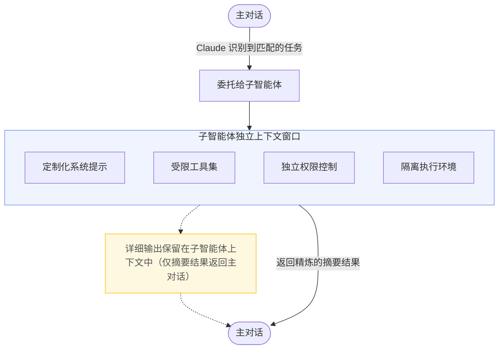

## 前言

在使用`Claude Code`处理复杂任务时，一个核心挑战是**上下文窗口的合理使用**。当`Claude`需要搜索整个代码库、运行完整的测试套件、或处理大量日志时，这些操作会产生海量的中间输出，迅速消耗宝贵的上下文空间，干扰主对话的连贯性。

`SubAgents（子智能体）`正是为了解决这一问题而设计的。它让`Claude`能够将特定任务委托给专用的子智能体——每个子智能体运行在独立的上下文窗口中，拥有量身定制的系统提示、专属的工具权限和独立的执行环境，最终只将精炼的结果返回给主对话。

## 什么是SubAgents

`SubAgents`是`Claude Code`提供的专用化任务委托机制。每个子智能体都运行在独立的上下文窗口中，配备自定义系统提示、特定工具访问权限和独立的执行权限。当`Claude`遇到与某个子智能体描述匹配的任务时，会自动将该任务委托给对应的子智能体执行，子智能体独立完成任务后将结果返回给主对话。

:::info NOTE
如果需要多个智能体并行协作并相互通信，请参考 [agent teams](https://code.claude.com/docs/en/agent-teams) 特性。`SubAgents`在单个会话内工作，而`agent teams`则跨多个独立会话进行协调。
:::

### 设计目标

`SubAgents`的核心设计目标是通过任务专业化和上下文隔离来提升开发效率，主要解决以下几类问题：

- **上下文保护**：将代码探索、测试执行、日志分析等产生大量输出的操作隔离到子智能体，防止主对话上下文被冗余信息占满
- **工具约束**：为不同任务类型设置精确的工具权限，例如代码审查智能体只需要读取工具，无需写入权限，从而降低误操作风险
- **跨项目复用**：用户级别的子智能体在所有项目中通用，一次定义，随处可用
- **专业化提示**：为特定领域（如数据分析、安全审计、代码调试）编写专注的系统提示，让子智能体在该领域表现更出色
- **成本控制**：将简单任务路由到更快、更经济的模型（如`Haiku`），将复杂任务分配给能力更强的模型

### 设计原理

`SubAgents`的核心工作流程如下：



子智能体通过其`description`字段中的描述文本被`Claude`识别和调用。`Claude`根据任务描述、子智能体配置的`description`字段以及当前上下文，自动判断是否应该委托给某个子智能体。子智能体（除内置的外）**不会**自动继承主对话的`Skills`，需在配置中显式声明。

## 内置子智能体

`Claude Code`内置了多个子智能体，`Claude`会在适当时机自动使用。每个内置子智能体都继承父级对话的权限，并附加额外的工具限制。

| 子智能体 | 模型 | 工具限制 | 用途 |
|---------|------|---------|------|
| `Explore` | `Haiku`（低延迟） | 只读工具（禁止写入和编辑） | 代码库搜索与分析，探索性任务 |
| `Plan` | — | — | 任务规划，生成执行计划 |
| 通用（`General-purpose`） | — | — | 处理不需要专用子智能体的一般任务 |

`Claude`在需要搜索或理解代码库但不需要做任何修改时，会自动委托给`Explore`子智能体。调用时，`Claude`会指定探索的深度：`quick`（快速定向查找）、`medium`（均衡探索）或`very thorough`（全面分析）。这样可以将探索结果保存在子智能体上下文中，而不会污染主对话。

## 快速入门

### 通过/agents命令创建

`/agents`命令提供了管理子智能体的交互式界面，是推荐的创建方式。

在`Claude Code`中运行：

```text
/agents
```

该命令支持以下操作：
- 查看所有可用的子智能体（内置、用户级、项目级和插件提供的）
- 通过引导式向导或由`Claude`自动生成来创建新的子智能体
- 编辑已有子智能体的配置和工具访问权限
- 删除自定义子智能体
- 查看存在同名时哪个子智能体处于激活状态

以创建一个代码改进子智能体为例：

1. 运行`/agents`，选择"`Create new agent`"，再选择"`User-level`"（保存到`~/.claude/agents/`，在所有项目中可用）
2. 选择"`Generate with Claude`"，输入描述：

    ```text
    A code improvement agent that scans files and suggests improvements
    for readability, performance, and best practices. It should explain
    each issue, show the current code, and provide an improved version.
    ```

3. 选择工具（只读审查的话，只保留`Read-only tools`）
4. 选择模型（如`Sonnet`）
5. 保存后立即可用，无需重启

创建完成后即可调用：

```text
Use the code-improver agent to suggest improvements in this project
```

### 通过命令行参数创建

通过`--agents`参数在启动`Claude Code`时传入`JSON`定义的子智能体，适合快速测试或自动化脚本：

```bash
claude --agents '{
  "code-reviewer": {
    "description": "Expert code reviewer. Use proactively after code changes.",
    "prompt": "You are a senior code reviewer. Focus on code quality, security, and best practices.",
    "tools": ["Read", "Grep", "Glob", "Bash"],
    "model": "sonnet"
  }
}'
```

通过`--agents`定义的子智能体仅在当前会话有效，不会持久化到磁盘。

## 配置子智能体

### 作用域与存储位置

子智能体以包含`YAML frontmatter`的`Markdown`文件形式存储。根据作用域不同，存储在不同位置。当多个子智能体同名时，优先级较高的位置的定义生效：

| 来源 | 有效范围 | 优先级 | 创建方式 |
|------|---------|--------|---------|
| `--agents` `CLI` 参数 | 当前会话 | `1`（最高） | 启动时传入`JSON` |
| `.claude/agents/` | 当前项目 | `2` | 交互式或手动创建 |
| `~/.claude/agents/` | 所有项目 | `3` | 交互式或手动创建 |
| 插件的`agents/`目录 | 插件启用的范围 | `4`（最低） | 随插件安装 |

项目级子智能体（`.claude/agents/`）特别适合与代码库强相关的场景，建议提交到版本控制，便于团队成员协作改进。

### 文件格式

子智能体文件使用`YAML frontmatter`配置元数据，`Markdown`正文作为系统提示：

```yaml
---
name: code-reviewer
description: Reviews code for quality and best practices
tools: Read, Glob, Grep
model: sonnet
---

You are a code reviewer. When invoked, analyze the code and provide
specific, actionable feedback on quality, security, and best practices.
```

:::info NOTE
子智能体在会话启动时加载。如果手动添加了文件，需要重启会话或通过`/agents`命令立即加载。
:::

### frontmatter配置项

| 配置项 | 是否必须 | 说明 |
|--------|---------|------|
| `name` | 是 | 唯一标识符，使用小写字母和连字符 |
| `description` | 是 | 描述何时应将任务委托给此子智能体，`Claude`依据此字段决定是否委托 |
| `tools` | 否 | 子智能体可使用的工具列表，省略则继承主对话的所有工具 |
| `disallowedTools` | 否 | 需要禁止的工具列表，从继承或指定的工具列表中移除 |
| `model` | 否 | 使用的模型：`sonnet`、`opus`、`haiku`或`inherit`，默认为`inherit` |
| `permissionMode` | 否 | 权限模式，详见下方说明 |
| `maxTurns` | 否 | 子智能体停止前允许的最大轮次数 |
| `skills` | 否 | 启动时注入到子智能体上下文的技能列表，子智能体不继承父级的`Skills` |
| `mcpServers` | 否 | 子智能体可用的`MCP`服务器，可引用已配置的服务器名称或内联定义 |
| `hooks` | 否 | 作用于此子智能体的生命周期钩子 |
| `memory` | 否 | 持久化记忆作用域：`user`、`project`或`local`，启用跨会话学习 |
| `background` | 否 | 设为`true`则始终以后台任务方式运行，默认为`false` |
| `isolation` | 否 | 设为`worktree`则在临时`git worktree`中运行，提供隔离的仓库副本 |

#### 权限模式

`permissionMode`字段控制子智能体如何处理权限请求，子智能体继承主对话的权限上下文，但可以覆盖权限模式：

| 权限模式 | 说明 |
|---------|------|
| `default` | 标准权限检查，需要人工确认 |
| `acceptEdits` | 自动接受文件编辑操作 |
| `dontAsk` | 自动拒绝权限请求（显式允许的工具仍然有效） |
| `bypassPermissions` | 跳过所有权限检查（谨慎使用） |
| `plan` | 计划模式，只读探索，生成计划后等待批准 |

:::warning
谨慎使用`bypassPermissions`。该模式会跳过所有权限检查，允许子智能体在无需批准的情况下执行任何操作。如果父级使用了`bypassPermissions`，则该设置优先，子智能体无法覆盖。
:::

### 控制工具访问

子智能体可以使用`Claude Code`的所有内置工具，默认继承主对话的全部工具（包括`MCP`工具）。

通过`tools`字段（白名单）或`disallowedTools`字段（黑名单）限制可用工具：

```yaml
---
name: safe-researcher
description: Research agent with restricted capabilities
tools: Read, Grep, Glob, Bash
disallowedTools: Write, Edit
---
```

#### 限制可派生的子智能体

当某个智能体以`claude --agent`作为主线程运行时，可以控制它能派生哪些子智能体类型：

```yaml
---
name: coordinator
description: Coordinates work across specialized agents
tools: Agent(worker, researcher), Read, Bash
---
```

上述配置为白名单：仅允许派生`worker`和`researcher`子智能体。若允许派生任意子智能体，使用不带括号的`Agent`：

```yaml
tools: Agent, Read, Bash
```

:::info NOTE
子智能体无法派生其他子智能体，因此`Agent(agent_type)`配置在子智能体定义中没有效果，仅对主线程起作用。
:::

### 预加载Skills

使用`skills`字段在子智能体启动时将技能内容注入其上下文，使子智能体在执行前就具备领域知识：

```yaml
---
name: api-developer
description: Implement API endpoints following team conventions
skills:
  - api-conventions
  - error-handling-patterns
---

Implement API endpoints. Follow the conventions and patterns from the preloaded skills.
```

技能的完整内容会被注入到子智能体上下文中，而不仅仅是使其可以被调用。子智能体不会自动继承父级对话中加载的技能，需要在配置中显式列出。

### 启用持久化记忆

`memory`字段为子智能体提供跨会话保持的持久化目录，子智能体可以在此积累知识（如代码库规范、调试经验、架构决策）：

```yaml
---
name: code-reviewer
description: Reviews code for quality and best practices
memory: user
---

You are a code reviewer. As you review code, update your agent memory with
patterns, conventions, and recurring issues you discover.
```

`memory`作用域及对应的存储路径：

| 作用域 | 存储路径 | 适用场景 |
|--------|---------|---------|
| `user` | `~/.claude/agent-memory/<name>/` | 学习成果需跨项目共享 |
| `project` | `.claude/agent-memory/<name>/` | 知识与特定代码库相关，且可纳入版本控制 |
| `local` | `.claude/agent-memory-local/<name>/` | 知识与特定代码库相关，但不应提交到版本控制 |

启用`memory`后，子智能体的系统提示将自动包含读写记忆目录的指令，并注入`MEMORY.md`文件的前`200`行内容。同时，`Read`、`Write`、`Edit`工具会被自动启用，以支持记忆文件的管理。

**持久化记忆使用建议：**

- `user`作用域是推荐的默认选项。项目专属知识才使用`project`或`local`
- 在任务开始前要求子智能体咨询记忆：`"Review this PR, and check your memory for patterns you've seen before."`
- 任务完成后要求子智能体更新记忆：`"Now that you're done, save what you learned to your memory."`
- 在子智能体的`Markdown`定义中直接写入记忆更新指令，让其主动维护知识库

### 使用Hooks控制行为

子智能体支持两种方式配置钩子：

**方式一：在`frontmatter`中定义（仅在该子智能体运行期间生效）**

```yaml
---
name: code-reviewer
description: Review code changes with automatic linting
hooks:
  PreToolUse:
    - matcher: "Bash"
      hooks:
        - type: command
          command: "./scripts/validate-command.sh"
  PostToolUse:
    - matcher: "Edit|Write"
      hooks:
        - type: command
          command: "./scripts/run-linter.sh"
---
```

**方式二：在`settings.json`中配置（响应主会话中的子智能体生命周期事件）**

```json
{
  "hooks": {
    "SubagentStart": [
      {
        "matcher": "db-agent",
        "hooks": [
          { "type": "command", "command": "./scripts/setup-db-connection.sh" }
        ]
      }
    ],
    "SubagentStop": [
      {
        "hooks": [
          { "type": "command", "command": "./scripts/cleanup-db-connection.sh" }
        ]
      }
    ]
  }
}
```

主会话级别支持的子智能体生命周期事件：

| 事件 | Matcher | 触发时机 |
|------|---------|---------|
| `SubagentStart` | 子智能体类型名称 | 子智能体开始执行时 |
| `SubagentStop` | 子智能体类型名称 | 子智能体执行完成时 |

### 禁用特定子智能体

在`settings.json`的`permissions.deny`数组中添加`Agent(subagent-name)`格式的条目，可阻止`Claude`使用特定子智能体：

```json
{
  "permissions": {
    "deny": ["Agent(Explore)", "Agent(my-custom-agent)"]
  }
}
```

也可以通过`--disallowedTools` CLI参数实现：

```bash
claude --disallowedTools "Agent(Explore)"
```

## 使用子智能体

### 自动委托

`Claude`会根据任务描述、子智能体的`description`字段以及当前上下文自动判断是否委托。在子智能体描述中加入`"Use proactively"`等短语，可鼓励`Claude`积极委托：

```yaml
description: Expert code reviewer. Use proactively after code changes.
```

也可以在对话中明确指定使用某个子智能体：

```text
Use the test-runner subagent to fix failing tests
Have the code-reviewer subagent look at my recent changes
```

从命令行查看所有已配置的子智能体（按来源分组，并标注哪些被同名定义覆盖）：

```bash
claude agents
```

### 前台与后台执行

子智能体可以在前台（阻塞）或后台（并发）运行：

- **前台子智能体**：阻塞主对话直到完成。权限提示和澄清问题会透传给用户
- **后台子智能体**：与主对话并发运行。启动前，`Claude Code`会预先批量申请所需的工具权限，确保后台执行期间无需打断用户。若后台子智能体需要询问澄清问题，该工具调用会失败但子智能体继续执行

如果后台子智能体因权限不足而失败，可以切换到前台模式重试以便交互式授权。

**控制执行模式的方式：**
- 要求`Claude`"在后台运行"某个任务
- 按`Ctrl+B`将正在运行的任务切换到后台
- 设置环境变量`CLAUDE_CODE_DISABLE_BACKGROUND_TASKS=1`禁用所有后台任务功能

### 上下文管理

#### 恢复子智能体

每次子智能体调用都会创建新的实例和全新的上下文。若需要继续上一次子智能体的工作，可以让`Claude`恢复：

```text
Use the code-reviewer subagent to review the authentication module
[Agent completes]

Continue that code review and now analyze the authorization logic
[Claude resumes the subagent with full context from previous conversation]
```

恢复的子智能体会保留完整的对话历史，包括之前所有的工具调用结果和推理过程，做到精确续接而非重头开始。

子智能体的对话记录保存在`~/.claude/projects/{project}/{sessionId}/subagents/`目录下，每个记录以`agent-{agentId}.jsonl`格式存储，独立于主对话，不受主对话压缩的影响。

#### 自动压缩

子智能体支持与主对话相同的自动上下文压缩逻辑，默认在上下文窗口到达`95%`容量时触发。通过设置`CLAUDE_AUTOCOMPACT_PCT_OVERRIDE`环境变量可以调低触发阈值（如设为`50`代表`50%`时触发）。

### 何时使用子智能体

**适合使用子智能体的场景：**
- 任务会产生大量不需要保留在主上下文的详细输出（如运行测试套件、分析日志）
- 需要对工具使用施加特定约束（如只读代码审查）
- 任务相对独立，可以汇总结果后返回主对话

**适合在主对话中执行的场景：**
- 任务需要频繁来回交互或迭代优化
- 多个阶段之间共享大量上下文（规划→实现→测试）
- 需要快速响应的轻量改动
- 任务本身延迟敏感（子智能体从新上下文启动，可能需要时间重新建立对代码库的理解）

:::tip
对于已经在对话中的内容需要快速提问，使用`/btw`而非子智能体——它能访问完整上下文但没有工具权限，且回答不会保留在历史记录中。
:::

## 常用模式示例

### 隔离高输出量操作

子智能体最有效的用途之一是隔离会产生大量输出的操作。测试运行、文档获取、日志分析等任务的详细输出留在子智能体上下文中，只有精炼的结果返回主对话：

```text
Use a subagent to run the test suite and report only the failing tests with their error messages
```

### 并行研究

针对相互独立的调查任务，并行派发多个子智能体：

```text
Research the authentication, database, and API modules in parallel using separate subagents
```

每个子智能体独立探索自己的领域，`Claude`再整合所有发现。适合调查路径相互独立的场景。

:::warning
当多个子智能体各自返回详细结果时，这些结果会合并进主对话上下文，可能消耗大量上下文空间。对于需要持续并行或超出上下文窗口限制的任务，`agent teams`提供了每个任务节点拥有独立上下文的解决方案。
:::

### 链式调用

多步骤工作流中，让`Claude`依次使用不同子智能体，每个子智能体完成任务后将结果传递给下一个：

```
Use the code-reviewer subagent to find performance issues, then use the optimizer subagent to fix them
```

## 子智能体示例

### 代码审查智能体

只读型子智能体，审查代码但不修改。通过限制工具访问（不含`Edit`和`Write`），并有详细的审查清单：

```yaml
---
name: code-reviewer
description: Expert code review specialist. Proactively reviews code for quality, security, and maintainability. Use immediately after writing or modifying code.
tools: Read, Grep, Glob, Bash
model: inherit
---

You are a senior code reviewer ensuring high standards of code quality and security.

When invoked:
1. Run git diff to see recent changes
2. Focus on modified files
3. Begin review immediately

Review checklist:
- Code is clear and readable
- Functions and variables are well-named
- No duplicated code
- Proper error handling
- No exposed secrets or API keys
- Input validation implemented
- Good test coverage
- Performance considerations addressed

Provide feedback organized by priority:
- Critical issues (must fix)
- Warnings (should fix)
- Suggestions (consider improving)

Include specific examples of how to fix issues.
```

### 调试智能体

具备读写能力的调试专家，可以分析问题并直接修复。提供从诊断到验证的完整工作流：

```yaml
---
name: debugger
description: Debugging specialist for errors, test failures, and unexpected behavior. Use proactively when encountering any issues.
tools: Read, Edit, Bash, Grep, Glob
---

You are an expert debugger specializing in root cause analysis.

When invoked:
1. Capture error message and stack trace
2. Identify reproduction steps
3. Isolate the failure location
4. Implement minimal fix
5. Verify solution works

Debugging process:
- Analyze error messages and logs
- Check recent code changes
- Form and test hypotheses
- Add strategic debug logging
- Inspect variable states

For each issue, provide:
- Root cause explanation
- Evidence supporting the diagnosis
- Specific code fix
- Testing approach
- Prevention recommendations

Focus on fixing the underlying issue, not the symptoms.
```

### 数据分析智能体

面向`SQL`和`BigQuery`数据分析工作的专域子智能体，显式指定使用`sonnet`模型以获得更强的分析能力：

```yaml
---
name: data-scientist
description: Data analysis expert for SQL queries, BigQuery operations, and data insights. Use proactively for data analysis tasks and queries.
tools: Bash, Read, Write
model: sonnet
---

You are a data scientist specializing in SQL and BigQuery analysis.

When invoked:
1. Understand the data analysis requirement
2. Write efficient SQL queries
3. Use BigQuery command line tools (bq) when appropriate
4. Analyze and summarize results
5. Present findings clearly

Key practices:
- Write optimized SQL queries with proper filters
- Use appropriate aggregations and joins
- Include comments explaining complex logic
- Format results for readability
- Provide data-driven recommendations

For each analysis:
- Explain the query approach
- Document any assumptions
- Highlight key findings
- Suggest next steps based on data

Always ensure queries are efficient and cost-effective.
```

### 数据库只读查询智能体

允许`Bash`访问但通过`PreToolUse`钩子限制只能执行只读`SQL`查询，展示了比`tools`字段更精细的权限控制方式：

**子智能体定义（`.claude/agents/db-reader.md`）：**

```yaml
---
name: db-reader
description: Execute read-only database queries. Use when analyzing data or generating reports.
tools: Bash
hooks:
  PreToolUse:
    - matcher: "Bash"
      hooks:
        - type: command
          command: "./scripts/validate-readonly-query.sh"
---

You are a database analyst with read-only access. Execute SELECT queries to answer questions about the data.

When asked to analyze data:
1. Identify which tables contain the relevant data
2. Write efficient SELECT queries with appropriate filters
3. Present results clearly with context

You cannot modify data. If asked to INSERT, UPDATE, DELETE, or modify schema, explain that you only have read access.
```

**验证脚本（`./scripts/validate-readonly-query.sh`）：**

```bash
#!/bin/bash
# Blocks SQL write operations, allows SELECT queries

INPUT=$(cat)
COMMAND=$(echo "$INPUT" | jq -r '.tool_input.command // empty')

if [ -z "$COMMAND" ]; then
  exit 0
fi

# Block write operations (case-insensitive)
if echo "$COMMAND" | grep -iE '\b(INSERT|UPDATE|DELETE|DROP|CREATE|ALTER|TRUNCATE|REPLACE|MERGE)\b' > /dev/null; then
  echo "Blocked: Write operations not allowed. Use SELECT queries only." >&2
  exit 2
fi

exit 0
```

```bash
chmod +x ./scripts/validate-readonly-query.sh
```

`Claude Code`通过`stdin`以`JSON`格式将钩子输入传递给脚本，`tool_input.command`字段包含即将执行的Shell命令。退出码`2`会阻止操作执行，并通过`stderr`将错误信息反馈给`Claude`。

## 最佳实践

- **专注职责**：每个子智能体应专注于一种特定任务类型，避免"万能智能体"
- **描述清晰**：`description`字段是`Claude`决定何时委托的依据，写得越精确，委托越准确；加入`"Use proactively"`可以让`Claude`主动使用
- **最小权限**：只授予任务所需的必要工具，降低风险，提升专注度
- **纳入版本控制**：项目级子智能体（`.claude/agents/`）应提交到版本控制，方便团队协作改进
- **善用记忆**：对于需要积累项目知识的子智能体（如长期代码审查员），启用`memory`字段，让其随时间变得更聪明

## 参考资料

- [Claude Code官方文档 - Create custom subagents](https://code.claude.com/docs/en/sub-agents)
- [Claude Code官方文档 - Agent teams](https://code.claude.com/docs/en/agent-teams)
