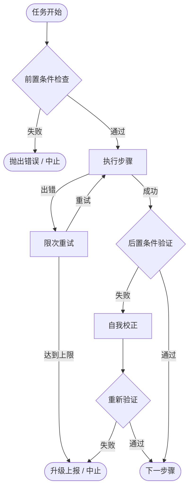
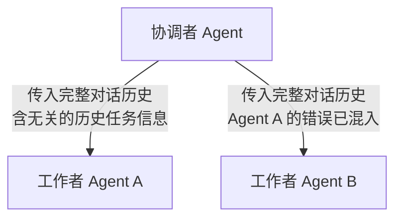
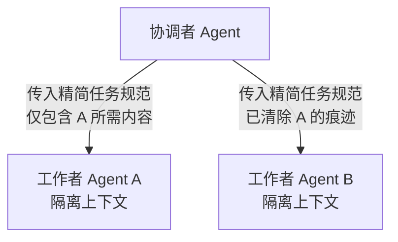
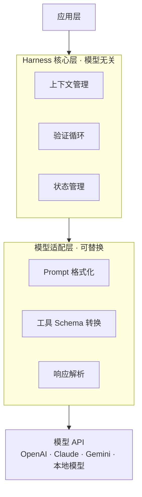
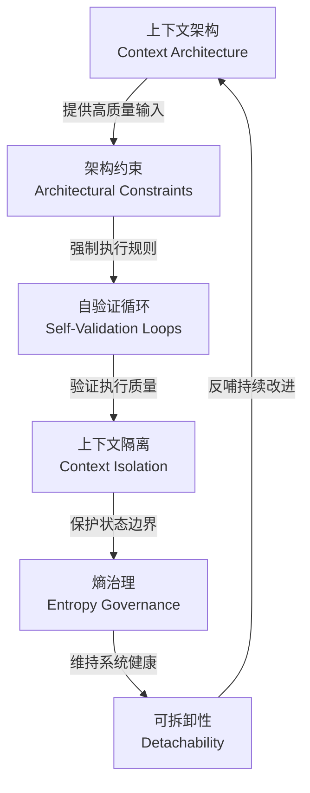

## 前言

当我们观察一辆高性能赛车时，驾驶员的技术固然重要，但更关键的是整套车辆工程系统——转向系统、刹车系统、悬挂系统、仪表盘——这些围绕引擎构建的系统，才是赛车能够高速安全行驶的根本保障。

`AI Agent`开发面临同样的本质问题：模型本身的智能能力是"引擎"，但引擎再强劲，若缺乏指引方向的"指南针"和确保安全的"刹车系统"，最终的结果往往是在高速行驶中迷失方向或失控。

这正是 **Harness Engineering（驾驭工程）** 诞生的背景。

## 什么是Harness Engineering


`Harness Engineering`（驾驭工程）是`AI Agent`开发领域中一个关键的工程方法论，其核心理念是：

> **通过优化模型周围的系统，而非频繁更换模型本身，来提升`Agent`的可靠性。**

这一理念可以用一个简洁的等式来表达：

```text
Agent = Model + Harness
```

其中：

- **`Model`（模型）**：是`Agent`的智能引擎，提供理解、推理、生成等核心能力，如`GPT`、`Claude`、`Gemini`等大模型
- **`Harness`（驾驭系统）**：是围绕模型构建的工程系统，包括上下文管理、约束执行、验证循环、状态隔离等一系列工程机制

汽车比喻在这里尤为贴切：**模型是引擎，`Harness`是指南针和刹车系统**。一辆没有方向盘和刹车的跑车，无论引擎功率多大，都是一场灾难。同样，一个缺乏`Harness`工程保障的`AI Agent`，无论模型能力多强，在真实复杂场景中都将面临不可预测的失败。

## 技术背景与问题由来

在`AI Agent`开发初期，大多数工程师将精力集中在两件事上：选择更好的模型，以及优化`prompt`（提示词）。这种"模型中心论"的开发范式带来了显著的局限性：

**问题一：上下文窗口的性能墙**

研究发现，当大模型的上下文窗口利用率超过`40%`时，模型的推理质量会出现明显下滑。在长时间运行的`Agent`任务中，上下文会不断积累历史对话、工具调用记录、中间结果，最终导致模型"信息过载"，输出质量大幅下降。

**问题二：Prompt的脆弱性**

通过`prompt`要求模型遵守规则，本质上是在依赖模型的"自律性"。而大模型在复杂场景中是天然不稳定的——同样的规则描述，在不同的上下文状态下可能产生截然不同的执行效果。

**问题三：多Agent协作的污染效应**

当多个`Agent`协作完成任务时，不同`Agent`的上下文互相污染，导致决策偏差、责任边界模糊、调试极其困难。

**问题四：无终止的执行循环**

`Agent`在执行复杂任务时容易陷入无意义的循环：反复重试失败操作、跳过关键验证步骤、在无进展状态下持续消耗`token`。

**问题五：系统熵增导致的维护危机**

随着`Agent`系统不断演进，上下文状态、配置规则、工具约束逐渐积累成难以维护的复杂混乱状态，最终导致系统不可预测性急剧上升。

`Harness Engineering`正是为了系统性解决上述问题而提出的工程方法论。

## 六大支柱


`Harness Engineering`的实践体系由六大核心支柱构成，每个支柱针对不同层面的可靠性挑战。

### 上下文架构（Context Architecture）


**核心理念**：精准设计进入模型上下文的信息，避免信息过载。

上下文架构是`Harness Engineering`最基础也最关键的支柱。研究表明，模型上下文窗口利用率超过`40%`后，推理质量开始显著下降。这意味着让模型"少想"有时比让模型"多看"更重要。

| 设计原则 | 说明 | 工程实践 |
|---------|------|---------|
| 信息优先级分层 | 区分关键信息与辅助信息，优先保留决策所需的核心内容 | 动态裁剪低优先级历史记录 |
| 滚动窗口管理 | 超出窗口容量时，智能压缩或归档旧上下文 | 实现滑动窗口与摘要压缩机制 |
| 结构化上下文 | 使用清晰的结构区分系统指令、任务上下文与工具结果 | 分隔符标记、`XML`标签组织上下文块 |
| 延迟加载 | 仅在需要时才将相关信息注入上下文 | 工具调用时按需加载资源描述 |
| 上下文健康监控 | 实时追踪上下文利用率，达到阈值时触发清理 | `token`计数监控与预警机制 |

**上下文生命周期管理**

上下文架构的核心是为上下文建立完整的生命周期管理机制，而非被动等待模型性能劣化。完整的生命周期包含以下四个阶段：

| 阶段 | 触发时机 | 核心操作 | 目标 |
|-----|---------|---------|------|
| 注入阶段 | 任务开始或新轮次 | 按优先级选取必要信息注入上下文 | 保证模型获得最相关的输入 |
| 监控阶段 | 运行时持续 | 实时统计`token`用量，计算利用率 | 感知上下文健康状态 |
| 压缩阶段 | 利用率超过`40%`阈值 | 将历史轮次摘要化，裁剪低优先级内容 | 释放空间，保留关键信息 |
| 归档阶段 | 任务完成或会话结束 | 将有价值的中间结论迁移至持久存储 | 支持跨会话知识积累 |

**Claude Code 实践参考**

`Claude Code`在上下文架构上的设计是业内较为完善的参考实现：

- **结构化注入**：`CLAUDE.md`作为项目级上下文的核心载体，在每次会话启动时自动加载到上下文窗口，充当"项目手册"。开发者可通过`/init`命令自动生成并持续更新它。
- **分层记忆系统**：`/memories/`目录按三个作用域分层管理持久化知识——用户记忆（跨工作区全局生效）、会话记忆（当次会话）、仓库记忆（当前项目）。前`200`行核心文件在会话开始时自动加载，其余按需读取，天然实现了延迟加载。
- **按需读取**：`Claude Code`默认不会一次性读入所有文件，而是通过工具（`read_file`、`grep_search`等）在推理过程中按需拉取内容，有效控制上下文膨胀速度。

**不足与替代实践**：`Claude Code`没有内置的自动上下文压缩触发机制。当上下文窗口接近上限时，需要用户手动执行`/compact`命令触发蒸馏，或开启新会话。开发者可在`CLAUDE.md`中显式约定规则，例如"当处理超过`5`个文件的大任务时，每完成一个阶段主动用一段摘要替代详细步骤记录"，以弥补自动压缩能力的缺失。

### 架构约束（Architectural Constraints）


**核心理念**：用工具和代码强制执行规则，而非依赖`prompt`软约束。

这是`Harness Engineering`最反直觉的一个原则。当我们在`prompt`中写下"请不要删除用户数据"时，我们是在用语言劝说一个随机采样系统。而架构约束的做法是：**代码层面根本不提供删除功能，或在工具定义时强制要求二次确认**。

| 约束类型 | 描述 | 实现方式 |
|---------|------|---------|
| 工具白名单 | 只暴露安全的工具集合给`Agent` | 根据任务类型动态注册工具 |
| 参数类型约束 | 用强类型定义工具参数，拒绝非法输入 | `Pydantic`、`TypeScript`类型系统 |
| 权限分层 | 不同操作需要不同级别的授权 | 读操作自动，写操作需确认，删除操作双重确认 |
| 幂等性设计 | 确保重复执行同一操作不会产生副作用 | 工具层实现幂等校验 |
| 沙箱隔离 | 危险操作在隔离环境中预先模拟 | 代码执行使用容器隔离 |

**架构约束的工具落地**

架构约束的核心在于用工程手段替代`prompt`劝说。落地时应遵循以下设计原则：

**工具设计的约束原则**

- **最小权限暴露**：`Agent`在任何时刻只应获得当前任务最小所需的工具集合，而非全量工具列表。应按任务阶段动态注册工具，而非一次性暴露所有工具。
- **操作分级授权**：将所有工具操作按风险等级分为三级——只读操作自动执行；写操作生成操作计划后等待确认；破坏性操作（删除、重置等）强制双重确认，甚至从工具定义中彻底移除。
- **强类型参数定义**：使用`JSON Schema`或`OpenAPI`规范严格定义工具的输入参数类型、取值范围和必填项，拒绝一切不符合规范的调用请求，在架构层防止参数注入和路径穿越。
- **幂等性设计**：所有写操作工具应在设计层保证幂等性。相同参数的重复调用不产生副作用，`Agent`可安全重试而不造成数据异常。

**Claude Code 实践参考**

`Claude Code`将架构约束设计为核心的权限模型，是该支柱最直接的工程实现：

- **分级权限模式**：内置四种权限模式，通过`Shift+Tab`循环切换，将操作风险与授权级别强制绑定：

  | 模式 | 行为 | 适用场景 |
  |-----|------|---------|
  | `default` | 文件编辑和`Shell`命令均需逐一确认 | 日常开发，保持最高审查 |
  | `acceptEdits` | 文件编辑自动执行，命令仍需确认 | 确认写操作安全后加速 |
  | `plan` | 只读操作，生成计划等待批准再执行 | 复杂任务前的方案审查 |
  | `bypassPermissions` | 跳过所有权限检查 | 受信任的自动化脚本场景 |

- **工具级黑白名单**：通过`.claude/settings.json`中的`allowedTools`和`deniedTools`配置，可精确控制`Claude Code`可使用的工具范围，实现工具白名单的架构约束。
- **`MCP`工具扩展约束**：通过`MCP`（`Model Context Protocol`）接入的外部工具，其参数校验由`MCP`服务器侧负责，天然将约束逻辑与`Agent`主体解耦。

**不足与替代实践**：`Claude Code`对工具参数的细粒度约束依赖`MCP`服务器实现，内置工具（如`run_in_terminal`）缺乏参数白名单机制。对于高风险操作，替代实践是在`CLAUDE.md`的操作规范（`operationalSafety`）章节中显式声明安全准则，例如"删除文件前必须先与用户确认"、"禁用`--force`和`--no-verify`参数"，将架构约束退化为可强制审查的提示约束。

### 自验证循环（Self-Validation Loops）


**核心理念**：在`Agent`执行流程中内置验证检查点，防止死循环与静默失败。

`Agent`在无人监督的情况下执行复杂任务时，最危险的两种状态是：
1. 无意义的重试循环（消耗大量资源却无进展）
2. 静默地跳过关键验证步骤（生成看似正常却实际错误的结果）

自验证循环通过在每个重要操作节点插入验证逻辑来解决这两个问题。

**自验证循环设计要素**



| 验证类型 | 触发时机 | 验证内容 |
|---------|---------|---------|
| 前置条件验证 | 任务开始前 | 环境就绪、权限充足、输入格式正确 |
| 步骤后验证 | 每步执行后 | 输出符合预期、状态变更符合设计 |
| 进展检测 | 多步执行后 | 检测是否有实质进展，防止原地循环 |
| 终止条件检查 | 持续运行任务 | 是否满足完成条件或中止条件 |

**自验证循环的设计方法**

有效的自验证循环需要明确回答三个设计问题：

**① 如何判断"有进展"？**

不能仅凭`Agent`是否产生输出来判断进展，而应通过**状态指纹比对**来检测。每次执行后对关键状态（任务完成度、已解锁资源、已修改文件等）计算摘要，连续多轮摘要无变化即为停滞循环，应触发升级或中止。

**② 如何设置终止边界？**

应以"预算"而非"无限循环"的心态设计`Agent`执行边界：

- 设置**最大迭代次数**（如`20`次），超出则强制中止并上报
- 设置**时间预算**，超过任务时限则中断并保存中间状态
- 设置**停滞容忍阈值**（如连续`3`轮无进展），触发自我校正或降级处理

**③ 错误后如何处理？**

自验证循环要求`Agent`不允许静默忽略错误。当步骤后验证失败时应依次尝试：自我校正（重新分析并修正当前步骤）→ 换策略重试 → 升级到人工确认 → 彻底中止并生成诊断报告。

**Claude Code 实践参考**

`Claude Code`的智能体循环（`Agentic Loop`）本质上就是一个自然的自验证循环——执行工具、观察结果、调整策略，循环迭代直至任务完成：

- **`plan`模式作前置验证**：切换到`plan`权限模式后，`Claude Code`只执行只读操作并生成完整执行计划，用户审批计划后方可推进，充当任务的"前置条件验证"关卡。
- **工具结果驱动验证**：`Claude Code`在编写代码后会主动调用构建工具（`go build`、`npm run build`等）和测试工具（`go test`、`pytest`等）以验证变更正确性，将工具执行结果作为步骤后验证的依据。
- **错误自适应**：当工具调用返回错误时，`Claude Code`不会静默跳过，而是根据错误信息调整策略重试，并在多次失败后主动向用户说明障碍并请求指引。
- **`Hooks`机制**：通过`Claude Code Hooks`（如`PostToolUse`钩子），开发者可以在每次工具调用后自动触发验证脚本，将自定义验证逻辑硬编码进执行流程。

**不足与替代实践**：`Claude Code`没有内置"最大迭代次数"的硬性限制，也没有进展停滞检测机制。当任务陷入困境时，`Claude Code`有时会过于"执着"地重试相同方案。弥补方法是在`CLAUDE.md`中显式约定终止规则，例如"如果同一问题连续尝试超过`3`次均失败，停止尝试并向用户报告当前状态和障碍，不要继续猜测"，将终止边界以文字规范的形式植入`Harness`。

### 上下文隔离（Context Isolation）


**核心理念**：多`Agent`协作时，保持每个`Agent`上下文的纯净性，防止跨越边界的信息污染。

在多`Agent`架构（如协调者-执行者模式、流水线模式）中，上下文污染是可靠性的头号杀手。当一个`Agent`的内部状态、中间推理或错误信息渗漏到另一个`Agent`的上下文中时，会引发一系列难以调试的级联问题。

**典型污染场景**



**隔离后的正确模式**



| 隔离策略 | 说明 | 适用场景 |
|---------|------|---------|
| 任务边界隔离 | 每个子任务使用全新上下文，只传入必要的任务定义 | 并行工作者、独立子任务 |
| 信息接口化 | `Agent`间通过结构化消息传递，而非原始上下文共享 | 流水线式多`Agent`协作 |
| 错误隔离 | 一个`Agent`的错误状态不传播到下游`Agent` | 任何多`Agent`系统 |
| 角色上下文分离 | 系统角色信息与任务信息严格分层 | 长期运行的`Agent` |

**Claude Code 实践参考**

`Claude Code`通过`SubAgents`（子代理）和`Agent Teams`（代理团队）机制，在工具层面提供了上下文隔离能力：

- **`SubAgents`隔离**：`Claude Code`可以通过`runSubagent`工具启动子代理执行特定任务。每个子代理拥有**完全独立的上下文窗口**，主代理只向子代理传入精简后的任务描述和必要参数，子代理的内部推理过程、中间状态和错误信息不会回流污染主代理上下文。
- **`Agent Teams`协作隔离**：在代理团队模式下，多个专注特定领域的代理（如代码审查代理、测试代理、文档代理）各自维护独立上下文，通过结构化消息交接工作成果，而非共享原始会话历史。
- **记忆作用域隔离**：`session`记忆（会话级）、`user`记忆（用户级）、`repo`记忆（仓库级）三个作用域天然隔离，不同会话之间的临时状态不会相互干扰。

**不足与替代实践**：在单一会话内，`Claude Code`没有自动的任务间上下文清理机制。当一个长会话中连续处理多个不相关任务时，早期任务的上下文细节（特别是错误信息和异常状态）会残留并潜在地干扰后续任务的判断。替代实践是为每个独立任务主动开启新会话，并在`CLAUDE.md`中将项目级通用知识固化，而非依赖会话历史传递。对于确实需要在单会话内处理多任务的场景，可在任务切换时使用`/clear`重置对话历史，再通过`CLAUDE.md`恢复必要的项目上下文。

### 熵治理（Entropy Governance）


**核心理念**：建立自维护机制，对抗`Agent`系统中上下文和状态的自然熵增趋势。

热力学第二定律告诉我们，孤立系统的熵（无序度）只会增加。`Agent`系统也不例外——随着任务执行，上下文不断积累，规则不断叠加，工具调用记录不断增长，系统状态越来越复杂，最终变得难以预测和维护。

熵治理的目标是建立**自维护的闭环机制**，让系统能够定期清理、压缩、重组自身状态，保持长期健康。

**熵的来源分析**

```text
上下文熵增的来源：
  - 持续累积的对话历史
  - 工具调用轨迹与中间结果
  - 随时间叠加的矛盾指令
  - 死亡状态引用（已不存在的任务）
  - 大量重复信息挤占上下文空间
```

| 熵治理手段 | 实施方式 | 效果 |
|---------|---------|------|
| 定期上下文蒸馏 | 将累积历史压缩为结构化摘要 | 减少冗余，保留关键信息 |
| 状态清理检查点 | 阶段性任务完成后清除中间状态 | 防止历史状态污染新任务 |
| 规则冲突检测 | 自动识别积累的矛盾指令并告警 | 维护规则一致性 |
| 死亡引用清理 | 清理指向已不存在资源的上下文引用 | 防止幽灵状态引发误判 |
| 知识蒸馏沉淀 | 将宝贵经验从临时上下文迁移到持久知识库 | 跨会话知识积累 |

**熵治理的设计方法**

熵治理需要建立系统性的"清洁维护"机制，类似于数据库的定期`VACUUM`操作，保持系统状态的持续整洁。

**上下文蒸馏设计**

上下文蒸馏是熵治理最核心的手段，其设计原则是：**保留决策结论，丢弃推理过程**。蒸馏时应明确区分需要保留和可以丢弃的信息：

| 应保留的内容 | 可丢弃的内容 |
|------------|------------|
| 已做出的决策及理由 | 冗长的中间推理链 |
| 已发现的关键事实 | 失败的探索路径 |
| 当前任务状态快照 | 重复出现的相同内容 |
| 已遭遇的错误及规避方案 | 已过期的临时状态 |

**关键检查点设计**

在`Agent`系统设计阶段应预先规划"熵控检查点"，即阶段性任务边界在完成时自动触发以下清理动作：

1. 将当前阶段的核心结论压缩写入"阶段摘要"区域
2. 清空该阶段产生的所有中间工具调用记录
3. 将有价值的领域知识（非任务相关）写入外部持久知识库
4. 重置内部状态至干净的初始形态，为下一阶段准备

**Claude Code 实践参考**

`Claude Code`的记忆体系是熵治理思想的直接落地——通过分层记忆机制和自维护闭环，对抗上下文熵增：

- **自动记忆写入（Auto Memory）**：这是`Claude Code`最具代表性的熵治理手段。当`Claude Code`在协作过程中发现有价值的信息（如项目构建命令、调试技巧、用户偏好纠正等），会自动将其写入`/memories/`持久化，让宝贵经验跨会话沉淀，避免每次会话从零开始。
- **`/compact`命令**：手动触发上下文蒸馏。执行后`Claude Code`会将当前对话中的关键决策和状态压缩为结构化摘要，替换冗长的历史交互，释放上下文空间的同时保留核心知识。
- **`CLAUDE.md`的`/init`更新**：`/init`命令不仅可创建`CLAUDE.md`，也可定期重新分析项目结构并更新，相当于对项目知识进行"重新蒸馏"，清理过时的描述和失效的规则。
- **记忆分层归档**：`session`记忆在会话结束后自动失效（天然熵清理），`user`记忆和`repo`记忆作为持久层长期积累高价值知识，形成自然的信息过滤机制。

**不足与替代实践**：`Claude Code`的自动记忆写入是被动触发的（由`Claude Code`自行判断是否值得记录），缺乏定时清理过期记忆的主动机制。随着时间推移，`/memories/`目录中可能积累了大量已过时或矛盾的记忆条目。替代实践是在`CLAUDE.md`中建立记忆维护约定，例如要求`Claude Code`在每次会话结束时审查`/memories/session/`目录并更新关键进展，以及定期（每周或每个里程碑后）人工审查`/memories/repo/`中的过时条目并清理。

### 可拆卸性（Detachability）


**核心理念**：以模块化设计构建`Harness`系统，使其能够随着模型的迭代进化而优雅适配。

`AI`模型迭代速度极快。今天针对`GPT-4.5`精调的`Harness`系统，明天可能需要适配`Claude 4.5`的能力特性，后天又需要对接开源模型。如果`Harness`与特定模型深度耦合，每次模型更换都意味着大规模重构。

可拆卸性原则要求将`Harness`系统中与模型强相关的部分设计为**可插拔的适配层**。

**可拆卸性架构**



| 可拆卸性设计要点 | 说明 |
|--------------|------|
| 抽象模型接口 | 定义统一的模型调用接口，屏蔽不同模型`API`的差异 |
| 工具的模型无关定义 | 工具定义与模型的`function calling`格式解耦，通过适配器转换 |
| `prompt`模板分离 | 将`prompt`模板外置为可配置资源，便于针对不同模型调优 |
| 能力特性标记 | 为不同模型标记其特性（是否支持视觉、长上下文、函数调用等），运行时动态适配 |
| 渐进迁移路径 | 支持`A/B`模式同时运行多个模型版本，平滑迁移 |

**可拆卸性的工程落地方法**

实现可拆卸性的核心工程手段是**在`Harness`核心层与模型适配层之间建立明确的接口契约**，确保模型相关的适配逻辑不渗透进业务层。

具体落地时，建议将`Harness`系统明确分为三个层次，并为每个层次建立独立的配置、部署和演进机制：

| 层次 | 职责 | 与模型的耦合度 | 演进频率 |
|-----|------|-------------|--------|
| 应用层 | 业务逻辑、任务编排、对话管理 | 无耦合 | 随业务变化 |
| `Harness`核心层 | 上下文管理、状态机、验证循环、工具注册 | 无耦合（模型无关） | 随工程需求变化 |
| 模型适配层 | `prompt`格式化、工具`schema`转换、响应解析 | 强耦合（模型专属） | 随模型版本变化 |

**关键实践**：将`prompt`模板从代码中外置为独立的配置文件（`YAML`/`TOML`格式），每个模型对应一套模板配置，切换模型时只需切换配置文件，无需修改业务逻辑。

**Claude Code 实践参考**

`Claude Code`的整个配置体系设计本身就是可拆卸性原则的体现——指令、技能、规则均以独立文件形式存在，与底层模型版本解耦：

- **`Skills`系统（`SKILL.md`）**：技能文件完全独立于模型实现，定义的是"处理某类任务应遵循的专家流程"，而非绑定特定模型的`prompt`技巧。当`Claude`模型升级时，`Skills`文件无需修改即可继续生效，是可拆卸性的最佳实践。
- **指令文件体系**：`CLAUDE.md`、`.instructions.md`、`Rules`规则文件均以`Markdown`纯文本存储，完全独立于`Claude Code`的运行时。这意味着工程规范可以版本化管理（`Git`追踪），随时迁移、复用到不同项目或不同的`AI`工具中。
- **`SubAgents`模块化**：子代理通过声明式配置定义其职责和工具集，与主代理松耦合。当某个子代理需要升级或替换策略时，只需修改其配置文件，不影响其他代理和整体系统。
- **`MCP`工具解耦**：外部能力通过`MCP`（`Model Context Protocol`）标准协议接入，工具能力与`Claude Code`主体完全解耦。新增或替换工具时只需调整`MCP`配置，主体`Agent`无需变动。

**不足与替代实践**：`Claude Code`强耦合于`Claude`系列模型，无法直接切换到`GPT`或`Gemini`等其他提供商的模型。对于需要在多模型间灵活切换的系统，可在`Claude Code`外层维护一个模型路由层（如`LiteLLM`），将`Claude Code`作为多模型网关之一，而非唯一的模型后端。同时，文档化`CLAUDE.md`和`Skills`中的设计意图（而非特定于`Claude`的技巧），可以最大化这些工程资产在跨模型场景下的复用价值。

## 六大支柱的内在联系

六个支柱并非相互独立，而是形成了一个相互支撑的整体工程体系：



## Harness Engineering最佳实践

### 以问题为导向，不要过度预防

`Harness`设计具有"复利效应"——早期的工程投入会在`Agent`系统运行中持续产生收益。但也正因如此，容易让工程团队陷入"预防一切可能问题"的过度设计陷阱。

**推荐原则**：**聚焦已经发生的问题，而非假想的问题。**

当`Agent`系统在生产环境中出现具体失败时，分析根本原因，针对性地补强对应的`Harness`支柱。这种由实际问题驱动的迭代方式，比预先设计所有防护机制效率高得多，也能避免过度工程化。

### 工具质量胜于工具数量

`Agent`的能力边界取决于其可用工具的质量。与其提供二十个功能模糊的工具，不如提供五个边界清晰、文档完善的工具。

`Anthropic`的工程实践表明：在`SWE-bench`测试中，工程师在工具设计上花费的时间远远超过在`prompt`调优上的时间，最终带来了更好的`Agent`可靠性。

| 优质工具的特征 | 说明 |
|-------------|------|
| 单一职责 | 每个工具只做一件事，边界清晰 |
| 自文档化 | 工具描述即文档，包含示例和边界说明 |
| 错误友好 | 返回结构化错误信息，帮助`Agent`做判断 |
| 幂等安全 | 重复调用不产生意外副作用 |
| 参数防呆 | 使用强类型和校验器阻止非法调用 |

### 监控可观测性是Harness的基础设施

`Harness Engineering`强调的工程质量需要通过可观测性来验证和持续改进。良好的`Harness`可观测性体系应覆盖以下六大核心指标维度：

| 指标维度 | 指标名称 | 类型 | 作用 |
|---------|---------|------|------|
| 上下文健康 | 上下文窗口利用率 | 仪表盘（`Gauge`） | 检测信息过载风险，超过`40%`则告警 |
| 执行效率 | 每任务循环迭代次数 | 直方图（`Histogram`） | 识别效率低下或潜在死循环的任务 |
| 验证质量 | 自验证失败率 | 计数器（`Counter`） | 衡量`Harness`约束的触发频率与稳定性 |
| 上下文治理 | 上下文压缩触发次数 | 计数器（`Counter`） | 反映熵治理机制的工作负载 |
| 工具可靠性 | 工具调用成功率 | 仪表盘（`Gauge`） | 识别工具设计或约束层的问题 |
| 端到端性能 | 任务完成时延 | 直方图（`Histogram`） | 衡量整体`Agent`系统的性能基线 |

以上指标应与`Prometheus`+`Grafana`或云厂商的`APM`平台对接，建立实时监控仪表盘。在`Agent`系统上线早期，重点关注**上下文利用率**和**迭代次数异常**两类指标，能够快速发现绝大多数可靠性问题。

### 先简单再复杂

`Harness Engineering`不倡导一上来就构建完整的六支柱系统。建议的渐进路径：

1. **阶段一**：建立基础上下文管理（`Context Architecture`）
2. **阶段二**：为高风险操作添加架构约束（`Architectural Constraints`）
3. **阶段三**：添加循环保护和关键步骤验证（`Self-Validation Loops`）
4. **阶段四**：当引入多`Agent`时，实施上下文隔离（`Context Isolation`）
5. **阶段五**：系统稳定后，建立熵治理机制（`Entropy Governance`）
6. **阶段六**：有模型迁移需求时，重构为可拆卸架构（`Detachability`）

## 与其他工程方法论的关系

| 方法论 | 关注点 | 与Harness Engineering的关系 |
|-------|--------|--------------------------|
| `SDD`（规范驱动开发） | 以规范驱动`AI`生成代码的流程 | 互补：`SDD`关注开发流程，`Harness`关注运行时可靠性 |
| `LLMOps` | 模型生命周期管理、评估、部署 | 包含关系：`Harness`是`LLMOps`中`Agent`工程部分的具体实践 |
| `RAG`工程 | 知识检索增强生成 | 协作关系：`RAG`是`Harness`中上下文架构的重要信息来源 |
| 传统软件工程 | 代码质量、架构设计、测试 | 继承关系：`Harness Engineering`将传统工程实践扩展到`AI Agent`领域 |

## 小结

`Harness Engineering`提供了一套系统性的`AI Agent`可靠性工程框架，其核心洞见是：`Agent`的可靠性瓶颈往往不在于模型本身的智能程度，而在于围绕模型构建的工程系统质量。

**六大支柱各司其职**：

- **上下文架构**：保证模型获得高质量、适量的信息输入
- **架构约束**：用代码和工具强制执行不可逾越的安全边界
- **自验证循环**：让`Agent`能够识别并处理自身的执行异常
- **上下文隔离**：在多`Agent`协作中维护清晰的信息边界
- **熵治理**：对抗系统复杂性积累，保持长期健康
- **可拆卸性**：以模块化设计拥抱模型迭代的快速变化

这六大支柱共同构成了`Agent`系统的"指南针和刹车系统"。随着`AI Agent`在生产环境中承担越来越关键的任务，`Harness Engineering`的工程投入，将成为区分可靠产品与失控系统的核心差异。


