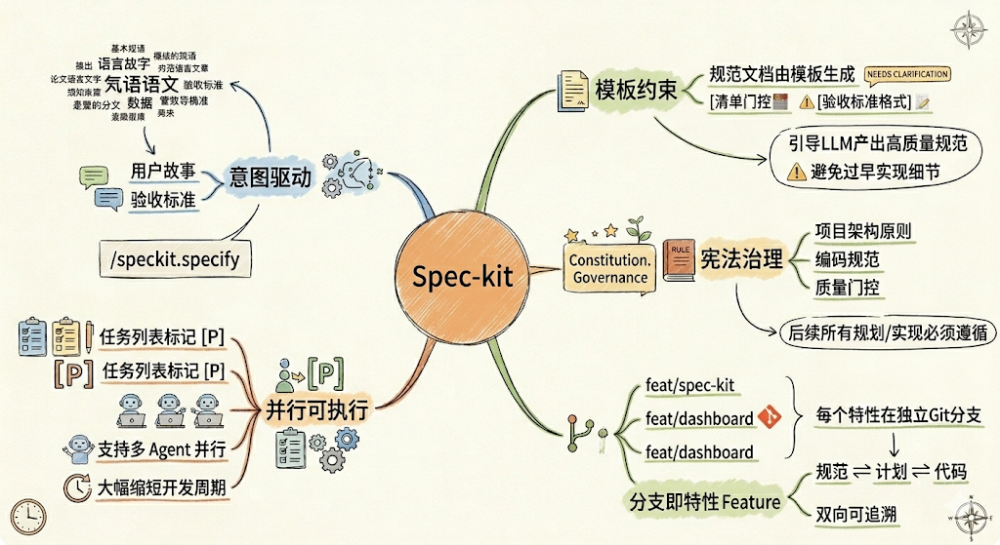
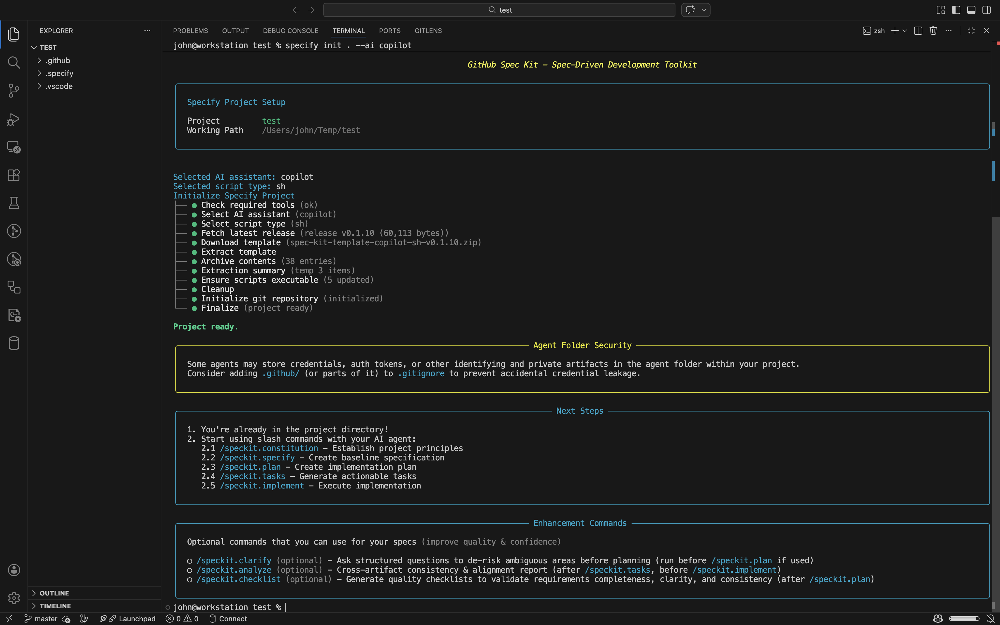

## 前言

在[《SDD规范驱动开发：AI时代的软件工程新范式》](./1000-SDD规范驱动开发：AI时代的软件工程新范式.md)一文中，我们详细介绍了`SDD`（`Spec-Driven Development`，规范驱动开发）的设计思想与核心理念：以规范为核心驱动代码生成，让代码服务于规范，而不是规范服务于代码。

然而，`SDD`方法论的落地需要有具体的工程化工具来支撑。手工维护`spec.md`、`plan.md`等规范文档，手工创建目录结构、分支和任务列表，会让开发者疲于重复劳动，反而降低效率。

**`Spec-kit`** 正是为此而生。它是由`GitHub`官方发布的开源`SDD`工程化工具包，通过一套精心设计的`CLI`工具（`specify-cli`）和`slash commands`（斜杠命令），将`SDD`的规范→计划→任务→实现工作流自动化，帮助开发者真正实现"规范驱动开发"的工程化落地。

## 什么是Spec-kit



`Spec-kit`的官方定义是：

> An open source toolkit that allows you to focus on product scenarios and predictable outcomes instead of vibe coding every piece from scratch.

直译为：**一个开源工具包，让你专注于产品场景和可预期的结果，而不是凭感觉从零开始编写每一个部分。**

`Spec-kit`的核心设计目标是将`SDD`方法论工具化，使得从模糊需求到可执行任务的整个过程，可以通过一系列标准化命令自动完成。它不是一个代码生成框架，也不是一个`IDE`插件，而是一套结构化的工作流模板和自动化脚本，与现有的`AI`编程助手（如`Claude Code`、`GitHub Copilot`、`Cursor`等）无缝集成。

### 核心设计思想

`Spec-kit`的设计思想与`SDD`高度一致，体现在以下几个维度：

**意图驱动（Intent-Driven）：** 开发者只需描述"做什么"和"为什么"，而不是立即讨论"怎么做"。通过`/speckit.specify`命令，自然语言描述的需求会被转化为结构化的用户故事和验收标准。

**模板约束（Template-Constrained）：** 规范文档由模板生成，模板中内置了大量约束条件（如`[NEEDS CLARIFICATION]`标记、验收标准格式、清单门控等），这些约束引导`LLM`产出质量更高、更完整的规范，避免过早涉及实现细节或遗漏关键边界条件。

**宪法治理（Constitutional Governance）：** 项目拥有一个`constitution.md`（宪法文件），定义了项目的架构原则、编码规范和质量门控。后续所有的规划和实现都必须遵循宪法中的原则，确保技术一致性。

**分支即特性（Branch-as-Feature）：** 每个特性都在独立的`Git`分支上开发，规范文档、计划与代码共同版本化管理，实现规范与实现的双向可追溯。

**并行可执行（Parallelizable-Tasks）：** 任务列表中标记了可并行执行的任务（`[P]`标记），支持多`Agent`并行工作，大幅缩短开发周期。

### 支持的AI助手

`Spec-kit`支持市面上主流的`AI`编程助手，比如：

| AI助手 | 命令目录 | 格式 | 说明 |
|---|---|---|---|
| `Claude Code` | `.claude/commands/` | `Markdown` | `Anthropic`官方`CLI` |
| `GitHub Copilot` | `.github/agents/` | `Markdown` | `VS Code`中的`Copilot` |
| `Cursor` | `.cursor/commands/` | `Markdown` | `Cursor IDE` |
| `Gemini CLI` | `.gemini/commands/` | `TOML` | `Google Gemini CLI` |
| `Windsurf` | `.windsurf/workflows/` | `Markdown` | `Windsurf IDE` |
| `Codex CLI` | `.codex/commands/` | `Markdown` | `OpenAI Codex CLI` |
| `Qwen Code` | `.qwen/commands/` | `TOML` | 阿里`Qwen`编程助手 |
| `Amazon Q` | `.amazonq/prompts/` | `Markdown` | `AWS`开发者`CLI` |

## 核心功能与文档体系

`Spec-kit`的工作流围绕一系列规范文档展开，每类文档有其特定的职责和生成方式。

### 项目目录结构

通过`specify init`初始化后，项目会生成如下标准目录结构：

```text
.specify/
├── memory/
│   └── constitution.md        # [AI生成→开发者维护] 项目宪法（必选）
├── scripts/                   # [specify init生成] 辅助脚本，通常无需修改
│   ├── check-prerequisites.sh
│   ├── create-new-feature.sh
│   ├── setup-plan.sh
│   └── update-agent-file.sh
├── specs/
│   └── 001-create-taskify/    # 特性分支目录
│       ├── spec.md            # [AI生成→开发者审核] 功能规范文档（必选）
│       ├── plan.md            # [AI生成→开发者审核] 技术实现计划（必选）
│       ├── research.md        # [AI生成] 技术调研记录（可选）
│       ├── data-model.md      # [AI生成→开发者审核] 数据模型定义（可选）
│       ├── quickstart.md      # [AI生成] 关键验证场景（可选）
│       ├── tasks.md           # [AI生成→开发者可调整] 可执行任务列表（必选）
│       ├── contracts/         # [AI生成] 接口契约，文件名由项目类型决定（可选）
│       │   ├── api-spec.json      # 示例：REST API项目
│       │   └── websocket-spec.md  # 示例：实时通信项目
│       └── checklists/        # [AI生成] 规范质量检查清单（可选）
│           └── requirements.md    # 规范完整性与可测试性验证
└── templates/                 # [specify init生成→开发者可自定义] 规范模板
    ├── spec-template.md
    ├── plan-template.md
    ├── tasks-template.md
    └── commands/              # [specify init生成→开发者可扩展] 命令逻辑
        ├── constitution.md
        ├── specify.md
        ├── plan.md
        ├── tasks.md
        ├── implement.md
        ├── clarify.md
        ├── analyze.md
        └── checklist.md
```

:::info 提示

上图中标注`[AI生成→开发者审核]`的文件均为**草稿**，生成后应直接用编辑器打开对应的`Markdown`文件进行审查和修改。后续命令会读取修改后的文件作为输入，因此每个阶段的人工审核都会完整传递给下一步。建议的审核节奏为：

`/speckit.specify` → **审核`spec.md`** → `/speckit.plan` → **审核`plan.md`等** → `/speckit.tasks` → **调整`tasks.md`** → `/speckit.implement`

:::

### 规范文档详解

#### 项目宪法 - constitution.md

由`/speckit.constitution`命令生成，这是整个项目的架构原则和治理文件。它定义了：

- **架构原则**：如"库优先原则"、"简洁性优先"
- **编码规范**：语言版本、格式化工具、测试框架
- **质量门控**：实现前必须通过的检查项
- **修订机制**：如何正式修改宪法内容

宪法是`Spec-kit`中层级最高的文档，所有技术决策必须与宪法保持一致。

:::info 为什么需要"宪法"？

在`AI`编程中，每次对话都是无状态的——`AI`不会记得你上次说过"必须用`TDD`"或"禁止引入`ORM`框架"。如果没有一个固定的约束文件，同一个项目中不同阶段、不同会话里`AI`做出的技术决策可能互相矛盾：第一次让它写代码用了`pytest`，第二次它可能选`unittest`；今天它把逻辑写在了服务层，明天它又直接写在了路由层。

`constitution.md`就是解决这个问题的机制。它是一份**明确写给`AI`读的约束清单**，每次调用`/speckit.plan`或`/speckit.implement`时，`AI`都会先读取这份文件，确保所有决策符合其中的原则。你可以把它理解为项目的"团队规范手册"，区别在于这份手册是机器可执行的，而不是挂在`Wiki`上没人看的静态文档。

宪法越早建立越好，并且应该由团队中最了解架构约束的人来撰写和维护。一旦写好，后续所有`AI`生成的内容都会自动遵守其中的规则，无需在每次提示词中重复说明。
:::

一个典型的宪法文件结构示例如下：

```markdown
# 项目宪法

## 第一条：库优先原则
每个功能必须以独立、可复用的模块形式开始。
任何功能都不得直接在应用代码中实现，
必须先抽象为可复用的组件。

## 第二条：CLI接口规定
所有模块必须暴露CLI接口，以保证可观测性与可测试性。

## 第三条：测试优先原则
在以下条件满足之前，不得编写任何实现代码：
1. 单元测试已编写并通过审核
2. 测试已确认处于失败状态（Red阶段）

...

## 第七条：简洁性门控
- 初始实现最多包含3个顶层模块
- 禁止未来扩展性假设或投机性功能
```

#### 功能规范 - spec.md

由`/speckit.specify`命令生成，是描述"做什么"和"为什么"的核心需求文档。

:::info 为什么使用`spec.md`不是传统的`PRD`/`FRD`？
`spec.md`与传统需求文档（`PRD`/`FRD`）在目标上相似，但有本质区别：
- 传统（`PRD`/`FRD`）需求文档是写给人看的参考材料，格式相对自由，代码写完后文档往往束之高阁；
- 而`spec.md`是**写给`AI`执行的可执行规范**，要求每个用户故事必须附带可量化的验收标准、明确的优先级，以及可独立测试和交付的范围约束。

这些约束使规范足够精确，能够直接驱动`AI`生成代码，而非仅作参考。简言之，传统`PRD`是"指导实现"的文件，`spec.md`是"生成实现"的源头。
:::

功能规范中包含以下内容：

- **用户故事（User Stories）：** 按优先级排列，每个故事必须可独立测试和交付
- **验收场景（Acceptance Scenarios）：** 描述清楚"在什么情况下，做了什么，系统应该产生什么可量化的结果"，普通语言表达即可，但必须包含明确的输入、操作和输出，且输出必须是可验证的。通常以`Given/When/Then`格式定义可测量的成功标准
- **边界条件（Edge Cases）：** 明确处理异常和边界情况
- **非功能需求（Non-Functional Requirements）：** 性能、安全、可访问性等要求

以下是一个`spec.md`的示例片段：

```markdown
# 功能规范：实时聊天

**功能分支**：003-real-time-chat
**状态**：草稿

## 用户故事1 - 发送与接收消息（优先级：P1）

用户可以在聊天室中发送文本消息，并实时看到其他用户的消息
出现在页面上，无需刷新。

**验收场景**：

1. **假设**：已登录用户正在聊天室中，
   **当**：输入消息并按下回车键，
   **则**：消息在500ms内出现在聊天窗口中。

2. **假设**：两位用户在同一聊天室中，
   **当**：用户A发送一条消息，
   **则**：用户B无需刷新页面即可看到该消息。

## 边界条件

- 消息超过1000个字符时如何处理？
- 消息发送过程中网络断开时系统如何应对？
```

#### 实现计划 - plan.md

由`/speckit.plan`命令生成，是将业务需求转化为技术决策的文档。其结构包括：

- **技术上下文：** 编程语言版本、主要依赖、存储方案、测试框架
- **宪法检查（Constitution Check）：** 验证计划是否符合架构原则
- **项目结构：** 源码目录布局
- **实现阶段：** 按用户故事组织的实现阶段划分
- **复杂度追踪：** 记录架构决策的理由

```markdown
# 实现计划：实时聊天

**分支**：003-real-time-chat
**规范文档**：./spec.md

## 摘要
使用WebSocket实现实时消息推送，PostgreSQL存储消息历史，
Redis管理用户在线状态。

## 技术上下文
**语言/版本**：Python 3.12
**主要依赖**：FastAPI 0.115，websockets 12.0
**存储**：PostgreSQL（消息）、Redis（在线状态）
**测试框架**：pytest 8.x

## 宪法检查
- [x] 库优先原则：chat模块为独立包
- [x] 简洁性门控：顶层模块数量 <= 3
- [x] 测试优先：contracts/目录已定义契约测试
```

#### 技术研究 - research.md

在`/speckit.plan`执行过程中自动生成，记录技术选型调研结果，包括：

- 库/框架版本兼容性对比
- 性能基准测试数据
- 安全注意事项
- 组织内约束条件（如公司规定的技术栈）

#### 数据模型 - data-model.md

定义领域实体、数据库`schema`和实体关系，是`contracts/`中`API`规范的上游文档。

#### 接口契约 - contracts/

存放项目对外暴露的接口定义。注意：**该目录下的文件名称和格式由`/speckit.plan`根据项目类型动态决定**，不是固定的。常见示例：

| 项目类型 | 契约文件类型 |
|---|---|
| `Web`服务/`REST API` | `api-spec.json`（`OpenAPI`格式） |
| 库/模块项目 | `modules.md`（模块接口定义） |
| `CLI`工具 | 命令`schema`文档 |
| 实时通信服务 | `websocket-spec.md`等协议定义 |

如果项目是纯内部构建脚本或一次性工具，`contracts/`目录可能会被跳过。

#### 质量清单 - checklists/

由`/speckit.checklist`命令生成，是`spec.md`的**质量验收报告**。作者将其比喻为"用英语写的单元测试"——如果说`spec.md`是用自然语言写成的"代码"，那么`checklists/requirements.md`就是验证这段"代码"是否写对了的测试套件。

它验证的不是实现是否正确，而是**规范本身是否合格**，包括：

- 所有`[NEEDS CLARIFICATION]`标记是否已消除
- 验收标准是否可量化、可测试（而非"用户体验良好"这类模糊描述）
- 是否覆盖了边界条件和异常流程
- 功能范围是否清晰界定，没有歧义
- 非功能需求（性能、安全等）是否明确

建议在`/speckit.specify`之后、`/speckit.plan`之前运行，确保规范质量过关后再进入技术设计阶段，避免把模糊的需求带入实现环节放大问题。

#### 任务列表 - tasks.md

由`/speckit.tasks`命令生成，将计划文档转化为可执行的、有序的任务清单：

```markdown
# 任务列表：实时聊天

## 阶段1：项目初始化
- [ ] T001 按实现计划创建项目结构
- [ ] T002 [P] 配置代码检查与格式化工具

## 阶段2：基础设施
- [ ] T003 创建PostgreSQL消息表schema
- [ ] T004 [P] 配置Redis在线状态连接

## 阶段3：用户故事1 - 发送与接收消息（P1）
- [ ] T005 实现WebSocket连接处理器
- [ ] T006 [P] 实现消息向房间订阅者广播
- [ ] T007 编写WebSocket事件契约测试
```

`[P]`标记表示该任务可与其他任务并行执行。

### 核心命令一览

| 命令 | 阶段 | 是否必选 | 主要职责 |
|---|---|---|---|
| `/speckit.constitution` | 初始化 | 是 | 创建或更新项目宪法文件 |
| `/speckit.specify` | 规范 | 是 | 将自然语言需求转化为结构化功能规范 |
| `/speckit.clarify` | 澄清 | - | 交互式澄清功能规范中的模糊点，建议在`/speckit.plan`前执行 |
| `/speckit.plan` | 计划 | 是 | 生成技术实现计划及配套设计文档 |
| `/speckit.analyze` | 分析 | - | 检查规范文档间的一致性和覆盖度 |
| `/speckit.checklist` | 质量 | - | 生成质量检查清单，相当于规范的“单元测试” |
| `/speckit.tasks` | 任务 | 是 | 将计划分解为可执行的有序任务列表 |
| `/speckit.implement` | 实现 | 是 | 按任务列表执行代码生成 |

## 使用方法

### 安装

`Spec-kit`通过`uv`工具安装`specify-cli`（推荐使用持久安装方式）：

```bash
# 安装uv（如未安装）
curl -LsSf https://astral.sh/uv/install.sh | sh

# 安装specify-cli（持久安装）
uv tool install specify-cli --from git+https://github.com/github/spec-kit.git

# 验证安装
specify check
```

升级到最新版本：

```bash
uv tool install specify-cli --force --from git+https://github.com/github/spec-kit.git
```

**环境要求：**

| 要求 | 版本 |
|---|---|
| 操作系统 | `Linux/macOS/Windows` |
| `Python` | `3.11+` |
| `Git` | 任意新版本 |
| `uv` | 最新版本 |
| `AI`助手 | 支持列表中任意一款 |

### 初始化项目

```bash
# 新建项目
specify init my-project --ai claude

# 在当前目录初始化
specify init . --ai copilot
# 或使用 --here 标志
specify init --here --ai cursor-agent

# 强制覆盖已有目录
specify init --here --force --ai claude

# 跳过git初始化
specify init my-project --ai gemini --no-git
```

初始化完成后，在项目目录中启动`AI`助手，即可看到`/speckit.*`系列命令可用。



### 完整使用示例：构建相册管理应用

下面演示使用`Spec-kit`和`Claude Code`从零构建一个相册管理应用的完整流程，该示例也是`Spec-kit`官方仓库示例。

#### 第一步：建立宪法（必选）

```bash
/speckit.constitution 建立专注于代码质量、测试标准和性能要求的项目原则。
要求采用TDD方式开发，代码覆盖率不低于80%。
使用SQLite作为本地存储方案。
```

执行后生成`.specify/memory/constitution.md`，定义了项目的核心约束。

#### 第二步：功能规范（必选）

```bash
/speckit.specify 构建一个照片管理应用，支持将照片整理到相册中。
相册按日期分组，支持通过拖拽重新排序。
相册内照片以瓦片式布局展示。
相册不支持嵌套。
```

执行后自动完成：
- 创建`Git`分支`001-photo-albums`
- 在`.specify/specs/001-photo-albums/spec.md`中生成结构化规范

#### 第三步：规范澄清（可选）

功能规范中可能存在模糊点，`AI`助手会提示用户进行澄清。
建议在生成计划前运行澄清命令，减少返工。如果规范内容已足够清晰，可跳过此步直接进入第四步。

```bash
/speckit.clarify
```

`AI`助手会针对规范中的`[NEEDS CLARIFICATION]`标记逐一提问，并将答案记录在规范的`Clarifications`节中。

#### 第四步：技术方案（必选）

```bash
/speckit.plan 使用Vite，技术栈为原生HTML、CSS和JavaScript，
尽量减少外部库依赖。图片不上传到任何服务器，
元数据存储在本地SQLite数据库中。
```

执行后，`AI`助手会创建多个`SubAgent`并行地从互联网查询资料，进行技术调研，随后在特性目录（`specs/001-photo-albums/`）下生成：
- `plan.md` — 实现计划
- `research.md` — 技术选型调研（`Vite`版本、`SQLite`适配方案等）
- `data-model.md` — 相册和照片实体定义
- `contracts/` — 接口契约（文件名由项目类型决定，如`api-spec.json`、`modules.md`等）
- `quickstart.md` — 关键验证场景

#### 第五步：分解任务（必选）

```bash
/speckit.tasks
```

`AI`会根据功能规范和技术方案自动生成`specs/001-photo-albums/tasks.md`，包含按用户故事组织的、带有并行标记的详细任务清单。

#### 第六步：执行实现（必选）

```bash
/speckit.implement
```

`AI`助手按任务列表顺序执行代码生成，每完成一个阶段后自动校验是否满足对应用户故事的验收标准。


## 应用场景

`Spec-kit`并非适用于所有情境，以下场景能够最大化发挥其价值。

### 从零构建新项目（Greenfield）

当你需要从零开始构建一个新应用或新服务时，`Spec-kit`能够帮助你：

- 在动手编码之前，先建立清晰的需求共识
- 自动生成完整的技术决策记录（`ADR`）
- 确保首个版本的代码质量符合架构约束

**典型场景：** 初创公司核心产品开发、新`SaaS`功能从`0`到`1`的构建、内部工具平台搭建。

### 迭代增量开发（Brownfield）

在已有代码库上添加新功能时，`Spec-kit`的分支隔离机制能够有效防止新特性引入架构腐化：

- 宪法文件保持新特性与既有架构原则一致
- 规范文档作为代码审查的参考基准
- 任务列表使增量开发的进度可视化

**典型场景：** 在遗留系统上逐步添加新能力、微服务拆分过程中的单服务迭代、产品迭代中的功能扩展。

### 团队协作开发

`SDD`中"规范是通用语言"的原则在团队场景中尤为重要：

- 产品经理和开发者可以共同评审`spec.md`，确保需求理解一致
- 后端和前端工程师可以依据`contracts/`并行开发
- 新成员可通过阅读规范文档快速理解历史决策
- `Code Review`时可将代码与规范逐项核对

**典型场景：** 跨职能团队协作、远程分布式团队开发、多`Agent`并行编程工作流。

### 需求频繁变化的项目

传统开发中需求变更代价高昂（文档、设计、代码需要三处同步），而`SDD`将变更纳入正常工作流：

- 修改`spec.md`中的用户故事，`/speckit.plan`将标记受影响的技术决策
- 调整`plan.md`中的技术选型，`/speckit.tasks`将重新生成对应任务
- 整个追踪链完全版本化，变更历史清晰可查

**典型场景：** `MVP`验证阶段的快速枢轴（`Pivot`）、竞争驱动的敏捷迭代、`A/B`测试驱动的功能演进。

### 不适用的场景

以下情况下，`Spec-kit`的收益有限：

- **一次性脚本或临时任务：** 工具的初始化和规范编写成本高于直接编码
- **纯探索性原型：** 需求极其模糊、以探索为目的的「`Vibe Coding`」阶段
- **极简单的功能修复：** 3行代码的`bug fix`不需要`spec.md`

## 总结

`Spec-kit`是`SDD`方法论从理论走向实践的重要工程化桥梁。它通过`specify-cli`工具和一套完整的`slash commands`体系，将"规范驱动开发"的核心理念具体化为可执行的工作流，解决了`SDD`落地中最繁琐的重复性工作问题。

其核心价值在于：

- **一致性保障：** 模板约束和宪法机制确保多轮迭代、多人协作中的架构一致性
- **可追溯性：** 规范、计划、任务、代码全部版本化，决策链完整可查
- **效率提升：** 将12小时的文档工作压缩至20分钟，且产出质量更高
- **AI助手无关性：** 支持所有主流`AI`编程助手，不绑定特定工具链

如果你的团队正在探索如何在`AI`时代构建更高质量、更可预期的软件，`Spec-kit`是一个值得深入实践的起点。

## 参考资料

- `Spec-kit`源码仓库：[github/spec-kit](https://github.com/github/spec-kit)
