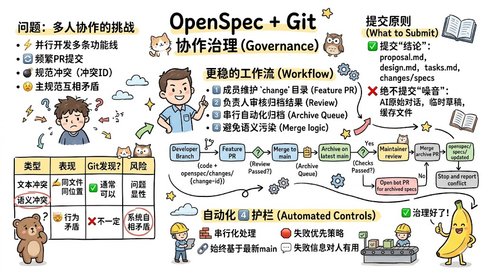
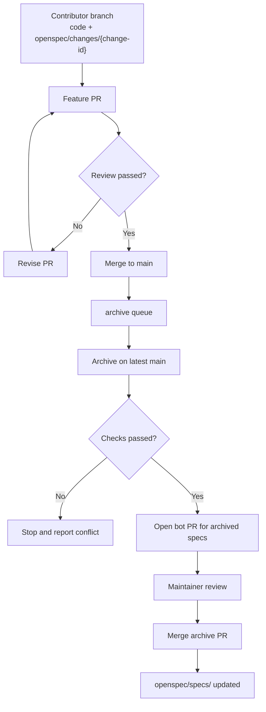

## 前言

当`OpenSpec`还只是一个人使用时，很多问题都显得很简单：文档先放本地也没关系，`changes`目录偶尔乱一点也还能接受，等功能做完了再手动`archive`一下，似乎一切都能运转。

但只要项目进入多人协作，事情的难度就会突然上一个台阶。这在企业内部团队（产品、后端、前端、测试并行推进多条功能线）和开源项目（来自不同时区的贡献者随时提交`PR`）中都极为普遍。你会遇到这样的场景：

- 一位成员提交了新功能`PR`，里面带着完整的`OpenSpec change`；
- 另一位成员几乎同时改了同一能力域的另一条规则；
- 两个`PR`分别都能通过审查，却在归档阶段同时碰到了`openspec/specs/`；
- 流水线显示"合并成功"，但主规范里已经埋下了互相矛盾的行为定义。

这时你会发现，问题已经不是"文档要不要提交到仓库"，而是"如何让规范成为多人协作下的正式工程资产"。

如果处理得好，`OpenSpec`会成为团队协作中连接需求、设计、实现、测试与归档的治理层；如果处理得不好，它也会变成另一个高频冲突、难以维护、最后被团队绕开的目录。

本文不讨论`OpenSpec`的基础概念，而是专门讨论一个更偏工程管理的话题：**当`OpenSpec`进入`Git`与多人协作场景后，应该怎么治理，才不会让规范本身成为负担。**

## 先给结论

如果你只想先拿一个可执行答案，那么我建议直接记住下面这几条：

- 正式的`OpenSpec`工件应该进入`Git`，因为它们本来就是项目事实的一部分；
- 私人的探索草稿、原始`AI`对话、临时思路不应该进入仓库；
- 团队成员更适合维护`openspec/changes/<change-id>/`，而不是直接频繁修改`openspec/specs/`；
- 自动`archive`完全可以做，但更推荐输出为可审查的`bot PR`；
- 冲突处理应当采取"失败优先"，不要依赖静默自动的文本合并；
- 你真正需要防的，不只是文本冲突，而是主规范层面的语义冲突。

> 如果只保留一句话，那就是：把自动化用在"搬运和校验"上，把最终裁决权留给负责人。

## 为什么这件事在多人协作中绕不过去

很多团队在刚引入`OpenSpec`时，会把它理解成“给`AI`看的文档”。这个理解不算错，但还不够完整。

一旦项目进入多人协作，`OpenSpec`不再只是提示词补充材料，而会逐渐承担下面这些角色：

### 它是设计决策的持久化记录

代码能说明“做了什么”，却很难完整说明“为什么这样做”。而`proposal.md`、`design.md`、增量`specs`与`tasks.md`，恰好补上了这部分上下文。无论是企业团队还是开源项目，这些信息对负责人、评审者与后来加入的成员都同样重要。

### 它是`AI`共享上下文的入口

如果规范只在某位成员的本地，那么不同开发者、不同时间点、不同`AI Agent`拿到的上下文就会不一致。规范一旦不进入版本管理，就很容易从“团队共识”退化成“个人记忆”。

### 它是代码审查之外的第二条判断线

在团队协作中，一个`PR`是否值得合并，通常不只是代码风格与测试通过的问题，还包括：

- 这个改动是否符合项目方向；
- 它是否改动了既有能力边界；
- 它是不是引入了新的行为约束；
- 这些约束有没有被清晰表达出来。

这些判断，单靠代码本身往往不够，而`OpenSpec`正好承担了这层“意图表达”的职责。

### 它需要像代码一样被追溯与审计

只要你希望未来能够回答“这个行为为什么变成现在这样”“是谁在什么时候改了这条规则”“这次迭代到底承诺了什么”，那`OpenSpec`就应该和代码一样进入`Git`历史。

## 该提交什么，不该提交什么

应该把`OpenSpec`提交到仓库，并不意味着所有与它有关的内容都应该进`Git`。一个更稳妥的做法，是把资料分成三个层级。

| 资料层级 | 典型位置 | 是否提交到`Git` | 建议说明 |
|---|---|---|---|
| 私有探索层 | 本地草稿、临时分析、原始`AI`对话摘录、未收敛的草图 | 否 | 只服务于个人思考，不应制造仓库噪音 |
| 变更协作层 | `openspec/changes/<change-id>/proposal.md`、`design.md`、`tasks.md`、`specs/` | 是 | 跟随功能`PR`提交，是实现与评审的重要上下文 |
| 规范沉淀层 | `openspec/specs/` | 是 | 代表系统当前事实，应通过受控归档统一维护 |

这背后其实可以浓缩成一条很实用的原则：**提交“结论”，不要提交“噪音”。**

因此，通常建议提交这些正式工件：

- `openspec/changes/<change-id>/proposal.md`；
- `openspec/changes/<change-id>/design.md`；
- `openspec/changes/<change-id>/tasks.md`；
- `openspec/changes/<change-id>/specs/**`；
- `openspec/specs/**`；
- 已归档后的正式规范与必要的归档记录。

而下面这些内容，则更适合保留在本地或外部讨论系统中：

- `AI`原始长对话；
- 临时探索笔记；
- 调试期中间报告；
- 不具备长期价值的截图、导出文件与缓存产物。

## 真正麻烦的不是文本冲突，而是语义冲突

很多团队一开始担心的是：`Markdown`文件是不是很容易冲突？

答案是：会，但那通常还不是最危险的问题。

更危险的情况是：**`Git`告诉你“合并成功”（文本合并），而规范其实已经互相打架了。**

### 文本冲突与语义冲突不是一回事

| 类型 | 表现形式 | 是否一定能被`Git`发现 | 风险 |
|---|---|---|---|
| 文本冲突 | 两个提交同时修改了同一文件同一位置 | 通常可以 | 问题显性，需要人工处理 |
| 语义冲突 | 两个变更在规范层面表达了互相矛盾的行为约束 | 不一定 | 可能表面合并成功，但系统事实已自相矛盾 |

举一个典型例子。

- 变更`A`规定：登录失败`5`次后锁定`30m`；
- 变更`B`规定：登录失败`10`次后锁定`15m`。

这两个变更在各自`PR`中都可能完全合理，因为它们改的是各自的`change`目录；甚至它们的代码也都能通过测试。真正的问题发生在归档阶段：两份增量规范最终都要写回`openspec/specs/auth/spec.md`。

此时可能出现三种情况：

- `Git`直接报文本冲突；
- 文本没有冲突，但两条规则同时保留，形成语义矛盾；
- 后归档的结果覆盖前归档的结果，导致既有行为被悄悄改写。

所以，很多人以为自己在处理“合并冲突”，实际上真正需要治理的是“规范冲突”。后者比前者更隐蔽，也更值得警惕。

## 为什么不应该依赖“自动合并技巧”

这里容易产生一个误解：**不建议依赖自动合并技巧（文本合并），并不意味着不建议自动`archive`（语义合并）。**

真正不建议的，是把规范冲突的处理完全交给宽松的合并策略，例如：

- 用`merge driver`静默拼接`Markdown`段落；
- 对`specs`目录启用宽松的`union merge`；
- 只要流水线没报错，就认为主规范一定没问题；
- 让多个归档任务并发写同一份主规范。

这种做法最大的风险在于，它把“明确的冲突”变成了“隐蔽的污染”。

在代码合并里，自动化意味着效率；但在规范治理里，没有边界的自动化很容易演变成"谁最后写进去谁赢"。主规范一旦被污染，后续所有团队成员与`AI Agent`看到的上下文都会随之偏掉。

真正稳妥的方向不是"尽量别失败"，而是：

- 允许自动执行`archive`；
- 对写回`openspec/specs/`的过程做串行化控制；
- 一旦发现冲突或归档前提不满足，就让流程明确失败；
- 把最终的归档结果暴露在可审查的`PR`中，而不是静默写入主分支。

## 能不能自动`archive`？可以，但别把裁决权交给流水线

**可以，而且值得做。**

但更完整的答案是：流水线可以自动执行`archive`（语义合并），却不应该让流水线自动裁决规范冲突（语义冲突）。

### 自动化适合做什么

自动化特别适合做这些“机械但必要”的工作：

- 识别某个已合并`change`是否尚未归档；
- 拉取最新`main`；
- 执行`archive`命令或等价脚本；
- 生成归档后的`diff`；
- 创建一个归档`PR`；
- 在失败时输出清晰、可操作的日志。

### 自动化不应该偷偷做什么

下面这些判断，则不应由脚本默默替负责人完成：

- 冲突的两条需求到底该保留哪一边；
- 两段相似但不完全一致的行为描述是否等价；
- 重复段落应该删除还是合并；
- 多个相互依赖的变更应该以什么业务顺序归档。

这些事情本质上是“规范裁决”，不是“文件操作”。

### 最推荐的两种归档模式

| 模式 | 做法 | 适用场景 | 建议程度 |
|---|---|---|---|
| `bot PR`归档 | `CI`执行归档后自动创建一个单独`PR`，由负责人审核后合并 | 多人协作团队、主规范变更频繁 | 强烈推荐 |
| 直推主分支 | `CI`串行执行归档并直接提交到`main` | 小团队、变更边界清晰、负责人高度信任流水线 | 可选 |

如果团队规模较大或主规范变更频繁，`bot PR`通常是更稳的选择，因为它同时满足了三件事：

- 自动化搬运；
- 结果可审查；
- 出错时不会直接污染主分支。

## 一套更稳的`OpenSpec + Git`工作流

更推荐团队采用"**开发成员维护`change`，负责人审核归档结果**"的模式，整体流程如下：

这套流程的核心价值在于职责边界清晰，而不是步骤的多少。

### 开发成员主要维护`changes`层

也就是说，开发功能时，团队成员主要提交的是：

- 代码；
- `openspec/changes/<change-id>/`下的工件；
- 与该变更直接相关的测试与文档更新。

这样做的好处非常直接：多位成员通常不会在日常开发阶段就去争抢`openspec/specs/`，从而把高频冲突从"开发阶段"转移到"受控归档阶段"。

### 主规范由归档流程集中更新

`openspec/specs/`是系统当前行为的事实来源，最好不要在每个功能`PR`里由各成员直接长期手工维护。更合适的方式是：在变更被接受后，通过统一的归档流程，把增量规范提升为主规范。

### 归档结果必须保持可审查

对多人协作团队而言，让归档结果以`bot PR`或单独归档`PR`的形式出现，通常比直接推送到`main`稳妥得多。因为负责人需要看到：

- 这次归档到底改了哪些主规范；
- 有没有引入重复、冲突或遗漏；
- 是否需要顺便整理目录结构与说明文本。

## 自动归档要稳定，至少加上这四个护栏

如果你准备把自动`archive`真正落到`GitHub Actions`、`GitLab CI`或其他流水线里，我建议至少配齐以下四个护栏。

### 串行化处理归档任务

不要允许多个已合并变更同时写入`openspec/specs/`。最直接的做法，就是引入`archive queue`或与`merge queue`配合，保证归档任务逐个执行。

否则你很快会碰到这些问题：

- 基线过期；
- 归档提交互相覆盖；
- 后执行的结果基于旧主分支生成，最终又写回新主分支。

### 始终基于最新`main`归档

归档任务不要在旧的`merge commit`上下文里直接运行并提交结果，而应该在真正执行前重新获取最新主分支，再判断该`change`是否仍满足归档前提。

这一步看似普通，实际上非常关键，因为它能避免“旧世界观生成的新规范覆盖了新世界观”这种非常隐蔽的错误。

### 冲突与异常采用失败优先策略

一旦出现下面这些情况，归档任务就应该停止，而不是继续尝试“智能合并”（其底层原理是**文本合并**）：

- 同一能力目录被多个变更连续修改且结果无法自动校验；
- 归档后主规范出现明显重复或互相矛盾的行为描述；
- 归档目标文件结构不符合预期；
- 变更依赖的上游规范尚未归档完成；
- 归档脚本无法确定某段增量规范该写回到主规范的哪一部分。

### 失败信息必须对人有用

很多流水线失败日志的问题，不是“没有报错”，而是“报错了也不知道下一步该干什么”。

更实用的做法是直接输出：

- 失败的`change-id`；
- 冲突涉及的能力目录；
- 受影响的主规范文件；
- 推荐动作，例如“请先协调`auth`能力中的锁定策略，再重新执行归档”。

## 如何降低`OpenSpec`多人协作中的冲突概率

归档机制只是最后一道闸门。真正有效的治理，往往来自前置约束。

### 为`change-id`建立统一命名规则

相比模糊的`user-auth`、`dashboard`，更推荐使用带来源或上下文的命名，例如：

- `gh-128-user-auth-lockout-policy`；
- `20260417-plugin-marketplace-search`；
- `fix-role-permission-batch-edit`。

命名越清晰，流水线、自动化工具与团队成员之间的沟通成本就越低。

### 尽量让一个`change`只有一个明确负责人

多人长期共同编辑同一个`proposal.md`、`design.md`与`tasks.md`，几乎一定会把冲突频率拉高。更推荐的方式是：

- 一个`change`对应一个主要负责人；
- 多人并行时拆成多个子`change`；
- 最终通过依赖关系或归档顺序整合。

### 不要把`tasks.md`当成实时协作面板

`tasks.md`很适合记录稳定任务与完成状态，却不适合承载大量临时讨论、执行日志与来回修改的过程信息。

一个更健康的分工通常是：

- `Issue`或讨论区承载开放式讨论；
- `PR`评论承载实现级反馈；
- `tasks.md`只保留稳定任务与验收线索。

### 给“小改动”保留快速通道

如果所有微小修复都要求完整走一遍`OpenSpec`流程，协作门槛会迅速上升。通常可以约定下面这些改动允许跳过正式`OpenSpec`流程：

- 拼写修正；
- 注释优化；
- 纯格式化变更；
- 不影响行为的微小重构；
- 独立的小型测试补充。

而下面这些场景，则更适合强制要求`OpenSpec`：

- 新功能；
- 用户可观察行为变化；
- `API`、权限、数据模型、工作流变更；
- 跨模块设计调整；
- 需要长期沉淀设计依据的重要修复。

## 团队落地路线图

如果你准备把`OpenSpec`引入一个已有的团队项目，建议不要一开始就追求"完全自动化"，更现实也更容易成功的方式是分阶段推进。

### 第一阶段：先建立提交边界

先在协作规范文档（如`CONTRIBUTING.md`或团队内部`Wiki`）里明确三件事：

- 哪些类型的改动必须附带`OpenSpec change`；
- 功能`PR`需要提交哪些工件；
- 谁负责归档主规范。

这一阶段的目标不是自动化，而是让所有成员先形成相同预期。

### 第二阶段：再建立归档审核流程

当团队已经习惯在`PR`里维护`changes`后，再逐步引入归档脚本与单独的归档`PR`。这时重点是让`openspec/specs/`的更新变得统一、可审查、可追踪。

### 第三阶段：最后再考虑更激进的自动化

只有当你的能力划分足够稳定、规范写法足够统一、归档失败模式已经比较清晰时，才值得尝试更进一步的自动化，例如在满足所有前提时，让机器人更深入地接管归档推进。

## 常见问题

### `OpenSpec`文档都需要提交到`Git`吗？

**不是全部**。应提交的是正式工件，例如`proposal.md`、`design.md`、`tasks.md`、增量`specs`与主规范；不应提交的是临时草稿、原始`AI`对话、调试截图与过程性噪音。

### 功能`PR`里可以直接修改`openspec/specs/`吗？

**可以，但多人协作中通常不推荐**。更稳妥的方式是让团队成员主要提交`openspec/changes/<change-id>/`，再由归档流程统一更新`openspec/specs/`，这样可以显著降低多人直接编辑主规范带来的冲突。

### 合并多个`change`后，能不能让流水线自动执行`archive`并同步到`specs/`？

**可以，而且通常值得做**。但更推荐采用"自动执行归档、自动生成归档`PR`、负责人审核后合并"的模式，而不是让流水线直接静默改写主分支。

### 为什么“自动合并成功”不代表规范没有问题？

**因为`Git`只理解文本，不理解业务语义**。两份互相矛盾的行为描述完全可能位于不同段落，从而被顺利合并进同一份主规范，但这并不意味着系统事实是一致的。

### 如果两个已合并变更都修改了同一个能力目录，应该怎么办？

**优先让归档流程串行化**，并在第二个归档任务开始前重新基于最新`main`执行校验。如果发现能力层面的冲突，应中止自动归档并交由负责人人工协调，而不是依赖脚本"猜测"最终行为。

### 每个`PR`都必须配一个`OpenSpec change`吗？

**不一定**。团队通常应给微小、低风险、无行为变化的改动保留快速通道，否则协作门槛会过高。关键在于区分"需要长期沉淀设计与行为依据的改动"与"纯维护性微调"。

### `tasks.md`频繁冲突怎么办？

这通常说明`tasks.md`承载了过多实时协作信息。可以把讨论迁移到`Issue`与`PR`评论，只让`tasks.md`保留稳定任务列表与完成状态；多人并行开发时，则优先拆分为多个独立`change`。

### 归档一定要完全自动吗？

**不一定**。对个人项目或小团队，手动归档可能已经足够；对多人协作团队，半自动归档往往更合理，即"脚本负责执行，负责人负责最终确认"。真正重要的不是自动化程度本身，而是规范演进是否稳定、透明、可回溯。

## 总结

当`OpenSpec`进入多人协作场景后，它不再只是一个给`AI`看的目录结构，而会逐渐成为连接需求澄清、设计约束、代码实现与规范沉淀的工程治理层。这一规律在企业内部团队和开源项目中同样适用。

因此，最关键的问题从来不是"文档要不要放进仓库"，而是"如何让规范在多人、长期协作中真正活下来"。

稳妥的工程实践通常包括：

- 正式`OpenSpec`工件进入`Git`；
- 私有探索与过程噪音留在本地；
- 团队成员主要维护`openspec/changes/`；
- `openspec/specs/`通过受控归档集中更新；
- 自动`archive`可以做，但必须串行、可审查、可失败；
- 语义冲突不能依赖`Git`静默解决，必须保留人工兜底。

如果说`OpenSpec`解决的是“如何让`AI`开发更有规范”，那么`OpenSpec + Git`协作治理解决的就是“如何让这些规范在多人协作里长期可维护”。这一步做好了，规范就不会随着项目增长而成为额外负担，反而会逐渐沉淀成团队最有价值的长期工程资产之一。
