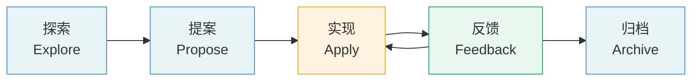
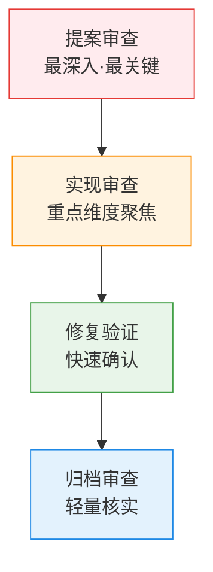

## 前言

`AI`编程工具的普及让代码生成速度产生了质的飞跃。`Cursor`、`Claude Code`、`GitHub Copilot`等工具已经能够在数秒内生成数百行代码，帮助开发者完成从`CRUD`接口到复杂算法的各类任务。然而，一个常被忽视的问题随之浮现：**代码生成速度的提升，并不等同于代码质量的保证。**

在这个背景下，一些团队开始产生疑问：既然`AI`已经能写代码，人工`CodeReview`还有必要吗？答案是肯定的——不仅必要，而且在某些维度上比传统开发更为关键。`AI`生成的代码有着人类代码所没有的独特风险模式，需要针对性的人工审查策略。

本文将系统性地回答三个核心问题：在`AI Coding`工程中，人工`CodeReview`为什么必不可少？在`SDD`流程的哪些阶段需要人工介入审查？人工审查时应当聚焦哪些方面、又可以适度放宽哪些方面？

## AI生成代码的固有局限

在讨论人工`CodeReview`的必要性之前，有必要先理解`AI`生成代码的独特风险模式。这些风险与传统人工编写代码的缺陷有本质区别，也决定了人工审查的侧重方向。

### 幻觉与置信度错配

`LLM`的一个根本性缺陷是**幻觉（Hallucination）**：模型在不确定时，仍会生成看似合理的内容，而不是表达不确定性。在代码生成场景中，这意味着`AI`可能：

- 调用并不存在的库函数或`API`
- 生成在语法上完全正确、但逻辑存在根本性缺陷的代码
- 对复杂业务规则做出错误假设，并将这些假设"硬编码"到实现中
- 在安全相关场景中，选择看起来合理但实际不安全的实现方式

幻觉的危险之处在于：这些代码往往能通过编译、甚至通过部分测试，但会在生产环境中以难以预料的方式失败。

### 上下文漂移与意图偏离

随着对话轮次增加或任务规模扩大，`AI`对初始需求的理解会逐渐产生偏移。`Thoughtworks`的工程师在实践中发现，这种 **上下文漂移（Context Drift）** 是`AI`辅助开发中最隐蔽的风险之一：

- 在长会话末尾生成的代码，可能与会话开始时定义的架构约束相矛盾
- `AI`可能在实现过程中"悄悄"做出架构决策，而没有明确告知开发者
- 当任务被分解为多个子任务时，各子任务的实现之间可能缺乏全局一致性

### 过度工程与不必要复杂性

`AI`有一种倾向：**生成比需求更复杂的解决方案**，这种过度工程会带来长期的维护成本：

- 生成动态、可扩展的组件，但实际上并不需要这种灵活性
- 引入不必要的抽象层和设计模式
- 重复生成已有功能的实现，造成代码冗余
- 生成冗余、相互重叠的测试用例，使测试套件难以维护

### 安全盲区

`AI`在生成代码时缺乏完整的安全上下文意识，容易产生安全漏洞：

- 在处理用户输入时遗漏输入验证和净化
- 选择已知存在漏洞的加密算法或不安全的实现方式
- 在日志或错误信息中泄露敏感数据
- 对第三方依赖库的版本和安全状态缺乏感知

这些局限意味着：**`AI`生成的代码不能被视为"可信的默认值"，而必须经过有针对性的人工审查。**

## 人工CodeReview的核心价值

理解了`AI`的局限之后，人工`CodeReview`的核心价值就变得清晰了。人类在`AI`辅助开发中应处于"**on the loop**"（在循环之上）的位置——不是微观管理每一行代码，也不是完全脱离审查，而是**构建和管理产出质量的保证机制**。

人工`CodeReview`在这个框架中承担了不可替代的职责：

- **意图守护者**：确保实现与原始需求和设计意图保持一致，防止上下文漂移导致的偏离。

- **架构护卫**：`AI`缺乏对整个系统演进历史的理解，人工审查需要确保每次变更都与整体架构方向一致，而不是引入局部最优但全局矛盾的设计。

- **安全防线**：在安全相关的决策上，人工判断仍然是最可靠的防线，`AI`的安全意识难以达到生产级标准。

- **知识传递载体**：`CodeReview`是团队成员了解`AI`生成代码、理解系统演进、保持技术洞察力的重要途径。如果团队完全依赖`AI`写代码且不做审查，技术能力会快速退化，导致未来无法有效驾驭`AI`。

## SDD流程中的人工CodeReview节点

在`SDD`（规范驱动开发）工程中，人工`CodeReview`不是仅在代码提交前才发生的单一动作，而是**贯穿整个开发闭环的多个关键节点**。以`OpenSpec`框架的五步工作流为例：

### 探索阶段：问题定义审查

**审查时机**：在`AI`完成探索对话、生成问题分析结论之后，正式进入提案阶段之前。

**审查目标**：确认问题理解的准确性和完整性。

**核心关注点**：

- `AI`对问题的定义是否与业务实际需求吻合？是否存在明显的误解或遗漏？
- 探索得出的技术方向是否与现有系统架构兼容？
- 探索结论中是否隐含了不合理的假设？

这个阶段的审查往往被忽视，但它是**成本最低、收益最高**的审查节点。在探索阶段纠正方向偏差，远比在实现阶段发现根本性的需求误解要节省资源。

### 提案阶段：规范设计审查

**审查时机**：`AI`生成变更提案（包含技术设计、`API`契约、数据模型等）之后，批准进入实现之前。

**审查目标**：这是整个流程中**最关键的人工审查节点**，决定了后续实现的质量上限。

**核心关注点**：

| 审查维度 | 具体内容 |
|---|---|
| **架构一致性** | 提案的技术选型和架构决策是否与系统整体演进方向一致 |
| **接口契约** | `API`设计是否合理，命名、参数结构、错误码是否符合团队规范 |
| **数据模型** | 实体设计是否正确，关系是否合理，是否考虑了数据迁移影响 |
| **边界条件** | 提案是否覆盖了异常流程、并发场景、数据一致性要求 |
| **安全设计** | 认证授权、数据脱敏、输入验证等安全机制是否在设计层面明确 |
| **依赖影响** | 变更对其他模块或服务的影响范围是否已被识别和评估 |

提案审查通过后，`AI`实现的代码质量会有更可靠的基础保障。跳过这个节点，直接让`AI`"摸索着实现"，是`SDD`工程中最危险的反模式之一。

### 实现阶段：代码实现审查

**审查时机**：`AI`完成代码生成，在提交`Pull Request`或合并到主干之前。

**审查目标**：验证实现是否忠实于提案规范，并识别`AI`引入的各类质量风险。

这是最传统意义上的`CodeReview`节点，但在`AI Coding`背景下，审查侧重点需要针对`AI`的特性做出调整（详见下一章节）。

### 反馈阶段：修复验证审查

**审查时机**：`AI`根据反馈完成修复之后，进入下一轮迭代或归档之前。

**审查目标**：确认`AI`的修复是真正解决了问题，而不是引入了新的问题或规避了根因。

`Birgitta Böckeler`的实践经验表明，`AI`在修复问题时有一个常见模式：**暴力修复（Brute-force Fix）**——通过增大内存限制、增加超时时间、捕获异常后忽略等方式回避问题，而不是真正诊断和解决根因。修复阶段的人工审查需要特别警惕这类模式。

### 归档阶段：变更记录审查

**审查时机**：`AI`生成归档文档之后。

**审查目标**：确认归档记录的准确性，确保变更历史可追溯。

这个阶段的审查相对轻量，主要核实：归档内容是否准确描述了实际发生的变更，技术决策的理由是否被正确记录，后续维护者是否能从归档记录中还原当初的决策上下文。

## 人工CodeReview的核心关注点

在明确了`SDD`流程中的审查节点之后，我们需要进一步了解：人工审查时，精力应该集中在哪些方面？

### 架构一致性

**这是人工`CodeReview`最重要的关注维度。**

`AI`没有系统演进的全局视角，它只能看到当前的上下文窗口。在实现层面，`AI`可能做出对当前任务"局部最优"的决策，但这些决策可能与整体架构方向相悖：

- 引入与现有架构层次不符的依赖关系（如在领域层直接引用基础设施层）
- 绕过已有的抽象层，直接操作底层实现
- 引入与团队架构决策记录（`ADR`）相违背的设计模式
- 在应该复用现有组件的地方重新实现类似逻辑

审查者需要具备对系统整体架构的深刻理解，这是`AI`无法替代的领域知识。

### 安全漏洞

安全审查是人工`CodeReview`的**第二重要维度**，也是最容易被`AI`遗漏的方面。重点关注：

- **输入验证与净化**：所有来自外部的输入（用户输入、`API`参数、文件内容）是否经过适当验证和净化，防范注入攻击（`SQL`注入、命令注入、`XSS`等）。

- **认证与授权**：新增的`API`端点或操作是否正确实现了认证（Authentication）和授权（Authorization）检查，是否存在未受保护的敏感操作。

- **敏感数据处理**：密码、`Token`、个人信息等敏感数据的存储和传输是否遵循安全实践，日志中是否存在敏感信息泄露风险。

- **依赖安全**：新引入的第三方依赖是否存在已知漏洞，版本是否固定以防范供应链攻击。

- **密码学使用**：加密算法、哈希函数、随机数生成器的选择是否符合当前安全标准，避免使用`MD5`、`SHA1`等已被弃用的算法。

### 业务逻辑正确性

`AI`对业务领域知识的理解来自提示词和上下文，而业务规则往往有大量的边界条件、特殊案例和隐性约束，这些很难在有限的提示词中完整表达。

审查时需要重点检验：

- **核心业务流程**：主路径的实现是否符合业务规则，特别是涉及金融计算、状态机转换、审批流程等业务关键场景
- **边界条件**：零值、空值、极大值、特殊字符等边界情况是否被正确处理
- **并发场景**：在多用户同时操作时，数据一致性是否有保证，是否存在竞态条件
- **错误处理**：异常情况下的行为是否符合业务预期，错误信息是否对用户友好且不泄露系统内部信息

### 与规范的一致性（SDD特有）

在`SDD`工程中，规范（`Spec`）是代码生成的源头，也是人工审查的重要基准。人工审查需要验证：

- 实现是否忠实遵循了提案中定义的`API`契约、数据模型和接口规范
- 任务清单中所有条目是否均已实现，有无遗漏
- 实现是否存在"规范之外"的额外功能（`Feature Creep`）

这种"对照规范审查"是`SDD`工程中独有的审查维度，它使得审查工作更加有据可依，减少了主观判断的模糊性。

### 长期可维护性

这是**反馈循环最长、也最容易被忽视**的维度。`AI`生成的代码可能在功能上完全正确，但会为未来的维护埋下隐患：

- **代码重复**：`AI`倾向于重新实现已有逻辑，而不是复用现有抽象。审查者需要了解代码库的全貌，识别出不必要的重复实现。

- **过度复杂**：`AI`有时会生成过于复杂的解决方案。遵循`YAGNI`（You Ain't Gonna Need It）原则，审查者需要识别并简化不必要的抽象和扩展点。

- **测试质量**：`AI`生成的测试往往存在冗余——大量断言测试同一个行为，或者新增测试函数而不是在现有测试中追加断言。测试冗余会导致维护成本升高，使测试套件变得脆弱。

- **命名与可读性**：变量名、函数名、类名是否清晰表达了其意图，代码的可读性是否足以支撑未来的维护和重构。

## 可以适度借助工具的方面

明确了人工审查的核心关注点之后，同样重要的是：**哪些方面不需要在人工审查中花费大量精力，可以委托给自动化工具？**

这一区分非常重要——将精力集中在工具无法替代的判断上，是人工`CodeReview`效能最大化的关键。

### 代码格式与风格

代码缩进、括号风格、行长度等格式问题，应当完全交由`Prettier`、`gofmt`、`Black`等代码格式化工具处理，并在`CI`流水线中强制执行。命名规范（驼峰命名、蛇形命名等）可以通过`Linter`规则自动检测。

人工审查时，看到格式问题可以直接指出让工具修复，但不应将精力集中于此。

### 语法错误与编译问题

编译器和静态分析工具能够精准捕获语法错误、类型不匹配、未使用的变量等问题。现代`IDE`和`CI`系统会在代码提交前强制执行这些检查，无需人工干预。

### 基础代码质量指标

代码圈复杂度、函数长度、文件大小等基础质量指标，可以通过`SonarQube`、`CodeScene`等静态分析工具自动监控和告警。这些工具能够建立基线并检测退化，是人工审查的有效前置过滤器。

### 基础测试覆盖率

测试覆盖率数据可以由`CI`系统自动生成和追踪，并设置覆盖率阈值门禁。人工审查应关注的是测试的**质量和有效性**（是否测试了正确的场景？），而不是覆盖率数字本身。

### 依赖漏洞扫描

已知安全漏洞的依赖检测，可以完全交给`Dependabot`、`Snyk`、`OWASP Dependency-Check`等专业工具自动处理，并集成到`PR`检查流程中。

## 高效CodeReview的实践建议

### 分层审查策略

基于`SDD`流程的多节点审查策略，不同阶段的审查深度应有所不同：

### 控制单次审查规模

`AI`可能在一次交互中生成大量代码，但人工审查的有效性与代码量成反比。建议：

- 将大型变更拆分为多个小型`PR`，每次审查聚焦于单一职责
- 对于必须一次性提交的大型变更，分模块进行分散审查，而非一次性审查所有代码
- 在`SDD`流程中，通过提案阶段的任务拆分来控制单次实现的规模

### 建立团队审查规范

`AI Coding`引入了新的代码风险模式，团队应针对性地更新`CodeReview`规范：

- 建立"**AI代码审查清单**"，将本文提到的核心维度固化为具体的检查项
- 记录"**踩坑日志**"，将团队发现的`AI`代码问题归类整理，定期在团队内分享
- 在自定义指令（`CLAUDE.md`、`cursor rules`等）中沉淀常见的代码质量规则，从源头减少`AI`生成的质量问题

### 保持技术能力

当团队大量依赖`AI`生成代码时，开发者需要**主动保持自身的技术能力**。如果审查者无法理解所审查的代码，审查就失去了价值。

- 不应将所有实现完全委托给`AI`，保留一定比例的手工编码实践
- 对`AI`生成的代码保持真正的理解，而不是"看起来没问题就通过"
- 鼓励团队成员在`CodeReview`中提出问题，而不是假设`AI`的输出是正确的

## 总结

在`AI Coding`工程中，人工`CodeReview`不是一个可以省略的传统仪式，而是确保软件质量的**关键工程实践**。`AI`的能力在于提速，而人工审查的价值在于**把关**——两者是互补关系，而非替代关系。

`SDD`（规范驱动开发）为人工`CodeReview`提供了清晰的结构：

- **探索阶段**：验证问题定义与方向
- **提案阶段**：这是最关键的节点，审查设计规范的质量决定实现的质量上限
- **实现阶段**：聚焦架构一致性、安全漏洞、业务逻辑与规范一致性
- **反馈阶段**：防范暴力修复，确保问题真正解决
- **归档阶段**：轻量核实变更记录的准确性

人工审查的精力应集中在 **`AI`无法可靠判断的维度** ：架构一致性、安全漏洞、业务逻辑正确性、规范一致性和长期可维护性。而代码格式、语法检查、基础覆盖率等方面，应充分借助自动化工具，将人的精力解放出来，聚焦于更具价值的判断维度。

随着`AI`能力的持续演进，人工审查的形态也会随之变化——部分当前需要人工判断的维度，未来可能会被更智能的`AI`工具接管。但在可预见的未来，**具备系统性视野、领域知识和安全意识的人工审查，仍然是高质量`AI Coding`工程不可或缺的核心环节。**
