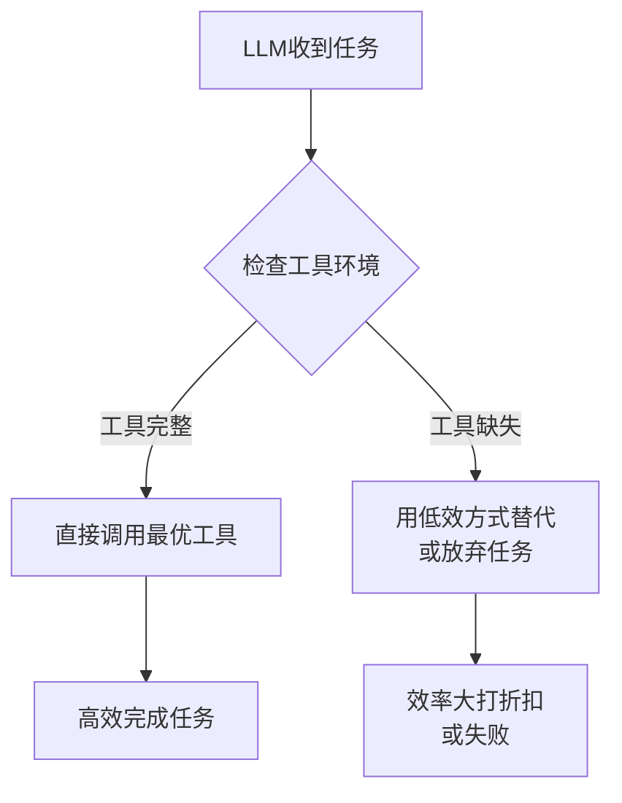
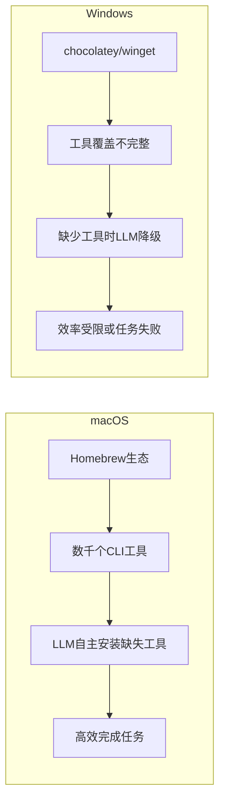
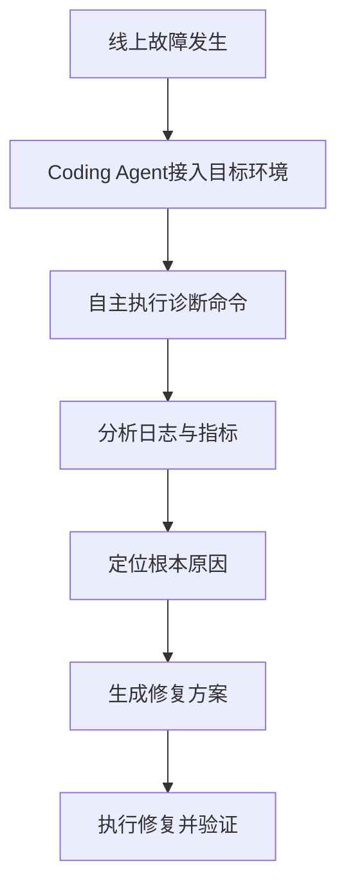
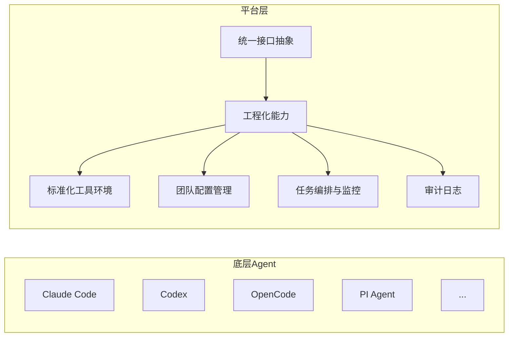
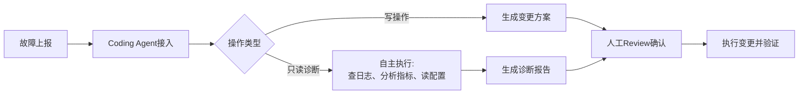

## 前言

在经历了一段时间对多`Agent`协作模式的研究与探索之后，我逐渐清晰地意识到一个容易被忽视的基本事实：**多`Agent`协作的价值建立在单`Agent`能力稳定的基础之上**。

当前，绝大部分团队在`AI Coding`场景下的工作仍然是单`Agent`协作模式。主流的`AI Coding`工具本身也已经在推进多`Agent`协作能力（如`Claude Code`的`subagent`并行执行、`GitHub Copilot`的多编辑器协同等），以提升单次迭代场景下的执行效率。在这种背景下，盲目地投入资源研究多`Agent`协作，反而是一种效率上的浪费。

更重要的是，只有将单`Agent`的能力打磨稳定之后，才能真正理解多`Agent`协作的必要性与价值边界，也才能更清晰地看到多`Agent`协作的设计与实现细节。这就好比：在没有学会骑单车之前，就急着去研究如何编排车队，本末倒置。

因此，本文聚焦于`Coding Agent`平台化落地的核心探索思路：**如何先把单`Agent`的能力打磨稳定，进而推动团队`AI Coding`效率的系统性提升**。

## 当前的核心判断

在深入研究之前，先明确几个核心判断，这些判断是整个平台探索的底层逻辑。

**判断一：主流AI Coding工具的价值远未被充分发挥**

`Claude Code`、`Codex`、`Cursor`等工具的能力早已超出了大多数团队的实际使用水平。绝大多数团队只是将这些工具当成了"智能补全"或"聊天机器人"来使用，而没有发挥出工具真正的自主编程、自动调试、工程化执行的核心能力。问题的根源不在于工具本身，而在于**工具运行的环境和工程化配套**严重缺失。

**判断二：不应该在初期就重复造轮子**

当主流`Coding Agent`在编程和技术排错场景下已经做得足够好时，盲目地自研`Coding Agent`是低效且高风险的。更明智的选择是**以平台封装的方式，站在主流工具的肩膀上，基于自身业务场景做增量价值**。等到业务需求明确、痛点清晰之后，再评估是否有必要自研专属的`Coding Agent`。

**判断三：Coding Agent天然适合B端部署排障场景**

`Coding Agent`不仅仅是一个开发提效工具，其本质是一个能够在不同环境中自主执行命令、分析日志、定位问题的智能执行体。这一能力与`B`端（企业级）的运维排障场景高度契合，是通用`Agent`所不具备的核心优势。

## AI Coding工具价值未被充分发挥的原因

### 工具环境不完整

`AI Coding`工具的实际效果，很大程度上取决于**它所运行的工具环境是否完整**。

主流的大模型（`LLM`）已经训练出了极强的工具调用意识：它知道在遇到网络问题时应该用`curl`排查，在处理`JSON`数据时应该调用`jq`，在分析日志时应该使用`grep`、`awk`，在容器场景下应该用`docker`或`kubectl`。但如果这些工具根本不在运行环境中，`LLM`只能退而求其次——用`Python`脚本模拟，或者直接告知用户"无法完成"。

这就是为什么同样的`Claude Code`，在一个配置完善的开发环境里能够流畅地完成复杂任务，而在一个裸系统上却频繁"卡壳"。工具环境的完整性，是`AI Coding`效率的基础底座。

**常见缺失工具分类**

| 类别 | 工具示例 | 作用场景 |
|------|---------|---------|
| **网络诊断** | `curl`、`wget`、`httpie`、`jq` | `API`调试、数据下载、响应分析 |
| **文本处理** | `grep`、`awk`、`sed`、`ripgrep` | 日志分析、文本搜索与替换 |
| **容器管理** | `docker`、`kubectl`、`helm` | 容器操作、`K8s`集群管理 |
| **版本控制** | `git`、`gh`（`GitHub CLI`） | 代码管理、`PR`操作 |
| **数据库工具** | `psql`、`mysql`、`redis-cli` | 数据库连接与查询 |
| **编译构建** | `make`、`cmake`、各语言构建工具 | 项目构建与依赖管理 |
| **性能分析** | `htop`、`perf`、`strace` | 系统性能诊断 |

### 跨平台能力受限

`AI Coding`工具的效率与所运行的操作系统平台高度相关，但这一点常常被忽视。

在`macOS`下，`Homebrew`提供了极其便利的`CLI`工具安装渠道——一行命令即可安装`jq`、`httpie`、`k9s`等数百个工具，`LLM`完全可以自主调用`brew install`来补全缺失工具。而在`Windows`下，即使有`chocolatey`和`winget`这样的包管理工具，覆盖率也远不及`Homebrew`，很多专业`CLI`工具根本没有上架。这导致同样的`AI`任务，在`Windows`环境下的失败率和降级处理率明显更高。

这种跨平台差异带来了两个现实问题：

- **个人效率不一致**：同一个开发者，在`macOS`上能高效完成的任务，换到`Windows`环境可能要多花数倍时间
- **团队协作障碍**：团队成员使用不同操作系统，`AI`生成的脚本、命令常常无法在其他成员的机器上直接运行

解决跨平台问题的核心思路，是**将工具环境容器化**：将所有必要的`CLI`工具打包到一个标准化的`Docker`镜像中，无论底层是什么操作系统，`AI Coding`工具都在统一的容器环境中运行，消除平台差异带来的效率损耗。

### 团队环境一致性缺失

在`AI`时代的团队协作中，环境不一致问题变得比以往更加突出。

传统开发中，代码在不同机器上的运行差异主要体现在依赖版本上，有`package.json`、`go.mod`等工具链辅助管控。但在`AI Coding`时代，**`AI`生成的代码和方案会被当前机器的工具环境深度影响**：

- A的机器安装了`ripgrep`，所以`AI`生成了使用`rg`的搜索脚本
- B的机器只有原生`grep`，`AI`生成了不同的实现方案
- C的机器是`Windows`，`AI`直接生成了`Python`脚本来处理同一个问题

这三份"解决同一个问题的代码"，风格迥异、互不通用，成为团队知识积累的障碍，也增加了代码`Review`的认知负担。

更严重的是，这种不一致会带来一种隐性风险：**某些问题在A的机器上能被`AI`高效解决，但在B的机器上`AI`却"不会"处理**——同一个问题，不同的工具环境，`AI`的实际能力表现差异巨大。

**团队环境一致性建设的核心手段**

| 手段 | 描述 | 优先级 |
|------|------|------|
| 工具链镜像 | 构建团队共享的基础`Docker`镜像，预装所有必要工具，统一`C`端本地开发与`B`端排障场景的运行环境 | 高 |
| 团队`AI`配置共享 | 在代码仓库中统一维护`.claude`、`AGENTS.md`等项目级`AI`配置文件 | 高 |
| `AI Skills`库 | 将团队领域知识、业务规范、操作流程沉淀为可复用的`Skills`，让`Agent`在不同项目中具备一致的专业能力，覆盖范围远超项目规范文档 | 高 |
| 环境检查脚本 | 提供一键检查当前环境是否满足`AI Coding`所需工具的脚本 | 中 |

### 传统Coding工具过重

在`AI`时代，人工的核心职能已经发生了根本性转变：从**全程参与编码**转变为 **`Review`决策与方向把控**。

然而，传统的`IDE`（集成开发环境）仍然是按照"人工全程编码"的设计范式构建的：

- 复杂的`UI`界面，大量功能入口分散注意力
- 繁重的插件配置，每次新成员入职都需要数小时配置环境
- 工具本身的学习曲线，成为团队`AI Coding`普及的障碍

**当人工的主要工作是`Review`时，工具的复杂度就变成了负担而非助力。**

更重要的是，过重的工具会分散人工的注意力。在`AI Coding`工作流中，人工最需要聚焦的是：需求是否被正确理解？关键设计决策是否合理？生成的代码是否存在安全隐患？——而不是被`IDE`中的某个工具配置或插件冲突所困扰。

轻量化`Coding`工具的价值，不仅仅是减少资源消耗，更在于**将人工的认知资源集中到真正重要的判断与决策上**。终端 + 编辑器 + 主流`Coding Agent`的极简组合，往往比功能繁多的重量级`IDE`在`AI`工作流中更高效。

### 缺乏B端部署与排障场景支持

当前绝大部分`AI Coding`工具是面向`C`端（个人开发者）研发的，缺乏对`B`端（企业级）场景的深入考量，其中最典型的缺失是：**在不同部署环境中利用`Agent`去排查问题的能力**。

这是一个被严重低估的应用场景。`Coding Agent`的核心能力——在给定环境中自主执行命令、读取文件、分析日志、调用`API`、理解代码上下文——恰恰是线上故障排查所需要的全部能力：

传统的`B`端运维排障流程依赖大量人工操作：SSH登录、手动查日志、逐行分析、经验判断。一个具备完整工具环境的`Coding Agent`，完全可以自主完成这一流程的大部分步骤，将人工的介入点压缩到**最终决策**的环节。

相比通用`Agent`，`Coding Agent`在这一场景下具有天然优势：

| 能力维度 | 通用Agent | Coding Agent |
|---------|---------|------------|
| **代码理解** | 一般 | 强 |
| **命令行操作** | 基础 | 专业 |
| **日志分析** | 基础 | 强（理解错误栈、日志结构）|
| **跨服务调用** | 一般 | 强（理解`API`契约）|
| **修复方案生成** | 建议级 | 可执行级 |
| **修复后验证** | 不支持 | 自动运行测试验证 |

## Coding Agent平台的探索思路

基于上述痛点分析，`Coding Agent`平台化的核心思路并不是从零自研一个新的`Coding Agent`，而是**以平台封装的方式，整合主流`Coding Agent`的能力，并在此基础上补齐环境、工程化和`B`端场景的缺失**。

### 以主流Coding Agent为底座

`Claude Code`、`Codex`、`OpenCode`、`PI Agent`等主流工具在编程和技术排错场景下已经具备了极强的能力。这些工具背后的模型能力、上下文管理、工具调用机制，是经过大量工程投入打磨的成果，短期内自研无法超越。

平台层面需要做的是**抽象适配层**：屏蔽不同底层`Coding Agent`的接口差异，让上层的工程化能力（环境标准化、配置管理、任务编排、审计日志）能够统一应用于任意底层`Agent`。

这种设计的核心价值在于：**底层`Agent`可以随着市场演进自由切换，上层的工程化积累不会随之丢失**。

### 优先建设标准化工具环境

在平台化探索的初期，**工具环境标准化**是最高优先级、投入产出比最高的基础建设。

核心做法是**构建一个包含完整工具链的标准`Docker`镜像**：将`AI Coding`场景所需的常用`CLI`工具（网络调试、文本处理、容器管理、数据库客户端等）统一打包进同一个镜像中，作为`Coding Agent`的运行底座。团队所有开发者基于同一个镜像启动`Coding Agent`，即可天然保证工具环境一致，彻底消除"在A的机器上能跑、在B的机器上不行"的问题。

这个镜像同时具备两个方向的部署能力：

- **`C`端开发场景**：开发者在本地拉起该镜像作为`Coding Agent`的运行环境，获得完整工具支撑，无论底层是`macOS`还是`Windows`，`Agent`的能力表现一致
- **`B`端排障场景**：将同一个镜像部署到不同的生产环境中，`Coding Agent`即可在目标环境内自主执行诊断命令、分析日志、定位问题，复用完全相同的工具链能力

### 先单Agent，后多Agent

在平台演进路径上，应当严格遵循"先单`Agent`稳定，再多`Agent`协作"的原则。

单`Agent`能力的打磨，重点在以下几个维度：

| 维度 | 关注点 |
|------|------|
| **任务完成率** | `Agent`能够独立完成端到端任务的比例 |
| **上下文管理** | 长任务场景下的上下文质量保持 |
| **工具调用准确性** | 工具选择与参数构造的准确率 |
| **自验证能力** | 完成任务后主动运行测试验证结果 |
| **失败恢复** | 遇到错误时的自主分析与重试能力 |

只有当以上维度的单`Agent`表现稳定之后，多`Agent`协作的引入才会带来真正的增量价值。否则，多`Agent`只会将单`Agent`的问题成倍放大，同时引入更复杂的协调和调试负担。

### 面向B端场景的能力延伸

在单`Agent`能力稳定之后，可以逐步向`B`端部署与排障场景延伸。

核心思路是：将`Coding Agent`以**只读诊断模式**部署到不同的生产环境中，赋予其访问日志、执行诊断命令、分析指标的能力，但严格限制其执行写操作（代码变更、数据修改、配置变更）。写操作必须经过人工`Review`和确认后方可执行。

这种"诊断自主、变更审查"的模式，能够在保障安全边界的前提下，最大化`Coding Agent`在`B`端场景中的价值。

## 当前工作重心与实践建议

基于以上分析，在当前阶段，我建议将工作重心聚焦在以下几个方向：

**方向一：打磨单Agent工程化配套**

持续完善`AGENTS.md`、`CLAUDE.md`、技能库（`Skills`）等工程化配置，使单`Agent`在项目中的表现更加稳定、可预测。这些工程化积累的价值，会在每一次`AI Coding`迭代中持续复利。

**方向二：建设标准化工具环境**

推动团队`Dev Container`标准化，将`AI Coding`所需的工具链纳入版本控制，确保每个成员的`Agent`运行在一致的工具环境中。

**方向三：探索轻量化工作流**

基于终端 + 编辑器 + 主流`Coding Agent`的极简组合，探索适合`AI`时代的轻量化工作流，将人工的注意力聚焦在`Review`、决策和架构设计上。

**方向四：积累B端排障场景的实践经验**

在现有项目中，逐步尝试将`Coding Agent`引入问题排查场景，积累"在什么环境下、用什么工具、以什么方式"能够最高效地定位问题的实践经验，为后续`B`端`Agent`平台化奠定基础。

## 总结

`Coding Agent`平台化不是一个"颠覆式创新"的命题，而是一个**基于现实工程问题的渐进式建设过程**。

主流`Coding Agent`工具已经足够强大，但工程化的配套严重缺失——这是当前最大的机会窗口。填补这个缺口，不需要自研全新的`Agent`，而是需要在**工具环境标准化、跨平台一致性、团队协作规范、轻量化工作流**这几个维度上做扎实的工程建设。

先把单`Agent`的能力打磨稳定，让每一个开发者都能真正用好手中的`Coding Agent`；在此基础上，再去探索多`Agent`协作和`B`端部署排障场景——这才是务实、可落地的平台化演进路径。

