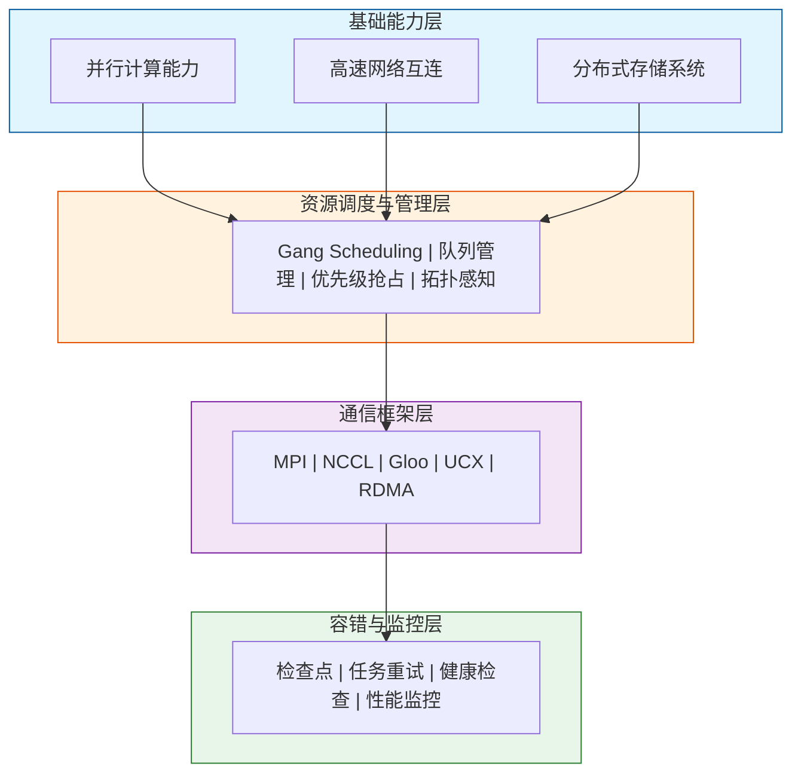

## 概述

`Volcano`是`CNCF`云原生批处理调度系统，专为高性能计算（`HPC`）、机器学习、大数据等批处理工作负载设计。本文档详细梳理`Volcano`生态中支持`HPC`的各个组件，并进行对比分析。


## 一、什么是HPC

### 1.1 HPC定义

**HPC（High Performance Computing，高性能计算）** 是指利用聚合计算能力处理标准工作站无法完成的复杂计算任务的技术。`HPC`系统通过将大量计算节点互联，协同工作以解决科学、工程和商业领域中的大规模计算问题。

### 1.2 HPC的核心特征

| 特征 | 说明 |
|------|------|
| **大规模并行** | 将计算任务分解为多个子任务，在多个处理器上同时执行 |
| **高速互连** | 节点间通过高带宽、低延迟网络（如`InfiniBand`）通信 |
| **海量数据处理** | 能够处理`TB`到`PB`级别的数据集 |
| **高吞吐量** | 单位时间内完成大量计算任务 |
| **可扩展性** | 支持从数十到数万个计算节点的扩展 |

### 1.3 HPC典型应用场景

| 领域 | 应用场景 | 计算特点 |
|------|----------|----------|
| **科学研究** | 气候模拟、分子动力学、天体物理 | 大规模数值计算、长时间运行 |
| **工程仿真** | `CFD`流体力学、结构力学、电磁仿真 | 有限元分析、迭代求解 |
| **生命科学** | 基因测序、蛋白质折叠、药物发现 | 序列比对、分子模拟 |
| **AI/深度学习** | 大模型训练、推理优化 | `GPU`密集、梯度同步 |
| **金融分析** | 风险建模、量化交易、蒙特卡洛模拟 | 高频计算、实时性要求 |
| **能源勘探** | 地震数据处理、油藏模拟 | 大规模数据处理、复杂算法 |


## 二、实现HPC的关键能力

### 2.1 并行计算能力

并行计算是`HPC`的核心，主要包括以下几种并行模式：

| 并行模式 | 说明 | 典型实现 | 适用场景 |
|----------|------|----------|----------|
| **数据并行** | 将数据分片，每个处理器处理不同数据 | `MPI`、`OpenMP` | 大规模数据处理 |
| **任务并行** | 将任务分解，不同处理器执行不同任务 | `MPI`、线程池 | 异构计算任务 |
| **流水线并行** | 将计算分阶段，形成流水线处理 | `Pipeline Parallel` | 深度学习模型训练 |
| **模型并行** | 将模型分片到不同设备 | `Tensor Parallel` | 超大模型训练 |

### 2.2 高速网络互连

节点间通信效率直接影响`HPC`系统性能：

| 网络技术 | 带宽 | 延迟 | 适用场景 |
|----------|------|------|----------|
| **InfiniBand HDR** | `200 Gbps` | `< 1 μs` | 大规模`HPC`集群 |
| **InfiniBand NDR** | `400 Gbps` | `< 1 μs` | 下一代`HPC`/`AI`集群 |
| **RoCE v2** | `100-400 Gbps` | `1-2 μs` | 数据中心、云环境 |
| **NVLink** | `600-900 GB/s` | 极低 | `GPU`间直连通信 |
| **以太网** | `10-100 Gbps` | `10-100 μs` | 通用计算、成本敏感 |

### 2.3 分布式通信框架

`HPC`依赖高效的通信框架实现节点间数据交换：

| 通信框架 | 说明 | 核心特性 |
|----------|------|----------|
| **MPI** | 消息传递接口标准 | 点对点通信、集合通信、进程组管理 |
| **NCCL** | `NVIDIA`集合通信库 | `GPU`优化、`Ring AllReduce`、`NVLink`支持 |
| **Gloo** | `Facebook`开源通信库 | 跨平台、支持`CPU/GPU` |
| **UCX** | 统一通信框架 | 硬件抽象、多传输支持 |

### 2.4 资源调度与管理

`HPC`系统需要高效的资源调度能力：

| 调度能力 | 说明 | 重要性 |
|----------|------|--------|
| **Gang Scheduling** | 确保并行任务所有进程同时启动 | ⭐⭐⭐⭐⭐ |
| **资源预留** | 为大规模任务预留资源 | ⭐⭐⭐⭐⭐ |
| **队列管理** | 多队列隔离、公平调度 | ⭐⭐⭐⭐ |
| **优先级抢占** | 高优先级任务抢占低优先级资源 | ⭐⭐⭐⭐ |
| **拓扑感知** | 考虑网络拓扑优化任务放置 | ⭐⭐⭐⭐ |
| **亲和性调度** | 将相关任务调度到相近节点 | ⭐⭐⭐⭐ |

### 2.5 存储与I/O能力

`HPC`对存储系统有特殊要求：

| 存储类型 | 特点 | 典型系统 |
|----------|------|----------|
| **并行文件系统** | 高带宽、支持并发访问 | `Lustre`、`GPFS`、`BeeGFS` |
| **对象存储** | 海量数据、高扩展性 | `Ceph`、`MinIO`、`S3`、`3FS` |
| **本地NVMe** | 超低延迟、高`IOPS` | 本地`SSD`缓存 |
| **内存文件系统** | 极致性能、临时数据 | `tmpfs`、`ramfs` |

### 2.6 容错与检查点

大规模长时间运行的`HPC`任务需要容错机制：

| 容错能力 | 说明 |
|----------|------|
| **检查点保存** | 定期保存计算状态，支持故障恢复 |
| **任务重试** | 失败任务自动重新调度执行 |
| **节点替换** | 故障节点自动替换，任务继续运行 |
| **数据冗余** | 关键数据多副本存储 |

### 2.7 HPC关键能力总览




## 三、生态组件总览对比

| 组件 | 适用场景 | 并行模式 | 通信后端 | 弹性支持 | 成熟度 | 社区活跃度 |
|------|----------|----------|----------|----------|--------|------------|
| **MPI Operator** | 传统`HPC`、科学计算 | `MPI`进程并行 | `MPI` (`TCP/IB/RDMA`) | ❌ | ⭐⭐⭐⭐⭐ | 高 |
| **PyTorch Operator** | 深度学习训练 | 数据并行/模型并行 | `NCCL`/`Gloo` | ✅ | ⭐⭐⭐⭐⭐ | 高 |
| **TensorFlow Operator** | 深度学习训练 | `PS/AllReduce` | `gRPC/NCCL` | ❌ | ⭐⭐⭐⭐ | 中 |
| **PaddlePaddle Operator** | 深度学习训练 | `Collective/PS` | `NCCL/Gloo` | ✅ | ⭐⭐⭐ | 中 |
| **Horovod** | 多框架分布式训练 | `AllReduce` | `MPI/NCCL/Gloo` | ❌ | ⭐⭐⭐⭐ | 中 |
| **Ray Operator** | 分布式计算/强化学习 | `Actor`模型 | `Ray`内置 | ✅ | ⭐⭐⭐⭐ | 高 |
| **Spark Operator** | 大数据处理 | `MapReduce/DAG` | `Shuffle` | ✅ | ⭐⭐⭐⭐⭐ | 高 |
| **Kubeflow Training Operator** | 统一训练管理 | 多种模式 | 多种后端 | 部分 | ⭐⭐⭐⭐ | 高 |


## 四、各组件详细介绍

### 4.1 MPI Operator

#### 简介

`MPI`（`Message Passing Interface`，消息传递接口）是`HPC`领域最重要的并行编程标准，定义了进程间通信的接口规范。`MPI Operator`将这一经典的`HPC`编程模型引入`Kubernetes`云原生环境，使传统`HPC`应用能够无缝迁移到容器化平台。

#### MPI核心概念

| 概念 | 说明 |
|------|------|
| **进程（Rank）** | `MPI`程序中的独立执行单元，每个进程有唯一的`rank`编号 |
| **通信域（Communicator）** | 定义可以相互通信的进程集合 |
| **点对点通信** | 两个进程之间的直接消息传递（`Send/Recv`） |
| **集合通信** | 多个进程参与的通信操作（`Broadcast/Reduce/AllReduce`） |
| **同步/异步** | 阻塞式和非阻塞式通信模式 |

#### 支持的MPI实现

| MPI实现 | 特点 | 适用场景 |
|---------|------|----------|
| **Open MPI** | 开源、模块化设计、社区活跃 | 通用`HPC`环境 |
| **Intel MPI** | `Intel`硬件优化、高性能 | `Intel`平台、商业环境 |
| **MPICH** | 高性能、便携式、参考实现 | 研究开发、跨平台 |
| **MVAPICH** | `InfiniBand/RDMA`优化 | 高性能网络环境 |

#### MPI集合通信操作

| 操作 | 说明 | 应用场景 |
|------|------|----------|
| **Broadcast** | 一对多广播数据 | 参数分发 |
| **Scatter** | 将数据分片发送给所有进程 | 数据分发 |
| **Gather** | 收集所有进程的数据 | 结果汇总 |
| **AllGather** | 所有进程收集所有数据 | 全局数据同步 |
| **Reduce** | 归约操作（求和、最大值等） | 梯度聚合 |
| **AllReduce** | 归约后广播结果 | 分布式训练梯度同步 |
| **AllToAll** | 全交换通信 | 矩阵转置、`FFT` |

#### 与Volcano集成特性

`MPI Operator`与`Volcano`调度器深度集成，提供以下增强能力：

| 特性 | 说明 |
|------|------|
| **Gang Scheduling** | 确保所有`MPI`进程同时启动，避免死锁 |
| **SSH Plugin** | 自动配置`SSH`免密登录 |
| **SVC Plugin** | 自动创建`Headless Service`用于进程发现 |
| **ENV Plugin** | 自动注入`MPI`相关环境变量 |


#### 配置示例
```yaml
apiVersion: kubeflow.org/v2beta1
kind: MPIJob
metadata:
  name: mpi-job-sample
spec:
  slotsPerWorker: 1
  runPolicy:
    cleanPodPolicy: Running
  mpiReplicaSpecs:
    Launcher:
      replicas: 1
      template:
        spec:
          containers:
          - name: mpi-launcher
            image: mpioperator/mpi-pi:latest
            command:
            - mpirun
            - -np
            - "4"
            - /home/mpiuser/pi
    Worker:
      replicas: 4
      template:
        spec:
          containers:
          - name: mpi-worker
            image: mpioperator/mpi-pi:latest
            resources:
              limits:
                nvidia.com/gpu: 1
```

#### 优点

| 优点 | 说明 |
|------|------|
| **标准化** | 遵循`MPI`标准，现有`HPC`代码无需修改 |
| **高性能** | 支持`InfiniBand/RDMA`高速网络 |
| **成熟稳定** | 经过多年生产环境验证 |
| **生态丰富** | 大量科学计算库基于`MPI`（`PETSc`、`FFTW`、`ScaLAPACK`等） |
| **硬件支持** | 支持`GPU Direct RDMA`，`GPU`间直接通信 |

#### 缺点

| 缺点 | 说明 |
|------|------|
| **无弹性** | 不支持运行时动态扩缩容 |
| **容错性差** | 单进程失败导致整个作业失败 |
| **配置复杂** | `SSH`免密、`hostfile`配置繁琐（`Volcano`可简化） |
| **资源利用率** | 需要预先分配所有资源 |
| **调试困难** | 分布式环境下问题定位复杂 |


### 4.2 PyTorch Operator

#### 简介

`PyTorch Operator`为`PyTorch`分布式训练提供云原生支持，是目前最流行的深度学习训练`Operator`之一。它通过`PyTorchJob CRD`简化了分布式训练的部署和管理，支持从单机多卡到多机多卡的各种训练场景。

#### 支持的分布式策略

| 策略 | 说明 | 适用场景 | 内存效率 |
|------|------|----------|----------|
| **DDP** | 数据并行，每个`GPU`持有完整模型副本 | 中小模型、数据量大 | 低 |
| **FSDP** | 完全分片数据并行，模型参数分片存储 | 大模型训练 | 高 |
| **Pipeline Parallel** | 模型按层切分，流水线执行 | 超深模型 | 中 |
| **Tensor Parallel** | 单层内部张量切分 | 超宽模型 | 中 |
| **3D Parallel** | `DDP + PP + TP`组合 | 超大规模模型（`GPT-3`级别） | 高 |

#### 通信后端详解

| 后端 | 适用场景 | 性能 | 特点 |
|------|----------|------|------|
| **NCCL** | `GPU`集群 | ⭐⭐⭐⭐⭐ | `NVIDIA`优化，支持`NVLink/IB` |
| **Gloo** | `CPU/GPU`混合 | ⭐⭐⭐⭐ | 跨平台，支持`TCP/IB` |
| **MPI** | 传统`HPC`环境 | ⭐⭐⭐⭐ | 标准化，兼容性好 |

#### TorchElastic弹性训练

`PyTorch Operator`支持`TorchElastic`，提供以下弹性能力：

| 能力 | 说明 |
|------|------|
| **动态扩缩容** | 运行时增加或减少`Worker`数量 |
| **故障容忍** | 单个`Worker`失败不影响整体训练 |
| **自动恢复** | 从检查点自动恢复训练状态 |
| **资源弹性** | 根据资源可用性动态调整 |

#### 配置示例
```yaml
apiVersion: kubeflow.org/v1
kind: PyTorchJob
metadata:
  name: pytorch-ddp-job
spec:
  pytorchReplicaSpecs:
    Master:
      replicas: 1
      restartPolicy: OnFailure
      template:
        spec:
          containers:
          - name: pytorch
            image: pytorch/pytorch:2.0.0-cuda11.7-cudnn8-runtime
            command:
            - python
            - -m
            - torch.distributed.launch
            - --nproc_per_node=4
            - --nnodes=2
            - train.py
            resources:
              limits:
                nvidia.com/gpu: 4
    Worker:
      replicas: 1
      restartPolicy: OnFailure
      template:
        spec:
          containers:
          - name: pytorch
            image: pytorch/pytorch:2.0.0-cuda11.7-cudnn8-runtime
            resources:
              limits:
                nvidia.com/gpu: 4
```

#### 优点

| 优点 | 说明 |
|------|------|
| **弹性训练** | 支持`TorchElastic`动态扩缩容 |
| **容错恢复** | 支持检查点自动恢复 |
| **易用性高** | 与`PyTorch`原生API无缝集成 |
| **社区活跃** | 持续更新，问题响应快 |
| **生态丰富** | `HuggingFace`、`DeepSpeed`、`Megatron`等深度集成 |
| **调试工具** | 支持`torch.distributed.launch`、`torchrun`等工具 |

#### 缺点

| 缺点 | 说明 |
|------|------|
| **框架绑定** | 仅支持`PyTorch` |
| **学习曲线** | 分布式概念需要学习 |
| **调试困难** | 分布式环境调试复杂 |
| **版本兼容** | 不同PyTorch版本API可能有差异 |


### 4.3 TensorFlow Operator

#### 简介

`TensorFlow Operator`支持`TensorFlow`分布式训练，通过`TFJob CRD`管理分布式训练作业，自动处理`TF_CONFIG`环境变量注入和服务发现。支持`Parameter Server`和`AllReduce`两种主流分布式策略。

#### 分布式策略详解

| 策略 | 架构 | 适用场景 | 通信模式 | 优缺点 |
|------|------|----------|----------|--------|
| **Parameter Server** | `PS + Worker` | 大规模稀疏模型 | 异步/同步 | 适合稀疏特征，`PS`可能成为瓶颈 |
| **AllReduce** | 对等节点 | 密集模型训练 | 同步 | 通信效率高，适合密集模型 |
| **MultiWorkerMirrored** | 多`Worker`镜像 | 数据并行 | 同步 | 易用性好，自动处理同步 |
| **TPUStrategy** | `TPU`集群 | `TPU`训练 | 同步 | `TPU`专用，高性能 |

#### TF_CONFIG自动注入

`TensorFlow Operator`自动为每个`Pod`注入`TF_CONFIG`环境变量：

```json
{
  "cluster": {
    "worker": ["worker-0:2222", "worker-1:2222"],
    "ps": ["ps-0:2222"]
  },
  "task": {
    "type": "worker",
    "index": 0
  }
}
```

#### 配置示例
```yaml
apiVersion: kubeflow.org/v1
kind: TFJob
metadata:
  name: tf-ps-job
spec:
  tfReplicaSpecs:
    PS:
      replicas: 2
      restartPolicy: Never
      template:
        spec:
          containers:
          - name: tensorflow
            image: tensorflow/tensorflow:2.12.0-gpu
            command: ["python", "train.py"]
    Worker:
      replicas: 4
      restartPolicy: Never
      template:
        spec:
          containers:
          - name: tensorflow
            image: tensorflow/tensorflow:2.12.0-gpu
            command: ["python", "train.py"]
            resources:
              limits:
                nvidia.com/gpu: 1
```

#### 优点

| 优点 | 说明 |
|------|------|
| **策略丰富** | 支持多种分布式策略 |
| **自动配置** | 自动注入`TF_CONFIG`环境变量 |
| **生态完善** | `TensorFlow`生态系统支持 |
| **TPU支持** | 原生支持`Google TPU` |
| **SavedModel** | 标准化模型导出格式 |

#### 缺点

| 缺点 | 说明 |
|------|------|
| **无弹性** | 不支持动态扩缩容 |
| **复杂度高** | `PS`模式配置复杂 |
| **性能开销** | `PS`模式存在通信瓶颈 |
| **版本碎片** | `TF1.x`和`TF2.x` `API`差异大 |


### 4.4 PaddlePaddle Operator

#### 简介

`PaddlePaddle Operator`是百度飞桨深度学习框架的`Kubernetes Operator`，支持国产`AI`框架的分布式训练。作为国内最成熟的深度学习框架之一，飞桨在中文`NLP`、`OCR`、推荐系统等领域有广泛应用。

#### 支持的训练模式

| 模式 | 说明 | 适用场景 |
|------|------|----------|
| **Collective模式** | 基于`AllReduce`的数据并行 | 密集模型、中小规模 |
| **Parameter Server模式** | `PS`架构，适合稀疏特征 | 大规模稀疏模型、推荐系统 |
| **Elastic模式** | 弹性训练，支持动态扩缩容 | 资源弹性需求场景 |

#### 飞桨特色能力

| 能力 | 说明 |
|------|------|
| **自动混合精度** | 自动`FP16/BF16`训练 |
| **梯度累积** | 支持大`batch`训练 |
| **分布式推理** | 支持大模型分布式推理 |
| **模型压缩** | 量化、剪枝、蒸馏一体化 |

#### 配置示例
```yaml
apiVersion: batch.paddlepaddle.org/v1
kind: PaddleJob
metadata:
  name: paddle-job
spec:
  cleanPodPolicy: Never
  withGloo: 1
  worker:
    replicas: 2
    template:
      spec:
        containers:
        - name: paddle
          image: registry.baidubce.com/paddlepaddle/paddle:2.4.2-gpu-cuda11.7
          command: ["python", "-m", "paddle.distributed.launch", "train.py"]
          resources:
            limits:
              nvidia.com/gpu: 1
  ps:
    replicas: 1
    template:
      spec:
        containers:
        - name: paddle
          image: registry.baidubce.com/paddlepaddle/paddle:2.4.2
          command: ["python", "train.py"]
```

#### 优点

| 优点 | 说明 |
|------|------|
| **国产化** | 支持国产`AI`框架，符合信创要求 |
| **弹性训练** | 支持`Elastic`模式 |
| **易用性** | 与飞桨`API`深度集成 |
| **中文生态** | 中文文档完善，社区支持好 |
| **行业模型** | 提供丰富的预训练模型库 |

#### 缺点

| 缺点 | 说明 |
|------|------|
| **生态较小** | 相比`PyTorch/TF`国际社区较小 |
| **国际化** | 国际社区支持有限 |
| **第三方集成** | 部分第三方工具支持不如`PyTorch` |


### 4.5 Horovod

#### 简介

`Horovod`是`Uber`开源的分布式深度学习框架，基于`MPI`的`AllReduce`通信模式，支持多种深度学习框架。其核心优势是只需少量代码修改即可将单机训练代码转换为分布式训练，实现接近线性的扩展效率。

#### 核心设计理念

| 原则 | 说明 |
|------|------|
| **简单易用** | 最小化代码改动，几行代码实现分布式 |
| **高性能** | 基于`Ring AllReduce`算法，通信效率高 |
| **框架无关** | 统一接口支持多种深度学习框架 |
| **MPI兼容** | 利用成熟的`MPI`生态和工具 |

#### 支持的框架

| 框架 | 支持程度 | 说明 |
|------|----------|------|
| **TensorFlow** | ⭐⭐⭐⭐⭐ | 完整支持，包括Keras |
| **PyTorch** | ⭐⭐⭐⭐⭐ | 完整支持 |
| **MXNet** | ⭐⭐⭐⭐ | 良好支持 |
| **Keras** | ⭐⭐⭐⭐ | 通过TensorFlow后端支持 |

#### 代码改动示例

将单机训练代码转换为`Horovod`分布式训练只需几行改动：

```python
import horovod.torch as hvd

# 初始化Horovod
hvd.init()

# 绑定GPU
torch.cuda.set_device(hvd.local_rank())

# 包装优化器
optimizer = hvd.DistributedOptimizer(optimizer)

# 广播初始参数
hvd.broadcast_parameters(model.state_dict(), root_rank=0)
```


#### 配置示例（通过MPI Operator）
```yaml
apiVersion: kubeflow.org/v2beta1
kind: MPIJob
metadata:
  name: horovod-job
spec:
  slotsPerWorker: 4
  mpiReplicaSpecs:
    Launcher:
      replicas: 1
      template:
        spec:
          containers:
          - name: horovod
            image: horovod/horovod:0.28.1
            command:
            - horovodrun
            - -np
            - "8"
            - -H
            - "worker-0:4,worker-1:4"
            - python
            - train.py
    Worker:
      replicas: 2
      template:
        spec:
          containers:
          - name: horovod
            image: horovod/horovod:0.28.1
            resources:
              limits:
                nvidia.com/gpu: 4
```

#### 优点

| 优点 | 说明 |
|------|------|
| **多框架支持** | 统一的分布式训练接口 |
| **高效通信** | `Ring AllReduce`算法优化 |
| **代码改动小** | 只需少量代码修改 |
| **性能优异** | 接近线性扩展 |
| **调试友好** | 支持`horovodrun`本地调试 |

#### 缺点

| 缺点 | 说明 |
|------|------|
| **无弹性** | 不支持动态扩缩容 |
| **MPI依赖** | 需要`MPI`环境配置 |
| **维护状态** | 社区活跃度下降，更新频率降低 |
| **容错性差** | 单进程失败导致整体失败 |


### 4.6 Ray Operator

#### 简介

`Ray`是由`UC Berkeley RISELab`开发的通用分布式计算框架，特别适合强化学习、超参数调优和分布式`Python`应用。`Ray Operator`将`Ray`集群管理能力带入`Kubernetes`，支持自动扩缩容和故障恢复。

#### 核心组件

| 组件 | 功能 | 适用场景 |
|------|------|----------|
| **Ray Core** | 分布式计算基础设施 | 通用分布式应用 |
| **Ray Train** | 分布式训练 | 深度学习训练 |
| **Ray Tune** | 超参数调优 | `AutoML`、`HPO` |
| **Ray Serve** | 模型服务 | 在线推理 |
| **RLlib** | 强化学习库 | `RL`训练 |
| **Ray Data** | 分布式数据处理 | 数据预处理 |

#### Actor编程模型

`Ray`的核心是`Actor`编程模型：

```python
import ray

# 定义Actor
@ray.remote
class Counter:
    def __init__(self):
        self.value = 0
    
    def increment(self):
        self.value += 1
        return self.value

# 创建Actor实例
counter = Counter.remote()

# 调用Actor方法
result = ray.get(counter.increment.remote())
```

#### 配置示例
```yaml
apiVersion: ray.io/v1
kind: RayJob
metadata:
  name: ray-job-sample
spec:
  entrypoint: python train.py
  runtimeEnvYAML: |
    pip:
      - torch
      - ray[train]
  rayClusterSpec:
    headGroupSpec:
      rayStartParams:
        dashboard-host: '0.0.0.0'
      template:
        spec:
          containers:
          - name: ray-head
            image: rayproject/ray:2.7.0-py310-gpu
            resources:
              limits:
                nvidia.com/gpu: 1
    workerGroupSpecs:
    - replicas: 2
      minReplicas: 1
      maxReplicas: 4
      groupName: gpu-workers
      rayStartParams: {}
      template:
        spec:
          containers:
          - name: ray-worker
            image: rayproject/ray:2.7.0-py310-gpu
            resources:
              limits:
                nvidia.com/gpu: 1
```

#### 优点

| 优点 | 说明 |
|------|------|
| **弹性扩展** | 支持自动扩缩容 |
| **通用性强** | 不限于深度学习 |
| **Actor模型** | 灵活的分布式编程模型 |
| **生态丰富** | 内置多种`AI`工具库 |
| **故障恢复** | 自动重启失败的`Actor`|
| **资源管理** | 细粒度资源分配 |

#### 缺点

| 缺点 | 说明 |
|------|------|
| **学习成本** | `Ray`编程模型需要学习 |
| **资源开销** | `Head`节点资源消耗 |
| **复杂度** | 集群管理相对复杂 |
| **调试难度** | 分布式`Actor`调试困难 |


### 4.7 Spark Operator

#### 简介

`Spark Operator`支持在`Kubernetes`上运行`Apache Spark`应用，适合大数据处理和机器学习工作负载。`Spark`是大数据领域最流行的计算引擎，支持批处理、流处理、机器学习和图计算。

#### 支持的运行模式

| 模式 | 说明 | 适用场景 |
|------|------|----------|
| **Cluster Mode** | `Driver`运行在集群内 | 生产环境、长时间运行 |
| **Client Mode** | `Driver`运行在提交节点 | 交互式开发、调试 |

#### Spark核心组件

| 组件 | 功能 |
|------|------|
| **Spark SQL** | 结构化数据处理 |
| **Spark Streaming** | 实时流处理 |
| **MLlib** | 机器学习库 |
| **GraphX** | 图计算 |
| **Structured Streaming** | 统一批流处理 |

#### 配置示例
```yaml
apiVersion: sparkoperator.k8s.io/v1beta2
kind: SparkApplication
metadata:
  name: spark-pi
spec:
  type: Scala
  mode: cluster
  image: spark:3.4.0
  mainClass: org.apache.spark.examples.SparkPi
  mainApplicationFile: local:///opt/spark/examples/jars/spark-examples.jar
  sparkVersion: "3.4.0"
  restartPolicy:
    type: Never
  driver:
    cores: 1
    memory: "512m"
    serviceAccount: spark
  executor:
    cores: 1
    instances: 2
    memory: "512m"
  dynamicAllocation:
    enabled: true
    initialExecutors: 2
    minExecutors: 1
    maxExecutors: 10
```

#### 优点

| 优点 | 说明 |
|------|------|
| **动态分配** | 支持`Executor`动态扩缩容 |
| **生态成熟** | `Spark`生态系统完善 |
| **大数据支持** | 适合大规模数据处理 |
| **多语言** | 支持`Scala/Java/Python/R` |
| **统一引擎** | 批处理、流处理、ML统一 |

#### 缺点

| 缺点 | 说明 |
|------|------|
| **资源开销** | `JVM`内存开销较大 |
| **启动延迟** | 冷启动时间较长 |
| **复杂配置** | `Spark`配置参数众多 |
| **小文件问题** | 处理大量小文件效率低 |


### 4.8 Kubeflow Training Operator

#### 简介

`Kubeflow Training Operator`是一个统一的训练作业管理组件，整合了多种框架的`Operator`功能。它是`Kubeflow`项目的核心组件之一，提供统一的作业管理接口，原生支持`Volcano`调度器集成。

#### 支持的作业类型

| 作业类型 | CRD | 说明 |
|----------|-----|------|
| **PyTorch** | `PyTorchJob` | `PyTorch`分布式训练 |
| **TensorFlow** | `TFJob` | `TensorFlow`分布式训练 |
| **MPI** | `MPIJob` | `MPI`并行计算 |
| **XGBoost** | `XGBoostJob` | `XGBoost`分布式训练 |
| **PaddlePaddle** | `PaddleJob` | 飞桨分布式训练 |
| **MXNet** | `MXJob` | `MXNet`分布式训练 |

#### 与Volcano集成

`Kubeflow Training Operator`原生支持`Volcano`调度器：

```yaml
spec:
  runPolicy:
    schedulingPolicy:
      minAvailable: 2
      queue: default
      priorityClass: high-priority
  pytorchReplicaSpecs:
    Master:
      template:
        spec:
          schedulerName: volcano  # 使用Volcano调度器
```

#### 配置示例
```yaml
apiVersion: kubeflow.org/v1
kind: PyTorchJob
metadata:
  name: unified-pytorch-job
spec:
  runPolicy:
    cleanPodPolicy: Running
    schedulingPolicy:
      minAvailable: 2
      queue: default
      priorityClass: high-priority
  pytorchReplicaSpecs:
    Master:
      replicas: 1
      template:
        spec:
          schedulerName: volcano
          containers:
          - name: pytorch
            image: pytorch/pytorch:2.0.0
            command: ["python", "train.py"]
    Worker:
      replicas: 3
      template:
        spec:
          schedulerName: volcano
          containers:
          - name: pytorch
            image: pytorch/pytorch:2.0.0
```

#### 优点

| 优点 | 说明 |
|------|------|
| **统一管理** | 一个`Operator`管理多种框架 |
| **Volcano集成** | 原生支持`Volcano`调度 |
| **标准化** | 统一的作业管理接口 |
| **维护简单** | 减少`Operator`数量 |
| **社区活跃** | `Kubeflow`社区持续维护 |

#### 缺点

| 缺点 | 说明 |
|------|------|
| **功能滞后** | 新特性支持可能滞后 |
| **依赖复杂** | `Kubeflow`组件依赖 |
| **资源开销** | 控制器本身有一定资源消耗 |


## 五、与Volcano调度器集成

### 5.1 集成方式

所有上述组件都可以通过以下方式与`Volcano`调度器集成：

```yaml
spec:
  template:
    spec:
      schedulerName: volcano  # 指定使用Volcano调度器
```

### 5.2 Volcano提供的HPC增强特性

| 特性 | 说明 | 适用组件 |
|------|------|----------|
| **Gang Scheduling** | 确保所有`Pod`同时调度 | 全部 |
| **Queue Management** | 多队列资源隔离 | 全部 |
| **Priority & Preemption** | 优先级抢占 | 全部 |
| **Fair Share** | `DRF`公平分配 | 全部 |
| **Task Topology** | 拓扑感知调度 | `MPI/PyTorch/Horovod` |
| **SVC Plugin** | 自动创建`Service` | `MPI` |
| **SSH Plugin** | 自动配置`SSH`免密 | `MPI` |
| **ENV Plugin** | 自动注入环境变量 | 全部 |

### 5.3 Volcano Job示例

```yaml
apiVersion: batch.volcano.sh/v1alpha1
kind: Job
metadata:
  name: volcano-pytorch-job
spec:
  minAvailable: 4
  schedulerName: volcano
  queue: training-queue
  priorityClassName: high-priority
  plugins:
    env: []
    svc: []
  policies:
    - event: PodEvicted
      action: RestartJob
  tasks:
    - replicas: 1
      name: master
      template:
        spec:
          containers:
          - name: pytorch
            image: pytorch/pytorch:2.0.0
            command: ["python", "-m", "torch.distributed.launch", "train.py"]
            resources:
              limits:
                nvidia.com/gpu: 4
    - replicas: 3
      name: worker
      template:
        spec:
          containers:
          - name: pytorch
            image: pytorch/pytorch:2.0.0
            resources:
              limits:
                nvidia.com/gpu: 4
```


