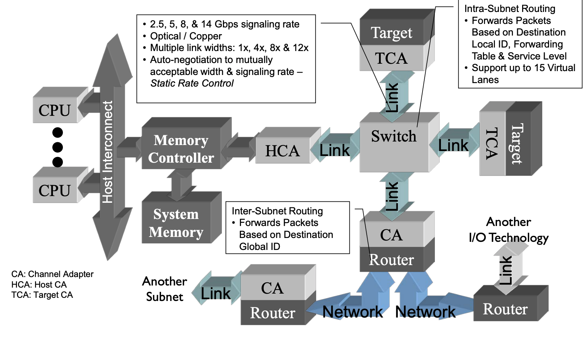

`RDMA`，即 `Remote Direct Memory Access`，是一种绕过**远程**主机 `OS kernel` 访问其内存中数据的技术，概念源自于 `DMA` 技术。在 `DMA` 技术中，外部设备（`PCIe` 设备）能够绕过 `CPU` 直接访问 `host memory`；而 `RDMA` 则是指外部设备能够绕过 `CPU`，不仅可以访问本地主机的内存，还能够访问另一台主机上的用户态内存。由于不经过操作系统，不仅节省了大量 `CPU` 资源，同样也**提高了系统吞吐量**、**降低了系统的网络通信延迟**，在高性能计算和深度学习训练中得到了广泛的应用。

## 技术背景

计算机网络通信中最重要两个衡量指标主要是 **带宽** 和 **延迟**。
现实计算机网络中的通信场景中，主要是以发送小消息为主，因此处理延迟是提升性能的关键。
传统的`TCP/IP`网络通信，数据需要通过用户空间发送到远程机器的用户空间，在这个过程中需要经历若干次内存拷贝：

*   数据发送方需要讲数据从用户空间`Buffer`复制到内核空间的`Socket Buffer`
*   数据发送方要在内核空间中添加数据包头，进行数据封装
*   数据从内核空间的`Socket Buffer`复制到`NIC Buffer`进行网络传输
*   数据接受方接收到从远程机器发送的数据包后，要将数据包从`NIC Buffer`中复制到内核空间的`Socket Buffer`
*   经过一系列的多层网络协议进行数据包的解析工作，解析后的数据从内核空间的`Socket Buffer`被复制到用户空间`Buffer`
*   这个时候再进行系统上下文切换，用户应用程序才被调用

在高速网络条件下，传统的`TCP/IP`网络在**主机侧数据移动和复制操作带来的高开销**限制了可以在机器之间发送的带宽。为了提高数据传输带宽，人们提出了多种解决方案，这里主要介绍下面两种：

*   `TCP Offloading Engine`
*   `Remote Direct Memroy Access`

## TCP Offloading Engine

在主机通过网络进行通信的过程中，`CPU` 需要耗费大量资源进行多层网络协议的数据包处理工作，包括数据复制、协议处理和中断处理。当主机收到网络数据包时，会引发大量的网络 `I/O` 中断，`CPU` 需要对 `I/O` 中断信号进行响应和确认。为了将 `CPU` 从这些操作中解放出来，人们发明了`TOE`（`TCP/IP Offloading Engine`）技术，将上述主机处理器的工作转移到网卡上。`TOE` 技术需要特定支持 `Offloading` 的网卡，这种特定网卡能够支持封装多层网络协议的数据包。

*   `TOE` 技术将原来在协议栈中进行的`IP`分片、`TCP`分段、重组、`checksum`校验等操作，转移到网卡硬件中进行，降低系统`CPU`的消耗，提高服务器处理性能。
*   普通网卡处理每个数据包都要触发一次中断，`TOE` 网卡则让每个应用程序完成一次完整的数据处理进程后才触发一次中断，显著减轻服务器对中断的响应负担。
*   `TOE` 网卡在接收数据时，在网卡内进行协议处理，因此，它不必将数据复制到内核空间缓冲区，而是直接复制到用户空间的缓冲区，这种"零拷贝"方式避免了网卡和服务器间的不必要的数据

## RDMA(Remote Direct Memroy Access)

为了消除传统网络通信带给计算任务的瓶颈，我们希望更快和更轻量级的网络通信，由此提出了`RDMA`技术。`RDMA`利用`Kernel Bypass`和 `Zero Copy`技术提供了低延迟的特性，同时减少了`CPU`占用，减少了内存带宽瓶颈，提供了很高的带宽利用率。`RDMA`提供了给基于 `IO` 的通道，这种通道允许一个应用程序通过`RDMA`设备对远程的虚拟内存进行直接的读写。

`RDMA` 技术有以下几个特点：

*   **CPU Offload**：无需`CPU`干预，应用程序可以访问远程主机内存而不消耗远程主机中的任何`CPU`。远程主机内存能够被读取而不需要远程主机上的进程（或`CPU`)参与。远程主机的`CPU`的缓存(`cache`)不会被访问的内存内容所填充
*   **Kernel Bypass**：`RDMA` 提供一个专有的 `Verbs interface`而不是传统的`TCP/IP Socket interface`。应用程序可以直接在用户态执行数据传输，不需要在内核态与用户态之间做上下文切换
*   **Zero Copy**：每个应用程序都能直接访问集群中的设备的虚拟内存，这意味着应用程序能够直接执行数据传输，在不涉及到网络软件栈的情况下，数据能够被直接发送到缓冲区或者能够直接从缓冲区里接收，而不需要被复制到网络层。

下面是 `RDMA` 整体框架架构图，从图中可以看出，`RDMA`在应用程序用户空间，提供了一系列 `Verbs` 接口操作`RDMA`硬件。`RDMA`绕过内核直接从用户空间访问`RDMA` 网卡。`RNIC`网卡中包括 `Cached Page Table Entry`，用来将虚拟页面映射到相应的物理页面。

目前`RDMA`有三种不同的硬件架构实现，它们都可以使用同一套`API`来使用，但它们有着不同的物理层和链路层：

*   **Infiniband：** 基于 `InfiniBand` 架构的 `RDMA` 技术，由 `IBTA`（`InfiniBand Trade Association`）提出。搭建基于 `IB` 技术的 `RDMA` 网络需要专用的 `IB` 网卡和 `IB` 交换机。从性能上，很明显`Infiniband`网络最好，但网卡和交换机是价格也很高，然而`RoCEv2`和`iWARP`仅需使用特殊的网卡就可以了，价格也相对便宜很多。

*   **iWARP：** `Internet Wide Area RDMA Protocal`，基于 `TCP/IP` 协议的 `RDMA` 技术，由 `IETF` 标 准定义。`iWARP` 支持在标准以太网基础设施上使用 `RDMA` 技术，而不需要交换机支持无损以太网传输，但服务器需要使用支持`iWARP` 的网卡。与此同时，受 `TCP` 影响，性能稍差。

*   **RoCE：** 基于以太网的 `RDMA` 技术，也是由 `IBTA` 提出。`RoCE`支持在标准以太网基础设施上使用`RDMA`技术，但是需要交换机支持无损以太网传输，需要服务器使用 `RoCE` 网卡，性能与 `IB` 相当。

### I/O 瓶颈

时间回退到二十世纪的最后一年，随着`CPU`性能的迅猛发展，早在`1992`年`Intel`提出的 [PCI](https://en.wikipedia.org/wiki/Peripheral_Component_Interconnect) 技术已经满足不了人民群众日益增长的`I/O`需求，`I/O` 系统的性能已经成为制约服务器性能的主要矛盾。尽管在`1998`年，`IBM` 联合 `HP` 、`Compaq` 提出了 [PCI-X](https://en.wikipedia.org/wiki/PCI-X) 作为`PCI`技术的扩展升级，将通信带宽提升到`1066 MB/sec`，人们认为`PCI-X` 仍然无法满足高性能服务器性能的要求，要求构建下一代`I/O`架构的呼声此起彼伏。经过一系列角逐，`Infiniband`融合了当时两个竞争的设计 `Future I/O` 和 `Next Generation I/O`，建立了 `Infiniband` 行业联盟，也即 [BTA (InfiniBand Trade Association)](https://www.infinibandta.org/)，包括了当时的各大厂商 `Compaq`、`Dell`、`HP`、`IBM`、`Intel`、`Microsoft` 和 `Sun`。在当时，`InfiniBand` 被视为替换 `PCI` 架构的下一代 `I/O` 架构，并在 `2000` 年发布了 `1.0` 版本的 `Infiniband` 架构 `Specification`，`2001` 年 `Mellanox` 公司推出了支持 `10 Gbit/s`通信速率的设备。

然而好景不长，`2000` 年互联网泡沫被戳破，人们对于是否要投资技术上如此跨越的技术产生犹豫。`Intel` 转而宣布要开发自己的 [PCIe](https://en.wikipedia.org/wiki/PCI_Express) 架构，微软也停止了 `IB` 的开发。尽管如此，`Sun` 和 日立等公司仍然坚持对 `InfiniBand` 技术的研发，并由于其强大的性能优势逐渐在集群互联、存储系统、超级计算机内部互联等场景得到广泛应用，其软件协议栈也得到标准化，[Linux 也添加了对于 Infiniband 的支持](https://en.wikipedia.org/wiki/InfiniBand#History)。进入`2010`年代，随着大数据和人工智能的爆发，`InfiniBand` 的应用场景从原来的超算等场景逐步扩散，得到了更加广泛的应用，`InfiniBand` 市场领导者 `Mellanox` 被 `NVIDIA` 收购，另一个主要玩家 `QLogic` 被 `Intel` 收购，`Oracle` 也开始制造自己的 `InfiniBand` 互联芯片和交换单元。到了 `2020` 年代，`Mellanox` 最新发布的 `NDR` 理论有效带宽已经可以达到 [单端口 400 Gb/s](https://www.nvidia.com/en-us/networking/ndr/)，为了运行 `400 Gb/s` 的 `HCA` 可以使用 `PCIe Gen5x16` 或者 `PCIe Gen4x32`。

### 架构组成

`InfiniBand` 架构为系统通信定义了多种设备：`channel adapter`、`switch`、`router`、`subnet manager`，它提供了一种基于通道的点对点消息队列转发模型，每个应用都可通过创建的虚拟通道直接获取本应用的数据消息，无需其他操作系统及协议栈的介入。

在一个子网中，必须有至少每个节点有一个`channel adapter`，并且有一个`subnet manager` 来管理`Link`。

#### Channel Adapters

可安装在主机或者其他任何系统(如存储设备)上的**网络适配器**，这种组件为数据包的始发地或者目的地，支持`Infiniband` 定义的所有软件 `Verbs`

*   `Host Channel Adapter`：`HCA`
*   `Target Channel Adapter`：`TCA`

#### Switch

`Switch` 包含多个 `InfiniBand` 端口，它根据每个数据包 `LRH` 里面的 `LID`，负责将一个端口上收到的数据包发送到另一个端口。除了 `Management Packets`，`Switch` 不产生或者消费任何 `Packets`。它包含有 `Subnet Manager` 配置的转发表，能够响应 `Subnet Manager` 的 `Management Packets`。

#### Router

`Router` 根据 `L3` 中的 `GRH`，负责将 `Packet` 从一个子网转发到另一个子网，当被转到到另一子网时，`Router` 会重建数据包中的 `LID`。

#### Subnet Manager

`Subnet Manager` 负责配置本地子网，使其保持工作：

*   发现子网的物理拓扑
*   给子网中的每个端口分配`LIC` 和其他属性（如活动`MTU`、活动速度）
*   给子网交换机配置转发表
*   检测拓扑变化（如子网中节点的增删）
*   处理子网中的各种错误

### 分层设计

`InfiniBand` 有着自己的协议栈，从上到下依次包括传输层、网络层、数据链路层和物理层：

对应着不同的层，数据包的封装如下，下面将对每一层的封装详细介绍：

#### Physical Layer

物理层定义了 `InfiniBand` 具有的电气和机械特性，`InfiniBand` 支持光纤和铜作为传输介质。在物理层支持不同的 `Link` 速度，每个 `Link` 由四根线组成（每个方向两条），`Link` 可以聚合以提高速率，目前绝大多数的系统采用 `4 Link`。

以`QDR` 为例，线上的 `Signalling Rate` 为 `10 Gb/s`，由于采用 `8b/10b` 编码，实际有效带宽单 `Link` 为 `10 Gb/s * 8/10 = 8 Gb/s`，如果是 `4 Link`，则带宽可以达到 `32 Gb/s`。因为是双向的，所以 `4 Link` 全双工的速率可以达到 `64 Gb/s`。

#### Link Layer

`Link Layer` 是 `InfiniBand` 架构的核心，包含以下部分：

*   `Packets`：链路层由两种类型的`Packets`，`Data Packet` 和 `Management Packet`，数据包最大可以为 `4KB`，数据包传输的类型包括两种类型
    *   `Memory`：`RDMA read/write，atomic operation`
    *   `Channel`：`send/receive，multicast transmission`
*   `Switching`：在子网中，`Packet` 的转发和交换是在链路层完成的
    *   一个子网内的每个设备有一个由 `subnet manager` 分配的 `16 bit Local ID` (**LID**)
    *   每个 `Packet` 中有一个 `Local Route Header` (`LRH`) 指定了要发送的目标 `LID`
    *   在一个子网中通过 `LID` 来负责寻址
*   `QoS`：链路层提供了 `QoS` 保证，不需要数据缓冲
    *   `Virtual Lanes`：一种在一条物理链路上创建多条虚拟链路的机制。虚拟通道表示端口的一组用于收发数据包的缓冲区。支持的 `VL` 数是端口的一个属性。
    *   每个 `Link` 支持 `15` 个标准的 `VL` 和一个用于 `Management` 的 `VL15`，`VL15` 具有最高等级，`VL0` 具有最低等级
    *   `Service Level`：`InfiniBand` 支持多达 `16` 个服务等级，但是并没有指定每个等级的策略。`InfiniBand` 通过将 `SL` 和 `VL` 映射支持 `QoS`
*   `Credit Based Flow Control`
*   `Data Integrity`：链路层通过 `Packet` 中的 `CRC` 字段来进行数据完整性校验，其组成包括 `ICRC` 和 `VCRC`。

#### Network Layer

网络层负责将 `Packet` 从一个子网路由到另一个子网：

*   在子网间传输的 `Packet` 都有一个 `Gloabl Route Header` (`GRH`)。在这个 `Header` 中包括了该 `Packet` 的 `128 bit` 的 源 `IPv6` 地址和目的 `IPv6` 地址
*   每个设备都有一个全局的 `UID` (`GUID`)，路由器通过每个 `Packet` 的 `GUID` 来实现在不同子网间的转发

下面是 `GRH` 报头的格式，长 `40` 字节，可选，用于组播数据包以及需要穿越多个子网的数据包。它使用 `GID` 描述了源端口和目标端口，其格式与 `IPv6` 报头相同。

#### Transport Layer

传输层负责 `Packet` 的按序传输、根据 `MTU` 分段和很多传输层的服务(`reliable connection`，`reliable datagram`，`unreliable connection`，`unreliable datagram`，`raw datagram`)。`InfiniBand` 的传输层提供了一个巨大的提升，因为所有的函数都是在硬件中实现的。

按照连接和可靠两个标准，可以划分出下图四种不同的传输模式：

*   可靠连接（`RC`）一个 `QP` 只和另一个 `QP` 相连，消息通过一个 `QP` 的发送队列可靠地传输到另一个 `QP` 的接收队列。数据包**按序交付**，`RC` 连接很类似于 `TCP` 连接。
*   不可靠连接（`UC`）一个 `QP` 只和另一个 `QP` 相连，连接是不可靠的，所以数据包可能有丢失。传输层出错的消息不会进行重传，错误处理必须由高层的协议来进行。
*   不可靠数据报（`UD`）一个 `QP` 可以和其它任意的 `UD QP` 进行数据传输和单包数据的接收。不保证按序性和交付性。交付的数据包可能被接收端丢弃。支持多播消息（一对多），`UD` 连接很类似于 `UDP` 连接。

每种模式中可用的操作如下表所示，目前的 `RDMA` 硬件提供一种数据报传输：不可靠的数据报（`UD`），并且不支持 `memory verbs`。

下面是传输层的 `Base Transport Header` 的结构，长度为 `12` 字节，指定了源 `QP` 和 目标 `QP`、操作、数据包序列号和分区。

*   `Partition Key`：`InfiniBand` 中每个端口 `Device` 都有一个由 `SM` 配置 `P_Key` 表，每个 `QP` 都与这个表中的一个 `P_Key` 索引相关联。只有当两个 `QP` 相关联的 `P_Key` 键值相同时，它们才能互相收发数据包。
*   `Destination QP`：`24 bit` 的目标 `QP ID`。

根据传输层的服务类别和操作，有不定长度的扩展传输报头(`Extended Transport Header`，`ETH`)，比如下面是进行时候的 `ETH`：

下面是 `RDMA ETH`，面向于 `RDMA` 操作：

下面是 `Datagram ETH`，面向与 `UD` 和 `RD` 类型的服务：

*   `Queue Key`：仅当两个不可靠 `QP` 的 `Q_Key` 相同时，它们才能接受对方的单播或组播消息，用于授权访问目标 `QP` 的 `Queue`。
*   `Source QP`：`24 bit` 的 `source QP ID`，用于回复数据包的 `Destination QP`

下面是 `Reliable Datagram ETH`，面向于 `RC` 类型的服务，其中有 `End2End Context` 字段：

### RoCE

`InfiniBand` 架构获得了极好的性能，但是其不仅要求在服务器上安装专门的 `InfiniBand` 网卡，还需要专门的交换机硬件，成本十分昂贵。而在企业界大量部署的是以太网络，为了复用现有的以太网，同时获得 `InfiniBand` 强大的性能，`IBTA` 组织推出了 `RoCE`（`RDMA over Converged Ethernet`）。`RoCE` 支持在以太网上承载 `IB` 协议，实现 `RDMA over Ethernet`，这样一来，仅需要在服务器上安装支持 `RoCE` 的网卡，而在交换机和路由器仍然使用标准的以太网基础设施。网络侧需要支持**无损以太网络**，这是由于 `IB` 的丢包处理机制中，任意一个报文的丢失都会造成大量的重传，严重影响数据传输性能。

`RoCE` 与 `InfiniBand` 技术有相同的软件应用层及传输控制层，仅网络层及以太网链路层存在差异，如下图所示：

`RoCE`协议分为两个版本：

*   **RoCE v1协议：** 基于以太网承载 `RDMA`，只能部署于二层网络，它的报文结构是在原有的 `IB` 架构的报文上增加二层以太网的报文头，通过 `Ethertype` `0x8915`标识 `RoCE` 报文。
*   **RoCE v2协议：** 基于 `UDP/IP` 协议承载 `RDMA`，可部署于三层网络，它的报文结构是在原有的 `IB` 架构的报文上增加 `UDP` 头、`IP` 头和二层以太网报文头，通过 `UDP` 目的端口号 `4791` 标 识 `RoCE` 报文。`RoCE v2` 支持基于源端口号 `hash`，采用 `ECMP` 实现负载分担，提高了网络的利用率。

### iWARP

`iWARP` 从以下几个方面降低了主机侧网络负载：

*   `TCP/IP` 处理流程从 `CPU` 卸载到 `RDMA` 网卡处理，降低了 `CPU` 负载。
*   消除内存拷贝：应用程序可以直接将数据传输到对端应用程序内存中，显著降低 `CPU` 负载。
*   减少应用程序上、下文切换：应用程序可以绕过操作系统，直接在用户空间对 `RDMA` 网卡下发命令，降低了开销，显著降低了应用程序上、下文切换造成的延迟。

由于 `TCP` 协议能够提供流量控制和拥塞管理，因此 `iWARP` 不需要以太网支持无损传输，仅通过普通以太网交换机和 `iWARP` 网卡即可实现，因此能够在广域网上应用，具有较好的扩展性。

## 参考资料

* https://www.cnblogs.com/bandaoyu/p/16752034.html
* https://houmin.cc/posts/454a90d3/
*   [Introduction to InfiniBand White Paper](https://www.mellanox.com/pdf/whitepapers/IB_Intro_WP_190.pdf)
*   [InfiniBand Architecture Overview](https://www.snia.org/sites/default/files/files2/files2/SDC2013/presentations/Hardware/DavidDeming_Infiniband_Architectural_Overview.pdf)
*   [InfiniBand Architecture Specification Release 1.2.1](https://www.afs.enea.it/asantoro/V1r1_2_1.Release_12062007.pdf)
*   [Introduction to RDMA](https://zcopy.wordpress.com/2010/10/08/quick-concepts-part-1-%E2%80%93-introduction-to-rdma/)
*   [RDMA Aware Network Programming User Manual](https://www.mellanox.com/related-docs/prod_software/RDMA_Aware_Programming_user_manual.pdf)
*   [RDMA-Tutorial](https://github.com/jcxue/RDMA-Tutorial)
*   [RDMA Mojo Blog](http://www.rdmamojo.com/)
