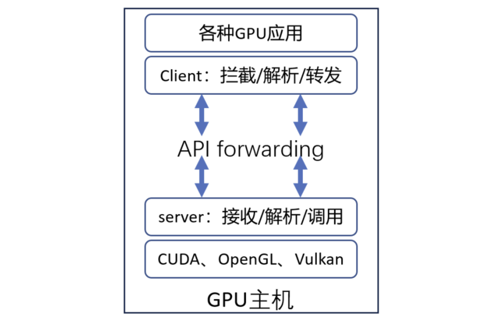

## 1. 背景介绍

### 1.1 为什么需要vGPU？

在当下的`AI/ML`应用实践中，我们能明显感受到两股趋势的并行发展：

**小模型推理场景**：传统的小模型推理与部署方兴未艾，它们在推荐系统、实时预测、路径优化等业务中依然有着广阔的应用场景。然而，这类服务往往只需要`2-4GB`显存，却独占`24GB`的`GPU`卡，导致资源利用率低下，造成严重的资源浪费。

**大模型部署场景**：以大语言模型为代表的大模型部署正在快速兴起，对`GPU`多卡资源算力弹性的要求越来越高。在多租户环境下，缺乏有效的资源隔离机制，资源碎片化导致大任务无法调度。

这两个场景共同面临的核心问题是：**如何在云原生环境下实现`GPU`资源的高效利用、精细化共享与隔离？**

### 1.2 vGPU的核心价值

`vGPU`（虚拟`GPU`）技术通过将物理`GPU`虚拟化为多个逻辑`GPU`，具有以下优势：

- **资源利用率显著提升**：通过将单张`GPU`卡虚拟化为多个逻辑`GPU`，让多个小任务可以共享同一张物理`GPU`卡，大幅提高`GPU`的实际使用率，减少资源闲置。

- **成本优化**：在相同的工作负载下，通过提高单卡利用率，可以减少所需的物理`GPU`数量，从而降低硬件采购和运维成本。

- **灵活的资源管理**：支持为每个任务精确分配显存和算力配额，实现细粒度的资源控制。可以根据业务需求动态调整资源分配策略，提高资源使用的灵活性。

- **多租户隔离保障**：提供硬件级或软件级的资源隔离机制，确保不同租户或任务之间互不干扰。配合完善的配额管理和监控能力，为生产环境提供可靠的多租户支持。

## 2. 业界主流vGPU方案对比

### 2.1 主流方案分类

业界`vGPU`方案目前可划分为以下几类：

| 分类 | 代表方案 | 实现层次 | 开源情况 |
|------|---------|---------|---------|
| **NVIDIA官方方案** | `MPS`、`MIG` | 硬件 + 驱动层 | 闭源 |
| **用户态API劫持** | `HAMi` | `CUDA Runtime`层 | 开源 |
| **内核态API劫持** | 阿里云`cGPU`、腾讯云`qGPU` | 内核驱动层 | 闭源 |
| **硬件虚拟化** | `NVIDIA vGPU` | 硬件虚拟化层 | 闭源商业 |

内核态API劫持相比较用户态API劫持实现`vGPU`来讲，其性能损耗会更小，约为`5%`，而用户态API劫持的性能损耗约`10%`。具体数据参考于互联网资料。

以英伟达的`GPU`为例，`GPU`虚拟化技术从硬件到软件的实现可以分为三个层次：用户态、内核态和硬件层。

- **用户态层**：应用程序通过`CUDA API`编写并行计算任务，并通过`CUDA API`与`GPU`的用户态驱动进行通信。在这个层次，用户态虚拟化可以通过拦截和转发标准接口（如`CUDA API`、`OpenGL`等）来实现。
- **内核态层**：此层主要运行`GPU`的内核态驱动程序，它与操作系统内核紧密集成，受到操作系统以及`CPU`硬件的保护。内核态虚拟化方案通常通过拦截如`ioctl`、`mmap`、`read` 和 `write` 等内核态接口来实现`GPU`资源的虚拟化。
- **硬件层**：硬件虚拟化层，如英伟达的`MIG`（`Multi-Instance GPU`），可以直接在硬件级别进行`GPU`资源的划分与管理。

#### 用户态虚拟化

用户态虚拟化利用标准的接口（如`CUDA`和`OpenGL`），通过拦截和转发`API`调用，将请求解析并转发给硬件厂商提供的用户态库中的相应函数。

**优点：**

- **兼容性强**： 基于`CUDA`和`OpenGL`等标准化接口，无需依赖底层内核修改，适用于各类`GPU`及异构算力。
- **安全性高**： 运行在用户态，避免了内核态代码的安全隐患，降低系统入侵风险。
- **最小侵入性**：用户态虚拟化的部署方式对用户环境的侵入性最小，尤其适合于企业生产环境的快速部署与迭代。
- **部署成本低**： 不破坏现有 IT 基础架构，支持国央企、金融、能源等企业复杂 IT 体系，能够快速上线。
- **支持统一内存**：该方案支持统一内存接口，能够借用主机内存，从而提升`GPU`资源的利用率，特别适用于资源池化管理。

**缺点：**

- 相比于内核态，用户态对每一个`API`调用，都需要进行解析和转发，会导致一定的性能损耗。

#### 内核态虚拟化

内核态虚拟化通过拦截内核层的接口（如`ioctl`、`mmap`、`read`、`write` 等）来实现`GPU`资源的管理。这个技术方案主要运行在操作系统的内核态中，因此其安全性和稳定性较为复杂。

**优点：**

- **灵活性**：内核态虚拟化通常不依赖于特定的`GPU`硬件，因此可以在不同级别的`GPU`（如数据中心级和消费级`GPU`）上使用，具有较好的灵活性。
- **共享与隔离**：在支持`GPU`共享的同时，内核态虚拟化能够提供较强的资源隔离能力，防止多个虚拟机或容器间的资源竞争。
- **较少的开发工作量**：由于内核态虚拟化通常仅支持容器环境，因此相对于用户态方案，研发和部署工作量较小。

**缺点：**

- **高侵入性**：内核态虚拟化需要直接修改`Linux`操作系统内核，较大程度地增加了对系统的侵入性，从而带来潜在的安全风险。尤其在不同内核版本的环境中，可能引入兼容性问题。国央企、金融、能源等行业 IT 架构复杂，难以统一管理和适配。
- **安全隐患大**： 需要插入内核代码，可能引入额外的安全漏洞和合规风险，尤其在金融、医疗、政府等高安全性行业难以落地。
- **法律和可持续性风险**：部分内核态方案涉及逆向工程，存在法律合规风险，并且可能被`GPU`厂商封堵，影响长期可用性。
- **维护成本高**： 不同操作系统版本的内核适配难度大，且私有云、混合云环境下的兼容性问题突出。

#### 远程GPU资源调用：可落地性的困境

近年来，远程`GPU`调用（`Remote GPU`）方案备受关注，它允许用户在一台`CPU`服务器上远程访问另一台服务器上的`GPU`资源，看上去能解决资源碎片化问题。

然而，在现代 AI 应用（尤其是大模型、小模型混合训练和推理）背景下，远程`GPU`资源调用几乎不可用，原因包括：

- **数据传输瓶颈**： 大模型训练涉及 PB 级数据，远程调用`GPU`需要在`CPU`和`GPU`之间频繁传输数据，带宽和延迟问题导致性能严重下降。远程`GPU`调用需要通过网络传输数据，特别是对于计算密集型任务（如大规模的神经网络推理），网络延迟将极大影响性能，甚至导致任务无法及时完成。此外，大模型和小模型的训练过程中需要高效的同步机制，远程调用会导致数据同步效率低下，影响模型训练的效果与效率。
- **计算密集型任务难以拆分**： AI 训练任务通常需要多`GPU`互相通信（如`AllReduce`、`Pipeline 并行`），远程`GPU`之间的通信成本远超本地`GPU`。远程调用`GPU`资源意味着大量数据需要在网络中传输，对于带宽要求极高。尤其是在大规模训练和推理任务中，带宽瓶颈往往会成为性能的瓶颈。
- **小模型推理的实时性要求**： 对于小模型的推理任务，远程调用的通信延迟远大于计算时间，导致整体效率大幅下降。

因此，尽管远程`GPU`调用在某些场景下具有一定的吸引力，但在实际操作中，它通常会面临性能瓶颈和资源调度问题，特别是在现代 AI 应用中，几乎不可行。

### 2.2 详细方案对比

> **说明**：本方案对比不包含阿里云`cGPU`、腾讯云`qGPU`等内核态API劫持方案，由于其数据不明，且存在一定的使用限制，不纳入考虑范围。`NVIDIA MPS`仅考虑`Volta MPS`，不考虑旧版本的`Pre-Volta MPS`。

| 维度 | NVIDIA MPS (Volta) | NVIDIA MIG | HAMi |
|------|-----------|-----------|--------------|
| **隔离性** |
| 显存隔离 | ⚠️ 地址空间隔离 | ✅ 硬件隔离 | ✅ 软件硬隔离 |
| 算力隔离 | ⚠️ 软限制(不预留专用SM) | ✅ 硬件隔离 | ⚠️ 软限制 |
| 进程崩溃影响 | ⚠️ 有限隔离 | ✅ 完全隔离 | ✅ 仅影响自身 |
| 内存越界保护 | ✅ 有保护 | ✅ 硬件保护 | ✅ 有保护 |
| **性能** |
| 性能开销 | ⚠️ 约5% | ✅ 极低（ < 3%） | ⚠️ 约10% |
| 上下文切换 | ✅ 快速 | ✅ 极快 | ⚠️ 中等 |
| 并发效率 | ✅ 高 | ⚠️ 中等 | ✅ 高 |
| **易用性** |
| 部署复杂度 | ✅ 简单 | ⚠️ 需要配置 | ⚠️ 需安装组件 |
| 容器化支持 | ✅ 原生支持 | ✅ 原生支持 | ✅ 原生支持 |
| 配置灵活性 | ⚠️ 支持资源配额 | ⚠️ 固定规格 | ✅ 非常灵活 |
| 监控可观测性 | ⚠️ 有限(仅看到MPS Server) | ✅ 完善 | ✅ 完善 |
| **兼容性** |
| GPU型号支持 | ⚠️ `Volta+` | ⚠️ `A100/H100+` | ✅ `Pascal+` |
| CUDA版本要求 | ✅ 无特殊要求 | ⚠️ `11.0+` | ⚠️ 特定版本 |
| 应用兼容性 | ✅ 透明 | ✅ 透明 | ⚠️ 大部分兼容 |
| 客户端连接数 | ⚠️ 最多48个 | ⚠️ 取决于MIG配置 | ✅ 无限制 |
| **成本** |
| 软件成本 | ✅ 免费 | ✅ 免费 | ✅ 开源免费 |
| 硬件要求 | ⚠️ `Volta+`架构 | ⚠️ 特定GPU | ✅ 无特殊要求 |
| 维护成本 | ⚠️ 中等 | ✅ 低 | ✅ 低 |
| **其他** |
| 开源情况 | ❌ 闭源 | ❌ 闭源 | ✅ 开源 |
| 社区活跃度 | ⚠️ 官方支持 | ⚠️ 官方支持 | ✅ 活跃 |

> **性能测试参考数据来源：**
> - **NVIDIA MPS**: 基于`NVIDIA`官方`GROMACS`测试，在`8-GPU DGX A100`上运行多个模拟可提升`1.3-1.8`倍吞吐量，性能开销`<5%`。[来源](https://developer.nvidia.com/blog/maximizing-gromacs-throughput-with-multiple-simulations-per-gpu-using-mps-and-mig/)
> - **NVIDIA MIG**: 某些场景下`MIG+MPS`组合比纯`MPS`高约`7%`，但存在`5-15%`的硬件分区开销。[来源](https://developer.nvidia.com/blog/maximizing-gromacs-throughput-with-multiple-simulations-per-gpu-using-mps-and-mig/)
> - **HAMi**: 基于`ai-benchmark`在`Tesla V100`上的测试数据，用户态API劫持性能开销约`10%`。[来源](https://github.com/Project-HAMi/HAMi/blob/master/docs/benchmark.md)
>
> **注意**: 不同方案之间缺乏统一标准的直接对比测试，实际性能因工作负载类型、GPU型号和配置而异，上述数据仅供参考。

#### NVIDIA MPS的缺点

`NVIDIA MPS`的核心是在`CUDA Runtime`和`CUDA Driver`之上引入了`MPS`服务层，把多个进程的`CUDA`内核请求合并并下发给`GPU`，使得多个`CUDA`进程（或多个容器内的进程）能够共享`GPU`的`SM`（即算力部分），从而避免了`CUDA Context`频繁上下文切换，实现`GPU`利用率的提升。

`NVIDIA MPS`分为两个版本：

- **Pre-Volta MPS**：适用于`Volta`架构之前的`GPU`（如`Pascal`、`Kepler`等）
- **Volta MPS**：从`Volta`架构开始引入（如`V100`、`A100`、`H100`等），提供了增强的隔离能力

> `Volta`架构是`NVIDIA`在`2017`年推出的`GPU`架构。一些消费级显卡如`4090/4090D`均是属于`Volta`以后的架构。以下均以`Volta MPS`为介绍。

`Volta MPS`虽然相比`Pre-Volta MPS`在隔离性方面有显著改进（提供了完全的地址空间隔离和有限的错误隔离），但在实际生产环境中仍存在以下关键限制：

- **显存配额管理复杂**：
   - 虽然支持通过`CUDA_MPS_PINNED_DEVICE_MEM_LIMIT`环境变量设置显存硬限制（超过限制会返回`OOM`错误）
   - 但需要在客户端启动前通过环境变量或`MPS`控制接口预先配置，无法动态调整
   - 根据 [NVIDIA MPS官方文档](https://docs.nvidia.com/deploy/mps/index.html#volta-mps-execution-resource-provisioning)，配置管理复杂，需要为每个客户端单独设置，不适合大规模多租户场景

- **算力隔离是软限制**：
   - 根据官方文档明确说明：`Setting the limit does not reserve dedicated resources`（设置限制不会预留专用资源）
   - 不同客户端的内核可能在同一`SM`上执行，无法保证严格的算力配额
   - 不适合需要`SLA`保障的商业场景

- **故障隔离不完善**：
   - 故障会被控制在**受影响的GPU子集**内，范围取决于客户端的`GPU`使用情况
   - 如果有客户端跨多个`GPU`运行，一个`GPU`的故障会影响所有与该`GPU`有共同客户端的其他`GPU`
   - 根据 [NVIDIA MPS官方文档](https://docs.nvidia.com/deploy/mps/index.html#error-containment)，错误报告不精确，无法指明是哪个客户端触发的故障
   - 需要所有受影响客户端退出后才能恢复服务，否则新的客户端请求将被拒绝并返回`CUDA_ERROR_MPS_SERVER_NOT_READY`

- **资源监控困难**：
   - `nvidia-smi`只能看到`MPS Server`进程，无法查看各客户端的实际资源使用
   - 缺少细粒度的资源使用监控和告警能力

**适用场景**：
- ✅ 适合：可信任的单一应用多进程、开发测试环境、对隔离性要求不高的场景、使用`Volta+`架构`GPU`的环境。
- ❌ 不适合：多租户生产环境、关键业务推理服务、需要严格资源配额和故障隔离的场景、需要硬件级隔离保障的场景。

#### NVIDIA MIG的缺点

`NVIDIA MIG`是`NVIDIA`对`A100`、`H100`等新一代`GPU`提供的一种软硬件一体化的`GPU/显存隔离技术`。硬件层面，可以将`SM` + `L2 Cache` + `内存控制器` + `IO 通道`切割成多个独立`MIG`单元，每个单元就是一个独立的`GPU`实例，从应用和容器视角看就获得一张小`GPU`资源；从软件层面，在`nvidia driver`中增加了`MIG driver`，实现对支持隔离的硬件的调用，从而实现端到端的`GPU虚拟化`。

该方案在多租户场景下，虽然能够保证显存和算力的强隔离，但仅支持部分高端`GPU`（如`A100`/`H100`），对常见的`T4`、`A10`不适用。

其主要缺点如下：

- **硬件支持受限**：仅支持`A100`、`H100`等高端`GPU`型号，对于使用`V100`、`T4`等较早型号`GPU`的用户无法使用。
- **分区规格固定**：`MIG`实例的划分规格是预定义的（如`1g.5gb`、`2g.10gb`等），无法根据实际需求灵活调整显存和算力比例。
- **配置复杂度高**：需要在`GPU`驱动层面进行`MIG`模式配置，涉及`GPU`重启和实例创建，操作相对复杂。
- **资源利用率问题**：由于分区规格固定，可能出现资源碎片化，例如剩余的小规格实例无法满足大任务需求。
- **动态调整困难**：`MIG`实例一旦创建，调整配置需要销毁重建，不支持在线动态调整资源分配。

**适用场景**：
- ✅ 适合：多租户生产环境、需要强隔离保障的场景、高端`GPU`集群。
- ❌ 不适合：需要灵活资源配置的场景、使用非`A100/H100`系列`GPU`的环境、频繁调整资源配额的场景。

## 3. HAMi开源项目调研

具体请参考：[HAMi vGPU调研](./2000-HAMi%20vGPU调研.md)

## 4. 参考资料

- https://aws.amazon.com/cn/blogs/china/gpu-virtualization-practice-based-on-hami/
- https://www.theriseunion.com/blog/GPU-Virtualization-Technology-User-vs-Kernel-Guide.html
- https://www.theriseunion.com/blog/Project-HAMi.html

