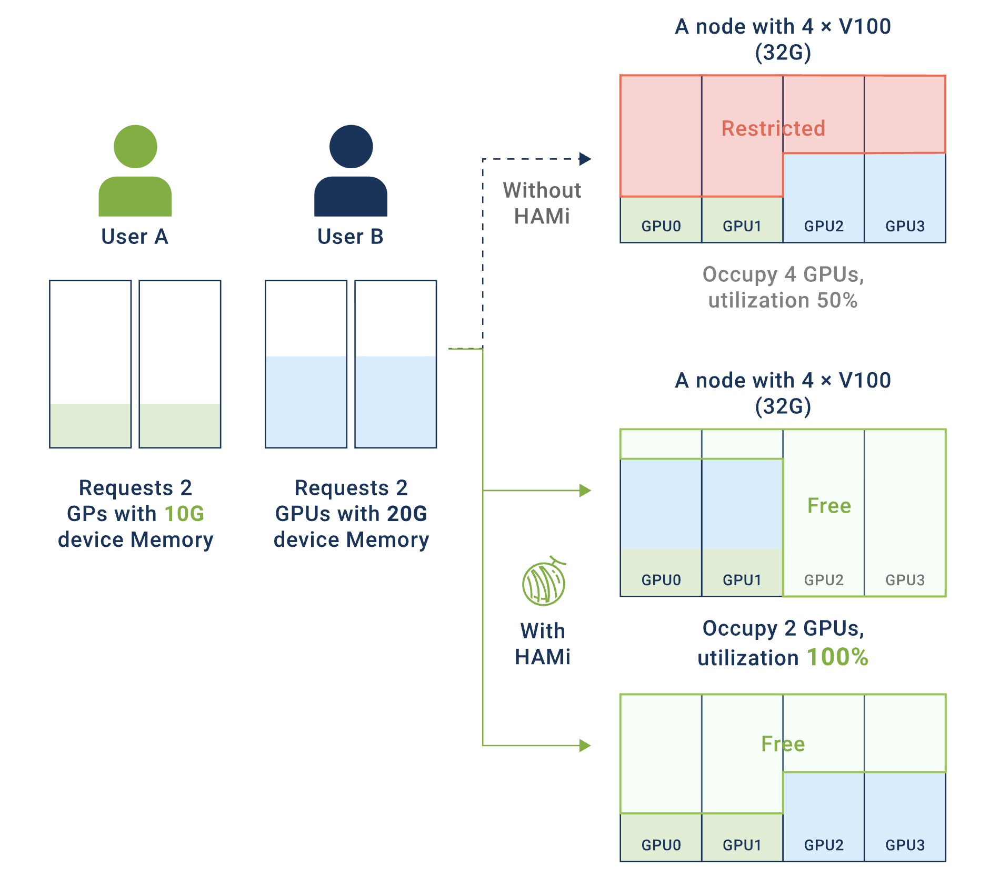

## 1. 背景介绍

### 1.1 为什么需要vGPU？

在当下的`AI/ML`应用实践中，我们能明显感受到两股趋势的并行发展：

**小模型推理场景**：传统的小模型推理与部署方兴未艾，它们在推荐系统、实时预测、路径优化等业务中依然有着广阔的应用场景。然而，这类服务往往只需要`2-4GB`显存，却独占`24GB`的`GPU`卡，导致资源利用率低下，造成严重的资源浪费。

**大模型部署场景**：以大语言模型为代表的大模型部署正在快速兴起，对`GPU`多卡资源算力弹性的要求越来越高。在多租户环境下，缺乏有效的资源隔离机制，资源碎片化导致大任务无法调度。

这两个场景共同面临的核心问题是：**如何在云原生环境下实现`GPU`资源的高效利用、精细化共享与隔离？**

### 1.2 vGPU的核心价值

`vGPU`（虚拟`GPU`）技术通过将物理`GPU`虚拟化为多个逻辑`GPU`，具有以下优势：

- **资源利用率显著提升**：通过将单张`GPU`卡虚拟化为多个逻辑`GPU`，让多个小任务可以共享同一张物理`GPU`卡，大幅提高`GPU`的实际使用率，减少资源闲置。

- **成本优化**：在相同的工作负载下，通过提高单卡利用率，可以减少所需的物理`GPU`数量，从而降低硬件采购和运维成本。

- **灵活的资源管理**：支持为每个任务精确分配显存和算力配额，实现细粒度的资源控制。可以根据业务需求动态调整资源分配策略，提高资源使用的灵活性。

- **多租户隔离保障**：提供硬件级或软件级的资源隔离机制，确保不同租户或任务之间互不干扰。配合完善的配额管理和监控能力，为生产环境提供可靠的多租户支持。

## 2. 业界主流vGPU方案对比

### 2.1 方案分类

业界`vGPU`方案目前可划分为以下几类：

| 分类 | 代表方案 | 实现层次 | 开源情况 |
|------|---------|---------|---------|
| **NVIDIA官方方案** | `MPS`、`MIG` | 硬件 + 驱动层 | 闭源 |
| **用户态API劫持** | `HAMi`、`NexusGPU` | `CUDA Runtime`层 | 开源 |
| **内核态API劫持** | 阿里云`cGPU`、腾讯云`qGPU` | 内核驱动层 | 闭源 |
| **硬件虚拟化** | `NVIDIA vGPU` | 硬件虚拟化层 | 闭源商业 |

内核态API劫持相比较用户态API劫持实现`vGPU`来讲，其性能损耗会更小，约为`5%`，而用户态API劫持的性能损耗约`10%`。具体数据参考于互联网资料。

以下为应用与`GPU`通信大概的架构示意图，
其中，用户态API劫持工作在`CUDA Runtime`层，内核态API劫持工作在`CUDA Driver`层。

### 2.2 详细方案对比

> **说明**：本方案对比不包含阿里云`cGPU`、腾讯云`qGPU`等内核态API劫持方案，由于其数据不明，且存在一定的使用限制，不纳入考虑范围。

| 维度 | NVIDIA MPS | NVIDIA MIG | HAMi | NexusGPU |
|------|-----------|-----------|--------------|------------------|
| **隔离性** |
| 显存隔离 | ❌ 无隔离 | ✅ 硬件隔离 | ✅ 软件硬隔离 | ✅ 软件硬隔离 |
| 算力隔离 | ⚠️ 软限制 | ✅ 硬件隔离 | ⚠️ 软限制 | ⚠️ 软限制 |
| 进程崩溃影响 | ❌ 影响所有 | ✅ 完全隔离 | ✅ 仅影响自身 | ✅ 仅影响自身 |
| 内存越界保护 | ❌ 无保护 | ✅ 硬件保护 | ✅ 有保护 | ✅ 有保护 |
| **性能** |
| 性能开销 | ✅ 极低 | ⚠️ 有一定开销 | ⚠️ 有一定开销 | ⚠️ 有一定开销 |
| 上下文切换 | ✅ 快速 | ⚠️ 较慢 | ⚠️ 中等 | ⚠️ 中等 |
| 并发效率 | ✅ 高 | ⚠️ 中等 | ✅ 高 | ✅ 高 |
| **易用性** |
| 部署复杂度 | ✅ 简单 | ⚠️ 需要配置 | ⚠️ 需安装组件 | ⚠️ 需安装组件 |
| 容器化支持 | ✅ 原生支持 | ✅ 原生支持 | ✅ 原生支持 | ✅ 原生支持 |
| 配置灵活性 | ❌ 有限 | ⚠️ 固定规格 | ✅ 非常灵活 | ✅ 非常灵活 |
| 监控可观测性 | ⚠️ 有限 | ✅ 完善 | ✅ 完善 | ✅ 完善 |
| **兼容性** |
| GPU型号支持 | ✅ `Volta+` | ⚠️ `A100/H100+` | ✅ `Pascal+` | ✅ `Pascal+` |
| CUDA版本要求 | ✅ 无特殊要求 | ⚠️ `11.0+` | ⚠️ 特定版本 | ⚠️ 特定版本 |
| 应用兼容性 | ✅ 透明 | ✅ 透明 | ⚠️ 大部分兼容 | ⚠️ 大部分兼容 |
| **成本** |
| 软件成本 | ✅ 免费 | ✅ 免费 | ✅ 开源免费 | ✅ 开源免费 |
| 硬件要求 | ✅ 无特殊要求 | ⚠️ 特定GPU | ✅ 无特殊要求 | ✅ 无特殊要求 |
| 维护成本 | ⚠️ 中等 | ✅ 低 | ✅ 低 | ✅ 低 |
| **其他** |
| 开源情况 | ❌ 闭源 | ❌ 闭源 | ✅ 开源 | ✅ 开源 |
| 社区活跃度 | ⚠️ 官方支持 | ⚠️ 官方支持 | ✅ 活跃 | ⚠️ 一般 |
| 版权风险 | ✅ 无 | ✅ 无 | ✅ 无 | ✅ 无 |

### 2.3 NVIDIA MPS的主要缺点

`NVIDIA MPS`的核心是在`CUDA Runtime`和`CUDA Driver`之上引入了`MPS`服务层，把多个进程的`CUDA`内核请求合并并下发给`GPU`，使得多个`CUDA`进程（或多个容器内的进程）能够共享`GPU`的`SM`（即算力部分），从而避免了`CUDA Context`频繁上下文切换，实现`GPU`利用率的提升。

但对显存分配上，每个进程仍然直接向`CUDA Driver`独立进行显存申请，不会被`MPS`统一调度。因此无法实现显存隔离。所有进程共享同一显存地址空间，任何进程`OOM`都可能导致整个`GPU`崩溃。

其主要缺点如下：

- **无显存隔离**：无法限制单个进程的显存使用量，一个进程的显存溢出会导致其他进程失败。
- **进程崩溃连锁反应**：单个进程的`CUDA`错误会导致`MPS Server`失效，影响所有共享`GPU`的进程。
- **资源配额控制弱**：无法精确限制显存和算力配额，环境变量设置仅为建议值而非强制限制。
- **监控困难**：`nvidia-smi`只能看到`MPS Server`进程，无法查看各客户端进程的实际资源使用情况。
- **故障定位困难**：无法准确定位是哪个进程导致的错误，调试和性能分析工具支持有限。

**适用场景**：
- ✅ 适合：可信任的单一应用多进程、开发测试环境、对隔离性要求不高的场景。
- ❌ 不适合：多租户生产环境、关键业务推理服务、需要严格资源配额和故障隔离的场景。

### 2.4 NVIDIA MIG的主要缺点

`NVIDIA MIG`是`NVIDIA`对`A100`、`H100`等新一代`GPU`提供的一种软硬件一体化的`GPU/显存隔离技术`。硬件层面，可以将`SM` + `L2 Cache` + `内存控制器` + `IO 通道`切割成多个独立`MIG`单元，每个单元就是一个独立的`GPU`实例，从应用和容器视角看就获得一张小`GPU`资源；从软件层面，在`nvidia driver`中增加了`MIG driver`，实现对支持隔离的硬件的调用，从而实现端到端的`GPU虚拟化`。

该方案在多租户场景下，虽然能够保证显存和算力的强隔离，但仅支持部分高端`GPU`（如`A100`/`H100`），对常见的`T4`、`A10`不适用。

其主要缺点如下：

- **硬件支持受限**：仅支持`A100`、`H100`等高端`GPU`型号，对于使用`V100`、`T4`等较早型号`GPU`的用户无法使用。
- **分区规格固定**：`MIG`实例的划分规格是预定义的（如`1g.5gb`、`2g.10gb`等），无法根据实际需求灵活调整显存和算力比例。
- **配置复杂度高**：需要在`GPU`驱动层面进行`MIG`模式配置，涉及`GPU`重启和实例创建，操作相对复杂。
- **资源利用率问题**：由于分区规格固定，可能出现资源碎片化，例如剩余的小规格实例无法满足大任务需求。
- **动态调整困难**：`MIG`实例一旦创建，调整配置需要销毁重建，不支持在线动态调整资源分配。

**适用场景**：
- ✅ 适合：多租户生产环境、需要强隔离保障的场景、高端`GPU`集群。
- ❌ 不适合：需要灵活资源配置的场景、使用非`A100/H100`系列`GPU`的环境、频繁调整资源配额的场景。

## 3. HAMi开源项目调研

具体请参考：[HAMi vGPU调研](./2000-HAMi%20vGPU调研.md)

## 4. 参考资料

- https://aws.amazon.com/cn/blogs/china/gpu-virtualization-practice-based-on-hami/