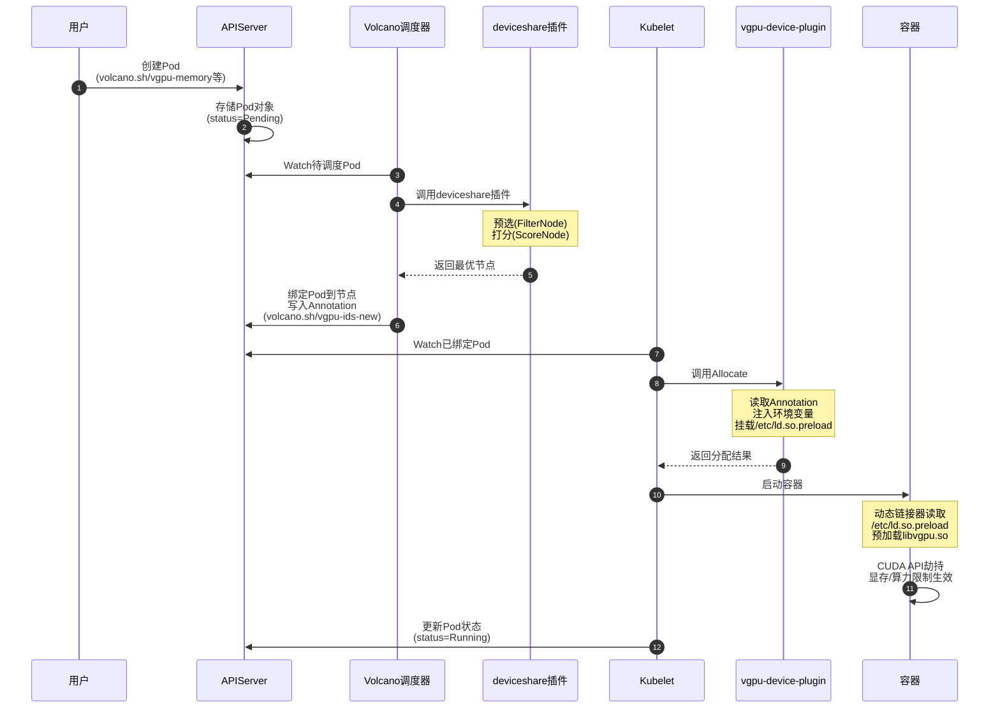

`Volcano`原生支持`HAMi vGPU`，但需要启用对应的`deviceshare` 插件。

## Volcano调度器配置

具体配置如下：
```yaml title="volcano-scheduler.conf"
actions: "enqueue, allocate, backfill"
tiers:
- plugins:
  - name: priority
  - name: gang
  - name: conformance
- plugins:
  - name: drf
  - name: deviceshare
    arguments:
      # 是否启用vgpu特性
      deviceshare.VGPUEnable: true 
      # volcano-vgpu-device-config这个ConfigMap对应的命名空间
      # 便于调度器自动读取ConfigMap内容
      deviceshare.KnownGeometriesCMNamespace: volcano-system 
  - name: predicates
  - name: proportion
  - name: nodeorder
  - name: binpack
```

同时需要替换`NVIDIA Device Plugin`为 https://github.com/Project-HAMi/volcano-vgpu-device-plugin ，具体参考：https://project-hami.io/zh/docs/userguide/volcano-vgpu/NVIDIA-GPU/how-to-use-volcano-vgpu

## Volcano vGPU执行流程

`Volcano + HAMi vGPU`的完整执行流程涉及多个组件的协同工作，从`Pod`创建到最终运行在节点上，经历了以下关键步骤：

### 组件交互概要

以下是`Volcano vGPU`资源使用的大致交互时序图，包含了关键的几个组件之间的交互。



### 详细流程介绍

以下是通过梳理`Volcano`及`volcano-vgpu-device-plugin`源码得到的完整执行流程。

#### 阶段1：Pod创建

1. **用户创建Pod**
   ```yaml
   apiVersion: v1
   kind: Pod
   metadata:
     name: vgpu-test
   spec:
     schedulerName: volcano  # 指定使用 Volcano 调度器
     containers:
     - name: cuda-app
       image: nvidia/cuda:11.0-base
       resources:
         limits:
           volcano.sh/vgpu-number: 2        # 请求 2 张 GPU 卡
           volcano.sh/vgpu-memory: 3000     # （可选）每个 vGPU 使用 3G 显存
           volcano.sh/vgpu-cores: 50        # （可选）每个 vGPU 使用 50% 核心
   ```

#### 阶段2：调度器调度

2. **Volcano Scheduler接收调度请求**
   - `Scheduler`从`API Server`获取待调度的`Pod`
   - 初始化调度会话（`Session`），注册`deviceshare`插件的预选和打分函数

3. **deviceshare插件预选（Predicate）**
   
   **核心逻辑**（`deviceshare.go:125-162`）：
   ```go
   // 遍历所有注册的设备类型（vGPU/GPU-Share等）
   for _, val := range api.RegisteredDevices {
       if dev, ok := node.Others[val].(api.Devices); ok {
           // 调用vGPU的FilterNode方法
           code, msg, err := dev.FilterNode(task.Pod, dp.schedulePolicy)
           if err != nil {
               return api.NewFitErrWithStatus(task, node, predicateStatus...)
           }
       }
   }
   ```
   
   **vGPU预选检查**（`device_info.go:247-259`）：
   - 调用`checkNodeGPUSharingPredicateAndScore`函数执行资源匹配
   - 检查节点`Annotation`中的设备注册信息（`volcano.sh/node-vgpu-register`）
   - 遍历节点所有`GPU`设备，逐一检查是否满足`Pod`请求：
     - 显存是否充足：`device.Memory - device.UsedMem >= request.Memreq`
     - 算力是否充足：`device.UsedCore + request.Coresreq <= 100`
     - 设备类型是否匹配（`NVIDIA`/`AMD`/昇腾等）
     - 独占模式检查：`Coresreq=100`时设备不能被其他`Pod`占用
   - 将匹配结果缓存到`gs.Score`，避免打分阶段重复计算

4. **deviceshare插件打分（Score）**
   
   **核心逻辑**（`deviceshare.go:164-179`）：
   ```go
   // 计算节点设备得分
   score, status := getDeviceScore(context.TODO(), task.Pod, node, dp.schedulePolicy)
   nodeScore = float64(score) * float64(dp.scheduleWeight)
   ```
   
   **vGPU打分策略**（`utils.go:440-453`）：
   - **binpack模式**：`score = 10 * (UsedMem / TotalMem)`，优先选择资源使用率高的节点
   - **spread模式**：`score = 10`（仅当设备已被`1`个`Pod`使用时），优先选择资源分散的节点
   - 直接返回预选阶段缓存的`gs.Score`，无需重复计算

5. **调度决策与资源分配**
   
   **Allocate阶段**（`device_info.go:261-295`）：
   - 选择得分最高的节点
   - 调用`Allocate`方法执行资源分配
   - 更新`Pod Annotation`，记录分配的设备信息：
     ```yaml
     volcano.sh/vgpu-node: dev-app-2-150-master-1
     volcano.sh/vgpu-time: "18446744073709551615"
     volcano.sh/vgpu-ids-new: 'GPU-uuid1,NVIDIA,3000,50:GPU-uuid2,NVIDIA,3000,50:'
     volcano.sh/bind-phase: allocating
     ```
   - 将`Pod`绑定到目标节点

#### 阶段3：Device Plugin分配

6. **Device Plugin Allocate**（`plugin.go:416-515`）
   
   **核心逻辑**：
   - `Kubelet`检测到`Pod`被调度到本节点，调用`Allocate`方法
   - 从`Pod Annotation`读取`Volcano`分配的设备信息（`volcano.sh/vgpu-ids-new`）
   - 注入容器环境变量（`plugin.go:460-476`）：
     ```go
     // 设置GPU可见性
     response.Envs["NVIDIA_VISIBLE_DEVICES"] = strings.Join(m.GetContainerDeviceStrArray(devreq), ",")
     // 为每个vGPU设置显存限制
     for i, dev := range devreq {
         limitKey := fmt.Sprintf("CUDA_DEVICE_MEMORY_LIMIT_%v", i)
         response.Envs[limitKey] = fmt.Sprintf("%vm", dev.Usedmem*int32(config.GPUMemoryFactor))
     }
     // 设置算力限制（如果Pod未指定volcano.sh/vgpu-cores，则为0，表示不限制算力）
     response.Envs["CUDA_DEVICE_SM_LIMIT"] = fmt.Sprint(devreq[0].Usedcores)
     ```
   - 挂载`vGPU`库和配置文件（`plugin.go:485-508`）：
     - `/usr/local/vgpu/libvgpu.so`：`CUDA API`劫持库
     - `/etc/ld.so.preload`：预加载配置（内容为`/usr/local/vgpu/libvgpu.so`）
     - `/tmp/vgpu`：缓存目录
     - `/tmp/vgpulock`：进程锁目录
   - 返回`ContainerAllocateResponse`给`Kubelet`

#### 阶段4：容器启动

7. **Container Runtime处理**
   - `Kubelet`将环境变量和挂载信息传递给容器运行时
   - 挂载`GPU`设备文件（`/dev/nvidia*`）
   - 挂载`NVIDIA`驱动库，并设置`LD_LIBRARY_PATH`环境变量
   - 挂载`/etc/ld.so.preload`文件（内容为`/usr/local/vgpu/libvgpu.so`）
   - 容器启动时，动态链接器读取`/etc/ld.so.preload`文件，强制预加载`libvgpu.so`
   - `libvgpu.so`从环境变量读取`CUDA_DEVICE_MEMORY_LIMIT_*`和`CUDA_DEVICE_SM_LIMIT`，初始化资源限制
   
   **注意**：这里使用的是`/etc/ld.so.preload`**文件**而非`LD_PRELOAD`**环境变量**。通过`env`命令看不到`LD_PRELOAD`，但可以通过`cat /etc/ld.so.preload`查看预加载配置。
   
   **两种预加载机制对比：**
    
    | 特性 | /etc/ld.so.preload文件 | LD_PRELOAD环境变量 |
    |------|----------------------|----------------------|
    | 类型 | 配置文件 | 环境变量 |
    | `env`可见 | ❌ 不可见 | ✅ 可见 |
    | 查看方式 | `cat /etc/ld.so.preload` | `echo $LD_PRELOAD` |
    | 作用范围 | 系统级，所有进程 | 进程级，继承环境变量 |
    | `Volcano vGPU` | ✅ 使用 | ❌ 不使用 |
    | `HAMI`独立部署 | ❌ 不使用 | ✅ 使用 |

#### 阶段5：应用运行

8. **CUDA API劫持与资源限制**
  
   ```text
   应用调用 cuMemAlloc(3000MB)
        ↓
   libvgpu.so 劫持（通过 /etc/ld.so.preload）
        ↓
   检查 CUDA_DEVICE_MEMORY_LIMIT_0=3000m（显存限制）
        ↓
   检查 CUDA_DEVICE_SM_LIMIT=50（算力限制）
        ↓
   调用真实 CUDA Driver API
        ↓
   返回结果给应用
   ```


## Volcano vGPU与HAMi独立部署的区别

| 对比项 | 独立HAMi | Volcano + HAMi |
|--------|---------|----------------|
| **调度器** | `Kubernetes Default Scheduler` + `HAMi Scheduler Extender` | `Volcano Scheduler` |
| **Webhook** | `HAMi Mutating Webhook` | `Volcano Mutating Webhook` |
| **资源名称** | `nvidia.com/gpu`、`nvidia.com/gpumem` | `volcano.sh/vgpu-number`、`volcano.sh/vgpu-memory` |
| **调度插件** | `Scheduler Extender`（外部扩展） | `deviceshare Plugin`（内置插件） |
| **设备分配** | `HAMi Device Plugin` | `volcano-vgpu-device-plugin` |
| **环境变量注入** | `Webhook`注入 | `Device Plugin Allocate`注入 |


## Volcano vGPU监控指标

`Volcano Scheduler`在调度`vGPU`资源时会暴露`Prometheus`监控指标，用于观测`GPU`设备的分配和使用情况。这些指标定义在 `pkg/scheduler/api/devices/nvidia/vgpu/metrics.go` 中。

### 设备级指标

| 指标名称 | 类型 | 标签 | 说明 | 单位 |
|---------|------|------|------|------|
| `volcano_vgpu_device_memory_limit` | `Gauge` | `devID`, `NodeName` | `GPU`卡的总显存容量 | `MB` |
| `volcano_vgpu_device_allocated_memory` | `Gauge` | `devID`, `NodeName` | `GPU`卡已分配的显存总量 | `MB` |
| `volcano_vgpu_device_allocated_cores` | `Gauge` | `devID`, `NodeName` | `GPU`卡已分配的算力百分比 | `% (0-100)` |
| `volcano_vgpu_device_shared_number` | `Gauge` | `devID`, `NodeName` | 共享此 `GPU`卡的`Pod`数量 | `个` |

### Pod 级指标

| 指标名称 | 类型 | 标签 | 说明 | 单位 |
|---------|------|------|------|------|
| `volcano_vgpu_device_memory_allocation_for_a_certain_pod` | `Gauge` | `devID`, `NodeName`, `podName` | 特定`Pod`在此`GPU`卡上分配的显存 | `MB` |
| `volcano_vgpu_device_core_allocation_for_a_certain_pod` | `Gauge` | `devID`, `NodeName`, `podName` | 特定`Pod`在此`GPU`卡上分配的算力 | `% (0-100)` |

### 常用 PromQL 查询示例

1. **查看节点上所有 GPU 卡的显存使用率**：
   ```promql
   volcano_vgpu_device_allocated_memory / volcano_vgpu_device_memory_limit * 100
   ```

2. **查看 GPU 卡的平均共享数**：
   ```promql
   avg(volcano_vgpu_device_shared_number) by (NodeName)
   ```

3. **查看特定节点上 GPU 算力分配情况**：
   ```promql
   volcano_vgpu_device_allocated_cores{NodeName="node-1"}
   ```

4. **查看特定 Pod 的 GPU 显存分配**：
   ```promql
   volcano_vgpu_device_memory_allocation_for_a_certain_pod{podName="my-training-pod"}
   ```

5. **统计集群中 GPU 卡的总显存利用率**：
   ```promql
   sum(volcano_vgpu_device_allocated_memory) / sum(volcano_vgpu_device_memory_limit) * 100
   ```

### 指标访问方式

`Volcano Scheduler`默认在 `:8080/metrics` 端点暴露`Prometheus`监控指标。可以通过以下方式访问：

```bash
# 直接访问 Scheduler Pod
kubectl port-forward -n volcano-system svc/volcano-scheduler 8080:8080
curl http://localhost:8080/metrics | grep volcano_vgpu

# 或配置 Prometheus 自动采集
# 在 Prometheus 配置中添加 Volcano Scheduler 的 ServiceMonitor
```

### 指标参考数据

指标文件：[volcano-vgpu-metrics.txt](./assets/3000-HAMi%20Volcano安装测试/volcano-vgpu-metrics.txt)
