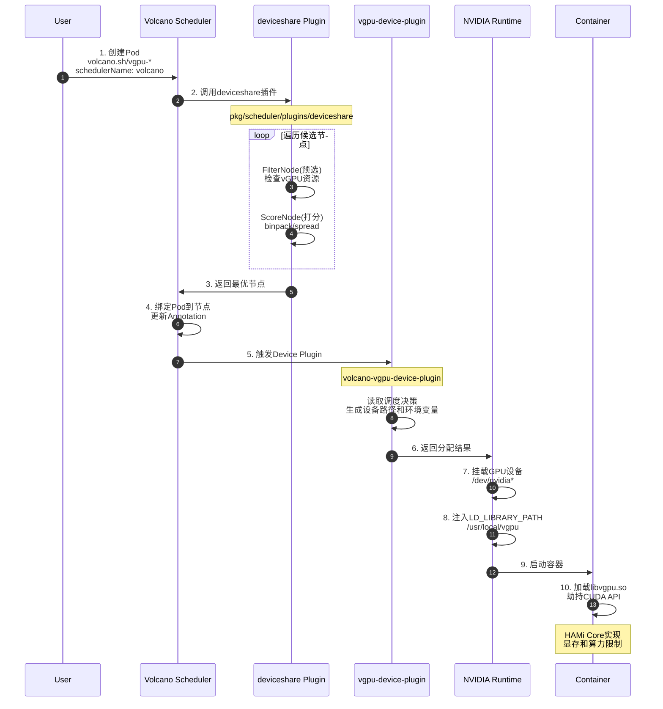

`Volcano`原生支持`HAMi vGPU`，但需要启用对应的`deviceshare` 插件。

## Volcano调度器配置

具体配置如下：
```yaml title="volcano-scheduler.conf"
actions: "enqueue, allocate, backfill"
tiers:
- plugins:
  - name: priority
  - name: gang
  - name: conformance
- plugins:
  - name: drf
  - name: deviceshare
    arguments:
      # 是否启用vgpu特性
      deviceshare.VGPUEnable: true 
      # volcano-vgpu-device-config这个ConfigMap对应的命名空间
      # 便于调度器自动读取ConfigMap内容
      deviceshare.KnownGeometriesCMNamespace: volcano-system 
  - name: predicates
  - name: proportion
  - name: nodeorder
  - name: binpack
```

同时需要替换`NVIDIA Device Plugin`为 https://github.com/Project-HAMi/volcano-vgpu-device-plugin ，具体参考：https://project-hami.io/zh/docs/userguide/volcano-vgpu/NVIDIA-GPU/how-to-use-volcano-vgpu

## Volcano vGPU执行流程

`Volcano + HAMi vGPU`的完整执行流程涉及多个组件的协同工作，从`Pod`创建到最终运行在节点上，经历了以下关键步骤：

### 组件交互流程



### 详细流程介绍

#### 阶段1：Pod创建

1. **用户创建Pod**
   ```yaml
   apiVersion: v1
   kind: Pod
   metadata:
     name: vgpu-test
   spec:
     schedulerName: volcano  # 指定使用 Volcano 调度器
     containers:
     - name: cuda-app
       image: nvidia/cuda:11.0-base
       resources:
         limits:
           volcano.sh/vgpu-number: 2        # 请求 2 张 GPU 卡
           volcano.sh/vgpu-memory: 3000     # （可选）每个 vGPU 使用 3G 显存
           volcano.sh/vgpu-cores: 50        # （可选）每个 vGPU 使用 50% 核心
   ```

#### 阶段2：调度器调度

2. **Volcano Scheduler接收调度请求**
   - `Scheduler`从`API Server`获取待调度的`Pod`
   - 初始化调度会话（`Session`）

3. **deviceshare插件执行预选（Predicate）**
   ```go
   // 遍历所有注册的设备类型
   for _, val := range api.RegisteredDevices {
       if dev, ok := node.Others[val].(api.Devices); ok {
           // 调用FilterNode检查节点是否满足vGPU资源需求
           code, msg, err := dev.FilterNode(task.Pod, dp.schedulePolicy)
           if err != nil {
               // 节点不满足条件，过滤掉
               return api.NewFitErrWithStatus(task, node, predicateStatus...)
           }
       }
   }
   ```
   
   **预选检查内容**：
   - 节点是否有足够的`vGPU`数量
   - 节点是否有足够的显存（`vgpu-memory`）
   - 节点是否有足够的算力（`vgpu-cores`）
   - 检查节点`Annotation`中的设备注册信息（`volcano.sh/node-vgpu-register`）

4. **deviceshare插件执行打分（Score）**
   ```go
   // 计算节点设备得分
   for _, devices := range node.Others {
       if devices.(api.Devices).HasDeviceRequest(pod) {
           ns := devices.(api.Devices).ScoreNode(pod, schedulePolicy)
           s += ns
       }
   }
   ```
   
   **打分策略**：
   - `binpack`：优先选择资源使用率高的节点（资源紧凑）
   - `spread`：优先选择资源使用率低的节点（资源分散）

5. **调度决策与绑定**
   - 选择得分最高的节点
   - 更新节点`Annotation`：`volcano.sh/vgpu-devices-allocated`
   - 记录分配的`GPU`设备信息（设备`ID`、显存、算力等）
   - 将`Pod`绑定到目标节点
   - 最终调度后的`Pod`会自动增加以下注解信息：
      ```yaml
      apiVersion: v1
      kind: Pod
      metadata:
        annotations:
          scheduling.k8s.io/group-name: podgroup-d6d0ed67-9b3f-4f17-aae5-b24c3b2f5c87
          volcano.sh/bind-phase: success
          volcano.sh/bind-time: "1764060249"
          volcano.sh/devices-to-allocate: ""
          volcano.sh/vgpu-ids-new: 'GPU-bc94e532-1820-8ee8-ceaa-704166369c7c,NVIDIA,3000,50:GPU-5beec879-79c9-6252-3aaa-9f5e146ba220,NVIDIA,3000,50:'
          volcano.sh/vgpu-node: dev-app-2-150-master-1
          volcano.sh/vgpu-time: "18446744073709551615"
      # ...
      ```

#### 阶段3：Device Plugin分配

6. **Kubelet调用Device Plugin**
   - `Kubelet`检测到`Pod`被调度到本节点
   - 读取`Pod`的资源请求（`volcano.sh/vgpu-*`）
   - 调用`volcano-vgpu-device-plugin`的`Allocate`方法

7. **Device Plugin执行分配**
   ```go
   // 初始化NVML
   nvml.Init()
   
   // 创建设备缓存
   cache := nvidiadevice.NewDeviceCache()
   cache.Start()
   
   // 创建设备注册器
   register := nvidiadevice.NewDeviceRegister(cache)
   register.Start()
   
   // 根据MIG策略获取插件
   plugins = migStrategy.GetPlugins(nvidiaCfg, cache)
   ```

   **Allocate方法职责**：
   - 读取`Volcano Scheduler`在节点`Annotation`中记录的分配信息
   - 确定要使用的物理`GPU`设备
   - 生成设备挂载路径（`/dev/nvidia*`）
   - 生成环境变量：
     - `NVIDIA_VISIBLE_DEVICES`：可见的`GPU UUID`
     - `CUDA_DEVICE_ORDER=PCI_BUS_ID`
     - `CUDA_VISIBLE_DEVICES`：对应的设备索引
   - 返回`ContainerAllocateResponse`给`Kubelet`

#### 阶段4：容器运行时处理

8. **Kubelet调用Container Runtime**
   - 将`Device Plugin`返回的设备和环境变量传递给`Container Runtime`
   - 指定`RuntimeClass`为`nvidia`（如果配置）

9. **NVIDIA Container Runtime注入**
    - 挂载`GPU`设备文件（`/dev/nvidia*`）
    - 挂载`NVIDIA`驱动库（`/usr/lib/x86_64-linux-gnu/libnvidia-*.so`）
    - 注入`LD_LIBRARY_PATH=/usr/local/vgpu:$LD_LIBRARY_PATH`
    - 注入其他`NVIDIA`相关环境变量

10. **HAMi Core库加载**
    - 容器启动时，动态链接器根据`LD_LIBRARY_PATH`搜索库
    - 优先加载`/usr/local/vgpu/libvgpu.so`（`HAMi Core`）
    - `libvgpu.so`劫持`CUDA API`调用
    - 实现显存和算力的隔离与限制

#### 阶段5：应用运行

11. **应用执行CUDA调用**
    ```text
    应用调用 cuMemAlloc()
         ↓
    libvgpu.so 劫持
         ↓
    检查显存配额 (volcano.sh/vgpu-memory)
         ↓
    检查算力配额 (volcano.sh/vgpu-cores)
         ↓
    调用真实的 CUDA Driver API
         ↓
    返回结果给应用
    ```


## Volcano vGPU与独立HAMi部署的区别

| 对比项 | 独立HAMi | Volcano + HAMi |
|--------|---------|----------------|
| **调度器** | `Kubernetes Default Scheduler` + `HAMi Scheduler Extender` | `Volcano Scheduler` |
| **Webhook** | `HAMi Mutating Webhook` | `Volcano Mutating Webhook` |
| **资源名称** | `nvidia.com/gpu`、`nvidia.com/gpumem` | `volcano.sh/vgpu-number`、`volcano.sh/vgpu-memory` |
| **调度插件** | `Scheduler Extender`（外部扩展） | `deviceshare Plugin`（内置插件） |
| **设备分配** | `HAMi Device Plugin` | `volcano-vgpu-device-plugin` |
| **库注入方式** | `Webhook`注入`LD_PRELOAD` | `NVIDIA Runtime`注入`LD_LIBRARY_PATH` |

## Volcano vGPU中的库注入机制

在`Volcano + HAMi`集成环境中，`HAMi Core`库的注入方式与独立部署的`HAMi`有所不同：

**独立部署的HAMi**：
- 通过`Mutating Webhook`直接向容器注入`LD_PRELOAD`环境变量
- 强制预加载`libvgpu.so`库，实现`CUDA API`劫持

**Volcano集成的HAMi**：
- 使用`LD_LIBRARY_PATH`而非`LD_PRELOAD`
- 依赖`NVIDIA Container Runtime`的`hook`机制
- 通过`RuntimeClass`触发库路径注入

**技术原理**：

1. **Device Plugin初始化阶段**：
   ```yaml
   lifecycle:
     postStart:
       exec:
         command: ["/bin/sh", "-c", "cp -f /k8s-vgpu/lib/nvidia/* /usr/local/vgpu/"]
   ```
   将`HAMi Core`库复制到宿主机的`/usr/local/vgpu/`目录

2. **RuntimeClass配置**：
   ```yaml
   apiVersion: node.k8s.io/v1
   kind: RuntimeClass
   metadata:
     name: nvidia
   handler: nvidia
   ```
   指定使用`NVIDIA Container Runtime`作为容器运行时

3. **环境变量注入**：
   - `NVIDIA Container Runtime`自动设置`LD_LIBRARY_PATH=/usr/local/vgpu:$LD_LIBRARY_PATH`
   - 动态链接器按路径优先级查找共享库
   - `/usr/local/vgpu/libvgpu.so`中的符号优先被解析，实现`CUDA API`劫持

**为什么选择LD_LIBRARY_PATH**：

| 对比维度 | LD_PRELOAD | LD_LIBRARY_PATH |
|---------|-----------|-----------------|
| 注入方式 | `Webhook`直接注入 | `NVIDIA Runtime`自动管理 |
| 库加载机制 | 强制预加载 | 路径优先级 |
| 与`NVIDIA Runtime`兼容性 | 可能冲突 | 原生兼容 |
| 环境变量管理 | 需手动维护 | `Runtime`自动处理 |
| 适用场景 | `HAMi`独立部署 | `Volcano`集成部署 |

这种设计避免了与`NVIDIA Container Runtime`内部机制的冲突，同时保持了与`Volcano`调度器的良好集成。


## Volcano vGPU监控指标

`Volcano Scheduler`在调度`vGPU`资源时会暴露`Prometheus`监控指标，用于观测`GPU`设备的分配和使用情况。这些指标定义在 `pkg/scheduler/api/devices/nvidia/vgpu/metrics.go` 中。

### 设备级指标

| 指标名称 | 类型 | 标签 | 说明 | 单位 |
|---------|------|------|------|------|
| `volcano_vgpu_device_memory_limit` | `Gauge` | `devID`, `NodeName` | `GPU`卡的总显存容量 | `MB` |
| `volcano_vgpu_device_allocated_memory` | `Gauge` | `devID`, `NodeName` | `GPU`卡已分配的显存总量 | `MB` |
| `volcano_vgpu_device_allocated_cores` | `Gauge` | `devID`, `NodeName` | `GPU`卡已分配的算力百分比 | `% (0-100)` |
| `volcano_vgpu_device_shared_number` | `Gauge` | `devID`, `NodeName` | 共享此 `GPU`卡的`Pod`数量 | `个` |

### Pod 级指标

| 指标名称 | 类型 | 标签 | 说明 | 单位 |
|---------|------|------|------|------|
| `volcano_vgpu_device_memory_allocation_for_a_certain_pod` | `Gauge` | `devID`, `NodeName`, `podName` | 特定`Pod`在此`GPU`卡上分配的显存 | `MB` |
| `volcano_vgpu_device_core_allocation_for_a_certain_pod` | `Gauge` | `devID`, `NodeName`, `podName` | 特定`Pod`在此`GPU`卡上分配的算力 | `% (0-100)` |

### 常用 PromQL 查询示例

1. **查看节点上所有 GPU 卡的显存使用率**：
   ```promql
   volcano_vgpu_device_allocated_memory / volcano_vgpu_device_memory_limit * 100
   ```

2. **查看 GPU 卡的平均共享数**：
   ```promql
   avg(volcano_vgpu_device_shared_number) by (NodeName)
   ```

3. **查看特定节点上 GPU 算力分配情况**：
   ```promql
   volcano_vgpu_device_allocated_cores{NodeName="node-1"}
   ```

4. **查看特定 Pod 的 GPU 显存分配**：
   ```promql
   volcano_vgpu_device_memory_allocation_for_a_certain_pod{podName="my-training-pod"}
   ```

5. **统计集群中 GPU 卡的总显存利用率**：
   ```promql
   sum(volcano_vgpu_device_allocated_memory) / sum(volcano_vgpu_device_memory_limit) * 100
   ```

### 指标访问方式

`Volcano Scheduler`默认在 `:8080/metrics` 端点暴露`Prometheus`监控指标。可以通过以下方式访问：

```bash
# 直接访问 Scheduler Pod
kubectl port-forward -n volcano-system svc/volcano-scheduler 8080:8080
curl http://localhost:8080/metrics | grep volcano_vgpu

# 或配置 Prometheus 自动采集
# 在 Prometheus 配置中添加 Volcano Scheduler 的 ServiceMonitor
```

### 指标参考数据


```python
# HELP volcano_vgpu_device_allocated_cores The percentage of gpu compute cores allocated in this card
# TYPE volcano_vgpu_device_allocated_cores gauge
volcano_vgpu_device_allocated_cores{NodeName="dev-app-2-150-master-1",devID="GPU-3c8ce108-117a-aeae-a3e8-1c0c5dafebe7"} 0
volcano_vgpu_device_allocated_cores{NodeName="dev-app-2-150-master-1",devID="GPU-41c5e13c-b480-c473-7a14-dd05a7c4cd43"} 0
volcano_vgpu_device_allocated_cores{NodeName="dev-app-2-150-master-1",devID="GPU-4e9cd184-671c-7b17-8fc2-e9bedbc3d604"} 0
volcano_vgpu_device_allocated_cores{NodeName="dev-app-2-150-master-1",devID="GPU-4ff93432-c6b5-7330-30e7-9c0c9a1c648b"} 0
volcano_vgpu_device_allocated_cores{NodeName="dev-app-2-150-master-1",devID="GPU-5beec879-79c9-6252-3aaa-9f5e146ba220"} 0
volcano_vgpu_device_allocated_cores{NodeName="dev-app-2-150-master-1",devID="GPU-aa336186-301a-bc80-5121-a9a2e430811a"} 0
volcano_vgpu_device_allocated_cores{NodeName="dev-app-2-150-master-1",devID="GPU-bc47d475-3538-d3eb-f4ba-e46e2639c54c"} 0
volcano_vgpu_device_allocated_cores{NodeName="dev-app-2-150-master-1",devID="GPU-bc94e532-1820-8ee8-ceaa-704166369c7c"} 0
volcano_vgpu_device_allocated_cores{NodeName="test-app-64-46-msxf",devID="GPU-07df9e74-a474-9fdd-248e-23e553ef2269"} 0
volcano_vgpu_device_allocated_cores{NodeName="test-app-64-46-msxf",devID="GPU-0af50c42-326c-bbff-7a49-a49afa433d3d"} 0
volcano_vgpu_device_allocated_cores{NodeName="test-app-64-46-msxf",devID="GPU-1bc8fc24-c939-545a-e272-2229d066d048"} 0
volcano_vgpu_device_allocated_cores{NodeName="test-app-64-46-msxf",devID="GPU-50baa64a-6476-a970-1013-121dff41ec78"} 0
volcano_vgpu_device_allocated_cores{NodeName="test-app-64-46-msxf",devID="GPU-7050631b-6524-21e3-41cf-6e08fc89220d"} 0
volcano_vgpu_device_allocated_cores{NodeName="test-app-64-46-msxf",devID="GPU-7299e30f-ccc4-a274-3e1a-77546d96a448"} 0
volcano_vgpu_device_allocated_cores{NodeName="test-app-64-46-msxf",devID="GPU-8cae1965-8e72-af03-1f8c-2e64646392bf"} 0
volcano_vgpu_device_allocated_cores{NodeName="test-app-64-46-msxf",devID="GPU-f7219cd7-e3ef-3b1b-4fa2-e84e8d5d4ce5"} 0
# HELP volcano_vgpu_device_allocated_memory The number of vgpu memory allocated in this card
# TYPE volcano_vgpu_device_allocated_memory gauge
volcano_vgpu_device_allocated_memory{NodeName="dev-app-2-150-master-1",devID="GPU-3c8ce108-117a-aeae-a3e8-1c0c5dafebe7"} 0
volcano_vgpu_device_allocated_memory{NodeName="dev-app-2-150-master-1",devID="GPU-41c5e13c-b480-c473-7a14-dd05a7c4cd43"} 0
volcano_vgpu_device_allocated_memory{NodeName="dev-app-2-150-master-1",devID="GPU-4e9cd184-671c-7b17-8fc2-e9bedbc3d604"} 0
volcano_vgpu_device_allocated_memory{NodeName="dev-app-2-150-master-1",devID="GPU-4ff93432-c6b5-7330-30e7-9c0c9a1c648b"} 0
volcano_vgpu_device_allocated_memory{NodeName="dev-app-2-150-master-1",devID="GPU-5beec879-79c9-6252-3aaa-9f5e146ba220"} 24564
volcano_vgpu_device_allocated_memory{NodeName="dev-app-2-150-master-1",devID="GPU-aa336186-301a-bc80-5121-a9a2e430811a"} 0
volcano_vgpu_device_allocated_memory{NodeName="dev-app-2-150-master-1",devID="GPU-bc47d475-3538-d3eb-f4ba-e46e2639c54c"} 0
volcano_vgpu_device_allocated_memory{NodeName="dev-app-2-150-master-1",devID="GPU-bc94e532-1820-8ee8-ceaa-704166369c7c"} 24564
volcano_vgpu_device_allocated_memory{NodeName="test-app-64-46-msxf",devID="GPU-07df9e74-a474-9fdd-248e-23e553ef2269"} 0
volcano_vgpu_device_allocated_memory{NodeName="test-app-64-46-msxf",devID="GPU-0af50c42-326c-bbff-7a49-a49afa433d3d"} 0
volcano_vgpu_device_allocated_memory{NodeName="test-app-64-46-msxf",devID="GPU-1bc8fc24-c939-545a-e272-2229d066d048"} 0
volcano_vgpu_device_allocated_memory{NodeName="test-app-64-46-msxf",devID="GPU-50baa64a-6476-a970-1013-121dff41ec78"} 0
volcano_vgpu_device_allocated_memory{NodeName="test-app-64-46-msxf",devID="GPU-7050631b-6524-21e3-41cf-6e08fc89220d"} 0
volcano_vgpu_device_allocated_memory{NodeName="test-app-64-46-msxf",devID="GPU-7299e30f-ccc4-a274-3e1a-77546d96a448"} 0
volcano_vgpu_device_allocated_memory{NodeName="test-app-64-46-msxf",devID="GPU-8cae1965-8e72-af03-1f8c-2e64646392bf"} 0
volcano_vgpu_device_allocated_memory{NodeName="test-app-64-46-msxf",devID="GPU-f7219cd7-e3ef-3b1b-4fa2-e84e8d5d4ce5"} 0
# HELP volcano_vgpu_device_core_allocation_for_a_certain_pod The vgpu device core allocated for a certain pod
# TYPE volcano_vgpu_device_core_allocation_for_a_certain_pod gauge
volcano_vgpu_device_core_allocation_for_a_certain_pod{NodeName="dev-app-2-150-master-1",devID="GPU-5beec879-79c9-6252-3aaa-9f5e146ba220",podName="test-vgpu-compatible"} 0
volcano_vgpu_device_core_allocation_for_a_certain_pod{NodeName="dev-app-2-150-master-1",devID="GPU-bc94e532-1820-8ee8-ceaa-704166369c7c",podName="test-vgpu-compatible"} 0
# HELP volcano_vgpu_device_memory_allocation_for_a_certain_pod The vgpu device memory allocated for a certain pod
# TYPE volcano_vgpu_device_memory_allocation_for_a_certain_pod gauge
volcano_vgpu_device_memory_allocation_for_a_certain_pod{NodeName="dev-app-2-150-master-1",devID="GPU-5beec879-79c9-6252-3aaa-9f5e146ba220",podName="test-vgpu-compatible"} 24564
volcano_vgpu_device_memory_allocation_for_a_certain_pod{NodeName="dev-app-2-150-master-1",devID="GPU-bc94e532-1820-8ee8-ceaa-704166369c7c",podName="test-vgpu-compatible"} 24564
# HELP volcano_vgpu_device_memory_limit The number of total device memory in this card
# TYPE volcano_vgpu_device_memory_limit gauge
volcano_vgpu_device_memory_limit{NodeName="dev-app-2-150-master-1",devID="GPU-3c8ce108-117a-aeae-a3e8-1c0c5dafebe7"} 24564
volcano_vgpu_device_memory_limit{NodeName="dev-app-2-150-master-1",devID="GPU-41c5e13c-b480-c473-7a14-dd05a7c4cd43"} 24564
volcano_vgpu_device_memory_limit{NodeName="dev-app-2-150-master-1",devID="GPU-4e9cd184-671c-7b17-8fc2-e9bedbc3d604"} 24564
volcano_vgpu_device_memory_limit{NodeName="dev-app-2-150-master-1",devID="GPU-4ff93432-c6b5-7330-30e7-9c0c9a1c648b"} 24564
volcano_vgpu_device_memory_limit{NodeName="dev-app-2-150-master-1",devID="GPU-5beec879-79c9-6252-3aaa-9f5e146ba220"} 24564
volcano_vgpu_device_memory_limit{NodeName="dev-app-2-150-master-1",devID="GPU-aa336186-301a-bc80-5121-a9a2e430811a"} 24564
volcano_vgpu_device_memory_limit{NodeName="dev-app-2-150-master-1",devID="GPU-bc47d475-3538-d3eb-f4ba-e46e2639c54c"} 24564
volcano_vgpu_device_memory_limit{NodeName="dev-app-2-150-master-1",devID="GPU-bc94e532-1820-8ee8-ceaa-704166369c7c"} 24564
volcano_vgpu_device_memory_limit{NodeName="test-app-64-46-msxf",devID="GPU-07df9e74-a474-9fdd-248e-23e553ef2269"} 32607
volcano_vgpu_device_memory_limit{NodeName="test-app-64-46-msxf",devID="GPU-0af50c42-326c-bbff-7a49-a49afa433d3d"} 32607
volcano_vgpu_device_memory_limit{NodeName="test-app-64-46-msxf",devID="GPU-1bc8fc24-c939-545a-e272-2229d066d048"} 32607
volcano_vgpu_device_memory_limit{NodeName="test-app-64-46-msxf",devID="GPU-50baa64a-6476-a970-1013-121dff41ec78"} 32607
volcano_vgpu_device_memory_limit{NodeName="test-app-64-46-msxf",devID="GPU-7050631b-6524-21e3-41cf-6e08fc89220d"} 32607
volcano_vgpu_device_memory_limit{NodeName="test-app-64-46-msxf",devID="GPU-7299e30f-ccc4-a274-3e1a-77546d96a448"} 32607
volcano_vgpu_device_memory_limit{NodeName="test-app-64-46-msxf",devID="GPU-8cae1965-8e72-af03-1f8c-2e64646392bf"} 32607
volcano_vgpu_device_memory_limit{NodeName="test-app-64-46-msxf",devID="GPU-f7219cd7-e3ef-3b1b-4fa2-e84e8d5d4ce5"} 32607
# HELP volcano_vgpu_device_shared_number The number of vgpu tasks sharing this card
# TYPE volcano_vgpu_device_shared_number gauge
volcano_vgpu_device_shared_number{NodeName="dev-app-2-150-master-1",devID="GPU-3c8ce108-117a-aeae-a3e8-1c0c5dafebe7"} 0
volcano_vgpu_device_shared_number{NodeName="dev-app-2-150-master-1",devID="GPU-41c5e13c-b480-c473-7a14-dd05a7c4cd43"} 0
volcano_vgpu_device_shared_number{NodeName="dev-app-2-150-master-1",devID="GPU-4e9cd184-671c-7b17-8fc2-e9bedbc3d604"} 0
volcano_vgpu_device_shared_number{NodeName="dev-app-2-150-master-1",devID="GPU-4ff93432-c6b5-7330-30e7-9c0c9a1c648b"} 0
volcano_vgpu_device_shared_number{NodeName="dev-app-2-150-master-1",devID="GPU-5beec879-79c9-6252-3aaa-9f5e146ba220"} 1
volcano_vgpu_device_shared_number{NodeName="dev-app-2-150-master-1",devID="GPU-aa336186-301a-bc80-5121-a9a2e430811a"} 0
volcano_vgpu_device_shared_number{NodeName="dev-app-2-150-master-1",devID="GPU-bc47d475-3538-d3eb-f4ba-e46e2639c54c"} 0
volcano_vgpu_device_shared_number{NodeName="dev-app-2-150-master-1",devID="GPU-bc94e532-1820-8ee8-ceaa-704166369c7c"} 1
volcano_vgpu_device_shared_number{NodeName="test-app-64-46-msxf",devID="GPU-07df9e74-a474-9fdd-248e-23e553ef2269"} 0
volcano_vgpu_device_shared_number{NodeName="test-app-64-46-msxf",devID="GPU-0af50c42-326c-bbff-7a49-a49afa433d3d"} 0
volcano_vgpu_device_shared_number{NodeName="test-app-64-46-msxf",devID="GPU-1bc8fc24-c939-545a-e272-2229d066d048"} 0
volcano_vgpu_device_shared_number{NodeName="test-app-64-46-msxf",devID="GPU-50baa64a-6476-a970-1013-121dff41ec78"} 0
volcano_vgpu_device_shared_number{NodeName="test-app-64-46-msxf",devID="GPU-7050631b-6524-21e3-41cf-6e08fc89220d"} 0
volcano_vgpu_device_shared_number{NodeName="test-app-64-46-msxf",devID="GPU-7299e30f-ccc4-a274-3e1a-77546d96a448"} 0
volcano_vgpu_device_shared_number{NodeName="test-app-64-46-msxf",devID="GPU-8cae1965-8e72-af03-1f8c-2e64646392bf"} 0
volcano_vgpu_device_shared_number{NodeName="test-app-64-46-msxf",devID="GPU-f7219cd7-e3ef-3b1b-4fa2-e84e8d5d4ce5"} 0
```

