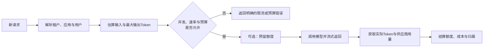
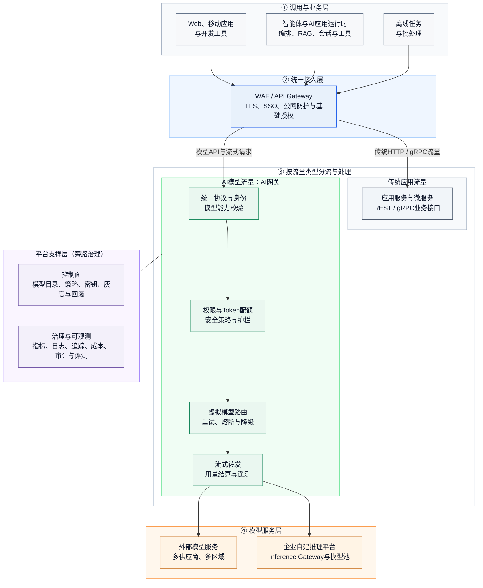
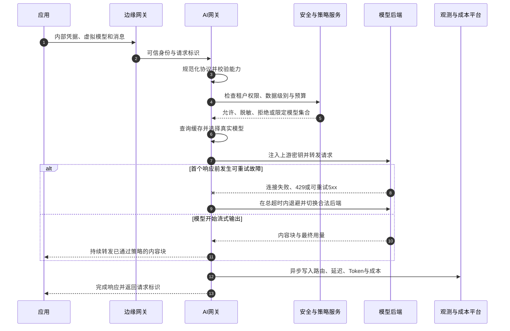
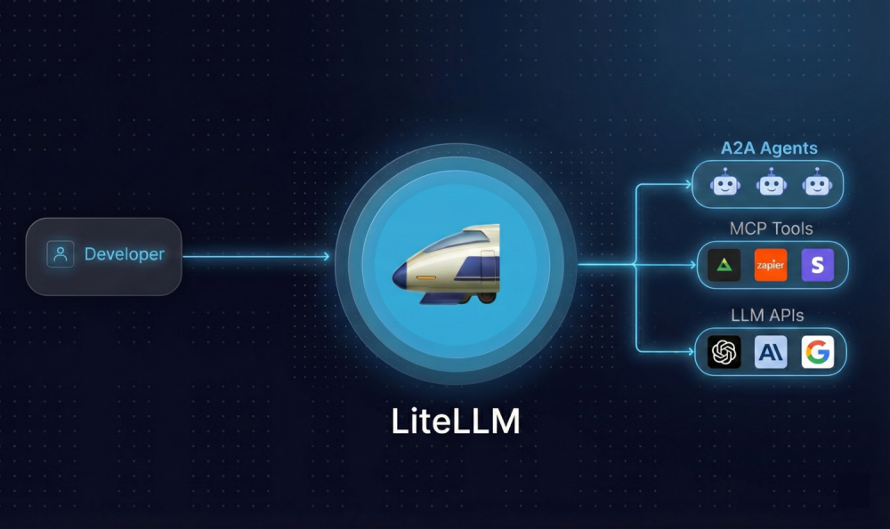
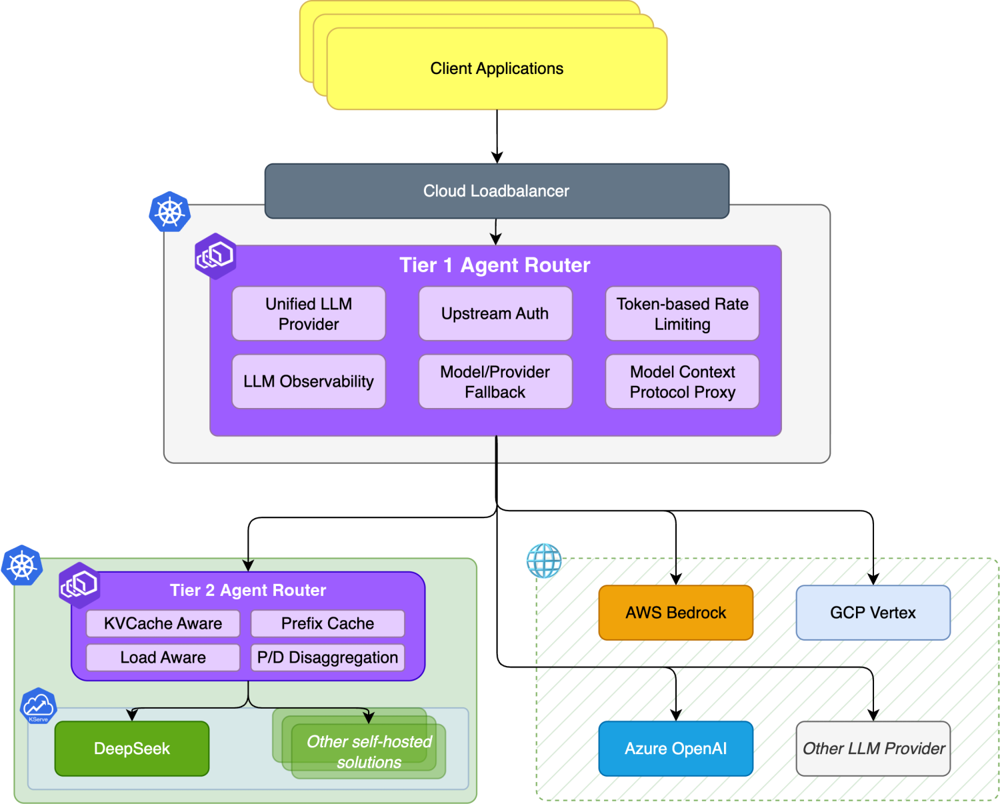
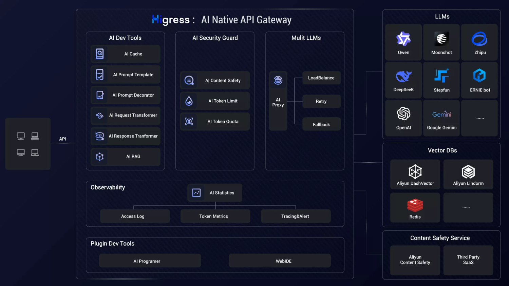
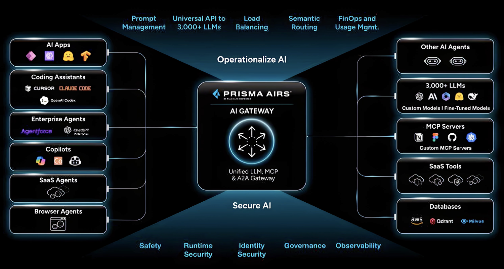
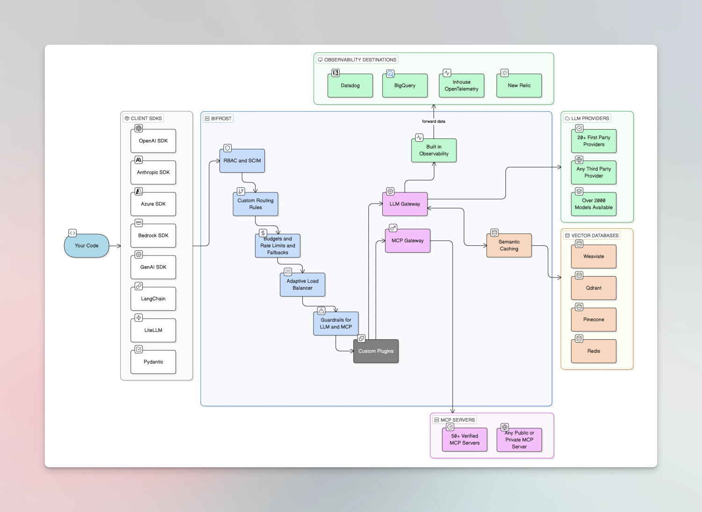
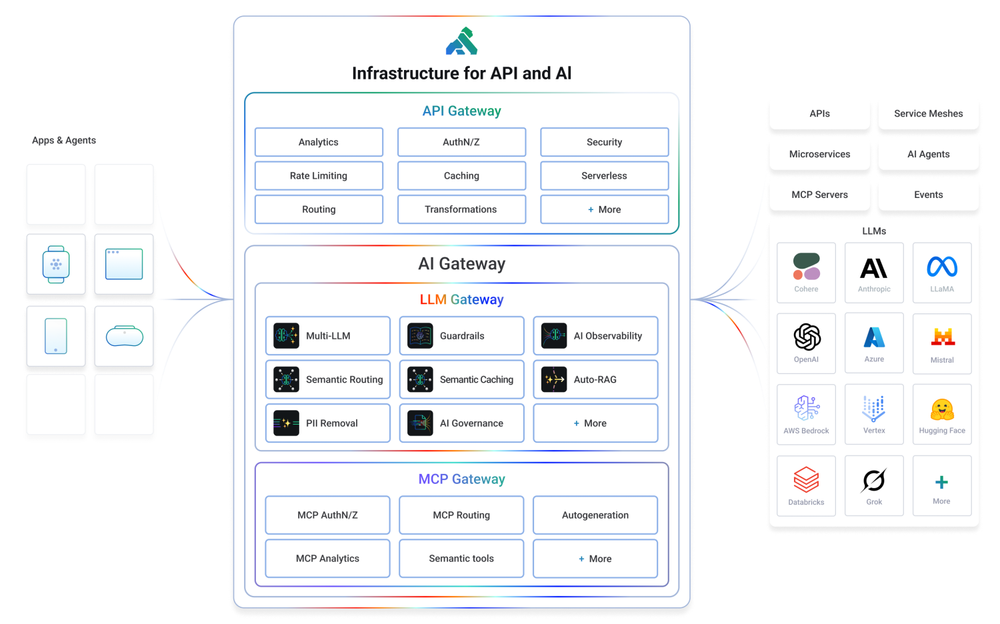

## 引言

一家企业第一次接入大模型时，代码通常很简单：准备一个供应商`API Key`，调用一个聊天接口，然后把回答返回给用户。此时请求量不大、模型只有一个、调用者也只有一个团队，直接调用看起来既快又省事。

进入生产环境后，问题会迅速变形。客服系统希望使用响应快的模型，研发助手需要更强的代码模型，包含敏感数据的请求只能进入内网，批处理任务希望使用低价模型；企业还要同时管理供应商限额、团队预算、流式超时、内容安全、故障切换和审计记录。每个应用各自实现这些逻辑，不仅重复建设，而且很难保证策略一致。

传统`API Gateway`已经能解决认证、路由、限流和观测，为什么还要引入**AI网关**？答案不在“网关”两个字，而在大模型流量的计量单位、协议语义、运行时行为和风险边界都发生了变化：一次请求的资源消耗要到生成结束后才完全确定；输出可能持续几十秒甚至数分钟；两个都返回`200`的模型，答案质量可能完全不同；提示词和响应本身还可能携带隐私、攻击指令或不应记录的业务数据。

本文从这些差异出发，逐步说明**AI网关**是什么、应具备哪些能力、与`Envoy`等传统网关是什么关系，以及企业引入它以后应如何设计整体架构。最后还会对六种具有代表性的开源方案进行比较。

先认识几个词：

| 术语 | 通俗解释 |
| --- | --- |
| **推理** | 已经训练好的模型根据输入生成结果的过程，不是重新训练模型 |
| **模型供应商** | 通过网络提供模型`API`的厂商或云平台 |
| **自建模型服务** | 企业在自己的计算资源上运行的`vLLM`、`SGLang`等推理服务 |
| **`Token`** | 模型读取和生成内容时使用的基本计量片段，通常也是限额和计费基础 |
| **`TTFT`** | 从请求发出到收到第一个输出`Token`的时间 |
| **`TPOT`** | 首个`Token`之后，生成每个输出`Token`平均花费的时间 |
| **流式响应** | 服务一边生成一边返回内容，常见承载方式是`SSE` |
| **虚拟模型** | 面向应用暴露的稳定模型名，背后可以映射到多个真实模型或供应商 |
| **模型路由** | 根据策略、能力、成本和运行状态选择模型或模型服务实例 |
| **护栏** | 在请求进入模型前或响应返回用户前执行的检查与处置规则 |

## 从大模型推理服务的痛点说起

### 供应商接口相似，却没有完全统一

许多模型供应商兼容`OpenAI Chat Completions API`，但“兼容”并不等于所有行为一致。不同后端对工具调用、结构化输出、多模态内容、推理参数、错误码、流式事件、`Token`统计和上下文缓存的支持仍可能不同；`Anthropic Messages API`、`OpenAI Responses API`、图像生成、语音和向量接口又有各自的数据结构。

如果应用直接依赖每个供应商的`SDK`，模型切换通常会牵动以下代码：

- 认证头、请求地址与模型名称；
- 消息、工具和多模态内容的请求结构；
- 流式事件的解析方式；
- 错误分类、重试条件与限流响应；
- 用量字段与成本计算方式。

这不仅形成供应商锁定，也让同一套治理逻辑在不同语言和应用中反复实现。企业真正需要的是一个稳定的内部契约，再由中间层把它转换为供应商能够理解的格式。需要注意，协议转换只能抹平结构差异，不能凭空补齐模型本身不支持的能力。例如目标模型不支持工具调用时，网关无法靠字段转换使它获得可靠的工具调用能力。

### 大模型请求昂贵，而且完成前很难知道最终消耗

普通接口常按请求次数限流，大模型服务还会受到输入`Token`、输出`Token`、请求频率和并发等多种约束。以[OpenAI的限流说明](https://developers.openai.com/api/docs/guides/rate-limits)为例，限额可能同时涉及每分钟请求数和每分钟`Token`数；其他供应商也有各自的额度与计费方式。

问题在于，输入`Token`可以在请求前估算，输出长度却只能设置上限，真实值要到生成过程中或结束后才能确定。一个用户请求生成`50 Token`，另一个请求生成`5000 Token`，如果都只扣一次“请求次数”，就无法公平表达资源消耗和费用。

因此，生产级治理通常需要两个动作：

1. **准入前预估或预留**：按模型、输入长度和输出上限判断是否允许请求进入，防止明显超出预算；
2. **响应后结算**：读取供应商返回的实际用量，修正租户、用户和模型维度的额度与成本。

两者都不能保证绝对精确。分词器可能不同，部分接口不返回完整用量，流式请求还可能在结束前中断。因此预算系统需要明确“估算值、供应商报告值、最终账单值”三者的来源，不能把网关估算直接当作财务账单。

### 流式长连接让超时、重试和降级变得更难

大模型聊天通常使用`SSE`持续输出。客户端关心的不只是总耗时，还关心多久能看到第一个字，以及后续生成是否平稳。传统的“请求超过三秒就超时重试”不适合直接套用：

- 在首个响应字节之前连接失败，通常可以安全地换一个后端重试；
- 已经向客户端输出部分内容后再切换模型，可能产生重复、上下文不一致或风格突变；
- 客户端主动断开时，网关还要尽快取消上游生成，否则`GPU`仍在工作并继续产生费用；
- 网关若为了检查完整响应而缓冲全部内容，会破坏流式体验并增加内存占用。

所以，“支持流式”不只是能转发`SSE`。网关还应区分首字节前后两个失败阶段，传递取消信号，设置连接、首`Token`、空闲和总时长等不同超时，并让安全检查选择逐块检查、旁路审计或末尾检查，而不是默认缓存整个回答。

### 多模型不是一组完全等价的后端

普通负载均衡通常假设后端提供相同能力，请求发往任一健康实例都能得到等价结果。大模型池往往并不等价：模型支持的语言、模态、上下文长度、工具调用、数据驻留位置、质量、速度和价格都不同。

路由因此至少分为两层：

- **模型级路由**决定使用哪个能力类别，例如代码模型、本地隐私模型或低成本通用模型；
- **实例级路由**在同一模型的多个副本之间选择端点，需要考虑队列深度、`KV Cache`命中、已加载的`LoRA`和硬件状态。

[Kubernetes Gateway API Inference Extension](https://gateway-api-inference-extension.sigs.k8s.io/)正是为第二类问题定义可组合模式：网关先选中`InferencePool`，再由`Endpoint Picker`结合模型服务指标选择端点。它能补足自建推理集群的实例调度，却不是完整的企业**AI网关**，因为供应商协议转换、租户预算、上游密钥和跨云模型治理仍需上层组件处理。

### 故障切换不能只看“服务是否存活”

大模型调用会遇到连接失败、`429`限流、供应商`5xx`、模型过载、上下文超长、内容策略拒绝和格式错误。它们不能使用同一种重试方式：

- 连接失败、部分`429`和临时`5xx`可以按退避策略重试；
- 参数错误、上下文超长和权限错误通常应直接返回，盲目重试只会扩大流量；
- 切换到另一个模型前，要确认上下文窗口、工具定义、结构化输出和数据合规要求仍然满足；
- 非幂等的智能体操作不能因为模型调用超时而自动重复执行工具；
- 同一供应商的多个区域可能共享故障域，看似多后端并不一定真正隔离风险。

可靠的降级链应明确触发错误、最大尝试次数、总超时预算和允许切换的模型集合。降级提高的是可用性，不保证答案质量完全相同，因此还要通过离线评测和线上指标验证替代模型。

### 安全边界从`URL`和身份扩展到提示词与响应内容

传统网关重点保护接口本身，大模型网关还会接触自然语言内容和工具描述。[OWASP GenAI Security Project](https://genai.owasp.org/llm-top-10/)列出的风险包括提示词注入、敏感信息泄露、不恰当输出处理和无界消耗等。企业常见的实际问题有：

- 员工把客户身份信息、源代码或合同内容发送到不允许的外部模型；
- 用户通过提示词诱导模型忽略系统规则；
- 模型生成危险链接、敏感数据或不符合行业要求的内容；
- 攻击者提交超长输入或诱导超长输出，持续消耗昂贵的推理资源；
- 日志平台完整保存提示词与响应，反而形成新的敏感数据副本。

**AI网关**适合执行统一的数据分类、脱敏、模型白名单和基础护栏，但它不是万能安全层。提示词注入无法只靠关键词彻底解决；涉及业务权限的判断必须回到应用；模型输出在进入数据库、浏览器或工具前仍要按“不可信输入”处理。正确思路是纵深防御，而不是把所有责任都交给网关。

### 只看状态码，无法判断大模型服务是否真的可用

一个请求返回`200`，可能依然答非所问；一次调用很快，可能是因为模型过早结束；成本下降，也可能伴随答案质量下降。传统的请求数、错误率和延迟仍然重要，但不够完整。

大模型调用至少还应观察：

- 输入、缓存输入、输出和总`Token`；
- `TTFT`、`TPOT`、总时长和流式中断率；
- 真实模型、供应商、区域、路由规则和降级次数；
- 租户、应用、用户和虚拟模型维度的额度与成本；
- 护栏命中、缓存命中和供应商错误分类；
- 与业务相关的质量评测、用户反馈和任务成功率。

[OpenTelemetry的生成式`AI`语义约定](https://github.com/open-telemetry/semantic-conventions/tree/main/docs/gen-ai)正在为调用跨度、事件和指标提供通用字段，但企业仍要决定哪些内容可以记录。默认保存完整提示词和响应并不是“可观测性更好”，而可能违反最小化采集原则。

### 治理逻辑散落在应用里，最终一定会失去一致性

没有统一入口时，每个团队都会逐渐写出自己的`if/else`：某个模型超时就换另一个、某类用户每天只能调用多少次、某个部门不得访问外部模型。随着模型和应用增加，策略修改需要重新发布许多服务，密钥散落在环境变量中，审计口径也无法统一。

这正是引入**AI网关**的根本原因：企业需要的不是再增加一跳网络代理，而是把跨应用、跨模型、跨供应商的共同治理能力从业务代码中抽离出来，形成可集中配置、可观测、可审计的执行点。

## AI网关是什么

**AI网关**位于`AI`应用与模型服务之间，对外提供稳定的模型访问协议，对内统一连接云端模型、自建推理服务和必要的安全或治理组件。它同时处理两类问题：

- **数据面**：对每一条真实请求执行认证、协议转换、配额检查、路由、重试、内容策略和流式转发；
- **控制面**：管理模型目录、供应商凭据、租户策略、预算、路由规则、插件、版本发布和审计配置。

可以把它理解为“懂大模型调用语义的`API Gateway`”。这里的“懂”并不表示网关必须运行一个大模型，而是它能够解析模型名、消息、工具、生成参数、流式事件和用量字段，并据此执行普通`HTTP`网关无法直接表达的策略。

### 它解决什么问题

| 目标 | 没有统一网关时 | 引入**AI网关**后 |
| :---: | --- | --- |
| **接口稳定** | 应用绑定供应商`SDK`和模型名 | 应用调用内部统一协议与虚拟模型 |
| **密钥安全** | 供应商密钥散落在各应用 | 网关集中保管并按路由注入上游凭据 |
| **流量治理** | 只按请求数限流 | 结合并发、`Token`、模型和租户治理 |
| **高可用性** | 各应用自行重试 | 统一错误分类、退避、熔断和降级链 |
| **成本控制** | 账单出来后才发现超支 | 准入前预算检查，完成后按实际用量结算 |
| **安全合规** | 每个应用各写一套检查 | 统一数据分类、脱敏、模型边界和审计 |
| **可观测性** | 日志字段与成本口径不一致 | 形成统一调用、用量、成本与策略记录 |
| **模型演进** | 切换模型需要修改应用 | 修改虚拟模型映射并灰度验证 |

### 它不是什么

明确边界比罗列能力更重要：

- **AI网关**不是推理引擎。它通常不加载模型权重，也不执行`Prefill`和`Decode`；这些工作由`vLLM`、`SGLang`、`TensorRT-LLM`或云端模型服务完成。
- **AI网关**不是智能体编排器。复杂工作流、业务状态、工具执行顺序和人工确认应由应用或智能体运行时负责；网关最多治理模型与`MCP`流量。
- **AI网关**不是模型质量评测平台。它可以采集样本和反馈，但离线数据集、裁判模型、人评和发布门禁通常属于独立评测系统。
- **AI网关**不是数据防泄漏的唯一防线。应用授权、数据目录、终端安全和供应商合同仍然不可替代。
- **AI网关**也不必替代现有边缘网关。企业可以保留原有`WAF`、`API Gateway`和服务网格，只把模型流量交给专门的`AI`治理层。

## AI网关与传统网关的区别

[Envoy官方定义](https://www.envoyproxy.io/docs/envoy/latest/intro/what_is_envoy)是面向现代服务架构的`L7`代理与通信总线。它在`HTTP`连接管理、路由、负载均衡、`TLS`、重试、熔断、扩展过滤器和遥测方面非常成熟。**AI网关**与它并不是互斥关系，区别主要在于默认理解和治理的对象不同。

| 对比维度 | Envoy等传统网关 | **AI网关** |
| :---: | --- | --- |
| **主要对象** | `HTTP/gRPC/TCP`服务与端点 | 模型、供应商、`Token`、提示词和流式事件 |
| **请求识别** | 路径、方法、请求头、连接和通用元数据 | 进一步解析模型名、消息、工具、模态和生成参数 |
| **协议处理** | 通用`HTTP/gRPC`代理与转换 | 模型供应商协议、错误、流式事件和用量归一化 |
| **计量限流** | 请求数、连接数、字节等 | 额外支持输入/输出`Token`、模型成本和预算 |
| **路由目标** | 集群、服务和健康端点 | 虚拟模型、供应商、模型类别及推理实例 |
| **可靠性** | 通用超时、重试、熔断和负载均衡 | 增加模型兼容检查、流式阶段和质量降级边界 |
| **安全性** | 身份、`TLS`、`WAF`和接口授权 | 增加数据分类、提示词与输出护栏、模型访问策略 |
| **可观测性** | 状态码、延迟、字节、连接和上游集群 | 增加`TTFT`、`TPOT`、`Token`、成本、路由原因和护栏 |

**不是替代关系，而是三种常见组合**：

1. **在现有网关上增加`AI`插件**：例如`Higress`和`Kong Gateway`，适合已经使用该网关并希望统一普通`API`与模型流量的团队；
2. **使用`Envoy`数据面和独立`AI`控制层**：`Agent Router`通过`Envoy Gateway`、外部处理器和`CRD`提供模型能力；
3. **前后两级网关**：边缘`WAF/API Gateway`负责公网防护和企业身份，内部**AI网关**专注模型协议、预算、路由和内容策略。

因此，“企业已经有`Envoy`”并不能直接推出“不需要**AI网关**”，但也不意味着必须再放一个完全独立的代理。可以通过`ExtProc`、`Wasm`或原生过滤器扩展现有数据面，也可以部署专用代理。选型要比较额外网络跳数、流式处理方式、配置模型、团队运维能力和已有基础设施。

## AI网关需要具备哪些能力

不同产品的功能名称不一，可以把必要能力分为七组。前五组通常是生产基线，语义缓存、语义路由、提示词管理和`MCP Gateway`等高级能力应按业务需要选择，不能为了“功能齐全”默认开启。

### 统一接口与协议适配

网关应向应用暴露稳定协议，并在后端完成模型名称、认证方式、请求字段、流式事件、错误和用量的转换。评估时不能只验证最简单的文本问答，还要覆盖企业真正使用的端点：

| 能力 | 需要验证的重点 |
| :---: | --- |
| **对话与响应** | 系统消息、停止条件、推理参数和错误映射 |
| **流式输出** | `SSE`事件顺序、取消传递、末尾用量和断流处理 |
| **工具调用** | 工具定义、并行调用、调用标识与结果回传 |
| **结构化输出** | `JSON Schema`约束及供应商降级行为 |
| **多模态** | 图片、音频、文件的大小限制与传递方式 |
| **其他端点** | 向量、重排、图像、语音、批处理和实时接口 |

统一协议不应抹掉供应商特有能力。合理的设计通常同时提供“标准字段”和受控的供应商扩展字段，并在切换后端时明确哪些扩展会失效。

### 身份、授权与密钥隔离

应用只持有企业内部颁发的虚拟密钥或工作负载身份，供应商密钥由网关从密钥管理系统读取，并在转发前注入。网关还要把“谁在调用”转换为可执行的策略维度：租户、团队、应用、用户、环境和数据级别。

最低要求包括：

- 供应商密钥不下发到业务应用，支持轮换和吊销；
- 按租户限制可见模型、端点和区域；
- 外部身份头在可信边界处重写，不能相信客户端自报的`x-tenant-id`；
- 控制面与数据面使用不同权限，配置变更进入审计；
- 日志、缓存、指标和追踪同样遵守租户隔离。

### `Token`配额、预算与成本归集

一个实用的配额系统应同时支持短窗口速率与长窗口预算：前者防止突发流量压垮后端，后者防止一天或一个月持续超支。

计费信息还要版本化。模型价格会变化，同名模型在不同区域、购买方式和缓存命中条件下也可能不同。网关中的成本适合实时治理和内部归集，正式对账仍应以供应商账单为准。

### 路由、负载均衡与可靠性

成熟的路由能力应遵循“先约束、后优化”：

1. 先按数据驻留、授权、模态、上下文长度和工具能力排除不合法后端；
2. 再在合法候选中按质量、延迟、价格、配额和健康状态选择；
3. 选定模型后，再在同模型副本中结合队列、缓存和实例状态负载均衡。

可靠性能力则包括超时、退避重试、熔断、健康检查和跨故障域降级。对流式调用，网关必须明确“首字节前可以重试，已经输出后默认不透明切换”的边界。对同一请求的多次尝试还应共享一个总超时预算，避免每个后端都等待完整超时。

### 安全、隐私与内容策略

安全能力应支持按路由组合，而不是所有请求执行同一套昂贵检查：

- 请求大小、上下文长度和最大输出限制；
- 敏感数据识别、掩码或阻断；
- 允许访问的供应商、区域和模型白名单；
- 提示词注入、越狱和恶意内容的检测接口；
- 输出分类、事实风险提示和不安全内容处置；
- 工具和`MCP`服务器的访问控制、参数审计与出站限制。

每条策略需要定义命中后的动作，例如记录、脱敏、拒绝、改走本地模型或转人工。只记录“护栏失败”却继续发送原文，没有真正降低风险。相反，任何护栏也可能误报，直接全局阻断会伤害可用性，因此上线前必须使用真实流量样本评估。

### AI可观测性与审计

网关应为一次调用生成稳定的请求标识，并记录从虚拟模型到真实后端的决策过程。建议把数据分成三层：

- **运行指标**：请求数、错误率、并发、`TTFT`、`TPOT`、总时长和流式中断；
- **资源与成本**：输入、缓存输入、输出`Token`，供应商、模型、租户和估算成本；
- **策略与质量**：路由原因、重试与降级、护栏和缓存命中、反馈及评测关联标识。

提示词与响应正文应默认关闭或经过脱敏，仅在获得明确授权的调试、评测和审计场景中采集，并设置访问控制与保留期限。指标标签也要控制基数，不能把用户问题或请求标识直接作为`Prometheus Label`。

### 高可用控制面和可安全发布的策略

网关本身进入所有模型请求的关键路径后，必须避免成为新的单点：

- 数据面应多副本、跨故障域部署，并完成容量与长连接压力测试；
- 控制面短暂不可用时，数据面应继续使用最后一份有效配置；
- 配置需要语法和语义校验，支持版本、审计、回滚与灰度；
- 外部护栏、计费或日志系统不可用时，要为每条策略定义`fail-open`或`fail-closed`；
- 遥测写入尽量异步，监控系统故障不应默认阻塞全部推理请求。

### 按需选择的高级能力

以下能力有价值，但不是所有企业的第一阶段必需项：

- **精确缓存**适合输入完全一致且结果可复用的请求；
- **语义缓存**能复用含义相近的答案，但必须考虑时效、权限、租户和错误答案扩散；
- **语义路由**可以根据问题内容选择模型，但需要标注数据、离线评测、置信度阈值和兜底路径；
- **提示词模板**便于版本治理，但业务提示词过度集中会让网关承担应用职责；
- **工具网关**（`MCP Gateway`）适合统一工具发现、认证和审计，但工具执行授权仍应基于最终用户身份；
- **请求批处理**可能提高离线吞吐，却不适合直接合并对延迟敏感或安全边界不同的在线请求。

## 引入AI网关后的企业架构

### 总体分层

下面是一种可落地的参考架构。它刻意把企业边缘、`AI`治理、自建推理、业务编排和控制面分开，避免让一个组件承担全部职责。

这张图包含几个关键设计判断：

- **`API Gateway`明确分流两类请求**：传统`HTTP/gRPC`业务请求按域名、路径或路由规则转发到应用服务；模型`API`和流式请求转发到**AI网关**。这里依赖显式路由，不建议让网关读取提示词正文后再猜测流量类型。
- **企业边缘与模型治理分层**：公网攻击防护、用户登录和通用接口策略继续由成熟边缘组件负责；**AI网关**专注模型流量。两层也可以由同一产品实现，但逻辑职责仍应区分。
- **业务编排不塞进网关**：`RAG`权限、会话状态、工具副作用和人工确认属于应用运行时。网关只治理这些运行时发出的模型或工具调用。
- **云模型与自建模型统一入口，执行路径不同**：云模型路由到供应商`API`，自建模型还要经过推理感知的端点选择层。
- **控制面不直接承载请求**：策略发布到数据面后，控制面短暂故障不应中断已有配置下的调用。
- **观测数据与正文分离**：运行指标可广泛保留，提示词和响应需要更严格的权限、脱敏与保留策略。

### 一次请求如何流转

实际部署还要处理两个容易被忽视的分支。第一，若客户端断开，**AI网关**应把取消信号传给模型，并记录已产生但未完整返回的用量。第二，若外部策略服务超时，系统必须按数据敏感度决定继续、改走本地模型还是拒绝，不能临时随机选择。

### 两级网关在大型企业中更常见

大型企业可能同时存在多个集群、区域和模型团队。可以把网关分成两级：

- **一级网关**（**AI网关**）提供企业统一入口，负责身份、供应商协议、全局预算、模型目录和跨区域路由；
- **二级推理网关**靠近自建模型集群，负责端点选择、队列感知、`KV Cache`或`LoRA`感知路由。

这种结构与`Agent Router`官方描述的两级模式一致：一级处理认证、顶层路由和全局限流，二级处理自建模型的细粒度访问与端点选择。它能减少中心网关对每个`GPU`实例状态的直接依赖，但需要统一请求标识、模型名称和遥测字段，避免两层各算一份不一致的用量。

### 多租户与数据治理

多租户不能只在请求头里放一个租户名。完整隔离至少覆盖：

- 虚拟密钥、模型白名单和速率限制；
- 预算账户、成本中心和价格版本；
- 缓存键、向量索引和会话数据；
- 提示词与响应日志的访问权限；
- 供应商、区域、数据保留和训练使用政策；
- 配置变更、人工解封和应急操作审计。

尤其要避免跨租户语义缓存。即使两个问题语义相似，答案也可能包含上一个租户的数据或受不同授权约束。缓存键至少应包含租户、模型版本、系统提示词版本、工具定义和安全策略版本；对时效强、个性化或包含敏感数据的请求，直接禁用缓存往往更稳妥。

## 开源AI网关方案调研

这里选择`LiteLLM`、`Agent Router`、`Higress`、`Portkey Gateway`、`Bifrost`和`Kong AI Gateway`，是因为它们分别代表应用型多供应商代理、`Envoy Gateway`原生控制层、云原生`API Gateway`扩展、边缘运行时、`Go`高性能网关以及成熟插件生态六条路线。它们解决的问题有重叠，但并非完全同类。

| 方案 | 开源协议 | 核心形态 | 优先考虑场景 |
| --- | --- | --- | --- |
| `LiteLLM` | `MIT` | `Python SDK`与独立代理 | 快速统一大量模型供应商 |
| `Agent Router` | `Apache-2.0` | `Envoy Gateway`控制面、`ExtProc`和`CRD` | 已采用`Kubernetes Gateway API`与`Envoy` |
| `Higress` | `Apache-2.0` | `CNCF Sandbox`项目，基于`Istio/Envoy`的网关与`Wasm`插件 | 同时治理普通`API`、模型和`MCP`流量 |
| `Portkey Gateway` | `MIT` | 轻量`TypeScript`边缘网关 | 偏好配置式路由和多供应商接入 |
| `Bifrost` | `Apache-2.0` | `Go SDK`与独立`HTTP`网关 | 看重低开销或希望嵌入`Go`应用 |
| `Kong AI Gateway` | `Apache-2.0` | 成熟网关加`AI`插件 | 已有`Kong`平台与插件治理体系 |

### `LiteLLM`

[`LiteLLM`](https://github.com/BerriAI/litellm)同时提供`Python SDK`和可独立部署的`Proxy Server`。官方文档将代理定位为统一访问大量模型供应商的`AI Gateway`，对外主要提供`OpenAI`兼容接口，并提供虚拟密钥、预算、路由、回退、护栏和可观测集成。

**优点**

- 供应商与端点覆盖广，适合快速把不同云模型和本地兼容接口收敛到一个地址；
- `SDK`和代理共用能力，应用可以先以库方式验证，再迁移到集中网关；
- 路由、重试、降级、成本映射和虚拟密钥围绕多模型场景设计，上手路径直接；
- 社区文档、示例和第三方可观测集成丰富，适合应用平台团队快速迭代。

**局限与注意事项**

- 它首先是应用层模型代理，不等同于成熟边缘网关；公网`WAF`、复杂`L4/L7`治理和企业统一入口通常仍要搭配其他组件；
- 高可用部署会引入数据库、缓存和状态一致性问题，必须实际压测流式连接、虚拟密钥和日志链路；
- 仓库根许可证说明`enterprise/`目录使用单独许可，选型时要核对所需功能是否位于开源主体；
- 供应商覆盖广也意味着适配变化频繁，升级前要用自己的工具调用、结构化输出和流式样本做回归。

**适用判断**：团队的首要目标是尽快建立统一模型入口、供应商切换与成本治理，且愿意在外层继续使用现有`Ingress/API Gateway`时，`LiteLLM`通常是最容易开始验证的方案。

### `Agent Router`（原`Envoy AI Gateway`）

[`Agent Router`](https://github.com/theagentrouter/agent-router)是`Envoy AI Gateway`在`2026-09`更名后的项目。根据[官方更名公告](https://theagentrouter.ai/blog/envoy-ai-gateway-is-now-agent-router)，项目代码、维护者、`Apache-2.0`许可证、`AIGatewayRoute`等`CRD`、`aigateway.envoyproxy.io` API组和`aigw`命令保持不变，底层仍使用`Envoy`与`Envoy Gateway`。

它把控制面和数据面分开：控制器把`AI`资源转换成`Envoy Gateway`配置，数据面由`Envoy Proxy`、外部处理器和限流服务承担。当前[能力文档](https://theagentrouter.ai/docs/capabilities/)覆盖供应商协议、模型虚拟化、回退、配额、基于`Token`的限流、上游认证、可观测性、`MCP Gateway`和`InferencePool`。

**优点**

- 沿用`Kubernetes Gateway API`与`Envoy Gateway`的声明式模型，容易纳入`GitOps`、命名空间和`CRD`治理；
- 通用代理能力由成熟`Envoy`数据面承担，`AI`逻辑通过外部处理器和控制器扩展，职责清晰；
- 能同时连接云模型和`InferencePool`，适合构建一级企业入口加二级推理路由；
- 官方文档明确说明流式`Token`限流的结算时机和超额行为，便于理解实现边界。

**局限与注意事项**

- 体系涉及`Envoy Gateway`、控制器、外部处理器、限流服务和可选`Redis`，对不使用`Kubernetes`的团队偏重；
- 声明式资源较多，租户规模很大时要关注控制面对象数量与配置收敛性能；
- 输出`Token`只能在流结束后完整获知，官方实现不会中断已经获准但后来超额的流，而是在结算后限制后续请求；这属于事后计量的固有限制；
- 项目刚完成更名，搜索资料时会同时遇到两个名称，部署标识却仍保留旧名，需要统一内部文档口径。

**适用判断**：企业已经标准化`Kubernetes Gateway API`和`Envoy Gateway`，希望用声明式资源管理模型流量，并且需要对接自建推理池时，它的架构一致性最强。

### `Higress`

[`Higress`](https://github.com/higress-group/higress)是基于`Istio`和`Envoy`的云原生网关，也是`CNCF Sandbox`项目。其`AI`能力主要由`Wasm`插件提供，官方仓库包含`ai-proxy`、`ai-token-ratelimit`、`ai-cache`、`ai-security-guard`、`ai-intent`和`ai-endpoint-picker`等扩展；项目同时是`Gateway API`与`Gateway API Inference Extension`的实现之一。

**优点**

- 一套网关同时覆盖传统`API`、微服务、模型和`MCP`流量，适合减少入口组件种类；
- 基于`Envoy`并强调流式请求与响应体处理，`Wasm`插件可独立升级和扩展；
- 对国内外模型供应商提供统一代理，包含协议转换、模型映射、多密钥和故障转移等能力；
- 提供控制台、`Kubernetes`部署和单机体验方式，对已经使用阿里云、`Nacos/Dubbo`或国内模型生态的团队较友好；
- 推理端点选择插件可以综合队列、运行中请求、`KV Cache`与前缀匹配等信号，覆盖自建模型实例路由。

**局限与注意事项**

- 能力分布在多个插件中，生产配置必须验证插件执行顺序、版本兼容、失败策略和流式影响；
- 同时承担传统网关和`AI`网关后，配置面与故障影响范围都会扩大，需要做好租户隔离和变更灰度；
- 部分高级效果依赖外部`Redis`、安全服务或模型侧指标，不是安装网关后自动获得；
- 供应商、协议和插件更新较快，不能仅根据功能列表判断兼容性，应以目标版本和真实请求回归为准。

**适用判断**：希望基于`Envoy`统一入口、需要国内模型适配与`Wasm`扩展，并且不想分别维护传统网关和模型代理时，`Higress`值得优先验证。

### `Portkey Gateway`

[`Portkey Gateway`](https://github.com/Portkey-AI/gateway)是以配置驱动多供应商路由的轻量开源网关，支持重试、回退、加权负载均衡、条件路由、多模态和护栏接口。项目也提供托管和企业产品。

**优点**

- 路由、重试、回退和护栏通过请求配置表达，适合应用按场景组合策略；
- 运行时轻量，可通过`Node.js`、`Docker`和边缘环境部署，开发验证成本低；
- 多供应商和多模态适配较丰富，对`OpenAI`兼容客户端友好；
- 开源仓库采用`MIT`许可证，核心路由代码便于阅读和二次集成。

**局限与注意事项**

- 官方`README`明确把部分语义缓存、供应商优化、观测、组织治理和安全能力标为托管版或企业版，不能把产品网站的全部功能视为开源自托管能力；
- 默认分支同时提示`Gateway 2.0`处于预发布并将合并更多企业核心，评估时必须固定分支和版本，不能混用`1.x`与`2.0`文档；
- 它不替代企业边缘安全网关或`Kubernetes`推理端点调度层；
- 护栏往往调用外部服务，其延迟、数据出境和故障策略要单独评估。

**适用判断**：团队希望以轻量运行时和请求级配置快速组合多供应商策略，并能接受把企业治理能力自行集成或采购商业版时，可以选择它做应用侧统一入口。

### `Bifrost`

[`Bifrost`](https://github.com/maximhq/bifrost)提供`Go SDK`和独立`HTTP Gateway`，对外兼容常见模型协议，并在开源仓库中提供供应商适配、自动回退、负载均衡、语义缓存、治理插件、管理界面和遥测能力。官方`README`同时列出了私有部署的企业功能范围。

**优点**

- `Go`实现适合强调低运行时开销、单二进制部署或直接嵌入`Go`服务的团队；
- 同时支持库模式与网关模式，便于从应用内调用逐步演进为集中代理；
- 内置管理界面、供应商配置、回退、缓存和可观测插件，开发体验完整；
- 仓库主体采用`Apache-2.0`许可证，模块划分清晰。

**局限与注意事项**

- 与历史更长的通用网关相比，企业身份、边缘安全和复杂`Kubernetes`流量治理仍可能需要外部组件；
- 官方性能数据来自项目给定硬件与测试方法，只能用于了解其设计目标，不能直接推导企业真实链路延迟；
- 官方说明将自适应负载均衡、集群、部分护栏和`MCP Gateway`等列为企业部署能力，需确认开源版边界；
- 项目演进快，生产采用前要重点验证升级兼容、状态存储、流式处理和故障恢复。

**适用判断**：希望获得较低代理开销、偏好`Go`技术栈，或者需要把统一模型调用直接嵌入平台服务时，`Bifrost`具有吸引力，但要先确认治理功能边界。

### `Kong AI Gateway`

[`Kong Gateway`](https://github.com/Kong/kong)是成熟的通用`API Gateway`，其开源仓库已经包含`ai-proxy`、提示词模板、提示词防护和请求/响应转换等`AI`插件；[`Kong AI Gateway`文档](https://developer.konghq.com/ai-gateway/)还覆盖更广的模型路由、安全、观测和`MCP`能力。`Kong`同时提供企业版和`Konnect`托管控制面。

**优点**

- 可以复用现有`Kong`的路由、认证、限流、插件、声明式配置和运维体系；
- 普通`API`、模型和`MCP`流量能够在同一治理平台上管理，适合已有`Kong`能力中心的企业；
- 开源仓库中确实包含基础`AI`代理与转换实现，而不是只有产品名称；
- 部署模型和插件生态成熟，边缘接入能力通常比纯应用型模型代理更完整。

**局限与注意事项**

- 高级负载均衡、语义缓存、复杂护栏、分析和控制面能力可能受版本或产品层级限制，必须查阅目标插件的兼容与授权页面；
- 如果企业没有`Kong`基础，仅为模型代理引入完整平台，学习和资源成本可能高于专用轻量网关；
- 插件处理请求体和响应体时要特别验证`SSE`流式行为、缓冲和内存占用；
- 自建推理实例的队列、`KV Cache`和`LoRA`感知调度仍可能需要额外的`Inference Gateway`或路由器。

**适用判断**：企业已经把`Kong`作为统一`API`入口，希望在不改变主要网关技术栈的前提下扩展模型治理时，它通常比另起一套网关更自然。

### 功能特性对比

| 状态 | 判断标准 |
| --- | --- |
| **原生** | 开源版本直接提供，并有官方配置或代码依据 |
| **部分** | 只覆盖该能力的一部分，或必须组合底层网关、插件和外部服务 |
| **商业/外接** | 官方商业版提供，或者开源部署需要自行接入其他系统 |
| **未见** | 官方开源资料中没有找到明确实现 |

| 功能特性 | `LiteLLM` | `Agent Router` | `Higress` | `Portkey Gateway` | `Bifrost` | `Kong AI Gateway` |
| --- | --- | --- | --- | --- | --- | --- |
| **协议、流式与自建模型** | **原生**：多供应商、`OpenAI`兼容接口和`SSE`；可接`vLLM`、`Ollama` | **原生**：供应商协议转换和流式转发；可接`InferencePool` | **原生**：多供应商和完整流式处理；可接兼容端点与端点选择器 | **部分**：多供应商、流式和实时接口原生；可代理兼容端点但不感知实例状态 | **原生**：多协议、多模态和流式响应；可接`Ollama`等本地端点 | **部分**：`AI Proxy`协议转换和`SSE`原生；可代理兼容端点但不感知实例状态 |
| **路由与故障处理** | **原生**：负载均衡、重试与回退 | **原生**：模型虚拟化、负载均衡与供应商回退 | **原生**：多模型负载均衡、多密钥与故障转移 | **原生**：重试、回退、加权和条件路由 | **原生**：自动回退与负载均衡 | **部分**：基础路由开源，高级模型均衡与回退有产品层级限制 |
| **身份与密钥隔离** | **原生**：主密钥、虚拟密钥和上游密钥隔离 | **部分**：上游认证原生，调用方认证复用`Envoy Gateway`策略 | **原生**：`Key`、`JWT`、`OIDC`认证与供应商凭据管理 | **部分**：支持上游密钥和管理鉴权，组织级`RBAC`属于产品能力 | **原生**：治理插件提供虚拟密钥与细粒度访问控制 | **原生**：复用`Kong`消费者、认证插件和上游凭据 |
| **配额与成本预算** | **原生**：`RPM/TPM`、预算、用量和成本跟踪 | **部分**：支持`Token`限流和总量配额，不是财务成本中心 | **部分**：支持`Token`限流，成本预算需外部系统 | **商业/外接**：开源核心未形成多租户预算闭环 | **原生**：治理插件提供用量、限流和分层预算 | **商业/外接**：开源版有请求限流，`Token`与成本预算属于高级能力 |
| **护栏与隐私策略** | **部分**：提供护栏编排，检测通常依赖外部服务 | **未见**：未发现原生提示词或响应内容护栏 | **原生**：`ai-security-guard`及通用安全插件 | **部分**：开源网关可编排内置或外部护栏 | **商业/外接**：完整护栏列入企业部署能力 | **部分**：基础提示词防护开源，语义防护和数据脱敏受产品层级限制 |
| **可观测性与审计** | **部分**：用量、成本、延迟和回调原生，完整审计仍依赖日志与数据库 | **部分**：提供模型与`Token`指标，完整调用审计需外接 | **部分**：提供模型、`Token`、延迟和访问日志，审计归档需外接 | **商业/外接**：开源核心不包含完整日志、追踪和组织审计平台 | **部分**：指标、追踪和请求日志原生，企业审计仍需补充 | **部分**：开源日志、指标和`OTel`可组合，审计与成品看板受产品层级限制 |
| **高可用与配置发布** | **部分**：可多副本部署，数据库、缓存和灰度发布需自行设计 | **原生**：`Gateway API/CRD`控制面、控制器扩缩容和声明式发布 | **原生**：控制面与数据面分离，支持`Kubernetes`和插件热更新 | **部分**：运行时可横向部署，集中控制面与组织治理属于商业产品 | **部分**：开源版可外部编排，原生集群能力列入企业版 | **原生**：成熟集群、声明式配置和通用网关发布链路可复用 |
| **模型响应缓存** | **原生**：精确缓存与语义缓存 | **部分**：统一供应商提示词缓存，不是网关响应语义缓存 | **原生**：`ai-cache`支持精确或语义缓存 | **部分**：精确缓存开源，语义缓存属于托管或企业版 | **原生**：语义缓存插件 | **商业/外接**：`AI Semantic Cache`不属于开源基础插件 |
| **`MCP`网关** | **原生**：服务器注册、工具调用和认证 | **原生**：多路复用、工具路由、`OAuth`和观测 | **原生**：代理、托管及`OpenAPI`转换 | **商业/外接**：官网提供，开源仓库未见对应网关实现 | **部分**：开源版有`MCP`集成，企业版提供完整网关治理 | **商业/外接**：当前完整能力以`Konnect`或`AI Gateway`产品为主 |
| **推理感知调度** | **部分**：支持应用层模型路由，不感知`KV Cache`等实例指标 | **原生**：`InferencePool`与推理扩展 | **原生**：队列、并发、`KV Cache`与前缀感知端点选择 | **未见**：未发现推理实例感知调度 | **未见**：未发现推理实例感知调度 | **未见**：不感知队列、`KV Cache`或`LoRA`实例状态 |

