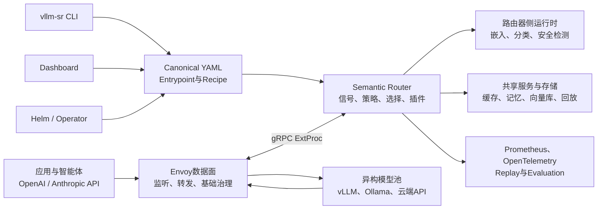
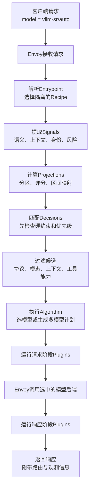

## 引言

[vLLM](https://github.com/vllm-project/vllm)、[SGLang](https://github.com/sgl-project/sglang)和[TensorRT-LLM](https://github.com/NVIDIA/TensorRT-LLM)等推理引擎解决了“怎样更高效地运行一个模型”的问题。它们通过连续批处理、分页式`KV Cache`、量化和并行计算等技术，让单个模型服务获得更高吞吐和更低延迟。

但当生产环境里同时存在小模型、大模型、推理模型、多模态模型、自建模型和云端模型时，问题会变成：**这一条请求应该交给哪个模型，以及在调用模型前后还应执行哪些能力？**

传统负载均衡器擅长在一组等价副本之间分流，却不知道“解释一个名词”和“证明一个数学定理”对模型能力的要求不同；应用代码虽然知道业务语义，却不应该长期维护模型地址、价格、上下文长度、安全边界和降级顺序。两者之间缺少一个能理解请求、执行策略并选择模型路径的共享决策层。

`vLLM Semantic Router`正是为这个问题而设计的。它不是另一个推理引擎，而是位于客户端、网关与模型后端之间的**语义路由和控制层**。


### 一个在线客服的例子

假设一家电商同时运行四种模型：

| 模型 | 特点 | 适合处理 |
| :---: | --- | --- |
| **小模型** | 便宜、响应快 | “订单在哪里”之类的简单问题 |
| **大模型** | 推理能力强，但更慢、更贵 | 复杂售后分析和规则解释 |
| **本地模型** | 数据不离开企业内网 | 包含姓名、电话和订单号的请求 |
| **多模态模型** | 能读取图片 | 用户上传的商品破损照片 |

如果客服应用永远调用大模型，简单问题也会付出较高成本；永远调用小模型，又可能答不好复杂问题。更麻烦的是，包含个人信息的请求不能随意发往云端，图片请求也不能交给只懂文字的模型。

可以把`vLLM Semantic Router`想成客服中心的“智能分诊台”：它先看请求有什么特征，再检查公司政策，最后把请求交给合适的处理通道。应用仍然只调用一个统一地址，不需要知道每个模型的真实地址。


这个例子展示了语义路由的基本思路：先识别请求的内容和特征，再根据成本、能力与安全要求筛选可用模型，最后把请求送往合适的处理通道。后文会沿着这条主线，逐步说明系统如何完成这些工作。

### 阅读前先认识几个词

| 术语 | 通俗解释 |
| --- | --- |
| **请求（`Request`）** | 应用发给模型的一次任务，通常包含用户问题、历史消息和生成参数 |
| **提示词（`Prompt`）** | 模型本次需要阅读的文字或多模态输入 |
| **推理（`Inference`）** | 已训练好的模型根据输入生成答案的过程，不是重新训练模型 |
| **模型后端（`Backend`）** | 真正加载模型并提供接口的服务，例如一个运行中的`vLLM`实例 |
| **模型池（`Model Pool`）** | 路由器可以选择的一组模型或模型服务 |
| **`Token`** | 模型处理文本时使用的基本片段；输入和输出越长，通常消耗越多 |
| **`TTFT`** | 从发出请求到收到第一个输出`Token`的等待时间 |
| **上下文窗口** | 模型一次能够读取的最大内容范围 |
| **语义路由** | 不只看服务器负载，还根据请求含义和策略选择处理路径 |

## 从推理服务的痛点说起


### 不存在适合所有请求的唯一模型

生产流量通常是混合的：闲聊、摘要、代码生成、复杂推理、图像理解和安全敏感请求同时存在。模型在质量、延迟、价格、上下文长度、语言、模态、工具调用和部署位置上各有优势。

如果所有请求都使用能力最强的模型，简单问题会消耗不必要的推理时间和费用；如果所有请求都使用小模型，复杂任务的正确率、指令遵循和工具调用能力又可能不够。固定模型只能在某个平均工作负载上做妥协，无法为每条请求选择更合适的能力等级。

“是否启用推理模式”也存在类似问题。项目论文[《When to Reason：Semantic Router for vLLM》](https://arxiv.org/abs/2510.08731)指出，推理模式能够提高部分任务的准确率，但会增加响应延迟和输出`Token`。论文实验中，按请求判断是否需要推理，相比直接使用`vLLM`推理，在`MMLU-Pro`上提高了`10.2`个百分点的准确率，同时将延迟和`Token`消耗分别降低`47.1%`和`48.5%`。这些数字来自该论文的特定模型、数据集和实验设置，不能直接视为任意生产环境的收益，但它说明了按工作负载选择执行路径的价值。

### 约束与优化目标互相冲突

一次路由往往同时面对两类条件：

- **硬约束**：授权、数据驻留、隐私、输入模态、上下文容量、工具兼容性等，不满足时必须排除候选模型；
- **软目标**：质量、首`Token`延迟（`TTFT`）、每输出`Token`时间（`TPOT`）、价格和负载等，需要在合法候选中继续权衡。

如果直接把所有因素塞进一个加权分数，低成本或低延迟可能意外“抵消”隐私要求。更合理的顺序是先用策略淘汰不允许的路径，再在剩余候选中优化质量、延迟和成本。

仍以客服为例：用户要求“订单信息只能在内网处理”是不能妥协的硬约束；在两个都位于内网的模型之间选择更快或更便宜的一个，才是软目标。正确顺序是**先排除不合规模型，再比较合规模型**。

### 普通负载均衡看不懂请求

传统负载均衡主要解决“怎样把请求分得更均匀”：轮询会按顺序把请求依次发送给各个服务，最少连接或最少请求则优先选择当前更空闲的服务。这些方法适合多个服务都运行同一个模型的场景，因为请求交给其中任何一个，获得的处理能力都差不多。这些运行相同模型、提供相同能力的服务实例通常称为“副本”。异构模型池却不是这样：一个后端可能是本地`8B`模型，另一个可能是云端推理模型，第三个只能处理图像。

基础设施调度器可以知道副本是否健康、队列是否拥塞，却通常不知道提示词属于法律、代码还是闲聊，也不知道用户明确要求“只能在本地处理”。语义分类器又只理解内容，不应该越过授权和数据边界。推理服务需要把**工作负载语义、业务策略与运行状态**组合起来，而不是让其中任一项独自决定最终路径。

### 模型选择逻辑侵入应用代码

缺少统一路由层时，应用很容易出现下面的条件分支：

```python
if contains_image(request):
    call(vision_model)
elif contains_sensitive_data(request):
    call(local_model)
elif looks_complex(request):
    call(frontier_model)
else:
    call(cheap_model)
```

随着业务增长，这段逻辑还会加入重试、缓存、`RAG`、工具过滤、系统提示词、供应商鉴权和降级规则。多个应用会复制相似代码；模型升级或策略调整则需要重新发布所有客户端。更麻烦的是，这些分支通常缺少统一的解释、评测和审计机制。

### 安全、缓存和上下文处理被重复实现

不同请求需要不同的附加能力。例如：

- 隐私请求应路由到本地模型，并避免进入外部存储；
- 高风险请求需要越狱检测、响应检查或事实核验；
- 高频问答适合精确缓存或语义缓存；
- 长对话可能需要上下文压缩和长期记忆；
- 智能体请求可能只应暴露与任务相关的工具。

如果这些能力散落在各应用的中间件中，执行顺序、租户隔离和数据保留策略很难保持一致。路由不只是“选模型”，还需要把请求前处理、执行和响应后处理组织成可审查的策略。

### 多模型协作与反馈闭环难以工程化

有些任务适合直接选择一个模型，有些任务则适合逐级升级、并行征询、验证后重试或多轮综合。把这些流程隐藏在应用重试代码中，会导致调用次数、超时和成本边界不清晰。

此外，路由策略不能只靠直觉。团队需要知道某类请求为什么进入某条路径、最终选了哪个模型、花费多少、用户是否满意，并用回放和评测验证新策略。没有统一观测数据，所谓“智能路由”很容易成为不可解释的黑盒。

## `vLLM Semantic Router`是什么

`vLLM Semantic Router`是`vLLM`项目下采用[Apache-2.0许可证](https://github.com/vllm-project/semantic-router/blob/main/LICENSE)的开源项目。[官方介绍](https://vllm-sr.ai/docs/intro/)将其定义为构建`Mixture-of-Models`（`MoM`，混合模型）系统的可编程路由与控制层：应用继续调用稳定的`OpenAI`或`Anthropic`兼容接口，路由器根据请求信号、用户偏好、应用策略与运行信息，选择或组合合适的模型路径。

这里的“模型路径”不只是一个模型名称，还可以包含检索、记忆、工具筛选、缓存、安全检查、事实核验、级联调用或多模型协作。

### 它与其他组件的边界

| 组件 | 主要职责 | 不负责的事情 |
| --- | --- | --- |
| `vLLM`等推理引擎 | 加载权重并执行`Prefill`与`Decode` | 不决定业务请求应使用哪个模型类别 |
| `Envoy`或`API Gateway` | 接入、转发、鉴权和基础流量治理 | 默认不理解提示词语义与模型能力差异 |
| `Kubernetes`调度器 | 部署、扩缩容和恢复模型副本 | 不执行请求级语义策略 |
| `vLLM Semantic Router` | 理解请求、执行策略、选择或编排模型路径 | 不加载业务模型权重，也不替代副本调度器 |

因此，一个完整系统可以先由`vLLM Semantic Router`选择“代码模型”或“推理模型”，再由下游网关或推理平台在该模型的健康副本之间做负载均衡。

### 核心特点


1. **语义与策略共同驱动**：既支持关键词、上下文长度和元数据等显式规则，也支持领域、复杂度、偏好、`PII`和越狱检测等模型或相似度信号。
2. **先约束、后优化**：通过`Decision`表达路由资格，再由`Algorithm`在合法候选中按静态顺序、语义匹配、延迟或多目标策略选模型。
3. **一个接口连接异构模型池**：后端可以是自建`vLLM`、`Ollama`、`Kubernetes`中的模型服务或兼容协议的云端提供商。
4. **选择与编排统一**：简单场景选择一个模型，复杂场景可使用有界的级联、评审、融合或工作流算法。
5. **按路由挂载能力**：缓存、`RAG`、记忆、上下文压缩、系统提示词、工具筛选和响应检查通过`Plugin`绑定到特定路由。
6. **策略可配置、可验证、可解释**：统一的`YAML`配置被`CLI`、`Dashboard`、`Helm`和`Operator`共同使用，路由结果可通过响应头、指标、追踪、回放和评测观察。
7. **协议与部署方式灵活**：[协议兼容性文档](https://vllm-sr.ai/docs/installation/protocol-compatibility/)列出了`OpenAI Chat Completions`、`OpenAI Responses`和`Anthropic Messages`之间的支持关系；[部署方式文档](https://vllm-sr.ai/docs/installation/deployment-options/)则覆盖本地`Docker`、`Kubernetes`、网关和推理平台集成。

## 架构设计

### 数据面与控制面


[官方系统概览](https://vllm-sr.ai/docs/overview/semantic-router-overview/)把整个系统分成数据面和控制面。初学者可以这样理解：

- **数据面**处理每一条真实请求，重点是快和稳定；
- **控制面**负责配置、验证和观察路由规则，重点是可管理和可审查。

`Envoy`和`Semantic Router`共同组成数据面，但分工不同：`Semantic Router`负责“理解请求并选择模型”，`Envoy`负责“接收请求并把它送到模型”。可以把前者看成给出分诊结果的工作人员，把后者看成真正负责引导和维持通道秩序的工作人员。



#### `Semantic Router`如何接入`Envoy`

两者通过[Envoy External Processing过滤器](https://www.envoyproxy.io/docs/envoy/latest/configuration/http/http_filters/ext_proc_filter)连接。`ExtProc`允许`Envoy`通过双向`gRPC`把请求头、请求体、响应头和响应体交给外部服务处理，再根据外部服务的回复继续转发、修改内容或直接返回结果。

在[项目生成的`Envoy`配置](https://github.com/vllm-project/semantic-router/blob/main/src/vllm-sr/cli/templates/envoy.template.yaml)中，这种集成主要包含三部分：

1. `envoy.filters.http.ext_proc`位于最终的`envoy.filters.http.router`之前，确保请求转发到模型前先经过语义路由；
2. `extproc_service`集群通过`gRPC`连接`Semantic Router`的`ExternalProcessor`服务；
3. 每个模型对应一个`Envoy`上游集群，集群中可以包含该模型的多个服务副本。

`vllm-sr serve`会根据规范化`YAML`生成这部分`Envoy`配置。也可以执行`vllm-sr config envoy --config config.yaml`查看生成结果，因此通常不需要手工维护一份独立的`envoy.yaml`。

#### 一条请求如何完成协作

[当前`ExtProc`处理器](https://github.com/vllm-project/semantic-router/blob/main/src/semantic-router/pkg/extproc/processor_core.go)按下面的顺序处理请求：

1. 客户端先把标准模型请求发送给`Envoy`，不需要感知`Semantic Router`的存在；
2. `Envoy`通过`ExtProc`把请求交给`Semantic Router`。路由器读取提示词，执行信号、决策、算法和插件，选出合适的模型；
3. [模型绑定逻辑](https://github.com/vllm-project/semantic-router/blob/main/src/semantic-router/pkg/extproc/processor_req_body_routing.go)把结果写入内部请求头`x-selected-model`，并通知`Envoy`重新匹配路由；
4. `Envoy`根据`x-selected-model`选择对应的模型集群，再在该集群的健康副本之间进行负载均衡；
5. 模型结果回到`Envoy`后，还可以再次经过`Semantic Router`完成协议转换、缓存写入、响应检查和观测记录，最后返回客户端。

如果缓存已经命中，或者安全策略要求直接拒绝请求，`Semantic Router`可以返回`ImmediateResponse`，让`Envoy`直接回复客户端，不再调用模型。对于流式回答，路由器也可以让`Envoy`以`STREAMED`模式继续传递响应，避免等待完整答案生成。

如果环境中已经有`Envoy Gateway`，只需在现有网关中配置`ExtProc`过滤器，使它指向`Semantic Router`的`gRPC`服务，并保证网关能够识别路由器写入的模型名称。不同网关集成中的鉴权、限流和后端管理职责，可参考[官方网关集成说明](https://vllm-sr.ai/docs/installation/k8s/gateways/)。

### 核心组件


`vLLM Semantic Router`包含以下组件：

| 组件 | 要解决的问题 | 核心作用 |
| --- | --- | --- |
| `Entrypoint` | 客户端不应绑定经常变化的物理模型 | 根据请求中的虚拟模型名找到对应的`Recipe` |
| `Recipe` | 不同业务的规则和状态需要相互隔离 | 封装一整套路由规则、插件及独立运行状态 |
| `Signal` | 路由规则需要先知道请求具有哪些特征 | 识别语义、模态、上下文、身份和风险等事实 |
| `Projection` | 多个信号可能重叠或难以直接比较 | 将多个信号整理成统一的分类、分数或区间 |
| `Decision` | 必须先满足隐私、能力和业务等约束 | 匹配业务规则，确定可用路线和候选模型 |
| `Algorithm` | 多个候选模型之间仍需作出最终选择 | 按质量、延迟或成本选出模型，或生成多模型计划 |
| `Plugin` | 模型调用前后还需要检索、缓存和安全检查 | 在处理流程中增强、改写、拦截或检查请求与响应 |
| `Provider Model` | 逻辑模型名需要落到可访问的真实服务 | 配置模型端点、协议、上游模型名、凭据和可靠性信息 |

这些组件各管一件事。例如，`Signal`只负责报告“请求中包含个人信息”，是否拒绝请求、隐藏信息或改用本地模型，则交给`Decision`与`Plugin`处理。这样更换检测方法时，不需要重写整套路由策略。

#### `Entrypoint`：根据公开名称找到处理方案

假设客服应用直接把`small-model-v1`写在每一次请求中。以后平台将它升级为`small-model-v2`时，网页、移动端和智能体都要跟着修改；如果不同应用还各自保存模型地址，迁移会更加麻烦。要避免这种耦合，平台需要提供一个长期稳定的公开名称，再在服务端决定这个名称采用哪套处理方案。

`Entrypoint`就是这个“稳定入口”。[Entrypoint与Recipe文档](https://vllm-sr.ai/docs/tutorials/global/entrypoints-and-recipes/)说明，它读取客户端请求中的`model`字段，把一个或多个公开模型名映射到某个`Recipe`。它只负责找到处理方案，并不直接选择最终模型。

例如，平台可以公开`vllm-sr/fast`和`vllm-sr/quality`两个名称。应用选择`vllm-sr/fast`，表示本次请求优先考虑响应速度；至于背后使用哪个小模型，可以由平台随时调整，应用不需要跟着修改模型地址。

如果客户端直接请求已公开的物理模型名，请求可以走直通路径。[虚拟模型文档](https://vllm-sr.ai/docs/tutorials/global/entrypoints-and-recipes/)说明，这种请求会绕过`Recipe`中的信号、决策、路由插件、缓存、学习和会话路由。因此，希望平台统一控制选模时，应让应用请求`Entrypoint`公开的虚拟名称。

#### `Recipe`：封装一套完整路由方案

假设同一个路由器既服务在线客服，又服务代码助手。客服请求需要检查订单隐私、检索商品知识库，代码请求则需要识别编程语言、处理长上下文。如果两类请求共用同一组规则、缓存和记忆，很容易出现规则互相干扰，甚至把一个业务的数据带到另一个业务中。系统因此需要把一整套路由规则和运行状态打包并隔离起来。

`Recipe`就是这样的“处理手册”。它包含一套配套的`Signal`、`Projection`、`Decision`、`Algorithm`和`Plugin`，既可以被多个入口复用，也是缓存、记忆和路由状态的隔离边界。

例如，同一套服务可以准备`customer-service`和`code-assistant`两个`Recipe`。前者关注订单隐私、知识库和客服模型，后者关注编程语言、长上下文和代码模型。两套方案可以共享底层模型端点，但各自的缓存、记忆和路由状态不会混在一起。

#### `Signal`：从请求中提取事实

假设用户发送“请根据这张破损照片处理订单`A123`”。在选择模型之前，系统至少要知道请求中包含图片、内容属于售后问题，还可能带有订单标识等隐私信息。后续规则不能每次都重新分析原始请求，因此需要先把这些特征提取成可以重复使用的事实。

`Signal`就是负责“观察请求”的组件。它读取提示词、请求元数据或会话信息，输出领域、难度、模态或风险等事实，供后面的`Projection`和`Decision`使用。[Signal文档](https://vllm-sr.ai/docs/tutorials/signal/overview/)列出的信号可以先简单分为两类：

| 类型 | 示例 | 适合识别的内容 |
| --- | --- | --- |
| **明确规则** | `keyword`、`metadata`、`context`、`language`、`structure` | 指定关键词、调用方身份、上下文长度和请求格式 |
| **模型或相似度判断** | `embedding`、`domain`、`complexity`、`preference`、`pii`、`jailbreak`、`safety` | 语义意图、任务难度、用户偏好和内容风险 |

在这个例子中，`Signal`只负责报告“包含图片”“属于售后”和“可能包含隐私信息”，还不会决定调用哪个模型。模型型信号可能误判，因此生产环境需要使用真实数据校准阈值。

#### `Projection`：把多个事实整理成一个结果

假设系统已经得到“提示词很长”“需要多步推理”和“需要事实核验”三个`Signal`。如果每个`Decision`都重新编写一遍组合公式，不同路线很容易算出互相矛盾的难度结果。系统需要先把多个事实统一汇总成一个可复用的分类或分数。

`Projection`就是位于`Signal`和`Decision`之间的汇总组件。[Projection文档](https://vllm-sr.ai/docs/tutorials/projection/overview/)定义了三种常见处理方式：

- `partition`从多个匹配结果中得到一个一致分类；
- `score`把多个输入组合成一个分数；
- `mapping`把连续分数转换为“简单”“中等”“困难”等区间。

例如，可以把“提示词长度”“是否需要证明”和“是否需要事实核验”组合成一个任务难度分数，再把它映射为“简单”或“复杂”。后面的多个`Decision`都可以复用这个结果，不必分别重复计算。只有一个信号就足以判断时，可以直接跳过`Projection`。

#### `Decision`：按照规则确定哪些模型可以用

假设一条请求既包含商品图片，又包含姓名和订单号。多模态云模型能够看图，但公司规定个人信息只能在内网处理。此时系统不能简单选择能力最强或速度最快的模型，而要先执行隐私、模态和业务优先级等规则，确定哪些路线有资格继续参与。

`Decision`就是负责执行这些路由政策的组件。它接收`Signal`或`Projection`的结果，通过`AND`、`OR`和`NOT`等条件判断路线是否匹配，并给出候选模型名单。[Decision文档](https://vllm-sr.ai/docs/tutorials/decision/overview/)还允许它声明优先级、后续使用的算法和需要运行的插件。

在这个例子中，“包含图片”要求候选模型支持多模态，“包含个人信息并要求本地处理”又把范围缩小到内网多模态模型。即使云端模型更快、更便宜，也会在这一阶段被排除。无条件的默认`Decision`可以作为兜底，处理没有命中其他规则的请求。

#### `Algorithm`：从合格模型中选择或组织调用

假设`Decision`筛选后还剩两个合规的本地模型：一个响应快、成本低，另一个回答质量更高。候选名单只能说明“它们都可以用”，还不能决定本次究竟选择哪一个；某些复杂任务甚至需要让多个模型依次回答和复核。系统因此还需要一个负责最终选择或组织调用的组件。

`Algorithm`就是这个选择器或编排器。它只处理已经通过`Decision`筛选的候选模型，不会把被隐私或能力规则排除的模型重新加回来。[Algorithm文档](https://vllm-sr.ai/docs/tutorials/algorithm/overview/)将常见算法分为两类：

| 类别 | 代表算法 | 实际作用 |
| --- | --- | --- |
| **单模型选择** | `static`、`latency_aware`、`multi_factor`、`hybrid` | 按固定顺序、延迟、质量或成本选择一个模型 |
| **多模型编排** | `confidence`、`ratings`、`remom`、`fusion`、`workflows` | 级联调用、并行评审或组合多个模型的结果 |

例如，两个本地模型都满足隐私要求时，`latency_aware`可以选择最近响应更快的一个；高风险回答也可以先由一个模型生成，再由另一个模型复核。[multi_factor文档](https://vllm-sr.ai/docs/tutorials/algorithm/selection/multi-factor/)和[latency_aware文档](https://vllm-sr.ai/docs/tutorials/algorithm/selection/latency-aware/)指出，延迟与负载数据是单个路由器进程的本地观测，不能代替集群级调度信息。实验性算法应先使用目标流量评测，再投入生产。

#### `Plugin`：在路由过程中增加附加能力

假设路由器已经选出客服模型，但模型还需要读取最新退货政策才能回答；对于重复出现的商品问题，系统又希望直接复用缓存；模型生成答案后，还要检查内容是否安全。这些工作都发生在选模前后，却不属于“选择哪个模型”，如果分别写进每个应用就会产生大量重复代码。

`Plugin`就是挂在路线上的附加处理步骤。[Plugin文档](https://vllm-sr.ai/docs/tutorials/plugin/overview/)说明，它可以在调用模型前改写或增强请求，也可以直接返回结果，或者在模型回答后进行检查。

| 处理阶段 | 典型插件 | 具体作用 |
| --- | --- | --- |
| **请求准备** | `system_prompt`、`request_params`、`tools` | 注入系统提示词、限制生成参数或筛选工具 |
| **上下文增强** | `rag`、`memory`、`context_compression` | 检索资料、加载记忆或压缩过长上下文 |
| **快速返回** | `fast_response`、`response_cache` | 直接拒绝请求或复用已有答案，不再调用模型 |
| **响应处理** | `hallucination`、`response_jailbreak` | 检查事实支持和回答安全性 |
| **观测** | `router_replay`、`shadow_dispatch` | 保存路由过程或将少量流量发送给影子模型 |

例如，普通商品问答可以先查`response_cache`，命中后直接返回；未命中时，再由`rag`检索商品资料并放入提示词。订单查询可能包含个人信息，不应在没有租户隔离和保留策略时共享缓存。[Response Cache文档](https://vllm-sr.ai/docs/tutorials/plugin/response-cache/)详细说明了作用域、有效期和安全边界。

#### `Provider Model`：把逻辑模型连接到真实后端

假设`Algorithm`最终选择了`local-small`。这个名称只代表路由策略中的逻辑模型，`Envoy`还不知道它运行在哪个地址、使用什么协议、上游接受什么模型名，也不知道是否有多个副本。要真正发出请求，系统需要把逻辑选择转换成可连接的后端信息。

`Provider Model`就是逻辑模型与真实服务之间的连接层。[模型配置文档](https://vllm-sr.ai/docs/installation/model-configuration/)中的`providers.models`为每个逻辑模型定义后端地址、协议、上游使用的模型名称，以及可选的凭据、价格和可靠性设置。

例如，`local-small`可以指向内网中的`vLLM`服务，`cloud-reasoning`可以指向云端兼容接口。一个逻辑模型还可以配置多个语义一致的`backend_refs`作为副本：`Semantic Router`选择`local-small`，`Envoy`再从它的健康副本中挑选一个。不同模型或不同协议的服务不应伪装成同一组副本，而应配置成不同逻辑模型供`Decision`选择。

模型卡还可以声明上下文窗口、模态、工具和推理能力。路由器会在运行算法前过滤不具备所需能力的候选；模型副本的部署、扩缩容和`GPU`调度仍由`vLLM`、`Kubernetes`或其他推理平台负责。

### 一次请求的处理流程



以“分析损坏商品照片”为例：`Entrypoint`先找到客服`Recipe`，`Signal`识别图片和售后意图，`Decision`只保留支持图像的模型，`Algorithm`从中选出一个，`Plugin`补充商品资料，最后由`Provider Model`找到真实地址并交给`Envoy`调用。

初次阅读时，记住这条缩短后的链路即可：**公开模型名找到处理方案，信号描述事实，决策生成合格名单，算法选择模型，插件完成附加处理。**


## 安装与启动

### 环境要求

[官方Quickstart](https://vllm-sr.ai/docs/installation/)给出的本地快速体验要求包括：

- `Linux`、`macOS`或`WSL2`；
- `Python 3.10`或更高版本；
- `Docker`，`Linux`也可以使用`Podman`。

[部署方式文档](https://vllm-sr.ai/docs/installation/deployment-options/)建议默认让路由器运行在`CPU`上，只有本地嵌入或分类模型经过测量确实能从加速中获益时，才有必要为它分配`GPU`。该文档也明确指出，`vllm-sr serve`启动的是路由栈，不会自动启动自定义配置中引用的业务模型后端。

### 安装`CLI`

安装稳定版：

```bash
curl -fsSL https://vllm-sr.ai/install.sh | bash -s -- --channel stable
```

也可以安装`PyPI`包：

```bash
python -m venv .venv
source .venv/bin/activate
pip install vllm-sr
vllm-sr --version
```

### 启动本地路由栈

```bash
vllm-sr serve
```

首次启动可以打开`http://localhost:8700`，通过`Dashboard`连接已有模型端点并激活生成的配置。默认端口如下：

| 地址 | 用途 |
| --- | --- |
| `http://localhost:8700` | `Dashboard` |
| `http://localhost:8899` | 对应用暴露的推理接口 |
| `http://localhost:8080` | 路由器管理接口 |

常用运维命令：

```bash
vllm-sr status
vllm-sr logs router
vllm-sr logs envoy -f
vllm-sr dashboard
vllm-sr stop
```

如果只需要`Router`与`Envoy`，可以使用`vllm-sr serve --minimal`；若希望保留只读`Dashboard`，可以添加`--readonly`。

## 配置详解

### 顶层结构

[配置文档](https://vllm-sr.ai/docs/installation/configuration/)给出的规范化`v0.3 YAML`使用以下顶层结构：

```yaml
version:
listeners:
providers:
evaluation:
routing:
entrypoints:
recipes:
global:
```

| 配置段 | 主要内容 |
| --- | --- |
| `version` | 配置契约版本，当前为`v0.3` |
| `listeners` | 对外监听地址、端口、超时和可选访问凭据 |
| `providers` | 模型端点、协议、价格、可靠性与默认模型 |
| `evaluation` | 基准定义、指标索引和模型评测记录 |
| `routing` | 默认`Recipe`的模型卡、信号、投影、决策和插件 |
| `entrypoints` | 公共虚拟模型名到命名`Recipe`的映射 |
| `recipes` | 额外的隔离路由策略 |
| `global` | 共享运行时、存储、服务、观测和学习设置 |

不要从网络文章中猜测字段名。[配置契约文档](https://vllm-sr.ai/docs/installation/configuration-contract/)说明，可以通过`CLI`渐进式查询目标版本的真实字段和可用路由组件：

```bash
vllm-sr config schema
vllm-sr config schema --section routing --expanded
vllm-sr config schema --surface signal:keyword
vllm-sr config schema --surface algorithm:multi_factor
```

### 示例：两个模型之间按请求内容路由

下面的完整示例假设已经有两个兼容`OpenAI API`的模型服务：`fast-model`监听宿主机`8000`端口，`reasoning-model`监听`8001`端口。由于路由器运行在容器中，[Docker部署文档](https://vllm-sr.ai/docs/installation/docker/)建议使用`host.docker.internal`访问宿主机。

阅读这段配置时先不要逐行记忆，只看五步：**开放端口 → 登记模型 → 识别复杂请求 → 选择推理模型 → 其他请求走快速模型**。

```yaml
version: v0.3

listeners:
  - name: http-8899
    address: 127.0.0.1
    port: 8899
    timeout: 300s

providers:
  defaults:
    model: fast-model
  models:
    - name: fast-model
      provider_model_id: fast-model
      api_format: openai
      backend_refs:
        - name: fast-primary
          provider: vllm
          endpoint: host.docker.internal:8000
          protocol: http
    - name: reasoning-model
      provider_model_id: reasoning-model
      api_format: openai
      backend_refs:
        - name: reasoning-primary
          provider: vllm
          endpoint: host.docker.internal:8001
          protocol: http

routing:
  strategy: priority
  signals:
    keywords:
      - name: complex-task
        operator: OR
        method: bm25
        keywords:
          - prove
          - derive
          - architecture trade-off
          - root cause analysis
          - 证明
          - 推导
          - 架构权衡
          - 根因分析
        bm25_threshold: 0.1
        case_sensitive: false
  decisions:
    - name: reasoning-route
      description: Use the reasoning model for complex tasks.
      priority: 100
      rules:
        operator: AND
        conditions:
          - type: keyword
            name: complex-task
      modelRefs:
        - model: reasoning-model
    - name: default-route
      description: Use the fast model for all remaining requests.
      priority: 0
      rules:
        operator: AND
        conditions: []
      modelRefs:
        - model: fast-model
```

这段配置实际完成了以下工作：

1. `listeners`让路由接口只在宿主机`8899`端口监听；
2. `providers.models`登记两个已经运行的模型后端；
3. `complex-task`使用`BM25`关键词相关性识别“证明、推导、架构权衡、根因分析”等请求；
4. 命中后，优先级为`100`的`reasoning-route`选择`reasoning-model`；
5. 没有命中时，无条件的`default-route`选择`fast-model`。

`BM25`可以先理解为一种关键词相关性评分：不要求整句完全相同，而是根据关键词在文本中的出现情况计算匹配程度。这个示例只用一种信号，目的是讲清配置链路。生产场景可以再加入领域、复杂度、嵌入相似度、上下文长度和业务元数据，但关键词不能代替授权或隐私边界。

先校验配置，再启动：

```bash
vllm-sr config validate --config config.yaml
vllm-sr serve --config config.yaml
```

### 示例：先预览路由，不调用模型

[CLI文档](https://vllm-sr.ai/docs/api/cli/)中的`route preview`通过管理接口执行信号、决策、算法和插件匹配，但不会调用最终模型，适合在产生推理费用前检查策略：

```bash
vllm-sr route preview \
  --prompt "请从第一性原理分析这个分布式系统的架构权衡" \
  --json
```

预期结果应显示`complex-task`信号和`reasoning-route`决策。如果管理接口不在默认`http://localhost:8080`，可以使用`--endpoint`指定地址。

### 示例：发送真实请求

可以使用`CLI`：

```bash
vllm-sr request chat \
  --model vllm-sr/auto \
  --json \
  "请比较两种缓存失效策略"
```

也可以调用兼容`OpenAI`的接口，并开启一次请求的调试响应头：

```bash
curl http://localhost:8899/v1/chat/completions \
  -H 'Content-Type: application/json' \
  -H 'x-vsr-debug: true' \
  -d '{
    "model": "vllm-sr/auto",
    "messages": [
      {"role": "user", "content": "请证明这个算法的时间复杂度上界"}
    ]
  }'
```

检查响应头中的`x-vsr-selected-decision`与`x-vsr-selected-model`，可以确认请求实际走了哪条策略和哪个逻辑模型。

### 示例：为某条路由增加多目标选择

下面是进阶用法，第一次阅读可以先跳过。当一个决策拥有多个合法候选时，可以让`multi_factor`在质量、延迟、成本和负载之间做权衡。下面是应合并到完整配置中的片段：

```yaml
routing:
  decisions:
    - name: balanced-code-route
      description: Balance quality, latency, cost, and load for code tasks.
      priority: 100
      rules:
        operator: AND
        conditions:
          - type: keyword
            name: code-task
      modelRefs:
        - model: code-small
        - model: code-large
      algorithm:
        type: multi_factor
        minimum_candidates: 2
        multi_factor:
          objective:
            strategy: weighted
          quality:
            index: acme/coding-quality@1.0.0
            on_missing: exclude
            min_coverage: 1.0
          weights:
            quality: 0.5
            latency: 0.2
            cost: 0.2
            load: 0.1
          on_no_candidates: fail
```

这里的质量索引`acme/coding-quality@1.0.0`只是组织自定义索引的示例，必须在`evaluation`中提供真实定义和模型测量结果。缺少质量证据时使用`exclude`，以及没有候选时使用`fail`，可以避免系统静默选择不满足要求的模型。

### 示例：虚拟模型对应不同目标

一个部署可以通过`Entrypoint`暴露多个稳定名称。下面只是`entrypoints`与`recipes`片段，需要与前文的`providers`等配置合并：

```yaml
entrypoints:
  - model_names: [vllm-sr/mom-v1-flash]
    recipe: flash
  - model_names: [vllm-sr/mom-v1-ultra]
    recipe: ultra

recipes:
  - name: flash
    description: Prefer the low-latency model.
    routing:
      decisions:
        - name: fast-path
          priority: 100
          rules: {operator: AND, conditions: []}
          modelRefs: [{model: fast-model}]
  - name: ultra
    description: Prefer the high-quality model.
    routing:
      decisions:
        - name: quality-path
          priority: 100
          rules: {operator: AND, conditions: []}
          modelRefs: [{model: reasoning-model}]
```

应用可以选择“低延迟”或“高质量”目标，却不需要知道目标背后的具体模型地址。切换模型、增加插件或调整策略时，公共名称不变。


## 参考资料

1. [vLLM Semantic Router GitHub仓库](https://github.com/vllm-project/semantic-router)
2. [vLLM Semantic Router官方文档：Introduction](https://vllm-sr.ai/docs/intro/)
3. [vLLM Semantic Router官方文档：System Overview](https://vllm-sr.ai/docs/overview/semantic-router-overview/)
4. [vLLM Semantic Router官方文档：Routing Pipeline](https://vllm-sr.ai/docs/overview/signal-driven-decisions/)
5. [vLLM Semantic Router官方文档：Quickstart](https://vllm-sr.ai/docs/installation/)
6. [vLLM Semantic Router v0.3 Themis发布说明](https://vllm.ai/blog/2026-06-05-v0.3-vllm-sr-themis-release)
7. [vLLM Semantic Router：Next Phase in LLM Inference](https://blog.vllm.ai/2025/09/11/semantic-router.html)
8. [When to Reason：Semantic Router for vLLM](https://arxiv.org/abs/2510.08731)
9. [Category-Aware Semantic Caching for Heterogeneous LLM Workloads](https://arxiv.org/abs/2510.26835)
