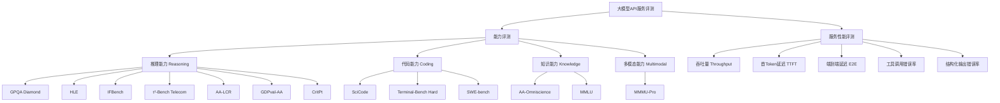
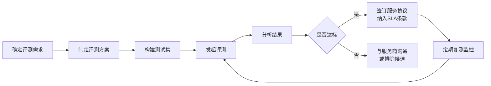

## 背景与评测目标

在企业向外采购大模型`API`服务时，面对来自不同服务商的`Claude Opus 4.7`、`GPT-5.5`、`GLM-5.1`、`DeepSeek V4`、`MiMo-V2.5-Pro`等主流模型，仅凭服务商的宣传资料难以客观判断模型的真实能力。评测的核心目标包括：

- **能力验证**：独立确认各服务商提供的模型在推理、代码、知识等核心维度上是否达到官方宣称的水平
- **横向对比**：在统一标准下，对同类模型进行客观排名，支持选型决策
- **防范注水**：识别服务商是否使用规格低于宣称的模型，或对评测题库进行针对性训练（"作弊"）
- **持续监控**：在服务合同期内定期复测，确保服务质量不退化

## 评测体系总览

业内主流的模型评测体系以`OpenRouter`和`Artificial Analysis`平台所使用的方案为代表，将模型能力分为三个核心维度，并叠加服务性能指标：



`Artificial Analysis Intelligence Index v4.0`是目前业内认可度较高的综合智能指数，由以下`10`项评测组成：`GDPval-AA`、`τ²-Bench Telecom`、`Terminal-Bench Hard`、`SciCode`、`AA-LCR`、`AA-Omniscience`、`IFBench`、`HLE`、`GPQA Diamond`、`CritPt`。

## 推理能力（Reasoning）评测

推理能力是衡量模型处理复杂问题、逻辑推断和科学分析能力的核心维度，也是区分顶级模型与普通模型最关键的指标。

### GPQA Diamond

| 属性 | 说明 |
|------|------|
| **全称** | `Graduate-Level Google-Proof Q&A Diamond` |
| **测试对象** | 研究生水平的科学推理（物理、化学、生物） |
| **题目特点** | 题目需要研究生级专业知识，普通搜索引擎无法直接找到答案 |
| **评分方式** | 多选题正确率（%） |
| **参考基准** | 人类专家约`65%`，顶级模型约`90%+` |

`GPQA Diamond`是`GPQA`数据集中难度最高的子集，题目由领域专家设计，并经过多轮交叉验证，确保无法通过检索或记忆直接作答。该基准重点考察模型的**跨学科复杂推理**能力，是目前区分顶级推理模型与普通模型最有效的指标之一。

测试时应注意：所有题目应通过`API`以标准`few-shot`方式提交，避免在`system prompt`中提示答案范围。

### HLE（Humanity's Last Exam）

| 属性 | 说明 |
|------|------|
| **全称** | `Humanity's Last Exam` |
| **测试对象** | 人类知识极限范围内的多领域终极考试 |
| **题目特点** | 来自数学奥林匹克、物理竞赛、法律专业考试等极端困难题目 |
| **评分方式** | 正确率（%） |
| **参考基准** | 顶级模型约`30%`~`40%`，人类专家约`50%+` |

`HLE`由`Scale AI`与多所顶级大学联合构建，代表了当前`AI`评测中难度最高的基准之一。该测试用于识别模型的**能力天花板**，分数较低（如`30%`~`40%`）并不代表失败，而是正常区间。

### IFBench（指令遵循基准）

| 属性 | 说明 |
|------|------|
| **全称** | `Instruction Following Benchmark` |
| **测试对象** | 模型对复杂多约束指令的遵循能力 |
| **题目特点** | 包含格式要求、字数限制、语言约束、内容排除等多维度约束 |
| **评分方式** | 约束满足率（%） |
| **参考基准** | 顶级模型约`55%`~`65%` |

在实际业务场景中，模型是否严格遵循指令（如输出格式、字段要求）直接影响下游系统的可靠性。`IFBench`专门测量这一能力，评分越高，表示模型在**结构化输出和复杂指令遵循**上越可靠。

### τ²-Bench Telecom（对话代理基准）

| 属性 | 说明 |
|------|------|
| **全称** | `τ²-Bench Telecom` |
| **测试对象** | 双控场景（用户+系统工具）下的对话式AI代理能力 |
| **题目特点** | 模型需同时扮演用户代理和系统代理完成业务流程 |
| **评分方式** | 任务成功率（%） |
| **参考基准** | 顶级模型约`85%`+ |

该基准模拟真实业务系统中`AI`代理需要在多轮对话中维持状态、调用工具并完成端到端任务的场景，对企业智能客服、流程自动化等应用场景有很高的参考价值。

### AA-LCR（长上下文推理）

| 属性 | 说明 |
|------|------|
| **全称** | `Artificial Analysis Long Context Reasoning` |
| **测试对象** | 超长上下文窗口内的信息检索与推理能力 |
| **题目特点** | 在数万至百万`Token`的上下文中进行多步推理 |
| **评分方式** | 正确率（%） |
| **参考基准** | 顶级模型约`65%`~`75%` |

随着`RAG`（检索增强生成）和长文档分析场景的普及，模型在超长上下文中的**信息保持与推理能力**成为关键指标。`AA-LCR`专门评测这一维度，结果直接影响文档理解、代码库分析等长上下文业务的效果。

### GDPval-AA（经济价值任务）

| 属性 | 说明 |
|------|------|
| **全称** | `GDP-valued Agentic Tasks by Artificial Analysis` |
| **测试对象** | 具有实际经济价值的复杂工作任务 |
| **题目特点** | 模拟真实职场中的数据分析、报告撰写、决策辅助等任务 |
| **评分方式** | `ELO`评分归一化，0~100 |
| **参考基准** | 顶级模型约`60%`+ |

该基准将任务难度与现实经济价值挂钩，聚焦于**能够替代人类专业工作的任务完成度**，是评估模型在实际生产环境中创造价值能力的重要指标。

### CritPt（物理推理）

| 属性 | 说明 |
|------|------|
| **全称** | `Critical Points（Physics Reasoning）` |
| **测试对象** | 研究级物理推理与数学计算 |
| **题目特点** | 涉及量子力学、统计力学、场论等前沿物理问题 |
| **评分方式** | 正确率（%） |
| **参考基准** | 顶级模型约`10%`~`20%`，属于极难基准 |

`CritPt`代表当前`AI`模型的能力前沿，主要用于区分顶级推理模型之间的细微差距，分数普遍偏低（约`10%`~`20%`）是正常现象。

## 代码能力（Coding）评测

代码能力评测不仅考察模型能否写出语法正确的代码，更重要的是验证模型能否完成实际工程任务中的代码编写、调试和优化工作。

### SciCode（科学计算编程）

| 属性 | 说明 |
|------|------|
| **全称** | `SciCode` |
| **测试对象** | 面向科学计算场景的`Python`编程能力 |
| **题目特点** | 要求模型编写能够运行并通过测试的科学计算代码（数值分析、统计等） |
| **评分方式** | 代码通过率（%） |
| **参考基准** | 顶级模型约`50%`~`60%` |

`SciCode`要求模型生成的代码不仅语法正确，还需要在实际运行环境中输出正确的数值结果。这使其比传统代码生成基准更接近真实的科学研究和数据分析场景。

### Terminal-Bench Hard（终端代理编程）

| 属性 | 说明 |
|------|------|
| **全称** | `Terminal-Bench Hard` |
| **测试对象** | 在真实终端环境中进行代理式编程与调试 |
| **题目特点** | 模型需通过命令行完成多步骤的文件操作、代码编写、运行调试全流程 |
| **评分方式** | 任务完成率（%） |
| **参考基准** | 顶级模型约`45%`~`55%` |

与传统代码补全不同，`Terminal-Bench Hard`测试的是模型作为**自主编程代理**，在真实`Shell`环境中独立完成端到端任务的能力，直接对应`AI`编程助手、`DevOps`自动化等业务场景。

### SWE-bench（软件工程基准）

| 属性 | 说明 |
|------|------|
| **全称** | `Software Engineering Benchmark` |
| **测试对象** | 真实`GitHub`仓库中的`Issue`修复 |
| **题目特点** | 从真实开源项目中采集`Bug`报告，要求模型提交能通过测试的`PR` |
| **评分方式** | 任务解决率（%），分`Verified`和`Full`两个版本 |
| **参考基准** | 顶级模型`SWE-bench Verified`约`70%`~`75%` |

`SWE-bench`是当前最具代表性的真实软件工程能力评测基准，其`Verified`版本经过人工验证，更加可靠。该指标直接反映模型在企业代码库中**理解上下文、定位问题、编写修复代码**的综合能力。

## 知识能力（Knowledge）评测

知识能力评测的核心不只是"知道多少"，更重要的是在不确定时**能否诚实地拒答**，而非编造错误信息（即控制幻觉率）。

### AA-Omniscience（知识准确率与幻觉率）

| 指标 | 说明 | 参考基准 |
|------|------|----------|
| `AA-Omniscience Accuracy` | 问题的正确回答比例 | 顶级模型约`45%`~`50%` |
| `AA-Omniscience Non-Hallucination Rate` | 在未能正确作答时，拒绝回答或明确表示不确定的比例 | 顶级模型约`60%`~`70%` |

`AA-Omniscience`是`Artificial Analysis`开发的知识评测套件，同时关注**知识覆盖广度**和**幻觉控制能力**两个维度。在企业场景中，幻觉率往往比准确率更关键，因为一个编造错误信息的模型比一个直接说"不知道"的模型危害更大。

### MMLU（大规模多任务语言理解）

| 属性 | 说明 |
|------|------|
| **全称** | `Massive Multitask Language Understanding` |
| **测试范围** | 涵盖`57`个学科，包括数学、历史、法律、医学等 |
| **评分方式** | 四选一多选题正确率（%） |
| **参考基准** | 顶级模型约`88%`~`92%` |

`MMLU`是历史最悠久、引用最广泛的知识类基准之一，覆盖面广，适合快速了解模型的通识知识水平。但由于其题库已较为公开，存在一定的数据污染风险，建议与其他基准联合使用。

## 多模态能力评测

对于需要图像生成、图像分析、视觉理解等功能的业务场景，还需纳入以下多模态评测指标：

| 基准名称 | 测试对象 | 评分方式 | 参考基准 |
|----------|----------|----------|----------|
| `MMMU-Pro` | 多学科图文联合推理（视觉推理） | 正确率（%） | 顶级多模态模型约`75%`~`82%` |
| `MMBench` | 多维度视觉理解能力（感知、推理等） | 正确率（%） | 顶级多模态模型约`80%`+ |
| `GenAI-Bench` | 图像生成质量（文本对齐度、美观度） | 人工评分/`FID`分数 | 依场景而定 |
| `VQAv2` | 视觉问答准确率 | 正确率（%） | 顶级模型约`80%`+ |

对于**图像生成**质量的评测，建议采用 **人工盲测（Human Blind Test）** 方式：将不同服务商生成的图像打乱顺序，由业务评审人员在不知晓来源的情况下评分，可有效避免品牌偏见。

## 服务性能指标

能力基准之外，`API`服务的**服务性能**同样关键，直接影响实际业务的可用性和用户体验。

| 指标 | 说明 | 计量单位 | 目标参考 |
|------|------|----------|----------|
| 吞吐量（`Throughput`） | 模型稳定输出时的`Token`生成速度 | `tok/s` | `≥50 tok/s` |
| 首`Token`延迟（`TTFT`） | 从请求发出到收到第一个输出`Token`的时间 | 秒 | `≤2s`（非推理模型） |
| 端到端延迟（`E2E Latency`） | 输出`500`个`Token`所需的总时间（含推理时间） | 秒 | `≤10s` |
| 工具调用错误率（`Tool Call Error Rate`） | 模型调用外部工具时的失败比例 | % | `≤1%` |
| 结构化输出错误率（`Structured Output Error Rate`） | 模型输出`JSON`等结构化格式时的格式错误比例 | % | `≤2%` |
| 可用率（`Uptime`） | 服务在统计周期内的正常可用时间比例 | % | `≥99.5%` |

其中，**工具调用错误率**和**结构化输出错误率**对于以`API`集成为主的企业应用尤为重要，错误率过高会直接导致业务流程中断，需在合同`SLA`（服务级别协议）中明确约定。

## 防"模型注水"评测策略

服务商可能采用以下方式在不降低成本的情况下"虚标"模型能力，企业评测时应重点识别：

### 常见注水手段

- **使用旧版本替代新版本**：宣称提供`Claude Opus 4.7`，实际路由至`Claude Opus 4.6`
- **Benchmark记忆（数据污染）**：针对已知评测题库进行额外训练，导致评测分数虚高但实际业务效果差
- **选择性评测**：只展示擅长领域的分数，隐藏薄弱项

### 反注水策略

以下是几种有效的反注水评测方案：

**策略一：私有测试集**

不使用任何公开`Benchmark`，构建**业务场景定制化私有题库**，覆盖实际生产中的典型任务（如合同审查、代码重构、数据提取等）。由于题库非公开，服务商无法针对性训练。

**策略二：动态抽样测试**

从公开`Benchmark`的题库中**随机抽取子集**，每次评测使用不同子集，使服务商无法预判具体题目。

**策略三：指纹识别（Model Fingerprinting）**

利用已知的模型行为差异（如不同模型对特定边缘问题的固定回答倾向）来区分模型版本，可借助`LLM-Fingerprint`等工具实现。

**策略四：交叉比对**

将服务商的`API`响应与同一模型官方`API`的响应进行**语义相似度比对**（如`cosine similarity`），若相似度持续低于阈值，则可疑。

**策略五：定期盲测**

在合同期内，每月定期发起一次完整评测，比较历史分数变化趋势。若分数出现明显下滑但无版本更新公告，应及时与服务商确认。

## 主流开源评测工具

### lm-evaluation-harness

`lm-evaluation-harness`（简称`lm-eval`）是由`EleutherAI`开发的最主流开源评测框架，支持`200+`个标准`Benchmark`，包括`GPQA`、`MMLU`、`IFEval`等，可通过`API`接口直接评测第三方服务。

| 特性 | 说明 |
|------|------|
| **支持的评测任务** | `200+`个标准`Benchmark` |
| **接入方式** | 支持本地模型和`OpenAI`兼容`API` |
| **防污染机制** | 支持`n-gram`去重检测 |
| **项目地址** | `github.com/EleutherAI/lm-evaluation-harness` |

```bash
# 通过 OpenAI 兼容 API 评测第三方模型服务
lm_eval --model openai-chat-completions \
  --model_args model=claude-opus-4.7,base_url=https://api.example.com \
  --tasks gpqa_diamond,mmlu,ifeval \
  --num_fewshot 5 \
  --output_path ./results
```

### HELM（全面语言模型评测）

`HELM`（`Holistic Evaluation of Language Models`）由斯坦福大学`CRFM`开发，强调**公平性、鲁棒性和多场景覆盖**，评测维度超过`42`个，包括标准基准和有害内容检测。

| 特性 | 说明 |
|------|------|
| **评测维度** | `42+`个，覆盖准确率、校准性、鲁棒性、偏见等 |
| **特色能力** | 内置公平性与偏见评测 |
| **接入方式** | 支持主流`API`服务接入 |
| **项目地址** | `github.com/stanford-crfm/helm` |

### OpenAI Evals

`OpenAI Evals`是一个灵活的评测框架，支持用户**自定义评测逻辑**，适合构建业务场景专属的私有评测套件。

| 特性 | 说明 |
|------|------|
| **核心优势** | 自定义评测任务灵活，支持`LLM-as-a-Judge`评分模式 |
| **适用场景** | 需要主观评分（如写作质量、方案设计）的任务 |
| **项目地址** | `github.com/openai/evals` |

### LightEval

`LightEval`由`Hugging Face`开发，轻量、快速，专为**快速迭代评测**设计，适合需要频繁评测多个模型版本的场景。

| 特性 | 说明 |
|------|------|
| **核心优势** | 启动速度快，配置简洁 |
| **支持的任务** | `50+`个标准任务，支持自定义 |
| **项目地址** | `github.com/huggingface/lighteval` |

## 综合评测参考平台

在自建评测体系的同时，以下第三方平台可作为**参照基准**使用，帮助快速了解市场上模型的相对排名：

| 平台 | 特色 | 地址 |
|------|------|------|
| `Artificial Analysis` | 最全面的独立性能测试，覆盖速度、延迟、智能指数、价格性价比 | [artificialanalysis.ai](https://artificialanalysis.ai) |
| `OpenRouter Rankings` | 展示`Artificial Analysis Intelligence Index`基准排名，以及按编程语言、使用场景等维度的模型用量对比 | [openrouter.ai/rankings](https://openrouter.ai/rankings) |
| `Chatbot Arena` | 基于人类偏好盲测投票的`ELO`排名，反映真实用户体验 | [arena.ai/leaderboard/text](https://arena.ai/leaderboard/text) |
| `OpenLLM Leaderboard` | `Hugging Face`维护的开源模型排行榜 | [huggingface.co/spaces/open-llm-leaderboard](https://huggingface.co/spaces/open-llm-leaderboard/open_llm_leaderboard) |
| `HELM` | 斯坦福`CRFM`全面综合评测，涵盖准确率、鲁棒性、公平性等多维度 | [crfm.stanford.edu/helm](https://crfm.stanford.edu/helm/) |

需要注意：这些平台的数据均来自服务商提供或公开`API`，**不能完全等同于企业私有化部署环境的实际表现**，仅供选型参考。

## 评测实施建议

### 评测流程



### 分阶段评测策略

建议采用**漏斗式分阶段评测**：

**第一阶段：基准能力筛选**

使用`lm-eval`对所有候选服务商运行`GPQA Diamond`、`MMLU`和`IFEval`三个标准基准，快速淘汰能力明显不达标的服务商，耗时约`1~2`天。

**第二阶段：业务场景深度测试**

针对通过第一阶段的服务商，使用**私有题库**进行业务场景深度评测，涵盖文本生成质量、分析深度、代码生成准确性等实际需求，耗时约`3~5`天。

**第三阶段：服务性能压测**

对能力达标的服务商，进行`API`服务性能压测，重点测试**高并发吞吐量**、延迟稳定性及工具调用可靠性。

**第四阶段：合同条款约定**

在服务协议中明确约定以下`SLA`指标：

| `SLA`项目 | 最低要求 | 建议要求 |
|-----------|----------|----------|
| 月可用率 | `99.0%` | `99.5%` |
| 吞吐量 | `≥30 tok/s` | `≥50 tok/s` |
| 工具调用错误率 | `≤3%` | `≤1%` |
| 模型版本一致性 | 服务商需公告版本变更 | 提前`7`天通知 |
| 定期评测权利 | 合同方有权每月随机抽测 | 服务商需配合 |

通过以上系统化的评测体系，能够在采购决策阶段科学筛选服务商，并在服务期内持续保障模型质量，有效规避因服务商"模型注水"或服务质量下滑对业务带来的风险。
