## 引言

假设图书馆上线了一个借阅咨询助手：读者先问一句，再追问一句，助手好像“记得”刚才说过的话。对读者来说，这很自然。对真正提供模型计算的推理服务来说，这却不是默认能力。

许多团队第一次把聊天功能接到自己的模型服务时，都会碰到同一类困惑：

1. 应用明明已经把聊天记录存进数据库了，为什么第二轮、第三轮仍然要等很久，才看到第一个字冒出来？
2. 单台机器测试时，重复提问会快一些；一旦加到好几台机器，同样的追问又变慢了。
3. 网关已经按“会话编号”把同一读者尽量分到同一台机器，延迟还是不稳定。

这篇文章就是为第一次接触这些问题的人写的。你不需要先会 `Transformer` 公式、注意力机制或容器编排。后文会从一次图书借阅咨询讲起，先建立生活直觉，再逐步对应到工程概念。遇到暂时看不懂的英文缩写，可以先往下读，也可以随时翻到本节末尾的术语速查表。


### 先看一次追问到底发生了什么

假设读者第一轮问：“普通图书可以借多久？”
助手回答：“普通图书可以借30天。”
第二轮读者继续问：“那可以续借吗？”

在聊天界面上，第二轮只是一句很短的追问。但模型服务通常不会只看到这句话。更常见的过程是：

1. **图书应用**从数据库取出完整记录，按固定模板拼成一段长文本。模板里通常还有一段读者看不到的**系统提示**，用来规定助手的角色、语气和借阅规则。拼好之后，模型看到的是：**系统提示 + 借阅制度 + 第一轮问题 + 第一轮回答 + 本轮新问题**。
2. **模型网关**从多台正在运行模型的机器里，选一台来处理这次请求。可以先把它理解成图书馆前台：读者进门后，由前台决定去找哪一位管理员。
3. **模型服务**拿到整段文本后，必须先通读，再一个片段一个片段地生成新回答。真正做计算的硬件通常是 `GPU`，也就是擅长大规模并行计算的处理器；负责加载模型、管理计算笔记的软件，则常称为**推理引擎**。

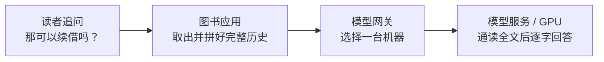
```mermaid
flowchart LR
    User["读者追问<br/>那可以续借吗？"] --> App["图书应用<br/>取出并拼好完整历史"]
    App --> Gateway["模型网关<br/>选择一台机器"]
    Gateway --> GPU["模型服务 / GPU<br/>通读全文后逐字回答"]
```

这里有一个很容易混淆的事实：**数据库里的聊天记录，是给人看、给应用存的文字；模型真正消耗的，是另一次完整阅读。** 应用记住历史，只保证模型“知道你说过什么”；它并不保证模型“不用再把历史从头算一遍”。

把文字交给模型之前，还要切成模型能处理的小片段，每个片段叫作 `Token`。一个中文词常常对应一个或几个 `Token`，英文单词也类似。输入越长，`Token` 越多，第一轮通读就越贵。读者从发出问题到看到第一个字冒出来的等待时间，叫作 `TTFT`，全称 `Time To First Token`。多轮对话越聊越长，如果每一轮都把历史重新读一遍，读者就会明显感到“越往后越卡”。

一台 `GPU` 同时只能认真处理有限的请求，所以线上服务几乎总会准备多台机器。于是，“选哪一台机器来读这段历史”，就从运维细节变成了性能问题。

### 把模型想成图书管理员

在这个借阅咨询场景里，可以把大模型想象成一位图书管理员。咨询前台把借阅制度和完整对话记录交给管理员；管理员需要先读完这些内容、在草稿纸上整理重点，然后再一个字一个字地组织回答。

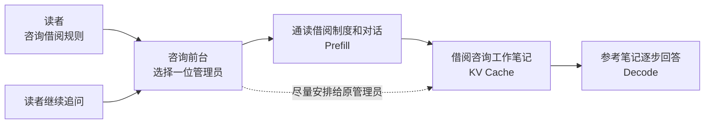
```mermaid
flowchart LR
    Reader["读者<br/>咨询借阅规则"] --> Desk["咨询前台<br/>选择一位管理员"]
    Desk --> Read["通读借阅制度和对话<br/>Prefill"]
    Read --> Notes["借阅咨询工作笔记<br/>KV Cache"]
    Notes --> Answer["参考笔记逐步回答<br/>Decode"]
    Reader2["读者继续追问"] --> Desk
    Desk -. "尽量安排给原管理员" .-> Notes
```

这四步正好对应后文最常出现的四个词：

| 生活里的动作 | 后文用的词 | 现在只要记住 |
| --- | --- | --- |
| 咨询前台安排一位管理员 | 网关路由 | 决定这次请求去哪台机器 |
| 通读借阅制度和对话记录 | `Prefill`，中文常译为预填充 | 先把输入全部读完，并留下中间结果 |
| 管理员的借阅咨询工作笔记 | `KV Cache` | 不是聊天原文，而是读完后留下的计算笔记 |
| 参考笔记逐字写出回答 | `Decode`，中文常译为解码 | 一个 `Token` 接一个 `Token` 生成答案 |

如果“能否续借”的追问仍然交给原管理员，并且工作笔记还在、借阅制度与前面对话也完全相同，管理员就可以直接翻看笔记，只阅读新增加的问题。这份“从开头一直没变过的内容”叫作**前缀**；把对应笔记保存下来、下次直接用，就叫**前缀缓存**。找到并能使用这些笔记，叫作**缓存命中**；找不到或不能用，叫作未命中。

如果换了一位管理员，或者原来的笔记已经被清理，就只能从头再读。所谓会话保持，解决的正是“尽量把相关问题交给拥有那份笔记的人”；它能增加复用机会，却不能保证笔记一定存在。

### 加机器以后，为什么第二轮又变慢了

只有一台服务器提供模型服务时，读者每次都遇到同一位管理员，工作笔记还在桌上，第二轮自然更快。线上服务则像一座有很多管理员的图书馆。如果咨询前台只是轮流安排，同一位读者的“能否续借”就可能被交给另一位管理员。新管理员没有那份笔记，只能重新通读借阅制度和此前对话。机器越多、轮换越勤，这种“明明聊过、却还要重读”的情况就越常见。

更进一步的做法，不仅仅只看“这是不是同一位读者”，还会估计“**哪位管理员手里已经有这段资料的笔记**”。这就是后文要讲的 `KV Cache` 感知路由。

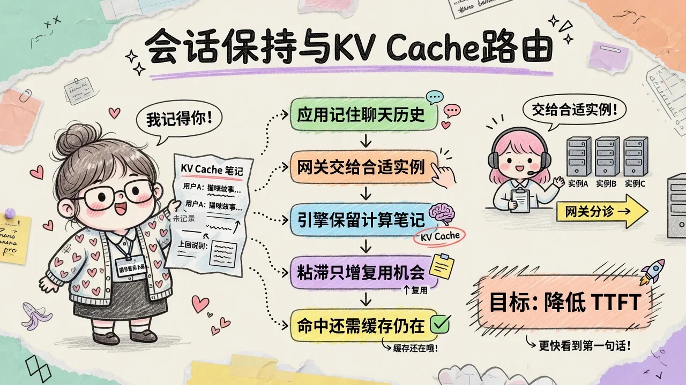

可以先记住一条分工：

- **应用服务**负责记住聊天文字；
- **模型网关**负责把请求送到合适的机器；
- **模型服务**负责保留或丢弃计算笔记。

任意一层断开，模型都可能重新阅读整段历史。后文会分别说明每一层能做什么、不能做什么。

### 文中术语速查

后文会反复出现下面这些词。它们描述的是同一条处理链路，而不是互相独立的技术。现在不必一次记完，遇到时再回来看即可。

| 术语 | 通俗解释 |
| --- | --- |
| `GPU` | 负责大规模并行计算的处理器，是模型真正执行计算的主要设备 |
| `Token` | 模型实际处理的最小文本片段；中文一个词常常对应一个或几个 `Token` |
| `Prefill` | 模型先通读全部输入并形成中间计算结果的阶段，中文常译为“预填充” |
| `KV Cache` | `Prefill`留下的中间计算结果，相当于模型读完前文后写下的草稿笔记 |
| 前缀 | 输入中从开头起保持不变的部分，例如多轮对话共同拥有的聊天历史 |
| 前缀缓存 | 保存并复用相同前缀的`KV Cache`，避免再次通读这部分内容 |
| 缓存命中 | 需要的笔记仍然存在并能直接使用；找不到或不能使用则叫“未命中” |
| 缓存命中率 | 已成功复用的请求或输入`Token`占比；统计口径不同，结论也可能不同 |
| 冷缓存与热缓存 | 刚启动或缺少常用内容的缓存称为冷缓存；已经积累较多常用内容的称为热缓存 |
| `Decode` | 模型利用已有笔记，一个`Token`接一个`Token`生成答案的阶段 |
| `TTFT` | 从发出请求到收到第一个输出`Token`的时间，也就是用户等到第一个字的时间 |
| 吞吐 | 单位时间内处理的请求数或`Token`数，用来衡量整个服务的处理能力 |
| 尾延迟 | 最慢那一小部分请求的耗时，常用`P95`或`P99`观察 |
| `LoRA` | 一种给基础模型外挂少量适配参数的方法，不同`LoRA`产生的`KV Cache`通常不能直接混用 |
| `LRU` | “优先清理最久没有使用内容”的缓存淘汰思路，英文全称为`Least Recently Used` |

## `KV Cache`为什么决定多轮会话的性能

引言里把`KV Cache`比成草稿纸。这一节把这张纸说清楚：它从哪来、为什么第二轮本该更快，以及什么条件下才能真的少读一遍。读完后你会知道：会话保持解决的是“把请求送到笔记所在的机器”，真正省时间的仍然是这份笔记本身。


### `Prefill`与`Decode`分别在做什么

大多数聊天模型采用`Transformer`结构。你暂时不必理解它的矩阵公式，只要抓住一件事：它非常善于判断“当前这个字，应该参考前文的哪些部分”。模型并不是一次写出整段回答，而是反复做同一件事——根据已经看到的内容，预测下一个`Token`。这种方式叫作**自回归生成**。

一次推理通常分为两个阶段：

- `Prefill`阶段读取整个输入，为模型每一层计算后续还要使用的中间结果，并产生第一个输出`Token`。输入越长，要阅读和计算的内容通常越多，因此它是`TTFT`的重要组成部分。
- `Decode`阶段每次生成一个新`Token`。它复用前面保存的中间结果，不必在每一步都重新计算全部历史；这一阶段还会受到显存读取速度、同时处理多少请求以及调度方式的影响。

模型用来判断“当前应该关注前文哪些部分”的计算方法叫作**注意力机制**。这些中间结果在注意力机制中分为`Key`和`Value`两组数字，所以简称为`K/V`。普通读者不必先理解矩阵运算，只需要记住：它们是模型读过前文后留下的计算笔记，不是聊天文本本身。

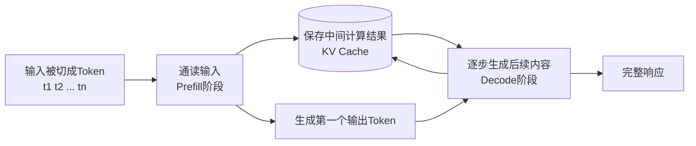
```mermaid
flowchart LR
    Prompt["输入被切成Token<br/>t1 t2 ... tn"] --> Prefill["通读输入<br/>Prefill阶段"]
    Prefill --> KV[("保存中间计算结果<br/>KV Cache")]
    Prefill --> First["生成第一个输出Token"]
    KV --> Decode["逐步生成后续内容<br/>Decode阶段"]
    First --> Decode
    Decode --> KV
    Decode --> Output["完整响应"]
```

为什么“通读输入”会很贵？在经典全注意力中，一个`Token`需要与许多其他`Token`计算关联。输入长度翻倍时，需要比较的组合数量大约会变成原来的四倍，因此其理论计算量随长度近似按平方增长。

### 多轮对话为什么天然适合前缀复用

先明确一个边界：图书应用保存在数据库中的对话记录，与推理引擎保存的`KV Cache`不是同一种状态。前者让应用能够重新拼出完整上下文，后者让模型跳过已经读过的前缀。即使`KV Cache`丢失，只要对话记录仍在，请求依然能够正确执行，只是需要重新`Prefill`。

大多数兼容`OpenAI API`格式的接口仍然是“这次请求只看这次输入”：应用需要发送本轮所需的完整上下文，或者使用服务端明确提供的会话型接口。即使服务端替应用保存了消息，也不代表它承诺长期保留某台机器上的`KV Cache`。

回到前面的图书借阅例子。第二轮并不是只发送“那可以续借吗？”，而是把借阅助手的系统提示、借阅制度、第一轮问题和回答都放在新问题前面。只要这些开头一字不差，它们就是可复用的前缀。

假设聊天模板每轮都把新消息追加在末尾：

```text
第一轮：系统提示 + 借阅制度 + “普通图书可以借多久？”
第二轮：第一轮完整内容 + “普通图书可以借30天。” + “那可以续借吗？”
第三轮：第二轮完整内容 + 续借问题的回答 + “如果逾期了呢？”
```

第二轮包含第一轮的完整前缀，第三轮又包含第二轮的完整前缀。如果推理引擎支持前缀缓存，并且请求落到仍保存这些块的实例上，就只需对新增尾部执行`Prefill`。

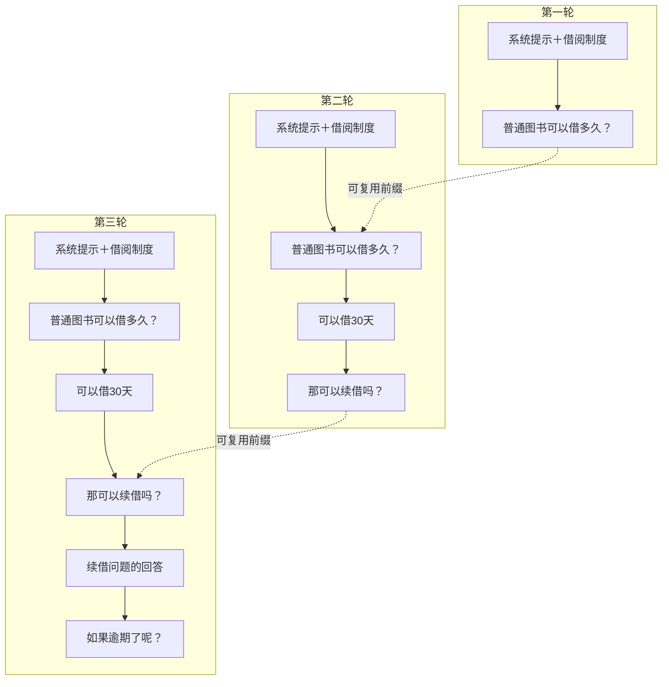
```mermaid
flowchart TB
    subgraph P1["第一轮"]
        A1["系统提示＋借阅制度"] --> A2["普通图书可以借多久？"]
    end
    subgraph P2["第二轮"]
        B1["系统提示＋借阅制度"] --> B2["普通图书可以借多久？"] --> B3["可以借30天"] --> B4["那可以续借吗？"]
    end
    subgraph P3["第三轮"]
        C1["系统提示＋借阅制度"] --> C2["普通图书可以借多久？"] --> C3["可以借30天"] --> C4["那可以续借吗？"] --> C5["续借问题的回答"] --> C6["如果逾期了呢？"]
    end
    A2 -. "可复用前缀" .-> B2
    B4 -. "可复用前缀" .-> C4
```

`vLLM`是目前常用的开源大模型推理引擎之一，它的自动前缀缓存（`Automatic Prefix Caching`）是一个典型实现。它先把`KV Cache`切成固定大小的块，再为每个块计算一个内容指纹，这个指纹称为哈希。当前块的`Token`编号、前一个块的哈希以及模型执行身份都会参与计算，因此只有从输入开头连续相同的完整块才能复用。


### 命中到底需要哪些条件

“同一个会话”只是业务上的说法。要真正复用那份计算笔记，至少要满足下面几类条件：

| 条件 | 常见破坏因素 |
| --- | --- |
| **相同模型执行身份** | 模型版本、权重、量化方式、`LoRA`适配器变化 |
| **相同的连续`Token`前缀** | 模板、空格、消息顺序、工具定义或图片变化 |
| **到达持有缓存的执行位置** | 轮询到其他`Pod`、跨地域或跨处理域 |
| **缓存仍然存在且可用** | `LRU`淘汰、进程重启、缩容、显存压力 |
| **块边界满足引擎规则** | 尾部不足一个完整块，只能从下一个边界重新算 |
| **隔离身份一致** | 租户盐、缓存命名空间或安全域不同 |

这里的“相同输入”是模板渲染和分词后的完整前缀相同，不是用户肉眼看起来意思相近。以下细节都可能改变`Token`序列：

- 系统时间、随机请求编号被插入系统提示；
- 工具定义顺序不稳定，或`JSON`这种结构化请求格式的字段顺序和默认值发生变化；
- 聊天模板、表示文本开始和结束的`BOS/EOS`特殊标记、角色分隔符或分词器版本变化；
- 历史消息被摘要、裁剪或重新排序；
- 多模态占位符、图片内容或`LoRA`适配器发生变化。

因此，更稳妥的提示词结构是“稳定内容在前，易变内容在后”：静态系统提示、固定工具定义、长文档放在前部，时间戳、用户本轮问题和随机字段放在尾部。托管服务的官方文档同样强调前缀一致性；`OpenAI`还明确说明，维持同一会话并不能保证命中，缓存状态位于具体机器上，路由会影响复用。

## 缓存命中率的真正痛点

上一节说明了笔记什么时候能复用。这一节要回答另一个更实际的问题：线上服务为什么经常看起来“有缓存”，用户却仍然在等。原因通常不在某一个开关没打开，而在统计口径、多台机器把热笔记切冷、以及命中和排队互相拉扯。

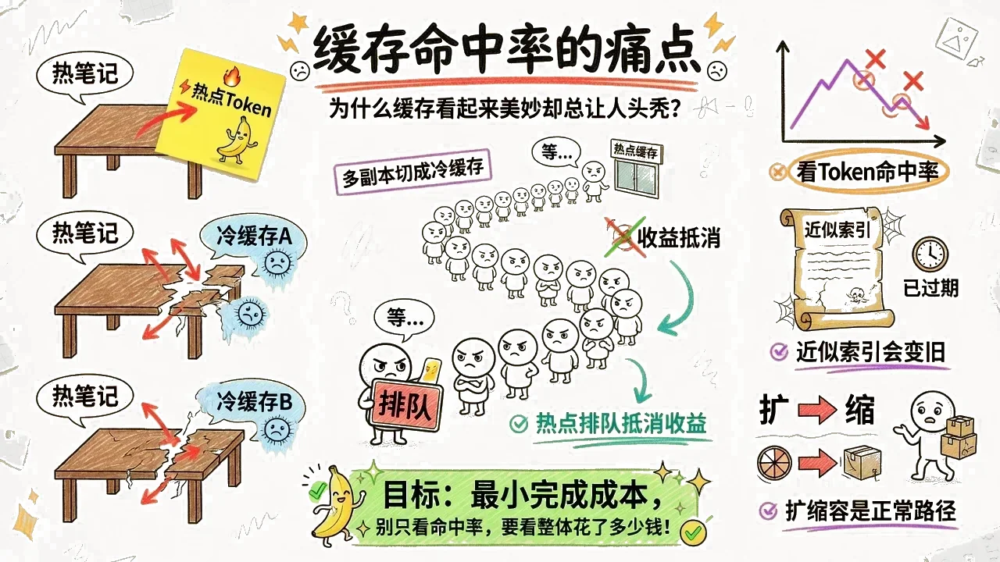

### 请求命中率容易掩盖问题

至少应区分两种指标：

```text
请求命中率 = 至少命中一个缓存块的请求数 ÷ 可缓存请求数

Token命中率 = 所有请求命中的输入Token数之和 ÷ 所有输入Token数之和
```

假设`100`个请求都只命中`16 Token`，请求命中率可能是`100%`，但对每个包含约`8000 Token`的输入几乎没有价值。对成本和`Prefill`工作量更有解释力的是按`Token`加权的命中率。`OpenAI`官方也建议用所有请求的已缓存输入量除以总输入量，也就是汇总`cached_tokens / input_tokens`。

使用`vLLM`时，可以从它公开的监控数据中观察以下指标。名称看起来较长，但含义并不复杂：

| `vLLM`指标 | 它在回答什么问题 |
| --- | --- |
| `prefix_cache_queries` | 总共查找了多少个前缀缓存块 |
| `prefix_cache_hits` | 其中多少个块查找成功 |
| `prompt_tokens_total` | 模型总共收到多少输入`Token` |
| `kv_cache_usage_perc` | 当前`KV Cache`空间用了多少 |
| `time_to_first_token_seconds` | 用户等到第一个输出`Token`用了多久 |

不过，`Token`命中率也不直接等于节省的计算比例。注意力计算、分块边界、批处理、远端缓存加载和排队都会影响最终延迟，所以必须同时看`TTFT`和吞吐。

### 多副本把一份热前缀切成多份冷缓存

继续使用借阅咨询会话`S1`。它的三个问题“可以借多久”“能否续借”“逾期怎么办”分别被轮询到三个`Pod`：

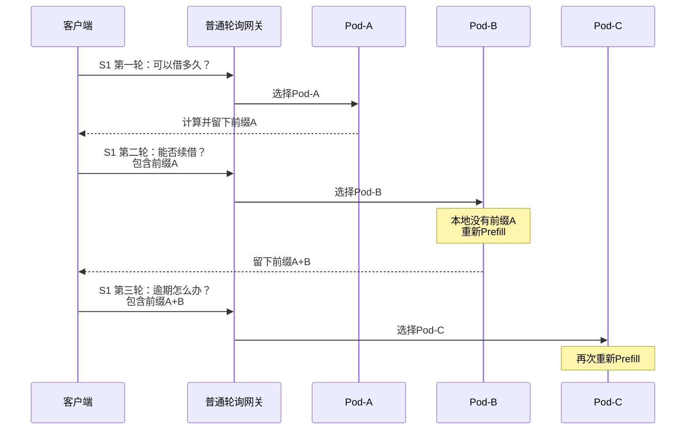
```mermaid
sequenceDiagram
    participant C as 客户端
    participant G as 普通轮询网关
    participant P1 as Pod-A
    participant P2 as Pod-B
    participant P3 as Pod-C

    C->>G: S1 第一轮：可以借多久？
    G->>P1: 选择Pod-A
    P1-->>C: 计算并留下前缀A
    C->>G: S1 第二轮：能否续借？<br/>包含前缀A
    G->>P2: 选择Pod-B
    Note over P2: 本地没有前缀A<br/>重新Prefill
    P2-->>C: 留下前缀A+B
    C->>G: S1 第三轮：逾期怎么办？<br/>包含前缀A+B
    G->>P3: 选择Pod-C
    Note over P3: 再次重新Prefill
```

单实例测试往往看不出这个问题，因为请求只能回到同一个缓存池。一旦上线轮询、随机或最少连接，多轮会话和共享系统提示就会在多个副本上重复预热。扩容越积极，短时间内冷缓存比例可能越高。

### 热点、排队与命中率互相拉扯

如果某个`Pod`保存着图书馆借阅助手共用的`20K Token`系统提示和制度资料，把所有咨询都送过去能提高命中率，却可能让它排队，而其他`GPU`空闲。此时一次缓存命中节省的`Prefill`时间，可能小于额外排队时间。

生产路由的目标不应是“最大化命中率”，而应是“在满足负载和可靠性约束时，最小化请求的预计完成成本”。一个便于理解的抽象评分是：

```text
节点成本 = 未缓存Prefill成本
         + 排队成本
         + Decode占用成本
         + 远端KV加载成本
         + 故障惩罚
         - 本地缓存收益
```

不同项目对这些项的归一化、权重和阈值不同，但方向相同：缓存局部性只是调度信号之一。

### 缓存索引会变旧

路由器观察到“请求`P`刚被送到`Pod-A`”，只能推测`Pod-A`可能拥有前缀`P`。之后还可能发生：

- 请求失败，缓存根本没有写成；
- 推理引擎因显存压力先于路由器淘汰了块；
- `Pod`重启或被缩容，路由器尚未清理索引；
- 多个网关副本各自只看到一部分流量；
- 路由器和推理引擎采用不同的分词器、块大小或缓存身份。

这就是“近似前缀索引”与“真实`KV Cache`目录”的差别。近似方案部署简单、侵入小；精确方案则需要引擎发布块的增加和删除事件，并处理事件丢失、乱序、重放、启动快照和版本兼容。

### 扩缩容和故障是正常路径

硬会话粘滞若没有失效策略，会把请求持续发给已经不存在或过载的节点。服务端会话映射还要处理`TTL`、并发请求、滚动发布和跨路由副本一致性。这里的`TTL`是“这条记录还能存活多久”，到期后绑定会被清理。真正可用的方案必须规定：

1. 目标节点不健康时如何解除绑定；
2. 新节点加入时是否迁移会话；
3. 路由器重启后如何恢复映射；
4. 重试是否仍发往同一节点；
5. 把`Prefill`和`Decode`部署到不同机器时，应该绑定哪个阶段。

## 常见会话保持技术方案

前面已经知道：要把相关请求送到仍拿着笔记的机器。工程上并没有一个叫“会话保持”的万能开关，而是一条从低成本到高精度的技术光谱。越往右，通常越了解缓存真实位置，接入和运维成本也越高。阅读时可以先抓住每一种方法在回答哪句话，不必一次记住全部实现细节。

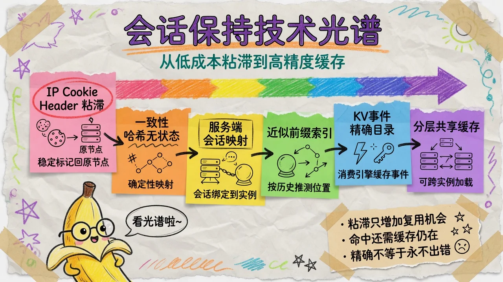

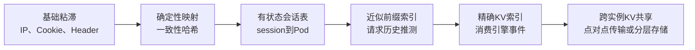
```mermaid
flowchart LR
    Basic["基础粘滞<br/>IP、Cookie、Header"] --> Hash["确定性映射<br/>一致性哈希"]
    Hash --> Session["有状态会话表<br/>session到Pod"]
    Session --> Approx["近似前缀索引<br/>请求历史推测"]
    Approx --> Exact["精确KV索引<br/>消费引擎事件"]
    Exact --> Shared["跨实例KV共享<br/>点对点传输或分层存储"]
```

### 基于`Client IP`、`Cookie`或`Header`的粘滞

最简单的做法是选一个稳定标记，让相同标记尽量落到同一后端。`Client IP`是客户端的网络地址，`Cookie`是浏览器保存并随请求带回的小段标记，`Header`则是请求附带的元数据字段。网络地址转换`NAT`会让多台设备共用一个公网地址，因此相同`Client IP`未必代表同一个用户。在用于管理容器和服务的`Kubernetes`平台中，`Service`是访问一组后端实例的统一入口；它原生支持按客户端地址保持会话，即`sessionAffinity: ClientIP`，默认关闭，并且可以设置保持时间。

| 路由键 | 优点 | 主要问题 |
| --- | --- | --- |
| `Client IP` | 无需改客户端 | 经过`NAT`后许多用户可能共用一个公网地址，代理和移动网络也会改变地址 |
| `Cookie` | 浏览器接入方便 | 非浏览器客户端不自然，需要签名和过期控制 | 
| 自定义`Header` | 语义清晰，适合`API` | 需要客户端配合，必须防伪造和越权 |

这类方案完全不知道输入前缀。同一个会话若分叉或改写历史，仍会去旧节点；不同用户共享相同长文档，也无法跨会话复用。它适合先快速改善多轮聊天，不适合把缓存命中率当作严格目标。

### 一致性哈希与`Rendezvous Hash`

哈希可以把任意会话编号变成一个看似随机但结果稳定的数字。对`session_id`、租户标识或稳定前缀摘要做一致性哈希，就能用这个数字选择后端，而不必另外保存一张集中式会话表。后端集合稳定时，同一个键会选择同一节点；扩缩容时也只需移动一部分键，而不是让全部会话重新分配。`Envoy`中的`Ring Hash`和`Maglev`都是这类确定性负载均衡算法。

最高随机权重哈希，也就是`Rendezvous Hash`，做法更加直观：让一个会话分别与每个健康节点组成一对，计算每一对的稳定分数，然后选择最高分的节点。

```text
对每个健康节点：
    分数 = hash（会话编号 + 节点编号）

选择分数最高的节点
```

它实现简单，节点变化时迁移也相对有限。`AIBrix`的调用方会话键方案就使用`Rendezvous Hash`选`Pod`。

优点是路由器无状态、多副本容易得到一致结果。缺点是它只记住“按规则应该去哪”，不知道缓存是否仍在，也不知道该节点是否排队。生产实现通常会加入虚拟节点，也就是让一台真实机器在哈希空间中拥有多个落点，并结合节点权重、健康过滤和限制单节点压力的有界负载机制；节点身份还应稳定，不能直接依赖频繁变化的临时地址。

### 服务端会话映射

路由器也可以维护`session_id → endpoint`映射，其中`endpoint`就是某个可接收请求的后端地址。首次请求按正常策略选节点，成功后建立绑定，后续请求优先或强制使用该节点。映射可放在路由进程内，也可放在`Redis`等外部存储。

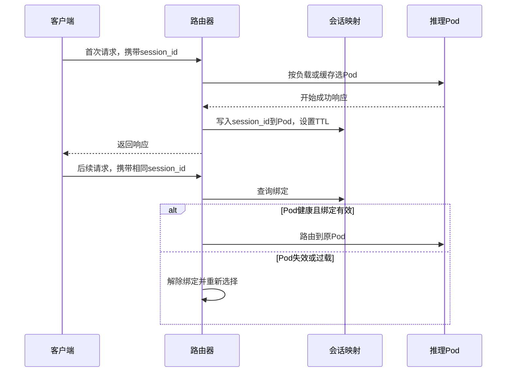
```mermaid
sequenceDiagram
    participant C as 客户端
    participant R as 路由器
    participant M as 会话映射
    participant P as 推理Pod

    C->>R: 首次请求，携带session_id
    R->>P: 按负载或缓存选Pod
    P-->>R: 开始成功响应
    R->>M: 写入session_id到Pod，设置TTL
    R-->>C: 返回响应
    C->>R: 后续请求，携带相同session_id
    R->>M: 查询绑定
    alt Pod健康且绑定有效
        R->>P: 路由到原Pod
    else Pod失效或过载
        R->>R: 解除绑定并重新选择
    end
```

服务端映射能明确设置过期时间，也就是`TTL`，并实现重绑定和软硬两种模式：

- **请求路由硬亲和**：目标健康时只选绑定节点。命中概率高，但热点和尾延迟风险大。
- **请求路由软亲和**：把绑定节点当作加分项，仍允许负载策略选择其他节点。命中率略低，故障和突发流量下更稳。

也可以由服务端在响应中返回一个不透明、带签名的会话令牌，令牌内编码节点身份，客户端后续回传。这样可减少服务端查表，但需要密钥轮换、过期和防篡改设计。直接用`Base64`把`IP:Port`转换成另一串字符只是在编码，既不是加密，也不能证明内容没有被篡改，还可能暴露内部网络地址。

### 近似前缀感知路由

会话粘滞只能回答“这个会话上一次去了哪里”，却无法发现不同会话之间的公共内容。例如，多位读者使用同一个借阅咨询助手时，应用会为他们附上相同的系统提示、借阅制度和馆藏说明，只是每位读者最后提出的问题不同。即使他们的`session_id`完全不同，前面那一大段输入仍然可能共用缓存。

前缀感知路由要回答的问题是：**哪个`Pod`最可能已经处理过这次输入的开头部分**？如果路由器不能直接读取推理引擎的缓存目录，它就根据过去的转发记录维护一本“路线笔记”：某段前缀之前被发往`Pod-A`，那么`Pod-A`现在可能仍保留着对应的`KV Cache`。新请求带着相同前缀到来时，路由器优先考虑`Pod-A`，同时还要检查它是否健康、是否过载。

这里最容易误解的一点是：**“近似”修饰的是缓存位置，不是文本内容**。两句话意思相近但实际`Token`不同，不能复用同一份`KV Cache`；只有从开头开始连续一致的内容才可能命中。“近似”是说路由器只能推测“缓存大概还在`Pod-A`”，无法保证缓存没有被淘汰。

#### 为什么要把前缀切块

如果为整段输入只计算一个指纹，末尾哪怕只增加一个问题，整段指纹也会改变，路由器便无法知道前面有多少内容相同。因此，常见做法是把输入切成固定大小的块，再从前向后计算一条哈希链。

下面用每块`16 Token`举例。真实项目的块大小可以不同，有的网关为了避免加载模型分词器，还会按字符或消息切块。

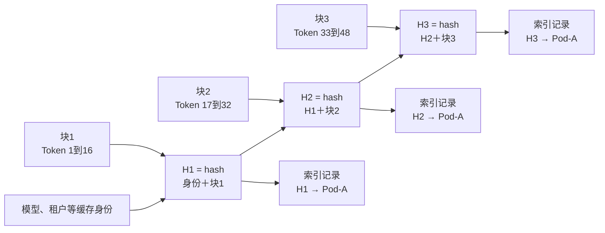
```mermaid
flowchart LR
    Identity["模型、租户等缓存身份"] --> H1["H1 = hash<br/>身份＋块1"]
    B1["块1<br/>Token 1到16"] --> H1
    H1 --> H2["H2 = hash<br/>H1＋块2"]
    B2["块2<br/>Token 17到32"] --> H2
    H2 --> H3["H3 = hash<br/>H2＋块3"]
    B3["块3<br/>Token 33到48"] --> H3
    H1 --> I1["索引记录<br/>H1 → Pod-A"]
    H2 --> I2["索引记录<br/>H2 → Pod-A"]
    H3 --> I3["索引记录<br/>H3 → Pod-A"]
```

可以按从左到右的顺序阅读这张图：

1. `块1`包含第`1`至`16`个`Token`。路由器把块内容与模型、租户等缓存身份一起计算，得到短指纹`H1`。
2. 计算`H2`时，不仅使用`块2`，还把`H1`放进去。因此，`H2`代表的不是孤立的`块2`，而是“从开头经过块1，再到块2”的完整路径。
3. `H3`同样由`H2`和`块3`得到，所以它代表从输入开头一直到第`48`个`Token`的路径。
4. 右侧三个“索引记录”不是`KV Cache`本身，只是路由器记下的对应关系：这些前缀指纹之前被送到过`Pod-A`。

父块哈希参与下一块哈希非常重要。假设两份借阅资料的中间都出现“续借规则”四个字，但此前内容不同；如果只比较当前块，路由器可能误以为它们能够复用。加入父块哈希后，只要前面的任意块不同，后面生成的哈希也会不同，从而确保匹配的是“从开头连续相同”，而不是“中间偶然出现相同片段”。

再回到借阅咨询。第一轮“普通图书可以借多久”的输入有`32 Token`，并被送到`Pod-A`，路由器记下`H1`和`H2`可能位于`Pod-A`。第二轮追问“那可以续借吗”时，输入仍以这`32 Token`开头，后面再追加第一轮回答和新问题。它计算出的`H1`和`H2`仍然相同，新增内容则形成`H3`。路由器由此估算：`Pod-A`可能命中前两个块，也就是前`32 Token`。

#### 从第一次请求到后续命中的完整过程

下面这张图把“学习位置”和“利用位置”放在同一条时间线上。不同项目写入索引的时机并不完全相同：有的在成功选定目标后记录，有的等后端接收请求或正常响应后再记录。图中采用确认请求正常处理后再记录的方式，并省略了鉴权、限流和失败重试等普通网关步骤。

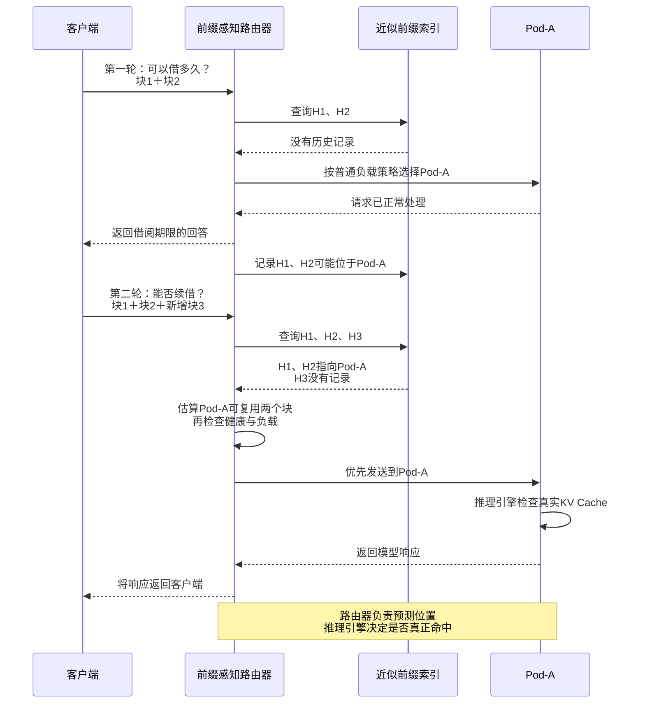
```mermaid
sequenceDiagram
    participant C as 客户端
    participant R as 前缀感知路由器
    participant I as 近似前缀索引
    participant A as Pod-A

    C->>R: 第一轮：可以借多久？<br/>块1＋块2
    R->>I: 查询H1、H2
    I-->>R: 没有历史记录
    R->>A: 按普通负载策略选择Pod-A
    A-->>R: 请求已正常处理
    R-->>C: 返回借阅期限的回答
    R->>I: 记录H1、H2可能位于Pod-A

    C->>R: 第二轮：能否续借？<br/>块1＋块2＋新增块3
    R->>I: 查询H1、H2、H3
    I-->>R: H1、H2指向Pod-A<br/>H3没有记录
    R->>R: 估算Pod-A可复用两个块<br/>再检查健康与负载
    R->>A: 优先发送到Pod-A
    A->>A: 推理引擎检查真实KV Cache
    A-->>R: 返回模型响应
    R-->>C: 将响应返回客户端

    Note over R,A: 路由器负责预测位置<br/>推理引擎决定是否真正命中
```

图中的流程分成两个阶段：

- **第一次请求是学习阶段**。索引里没有记录，路由器只能按普通负载均衡选择`Pod-A`。图中的示例在请求被正常处理后把两个前缀指纹与`Pod-A`关联起来；具体实现也可能在成功选定目标或确认后端接收请求时记录。
- **第二次请求是利用阶段**。索引发现前两个块曾被发往`Pod-A`，于是把它列为缓存候选。不过，如果`Pod-A`正在严重排队，路由器仍可选择其他节点，避免为了命中制造热点。
- **最终检查发生在推理引擎内部**。即使索引指向`Pod-A`，引擎仍会根据自己的块规则和真实缓存状态判断能否复用。路由器不能替引擎宣布命中。

真正的推理引擎通常按模型给每个`Token`分配的数字编号，也就是`Token ID`，建立缓存身份。网关若采用同一个分词器，就能更接近引擎的分块结果；如果为了降低接入成本而按整理成统一格式的消息或字符切块，计算出的匹配长度就只是估算值。

#### 为什么记录可能不准确

路由器记下的是“请求曾经去过哪里”，而不是“缓存此刻一定在哪里”。两者会因为以下情况逐渐偏离：

- 请求虽然被分配到`Pod-A`，但在完成缓存写入前就失败了；
- `Pod-A`后来因为显存不足淘汰了旧块，路由器却还没删除记录；
- `Pod-A`重启或缩容退出，原来的缓存随之消失；
- 多个路由器副本各自只看到一部分请求，得到的索引并不完整；
- 网关与推理引擎使用不同的分词器、块大小或缓存身份，双方认为“相同”的范围不一致。

因此，近似索引通常还要设置容量和过期时间，并在目标失效时删除旧记录。它的优势是不必修改推理引擎，能够兼容多种后端，而且不同会话也可以共享公共前缀；缺点是需要不断学习和纠正，路由器重启后可能要重新积累记录。仍用图书管理场景理解，它就像咨询前台的分流登记表：登记表只说明哪位管理员最近处理过相同的借阅资料，工作笔记此刻是否还在，仍要由管理员实际确认。

这种方案适合多轮对话、共享系统提示、多人围绕同一份长文档提问，以及暂时无法接入引擎缓存事件的场景。如果业务要求准确知道每一个缓存块位于哪里，就需要下一节介绍的`KV Events`精确路由。

### 基于缓存变更通知，也就是`KV Events`的精确路由

近似索引只根据历史请求猜测缓存位置。更精确的办法是让推理引擎在创建或删除缓存块时主动发出一条通知，这种通知称为`KV Events`。这些通知通常经过一个负责传递消息的事件通道，再交给索引器处理。路由器持续查询这个索引，就能获得更接近真实状态的“前缀块到节点集合”目录。`vLLM`的`KV Events`、`llm-d Router`精确前缀索引和`NVIDIA Dynamo`的索引器都采用了这类思路。

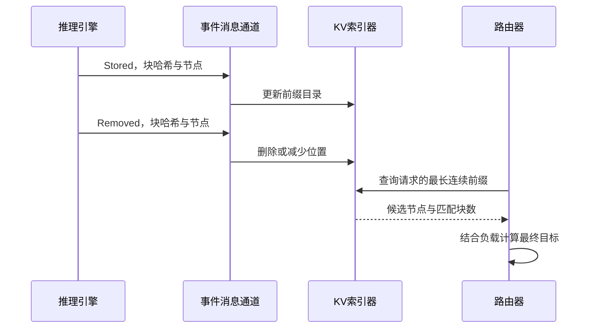
```mermaid
sequenceDiagram
    participant E as 推理引擎
    participant B as 事件消息通道
    participant I as KV索引器
    participant R as 路由器

    E->>B: Stored，块哈希与节点
    B->>I: 更新前缀目录
    E->>B: Removed，块哈希与节点
    B->>I: 删除或减少位置
    R->>I: 查询请求的最长连续前缀
    I-->>R: 候选节点与匹配块数
    R->>R: 结合负载计算最终目标
```

精确是相对近似索引而言，不代表永不出错。事件系统仍需面对：

- 事件丢失和乱序，需要序列号、缺口检测与重放；
- 路由器启动时需要快照或从健康节点重建；
- 引擎版本、块大小、哈希算法和多模态身份必须一致；
- 高频块事件会消耗网络、内存和服务器通用处理器`CPU`；
- 请求到达与事件可见之间存在短暂窗口。

适用场景是副本多、前缀价值高、引擎支持事件协议，并且团队能运维事件消息通道和恢复流程的集群。

### 分布式与分层`KV Cache`

前面的方案都在努力把请求送到缓存所在位置。另一个方向是让缓存能够移动或从共享存储加载，从而降低严格粘滞的必要性。

图中的高带宽显存`GPU HBM`是`GPU`自带的高速内存，速度最快但容量小、价格高；动态随机存取内存`CPU DRAM`是服务器主内存，速度较慢但容量通常更大；`NVMe`则是常见的高速固态硬盘接口。缓存越往右移动，通常容量越大、单位成本越低，但取回也越慢。

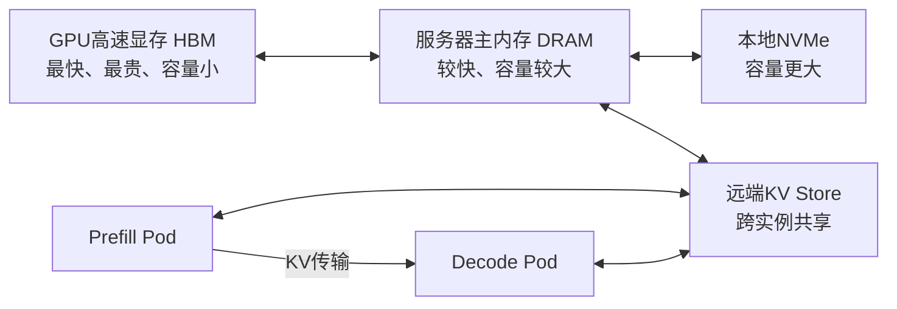
```mermaid
flowchart LR
    GPU["GPU高速显存 HBM<br/>最快、最贵、容量小"] <--> CPU["服务器主内存 DRAM<br/>较快、容量较大"]
    CPU <--> NVMe["本地NVMe<br/>容量更大"]
    CPU <--> Remote["远端KV Store<br/>跨实例共享"]
    P1["Prefill Pod"] -->|"KV传输"| P2["Decode Pod"]
    P1 <--> Remote
    P2 <--> Remote
```

可将它分为两种工作模式：

- **存储模式**：把低频`KV`从`GPU`卸载到`CPU`、本地盘或远端存储，后续请求按需加载，扩大缓存容量并支持跨请求、跨进程复用。
- **传输模式**：当负责通读输入的`Prefill`实例和负责生成答案的`Decode`实例分开部署时，需要把已有`KV`直接送到目标实例。这种架构常简称为`PD`分离。`P2P`表示节点之间点对点传输；`RDMA`可以让机器通过高速网络直接访问对方内存；`NVLink`是`NVIDIA GPU`之间的高速连接；`TCP`则是普通网络广泛使用的传输协议。

分布式缓存不是免费的“全局显存”。一次远端命中仍要做索引查询、把数据整理成适合传输的格式，也就是序列化，再经过网络传输并装入`GPU`。如果加载耗时高于重新计算，命中反而更慢。工程上应建立盈亏阈值：短前缀直接重算，长前缀或高复用前缀才值得远端加载。

### 托管模型服务的提示词缓存

使用托管`API`时，用户无法指定具体机器，服务提供方负责缓存和路由。例如`OpenAI Prompt Caching`会复用匹配的提示词前缀，并在响应的`usage.input_tokens_details.cached_tokens`中报告命中量。当前文档明确指出缓存状态位于单机，请求只有到达保存匹配条目的机器且条目未过期才能复用；`prompt_cache_key`在部分模型上可帮助相关请求路由，但不会固定机器，也不保证命中。不同模型代际的断点、最低可缓存长度、保留策略和计费规则存在差异，应以所用模型的实时文档为准。

对于调用方，能做的主要是保持稳定前缀、合理设置服务方提供的缓存键、监控`cached_tokens`，以及避免把所有高并发流量塞进同一个路由键。不能把自建集群的`Pod`粘滞语义直接套在托管服务上。

## 如何在缓存局部性与负载之间做决策

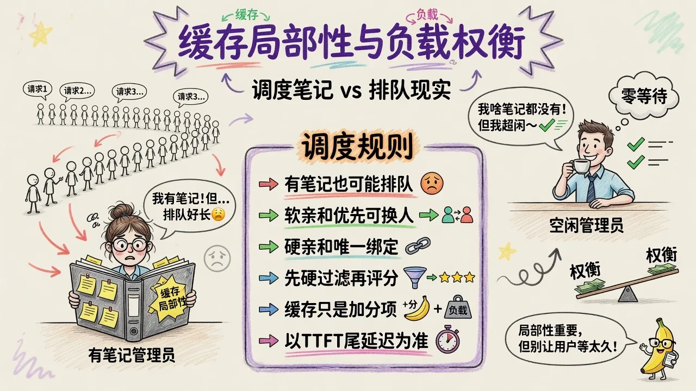

缓存局部性可以理解为“需要的笔记就在当前`Pod`手边”。局部性越好，需要重新执行的`Prefill`越少。但是，手里有笔记的`Pod`不一定最空闲。如果它前面已经排了很多请求，等待时间可能比重新计算还长。

继续使用借阅咨询的例子：管理员甲保存着借阅制度和前两轮对话的工作笔记，但前面排着`8`位读者；管理员乙没有这份笔记，却几乎不用排队。选择甲可以少读资料，选择乙可以少等队伍。路由器真正要比较的不是“谁有笔记”，而是“去谁那里更可能更早拿到答案”。

下面的数字只用于说明思路，并不是任何模型的实测结果：

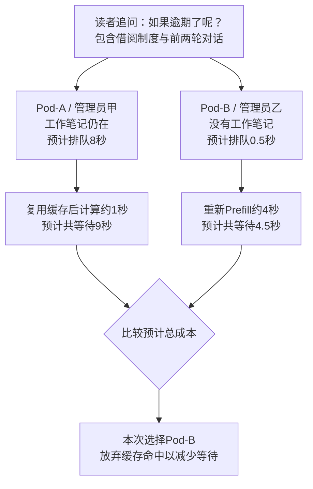
```mermaid
flowchart TB
    Req["读者追问：如果逾期了呢？<br/>包含借阅制度与前两轮对话"] --> A["Pod-A / 管理员甲<br/>工作笔记仍在<br/>预计排队8秒"]
    Req --> B["Pod-B / 管理员乙<br/>没有工作笔记<br/>预计排队0.5秒"]
    A --> CostA["复用缓存后计算约1秒<br/>预计共等待9秒"]
    B --> CostB["重新Prefill约4秒<br/>预计共等待4.5秒"]
    CostA --> Compare{"比较预计总成本"}
    CostB --> Compare
    Compare --> Pick["本次选择Pod-B<br/>放弃缓存命中以减少等待"]
```

如果`Pod-A`只排队`0.2`秒，而复用缓存能节省`3`秒，它就更值得选择。可见，正确目标不是让每次请求都命中缓存，而是在缓存收益、排队时间、实例健康和故障风险之间找到更合适的平衡。

### 先分清本文的“软亲和”是什么

“亲和”只表示“倾向让两个对象靠在一起”。具体是哪两个对象、在哪个阶段靠在一起，要看上下文。本文讨论的**请求路由软亲和**易于和`Kubernetes`调度器里的软亲和搞混淆。

| 容易混淆的概念 | 在什么时候做决定 | 决定什么 | 关键含义 |
| --- | --- | --- | --- |
| `Kubernetes`调度软亲和 | 创建或重新调度`Pod`时 | `Pod`部署到哪台服务器节点 | 尽量满足部署位置偏好，条件不允许时仍可放到其他节点 |
| `Kubernetes Service`会话亲和 | 网络请求进入`Service`时 | 相同`Client IP`的流量发往哪个后端 | 它通常按固定规则保持流量，不理解提示词缓存，也不是本文的动态加分策略 |
| 本文的请求路由软亲和 | 每次模型请求到达时 | 这次请求交给哪个推理`Pod` | 缓存或会话关联的`Pod`会获得优先分，但过载或故障时可以改选其他`Pod` |

`Kubernetes`调度软亲和关注的是**工作负载放在哪里运行**。例如，尽量把某个应用`Pod`放到带`GPU`的节点，或者尽量不要让两个副本挤在同一台机器上。它发生在`Pod`部署阶段。

本文的请求路由软亲和关注的是**已经运行的多个推理`Pod`中，这一次请求发给谁**。它发生在请求转发阶段，并且每次请求都可以重新判断。这里的“软亲和”是推理路由策略的通俗名称，不是一个统一的`Kubernetes API`字段；`llm-d Router`、`NVIDIA Dynamo`等项目的具体配置和评分方式也不完全相同。

对应的请求路由硬亲和则是：只要绑定节点还被认为可用，就必须把请求发给它，不再比较其他节点。两者可以简单记成：

- **请求路由硬亲和**：绑定节点是唯一答案。
- **请求路由软亲和**：绑定节点是优先答案，但不是唯一答案。

还要注意，“硬过滤”与“硬亲和”也不是一回事。硬过滤只是先排除不健康、模型不匹配或已经超过负载上限的节点；硬亲和则是用会话绑定把候选范围限制为某一个节点。

### 一次路由决策到底经过哪些步骤

成熟的路由器通常先解析请求，再经过筛选、统一尺度、评分、选择和反馈五个步骤：

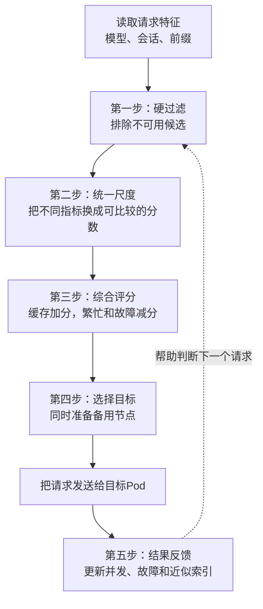
```mermaid
flowchart TB
    Req["读取请求特征<br/>模型、会话、前缀"] --> Filter["第一步：硬过滤<br/>排除不可用候选"]
    Filter --> Normalize["第二步：统一尺度<br/>把不同指标换成可比较的分数"]
    Normalize --> Score["第三步：综合评分<br/>缓存加分，繁忙和故障减分"]
    Score --> Pick["第四步：选择目标<br/>同时准备备用节点"]
    Pick --> Send["把请求发送给目标Pod"]
    Send --> Feedback["第五步：结果反馈<br/>更新并发、故障和近似索引"]
    Feedback -. "帮助判断下一个请求" .-> Filter
```

可以按下面的方式理解图中的每一步：

1. **硬过滤**：先删除一定不能选的节点。例如节点已经宕机、没有加载请求所需的模型，或者队列已经超过保护上限。即使这些节点缓存再多，也不能继续参与评分。
2. **统一尺度**：队列长度可能是`12`个请求，缓存占用可能是`80%`，前缀匹配可能是`6000 Token`，这些数字不能直接相加。路由器需要把它们换算成相近的范围，例如都变成`0`至`1`的分数。
3. **综合评分**：缓存匹配越多就加分，队列越长、正在运行的请求越多或近期失败越多就减分。会话绑定也可以作为一个加分项，这正是请求路由软亲和。
4. **选择目标**：选择综合分数最合适的节点，并保留次优节点。首选节点在真正发送前失效时，可以快速改用备用节点。
5. **结果反馈**：请求开始后增加正在处理的请求数，结束后再减少；发生失败时记录故障；近似前缀路由还会更新“前缀可能在哪个`Pod`”的索引。下一次决策由此获得较新的信息。

这个顺序体现了一个重要边界：**先保证节点能正确、稳定地处理请求，再考虑缓存收益**。缓存只是性能优化，不能让错误模型、故障节点或严重过载节点重新进入候选列表。

### 把评分公式翻译成自然语言

实现中经常会看到类似下面的公式。公式中的`endpoint`就是一个候选后端，整条公式想表达的只有一句话：**前缀命中多、排队少、缓存空间较空、正在处理的请求少且近期没有失败的节点，得分更高**。

```text
score(endpoint) = 3 × prefix_score
                + 2 × (1 - queue_normalized)
                + 2 × (1 - kv_usage)
                + 1 × (1 - inflight_normalized)
                - failure_penalty
```

每一项的含义如下：

| 公式项 | 通俗含义 | 为什么这样计算 |
| --- | --- | --- |
| `prefix_score` | 前缀缓存匹配分 | 匹配越多越好，所以直接加分 |
| `1 - queue_normalized` | 队列空闲分 | 队列越长，原始值越大；用`1`减去它后，队列越短得分越高 |
| `1 - kv_usage` | 缓存余量分 | 缓存越满，继续接收请求和保留新缓存的空间越少 |
| `1 - inflight_normalized` | 当前处理能力余量 | 正在处理的请求越少，得分越高 |
| `failure_penalty` | 近期故障惩罚 | 最近超时或失败越多，减掉的分数越多 |

名称中的`normalized`表示“已经统一尺度”。例如，某项变成`0.8`并不表示有`0.8`个请求，而是表示它在统一后的`0`至`1`范围内已经比较高。公式前面的`3`、`2`、`1`叫作权重：`3 × prefix_score`表示这个示例最重视前缀缓存，`1 × (1 - inflight_normalized)`表示对正在运行请求数的重视程度相对较低。

假设`Pod-A`前缀匹配很好，但队列和缓存占用都接近上限；`Pod-B`只匹配少量前缀，却非常空闲。软亲和不会因为`Pod-A`“曾经绑定过”就直接结束判断，而是让两台机器都完成评分。最终`Pod-B`仍可能胜出，这正是前面示意图中“宁可重新`Prefill`，也不等待拥塞节点”的情况。

这些权重只是解释原理的示例，不能直接复制到所有集群。`Higress ai-endpoint-picker`当前默认权重大致采用`queue=2`、`kvCache=2`、`prefixCache=3`、`inflight=1`，并将每项转换到`0`至`1`的范围；其前缀分还同时考虑匹配比例和绝对匹配长度。一个`500 Token`的请求全部命中，与一个`20000 Token`的请求只命中`500 Token`，虽然都命中了`500 Token`，但节省比例和总体价值并不相同。

生产环境还需要根据实际观测调整权重和保护上限。例如，长文档问答通常更重视前缀缓存；短问短答的重新计算成本较低，可以更重视队列；节点经常发生瞬时故障时，则应提高故障惩罚。最终应以`TTFT`、吞吐和尾延迟是否改善为准，而不是只看评分或命中率。

### 为什么通常推荐请求路由软亲和

对标准的`OpenAI`兼容推理接口来说，只要应用在请求中带上完整上下文，换一个没有缓存的`Pod`通常只会触发重新计算，不会改变答案的正确性。因此，`KV Cache`更像一项性能优化，而不是必须依赖的业务状态。

请求路由软亲和通常更适合作为默认值，原因有四点：

- 缓存节点过载时可以改选空闲节点，避免形成热点；
- 绑定节点故障或缩容后可以立即重新选择，不会无限重试旧节点；
- 近似前缀索引可能已经过期，软亲和允许负载和健康信息纠正错误判断；
- 扩容产生新节点时，新节点仍有机会接收流量并逐渐建立自己的缓存。

只有后端保存了无法在请求中重建、也无法迁移的真实会话状态时，才可能需要请求路由硬亲和。例如，某种专用接口只保存了服务端会话句柄，客户端没有携带完整上下文。即便如此，也必须明确绑定节点失效后的报错、重建或恢复方式。

可以把这一节浓缩成一句话：请求路由软亲和不是“尽量把`Pod`部署在一起”，而是“每次请求优先去有用缓存所在的推理`Pod`，但健康和负载不合适时允许换人”。

## 开源技术方案调研


### `Higress ai-endpoint-picker`：多信号端点选择

项目地址：[Higress项目仓库](https://github.com/higress-group/higress)。

#### 方案设计

`Higress`是一个可以接收请求、执行插件并把请求转发到后端服务的`API`网关。本节只介绍当前的`ai-endpoint-picker`插件。它以`WASM`形式运行在网关内部；`WASM`可以先理解为一种体积较小、与网关主程序隔离的插件运行方式。

插件直接在一个后端实例组中执行前面介绍的“筛选→统一尺度→评分→选择→反馈”流程。源码将这个后端组称为上游集群`upstream cluster`。它使用`Higress`提供的逐节点指标，并通过指定后端`override host`能力明确选择最终节点，不需要再部署一个独立的端点选择器`Endpoint Picker`，简称`EPP`。

一次请求的处理过程如下：

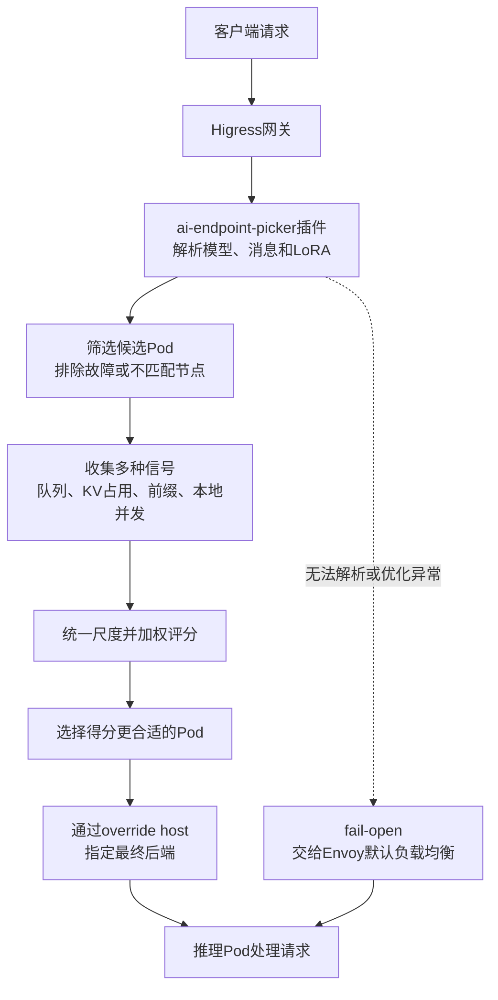
```mermaid
flowchart TB
    Client["客户端请求"] --> Higress["Higress网关"]
    Higress --> Plugin["ai-endpoint-picker插件<br/>解析模型、消息和LoRA"]
    Plugin --> Filter["筛选候选Pod<br/>排除故障或不匹配节点"]
    Filter --> Signals["收集多种信号<br/>队列、KV占用、前缀、本地并发"]
    Signals --> Score["统一尺度并加权评分"]
    Score --> Pick["选择得分更合适的Pod"]
    Pick --> Override["通过override host<br/>指定最终后端"]
    Override --> Pod["推理Pod处理请求"]
    Plugin -. "无法解析或优化异常" .-> Fallback["fail-open<br/>交给Envoy默认负载均衡"]
    Fallback --> Pod
```

图中最关键的是“多种信号”而不是单独追求前缀命中：

- 队列长度反映目标`Pod`前面还有多少请求在等待；
- `KV Cache`利用率反映缓存空间是否接近用满；
- 近似前缀分反映该`Pod`可能复用多少已有输入；
- 本地并发表示插件观察到该节点正在处理多少请求；
- `LoRA`、节点故障等信息用于排除不匹配或风险较高的节点。

这些信号经过统一尺度和加权后，插件选择综合得分更合适的`Pod`。因此，缓存较多但已经拥塞的节点不一定胜出，缓存较少但明显更空闲的节点仍可能被选中。最后，`override host`能力把路由结果交给`Higress`，由网关将请求发到指定后端。

插件维护一个有容量上限的本地近似前缀索引，并按加权`LRU`清理价值较低或较久未使用的记录。只有成功设置目标后，它才记录本次请求的前缀位置。不能解析或超过处理预算的请求会跳过前缀评分，队列等其他负载信号仍可继续工作。

插件还采用`fail-open`设计，也就是缓存感知优化出错时不拦截正常请求，而是交给`Higress`底层网络代理`Envoy`的默认负载均衡继续处理。这保证了智能路由是可降级的性能优化，而不是推理服务的必经故障点。

:::warning 需要特别注意
前缀索引位于当前`WASM`插件实例内，既不是推理引擎的真实缓存目录，也不会天然在多个网关副本之间共享。如果部署多个`Higress`副本，每个插件实例可能根据自己看到的请求形成不同索引；插件重启后也需要重新积累记录。因此，它更适合单个路由视图或能够接受近似效果的场景，不能被当作全局强一致的缓存目录。
:::

#### 方案优点

- **接入链路短**：选择逻辑直接运行在`Higress`网关插件中，不需要再部署独立`EPP`，少了一次跨进程的决策调用。
- **不会只顾缓存命中**：队列、`KV Cache`利用率、近似前缀、本地并发和`LoRA`兼容性共同参与选择，能够避开“缓存很多但已经堵住”的节点。
- **优化失败时仍可服务**：插件采用`fail-open`设计。请求解析失败、前缀计算超出预算或插件无法完成智能选择时，仍可交给`Envoy`默认负载均衡。
- **部署改动相对集中**：已经使用`Higress`的团队主要调整网关插件配置，不必为了缓存感知另外维护一整套调度控制面。

#### 方案缺点

- **前缀位置只是预测**：插件根据成功路由的历史推测缓存在哪个`Pod`，并不知道推理引擎是否已经淘汰对应`KV`块。
- **多个网关副本看不到同一份索引**：每个`WASM`实例维护自己的本地状态，副本之间可能给同一个请求算出不同结果，重启后还需要重新预热。
- **效果依赖指标质量和权重**：队列、缓存占用等指标如果延迟或缺失，综合得分就会偏离真实状态；权重也需要结合业务流量验证。
- **不能代替共享缓存**：它只负责尽量选对后端，不会把一个`Pod`上的真实`KV Cache`搬到另一个`Pod`。

#### 适用场景

更适合已经使用`Higress`、希望以较低接入成本获得缓存与负载联合路由，并且能够接受近似索引和网关本地状态的集群。

### `Gateway API Inference Extension`：标准化选择接口

项目地址：[项目仓库](https://github.com/kubernetes-sigs/gateway-api-inference-extension)、[端点选择协议](https://github.com/kubernetes-sigs/gateway-api-inference-extension/blob/4e9bfc7833f241663e9a9e9fc0090ef9ae549311/docs/proposals/004-endpoint-picker-protocol/README.md)、[前缀缓存感知提案](https://github.com/kubernetes-sigs/gateway-api-inference-extension/blob/4e9bfc7833f241663e9a9e9fc0090ef9ae549311/docs/proposals/0602-prefix-cache-aware-routing-proposal/README.md)。

#### 方案设计

先不要把它理解成一个具体的负载均衡器。`Gateway API Inference Extension`更像一套统一的“网关和智能选择器如何交接工作”的规则。它为容器与服务编排平台`Kubernetes`补充了两个重要角色：

- `InferencePool`是一份候选名单，表示一组可以处理某类模型请求的推理端点；
- 端点选择器`Endpoint Picker`，简称`EPP`，是负责从候选名单中挑选端点的决策组件。

真正转发网络请求的仍然是网关数据面，例如`Envoy`；`EPP`只负责做选择。二者通过`Envoy`的外部处理协议`ext_proc`通信。仍用图书馆来理解，可以把`ext_proc`看成咨询前台与外部分单员之间的标准通道：前台先把咨询请求交给分单员，分单员给出管理员的优先顺序，再由前台完成转交。

一次请求会经历下面的过程：

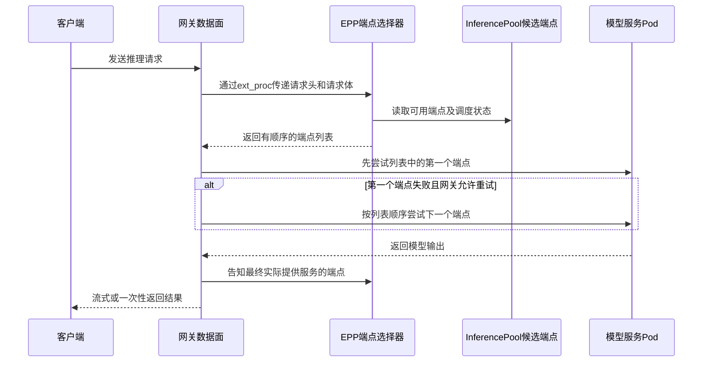
```mermaid
sequenceDiagram
    participant C as 客户端
    participant G as 网关数据面
    participant E as EPP端点选择器
    participant P as InferencePool候选端点
    participant M as 模型服务Pod

    C->>G: 发送推理请求
    G->>E: 通过ext_proc传递请求头和请求体
    E->>P: 读取可用端点及调度状态
    E-->>G: 返回有顺序的端点列表
    G->>M: 先尝试列表中的第一个端点
    alt 第一个端点失败且网关允许重试
        G->>M: 按列表顺序尝试下一个端点
    end
    M-->>G: 返回模型输出
    G->>E: 告知最终实际提供服务的端点
    G-->>C: 流式或一次性返回结果
```

图中“返回有顺序的端点列表”很重要。`EPP`不只能回答“选`Pod-A`”，还可以回答“优先`Pod-A`，失败后依次尝试`Pod-B`和`Pod-C`”。网关负责真正执行转发和重试，并把最后实际处理请求的端点反馈给`EPP`。如果没有任何可用端点，协议规定可以返回`503 Service Unavailable`；如果系统已经过载并决定主动拒绝一个可丢弃请求，可以返回`429 Too Many Requests`。

不过，这套协议只规定**怎样问和怎样回答**，并没有强制`EPP`必须使用哪一种算法。一个简单实现可以只看队列长度，另一个实现可以同时使用前缀命中、`LoRA`适配器、`KV Cache`占用和负载，`llm-d Router`等项目也可以把自己的调度逻辑接到这个位置。

官方前缀缓存感知提案给出了一种参考算法。它不要求修改推理引擎，而是在`EPP`内维护近似索引：先把请求内容切成固定大小的字符块，再用“当前块内容＋前一个块的哈希”形成哈希链。当某次请求被分配给`Pod-A`时，索引暂时记下“这些前缀块可能在`Pod-A`上”；相似请求到来时，再寻找拥有最长连续前缀记录的端点。这里按字符切块是为了减少引入分词器的依赖，并不表示推理引擎内部也按相同字符块保存缓存。

这个参考算法的状态来自**历史调度记录**，不是推理引擎报告的真实显存内容。因此，缓存被引擎淘汰后，`EPP`可能仍然以为它存在；`EPP`重启后，记录又需要重新积累；部署多个`EPP`副本时，每个副本只看到自己处理的请求，也会失去全局视图。提案建议把前缀命中率与队列长度、`KV Cache`利用率、模型和`LoRA`兼容性一起判断，不能让“可能命中”压过明显的过载信号。

#### 方案优点

- **网关与算法可以分别演进**：网关负责转发，`EPP`负责选择。只要双方遵循协议，就可以更换网关实现或调度算法，而不必把两者写在同一个进程里。
- **返回的是有顺序的候选列表**：网关不仅拿到首选节点，还能在首选失败时按顺序重试后续端点，比只返回单个地址更利于故障恢复。
- **能够承载不同复杂度的策略**：同一接口既可以接简单的最小队列算法，也可以接入前缀、`LoRA`、会话和负载联合评分。
- **适合形成生态共用接口**：`llm-d Router`等实现可以站在`EPP`位置提供决策，平台不必为每个路由器重新定义网关对接方式。

#### 方案缺点

- **标准本身不等于现成算法**：它主要规定“网关怎样询问、选择器怎样回答”，最终路由效果仍取决于所部署的`EPP`实现和配置。
- **官方参考前缀算法仍是近似索引**：它根据历史调度记录推测缓存位置，无法及时知道引擎已经淘汰了哪些`KV`块。
- **多`EPP`副本存在视图分裂**：每个副本只看到自己处理的请求时，本地索引会不完整；重启后也需要重新积累状态。
- **组件数量增加**：数据面之外还需要运行和观测`EPP`，并保证`ext_proc`交互正常。对固定且简单的单网关部署，这层标准化可能得不偿失。

#### 适用场景

适合已经使用`Kubernetes Gateway API`，希望把网络转发与推理调度解耦，并计划接入或更换不同智能调度器的平台。

### `llm-d Router`：近似、精确和会话亲和的可组合管线

项目地址：[项目仓库](https://github.com/llm-d/llm-d-router)、[路由架构说明](https://github.com/llm-d/llm-d-router/blob/d5ff9100312b4a39d7ba050638e149d37ff46b4a/docs/architecture.md)、[精确前缀插件说明](https://github.com/llm-d/llm-d-router/blob/d5ff9100312b4a39d7ba050638e149d37ff46b4a/pkg/epp/framework/plugins/requestcontrol/dataproducer/preciseprefixcache/README.md)。

#### 方案设计

`llm-d Router`实现了前一节介绍的`EPP`角色。它最有特点的地方，不是内置了某一个“最好”的算法，而是把选择过程拆成可以组合的插件流水线。它就像借阅咨询的分单流程：先整理本次咨询所需的信息，再排除不能受理的管理员，然后根据工作笔记、排队人数等条件分别打分，最后选择得分最高的一位。

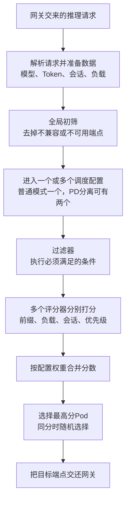
```mermaid
flowchart TB
    Req["网关交来的推理请求"] --> Parse["解析请求并准备数据<br/>模型、Token、会话、负载"]
    Parse --> Screen["全局初筛<br/>去掉不兼容或不可用端点"]
    Screen --> Profile["进入一个或多个调度配置<br/>普通模式一个，PD分离可有两个"]
    Profile --> Filter["过滤器<br/>执行必须满足的条件"]
    Filter --> Score["多个评分器分别打分<br/>前缀、负载、会话、优先级"]
    Score --> Weight["按配置权重合并分数"]
    Weight --> Pick["选择最高分Pod<br/>同分时随机选择"]
    Pick --> Result["把目标端点交还网关"]
```

“准备数据”阶段称为数据生产`DataProducer`。它不会直接选择`Pod`，而是为后面的过滤器和评分器准备事实。例如，分词插件把文字转换成`Token ID`，前缀插件计算每个端点匹配了多少块，会话插件读取请求头或`Cookie`中的会话编号，数据层则定期从端点采集负载和模型信息。这样一来，前缀评分器只需要回答“这个端点的前缀分是多少”，不必自己处理请求解析、指标抓取和节点发现。

`llm-d Router`提供两种前缀位置来源：

- **近似模式**把`Token ID`切成固定大小的块，查询哪些端点最近处理过相同前缀。完成选择后，它把所选端点写入本地索引，相当于预测“请求发过去以后，这些块很可能会被缓存”。索引按端点限制容量并采用`LRU`思路淘汰旧记录。它不需要引擎发事件，但后端失败、缓存主动淘汰或路由器重启都会让预测与现实出现偏差。
- **精确模式**订阅每个`vLLM`或`SGLang`端点发出的`KV Events`。`ZMQ`是一种轻量消息通信方式，端点通过它报告缓存块的创建和删除；索引器据此更新“块→端点”的关系。收到新请求后，插件使用请求的`Token`、模型、多模态标识和缓存隔离盐等信息重新生成可比较的块键，再查询连续前缀匹配。它还可以短暂加入带过期时间的预测记录，填补“请求刚分配，但引擎还没来得及发创建事件”的时间窗口。

所谓精确，是指位置来源更接近引擎的真实缓存生命周期，并不表示永远不会出错。事件丢失、事件中缺少影响哈希的字段、分词结果不一致或索引恢复不完整，仍然会降低准确性。没有可用的`TokenizedPrompt`时，精确前缀插件不会凭空猜测，而是跳过这项数据，让其他评分器继续决策。

会话保持同样被拆成两种插件：

- `session-affinity-filter`是**硬亲和**。绑定端点仍在候选集中时，它把候选集合缩小到这一个端点；端点消失时，它不会返回空集合，而是重新放开全部候选，让后续插件选择并建立新绑定。
- `session-affinity-scorer`是**软亲和**。它只给原端点增加分数，前缀、负载等其他评分仍有机会让另一个端点胜出。

绑定信息也有两种携带方法。默认方法把`Kubernetes`中的`namespace/name`编码到响应头`x-session-token`，客户端下次原样带回，路由器不需要保存会话表。另一种方法由客户端提供不透明的`x-session-id`，路由器在内存中保存带空闲过期时间`TTL`的“会话→Pod”映射。前者把目标信息交给客户端保存，后者让客户端只持有普通会话编号，但路由器需要管理状态。

在`Prefill/Decode`分离部署中，一次请求可能要分别选择负责读输入的`Prefill Pod`和负责生成答案的`Decode Pod`。`llm-d Router`可以为两个阶段配置不同调度流水线，也可以分别保存两个会话绑定，避免把“上次的`Prefill`节点”和“上次的`Decode`节点”误当成同一个目标。

#### 方案优点

- **调度能力可以组合**：模型兼容性、前缀、会话、负载和优先级分别由插件处理，团队可以按场景替换过滤器、评分器和权重。
- **可以逐步提高索引精度**：接入初期可以使用部署简单的近似模式，条件成熟后再切换到基于`KV Events`的精确模式。
- **硬亲和与软亲和都能表达**：必须回到原节点时使用过滤器，只想优先原节点时使用评分器，不必把所有会话采用同一种强制策略。
- **支持`PD`分离的双阶段选择**：`Prefill`与`Decode`可以配置不同流水线和会话绑定，适合分离式推理架构。

#### 方案缺点

- **配置和排障门槛较高**：数据生产、过滤、评分、权重和不同调度配置互相影响，结果不符合预期时需要逐层检查。
- **精确模式依赖完整事件链**：推理引擎、`ZMQ`传输、分词结果或缓存隔离字段任一环节不一致，都可能造成漏记或错记。
- **精确并不等于强一致**：事件可能延迟或丢失，索引恢复也需要时间；路由器仍要准备缓存信息不可用时的降级策略。
- **部分会话状态仍在内存中**：使用`x-session-id`映射时，路由器需要维护带`TTL`的会话表，多副本部署必须考虑请求落点和状态恢复。

#### 适用场景

适合采用`Kubernetes Gateway API`，需要把模型兼容性、前缀、会话和负载组合起来，并希望逐步从近似索引升级到事件索引的中大型推理平台。

### `AIBrix`：会话键与有界负载前缀路由

项目地址：[项目仓库](https://github.com/vllm-project/aibrix)、[路由架构说明](https://github.com/vllm-project/aibrix/blob/72726f5eaeaab8b6f0a1f4b62c588e4ec9903e86/docs/source/designs/aibrix-router.rst)、[`KV Event Sync`说明](https://github.com/vllm-project/aibrix/blob/72726f5eaeaab8b6f0a1f4b62c588e4ec9903e86/docs/source/features/kv-event-sync.rst)、[与`Gateway API Inference Extension`的集成示例](https://github.com/vllm-project/aibrix/tree/72726f5eaeaab8b6f0a1f4b62c588e4ec9903e86/samples/ai-gateway-integration)。

#### 方案设计

`AIBrix`提供的是一套面向`Kubernetes`的大模型服务基础设施，智能网关只是其中一部分。它的网关插件接在`Envoy Gateway`外部处理接口上，并在本地缓存高频更新的`Pod`指标。这样每次请求不必临时访问所有后端询问“你现在忙不忙”，而是直接读取最近一次收集到的快照，缩短路由热路径。

:::info 它与`Gateway API Inference Extension`是什么关系
`AIBrix`原生路由器**不是**`Gateway API Inference Extension`的`EPP`实现。两者都可以通过`Envoy ext_proc`参与请求处理，但使用了不同的资源和路由逻辑。可以先把`ext_proc`理解为一条通用的“网关向外部程序咨询”通道：两个方案走了同一类通道，不代表咨询的问题和返回结果遵循同一套方案。

- `AIBrix`原生路径是“`Envoy Gateway`→`AIBrix Gateway Plugin`→选择`Pod`→返回`target-pod`请求头”。候选节点、负载快照和路由算法由`AIBrix`自己管理，不要求创建`InferencePool`。
- `AIBrix`仓库也提供了一个可选集成示例。该示例关闭`AIBrix`内置网关，另外创建`InferencePool`，并部署`Gateway API Inference Extension`官方`EPP`镜像。此时执行端点选择的是官方`EPP`，不是`AIBrix Gateway Plugin`。

因此，二者的准确关系是“`AIBrix`可以与`InferencePool + EPP`组合部署”，而不是“`AIBrix`原生路由器基于`Gateway API Inference Extension`实现”。
:::

请求首先按模型、`LoRA`和健康状态得到可用`Pod`列表，然后再执行选定的路由策略。策略可以通过全局配置指定，也可以通过请求头选择。以本文最关心的会话和前缀策略为例，流程如下：

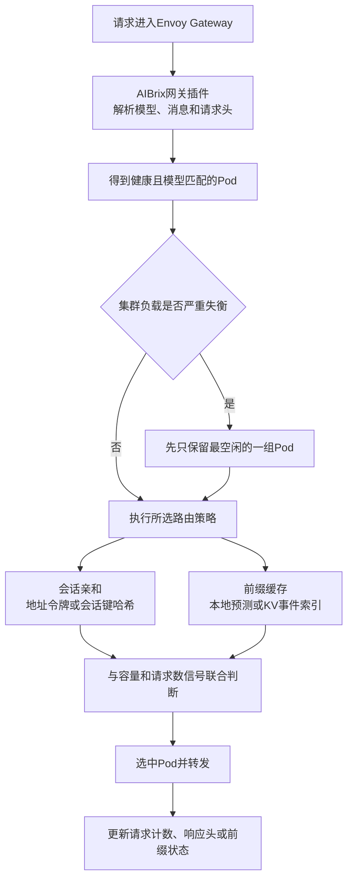
```mermaid
flowchart TB
    Req["请求进入Envoy Gateway"] --> Plugin["AIBrix网关插件<br/>解析模型、消息和请求头"]
    Plugin --> Ready["得到健康且模型匹配的Pod"]
    Ready --> Gate{"集群负载是否严重失衡"}
    Gate -->|"是"| Cool["先只保留最空闲的一组Pod"]
    Gate -->|"否"| Strategy["执行所选路由策略"]
    Cool --> Strategy
    Strategy --> Session["会话亲和<br/>地址令牌或会话键哈希"]
    Strategy --> Prefix["前缀缓存<br/>本地预测或KV事件索引"]
    Session --> Blend["与容量和请求数信号联合判断"]
    Prefix --> Blend
    Blend --> Pod["选中Pod并转发"]
    Pod --> Update["更新请求计数、响应头或前缀状态"]
```

会话亲和有两条路径。第一条适合客户端愿意保存服务端返回值的场景：

1. 第一次请求没有`x-session-id`，网关从可用`Pod`中选择一个目标；
2. 网关把目标的`IP:Port`做`Base64`编码，放进响应头`x-session-id`；
3. 客户端后续带回该值，网关解码后在当前健康列表中查找相同地址；
4. 如果原`Pod`已缩容或故障，网关选择新的可用`Pod`并签发新的值。

`Base64`只是一种便于传输的编码，不是加密，也不能证明请求者身份。这个响应头因此只能用于路由，不能用于认证和授权。

第二条路径适合调用方已经有稳定会话编号的场景。客户端发送`x-aibrix-session-key`后，网关对“会话键＋候选`Pod`地址”计算`Rendezvous Hash`得分，并选择得分最高的`Pod`。网关不需要保存会话表；只要候选集合不变，同一个键就会得到同一个结果。节点增减时，只有一部分会话需要迁移，比简单取模更稳定。

`prefix-cache`策略也有两种状态来源：

- 默认本地模式先把输入转换为字符或`Token`序列，再生成前缀哈希并查询本地`PrefixHashTable`。找不到命中时选择当前请求较少的`Pod`，随后把“这些前缀已分配给该`Pod`”写入索引。它部署简单，但本质仍是根据路由历史做预测。
- 开启`KV Event Sync`后，`vLLM`通过`ZMQ`发布`BlockStoredEvent`和`BlockRemovedEvent`。前者表示哪些缓存块刚被保存，后者表示哪些块已被删除。`KV Event Manager`消费事件，`Sync Prefix Cache Indexer`更新位置表，网关再查询这份事件驱动的索引。该模式要求使用远程分词器，目的是让网关与模型实例对同一段输入得到一致的`Token`结果。

有了匹配结果以后，`AIBrix`并不是直接选择“命中最多”的节点。它先按前缀匹配百分比从高到低排序；匹配比例相同，再优先当前运行请求较少的节点。随后用全体节点请求数的平均值和标准差划出一个负载范围，超过范围的缓存节点会被跳过；如果没有任何命中节点满足条件，就回退到全局请求数最少的节点。当前实现还会在多数非独占策略后自动混合容量感知负载分，进一步避免单一策略持续把流量推向热点。

这套实现直观展示了“缓存亲和必须有负载护栏”：`Pod-A`即使保存了完整前缀，如果队列已经很长，也可能不如让较空闲的`Pod-B`重新计算。

#### 方案优点

- **会话保持有两种实用选择**：调用方既可以回传网关签发的目标令牌，也可以提供稳定会话键并使用`Rendezvous Hash`，后者不需要服务端会话表。
- **同一网关可以切换多种策略**：会话、前缀、最少请求和`PD`分离等能力可以根据全局配置或请求头选择。
- **缓存选择带有负载边界**：标准差护栏和容量感知混合会阻止流量持续压向某个热缓存节点。
- **前缀索引可以从预测升级为事件驱动**：简单环境可先用本地`PrefixHashTable`，需要更准确状态时再启用`KV Event Sync`。

#### 方案缺点

- **地址令牌不是安全凭证**：`Base64 IP:Port`只是编码，既不加密也不认证，只能用于路由，不能直接承担身份校验。
- **本地预测表会失真**：网关重启会丢失索引，引擎淘汰缓存后，本地历史记录也可能暂时仍认为缓存存在。
- **事件模式引入额外依赖**：需要`ZMQ`事件、远程分词器和事件恢复机制，链路比本地预测模式更复杂。
- **多网关副本仍需核对状态覆盖**：如果各副本收到的缓存事件或负载快照不完整，就可能形成不同的路由判断。

#### 适用场景

适合希望在同一套`Kubernetes`网关中组合会话键、前缀、负载和`PD`分离策略，并愿意按精度需求选择本地索引或事件索引的团队。

### `NVIDIA Dynamo`：把缓存层级纳入成本函数

项目地址：[项目仓库](https://github.com/ai-dynamo/dynamo)、[路由器官方文档](https://docs.nvidia.com/dynamo/components/router)、[缓存感知路由原理](https://github.com/ai-dynamo/dynamo/blob/d481e51e3f5360b0a1de4e467f74adaaaa1c97b3/docs/fern/pages/developer-guide/knowledge-base/concepts/system-architecture/kv-aware-routing.md)。

#### 方案设计

`NVIDIA Dynamo`位于推理引擎之上，用于把多个`vLLM`、`SGLang`或`TensorRT-LLM`实例协调成一套分布式推理服务。它的路由器不把问题简化为“命中了多少块”，而是尝试回答一个更接近用户体验的问题：**如果把这次请求交给某个节点，从现在到开始生成答案，还需要付出多少工作量**？

一次请求进入后，请求入口先按模型使用的分词规则把文字转换为`Token`并规范化请求。路由器去掉模型不兼容、显式禁止或已经超过忙碌阈值的节点，再为剩余节点查询两类状态：

- 缓存索引回答“这个请求的连续前缀在该节点的`GPU`、主机内存、磁盘或共享缓存中各有多少块”；
- 活动负载跟踪器回答“该节点已经接下了多少未完成的`Prefill`工作、`Decode`缓存块和活动请求”。

这些状态进入同一个成本模型：

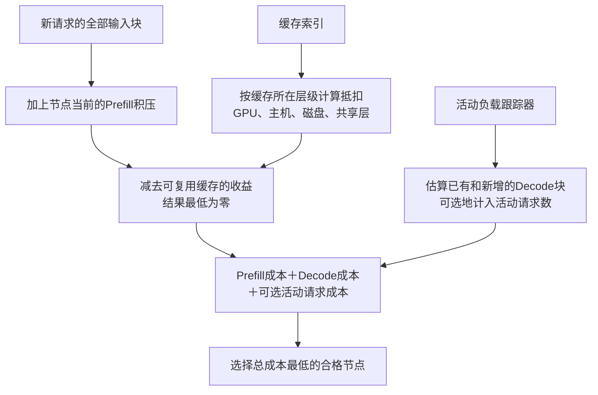
```mermaid
flowchart TB
    Req["新请求的全部输入块"] --> Base["加上节点当前的Prefill积压"]
    Index["缓存索引"] --> Credit["按缓存所在层级计算抵扣<br/>GPU、主机、磁盘、共享层"]
    Base --> Subtract["减去可复用缓存的收益<br/>结果最低为零"]
    Credit --> Subtract
    Load["活动负载跟踪器"] --> Decode["估算已有和新增的Decode块<br/>可选地计入活动请求数"]
    Subtract --> Total["Prefill成本＋Decode成本<br/>＋可选活动请求成本"]
    Decode --> Total
    Total --> Pick["选择总成本最低的合格节点"]
```

图里的“抵扣”不是说不同层级速度相同。`GPU`显存中的缓存通常可以直接参与计算，主机内存、磁盘或共享层中的缓存还需要搬运，所以每层可以配置不同权重。原始`Prefill`成本等于节点已有的`Prefill`积压加上新请求的输入块，再减去多层缓存带来的抵扣；结果不会小于零。然后再加上节点当前与本次请求预计占用的`Decode`块，以及可选的活动请求成本。最终选择总成本最低的节点。

举个简化的例子：`Pod-A`能复用`80`块，但前面还有`100`块工作；`Pod-B`只能复用`20`块，却几乎没有排队。只看命中量会选`Pod-A`，成本模型则可能发现`Pod-B`更早完成剩余的`Prefill`。反过来，如果两者负载接近，`Pod-A`的大量缓存抵扣就会让它胜出。

缓存状态默认来自推理引擎发布的缓存块创建和删除事件。路由器据此维护前缀索引；如果引擎不能可靠发布事件，可以使用`--no-router-kv-events`，让路由器根据自己的分配结果预测缓存位置，并通过`TTL`或实验性的容量受限`LRU`清理记录。事件模式更接近事实，预测模式更容易接入但会产生误差。活动负载则来自请求生命周期：请求分配时增加负载，首个输出`Token`到来时标记`Prefill`结束，请求完成后释放对应记录。

`X-Dynamo-Session-ID`首先只是一个会话身份。只有显式设置`--router-session-affinity-ttl-secs`后，路由亲和才会启用；仅发送请求头不会自动改变请求去向。启用后，第一条成功分派的请求建立“会话→目标”的内存绑定：

- `hard`硬模式直接发往绑定目标；目标已经失效时，删除绑定并执行一次正常选择；
- `soft`软模式把绑定目标作为建议交给正常选择流程。默认选择器会尽量保留它，但自定义策略仍可选择其他节点，并在成功分派后更新绑定。

多个路由副本会通过事件平面尽力同步会话绑定，但这是允许丢失、延迟和乱序的尽力同步，不是权威数据库。路由器重启会清空绑定，各副本的空闲过期计时也可能暂时不同。严格亲和仍应在入口层保证同一会话落到同一路由副本，或者使用外部权威映射。会话亲和只决定发给谁，不会替后端创建会话，也不会保存聊天消息。

在`Prefill/Decode`分离模式下，路由器分别选择两个阶段的工作节点，真正搬运`KV Cache`则由`NIXL`等传输机制完成。`NIXL`全称为`NVIDIA Inference Xfer Library`，其中`Xfer`是`Transfer`，也就是“传输”的缩写。选择与传输是两个职责：路由器知道“应该从哪里到哪里”，传输库负责“怎样把数据搬过去”。

#### 方案优点

- **比较的是预计工作量，不只是命中块数**：成本函数同时考虑未命中的`Prefill`、已有排队、`Decode`占用和活动请求，更接近用户实际等待时间。
- **能够区分缓存所在层级**：`GPU`、主机内存、磁盘和共享层可以设置不同抵扣权重，不会把“直接可用”和“还要跨网络搬运”视为同样便宜。
- **事件模式与预测模式可以取舍**：引擎能发可靠事件时使用真实生命周期索引，不能发事件时仍可通过带`TTL`或容量限制的预测索引运行。
- **会话亲和与`PD`分离能力完整**：支持`hard`和`soft`会话模式，并能分别选择`Prefill`与`Decode`节点。

#### 方案缺点

- **控制面和调参复杂**：缓存层权重、`Prefill`与`Decode`成本、忙碌阈值等参数都会影响结果，需要结合真实工作负载校准。
- **依赖事件和请求生命周期追踪**：事件遗漏、首`Token`状态更新不及时或请求结束记录未释放，都会让成本估算偏离现实。
- **会话同步不是强一致数据库**：多路由副本之间允许事件丢失、延迟和乱序，严格会话亲和仍需要入口粘滞或外部权威映射。
- **小规模部署收益有限**：单机或单模型节点较少时，多层索引、事件平面和活动负载跟踪可能比简单负载均衡更重。

#### 适用场景

适合多节点、存在多级缓存、需要精细估算剩余工作量，或者采用`Prefill/Decode`分离的推理集群。

### `SGLang Router`：实验性的缓存感知与进程内粘滞

项目地址：[SGLang项目仓库](https://github.com/sgl-project/sglang)、[SGLang Router源码目录](https://github.com/sgl-project/sglang/tree/06992c92ad4494fe9f9636e75be3e35040512447/experimental/sgl-router)、[外部`KV Indexer`说明](https://github.com/sgl-project/sglang/blob/06992c92ad4494fe9f9636e75be3e35040512447/experimental/sgl-router/sgl-kv-indexer/README.md)。

#### 方案设计

当前仓库把`sgl-router`放在`experimental`实验目录中，因此应把它看成快速演进中的路由实现，而不是已经固定不变的长期接口。它服务单个模型，可以从静态地址或`Kubernetes EndpointSlice`发现后端；`EndpointSlice`是`Kubernetes`用来记录一组服务端点的资源。路由器在这些端点上执行缓存感知`cache_aware`和会话粘滞`sticky`等策略。

`cache_aware`策略先使用与模型一致的分词器得到`Token`，再查询前缀位置。当前实现有两种位置来源：

- 本地`Radix Tree`。`Radix Tree`可以理解为一棵把共同开头合并保存的前缀树。路由器消费`SGLang`工作节点的缓存事件，把块的创建、删除和所在存储层更新到树中，然后沿着新请求的块序列向下查找，得到每个节点连续匹配到的深度。
- 外部`KV Indexer`。每个工作节点通过`ZMQ`发布`BlockStored`、`BlockRemoved`和全量清除事件，一个桥接进程再通过适合服务间通信的`gRPC`接口，把事件集中写入独立索引服务。路由器查询该服务获得“每个健康节点连续拥有多少前缀块”，外部索引结果会替代本地树作为缓存信号。

得到前缀匹配后，请求仍不会无条件发往命中最多的节点：

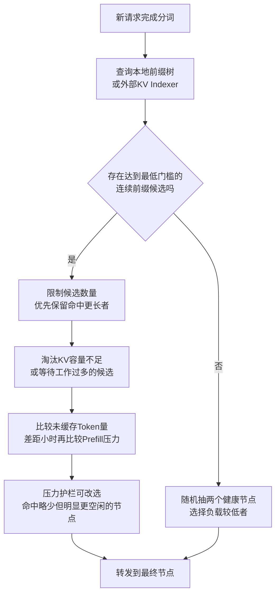
```mermaid
flowchart TB
    Req["新请求完成分词"] --> Query["查询本地前缀树<br/>或外部KV Indexer"]
    Query --> Match{"存在达到最低门槛的<br/>连续前缀候选吗"}
    Match -->|"否"| P2C["随机抽两个健康节点<br/>选择负载较低者"]
    Match -->|"是"| Bound["限制候选数量<br/>优先保留命中更长者"]
    Bound --> Capacity["淘汰KV容量不足<br/>或等待工作过多的候选"]
    Capacity --> Compare["比较未缓存Token量<br/>差距小时再比较Prefill压力"]
    Compare --> Guard["压力护栏可改选<br/>命中略少但明显更空闲的节点"]
    Guard --> Pod["转发到最终节点"]
    P2C --> Pod
```

图中的“最低门槛”可以按匹配`Token`数或匹配比例设置，防止只有很短公共开头的节点也被当成高价值候选。候选先按命中长度和`Prefill`压力排序，再限制数量，避免在大集群中比较所有节点。最终决策主要看还需重新计算多少`Token`；如果两个候选的剩余工作相差不大，压力护栏可以选择排队更少的节点。没有有效缓存候选时，使用`Power of Two Choices`，简称`P2C`：随机抽取两个节点，再选择其中负载较低的一个，以较低开销获得通常优于纯随机的均衡效果。

外部`KV Indexer`是软状态服务。当前实现明确要求一个部署只运行一个索引服务：索引在内存中，没有持久化和主从复制；重启后为空，桥接断线期间的事件也不会重放，工作节点死亡后留下的位置还可能继续存在。查询超时、连接失败或索引过载时，路由器会牺牲缓存亲和，回退到最小活动负载；如果双方请求格式不一致，则返回`503`，因为这不是可以忽略的“没有命中”，而是接口契约错误。

`sticky`策略则不检查请求内容。它从指定请求头读取路由键，在当前路由进程内维护“路由键→工作节点`URL`”映射：新键用后备策略选择一个节点，已知键直接复用，目标离开健康集合后重新选择，长时间未访问的映射由后台任务清理。两个并发的首请求可能短暂选到不同节点，后写入的映射会成为后续请求的目标。

#### 方案优点

- **与`SGLang`缓存事件直接衔接**：本地`Radix Tree`可以根据缓存块创建和删除事件更新，比只看历史路由记录更接近引擎状态。
- **本地与外部索引可以选择**：小规模部署可以直接在路由器进程内查询，大一些的部署可以把事件集中到外部`KV Indexer`。
- **缓存命中带有压力护栏**：命中必须达到最低门槛，节点容量或排队压力过高时还可以改选更空闲节点。
- **索引故障有明确回退路径**：查询超时或服务过载时可以放弃缓存信号，回退到最小活动负载，而不是让全部请求失败。

#### 方案缺点

- **当前仍属于实验性组件**：代码位于`experimental`目录，接口、配置和行为可能继续快速变化，升级前需要重新验证。
- **外部索引当前存在单点限制**：索引只保存在单实例内存中，没有持久化、主从复制和断线事件重放。
- **陈旧位置可能残留**：桥接中断或工作节点死亡后，索引中的旧记录不一定立即删除，路由结果可能暂时失真。
- **`sticky`状态只在当前进程有效**：多个路由副本不会同步映射，进程重启后也会丢失，不适合直接承担严格的全局会话绑定。

#### 适用场景

更适合`SGLang`生态内的实验、单路由器部署和算法验证。采用外部索引进入生产前，还需要补齐高可用、事件重放和陈旧节点清理能力。

### `LMCache`：把短命的显存缓存变成独立缓存服务

项目地址：[项目仓库](https://github.com/LMCache/LMCache)、[官方文档](https://docs.lmcache.ai/)、[架构说明](https://github.com/LMCache/LMCache/blob/5001a52cd9ec315f4a7ce1cc7ca9e02cde1f7fb0/docs/source/developer_guide/architecture.rst)。

#### 方案设计

前面的方案都在努力把请求送到“可能已经有缓存”的节点。`LMCache`换了一个思路：即使请求没有回到原来的推理进程，也可以把缓存从引擎之外的缓存服务加载回来。它不是网关或负载均衡器，而是连接推理引擎与多级存储的`KV Cache`管理层。

在推荐的多进程模式`MP mode`中，`LMCache`作为独立服务运行，`vLLM`等推理实例通过连接器与它通信。同一节点上的多个推理实例可以共享一个缓存服务，并分别扩缩容。`L0`可以理解为推理引擎正在使用的`GPU`显存缓存，`L1`通常是`LMCache`管理的服务器内存，`L2`则可以是本地磁盘、`Redis/Valkey`、`S3`兼容对象存储、`Mooncake Store`或`NIXL`存储后端。

一次重复前缀请求的流程如下：

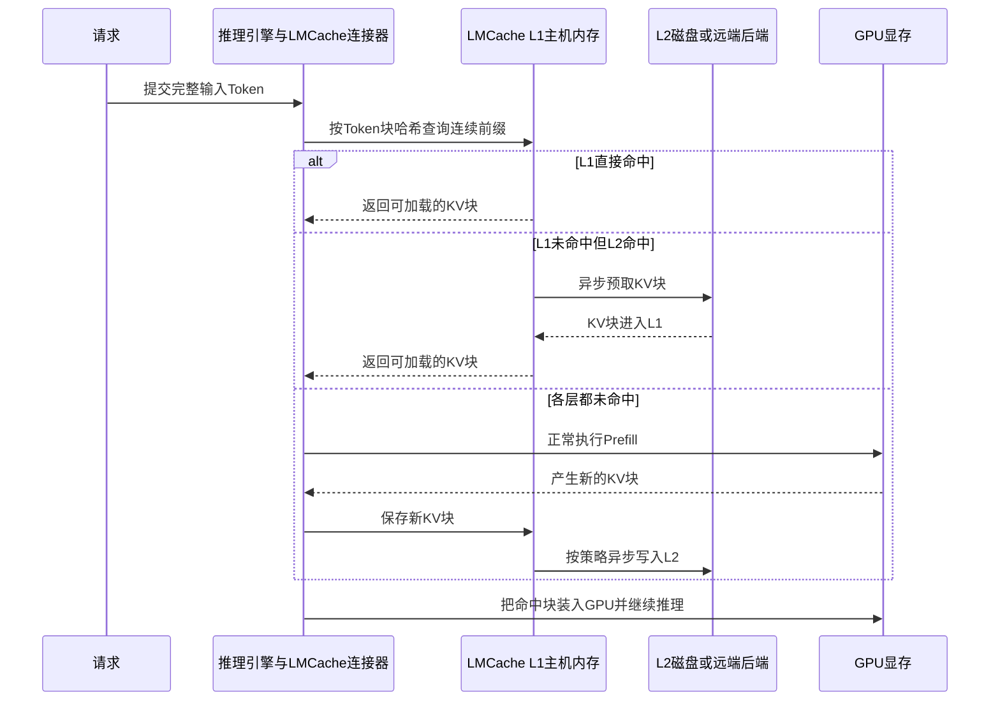
```mermaid
sequenceDiagram
    participant R as 请求
    participant V as 推理引擎与LMCache连接器
    participant L1 as LMCache L1主机内存
    participant L2 as L2磁盘或远端后端
    participant G as GPU显存

    R->>V: 提交完整输入Token
    V->>L1: 按Token块哈希查询连续前缀
    alt L1直接命中
        L1-->>V: 返回可加载的KV块
    else L1未命中但L2命中
        L1->>L2: 异步预取KV块
        L2-->>L1: KV块进入L1
        L1-->>V: 返回可加载的KV块
    else 各层都未命中
        V->>G: 正常执行Prefill
        G-->>V: 产生新的KV块
        V->>L1: 保存新KV块
        L1->>L2: 按策略异步写入L2
    end
    V->>G: 把命中块装入GPU并继续推理
```

连接器先按`Token`序列切块并计算键，查询最长可复用前缀。如果`L1`命中，缓存从主机内存搬回`GPU`；如果只在`L2`命中，`LMCache`先把数据预取到`L1`，再交给引擎；如果完全未命中，模型照常执行`Prefill`，连接器把新产生的`KV`块保存到`L1`，存储控制器再按策略异步写入`L2`。异步写入的目标是尽量不让磁盘或远端网络阻塞模型主计算线程。

这里真正复用的是可加载的`KV`数字数据，不只是“某个节点可能有缓存”的目录记录。因此，它能跨请求、会话和引擎进程复用，也能让部分缓存熬过推理进程重启。代价是数据体积很大，加载前还要执行查询、锁定、传输和显存写入；如果搬运时间比重新`Prefill`更长，命中反而没有价值。

`LMCache`还支持两类跨节点路径：

- 在`Prefill/Decode`分离中，`Prefill`实例计算当前请求的缓存，`NIXL`等传输连接器把它交给`Decode`实例，这是当前请求的一次性交接；
- 在`P2P`共享中，每个节点的`LMCache`服务贡献本地`L1`内存。请求节点本地未命中时，协调器只帮助发现存活节点，真正的数据由请求节点通过`RDMA`等通道直接从缓存拥有者读到自己的`L1`，协调器不经过数据流。

这两条路径和长期存储不是一回事：一次性交接解决`PD`阶段衔接，`P2P`解决节点间热缓存共享，`L2`后端解决容量与持久性。生产环境应优先评估独立运行的`MP mode`；旧的进程内跨实例模式已经在官方文档中标为旧路径。

#### 方案优点

- **复用的是真实`KV`数据**：它不仅记录“缓存可能在哪里”，还可以把命中的`KV`块重新加载到推理引擎，降低请求必须回到原进程的限制。
- **缓存生命周期可以脱离推理进程**：独立`MP mode`让多个推理实例共享缓存服务，实例重启或独立扩缩容时，外部层中的缓存不一定随之消失。
- **存储层次丰富**：可以在主机内存、本地磁盘和多种远端后端之间安排容量、速度与成本，并异步把新缓存写入较慢层。
- **同时覆盖`PD`交接和跨节点共享**：传输连接器可完成当前请求的`Prefill/Decode`交接，`P2P`或`L2`后端则用于跨请求复用。

#### 方案缺点

- **命中不代表一定更快**：查询、锁定、跨网络传输和写回`GPU`都需要时间；短前缀或慢网络下，重新`Prefill`可能反而更便宜。
- **需要管理大体积缓存数据**：容量、淘汰、带宽、远端存储和故障恢复都会成为新的运维对象，不再只是维护一张轻量位置表。
- **不能替代请求路由器**：`LMCache`负责查找和搬运缓存，不负责在多个推理节点之间完成模型兼容性与负载选择。
- **不同路径解决的问题不同**：`PD`一次性交接、`P2P`热缓存共享和`L2`长期容量不能混为一谈，部署时需要分别规划。

#### 适用场景

适合长上下文、多轮智能体、重复文档和跨实例复用率高，并且缓存搬运成本明显低于重新`Prefill`的场景。

### `Mooncake`：元数据走控制面，缓存数据走高速直达路径

项目地址：[项目仓库](https://github.com/kvcache-ai/Mooncake)、[官方文档](https://kvcache-ai.github.io/Mooncake/)、[`Mooncake Store`设计](https://github.com/kvcache-ai/Mooncake/blob/1a0c0a44214ff61a8a4b2e9d90dfb023dd4703ed/docs/source/design/store/mooncake-store.md)。

#### 方案设计

`Mooncake`主要提供两块能力：`Transfer Engine`负责高速搬运数据，`Mooncake Store`负责把多台机器的内存和`SSD/NVMe`组织成分布式对象缓存。它本身不是会话路由器；`vLLM`、`SGLang`或`LMCache`等上层组件决定何时保存、查询和加载`KV Cache`，`Mooncake`负责放在哪里以及怎样高效搬运。

`Transfer Engine`先把各节点可以访问的内存、显存或存储区域注册成“段”，并把网络地址、设备和可访问缓冲区等元数据登记到`etcd`、`Redis`或`HTTP`元数据服务。传输发起方找到目标段后，可以批量提交读写任务。引擎根据数据所在位置和机器拓扑选择`TCP`、`RDMA`、`NVLink`、`NVMe-oF`等可用通道，也可以聚合多张网卡带宽；某条路径临时失败时尝试其他可达路径。

`Mooncake Store`在这条传输能力之上增加对象目录、空间分配、副本和淘汰。最容易混淆的是`Master Service`与数据节点的关系：`Master Service`只管理“对象在哪里”的元数据，不搬运大块`KV`数据。客户端既可以发起`Put/Get`，也可以贡献一段本机内存作为存储空间，实际数据在客户端与存储客户端之间直接传输。

```mermaid
sequenceDiagram
    participant A as 推理节点A
    participant M as Mooncake Master
    participant S as 提供内存或SSD的存储节点
    participant B as 推理节点B

    A->>M: PutStart申请对象空间与副本位置
    M-->>A: 返回目标段和地址元数据
    A->>S: Transfer Engine直接写入KV对象
    A->>M: PutEnd确认写入完成
    B->>M: 查询对象可用副本位置
    M-->>B: 返回完整副本的地址元数据
    B->>S: Transfer Engine直接读取KV对象
    S-->>B: 数据通过RDMA或其他通道直达
```

写入时，`PutStart`先让`Master Service`分配空间和副本位置；调用方再通过`Transfer Engine`直接把对象写到相应存储段；全部写完后用`PutEnd`把副本标记为可用。读取时，调用方先查询可用副本，再选择一个完整副本并直接读取。大对象可以切片放到不同段并行传输，同一对象也可以保存多个副本来分散热点。

控制面和数据面分离带来两个好处：`Master Service`不需要吞吐巨大的`KV`字节流；存储节点可以独立扩缩容，推理引擎重启也不会天然清空共享缓存。但这并不意味着没有运维成本：默认单`Master`模式有单点故障，高可用模式需要多`Master`与`etcd`选主；传输引擎还依赖正确的内存注册、网卡拓扑和网络权限。缓存数据是否值得跨网络读取，也必须与重新计算成本比较。

在`PD`分离场景中，`MooncakeConnector`可以把当前请求的`KV`从`Prefill`节点传给`Decode`节点；在跨请求共享场景中，`MooncakeStoreConnector`按块哈希把缓存写入共享池，其他实例再按相同哈希读取。前者强调实时传输，后者强调对象的保存、查找和复用，二者可以同时存在。

#### 方案优点

- **大块数据不经过`Master Service`**：控制面只返回对象位置，真实`KV`数据在客户端与存储节点之间直传，避免中心元数据服务成为数据带宽瓶颈。
- **能够利用多种高速通道**：传输引擎可根据设备和拓扑选择`TCP`、`RDMA`、`NVLink`或`NVMe-oF`，也可以聚合多张网卡带宽。
- **存储节点可以独立扩展**：多台机器的内存和`SSD/NVMe`可以组成共享池，对象还可以切片、保存多副本并从不同位置读取。
- **既支持实时`PD`传输，也支持跨请求复用**：`MooncakeConnector`负责阶段间交接，`MooncakeStoreConnector`负责将缓存对象放入共享池。

#### 方案缺点

- **它不是会话或缓存感知路由器**：上层仍需决定请求发给谁，以及什么时候值得查询和搬运远端缓存。
- **高速能力依赖基础设施**：内存注册、网卡拓扑、网络权限和传输通道必须正确配置，普通网络环境未必能获得同等收益。
- **`Master Service`需要单独保证高可用**：默认单`Master`存在单点故障，多`Master`部署还需要`etcd`选主和相应运维。
- **远端命中仍有搬运成本**：对象即使存在，也可能因为距离远、网络拥塞或对象过小而不如本地重新计算。

#### 适用场景

适合缓存对象较大、跨节点复用价值高，并且具备高速网络、可观测性和分布式存储运维能力的集群。它可以作为`LMCache`的远端后端，也可以直接接入`vLLM`或`SGLang`；上层仍应优先争取便宜的本地命中。

## 开源方案对比

| 项目 | 主要状态来源 | 跨路由副本 | 负载联合决策 | 更适合的场景 |
| --- | --- | --- | --- | --- |
| `Higress ai-endpoint-picker` | 本地近似索引＋后端指标 | 本地索引不共享 | 是，多信号加权 | 单集群内轻量、低延迟端点选择 |
| `Gateway API EPP`参考算法 | `EPP`本地近似索引 | 多副本视图会退化 | 提案建议联合评分 | 需要标准接口和可替换调度器 |
| `llm-d Router` | 近似索引或引擎`KV Events` | 取决于索引与部署 | 是，可组合插件 | `Kubernetes`大规模推理与`PD`分离 |
| `AIBrix` | 本地预测表或`KV Event Sync` | 取决于事件覆盖和负载存储 | 是，有界负载 | 需要会话键、前缀和负载多策略组合 |
| `NVIDIA Dynamo` | 多层缓存索引＋活动负载 | 缓存事件可广播，活动与会话状态尽力同步 | 是，成本函数 | 多节点、多缓存层和分离式推理 |
| `SGLang Router` | 本地事件前缀树或外部事件索引 | 本地粘滞不共享；外部索引当前单实例 | 是，前缀收益受压力护栏约束 | `SGLang`生态内的实验和算法验证 |
| `LMCache` | 可加载的`L1/L2 KV`对象 | 缓存可跨引擎与节点 | 依赖上层路由 | 长上下文、跨进程复用和多级缓存 |
| `Mooncake` | 对象元数据＋分布式缓存数据 | 存储池可跨实例 | 依赖上层路由 | 高速传输、共享缓存池和`PD`分离 |

没有一个项目能同时做到零侵入、精确目录、无状态、多副本强一致、无网络开销和绝对负载均衡。选型本质上是在命中收益、状态复杂度、引擎耦合与故障恢复之间取舍。


## 推荐的生产架构

对于同时包含多轮会话、共享系统提示和长文档问答的自建集群，可以采用下面的分层设计。它不是要求一次性上齐所有组件，而是明确每层职责。

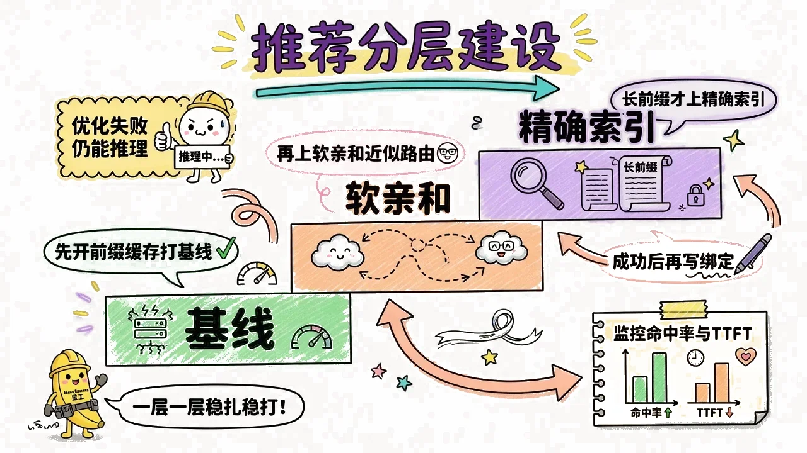

### 基本架构

```mermaid
flowchart TB
    Client["客户端程序或SDK<br/>携带稳定会话编号"] --> Gateway["API网关<br/>认证、限流、重试"]
    Gateway --> Router["推理路由器<br/>健康过滤、请求路由软亲和<br/>前缀与负载联合评分"]
    Router <--> Session[("会话映射<br/>可选的权威存储")]
    Router <--> Index["KV位置索引<br/>近似或缓存变更通知"]
    Router --> P1["推理实例A"]
    Router --> P2["推理实例B"]
    Router --> P3["推理实例C"]
    P1 <--> Shared[("共享KV层<br/>内存、固态硬盘、远端存储")]
    P2 <--> Shared
    P3 <--> Shared
    P1 --> Metrics["监控指标与请求链路"]
    P2 --> Metrics
    P3 --> Metrics
    Router --> Metrics
```

建议按三个阶段建设：

1. **先建立基线**。确保推理引擎真正开启前缀缓存；固定模板和工具顺序；采集`Token`命中率、`TTFT`、队列和`KV`利用率。
2. **再加入请求路由软亲和或近似前缀路由**。对拥塞节点设置硬上限，未命中或解析失败时回退最少请求，验证命中率提升是否真的转化为`TTFT`下降。
3. **最后评估精确索引和共享缓存**。只有长前缀重算成本足以覆盖事件、存储和传输开销时，才引入`KV Events`、点对点缓存传输或远端存储。

### 故障降级顺序

生产实现应让优化失效时仍能正确推理：

```mermaid
flowchart LR
    A["绑定节点可用"] -->|"是"| B["会话或前缀优选"]
    A -->|"否"| C["删除陈旧绑定"]
    B -->|"节点过载"| D["选择次优缓存节点"]
    B -->|"正常"| E["发送请求"]
    C --> D
    D -->|"无缓存候选"| F["选择全局最空闲节点<br/>或使用P2C"]
    F --> E
    E -->|"成功"| G["更新索引与会话TTL"]
    E -->|"失败"| H["有限次数重试<br/>暂时停用故障节点"]
```

只有在后端确认接收或响应流成功建立后，再写入新的会话绑定和近似缓存位置，能减少“请求没有成功，索引却错误地记录了缓存位置”的情况。流式响应是服务端一边生成、一边把内容发给客户端；如果客户端已经收到一部分内容，再次重试可能得到两段回答，因此必须谨慎处理。
