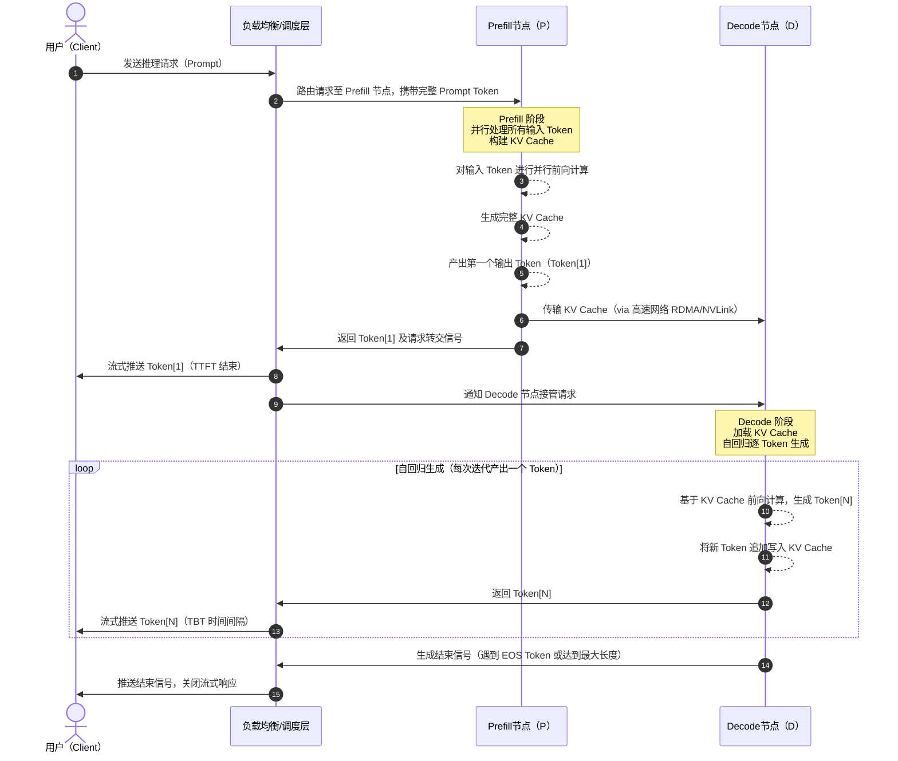

## 引言

随着大型语言模型（`LLM`）在各个领域的广泛应用，如何高效地部署和推理这些模型成为了一个关键挑战。传统的`LLM`推理架构将整个推理过程视为一个整体，但这种做法往往无法充分利用硬件资源，导致性能瓶颈和用户体验下降。

`PD（Prefill & Decode）`分离技术作为一种创新的架构设计，通过将`LLM`推理过程分解为两个独立的阶段，并针对每个阶段的特性进行专门优化，显著提升了推理效率和用户体验。本文将深入探讨`PD`分离技术的原理、实现方案以及带来的优势。

## LLM推理基础：认识Prefill和Decode

### 推理过程概述

在深入了解`PD`分离之前，我们需要先理解`LLM`的推理过程。整个`LLM`推理过程可以分为两个截然不同的阶段：

- **Prefill阶段（预填充阶段）**：这是计算密集型阶段，`LLM`并行处理所有用户输入的`token`，计算出对应的`KV Cache`，并生成第一个输出`token`。

- **Decode阶段（解码阶段）**：这是显存密集型阶段，模型基于已有的`KV Cache`，通过自回归方式顺序生成后续的`token`，每次迭代只产生一个新`token`。

### 性能评估指标

为了准确衡量`LLM`推理系统的性能，业界定义了几个关键指标：

#### Prefill性能评估指标
- **TTFT(Time To First Token)**：表示从接收用户请求到生成第一个`token`所用的时间
  
  例如：`P90 TTFT SLO = 0.4s` 意味着`90%`的请求的`TTFT`值都必须`≤0.4`秒

#### Decode性能评估指标
- **TPOT(Time Per Output Token)**：表示生成每一个响应`token`所用的平均时间

  例如：`P90 TPOT SLO = 0.04s` 意味着`90%`的请求的`TPOT`值都必须`≤0.04`秒

- **TBT(Token By Token)**：表示连续生成两个`token`之间的时间间隔，这是衡量用户体验流畅度的重要指标。`TBT`越稳定，用户感知到的响应就越连贯

### 两阶段特性深度对比

通过下表我们可以清晰地看到`Prefill`和`Decode`阶段在各个维度上的显著差异：

| **特性** | **Prefill（预填充）阶段** | **Decode（解码）阶段** |
| --- | --- | --- |
| **计算模式** | 并行计算（所有输入`Token`同时处理）| 串行计算（逐个`Token`生成）|
| **计算强度** | 计算密集型（矩阵乘法为主）| 内存带宽受限（访存频繁）|
| **GPU利用率** | 高（接近`100%`）| 极低（约`1%`）|
| **关键性能指标** | 首次`Token`时间（`TTFT`）| `Token`生成时间（`TPOT`）|
| **主要瓶颈** | 算力（`FLOPs`）| 内存带宽（`Memory Bandwidth`）|
| **显存占用** | 临时高（需缓存输入序列）| 持续高（需保存`KV Cache`）|
| **批处理优化空间** | 大（可合并多请求输入）| 小（动态调整生成任务）|
| **典型延迟** | 短（毫秒级，如`0.2`秒处理`255 Token`）| 长（秒级，如`32`秒生成`256 Token`）|
| **加速手段** | `Tensor Core`加速、`FP16/INT8`量化| 内存访问优化、`KV Cache`压缩|
| **通信需求** | 低（单节点可完成）| 高（分布式需同步`KV Cache`）|
| **调度优先级** | 高（优先保证`TTFT`）| 中（需稳定`TPOT`）|

## 为什么需要PD分离？

### Continuous Batching的挑战

现代`LLM`推理系统广泛采用`Continuous Batching`技术来提高吞吐量。然而，`Prefill`和`Decode`阶段对批处理的响应特性截然不同：

分离介绍/image.png)

- **Prefill阶段**：由于是计算密集型，随着`Batch Size`的增加，受算力限制，吞吐量增长趋势逐渐平缓
- **Decode阶段**：由于是内存带宽密集型，随着`Batch Size`的增加，吞吐量增长趋势越来越显著

### 传统架构的性能瓶颈

在传统的一体化部署模式中，当`Prefill`和`Decode`在同一设备上执行时，会出现严重的资源竞争问题：

分离介绍/image-2.png)

如上图所示，当新的请求（`request5`或`request6`）到达时，系统会优先处理新请求的`Prefill`阶段，这会直接影响正在进行的`Decode`任务（`request2/3/4`），导致：

1. **TBT不稳定**：正在生成`token`的请求被打断，响应时延增加
2. **用户体验下降**：`token`生成的连贯性被破坏
3. **资源利用率低**：两个阶段的资源需求特性无法得到针对性优化

### PD分离的解决方案

为了解决上述问题，`PD`分离架构将`Prefill`和`Decode`部署在不同规格的集群中：

分离介绍/image-1.png)

通过这种分离部署方案，配合智能的任务调度策略，可以在满足`TTFT`和`TBT`指标的前提下，结合`Continuous Batching`机制最大化`Decode`阶段的并发处理能力，从而在提供更好用户体验的同时，显著提升算力利用率。

## PD分离的核心原理

### PD分离的技术思路

`PD`分离技术的核心思想是**解耦和专门化**：

1. **阶段解耦**：将`Prefill`和`Decode`这两个阶段从逻辑和物理上完全分离
2. **设备专门化**：为每个阶段选择最适合其特性的硬件配置
3. **优化独立化**：为每个阶段采用最优的并行策略和优化技术

### 具体实现架构

在`PD`分离架构中：

- **Prefill集群**：部署在高算力`GPU`（如`A100`、`H100`）上，充分利用其强大的并行计算能力，专注于快速处理输入序列
- **Decode集群**：部署在大显存、高内存带宽的`GPU`（如大内存的`L40`等）上，专注于高效的`token`生成和`KV Cache`管理
- **网络互连**：两个集群通过高速网络（如`NVLink`或`RDMA`）传输中间状态，主要是`KV Cache`数据

### 关键技术挑战

`PD`分离系统需要解决几个核心技术问题：

1. **高效数据传输**：如何在`Prefill`和`Decode`节点间高效传输大量的`KV Cache`数据
2. **智能调度策略**：如何设计调度算法确保请求在不同阶段间的平滑流转
3. **并行策略优化**：如何为每个阶段选择最优的张量并行、流水线并行等策略
4. **状态一致性**：如何保证分布式环境下`KV Cache`的一致性和正确性

### 技术发展现状

现代`PD`分离系统（如`DistServe`、`Mooncake`等）通过以下创新技术已经成功解决了这些挑战：

- **压缩传输算法**：减少`KV Cache`传输开销
- **预测调度策略**：基于负载预测的智能任务分配
- **异步处理机制**：`overlap`计算和通信操作
- **动态负载均衡**：根据实时负载调整资源分配

这些技术创新使得`PD`分离架构能够将额外开销控制在可接受范围内，同时实现显著的性能提升。

## PD分离部署下的用户访问时序

在`PD`分离部署架构中，一次完整的用户请求涉及三个角色的协同工作：用户（`Client`）、`Prefill`节点（`P`）和`Decode`节点（`D`）。下图详细展示了这三方之间完整的数据交互时序。

### 时序关键环节说明

| 阶段 | 参与方 | 核心动作 | 关键指标 |
| --- | --- | --- | --- |
| ① 请求接入 | `Client` → 调度层 → `P` | 用户发起请求，调度层将完整`Prompt`路由至`Prefill`节点 | - |
| ② `Prefill`计算 | `P` | 并行处理所有输入`Token`，构建完整`KV Cache`，产出第一个`Token` | `TTFT` |
| ③ `KV Cache`传输 | `P` → `D` | 通过高速网络（`RDMA`/`NVLink`）将`KV Cache`从`P`传输至`D` | 传输延迟 |
| ④ `Decode`接管 | `D` | 加载`KV Cache`后以自回归方式逐步生成后续`Token` | `TPOT`/`TBT` |
| ⑤ 流式推送 | 调度层 → `Client` | 每生成一个`Token`即实时推送给用户，保证响应连贯性 | `TBT` |
| ⑥ 请求结束 | `D` → 调度层 → `Client` | 遇到终止条件后发送结束信号，关闭流式连接 | - |

### 与传统一体化架构的对比

在传统一体化部署中，`Prefill`和`Decode`在同一节点串行执行，新请求的`Prefill`计算会抢占正在进行`Decode`的`GPU`资源，导致`TBT`抖动。`PD`分离后：

- `P`节点专注于`Prefill`计算，完成后立即释放资源处理下一个新请求，不影响`D`节点的`Decode`流程
- `D`节点持续稳定地执行自回归生成，`TBT`不受新请求到达的干扰
- 调度层可以独立控制`P`和`D`集群的并发规模，实现精细化弹性扩缩容

## PD分离带来的优势

通过将`Prefill`和`Decode`阶段分离部署，这种架构在多个方面带来了显著的改进，特别是在处理长上下文（`long context`）场景时，其优势更加明显。

### 资源分配与利用的优化

#### 异构设备的充分利用
- **成本效益最大化**：`Prefill`阶段计算密集，适合部署在高算力`GPU`（如`A100`、`H100`等高端计算卡）上；而`Decode`阶段显存密集，可以采用低算力但大显存的`GPU`（如大内存的`L40`等）。这种差异化配置能够显著降低硬件总成本，同时提高每种设备的利用率。

- **弹性资源管理**：可以根据实际负载情况独立地为`Prefill`和`Decode`集群进行扩缩容。在业务高峰期，可以针对性地为瓶颈阶段分配更多资源，而不必为整个系统进行等比例扩容，大大提高了系统的弹性和成本效益。

### 性能指标的全面提升

#### 多指标同步优化
- **避免性能权衡**：在传统架构中，优化`TTFT`往往会影响`TPOT`，反之亦然。`PD`分离允许在`Prefill`阶段限制`Batch Size`以减少`TTFT`，同时在`Decode`阶段增大`Batch Size`以提高并发处理能力。这种策略能够同时改善所有关键性能指标，而不需要在不同指标之间做权衡。

- **稳定的用户体验**：通过分离部署，新请求的`Prefill`计算不会占用`Decode`阶段的资源，从而保证了稳定的`TBT`，为用户提供更加流畅和一致的交互体验。

### 技术实现的灵活性

#### 独立优化策略
- **阶段特化优化**：可以为`Prefill`和`Decode`阶段分别采用最适合的模型优化技术。例如，在`Prefill`阶段采用量化、矩阵分解等计算优化技术，而在`Decode`阶段专注于`Continuous Batching`和`KV Cache`管理优化。

- **硬件生态扩展**：这种分离架构为使用不同类型的硬件加速器打开了可能性。可以在`Prefill`阶段使用传统`GPU`，而在`Decode`阶段尝试使用专用的推理芯片或其他新兴硬件，进一步降低成本并提高效率。

### 系统可靠性与可维护性提升

#### 故障隔离与高可用
- **单点故障消除**：当`Prefill`或`Decode`集群中的某个节点出现故障时，不会直接影响另一阶段的正常运行，显著提高了系统的整体可靠性和可用性。

- **运维灵活性**：可以独立地对`Prefill`或`Decode`集群进行版本升级、配置调整或维护操作，大大减少了系统维护对线上服务的影响，提高了运维效率。

#### 扩展性与未来适应性
- **技术演进适应**：随着新的硬件技术和算法优化的出现，可以独立地在某一阶段应用新技术，而不需要重新设计整个系统架构。

- **业务场景适配**：不同的业务场景对`Prefill`和`Decode`的性能要求不同，分离架构允许根据具体业务需求灵活调整两个阶段的资源配比和优化策略。

通过这些全方位的优势，`PD`分离架构不仅解决了传统`LLM`推理系统的性能瓶颈问题，还为大模型的高效部署和应用提供了一个更加灵活、可扩展的技术方案。

## 参考资料

- https://www.eet-china.com/mp/a412848.html