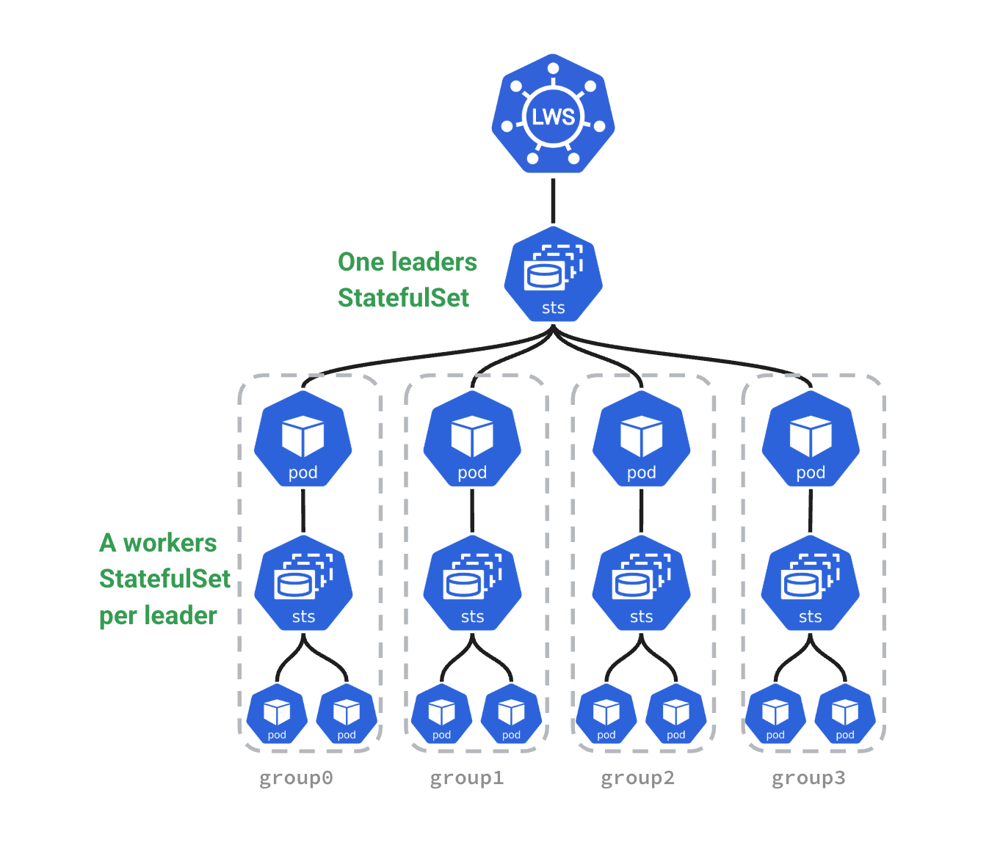
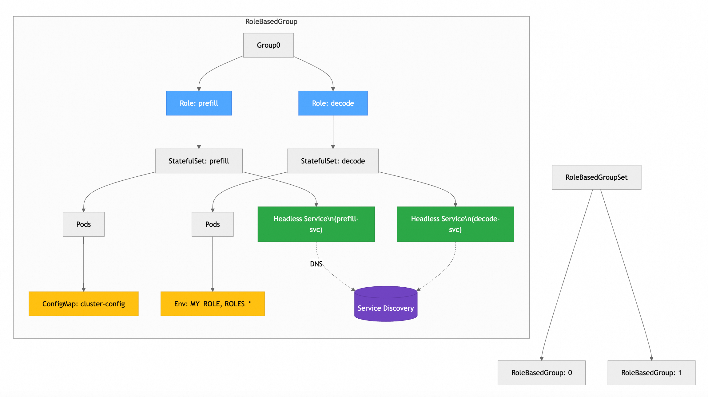
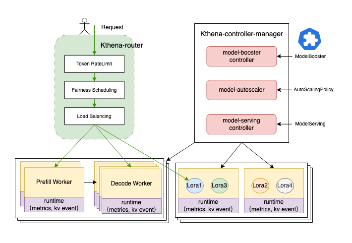
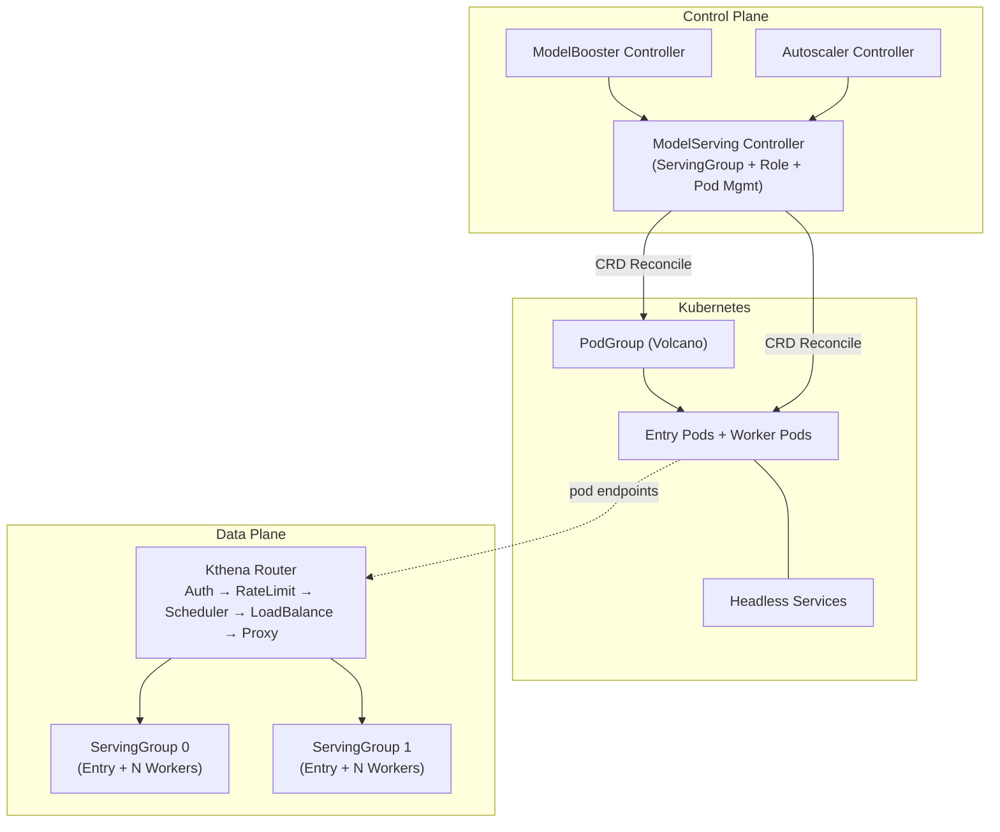
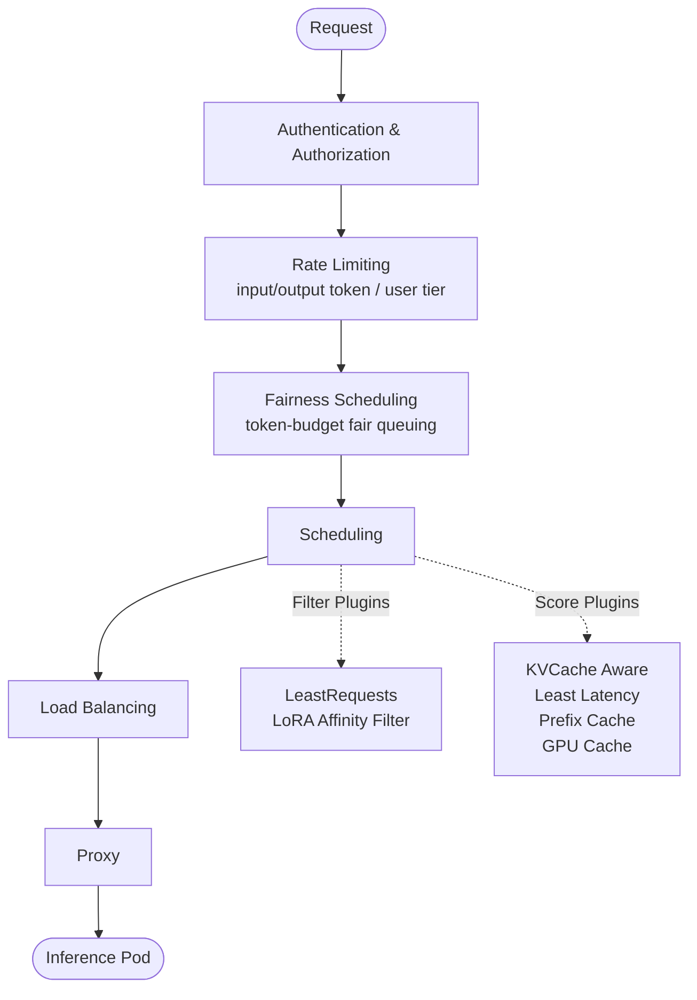
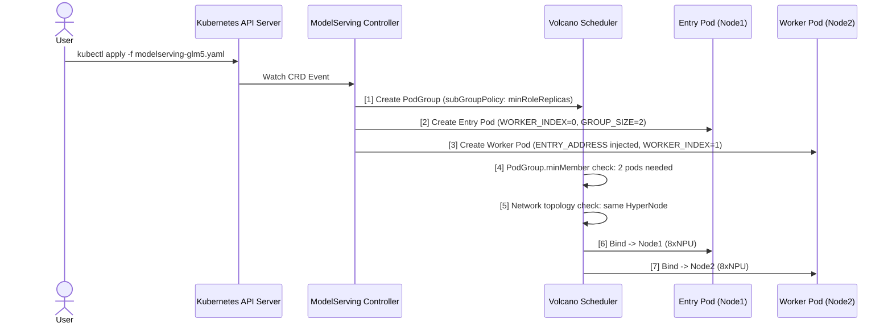
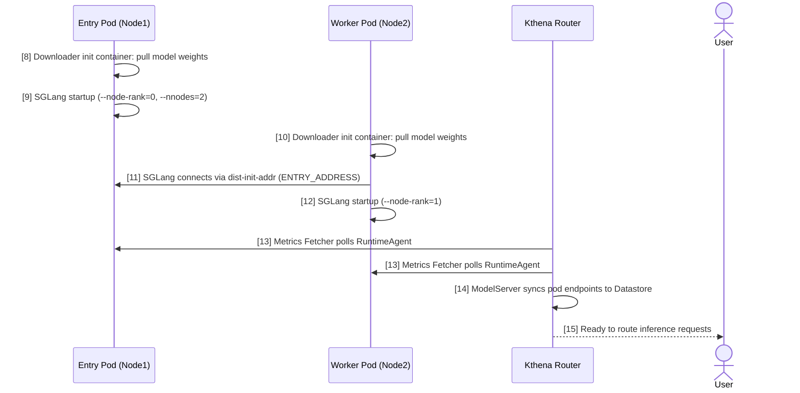

## 背景与痛点

### 直接痛点：超大模型的张量并行

随着大型语言模型（`LLM`）参数量的持续增长，以`GLM-5 744B`为代表的超大规模模型，一个完整的模型权重需要占用数百`GB`甚至`TB`级别的显存。以华为昇腾`910B3`为例，单卡显存约为`64GB`，`8`卡节点合计约`512GB`，远不足以加载`GLM-5 744B`的完整权重（`FP16`精度下约需`~1.5TB`显存）。这意味着：**单个节点无法独立承载此类超大模型的推理服务，必须依赖跨节点的多机多卡分布式部署**。

### 多机多卡部署场景下的核心痛点

在`Kubernetes`体系内实现多机多卡推理部署，工程团队面临以下典型挑战：

**资源调度层面**

- **原子性调度缺失**：标准`Deployment`/`StatefulSet`不支持`Gang Scheduling`（组调度），容易出现"半部署死锁"——部分节点的推理`Pod`已启动并占用显存，另一部分因资源不足而`Pending`，导致两侧均无法对外服务，造成资源浪费。
- **拓扑感知缺失**：多机通信延迟远高于机内通信（`RDMA`跨交换机 vs `NVLink`/`NVSwitch`），若调度器无法感知网络拓扑，可能将强耦合的多个推理`Pod`分散到通信代价高的节点，严重影响推理吞吐和延迟。
- **异构资源不兼容**：集群可能混合`GPU`与`NPU`节点，调度框架需要理解异构硬件的资源语义。

**多节点协作层面**

- **节点间启动顺序编排复杂**：以`vLLM + Ray`为例，主节点（`Leader`）需要先启动`Ray Cluster`，工作节点（`Worker`）再通过`Ray`地址加入集群後才能启动推理服务。如果`Pod`无法自动感知`Leader`地址，需要手动维护大量脚本逻辑。
- **服务发现与`DNS`耦合**：多节点推理服务需要`Entry Pod`的地址被`Worker Pod`稳定感知，原生`Deployment`无稳定主机名，`StatefulSet`的多角色管理能力非常有限。
- **故障恢复代价高**：单节点重启会导致整个推理组失效（因为分布式推理状态是整体的），需要所有节点协调重建，原生`Kubernetes`的独立`Pod`恢复逻辑无法满足此需求。

**流量路由层面**

- **模型感知路由缺失**：标准`Service`与`Ingress`只做`L4/L7`路由，不理解`LLM`请求的模型名称、`LoRA Adapter`、`KV Cache`状态等信息，无法做到智能的推理请求调度。
- **`PD`分离（`Prefill-Decode Disaggregation`）难以支撑**：`PD`分离需要将`Prefill`请求路由到算力密集型节点、`Decode`请求路由到带宽密集型节点，或组成`xPyD`拓扑灵活组合，标准路由层完全无感知。

**运维管理层面**

- **滚动升级破坏性大**：标准滚动升级无法以"推理组"为单位进行，容易打散一个正在运行的多节点推理服务。
- **`LoRA`动态加载复杂**：业务通常需要在不停服的情况下热加载多个`LoRA Adapter`，原生框架无内置支持。
- **可观测性不足**：标准`Kubernetes`指标与推理引擎指标（`KV Cache`占用率、`TTFT`、`TPOT`等）之间存在鸿沟。


## 三种技术方案对比

业界针对上述痛点提出了多种解决方案，当前较为主流的包括：`LeaderWorkerSet（LWS）`、`RoleBasedGroup（RBG）` 以及 `Kthena`。

### LeaderWorkerSet（LWS）

`LWS`（[kubernetes-sigs/lws](https://github.com/kubernetes-sigs/lws)）是`Kubernetes SIG-Apps`下的子项目，提供了一种以"Leader-Worker 组"为单位进行`Pod`复制的`API`，是目前最接近`Kubernetes`官方标准的多节点推理部署方案。



**核心设计理念**

将一个推理服务实例建模为一个`Group`，包含**1个`Leader Pod`**（接受请求、协调`Ray Cluster`等）和**若干`Worker Pod`**（参与分布式计算）。支持创建多个这样的`Group`（即多副本），每个`Group`作为一个整体进行滚动更新和拓扑调度。

```
LeaderWorkerSet
├── Replica 0 (Group)
│   ├── Leader Pod (index=0)
│   └── Worker Pod (index=1..N)
└── Replica 1 (Group)
    ├── Leader Pod (index=0)
    └── Worker Pod (index=1..N)
```

| 维度 | 说明 |
|------|------|
| 社区归属 | `kubernetes-sigs`官方 |
| `Gang Scheduling` | `Alpha`级别，需配合`Volcano`/`Coscheduling`插件 |
| 角色类型 | 仅支持`Leader`+`Worker`两种角色 |
| `PD`分离支持 | 正在孵化`DisaggregatedSet`（`KEP-766`），尚未`GA` |
| 路由能力 | 无内置路由层，需配合网关 |
| `Volcano`集成 | 需要额外配置`PodGroup` |
| 多调度器支持 | 支持`Volcano`/`Coscheduling`/`YuniKorn` |

**优点**

- 社区背书强，`kubernetes-sigs`官方项目，版本稳定性有保障
- `API`设计简洁，学习曲线低，与原生`Kubernetes`概念契合
- 与多种调度器兼容性好（`Volcano`、`scheduler-plugins`、`YuniKorn`等）
- 已经被`vLLM`、`SGLang`等主流推理框架官方文档引用为多节点部署参考方案

**缺点**

- 角色模型简单，仅支持`Leader/Worker`两类，无法原生表达`PD`分离中的`Prefill/Decode`多角色拓扑
- 无内置流量路由层，推理请求的智能调度需要额外引入网关或`Inference Extension`
- `Gang Scheduling`尚处于`Alpha`阶段，API可能变更
- `PD`分离的上层封装`DisaggregatedSet`仍在提案阶段（KEP-766），生产可用性有限
- 不具备自动扩缩容、`LoRA`热加载、模型生命周期管理等高层能力

### RoleBasedGroup（RBG）

`RBG`（[sgl-project/rbg](https://github.com/sgl-project/rbg)）由`SGLang`项目团队维护，在`LWS`设计基础上进行了扩展，将推理服务建模为"基于角色的协作有机体"（Role-Based Organism），以支持更复杂的生产部署场景，尤其是`PD`分离架构。



**核心设计理念**

以`RoleBasedGroup`（`RBG`）为顶层资源，管理一组具有明确角色（`Role`）和协作关系的`Pod`集合。每个`Role`（如`gateway`、`prefill`、`decode`）拥有独立的`Spec`、生命周期策略和调度约束，`RBG`确保跨角色的联动升级、故障恢复和扩缩容。

```
RoleBasedGroup
├── Role: gateway
├── Role: prefill  (entry + workers)
└── Role: decode   (entry + workers)
```

| 维度 | 说明 |
|------|------|
| 社区归属 | `SGLang`社区维护，非官方K8s项目 |
| `Gang Scheduling` | 支持`Volcano`和`Coscheduling`双模式 |
| 角色类型 | 任意多角色，支持`Prefill/Decode/Gateway`等 |
| `PD`分离支持 | 原生支持`PD`分离部署模式 |
| 路由能力 | 无内置路由层 |
| `Volcano`集成 | 支持（可选） |
| 依赖关系 | 底层依赖`LWS`作为工作负载原语 |

**优点**

- 多角色模型设计优秀，能够原生表达`PD`分离等复杂拓扑（`xPyD`等模式）
- 基于`SCOPE`设计哲学（`Stable/Coordination/Orchestration/Performance/Extensible`）
- 支持角色间的协调升级、联动故障恢复和启动顺序编排
- 拓扑自感知服务发现，消除对外部服务依赖
- 对`SGLang`推理框架的集成最为深入，样例丰富

**缺点**

- 项目由`SGLang`团队维护，社区相对较小，版本稳定性和长期支持存在风险
- 底层依赖`LWS`，版本兼容矩阵存在一定维护复杂度
- 无内置路由层和模型生命周期管理，缺乏完整的推理服务治理体系
- 与`Volcano`的集成深度不如`Kthena`，`subGroupPolicy`等高级功能未完全利用
- 不具备自动扩缩容、模型下载管理等运维自动化能力

### Kthena

`Kthena`（[volcano-sh/kthena](https://github.com/volcano-sh/kthena)）是由`Volcano`社区（华为）发起的企业级`LLM`推理平台，定位为一站式`Kubernetes`原生推理服务治理方案，覆盖从模型部署、流量路由到自动扩缩容的完整生命周期。



**核心设计理念**

将`LLM`推理服务的**控制平面**（模型生命周期、策略管理）与**数据平面**（请求路由、负载均衡）分离，通过一套`CRD`体系对外提供声明式的推理服务管理接口，并深度集成`Volcano`调度器的高级特性（`Gang Scheduling`、拓扑感知、`subGroupPolicy`等）。

| 维度 | 说明 |
|------|------|
| 社区归属 | `Volcano`社区（华为），与`Volcano`调度器同一生态 |
| `Gang Scheduling` | 深度集成`Volcano`，支持`subGroupPolicy`多维Gang调度 |
| 角色类型 | 任意多角色，支持`Entry+Worker`双模板 |
| `PD`分离支持 | 原生支持，提供端到端的`xPyD`管理能力 |
| 路由能力 | 内置`Kthena Router`，支持模型感知、`KV Cache`感知等高级调度 |
| `Volcano`集成 | 深度集成，`ModelServing`自动创建`PodGroup` |
| 模型生命周期 | 完整支持（下载、部署、扩缩、滚动升级、`LoRA`热加载） |
| 自动扩缩容 | 内置`AutoScalingPolicy`，支持异构实例优化 |

**优点**

- 方案完整度最高，覆盖推理服务的完整生命周期，真正的一站式平台
- 与`Volcano`调度器深度集成，充分利用`Gang Scheduling`、`HyperNode`网络拓扑感知等企业级调度能力
- 内置智能路由层（`Kthena Router`），支持`KV Cache`感知、`LoRA`亲和性、前缀缓存感知等推理特有的调度策略
- `ModelServing`的`ServingGroup + Role + Entry/Worker`三层抽象，能精确描述`xPyD`等复杂`PD`分离场景
- 支持`ModelBooster`一键部署，极大降低使用门槛
- 内置`Downloader`和`RuntimeAgent Sidecar`，解决模型下载和引擎指标标准化问题

**缺点**

- 项目相对年轻（`2025`年孵化），社区规模较`LWS`小，版本迭代快，`API`可能变化
- 对`Volcano`调度器有强依赖，不适合使用其他调度器（如`Kueue`、默认调度器）的集群
- 架构复杂度较高，初次安装和学习曲线比`LWS`陡峭
- 国际社区影响力尚处于建立阶段，中文文档相对更丰富

### 方案选型对比总结

| 对比维度 | LWS | RBG | Kthena |
|---------|-----|-----|--------|
| 社区成熟度 | ⭐⭐⭐⭐⭐ | ⭐⭐⭐ | ⭐⭐⭐⭐ |
| 多角色支持 | ❌ 仅`Leader/Worker` | ✅ 任意多角色 | ✅ 任意多角色 |
| `Gang Scheduling` | ⚠️ `Alpha` | ✅ | ✅（深度集成`Volcano`） |
| 网络拓扑感知 | ⚠️ 有限 | ✅ | ✅（`HyperNode`） |
| `PD`分离原生支持 | ⚠️ `KEP`阶段 | ✅ | ✅ |
| 内置路由层 | ❌ | ❌ | ✅ |
| 模型生命周期管理 | ❌ | ❌ | ✅ |
| 自动扩缩容 | ❌ | ⚠️ 有限 | ✅ |
| `Volcano`深度集成 | ⚠️ 可选 | ⚠️ 可选 | ✅ 原生 |
| 方案完整性 | 基础工作负载 | 工作负载+协调 | 完整推理平台 |


## 为何选择 Kthena

结合公司当前的技术栈和业务诉求，我们选择`Kthena`作为多机多卡推理服务的部署方案，主要基于以下几点考量：

### 与 Volcano 生态完全契合

公司`Kubernetes`集群已全面采用`Volcano`作为调度器，且已在`AI`训练任务中积累了`Gang Scheduling`、队列管理等实践经验。`Kthena`由`Volcano`社区孵化，与`Volcano`调度器存在深度集成关系：`ModelServing`控制器会自动为每个`ServingGroup`创建`PodGroup`，并利用`Volcano 1.14+`新增的`subGroupPolicy`实现`Role`级别的细粒度`Gang Scheduling`（确保`Prefill Pod`和`Decode Pod`同时调度，防止资源死锁）。这意味着我们可以在不改变调度器的前提下，直接受益于`Kthena`的全部调度能力。

### 解决当前多机多卡的直接痛点

`ModelServing`的三层抽象（`ServingGroup > Role > Entry/Worker Pod`）完美契合`GLM-5 744B`双节点部署的需求：每个`ServingGroup`对应一个完整的推理实例，`Role`内的`Entry Pod`（`Leader`节点）与`Worker Pod`（`Follower`节点）通过环境变量`ENTRY_ADDRESS`自动完成服务发现，无需手动维护`Ray`集群地址配置。

### 面向未来的PD分离扩展能力

虽然当前阶段主要解决张量并行的多机多卡部署，但未来随着流量压力增大，`PD`分离（将`Prefill`与`Decode`分别部署到不同节点实例）是必然趋势。`Kthena`的`ModelServing`原生支持任意角色组合，`Kthena Router`支持`PD`感知的请求路由，届时只需修改`YAML`配置即可平滑过渡到`PD`分离架构，不需要更换底层平台。

### 完整的运维治理能力

内置的`Downloader Sidecar`支持从`S3`、`OBS`、`HuggingFace`等多种来源下载模型权重，`RuntimeAgent Sidecar`标准化了`vLLM`/`SGLang`等多种引擎的指标接口，`Kthena Router`基于实时指标（`KV Cache`占用率、队列长度、`TTFT/TPOT`等）做智能路由，这些能力已经覆盖了现阶段运维最核心的痛点。


## Kthena 技术架构详解

### 整体架构

`Kthena`采用两平面架构，将控制面与数据面分离部署，互不耦合：




### 核心组件

#### ModelServing Controller（控制平面）

`ModelServing Controller`是`Kthena`的工作负载管理核心，主要职责包括：

1. **工作负载协调**：将`ModelServing` `CR`转化为`Entry Pod`、`Worker Pod`集合和对应的`Headless Service`。

   - **Entry Pod（主节点）**：每个`ServingGroup`有且仅有一个`Entry Pod`，承担两类职责：其一作为分布式推理的协调者——以`SGLang`为例，`Entry Pod`启动时以`--node-rank=0`身份初始化分布式通信后端，并对外暴露`HTTP`推理接口；其二作为`Worker Pod`的服务发现锚点——`Entry Pod`的稳定地址（`ENTRY_ADDRESS`）会被`Kthena`自动注入到同`Group`所有`Worker Pod`的环境变量中，`Worker`启动时通过`ENTRY_ADDRESS`加入分布式集群，无需任何外部注册中心。
   - **Worker Pod（工作节点）**：一个`ServingGroup`可包含一到多个`Worker Pod`，每个`Worker`以`WORKER_INDEX`（`1, 2, …`）标识自己在`Group`中的序号，以`GROUP_SIZE`感知总节点数，启动后通过`dist-init-addr`连接`Entry Pod`，协同完成跨节点的张量并行推理计算。`Entry + Worker`的数量之和即为一次推理实例所占用的总节点数。
   - **Headless Service（无头服务）**：`Kthena`为每个`ServingGroup`创建一个`Headless Service`（`clusterIP: None`），为`Entry Pod`提供稳定的`DNS`名称（`<pod-name>.<svc-name>.<namespace>.svc.cluster.local`）。之所以选用`Headless Service`而非普通`ClusterIP Service`，是因为分布式推理框架（`SGLang`/`vLLM`）需要直接与特定节点（`Entry Pod`）建立点对点通信（`NCCL`/`HCCL`），而普通`Service`会对流量做负载均衡，掩盖真实`Pod IP`，导致通信后端无法正确握手；`Headless Service`的`DNS`直接解析到`Pod IP`，满足分布式通信对直连寻址的严格要求。
2. **Gang Scheduling 集成**：为每个`ServingGroup`自动创建`Volcano PodGroup`，并根据`MinRoleReplicas`配置生成`subGroupPolicy`，实现`Role`级别的细粒度`Gang`调度
3. **网络拓扑调度**：读取`networkTopology`配置，将`HyperNode`约束注入`PodGroup`的`networkTopology`字段
4. **服务发现注入**：通过环境变量`ENTRY_ADDRESS`、`WORKER_INDEX`、`GROUP_SIZE`在`Pod`启动时注入集群拓扑信息，`Worker Pod`无需外部注册即可找到`Leader`
5. **故障恢复**：支持`restartGracePeriodSeconds`宽限期，在`Pod`失败后等待一段时间再触发整组重建
6. **滚动升级**：以`ServingGroup`为单位进行顺序滚动升级，保证升级过程中服务连续性

#### Kthena Router（数据平面）

`Kthena Router`是请求数据平面的统一入口，处理流程如下：



`Router`通过`Metrics Fetcher`持续采集推理引擎（`vLLM`/`SGLang`）暴露的实时指标（`KV Cache`占用率、`LoRA`加载状态、请求队列长度、`TTFT/TPOT`等），并存储到`Datastore`，供调度插件在选取后端`Pod`时参考。

#### Downloader Sidecar

`Downloader`以`Init Container`形式注入到推理`Pod`中，负责在服务启动前从存储介质（`HuggingFace Hub`、`S3`/`OBS`对象存储、`PVC`）下载模型权重文件，支持并发下载和文件锁保证幂等性。

#### RuntimeAgent Sidecar

`RuntimeAgent`以`Sidecar`形式运行在推理`Pod`中，提供：

- **指标标准化代理**：统一`vLLM`/`SGLang`等不同引擎的指标接口，向`Router`的`Metrics Fetcher`提供标准化指标
- **`LoRA`生命周期管理**：提供`LoRA Adapter`的下载/加载/卸载`API`，支持不停服热切换


### 组件部署交互流程

以两节点部署`GLM-5 744B`（`Entry Pod`在`节点1`，`Worker Pod`在`节点2`）为例，完整流程分为两个阶段。

**阶段一：资源提交与调度**（步骤 1-7）



**阶段二：服务启动与就绪**（步骤 8-15）


### 核心 CRD 资源

`Kthena`通过以下`CRD`资源体系对外提供声明式配置接口：

#### ModelServing

`ModelServing`是多机多卡推理部署的核心资源，管理`ServingGroup`集合的生命周期。

| 字段路径 | 类型 | 说明 |
|---------|------|------|
| `spec.schedulerName` | `string` | 调度器名称，使用`Volcano`时填写`volcano` |
| `spec.replicas` | `int` | `ServingGroup`副本数 |
| `spec.template.gangPolicy.minRoleReplicas` | `map` | 各角色`Gang`调度的最小副本数 |
| `spec.template.networkTopology.rolePolicy` | `object` | `Role`级别的网络拓扑约束 |
| `spec.template.networkTopology.groupPolicy` | `object` | `Group`级别的网络拓扑约束 |
| `spec.template.roles[].name` | `string` | 角色名称（如`prefill`、`decode`） |
| `spec.template.roles[].replicas` | `int` | 该角色的副本数 |
| `spec.template.roles[].entryTemplate` | `PodTemplate` | `Entry Pod`（主节点）模板 |
| `spec.template.roles[].workerReplicas` | `int` | `Worker Pod`数量 |
| `spec.template.roles[].workerTemplate` | `PodTemplate` | `Worker Pod`（从节点）模板 |
| `spec.template.restartGracePeriodSeconds` | `int` | 故障恢复宽限时间（秒） |

#### ModelRoute

`ModelRoute`定义请求路由规则，按模型名称、`HTTP`属性将请求匹配到对应的`ModelServer`。

| 字段路径 | 类型 | 说明 |
|---------|------|------|
| `spec.modelName` | `string` | 按模型名称匹配请求 |
| `spec.loraAdapters` | `[]string` | 按`LoRA Adapter`名称匹配 |
| `spec.rules[].matches` | `[]object` | `HTTP`路径/头部匹配规则 |
| `spec.rules[].backendRefs` | `[]object` | 目标`ModelServer`引用 |
| `spec.rules[].weight` | `int` | 流量权重（支持灰度发布） |
| `spec.rateLimit` | `object` | 基于`token`数的限流配置 |

#### ModelServer

`ModelServer`定义后端推理服务实例的暴露策略和流量访问策略。

| 字段路径 | 类型 | 说明 |
|---------|------|------|
| `spec.workloadSelector` | `LabelSelector` | 选择后端推理`Pod` |
| `spec.inferenceFramework` | `string` | 推理框架（`vllm`/`sglang`等） |
| `spec.modelName` | `string` | 模型名称 |
| `spec.trafficPolicy.retries` | `object` | 重试策略 |
| `spec.trafficPolicy.timeout` | `duration` | 请求超时 |

#### ModelBooster

`ModelBooster`是高层`API`，通过单个资源声明自动创建并级联管理`ModelRoute`、`ModelServer`、`ModelServing`和`AutoScalingPolicy`等所有下层资源，适合快速上手或配置需求标准化的场景。

#### AutoScalingPolicy / AutoScalingPolicyBinding

`AutoScalingPolicy`定义扩缩容规则（基于`CPU`、`GPU`、内存或自定义指标），`AutoScalingPolicyBinding`将策略绑定到具体的`ModelServing`实例，支持同构扩缩和异构实例优化两种模式。


## 使用示例：kind 本地集群运行

下面通过一个完整示例演示如何在本地`kind`集群中部署`Kthena`并运行模拟推理服务（无需真实`GPU/NPU`卡）。

### 环境准备

**依赖工具**

- `Docker`（`>=20.10`）
- `kind`（`>=0.20.0`）
- `kubectl`（`>=1.28`）
- `Helm`（`>=3.0`）


**验证工具**：

```bash
docker --version
kind --version
kubectl version --client
helm version
```

### 步骤一：创建 kind 集群

Kthena 推荐使用两个节点的`kind`集群模拟多节点场景（一个`Control Plane` + 两个`Worker节点`）：

```yaml
# kind-cluster-config.yaml
kind: Cluster
apiVersion: kind.x-k8s.io/v1alpha4
name: kthena
nodes:
  - role: control-plane
  - role: worker
    labels:
      node-role: inference-node1
  - role: worker
    labels:
      node-role: inference-node2
```

```bash
kind create cluster --config kind-cluster-config.yaml
kubectl get nodes
```

预期输出：

```
NAME                   STATUS   ROLES           AGE   VERSION
kthena-control-plane   Ready    control-plane   2m    v1.31.x
kthena-worker          Ready    <none>          2m    v1.31.x
kthena-worker2         Ready    <none>          2m    v1.31.x
```

### 步骤二：安装 Volcano

```bash
kubectl apply -f https://raw.githubusercontent.com/volcano-sh/volcano/master/installer/volcano-development.yaml
kubectl wait deploy/volcano-scheduler -n volcano-system --for=condition=available --timeout=5m
kubectl wait deploy/volcano-controller-manager -n volcano-system --for=condition=available --timeout=5m
```

验证`Volcano`安装：

```bash
kubectl get pods -n volcano-system
```

### 步骤三：安装 Kthena

使用`Helm`从`GitHub Container Registry`安装`Kthena`：

```bash
# 创建命名空间
kubectl create namespace kthena-system

# 安装 Kthena（最新版本）
helm install kthena oci://ghcr.io/volcano-sh/charts/kthena \
  --version v0.2.0 \
  --namespace kthena-system \
  --create-namespace

# 等待所有组件就绪
kubectl wait deploy/kthena-controller-manager -n kthena-system \
  --for=condition=available --timeout=5m
kubectl wait deploy/kthena-router -n kthena-system \
  --for=condition=available --timeout=5m
```

验证安装：

```bash
kubectl get pods -n kthena-system
```

预期输出：

```
NAME                                      READY   STATUS    AGE
kthena-controller-manager-xxxx-xxxx       1/1     Running   1m
kthena-router-xxxx-xxxx                   1/1     Running   1m
```

也可以使用`Kthena`内置的`hack`脚本一键完成上述所有步骤：

```bash
git clone https://github.com/volcano-sh/kthena.git
cd kthena
./hack/local-up-kthena.sh
```

### 步骤四：部署模拟多节点推理服务

在本地`kind`集群中没有真实`GPU`，我们使用`nginx`模拟一个简单的推理服务端点（仅用于验证`Kthena`的调度和路由流程）。

**创建模拟推理服务的 ModelServing**：

```yaml
# mock-inference-modelserving.yaml
apiVersion: workload.serving.volcano.sh/v1alpha1
kind: ModelServing
metadata:
  name: mock-llm
  namespace: default
spec:
  schedulerName: volcano
  replicas: 1
  template:
    restartGracePeriodSeconds: 30
    gangPolicy:
      minRoleReplicas:
        llm-node: 1
    roles:
      - name: llm-node
        replicas: 2     # 2个节点（Entry + Worker）
        entryTemplate:
          spec:
            containers:
              - name: mock-inference
                image: nginx:alpine
                ports:
                  - containerPort: 80
                readinessProbe:
                  httpGet:
                    path: /
                    port: 80
                  initialDelaySeconds: 5
                  periodSeconds: 5
                env:
                  - name: ROLE
                    value: "entry"
        workerReplicas: 1
        workerTemplate:
          spec:
            containers:
              - name: mock-worker
                image: nginx:alpine
                env:
                  - name: ROLE
                    value: "worker"
                  - name: ENTRY_ADDRESS
                    value: "$(ENTRY_ADDRESS)"
```

```bash
kubectl apply -f mock-inference-modelserving.yaml
```

查看创建的`Pod`和`PodGroup`：

```bash
kubectl get pods -o wide
kubectl get podgroup
```

预期输出（`Kthena`自动为`ModelServing`创建了命名规则清晰的`Pod`）：

```
NAME                      READY   STATUS    NODE
mock-llm-0-llmnode-0-0    1/1     Running   kthena-worker
mock-llm-0-llmnode-0-1    1/1     Running   kthena-worker2
```

```
NAME         STATUS    MINMEMBER   RUNNINGS
mock-llm-0   Running   2           2
```

**创建 ModelServer 和 ModelRoute**：

```yaml
# mock-inference-routing.yaml
---
apiVersion: networking.serving.volcano.sh/v1alpha1
kind: ModelServer
metadata:
  name: mock-llm-server
  namespace: default
spec:
  inferenceFramework: vllm   # 框架标识
  modelName: mock-model
  workloadSelector:
    matchLabels:
      modelserving.volcano.sh/name: mock-llm
      modelserving.volcano.sh/entry: "true"
  trafficPolicy:
    timeout: 60s
---
apiVersion: networking.serving.volcano.sh/v1alpha1
kind: ModelRoute
metadata:
  name: mock-llm-route
  namespace: default
spec:
  modelName: mock-model
  rules:
    - backendRefs:
        - name: mock-llm-server
          weight: 100
```

```bash
kubectl apply -f mock-inference-routing.yaml
```

**验证路由**：

```bash
# 获取 Kthena Router 的 ClusterIP
ROUTER_IP=$(kubectl get svc kthena-router -n kthena-system \
  -o jsonpath='{.spec.clusterIP}')

# 在集群内发送模拟请求（使用 busybox pod）
kubectl run test-client --image=busybox --restart=Never --rm -it \
  -- wget -qO- http://${ROUTER_IP}:8080/v1/models
```

### 步骤五：查看 Kthena 自动注入的环境变量

验证`Kthena`的服务发现注入是否正常（`Worker Pod`通过`ENTRY_ADDRESS`无需手动配置即可找到`Leader`）：

```bash
# 查看 Entry Pod 的环境变量
kubectl exec mock-llm-0-llmnode-0-0 -- env | grep -E "ENTRY_ADDRESS|WORKER_INDEX|GROUP_SIZE"

# 查看 Worker Pod 的环境变量
kubectl exec mock-llm-0-llmnode-0-1 -- env | grep -E "ENTRY_ADDRESS|WORKER_INDEX|GROUP_SIZE"
```

预期输出（`Worker Pod`能自动感知`Entry Pod`地址）：

```
# Worker Pod 输出
ENTRY_ADDRESS=mock-llm-0-llmnode-0-0.mock-llm-0-llmnode-0-0.default.svc.cluster.local
WORKER_INDEX=1
GROUP_SIZE=2
```

### 步骤六：清理环境

```bash
kubectl delete -f mock-inference-routing.yaml
kubectl delete -f mock-inference-modelserving.yaml
./hack/local-up-kthena.sh -q   # 清理 Kthena 和 Kind 集群
```


## 生产环境配置参考

在实际部署`GLM-5 744B`（2节点 × 8卡昇腾`910B3`）时，以`SGLang`引擎为例，`ModelServing`配置参考如下：

```yaml
apiVersion: workload.serving.volcano.sh/v1alpha1
kind: ModelServing
metadata:
  name: glm5-744b
  namespace: ai-serving
spec:
  schedulerName: volcano
  replicas: 1
  template:
    restartGracePeriodSeconds: 120
    gangPolicy:
      minRoleReplicas:
        glm5: 1         # 至少1个完整的Entry+Worker组才能启动
    networkTopology:
      rolePolicy:
        mode: hard
        highestTierAllowed: 1     # Entry和Worker必须在同一HyperNode下
      groupPolicy:
        mode: soft
        highestTierAllowed: 2
    roles:
      - name: glm5
        replicas: 2               # Entry(Leader) + Worker(Follower)
        entryTemplate:
          spec:
            initContainers:
              - name: model-downloader
                image: ghcr.io/volcano-sh/downloader:latest
                env:
                  - name: MODEL_SOURCE
                    value: "obs://your-bucket/glm-5-744b"
                  - name: MODEL_TARGET
                    value: "/models/glm-5-744b"
                volumeMounts:
                  - name: model-storage
                    mountPath: /models
            containers:
              - name: sglang-leader
                image: lmsysorg/sglang:latest
                command:
                  - sh
                  - -c
                  - |
                    python3 -m sglang.launch_server \
                      --model-path /models/glm-5-744b \
                      --tp $(GROUP_SIZE * 8) \
                      --dist-init-addr ${ENTRY_ADDRESS}:20000 \
                      --nccl-port 20001 \
                      --nnodes ${GROUP_SIZE} \
                      --node-rank ${WORKER_INDEX} \
                      --host 0.0.0.0 \
                      --port 30000 \
                      --trust-remote-code
                resources:
                  limits:
                    huawei.com/Ascend910B: "8"
                    memory: 1200Gi
                ports:
                  - containerPort: 30000
                readinessProbe:
                  tcpSocket:
                    port: 30000
                  initialDelaySeconds: 600
                  periodSeconds: 30
                volumeMounts:
                  - name: model-storage
                    mountPath: /models
            volumes:
              - name: model-storage
                persistentVolumeClaim:
                  claimName: glm5-model-pvc
        workerReplicas: 1
        workerTemplate:
          spec:
            initContainers:
              - name: model-downloader
                image: ghcr.io/volcano-sh/downloader:latest
                env:
                  - name: MODEL_SOURCE
                    value: "obs://your-bucket/glm-5-744b"
                  - name: MODEL_TARGET
                    value: "/models/glm-5-744b"
                volumeMounts:
                  - name: model-storage
                    mountPath: /models
            containers:
              - name: sglang-worker
                image: lmsysorg/sglang:latest
                command:
                  - sh
                  - -c
                  - |
                    python3 -m sglang.launch_server \
                      --model-path /models/glm-5-744b \
                      --tp $(GROUP_SIZE * 8) \
                      --dist-init-addr ${ENTRY_ADDRESS}:20000 \
                      --nccl-port 20001 \
                      --nnodes ${GROUP_SIZE} \
                      --node-rank ${WORKER_INDEX} \
                      --trust-remote-code
                resources:
                  limits:
                    huawei.com/Ascend910B: "8"
                    memory: 1200Gi
                env:
                  - name: ENTRY_ADDRESS
                    value: "$(ENTRY_ADDRESS)"   # Kthena 自动注入
                  - name: WORKER_INDEX
                    value: "$(WORKER_INDEX)"    # Kthena 自动注入
                  - name: GROUP_SIZE
                    value: "$(GROUP_SIZE)"      # Kthena 自动注入
                volumeMounts:
                  - name: model-storage
                    mountPath: /models
            volumes:
              - name: model-storage
                persistentVolumeClaim:
                  claimName: glm5-model-pvc
```


## 总结

本文从公司使用昇腾`NPU`部署`GLM-5 744B`超大规模模型的真实背景出发，系统梳理了多机多卡`LLM`推理部署的核心痛点，并对`LWS`、`RBG`、`Kthena`三种业界主流方案进行了深入对比分析。

`Kthena`作为`Volcano`生态下的企业级推理平台，凭借与`Volcano`调度器的深度集成、完整的`PD`分离支持、内置的智能路由层以及端到端的模型生命周期管理，成为当前技术栈下最适合的选择。其`ModelServing`的三层抽象（`ServingGroup > Role > Entry/Worker`）精确描述了多节点协作推理的拓扑需求，`Gang Scheduling + HyperNode`网络拓扑感知调度从根本上解决了多机多卡部署的资源死锁和通信效率问题。

随着`GLM-5`等更大规模模型的持续演进，`Kthena`的`PD`分离能力将为未来架构演进提供平滑路径，不需要替换底层平台即可支持更高级的推理优化策略。

