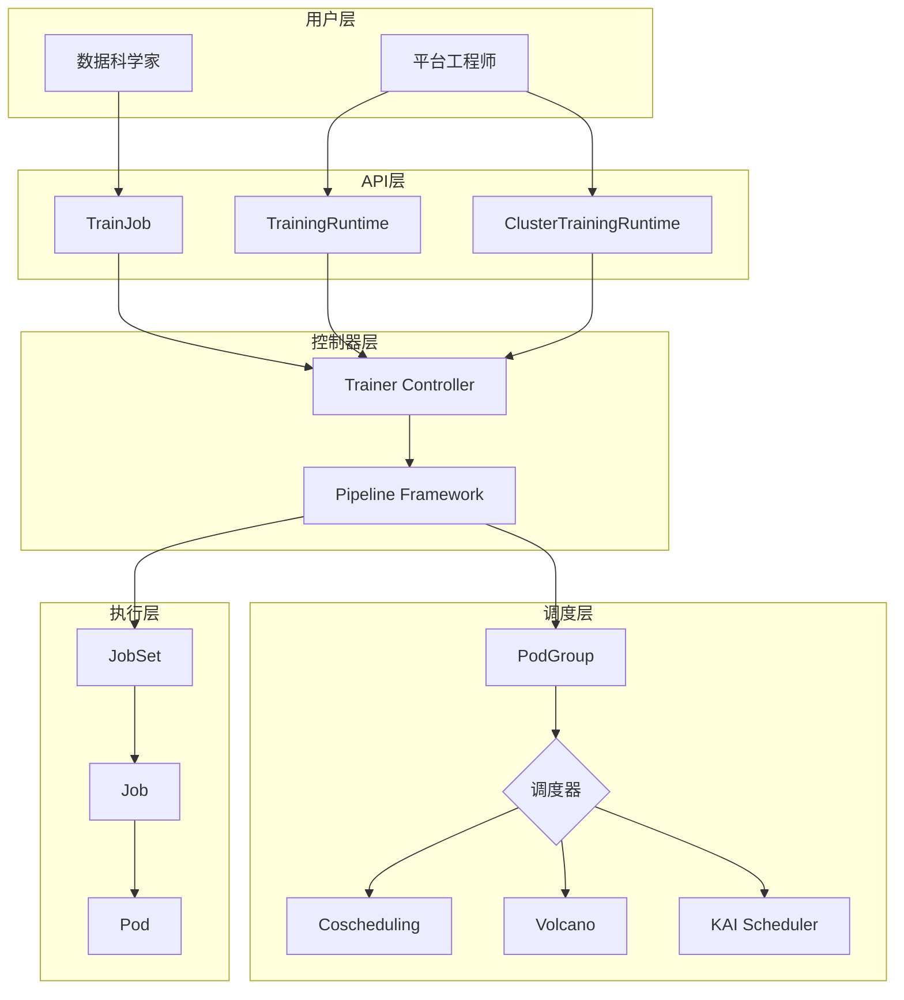
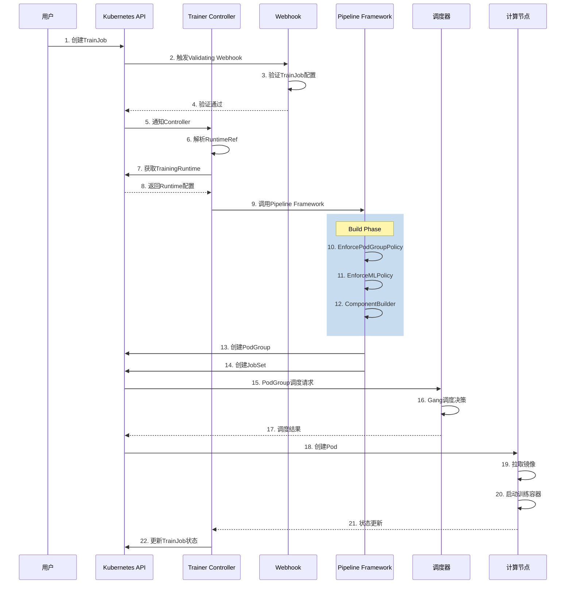
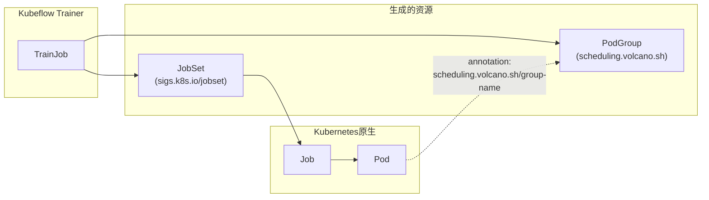
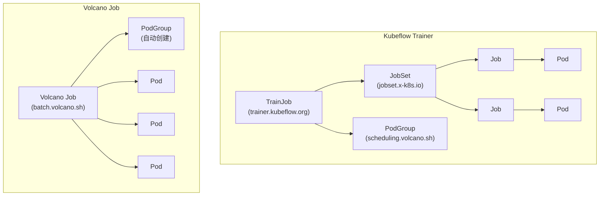
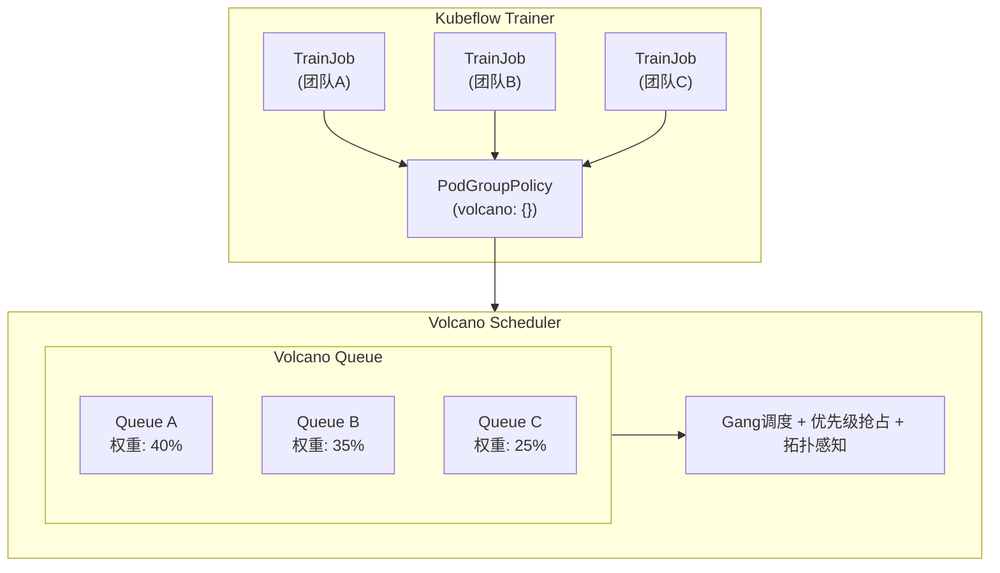

## Kubeflow项目简介


### 项目背景

[Kubeflow](https://www.kubeflow.org/) 是一个开源的机器学习平台，旨在使机器学习工作流在`Kubernetes`上的部署变得简单、可移植和可扩展。该项目于2017年由`Google`发起，现已成为`CNCF`（云原生计算基金会）的孵化项目。

`Kubeflow`的核心目标是：
- **简化ML工作流**：提供端到端的机器学习工作流管理能力
- **云原生架构**：充分利用`Kubernetes`的容器编排能力
- **框架无关**：支持`TensorFlow`、`PyTorch`、`MXNet`等主流`ML`框架
- **可扩展性**：支持从单机到大规模分布式训练的无缝扩展

### 核心组件

`Kubeflow`生态系统包含多个核心组件：

| 组件 | 功能描述 |
|------|----------|
| **Kubeflow Trainer** | 分布式训练任务管理，支持`PyTorch`、`MPI`等框架 |
| **Kubeflow Pipelines** | `ML`工作流编排和自动化 |
| **Katib** | 超参数调优和神经架构搜索 |
| **KServe** | 模型推理服务部署 |
| **Notebooks** | 基于`Jupyter`的交互式开发环境 |
| **Model Registry** | 模型版本管理和元数据存储 |

### 使用者

`Kubeflow`已被众多知名企业使用，包括：

- **云服务商**：阿里云、`AWS`、华为云
- **科技公司**：腾讯、字节跳动、`Cisco`、`NVIDIA`
- **金融机构**：`Bloomberg`、`Ant Group`
- **其他企业**：`Red Hat`、`Polyaxon`、`TuSimple`等

## Kubeflow Trainer详细介绍


### 项目演进

`Kubeflow Trainer`（原名`Training Operator`）代表了`Kubeflow`训练组件的下一代演进，建立在超过七年的`Kubernetes ML`工作负载运行经验之上。

**发展历程：**
- **2017年**：`Kubeflow`项目引入`TFJob`，用于在`Kubernetes`上编排`TensorFlow`训练
- **2018-2020年**：扩展支持`PyTorch`、`MXNet`、`MPI`、`XGBoost`等多个`ML`框架
- **2021年**：将各个独立的`Operator`整合为统一的`Training Operator v1`
- **2025年7月**：正式发布`Kubeflow Trainer v2.0`，采用全新架构


### Trainer v2核心特性


`Kubeflow Trainer v2`是一个`Kubernetes`原生项目，专为大语言模型（`LLM`）微调和可扩展的分布式机器学习模型训练而设计。

**主要目标：**
- 使`AI/ML`工作负载更易于大规模管理
- 提供`Pythonic`接口进行模型训练
- 提供最简单、最可扩展的`PyTorch`分布式训练方案
- 内置支持大语言模型微调
- 对`AI`从业者屏蔽`Kubernetes`复杂性
- 整合`Kubernetes Batch WG`和`Kubeflow`社区的努力

### 核心API设计


`Kubeflow Trainer v2`引入了三个核心`CRD`：

#### TrainJob

`TrainJob`是面向数据科学家的简化`CRD`，允许从预部署的训练运行时启动训练和微调任务。

```yaml
apiVersion: trainer.kubeflow.org/v1alpha1
kind: TrainJob
metadata:
  name: torch-ddp
  namespace: tenant-alpha
spec:
  runtimeRef:
    name: torch-distributed-multi-node
  trainer:
    image: docker.io/custom-training
    command:
      - torchrun train.py
    numNodes: 5
    resourcesPerNode:
      requests:
        nvidia.com/gpu: 2
```

#### TrainingRuntime / ClusterTrainingRuntime

`TrainingRuntime`和`ClusterTrainingRuntime`是由平台工程师管理的训练蓝图，定义了如何启动各种类型的训练或微调任务。

```yaml
apiVersion: trainer.kubeflow.org/v1alpha1
kind: ClusterTrainingRuntime
metadata:
  name: torch-distributed-multi-node
spec:
  mlPolicy:
    numNodes: 2
    torch:
      numProcPerNode: 5
  template:
    spec:
      replicatedJobs:
        - name: node
          template:
            spec:
              template:
                metadata:
                  labels:
                    trainer.kubeflow.org/trainjob-ancestor-step: trainer
                spec:
                  containers:
                    - name: node
                      image: docker.io/kubeflow/pytorch-mnist
                      env:
                        - name: MASTER_ADDR
                          value: "pytorch-node-0-0.pytorch"
                        - name: MASTER_PORT
                          value: "29400"
                      command:
                        - torchrun train.py
```

### 用户角色分离


`Kubeflow Trainer v2`采用了清晰的用户角色分离设计：

| 角色 | 职责 | 技能要求 |
|------|------|----------|
| **DevOps工程师** | 管理`Kubernetes`工作负载 | 熟悉`Kubernetes`概念 |
| **MLOps工程师** | 配置分布式训练参数（如`PyTorch rendezvous`、`MPI`配置） | 熟悉ML框架 |
| **数据科学家/ML工程师** | 创建模型架构和`ML`算法 | 熟悉`torch.nn API`，使用`Python` |

这种设计使得：
- **数据科学家**（`AI Practitioners`）：只需创建简单的`TrainJob`，无需理解复杂的`Kubernetes API`。
- **平台工程师**（`Platform Admins`）：负责创建和维护`TrainingRuntime`，配置基础设施参数。


## HPC训练场景技术挑战与解决方案

### 常见技术挑战

在`HPC`（高性能计算）训练场景中，存在以下常见技术挑战：

| 挑战 | 描述 | 影响 |
|------|------|------|
| **分布式协调复杂** | 多节点、多`GPU`训练需要复杂的进程协调和通信配置 | 配置错误导致训练失败 |
| **资源碎片化** | `GPU`资源分散在不同节点，大规模训练任务无法调度 | 资源利用率低下 |
| **Gang调度缺失** | `Kubernetes`默认调度器不支持"全或无"调度 | 部分`Pod`调度导致资源浪费 |
| **容错机制不足** | 长时间训练任务缺乏检查点和恢复机制 | 节点故障导致训练从头开始 |
| **数据加载瓶颈** | 每个训练`Pod`独立下载大型模型和数据集 | 网络拥塞，`GPU`空闲等待 |
| **环境配置复杂** | 不同框架需要不同的环境变量和启动命令 | 配置繁琐，易出错 |
| **多租户隔离** | 多团队共享集群资源时缺乏有效隔离 | 资源竞争，优先级混乱 |

### Kubeflow Trainer解决方案

`Kubeflow Trainer`针对上述挑战提供了系统性的解决方案：

#### 简化分布式训练配置

**问题**：配置`torchrun`、`MPI`等分布式训练参数复杂且易出错。

**解决方案**：
- 自动注入`MASTER_ADDR`、`MASTER_PORT`等环境变量
- 自动计算`--nnodes`和`--nproc-per-node`参数
- 提供预配置的`ClusterTrainingRuntime`蓝图

```yaml
# 用户只需指定简单参数
spec:
  trainer:
    numNodes: 5
    resourcesPerNode:
      requests:
        nvidia.com/gpu: 2
# Trainer自动转换为：torchrun --nnodes=5 --nproc-per-node=2 train.py
```

#### Gang调度支持

**问题**：分布式训练需要所有`Pod`同时启动，否则会造成资源浪费。

**解决方案**：
- 内置`PodGroupPolicy API`支持`Gang`调度
- 支持`Coscheduling`、`Volcano`、`KAI Scheduler`等多种调度器
- 自动创建`PodGroup`资源确保原子性调度

```yaml
spec:
  podGroupPolicy:
    coscheduling:
      scheduleTimeoutSeconds: 120
    # 或使用Volcano
    # volcano: {}
```

#### 数据集和模型初始化器

**问题**：每个训练`Pod`独立下载数据会造成网络瓶颈和`GPU`空闲。

**解决方案**：
- 提供专用的`Dataset Initializer`和`Model Initializer`
- 数据下载一次，通过共享卷分发给所有训练节点
- 将数据加载任务卸载到`CPU`节点，节省`GPU`资源

```yaml
spec:
  initializer:
    dataset:
      storageUri: hf://tatsu-lab/alpaca
    model:
      storageUri: hf://meta-llama/Llama-2-7b
```

#### 容错与恢复

**问题**：长时间训练任务在节点故障时需要从头开始。

**解决方案**：
- 支持`Kubernetes PodFailurePolicy`
- 定义不同类型故障的处理规则
- 支持`PyTorch Elastic`弹性训练

```yaml
spec:
  mlPolicy:
    torch:
      elasticPolicy:
        maxRestarts: 3
        minNodes: 5
        maxNodes: 10
```

#### LLM微调内置支持

**问题**：大语言模型微调需要复杂的配置和专业知识。

**解决方案**：
- 提供`BuiltinTrainer`内置训练器（如`TorchTune`）
- 预配置的`LLM`微调`Runtime`（`Llama`、`Gemma`等）
- 支持`LoRA`、`QLoRA`等参数高效微调方法

## 支持的框架

### PyTorch

`Kubeflow Trainer`对`PyTorch`提供最全面的支持，包括：

| 训练模式 | 描述 | 适用场景 |
|----------|------|----------|
| **单机单卡** | 基础训练模式 | 小规模模型开发调试 |
| **单机多卡** | 单节点多`GPU`并行 | 中等规模模型训练 |
| **多机多卡** | 分布式数据并行（`DDP`） | 大规模模型训练 |
| **弹性训练** | `PyTorch Elastic` | 动态扩缩容场景 |

**PyTorch分布式训练示例：**

```yaml
apiVersion: trainer.kubeflow.org/v1alpha1
kind: ClusterTrainingRuntime
metadata:
  name: torch-distributed-multi-node
spec:
  mlPolicy:
    numNodes: 2
    torch:
      numProcPerNode: "auto"  # 支持auto、cpu、gpu或具体数值
  template:
    spec:
      replicatedJobs:
        - name: node
          template:
            spec:
              template:
                metadata:
                  labels:
                    trainer.kubeflow.org/trainjob-ancestor-step: trainer
                spec:
                  containers:
                    - name: node
                      image: docker.io/kubeflow/pytorch-mnist
                      resources:
                        limits:
                          nvidia.com/gpu: 4
                      command:
                        - torchrun train.py
```

### DeepSpeed

`DeepSpeed`是微软开发的深度学习优化库，`Kubeflow Trainer`通过`MPI Runtime`提供支持：

**核心特性：**
- `ZeRO`优化器（`ZeRO-1/2/3`）
- 混合精度训练
- 梯度累积
- 模型并行

**DeepSpeed训练示例：**

```yaml
apiVersion: trainer.kubeflow.org/v1alpha1
kind: ClusterTrainingRuntime
metadata:
  name: deepspeed-training
spec:
  mlPolicy:
    numNodes: 2
    mpi:
      mpiImplementation: OpenMPI
      numProcPerNode: 4
  template:
    spec:
      replicatedJobs:
        - name: launcher
          template:
            spec:
              template:
                metadata:
                  labels:
                    trainer.kubeflow.org/trainjob-ancestor-step: trainer
                spec:
                  containers:
                    - name: launcher
                      image: docker.io/deepspeed-launcher
                      command:
                        - deepspeed
                        - --num_nodes=2
                        - --num_gpus=4
                        - train.py
        - name: node
          template:
            spec:
              template:
                metadata:
                  labels:
                    trainer.kubeflow.org/trainjob-ancestor-step: trainer
                spec:
                  containers:
                    - name: node
                      image: docker.io/deepspeed-trainer
                      resources:
                        limits:
                          nvidia.com/gpu: 4
```

### MPI

`MPI`（`Message Passing Interface`）是HPC领域的标准通信协议，`Kubeflow Trainer`提供完整的`MPI v2`支持：

**支持的MPI实现：**
- `OpenMPI`
- `Intel MPI`
- `MPICH`

**MPI Runtime特性：**
- 自动生成`SSH`密钥用于节点间安全通信
- 自动创建`hostfile`配置
- 支持`slot`配置

```yaml
apiVersion: trainer.kubeflow.org/v1alpha1
kind: ClusterTrainingRuntime
metadata:
  name: mpi-training
spec:
  mlPolicy:
    numNodes: 4
    mpi:
      mpiImplementation: OpenMPI
      numProcPerNode: 8
      sshAuthMountPath: /root/.ssh
```

### 其他框架支持

| 框架 | 状态 | 说明 |
|------|------|------|
| **JAX** | 路线图中 | 分布式`JAX`训练，已有`KEP`提案（[#2442](https://github.com/kubeflow/trainer/issues/2442)） |
| **MLX** | 路线图中 | `Apple Silicon`优化的`ML`框架（[#2047](https://github.com/kubeflow/trainer/issues/2047)） |
| **TensorFlow** | 待实现 | `PyTorch`实现完成后添加 |
| **XGBoost** | 待实现 | `PyTorch`实现完成后添加 |
| **PaddlePaddle** | 待实现 | `PyTorch`实现完成后添加 |

### LLM微调框架

`Kubeflow Trainer v2`内置支持多种`LLM`微调框架：

| 框架 | 描述 | 状态 |
|------|------|------|
| **TorchTune** | `PyTorch`官方`LLM`微调库 | 已支持 |
| **HuggingFace TRL** | `Transformer`强化学习库 | 计划中 |
| **Unsloth** | 高效`LLM`微调库 | 计划中 |
| **LLaMA-Factory** | 一站式`LLM`微调框架 | 计划中 |

## 训练任务创建流程

### 整体架构



### 详细创建流程



### Pipeline Framework详解

`Kubeflow Trainer v2`引入了`Pipeline Framework`作为内部扩展机制，包含四个阶段：

| 阶段 | 功能 | 扩展点 |
|------|------|--------|
| **Startup Phase** | 控制器启动时初始化 | `WatchExtension` |
| **PreExecution Phase** | `Webhook`验证 | `CustomValidation` |
| **Build Phase** | 构建和部署资源 | `EnforcePodGroupPolicy`, `EnforceMLPolicy`, `ComponentBuilder` |
| **PostExecution Phase** | 状态更新 | `TerminalCondition` |

## Volcano调度器集成

### 为什么需要Volcano

`Kubeflow Trainer v2`默认使用`Coscheduling`插件提供`Gang`调度支持，但`Coscheduling`存在一些局限性：

| 特性 | Coscheduling | Volcano |
|------|--------------|---------|
| `Gang`调度 | ✅ | ✅ |
| 优先级调度 | ❌ | ✅ |
| 队列管理 | ❌ | ✅ |
| 资源配额 | ❌ | ✅ |
| 拓扑感知调度 | ❌ | ✅ |
| 抢占机制 | 有限 | ✅ |
| 生态成熟度 | 一般 | 成熟 |

### 集成配置

`Kubeflow Trainer`可以与`Volcano`调度器无缝对接，通过源码级别实现了完美的集成，以下是配置步骤。

#### 前置条件

首先需要在`Kubernetes`集群中安装`Volcano`：

```bash
# 安装Volcano
kubectl apply -f https://raw.githubusercontent.com/volcano-sh/volcano/master/installer/volcano-development.yaml

# 验证安装
kubectl get pods -n volcano-system
```

#### 启用Volcano插件

在`TrainingRuntime`或`ClusterTrainingRuntime`中配置`Volcano`：

```yaml
apiVersion: trainer.kubeflow.org/v1alpha1
kind: ClusterTrainingRuntime
metadata:
  name: torch-distributed-volcano
spec:
  mlPolicy:
    numNodes: 4
    torch:
      numProcPerNode: 8
  template:
    spec:
      replicatedJobs:
        - name: node
          template:
            spec:
              template:
                metadata:
                  labels:
                    trainer.kubeflow.org/trainjob-ancestor-step: trainer
                spec:
                  # 指定Volcano调度器
                  schedulerName: volcano  
                  priorityClassName: high-priority
                  containers:
                    - name: node
                      image: docker.io/kubeflow/pytorch-mnist
                      resources:
                        limits:
                          nvidia.com/gpu: 8
                      command:
                        - torchrun train.py
```

#### 配置优先级队列

**步骤1：创建Volcano Queue**

```yaml
apiVersion: scheduling.volcano.sh/v1beta1
kind: Queue
metadata:
  name: high-priority-queue
spec:
  weight: 10
  reclaimable: false
  capability:
    cpu: "100"
    memory: "500Gi"
    nvidia.com/gpu: "32"
```

**步骤2：在TrainingRuntime中引用Queue**

```yaml
apiVersion: trainer.kubeflow.org/v1alpha1
kind: ClusterTrainingRuntime
metadata:
  name: torch-high-priority
spec:
  podGroupPolicy:
    volcano: {}
  template:
    metadata:
      annotations:
        scheduling.volcano.sh/queue-name: "high-priority-queue"
    spec:
      replicatedJobs:
        - name: node
          template:
            spec:
              template:
                metadata:
                  labels:
                    trainer.kubeflow.org/trainjob-ancestor-step: trainer
                spec:
                  schedulerName: volcano
                  containers:
                    - name: node
                      image: docker.io/kubeflow/pytorch-mnist
```

**步骤3：在TrainJob中覆盖Queue（可选）**

```yaml
apiVersion: trainer.kubeflow.org/v1alpha1
kind: TrainJob
metadata:
  name: urgent-training
spec:
  runtimeRef:
    name: torch-high-priority
  annotations:
    scheduling.volcano.sh/queue-name: "urgent-queue"  # 覆盖Runtime中的队列
  trainer:
    numNodes: 8
```

#### 拓扑感知调度

`Volcano`支持网络拓扑感知调度，可以将`Pod`调度到网络拓扑相近的节点，减少通信延迟：

```yaml
apiVersion: trainer.kubeflow.org/v1alpha1
kind: ClusterTrainingRuntime
metadata:
  name: torch-topology-aware
spec:
  podGroupPolicy:
    volcano:
      # 具体的配置使用可以查看volcano网络拓扑感知调度章节
      networkTopology:
        mode: hard  # hard表示必须满足拓扑约束
        highestTierAllowed: 1  # 最高允许的拓扑层级
  template:
    spec:
      replicatedJobs:
        - name: node
          template:
            spec:
              template:
                metadata:
                  labels:
                    trainer.kubeflow.org/trainjob-ancestor-step: trainer
                spec:
                  schedulerName: volcano
                  containers:
                    - name: node
                      image: docker.io/kubeflow/pytorch-mnist
```

### Volcano调度器配置建议

为了与`Kubeflow Trainer`配合使用，建议配置`Volcano`调度器启用以下插件：

```yaml
apiVersion: v1
kind: ConfigMap
metadata:
  name: volcano-scheduler-configmap
  namespace: volcano-system
data:
  volcano-scheduler.conf: |
    actions: "enqueue, allocate, backfill"
    tiers:
    - plugins:
      - name: priority      # 基于PriorityClassName排序
      - name: gang          # Gang调度策略
    - plugins:
      - name: predicates    # 预选过滤
      - name: proportion    # 队列资源比例
      - name: binpack       # 紧凑调度，减少碎片
      - name: network-topology-aware  # 拓扑感知调度
```

## Volcano Job对比分析

### 两种方案比较

在`Kubernetes`上运行`HPC`训练任务，有两种主要方案：

| 方案 | 描述 |
|------|------|
| **Volcano Job** | 直接使用`Volcano`的`vcjob CRD`管理训练任务 |
| **Kubeflow Trainer + Volcano** | 使用`Kubeflow Trainer`的`TrainJob CRD`，集成`Volcano`调度 |


详细对比：

| 对比维度 | Volcano Job | Kubeflow Trainer |
|----------|-------------|------------------|
| **API复杂度** | 需要手动配置所有参数 | 通过`Runtime`抽象简化配置 |
| **用户角色分离** | 不支持 | 支持（平台工程师 vs 数据科学家） |
| **分布式训练配置** | 手动配置环境变量和启动命令 | 自动注入，支持`torchrun` |
| **框架支持** | 通用，需手动适配 | 内置`PyTorch`、`MPI`、`DeepSpeed`支持 |
| **LLM微调** | 不支持 | 内置`BuiltinTrainer`支持 |
| **数据/模型初始化** | 不支持 | 内置`Initializer`支持 |
| **Python SDK** | 不支持 | 支持，`Pythonic`接口 |
| **弹性训练** | 有限支持 | 原生支持`PyTorch Elastic` |
| **Gang调度** | 原生支持 | 通过`PodGroupPolicy`集成 |
| **队列管理** | 原生支持 | 通过`annotations`集成 |
| **拓扑感知** | 原生支持 | 通过`PodGroupPolicy`集成 |
| **生态集成** | `Volcano`生态 | `Kubeflow`生态（`Pipelines`、`Katib`等） |
| **底层实现** | 直接创建`Pod` | 基于`JobSet API` |


### Volcano Job示例

```yaml
apiVersion: batch.volcano.sh/v1alpha1
kind: Job
metadata:
  name: pytorch-distributed
spec:
  minAvailable: 4
  schedulerName: volcano
  queue: default
  plugins:
    ssh: []
    svc: []
  policies:
    - event: PodEvicted
      action: RestartJob
  tasks:
    - replicas: 1
      name: master
      template:
        spec:
          containers:
            - name: pytorch
              image: docker.io/pytorch-training
              command:
                - /bin/bash
                - -c
                - |
                  python -m torch.distributed.launch \
                    --nproc_per_node=4 \
                    --nnodes=4 \
                    --node_rank=${VK_TASK_INDEX} \
                    --master_addr=${MASTER_ADDR} \
                    --master_port=29500 \
                    train.py
              resources:
                limits:
                  nvidia.com/gpu: 4
    - replicas: 3
      name: worker
      template:
        spec:
          containers:
            - name: pytorch
              image: docker.io/pytorch-training
              command:
                - /bin/bash
                - -c
                - |
                  python -m torch.distributed.launch \
                    --nproc_per_node=4 \
                    --nnodes=4 \
                    --node_rank=${VK_TASK_INDEX} \
                    --master_addr=${MASTER_ADDR} \
                    --master_port=29500 \
                    train.py
              resources:
                limits:
                  nvidia.com/gpu: 4
```

### Kubeflow Trainer示例

```yaml
# ClusterTrainingRuntime（平台工程师配置一次）
apiVersion: trainer.kubeflow.org/v1alpha1
kind: ClusterTrainingRuntime
metadata:
  name: torch-distributed-volcano
spec:
  mlPolicy:
    numNodes: 4
    torch:
      numProcPerNode: 4
  podGroupPolicy:
    volcano: {}
  template:
    spec:
      replicatedJobs:
        - name: node
          template:
            spec:
              template:
                metadata:
                  labels:
                    trainer.kubeflow.org/trainjob-ancestor-step: trainer
                spec:
                  schedulerName: volcano
                  containers:
                    - name: node
                      image: docker.io/pytorch-training
                      resources:
                        limits:
                          nvidia.com/gpu: 4
                      command:
                        - torchrun train.py
---
# TrainJob（数据科学家使用）
apiVersion: trainer.kubeflow.org/v1alpha1
kind: TrainJob
metadata:
  name: my-training
spec:
  runtimeRef:
    name: torch-distributed-volcano
  trainer:
    image: docker.io/my-custom-training
    args:
      - --epochs=100
```

### 工作负载类型与PodGroup分析

#### Kubeflow Trainer生成的工作负载类型

`Kubeflow Trainer`与`Volcano`集成时，**生成的工作负载不是`Volcano Job`，而是`JobSet` + `PodGroup`**。



从`Kubeflow Trainer`源码可以确认，`Volcano`插件直接引用了`Volcano`的`PodGroup API`：

```go
// 源码路径: pkg/runtime/framework/plugins/volcano/volcano.go
import (
    volcanov1beta1 "volcano.sh/apis/pkg/apis/scheduling/v1beta1"
    volcanov1beta1ac "volcano.sh/apis/pkg/client/applyconfiguration/scheduling/v1beta1"
)

func (v *Volcano) Build(...) ([]apiruntime.ApplyConfiguration, error) {
    // 创建Volcano PodGroup
    pg := volcanov1beta1ac.PodGroup(trainJob.Name, trainJob.Namespace).
        WithSpec(volcanov1beta1ac.PodGroupSpec().
            WithMinMember(totalMembers).
            WithMinResources(totalResources))
    // ...
}
```

#### PodGroup是同一类型

`Kubeflow Trainer`创建的`PodGroup`与`Volcano`原生的`PodGroup`是完全相同的`CRD`类型。

| 属性 | 值 |
|------|-----|
| **API Group** | `scheduling.volcano.sh` |
| **API Version** | `v1beta1` |
| **Kind** | `PodGroup` |
| **CRD名称** | `podgroups.scheduling.volcano.sh` |

这意味着`Kubeflow Trainer`创建的`PodGroup`可以被`Volcano Scheduler`完全识别和处理，支持以下调度特性：

| 特性 | 支持情况 | 说明 |
|------|---------|------|
| **Gang调度** | ✅ | 通过`minMember`字段 |
| **队列管理** | ✅ | 通过`queue`字段 |
| **优先级调度** | ✅ | 通过`priorityClassName`字段 |
| **最小资源检查** | ✅ | 通过`minResources`字段 |
| **网络拓扑感知** | ✅ | 通过`networkTopology`字段 |

#### Volcano Job特有功能的缺失

由于`Kubeflow Trainer`使用`JobSet`而非`Volcano Job`作为工作负载，以下`Volcano Job`特有的功能**无法使用**：

| Volcano Job特性 | 说明 | Kubeflow Trainer替代方案 |
|----------------|------|-------------------------|
| **任务级Policies** | 如`PodEvicted → RestartJob` | 依赖`JobSet`的`FailurePolicy` |
| **内置Plugins** | `ssh`、`svc`、`env`等 | 需手动配置或使用`Initializer` |
| **Task依赖** | 任务间的`DAG`依赖 | 不支持，需使用`Kubeflow Pipelines` |
| **minAvailable动态调整** | 运行时调整最小可用数 | 不支持 |
| **Lifecycle管理** | `Pending`/`Running`/`Completed`等状态 | 使用`JobSet`状态 |

#### 架构对比图



#### 选型建议

| 场景 | 推荐方案 | 原因 |
|------|---------|------|
| 需要`Volcano Job`完整功能（`Policies`、`Plugins`） | `Volcano Job` | 原生支持所有特性 |
| 需要`PyTorch`/`MPI`分布式训练简化配置 | `Kubeflow Trainer` | 自动注入环境变量，`Runtime`抽象 |
| 需要`LLM`微调能力 | `Kubeflow Trainer` | 内置`BuiltinTrainer`支持 |
| 需要与`Kubeflow`生态集成 | `Kubeflow Trainer` | 与`Pipelines`、`Katib`无缝集成 |
| 需要`Python SDK`提交任务 | `Kubeflow Trainer` | 提供`Pythonic`接口 |
| 纯`HPC`批处理场景 | `Volcano Job` | 更成熟的批处理生态 |

### Volcano + Kubeflow Trainer

将`Volcano`与`Kubeflow Trainer`结合使用，可以充分发挥两者的优势，构建企业级`HPC`训练平台。


| 能力维度 | Volcano提供 | Kubeflow Trainer提供 |
|----------|-------------|---------------------|
| **调度能力** | `Gang`调度、优先级抢占、队列管理、拓扑感知 | 分布式训练编排、框架适配 |
| **资源管理** | 多租户隔离、资源配额、公平调度 | 训练任务生命周期管理 |
| **用户体验** | - | `Runtime`抽象、`Python SDK`、角色分离 |
| **生态集成** | 批处理调度生态 | `ML`工作流生态（`Pipelines`、`Katib`） |





## 参考资料

- [Kubeflow Trainer官方文档](https://www.kubeflow.org/docs/components/trainer/)
- [Kubeflow Trainer GitHub仓库](https://github.com/kubeflow/trainer)
- [Volcano官方文档](https://volcano.sh/en/docs/)