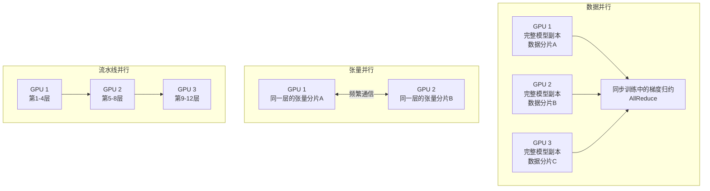
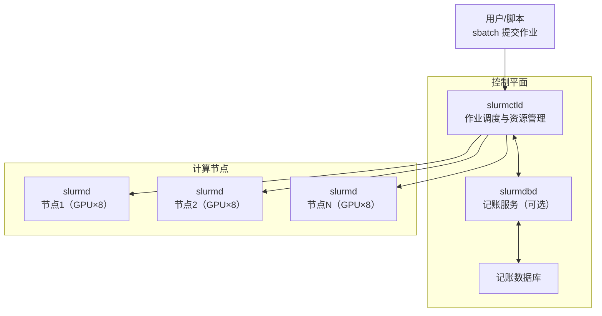
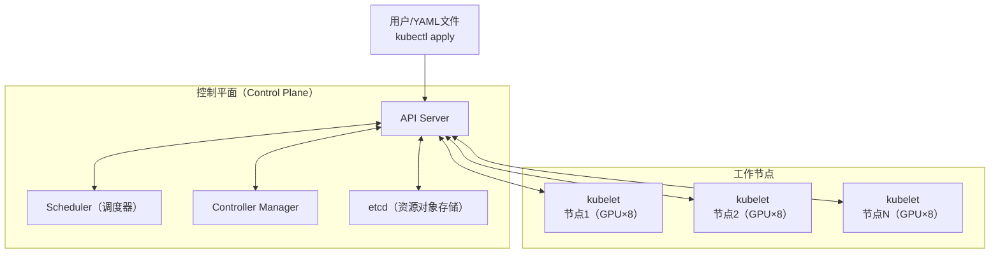
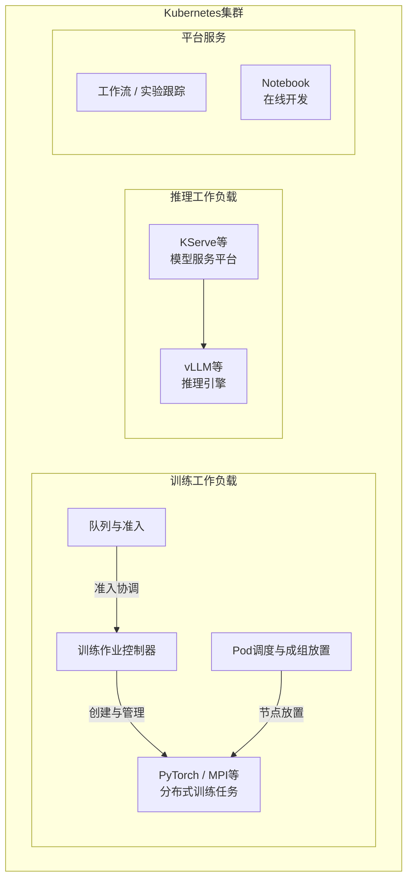
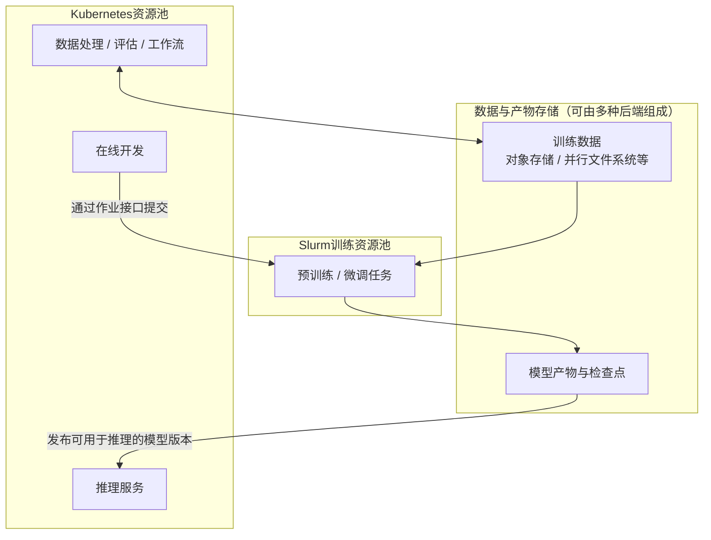

## 前言

建设大模型训练平台时，一个绕不开的问题是：**当多个团队同时提交训练任务，平台该如何分配有限的`GPU`资源，让这些任务有序、高效地运行？** 承担资源管理与调度职责的底层系统，既影响任务需要排队多久、资源能否得到充分利用，也关系到平台后续的运维和扩展。`Kubernetes`与`Slurm`，正是这一层常见的两种选择。

这个选择的难点在于，大模型训练往往不只是“找到一张空闲卡，启动一个程序”。以需要多台服务器协同运行的同步训练为例，任务要获得足够的资源才能开始有效计算，各个训练进程之间需要频繁交换数据；一旦某个进程发生故障，还可能需要协调其他进程重启，并从已保存的训练进度继续。平台需要将资源分配、任务运行和故障恢复串联起来，而这些工作并非都由调度系统独立完成。

两者的出发点有所不同：`Slurm`以批处理作业为中心，在高性能计算领域长期承担作业排队、资源分配和任务启动等职责；`Kubernetes`以容器编排为基础，广泛用于在线服务，也可以结合训练控制器、队列和调度扩展构建训练平台。因此，选型需要比较的是**哪套完整方案更适合自己的训练负载、资源治理需求和团队能力**。有的团队适合采用其中一种，也有的团队会让两者分工协作。

## 训练场景的特点

### 训练在做什么

基于梯度优化的模型训练，是一个**反复计算损失、求取梯度并更新模型参数**的过程。模型通过前向传播得到输出和损失，反向传播计算梯度，优化器再依据梯度更新参数。训练通常按预定步数、数据量或收敛条件结束，并通过评估检验效果。

大型语言模型（`LLM`）的预训练可能涉及数十亿到数千亿甚至更多参数、大规模语料、数百到数千块乃至更多`GPU`，以及数周或数月的训练周期。具体需求取决于模型结构、训练`Token`量和硬件配置；`MoE`模型还需区分总参数量与每个`Token`的激活参数量。微调、小模型训练与大型预训练的资源需求不能一概而论。

### 分布式训练的运作方式

单张加速卡的显存容量因型号而异，已有超过`80GB`的产品，不能将`80GB`视为上限。例如，`130亿`参数以`BF16`保存时，仅权重约占`26GB`（十进制）；全参数训练还需要梯度、优化器状态、激活值和临时缓冲区。是否能放入单卡，还取决于精度、优化器、序列长度、批量大小，以及是否采用分片、重计算或卸载。

当显存不足，或者需要提高训练吞吐时，可以采用**分布式并行策略**。以下是三类常见方式的简化示意，其中数据并行指每个工作进程保存完整模型副本的情况：

- **数据并行**：以同步`DDP`为例，各工作进程持有模型副本、处理不同数据，在训练迭代的反向传播阶段通过`AllReduce`等操作归约梯度，再执行一致的参数更新。梯度累积配合`no_sync()`等机制可以减少同步频率；同步并不是等整个训练结束后才发生。`FSDP`、`ZeRO`等分片方案会改变模型状态的存放方式和通信模式。
- **张量并行**：将同一层中的权重张量及其计算切分到多个设备上，需要交换中间结果。通信既可能发生在节点内，也可能跨节点；通常应尽量映射到高速互连域，避免将频繁通信放到带宽不足的链路上。
- **流水线并行**：将模型的不同层划分为多个阶段，以微批次流水执行前向和反向计算，阶段间需要传递激活值与梯度，并处理流水线气泡和负载均衡。

这三种策略可以**组合使用**，通常称为`3D`并行。实际系统还可能采用专家并行、上下文并行等方式；并行度越高并不一定越快，需要在显存占用、通信开销和计算效率之间权衡。

### 训练任务的核心特征

对大规模、同步、工作进程数固定的训练任务，尤其需要关注以下特征。它们不适用于所有微调任务或弹性训练模式：

| 特征维度 | 具体表现 |
|----------|----------|
| **运行时长** | 一次训练可能持续数天到数月，需要应对期间的故障和维护 |
| **资源规模** | 同一训练作业可能需要多个节点和大量`GPU`协同执行 |
| **通信敏感** | 梯度归约、张量并行通信、激活值传输或专家路由可能成为瓶颈 |
| **稳定性要求** | 一个必要工作进程故障，可能中断整个同步进程组；需有故障检测和恢复机制 |
| <strong>成组资源需求</strong> | 需要满足训练框架规定的全部或最小工作进程数量，才能取得有效进展 |
| **资源效率** | 同时关注排队时间、有效训练吞吐、集群利用率及模型计算利用率（`MFU`） |

**成组资源需求不等于资源独占。** 一个作业可以只使用节点中的部分`GPU`；是否独占整卡、整机或网络带宽，是另一组配置和隔离策略。

例如，集群只有`16`块空闲`GPU`，两个作业各需要`16`块才能训练。如果二者各占住`8`块并等待剩余资源，且没有超时释放、抢占或回退机制，就可能形成相互等待。单个作业暂时只拿到部分资源，并不必然构成死锁。

作业整体资源分配、成组调度（`Gang Scheduling`）和准入控制，都是处理此类问题的机制，但语义并不完全相同。成组调度通常要求为一个组的全部成员或规定的最小成员数找到资源，**并不保证所有进程在同一时刻启动或训练成功**。支持弹性成员数的训练框架还需要明确最小规模和成员变化后的恢复行为。

`MFU`衡量有效模型计算吞吐相对于所用硬件理论峰值算力的比例，不等同于`nvidia-smi`显示的设备忙碌时间比例，也不等同于已分配的`GPU`占比。比较时应统一计算精度、峰值口径、模型计算量估算方法及计时范围，不能为各类训练设定一个通用的高利用率目标。

## 推理场景：Kubernetes是常见选择

### 推理服务的工作特征

推理是使用训练好的模型执行预测或生成任务，可以是在线请求，也可以是离线批处理。以下讨论面向交互式大语言模型的在线服务，其生成过程通常包含处理输入的预填充（`Prefill`）阶段，以及自回归输出`Token`的解码（`Decode`）阶段。

| 特征维度 | 具体表现 |
|----------|----------|
| **实时性要求** | 关注首个`Token`延迟（`TTFT`）、平均每个后续输出`Token`的生成耗时（`TPOT`）及端到端延迟；相邻输出`Token`的间隔可用`ITL`衡量 |
| **服务持续性** | 在线业务通常要求持续可用，需要副本冗余、故障恢复和容量管理 |
| **流量波动性** | 根据请求量、排队情况和延迟目标扩缩容，同时考虑实例启动和模型加载时间 |
| **持续迭代性** | 模型更新需要版本管理、流量切换及回滚机制 |
| <strong>资源使用方式</strong> | 小模型可能共享`GPU`；大模型也可能需要多卡乃至多节点。`MIG`需受支持的硬件和相应配置，不是所有模型都适合共享 |

### Kubernetes适合哪些推理需求

`Kubernetes`提供`Deployment`、`Service`、健康探针和`HPA`等机制，可作为常驻服务运维的基础。`GPU`推理的扩缩容通常还要接入请求队列、吞吐或延迟等指标；高可用和平滑发布则依赖副本布局、容量预留、就绪检查和流量治理，不能仅靠自动重启保证。

`KServe`是面向`Kubernetes`的模型服务平台，`vLLM`等则是可以独立部署、也可以集成到该平台的推理引擎，二者不属于同一层。多节点推理同样可能需要成组调度和拓扑优化；因此不能简单地把推理等同于无状态单副本服务，也不能将`Slurm`排除在离线推理等场景之外。

## 两大调度系统介绍及比较

### Slurm：广泛用于HPC的作业管理系统

**Slurm**是广泛用于高性能计算（`HPC`）和大规模训练的开源作业调度与资源管理系统，起源于劳伦斯利弗莫尔国家实验室等机构的合作开发，主要由`SchedMD`及社区维护。它以作业为中心，负责资源分配、任务启动和排队仲裁；不应仅凭超算采用比例或个别公司的案例，推导它在所有训练场景中的性能优势。

#### Slurm的工作原理

`Slurm`采用集中式控制器与节点守护进程架构，可配置备用控制器：

- **`slurmctld`**：中央控制器，负责接收作业、维护队列和分配资源。
- **`slurmdbd`**：可选的记账数据库访问服务，将作业历史和资源使用信息写入后端数据库；它本身不是数据库。
- **`slurmd`**：运行在计算节点上，负责节点侧作业启动、执行管理和状态汇报。

用户通过`sbatch`提交批处理脚本，作业等待资源和调度策略允许后获得分配。脚本通常先在分配到的一个节点上运行，再通过`srun`或适配的启动器启动多节点任务。**提交了多节点资源请求，并不意味着脚本会自动在每个节点各执行一遍。**

#### Slurm的核心能力

| 能力 | 说明 |
|------|------|
| **作业级资源分配** | 对常规固定规模作业，按整体资源请求分配资源，再在分配范围内启动任务；不保证进程同时就绪 |
| **Fair-share与回填** | 配置多因子优先级及记账后，可根据账户份额和历史用量影响优先级；回填调度可利用不影响高优先级作业预计启动时间的空隙运行其他作业 |
| <strong>分区（Partition）管理</strong> | 为节点建立逻辑分组，设置准入、时限和共享策略；分区可以重叠，不天然构成硬隔离 |
| **GRES（通用资源）** | 管理`GPU`等设备资源，可配置数量、型号和设备文件等信息 |
| **拓扑相关配置** | `GRES`可描述设备及`CPU`亲和性，拓扑插件可依据配置的交换机或其他拓扑结构选择节点；效果受插件、硬件和配置约束 |
| **故障处理与重排队** | 支持节点状态管理和作业重排队（`requeue`）等机制；模型检查点的保存和恢复需要训练框架及脚本实现 |

这里必须区分两个术语：**Slurm的作业整体资源分配，不等同于其文档中名为Gang Scheduling的功能。** 后者指多个作业共享资源、交替挂起和恢复的时间片式调度，通常涉及`PreemptMode=GANG`。它不是启动分布式`GPU`训练的必要条件；作业挂起后，其`GRES`资源也不会自动释放给其他作业。

此外，`requeue`是让批处理脚本从头执行，并不自动还原模型、优化器、随机数生成器和数据读取进度。能否断点续训，取决于应用是否正确保存并加载所需状态。

#### Slurm的优缺点分析

##### 优势

| 优势项 | 说明 |
|--------|------|
| **作业管理模型集中** | 资源申请、排队、分配和作业步骤属于同一套管理体系，适合多节点批处理 |
| **批处理策略成熟** | 提供回填、预约、账户、`QoS`、公平份额等机制，便于建立长期共享集群的资源分配政策 |
| **硬件与拓扑配置较完整** | 可组合`GRES`、任务绑定、`cgroup`和拓扑插件，匹配专用训练集群的布局 |
| **HPC运维经验可复用** | 已有`Slurm`、高速互连和并行存储经验的团队，可沿用作业脚本、记账和运维流程 |

这些能力需要正确配置。`GRES`能够描述部分设备及连接信息，不意味着它会自动联合优化`NVLink`、`NUMA`和跨节点网络。网络拓扑插件也通常依据配置的拓扑及策略进行资源选择，而非实时测量所有路径并保证最低通信延迟。

公平份额是影响作业优先级的机制，不能单独保证每个团队始终获得固定比例的算力。需要结合账户份额、使用量衰减、优先级权重、并发上限和`QoS`等策略实施。

##### 局限与配套成本

| 局限项 | 说明 |
|--------|------|
| **容器工作流需要配置** | 已支持非特权`OCI`容器，也可集成`Enroot/Pyxis`、`Apptainer`等；镜像或容器包分发、运行时和权限仍需治理，其职责不同于通用容器编排平台 |
| **服务运维需补充机制** | 可以运行常驻进程或推理任务，但基础作业模型不直接提供与`Deployment/Service`等价的服务发现、流量治理和发布流程 |
| **云弹性需对接基础设施** | 可通过节点挂起/恢复机制及云平台集成按需增减资源；效果取决于云接口、实例供应、配额和启动耗时 |
| **MLOps集成需评估适配** | 可通过命令行、`REST API`等接入平台；不同工具对`Slurm`的支持程度不同，不能一概认为无法集成或维护成本必然更高 |
| **软硬件一致性仍需管理** | 容器可封装用户态环境，宿主机内核、驱动、通信库兼容性和设备配置仍需维护；这同样适用于`Kubernetes` |

官方容器文档明确支持作业和作业步骤使用非特权`OCI`容器；弹性计算文档也描述了通过云平台`API`管理节点的方式。因此，“缺乏容器原生支持”或“只能运行固定规模集群”都过于绝对。

#### Slurm的适用场景

- 主要需求是多节点训练或其他批处理，重视队列、记账、预约和公平份额策略。
- 已有成熟的`HPC/Slurm`团队与基础设施，希望沿用经过验证的工作流。
- 固定资源池或云上批处理集群均可考虑，前提是所选环境具备相应的部署和弹性集成。

这些是优先评估的条件，不意味着采用`Slurm`就能获得更高的模型训练吞吐。

### Kubernetes：云原生容器编排平台

**Kubernetes**（简称`K8s`）是最初由`Google`开源、现由社区开发并由`CNCF`托管的容器编排系统，可管理长期运行的服务及`Job`等批处理工作负载。

`Kubernetes`采用**声明式管理**：用户描述期望状态，控制器持续协调实际状态；这种机制提供管理基础，但不意味着任何故障都能自动恢复到应用期望的进度。

#### Kubernetes的工作原理

- **`API Server`**：集群资源对象的统一管理入口，提供`RESTful API`。
- **`Scheduler`**：根据资源需求和调度策略选择节点，通过`API Server`提交`Pod`绑定结果，而非直接向`kubelet`下发任务。
- **`Controller Manager`**：运行控制器，协调各类资源的实际状态与期望状态。
- **`etcd`**：保存由`API Server`持久化的集群资源对象；不保存全部应用数据或训练检查点。
- **`kubelet`**：观察分配到本节点的`Pod`，通过容器运行时管理容器，并上报状态。

#### Kubernetes基础能力与扩展边界

基础`Pod`调度与完整的训练作业管理并不等价。评估`Kubernetes`时，应明确版本、特性开关、调度插件和训练控制器：

| 能力边界 | 说明 |
|----------|------|
| **作业成组调度需明确启用方式** | 普通`Pod`调度不会自动将任意分布式作业作为整体。可使用支持的原生成组调度功能或`Volcano`等方案，并正确描述组成员和最小规模 |
| **设备计数与拓扑分配是不同层次** | 传统`Device Plugin`通常以整数扩展资源上报设备；节点内`NUMA`协调、设备选择和跨节点拓扑放置还需要相应组件及配置 |
| **租户配额不等于批处理队列** | `ResourceQuota`和`PriorityClass`不构成完整的训练队列体系，公平共享、借用和作业准入通常由`Kueue`、`Volcano`或其他系统承担 |

:::info 
原生成组调度已有明确的版本演进：`v1.35`文档提供默认关闭的`Alpha`实现；本次核查的`v1.37`官方文档将其标为默认关闭的`Beta`，依赖`GenericWorkload`特性开关、相应`PodGroup API`及调度插件。它不等于所有现有集群开箱即用，也不替代训练框架的故障恢复。
:::

硬件方面，`Topology Manager`是`kubelet`侧的节点内拓扑协调机制，可结合`CPU Manager`、设备插件等协调`NUMA`亲和性；它不是全局网络拓扑调度器。`DRA`（动态资源分配）提供更丰富的设备属性和资源声明模型，但需要配套驱动，具体拓扑能力也取决于驱动和调度策略，不能据此推断自动获得最优`NVLink`或跨节点放置。

常见的生态组件各自承担不同职责：

| 扩展项目 | 定位 | 核心能力 |
|----------|------|----------|
| **Volcano** | 面向批处理的调度与作业管理项目 | 成组调度、队列管理、公平共享等调度策略；具体行为取决于启用的插件与配置 |
| **Kueue** | `Kubernetes SIG Scheduling`维护的作业排队与准入项目 | 管理配额、资源借用、抢占和公平共享，并与作业控制器及`Pod`调度器协作；也提供拓扑感知等能力 |
| **Kubeflow Trainer等训练控制器** | 训练作业生命周期管理 | 根据训练任务创建和管理工作负载，协调训练运行时；需与所选队列、调度和恢复机制集成 |

`Kueue`不是`kube-scheduler`的直接替代品。**配额准入不等于所有`Pod`都已获得可运行的节点。** 其`waitForPodsReady`机制可在工作负载未按时全部就绪时撤销准入并重新排队，是基于超时和回退的实现，不能与调度器绑定前的成组决策混为一谈。`Volcano`、`Kueue`和原生成组调度也不是必须同时安装，应依据各组件支持的集成方式明确职责。

#### Kubernetes的优缺点分析

##### 优势

| 优势项 | 说明 |
|--------|------|
| **便于组合服务与批处理** | 可在统一`API`体系下管理在线服务、开发环境、数据处理和训练作业 |
| **服务生命周期管理完善** | 提供控制器、服务发现、健康检查和滚动更新；灰度流量与复杂发布策略通常还需配套组件 |
| **弹性生态丰富** | `HPA`可调整支持伸缩的工作负载副本数，`Cluster Autoscaler`或`Karpenter`等可在支持的环境中调整节点容量 |
| **镜像交付与自动化方便** | 容器镜像便于封装用户态依赖，声明式`API`便于接入`CI/CD`、`GitOps`和平台门户 |
| **多租户治理手段丰富** | 可结合`Namespace`、`RBAC`、配额、网络策略和专用节点池等建立权限及资源策略 |
| **训练生态可组合** | 可选择训练控制器、队列系统及调度扩展，匹配不同的训练框架和资源治理需求 |

容器镜像不能封装全部宿主机行为，也不会彻底消除驱动、内核或硬件差异。`HPA`通常也不能直接改变固定规模分布式训练的工作进程数；训练弹性需要框架、作业控制器及调度方案共同支持。

##### 局限与配套成本

| 局限项 | 说明 |
|--------|------|
| **完整训练能力跨越多个组件** | 队列准入、成组调度、任务生命周期及恢复机制需要明确集成，不能只部署基础集群就认为具备完整训练平台 |
| **拓扑配置需要端到端验证** | 需协调设备分配、节点内亲和性、跨节点拓扑及训练进程映射，默认配置未必满足通信密集型训练 |
| **规模化需要容量规划** | 大量对象、频繁状态更新、调度约束、控制器监听和事件量可能给控制平面带来压力，需要按实际负载压测 |
| **运维成本取决于团队与组件组合** | 对已有云原生团队可能更容易复用，对缺少相关经验的团队则存在学习、升级和故障定位成本 |
| **隔离需要组合实施** | `Namespace`本身不是硬件或安全边界；需要权限、网络、运行时和节点等多层策略，配额也不保证无性能干扰 |

#### 两个容易误判的问题

**第一，不能用GPU数量直接断言调度器的规模上限或性能排名。** 例如，`10000`块`GPU`按每节点`8`块计算是`1250`个节点；按每节点一个训练`Pod`和每卡一个`Pod`部署时，对象数量又不同。`Kubernetes`大集群指南以节点数、`Pod`数、容器数等描述规模条件，并不是“万卡就不适用”。这些条件也不是任意训练负载的性能保证。缺少相同硬件、版本和工作负载下的测量，不能声称`Slurm`在万卡规模必然比`Kubernetes`稳定或更快。

**第二，不能把Slurm分区与Kubernetes命名空间分别贴上硬隔离和软隔离标签。** 两者都包含逻辑管理概念，且不完全对应。`Slurm`分区可共享节点，实际资源约束依赖分配策略及`cgroup`等；`Kubernetes`也可采用专用节点、隔离运行时或独立集群。需要分别讨论权限、设备访问、内存、网络和性能干扰的隔离目标。

#### Kubernetes的适用场景

- 希望统一管理在线服务、开发环境、数据流水线和训练作业。
- 已有云原生团队，能复用容器交付、可观测性与自动化运维能力。
- 所需的队列、成组调度、拓扑及恢复方案，在目标规模与所用训练框架下已通过验证。

`Kubernetes`并不限于中等规模训练；能否满足大型预训练，应依据完整配置和实测结果判断。

### 核心对比总结

下表比较的是两类平台的职责与集成方式，而不是在任意条件下的性能排名：

| 对比维度 | Slurm | Kubernetes及其训练生态 |
|----------|-------|------------------------|
| **主要管理模型** | 作业、资源分配和作业步骤 | 资源对象、`Pod`和控制器，可扩展训练作业模型 |
| **成组资源需求** | 常规作业先获得整体资源分配，再启动任务；勿与时间片式`GANG`功能混淆 | 使用匹配版本的原生能力或调度扩展；队列准入与成组放置需分别配置 |
| **GPU与拓扑** | `GRES`、任务绑定与拓扑插件组合 | 设备插件或`DRA`、节点内拓扑管理及拓扑调度方案组合 |
| **公平共享** | 账户、历史用量、优先级、`QoS`等策略 | 队列系统管理配额、借用、优先级及公平共享；需核对具体语义 |
| **节点弹性** | 节点挂起/恢复及云平台集成 | 节点自动扩缩容组件及云平台集成；两者都受供应和启动时间约束 |
| **容器工作流** | 支持`OCI`及其他容器集成，需配置运行时与分发方式 | 以容器编排为基础，镜像、运行时和设备驱动仍需管理 |
| **在线服务** | 可以运行，服务治理和发布通常需额外系统 | 服务生命周期管理是核心使用场景 |
| **训练状态恢复** | 重排队不等于检查点恢复 | 重建`Pod`或重试作业不等于检查点恢复 |
| **租户隔离** | 逻辑分区、账户与资源约束组合 | 命名空间、权限、网络和节点等策略组合 |
| **超大规模与运维** | 按作业规模、调度策略、控制器容量及团队经验评估 | 按节点及对象规模、控制器组合、调度策略及团队经验评估 |

## 几种典型的架构模式

可以将`Slurm`用于训练资源池，将`Kubernetes`用于推理、开发环境和`MLOps`服务；也可以在`Kubernetes`上构建完整的训练平台。混合架构是一种可行模式，但并非所有团队都需要同时维护两套系统。

需要区分**统一门户、统一运维底座与统一资源分配**。一个门户接入两个后端，不代表两套调度器能安全地同时分配同一块`GPU`。跨系统共享硬件时，必须有明确的资源归属和协调协议；没有这类机制时，应使用独立资源池。

### 三种模式快速对照

先根据现有基础和主要诉求缩小范围，再看各模式的具体代价：

| 架构模式 | 优先考虑的条件 | 主要收益 | 主要成本与限制 |
|----------|----------------|----------|----------------|
| **模式一：以Kubernetes为主** | 已有云原生团队，希望统一管理训练、推理和开发工作流 | 训练也能接入现有的日志、告警和发布工具；开发到上线少一些人工交接；满足条件时可用空闲设备多跑训练 | 要集成并持续维护训练组件；共享资源时需处理服务保障、抢占和故障影响 |
| **模式二：Slurm与Kubernetes分工** | 已有成熟`Slurm`训练集群，或训练与在线服务需要分别制定容量、维护策略 | 旧训练脚本继续使用；训练与服务各用各的设备、各安排各的升级；可以先做用户界面，再逐步完善平台 | 维护两套系统及其接口；独立资源池之间不能直接借用空闲容量 |
| **模式三：通过Slinky集成** | 必须保留`Slurm`作业语义，同时希望统一部署运维，或有明确的跨系统资源协调需求 | 算法团队继续按熟悉的方式提交训练；运维可用现有工具部署`Slurm`；配置资源协调后，有机会把空闲节点交给另一类任务 | 需要同时理解两套系统和集成组件；兼容性、故障处理、设备映射与共享限制均需验证 |

这三种模式面向同时存在训练与平台服务需求的情况。**如果业务主要是批量训练，现有`Slurm`及配套工具已经满足需求，继续使用独立`Slurm`平台也是合理选项**，不必为了采用上述模式而引入`Kubernetes`。

### 模式一：以Kubernetes为主，组合训练能力

#### 架构与职责分工

以`Kubernetes`为基础，按需要选择训练控制器、队列系统和调度方案。下图表示职责分工，不要求某几个项目必须同时部署：

一次训练提交后，队列系统根据配额与策略决定是否准入，训练控制器管理工作负载，调度器选择节点并落实成组放置要求，训练运行时启动工作进程。出现故障时，还需要由控制器、启动器和训练程序配合，完成进程组重建与检查点恢复。

这里的“统一”首先是统一技术栈和管理接口，**不要求训练与推理必须共用同一个集群或同一组节点**。可以先采用专用节点池，必要时使用独立集群，再根据业务需求评估是否共享容量。

#### 优点与收益

| 优点 | 具体场景 | 实际收益与条件 |
|------|----------|----------------|
| **少建一套日志、告警和发布工具** | 公司已经用`Kubernetes`运行在线服务，运维人员熟悉日志查询、告警处理、镜像发布和权限配置。训练任务接入这些工具后，排查“任务为什么没有启动”时，也能沿用熟悉的操作流程 | 少开发和维护一套基础工具，新成员也少学一套操作方式。训练进度、检查点等专用信息仍需另外接入 |
| **从训练到上线，减少人工交接** | 一次微调结束后，需要找到模型文件、发起评估，再把通过评估的版本交给推理服务。接入同一平台的工作流后，可以自动传递任务状态和模型存放位置 | 少一些复制路径、确认版本和通知其他团队继续处理的工作，减少等待与交接错误。流程需要事先配置，模型格式转换也仍需处理 |
| **用空闲设备多跑一些训练** | 夜间推理请求减少，服务缩容后释放出完整的`GPU`节点，可以安排训练任务使用，等服务需要扩容时再归还 | 自建集群可以多完成训练或推迟买新设备；云上只有实际减少额外租用量才会降低账单。前提是硬件适合、策略允许借用，且训练能及时结束或保存进度后退出 |
| **新增训练需求时，少重复建设** | 团队从单卡微调发展到多机训练，可以在原有用户入口、镜像仓库和监控基础上，补充作业排队、成组调度等能力 | 用户管理、环境交付和日志查询不用每次重新做。多机训练的网络、存储和故障恢复仍需单独验证 |

#### 缺点与成本

| 成本类别 | 具体投入或风险 | 决策时应核算什么 |
|----------|----------------|------------------|
| **建设与迁移** | 训练控制器、队列、调度、设备管理、网络及存储需要联调；原有作业脚本和资源策略可能需要适配 | 从提交到恢复的完整流程需要多少开发与验证工作，已有`Slurm`策略能否等价落地 |
| **持续运维** | 多个组件各自升级，接口、特性开关和资源对象可能变化；故障定位跨越多个控制器 | 兼容性验证、升级回滚、监控告警和日常值守所需的人力 |
| **资源共享** | 推理需要预留容量，训练被抢占后可能丢失尚未保存的进度；资源碎片也可能阻塞大作业 | 可实际借用的容量、抢占频率、重复计算量，以及为满足在线延迟目标必须保留的余量 |
| **隔离与性能保障** | 同集群工作负载可能争用控制平面、网络或存储；逻辑配额不能消除性能干扰 | 专用节点池、独立集群或网络存储隔离带来的额外容量与运维成本 |

例如，白天推理高峰、夜间训练较多时，共享容量可能带来收益，但前提是训练能在服务扩容前及时退出并释放资源。如果大训练任务不可中断，或者保存和恢复检查点耗时过长，空闲时段就未必能被有效利用。

#### 适用条件与决策建议

**已有成熟云原生能力，且训练与其他工作流需要频繁集成的团队，可优先验证这一模式。** 建议先证明训练任务在专用资源上的排队、性能和恢复行为满足要求，再引入跨工作负载共享，分别评估统一管理和容量复用的收益。

如果团队需要重新建设整套云原生运维能力，或者迁移大量依赖`Slurm`策略的作业，短期成本可能高于保留现有训练平台。其经济性主要取决于：节省的重复建设、工作流适配和闲置容量成本，能否覆盖训练组件的集成、迁移与持续维护成本。

### 模式二：Slurm承担训练，Kubernetes承担平台及服务

#### 架构与职责分工

将训练任务运行在`Slurm`资源池，推理服务、在线开发或`MLOps`工作流运行在`Kubernetes`资源池，通过数据和模型产物存储连接：

用户可以从统一门户或开发环境提交训练，由平台适配层调用`Slurm`作业接口，并将排队、运行、失败、取消等状态回传。训练完成后，评估流程确认模型版本，再将可供推理使用的产物发布到`Kubernetes`侧。

两套调度系统各自管理明确归属的资源。统一体验依赖接口集成，还需要打通用户与账户映射、数据权限、日志查询和模型版本管理。**资源池分离并不要求数据重复存储，但共享存储仍需独立评估容量、性能及故障影响。**

#### 优点与收益

| 优点 | 具体场景 | 实际收益与条件 |
|------|----------|----------------|
| **已经跑通的训练脚本继续使用** | 算法团队积累了大量`sbatch`脚本，多机启动参数和排队优先级已经调好。任务仍提交到原来的`Slurm`集群，新增网页或开发环境接好提交与查询接口 | 少做一轮脚本改写、使用培训和训练结果验证，也降低迁移影响日常实验的风险。新增入口与原有集群之间的接口仍需开发和维护 |
| **训练和服务各用各的设备** | 一项训练预计连续运行三天，推理服务白天有流量高峰。服务在自己的资源池内扩容，不会直接拿走训练正在使用的`GPU`；训练也不会占满服务预留的设备 | 算法团队更容易安排长任务，服务团队能按流量准备容量。代价是一侧空闲时，另一侧不能直接借用设备 |
| **服务发布与训练维护分别安排** | 服务团队升级推理引擎时，可以在服务资源池完成验证和上线，不必连带重新部署训练节点；训练团队调整队列或维护节点时，也可以单独选择时间 | 少一些等待对方排期、共同验证和同时回滚的工作。涉及共用存储或网络的变更仍需协调 |
| **先交付好用的界面，再逐步完善平台** | 用户原来需要登录服务器、手动提交脚本、四处找日志，可以先做连接现有`Slurm`的门户，再加入实验记录、模型管理和评估流程 | 用户更早减少日常操作，平台团队可以逐项交付、逐项验证价值，不必等整个训练集群迁移完成后才能使用新平台 |

这种分工可以缩小部分变更的影响范围，但如果两侧共用网络、存储或身份服务，相关故障仍可能同时影响训练与推理，不能将两个资源池视为完全独立的故障域。

#### 缺点与成本

| 成本类别 | 具体投入或风险 | 决策时应核算什么 |
|----------|----------------|------------------|
| **平台接口建设** | 提交、取消、重试、状态同步和日志查询需要跨系统适配，失败时还要防止重复提交或状态不一致 | 适配层的开发维护、权限映射、审计及异常处理成本 |
| **两套运维体系** | 需要同时维护`Slurm`与`Kubernetes`的配置、升级、备份和告警，并明确跨系统故障的责任人 | 能否复用现有团队，新增值守与协作成本有多大；不是简单按系统数量推断人力翻倍 |
| **容量被分割** | 一侧排队时，另一侧的空闲`GPU`不能直接借用；迁移节点需要重新确认资源归属及环境配置 | 峰谷是否互补、实际闲置时长、额外采购或租用容量的费用，以及重新划分资源池的代价 |
| **数据与模型交付** | 存储接口、访问权限和环境可能不同，模型发布可能需要复制、格式转换与校验 | 数据传输、额外存储、模型导出耗时，以及从训练完成到上线的等待时间 |

训练检查点未必能直接被推理引擎加载，可能需要权重转换和模型导出。存储也应按训练数据读取、检查点写入与服务加载分别设计，不能假设不同文件系统或对象存储具有相同的性能和语义。

#### 适用条件与决策建议

**已有稳定`Slurm`集群，训练需求以多节点批处理为主，同时需要建设在线服务或研发平台时，可优先考虑这一模式。** 对希望明确划分训练与服务容量、维护窗口的团队，它也具有直接的管理价值。

其主要收益是节省迁移与重新验证成本，而不是自动提高算力利用率。若两侧容量长期稳定且利用充分，资源池分离的代价可能较小；若经常出现“一侧大量排队、另一侧长期空闲”，则应核算容量分割带来的损失，比较定期调整资源池与引入协调机制的成本。

### 模式三：通过Slinky集成Slurm与Kubernetes

#### 架构与职责分工

`Slinky`是一组集成`Slurm`与`Kubernetes`的工具。评估这一模式时，首先要说明需要的是**统一部署运维，还是协调两类工作负载的资源分配**。根据官方的[slurm-operator说明](https://github.com/SlinkyProject/slurm-operator)和[slurm-bridge说明](https://github.com/SlinkyProject/slurm-bridge)，两者的职责不同：

| 集成方式 | 工作路径与资源分配权 | 直接解决的问题 |
|----------|----------------------|----------------|
| **通过slurm-operator管理Slurm** | 在计算节点也运行于`Pod`的部署中，`Kubernetes`先为承载`slurmd`的`Pod`分配资源，`Slurm`再在已获配范围内调度作业；也可按支持方式只将部分组件部署在`Kubernetes`中 | 使用控制器和声明式配置管理`Slurm`组件的部署与生命周期 |
| **通过slurm-bridge协调指定工作负载** | 将选定`Kubernetes`工作负载的资源需求转换为代表性`Slurm`作业，由`Slurm`分配资源，桥接组件再将`Pod`绑定到对应节点，最终由`kubelet`启动 | 让两种提交方式接入协调后的资源分配流程 |

两者可以按目标架构选用，不能把安装`slurm-operator`等同于已经实现跨系统资源共享。对于前一种部署，即使`Slurm`内部暂时没有训练作业，承载它的`Pod`所申请的资源通常仍被占用；释放给其他工作负载需要明确的缩容、排空和重新分配流程。

对于`slurm-bridge`，当前官方说明要求混合节点上的原生`Slurm`用户作业与桥接管理的`Kubernetes`用户工作负载**按时间共享节点，不能同时运行**；桥接作业默认采用整节点独占分配。实际可用的共享粒度、设备支持和隔离行为必须核对所选版本，不能将这一方案理解为任意作业都能自由混用同一节点上的空闲卡。

#### 优点与收益

| 优点 | 具体场景 | 实际收益与条件 |
|------|----------|----------------|
| **运维方式调整，训练提交方式保留** | 公司希望将基础设施纳入`Kubernetes`管理，算法团队已有大量`Slurm`作业。集成后可以保留`sbatch`等提交方式和排队策略，主要调整部署与管理方式 | 算法工程师少一些重新学习提交方式、改写作业描述的工作。脚本中的数据路径、用户权限和设备访问仍需验证，旧脚本可能需要调整 |
| **搭建Slurm环境时，少做手工操作** | 使用`slurm-operator`后，可以通过配置描述所需组件，由控制器创建和管理。新建测试环境时，可在支持范围内复用部署模板，减少逐个组件安装、修改参数和核对配置的操作 | 熟悉`Kubernetes`的团队可以少维护一套独立安装工具，更容易重复搭建环境。`Slurm`的队列策略和运行问题仍需要懂它的人负责 |
| **把空闲节点交给另一类任务使用** | 某批节点上的`Slurm`作业已全部结束，`Kubernetes`侧却有适合这些设备的任务在排队。通过正确配置的`slurm-bridge`等协调机制，可以按策略将节点分配给后者 | 减少“设备空着，任务却还在等”的情况，同样的设备可能完成更多工作或减少临时租用。需满足整节点转交条件，并计入等待、切换和启动耗时；只安装`slurm-operator`不会自动获得这项收益 |
| **先验证一项收益，再决定后续投入** | 部署和升级繁琐时，先验证`slurm-operator`能否减少操作；两个资源池经常一忙一闲时，再用少量节点单独试验资源协调 | 可以分批投入，用实际节省的工时或设备时长判断是否继续。如果第一步已满足需求，就不必承担下一步的开发和维护成本 |

#### 缺点与成本

| 成本类别 | 具体投入或风险 | 决策时应核算什么 |
|----------|----------------|------------------|
| **集成与兼容性** | 需要同时匹配`Kubernetes`、`Slurm`、集成组件、容器运行时及设备驱动；不同部署形态的支持范围不同 | 版本验证、环境适配、升级回滚，以及必要的支持服务投入 |
| **设备与拓扑一致性** | 两侧必须对设备归属、`GPU`编号、`CPU`绑定、`cgroup`及高速网络形成一致约束 | 配置与排障时间，以及绑定不一致、放置不理想导致的训练吞吐损失 |
| **故障与维护协调** | `Pod`重建、节点排空、`Slurm`重排队和检查点恢复可能相互影响；控制器存活不等于作业已恢复 | 联合故障演练、恢复时间、检查点管理和跨系统值守成本 |
| **容量回收与切换** | `Slurm`内部空闲不等于外层资源已释放；桥接模式的整节点分配和按时间共享也可能留下碎片或切换空档 | 真正可回收的设备时长、排空等待、环境准备及重新启动的耗时 |
| **运维耦合增加** | 两套系统仍然存在，集成组件又增加了一层依赖；其中一层的变更可能影响另一层 | 团队能否覆盖完整故障链路，统一部署减少的工作是否大于新增协调工作 |

这种集成不自动保证训练性能提升。即使两种方案采用相同通信路径，设备与进程放置、容器配置和故障恢复也需要实测，不能用“统一底座”推导出更高吞吐或更低总成本。

#### 适用条件与决策建议

**同时需要保留`Slurm`工作流与`Kubernetes`平台能力，且已经识别出重复运维或容量分割的具体成本时，再重点评估这一模式。** 只希望统一部署管理，可以先验证`slurm-operator`；确有两类作业转用同一批节点的需求，再验证`slurm-bridge`等协调方案。

建议用一组代表性节点验证任务提交、设备分配、容量切换、节点维护及故障恢复，再决定是否扩大范围。对于缺少双栈运维经验、任务基本不可中断，或要求极短服务扩容时间的团队，应先确认节点转交速度和恢复能力满足要求。收益判断的关键是：减少的重复管理与闲置容量成本，能否覆盖集成维护、兼容性验证和资源切换成本。

### 如何核算收益与成本

三种模式应在**相同训练产出、服务质量目标和统计周期**下比较。不能把单个训练任务启动成功视为收益，也不能只比较开源软件的许可费用。建议将一次性投入与持续支出分开：

| 核算项目 | 应计入的内容 |
|----------|--------------|
| **一次性投入** | 平台开发、作业迁移、环境适配、团队培训、性能与故障验证，以及迁移期间必要的双环境运行 |
| **持续基础设施成本** | 计算资源租金或硬件折旧、平台控制组件、存储与网络、服务容量预留及闲置容量 |
| **持续维护成本** | 值守、升级、兼容性验证、接口维护、支持服务和跨团队协作 |
| **交付与效率收益** | 相同周期内完成更多训练、缩短排队或上线时间、减少人工操作；应区分可减少的现金支出与释放的生产能力 |

闲置、故障重算和资源切换会消耗已付费的设备时间，应在计算资源成本中分析其占比，避免再作为独立费用重复相加。自建集群释放出来的`GPU`时长，通常首先表现为可承接更多任务或推迟扩容；只有确实减少采购、租用或其他支出时，才能计为现金节省。

对于有现成平台的团队，可以估算：**每月净节省 = 基线方案的每月持续成本 - 候选方案的每月持续成本**；在净节省为正且相对稳定时，**回本周期 = 新增一次性投入 ÷ 每月净节省**。新建平台也可以使用同一规划周期，将各方案的一次性投入与累计持续成本相加比较。

例如，仅作核算示意：某次整合每月能实际减少`2000 GPU·小时`的租用量，按假设单价`15元/GPU·小时`计算，节省`3万元`；若新增维护支出为每月`1.2万元`，其他持续成本不变，则每月净节省为`1.8万元`。若一次性投入为`18万元`，简单回本周期约为`10个月`。这些数字不是任何模式的性能承诺或市场报价，实际还需考虑负载变化与迁移风险。

快速决策时，可以先对照自己最想解决的问题：**希望训练也用上现有工具、减少从实验到上线的人工交接，重点看模式一；希望旧训练任务照常运行，同时尽快补上服务和用户界面，重点看模式二；希望保留Slurm提交方式，又想简化部署或让两类任务轮流使用同一批节点，重点看模式三。** 再通过试点记录少花了多少操作时间、多完成了多少训练、是否实际减少了采购或租用，确认这些收益能否覆盖新增成本。

## 现实中的选型思路

### 选型决策参考

| 决策问题 | 评估方向 |
|----------|----------|
| **主要负载是什么？** | 多节点批处理且依赖成熟的记账、预约与队列策略，可优先评估`Slurm`；长期在线服务与多种工作流统一交付，可优先评估`Kubernetes`。大型预训练并不排斥后者 |
| **团队已具备什么能力？** | 复用已有`HPC`或云原生运维经验，并评估新组件的维护成本，而不是只比较安装步骤 |
| **基础设施提供什么支持？** | 比较目标环境的托管能力、设备供给、高速互连、存储和弹性集成；公有云不意味着必须选择`Kubernetes` |
| **需要何种资源治理？** | 明确公平份额、配额借用、预约、抢占、设备独占和租户隔离要求，检查所选方案能否落实 |
| **如何处理故障？** | 明确检测、隔离故障节点、重建进程组、重新排队及检查点恢复的责任与时间目标 |

例如，`AWS ParallelCluster`明确支持部署和管理使用`Slurm`的云上`HPC`集群，因此“公有云对Kubernetes的支持远优于Slurm，所以应该选Kubernetes”不是普遍成立的结论。

### 用同一工作负载验证

调度系统影响资源分配和进程放置，但训练数据通信通常由`NCCL`等通信库及底层网络完成，不经过`slurmctld`或`kube-scheduler`转发。两种方案都可以使用适当配置的高速互连；实际吞吐取决于硬件、网络、驱动、通信库、并行策略和放置结果，而非调度系统名称。

选型验证应使用相同的模型、数据、精度、批量、并行配置及硬件条件，并分别测量单作业性能和多作业资源效率：

| 验证项 | 建议记录的结果 |
|--------|----------------|
| **排队与调度** | 从提交到准入、获得资源、全部进程就绪及首个有效训练步骤的耗时，避免把这些阶段混成一个指标 |
| **训练效率** | 有效`Tokens/s`、训练步骤耗时分布、同口径`MFU`；分别记录稳定运行与包含恢复开销的结果 |
| **资源共享** | 多团队并发时的等待时间、资源碎片、实际份额和小作业周转时间 |
| **拓扑与通信** | 不同放置条件下的集合通信带宽和延迟，以及它们对真实训练吞吐的影响 |
| **故障恢复** | 工作进程、节点或设备故障后的检测与恢复耗时、回退步数和重复计算成本 |
| **扩缩容与维护** | 节点供给耗时、镜像或环境准备、模型加载、排空节点和升级过程中的任务影响 |
| **总体成本** | 完成同一训练目标所需的设备时间、存储与网络成本、平台维护和人工投入 |

## 趋势展望

**Kubernetes在持续扩展批处理和设备管理能力。** 原生成组调度、`DRA`以及`Kueue`、`Volcano`等项目提供了更多选择，但成熟度、默认开关和兼容性需要逐项核对。原生`Workload/PodGroup`相关`API`与`Kueue Workload`、`Volcano PodGroup`等自定义资源不是同一个接口，不能因为名称相似就直接互换。

**Slurm与云原生平台的集成在发展。** `OCI`容器、云上节点管理和`Slinky`等方案，使团队可以组合不同平台能力；这种发展并不意味着现有`Slurm`集群都需要迁移到`Kubernetes`。

**统一管理与资源池分离会继续并存。** 统一平台有利于交付和治理，独立资源池有利于分别制定容量及运维策略。两种方向都有实际适用条件，不能把某一种架构描述为整个行业必然收敛的结果。

最终应比较的是：在本团队的负载、硬件和运维约束下，哪套经过验证的方案能以可接受的成本提供足够的吞吐、公平性和恢复能力。

