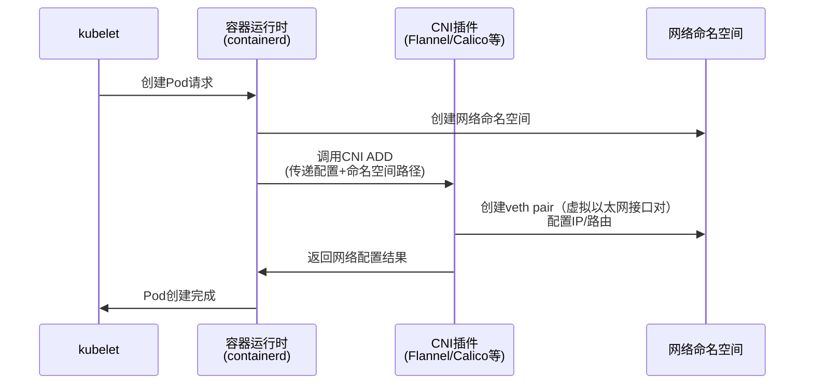
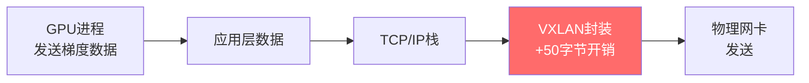
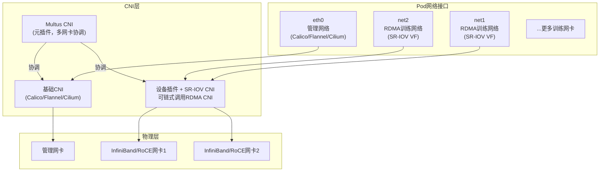
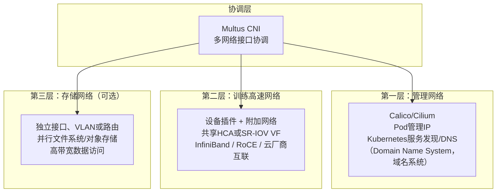

## CNI 是什么

### CNI 规范概述

`CNI`（`Container Network Interface`，容器网络接口）是由`CNCF`（`Cloud Native Computing Foundation`，云原生计算基金会）托管的容器网络项目。项目维护接口规范和开发库，同时提供一组参考插件。

`CNI`规定了容器运行时调用网络插件的方式。`containerd`、`CRI-O`等兼容`CRI`（`Container Runtime Interface`，容器运行时接口）的运行时，会按照这套约定调用插件，为容器创建或清理网络连接。

`CNI`只定义如何建立和删除容器网络连接，不限定数据平面的具体实现。`Kubernetes`（常简称为`K8s`）、`Nomad`、`Apache Mesos`等系统都支持该规范。

### CNI 工作原理

网络插件通常是一个可执行文件。容器运行时调用插件时，通过标准输入（`stdin`）传入`JSON`（`JavaScript Object Notation`，JavaScript 对象表示法）配置，再通过环境变量传入容器 ID、网络命名空间等参数。插件主要处理以下三种操作：

- **`ADD`**：将容器加入网络，包括分配`IP`地址、配置路由和设置网络接口。`IP`是`Internet Protocol`（网际协议）的缩写
- **`DEL`**：将容器移出网络，释放`IP`地址并清理网络配置
- **`CHECK`**：检查容器网络配置是否正确。该操作可选，由`CNI`规范`0.4.0`引入

下图展示了`CNI`在`Kubernetes`中的工作流程：



### Kubernetes 中的 CNI 组件

`Kubernetes`本身不提供完整的网络数据平面，而是按照`CNI`规范调用第三方网络插件。`Kubernetes`网络模型有以下基本要求：

- 任意两个`Pod`都可以直接通信，无需经过`NAT`（`Network Address Translation`，网络地址转换）
- 任意节点都可以直接访问任意`Pod`，无需经过`NAT`
- `Pod`在容器内看到的`IP`地址，与其他`Pod`用来访问它的`IP`地址相同

`Kubernetes`不强制使用某一种`CNI`实现。在当前版本中，节点上的`CRI`容器运行时负责加载和调用已安装的`CNI`插件，配置文件通常位于`/etc/cni/net.d/`。`kubelet --network-plugin`和`--cni-bin-dir`参数已在`Kubernetes 1.24`中移除，不再适用于现代集群。

### 主流 CNI 插件概览

常见的`CNI`插件和组件大致可分为以下几类：

| 类型 | 代表插件 | 主要特征 |
|:------:|---------|---------|
| **`Overlay`（覆盖网络）** | `Flannel`、`Calico`或`Cilium`的隧道模式 | 通过隧道封装实现跨节点通信，部署灵活，但会增加封装和处理开销 |
| **`Underlay`（承载网络）/路由模式** | `Calico BGP`（`Border Gateway Protocol`，边界网关协议）模式、`Cilium Native Routing` | 直接使用节点路由，性能通常更好，但需要底层网络配合 |
| **基于`eBPF`（`extended Berkeley Packet Filter`，扩展伯克利包过滤器）的数据平面** | `Cilium` | 在`Linux`内核中运行`eBPF`程序，提供高性能数据路径和网络策略 |
| **多网卡元插件** | `Multus` | 允许`Pod`挂载多个网络接口，常与`SR-IOV`（`Single Root I/O Virtualization`，单根I/O虚拟化）结合使用 |
| **高性能设备接入** | `SR-IOV CNI`、`RDMA CNI`和设备插件 | `RDMA`是`Remote Direct Memory Access`（远程直接内存访问）的缩写。这些组件分别负责配置`VF`（`Virtual Function`，虚拟功能）、分配设备和隔离`RDMA`网络命名空间 |
| **云厂商定制方案** | 阿里云`Terway`、`AWS`（`Amazon Web Services`，亚马逊云科技）`VPC CNI` | 与云平台的`VPC`（`Virtual Private Cloud`，虚拟私有云）和网卡能力深度集成 |

#### Flannel

`Flannel`是较早的`Kubernetes`网络插件之一。它为每个节点分配一段`Pod`子网，再通过不同后端实现跨节点通信。

`Flannel`支持多种后端：

- **`VXLAN`（`Virtual Extensible LAN`，虚拟扩展局域网）**：最常用的后端之一。它在内核中封装数据包，方便跨三层网络部署，代价是额外的封装和处理开销
- **`host-gw`**：直接通过节点路由转发，不使用隧道封装。这种模式通常要求节点之间二层可达
- **`UDP`（`User Datagram Protocol`，用户数据报协议）**：一种早期后端，数据路径需要经过用户态，性能较低，不适合高吞吐的生产环境

#### Calico

`Calico`是常见的生产级网络和网络策略方案，由开源社区和`Tigera`维护。它主要支持以下网络模式：

- **`BGP`非封装模式**：使用`BGP`分发`Pod`路由，不为数据包增加隧道头。能否使用该模式，取决于底层网络是否能够承载这些路由
- **`IPIP`（`IP-in-IP`，IP套IP）模式**：在`BGP`基础上增加同名封装，适用于跨子网场景
- **`VXLAN`模式**：类似`Flannel`的`VXLAN`模式，适用于不支持`BGP`的环境

`Calico`还提供完整的网络策略（`NetworkPolicy`）能力，可以通过`eBPF`或`iptables`对流量进行精细控制。

#### Cilium

`Cilium`是一个基于`Linux`内核`eBPF`技术的网络、可观测性和安全项目。项目最初由`Isovalent`发起，`2021`年进入`CNCF`孵化阶段，`2023`年毕业。它的主要特点包括：

- 使用内核中的`eBPF`程序实现主要数据路径、网络策略和服务负载均衡，降低对大量`iptables`规则的依赖
- 在负载均衡等特定路径上使用`XDP`（`eXpress Data Path`，快速数据路径）尽早处理数据包。是否可以启用、实际收益如何，取决于网卡、内核和部署模式
- 可以替代`kube-proxy`，使用`eBPF`实现`Service`负载均衡
- 集成`Hubble`可观测平台，用于展示和分析网络流量

## 基础 Pod 网络在大模型训练中的挑战

### 大模型训练的网络需求

大规模分布式训练需要持续进行跨节点集合通信，网络流量特征与常见的请求-响应型微服务很不一样。实际网络需求取决于模型规模、并行策略、每个节点的加速卡数量，以及计算与通信能否有效重叠，不能只看模型参数量。

训练任务常用`NCCL`（`NVIDIA Collective Communications Library`，NVIDIA 集合通信库）或`MPI`（`Message Passing Interface`，消息传递接口）完成跨进程和跨节点通信。下表对比了微服务与大模型训练的典型网络特征：

| 维度 | 传统微服务场景 | 大模型训练场景 |
|:------:|-------------|--------------|
| **通信模式** | 多为请求-响应或消息流 | `AllReduce`、`AllGather`、`ReduceScatter`等集合通信 |
| **带宽需求** | 因服务而异，通常不会持续占满链路 | 常持续占用高带宽；单节点可能汇聚多条`100/200/400 Gbps`链路 |
| **延迟敏感性** | 通常关注尾延迟 | 同步集合通信对延迟和抖动敏感，慢节点可能拖慢整个作业 |
| **网络利用率** | 常呈突发或不均匀分布 | 通信阶段可能长时间接近链路上限 |
| **关键软件/传输** | `HTTP`、`gRPC`、`TCP`等 | `NCCL`、`MPI`；可使用`IP Socket`（IP套接字）、`RDMA`或厂商网络插件 |
| **故障影响** | 可通过副本和重试局部恢复 | 通信成员故障通常会导致当前分布式作业失败、超时或等待恢复 |

分布式训练会通过`AllReduce`、`AllGather`、`ReduceScatter`等集合通信原语，同步梯度、参数或激活值。以`NCCL`为例，当训练扩展到多个节点后，网络可能成为主要瓶颈之一。但最终是否受限于网络，仍需结合并行策略和性能剖析结果判断。

### Overlay 封装带来的性能损耗

部分`CNI`方案会使用`Overlay`封装，例如`Flannel VXLAN`或`Calico IPIP/VXLAN`模式。发送端需要为数据包增加外层头部，接收端再将其拆除，主要会带来以下开销：

- **额外延迟**：隧道处理和更长的数据路径会增加时延和抖动。实际影响取决于内核实现、网卡卸载能力、`MTU`（`Maximum Transmission Unit`，最大传输单元）、报文大小和节点拓扑，不能简单用一个固定的微秒数概括。

- **封装开销与`MTU`**：典型`IPv4 VXLAN`封装的外层以太网、`IP`、`UDP`和`VXLAN`头合计约`50`字节。如果底层`MTU`没有相应增大，数据包可能被分片，或者必须调低`Pod`侧的`MTU`。对小报文而言，新增头部所占的比例更高。

- **`CPU`资源消耗**：封装和解封装会占用`CPU`（`Central Processing Unit`，中央处理器）。在高吞吐场景下，这部分开销可能间接降低`GPU`（`Graphics Processing Unit`，图形处理器）的有效利用率。



### 基础 CNI 不会单独提供 RDMA 设备能力

`NCCL`和`MPI`都可以通过`IP Socket`通信，并不强制使用`RDMA`。但在大规模训练中，`InfiniBand`（面向高性能计算的互连技术）、`RoCE`（`RDMA over Converged Ethernet`，融合以太网上的`RDMA`）或其他内核旁路传输，通常可以提供更低的时延、更高的吞吐量，并减少`CPU`数据路径开销。

在`InfiniBand/RDMA`网络中，连接主机与互连网络的适配器通常称为`HCA`（`Host Channel Adapter`，主机通道适配器）。`RDMA`可以让`HCA`直接读写已注册的应用内存，减少传统`Socket`数据路径中的多次拷贝和内核协议栈处理。

不过，建立传输、注册内存和处理完成通知仍可能消耗`CPU`，因此不能把`RDMA`简单理解为“完全不占用`CPU`”。链路带宽也会随代际变化，例如`InfiniBand HDR`（`High Data Rate`，高数据速率）为`200 Gbps`，`NDR`（`Next Data Rate`，下一代数据速率）为`400 Gbps`。

如果希望网卡直接访问`GPU`显存，则需要`GPUDirect RDMA`。除了`RDMA`网络，还需要兼容的`GPU`、`NIC`（`Network Interface Card`，网卡）和驱动，以及合适的`PCIe`（`Peripheral Component Interconnect Express`，高速串行计算机扩展总线标准）拓扑。因此，普通`RDMA`可用并不代表`GPUDirect RDMA`一定可用。

`Flannel`、`Calico`和`Cilium`等基础`CNI`主要负责`Pod`的普通`IP`网络。它们通常不会安装`RDMA`驱动、把`HCA`注册为可调度资源、向容器注入`/dev/infiniband/*`设备，也不会隔离`RDMA`网络命名空间。因此，只安装基础`CNI`的集群，通常还不能直接调度`RDMA`工作负载。

基础`CNI`并不会阻止`RDMA`，它也无需理解所谓的“`RDMA`语义”。常见做法是保留基础`CNI`承担管理网络，再根据隔离需求补充`RDMA`设备插件和附加网络。可选方式包括`MacVLAN`（一种基于`MAC`地址创建虚拟接口的`Linux`网络驱动；`MAC`是`Media Access Control`，即媒体访问控制）、`IPoIB`（`IP over InfiniBand`，在`InfiniBand`上承载`IP`）、`Host Device`（将物理设备直接交给`Pod`），以及`Multus + SR-IOV CNI + RDMA CNI`。

### 单网卡架构的局限性

典型`Kubernetes`集群只为每个`Pod`配置一个主网络接口，通常是`eth0`。`Kubernetes`上游核心`API`（`Application Programming Interface`，应用程序编程接口）尚未定义通用的多网络接口模型，而训练集群往往有以下需求：

- **分离训练网络与管理网络**：可以将`NCCL`集合通信与`Kubernetes`控制、监控和日志流量放在不同的接口、`VLAN`（`Virtual Local Area Network`，虚拟局域网）或物理网络上，减少彼此争用带宽。是否需要做物理隔离，取决于集群规模、安全要求和故障域设计。

- **并行使用多张高速网卡**：高端训练节点通常配有多个高速端口或`HCA`。单个`Pod`需要访问与`GPU`拓扑匹配的多个设备，并借助`NCCL`多轨（`Multi-Rail`）等能力利用聚合带宽。

- **隔离存储网络**：可以让训练数据加载、检查点（`Checkpoint`）保存等存储`I/O`（`Input/Output`，输入/输出）操作走独立的高速网络，避免挤占训练网络的带宽。

这些能力通常由`Multus`等多网络元插件，或云厂商的设备接入机制提供，不是`Kubernetes`默认网络`API`的职责。

### QoS 和流量优先级能力有限

在大规模训练集群中，集合通信、数据读取和检查点写入对`QoS`（`Quality of Service`，服务质量）的要求并不相同。基础`CNI`可以提供部分主机侧限速、带宽管理和网络策略能力，但无法独立完成`RoCE`无损网络所需的端到端配置。`PFC`（`Priority Flow Control`，优先级流量控制）、`ECN`（`Explicit Congestion Notification`，显式拥塞通知）、拥塞控制和交换机队列都需要统一设计。选型时，应分别评估主机数据面、网卡和物理交换网络。

### 规模扩展性问题

集群规模扩大后，需要重点关注路由或隧道状态的数量、策略更新速度、`IP`地址容量、故障收敛和可观测性。`Overlay`并不会在达到某个固定节点数后必然失效，`BGP`或原生路由也不一定更容易扩展。实际结果取决于插件实现、控制面拓扑和底层网络。建议按目标节点数、`Pod`数和策略数进行压测，而不是根据固定规模阈值直接选型。

## 业界高性能训练网络与 Kubernetes 集成实践

### 常见独占式架构：Multus + SR-IOV + RDMA

如果需要把`RDMA VF`独占分配给训练`Pod`，可以采用下图所示的分层架构。**但`SR-IOV`并非唯一选择，共享`HCA`、`Host Device`和云厂商设备插件也都可行**。`NVIDIA Network Operator`官方快速入门分别给出了[`SR-IOV RDMA`](https://docs.nvidia.com/networking/display/kubernetes2570/quick-start/sriov-network-rdma.html)、[`Host Device RDMA`](https://docs.nvidia.com/networking/display/kubernetes2570/quick-start/host-device-rdma.html)和[`MacVLAN + RDMA Shared Device`](https://docs.nvidia.com/networking/display/kubernetes2570/quick-start/macvlan-rdma-shared.html)三种部署示例。



这套架构包含以下核心组件：

- **`Multus CNI`**：由`k8snetworkplumbingwg`维护的元插件（`Meta Plugin`）。`Multus`负责调用默认`CNI`和附加`CNI`，让单个`Pod`获得多个网络接口。管理员先通过`NetworkAttachmentDefinition`定义附加网络，再在`Pod`的`k8s.v1.cni.cncf.io/networks`注解中引用。资源和注解的具体格式见[`Multus`项目文档](https://github.com/k8snetworkplumbingwg/multus-cni)。

- **`SR-IOV`设备插件与`CNI`**：`SR-IOV`可以把一个物理功能（`Physical Function`，`PF`）划分为多个虚拟功能（`Virtual Function`，`VF`）。[`SR-IOV Network Device Plugin`](https://github.com/k8snetworkplumbingwg/sriov-network-device-plugin)负责发现`VF`，并将其注册为`Kubernetes`扩展资源。[`SR-IOV CNI`](https://github.com/k8snetworkplumbingwg/sriov-cni)则在创建`Pod`时配置被分配的`VF`，并将其移入`Pod`网络命名空间。[`SR-IOV Network Operator`](https://github.com/k8snetworkplumbingwg/sriov-network-operator)可以进一步自动配置节点上的`PF`、`VF`和相关资源。

- **`RDMA`设备插件与`RDMA CNI`**：两者承担的职责不同。[`RDMA Shared Device Plugin`](https://github.com/Mellanox/k8s-rdma-shared-dev-plugin)或启用`RDMA`选择器的[`SR-IOV`设备插件](https://github.com/k8snetworkplumbingwg/sriov-network-device-plugin/tree/master/docs/rdma)负责发现资源和分配设备。[`RDMA CNI`](https://github.com/k8snetworkplumbingwg/rdma-cni)是一个链式`CNI`，负责把网络接口关联的`RDMA`设备移入`Pod`网络命名空间，实现`RDMA`接口隔离；它本身不会注册扩展资源。

#### 典型配置示例

下面的配置参考了[`RDMA CNI`上游的`NetworkAttachmentDefinition`示例](https://github.com/k8snetworkplumbingwg/rdma-cni/blob/master/examples/rdma_net_crd.yaml)，展示如何通过`Multus`为训练`Pod`附加`SR-IOV RDMA`网络。其中，`IPAM`（`IP Address Management`，IP 地址管理）插件负责为附加网络分配地址：

```yaml
# 定义SR-IOV网络附件
apiVersion: k8s.cni.cncf.io/v1
kind: NetworkAttachmentDefinition
metadata:
  name: sriov-rdma-net
  namespace: default
  annotations:
    k8s.v1.cni.cncf.io/resourceName: mellanox.com/sriov_rdma
spec:
  config: |
    {
      "cniVersion": "0.3.1",
      "name": "sriov-rdma-net",
      "plugins": [
        {
          "type": "sriov",
          "ipam": {
            "type": "host-local",
            "subnet": "192.168.100.0/24"
          }
        },
        {
          "type": "rdma"
        }
      ]
    }
```

```yaml
# 训练 Pod 配置
apiVersion: v1
kind: Pod
metadata:
  name: training-pod
  annotations:
    # 申请 2 个 SR-IOV RDMA 网络接口
    k8s.v1.cni.cncf.io/networks: |
      [
        {"name": "sriov-rdma-net", "interface": "net1"},
        {"name": "sriov-rdma-net", "interface": "net2"}
      ]
spec:
  containers:
  - name: trainer
    resources:
      limits:
        # 申请 GPU 资源
        nvidia.com/gpu: "8"
        # 申请 RDMA 虚拟功能资源
        mellanox.com/sriov_rdma: "2"
```

该示例还有两个前提条件：首先，`SR-IOV`设备插件需要提前创建名为`mellanox.com/sriov_rdma`且已启用`RDMA`的资源池；其次，节点必须满足[`RDMA CNI`列出的硬件、内核和部署要求](https://github.com/k8snetworkplumbingwg/rdma-cni#requirements)。

`host-local IPAM`只在本机保存地址分配状态，具体行为见[`CNI host-local`插件文档](https://www.cni.dev/plugins/current/ipam/host-local/)。在生产环境中，不应让所有节点复用同一地址池。可以为每个节点划分独立网段，也可以改用具备集群级协调能力的`IPAM`。

### Meta：两套方案并行验证

`Meta`在`2024`年`3`月发布的官方工程文章[《Building Meta's GenAI Infrastructure》](https://engineering.fb.com/2024/03/12/data-center-engineering/building-metas-genai-infrastructure/)中，公布了两套大规模集群网络方案，每套集群都包含`24,576`张`NVIDIA H100 GPU`。下文的网络设备、端点速率、`Llama 3`训练状态和性能数据均来自该文章。

- **方案一：`RoCE`**：基于`Arista 7800`以及`Wedge400`、`Minipack2`等`OCP`（`Open Compute Project`，开放计算项目）机架交换机构建，端点速率为`400 Gbps`。文章发布时，`Meta`正在这套`RoCE`集群上训练`Llama 3`。

- **方案二：`InfiniBand`**：基于`NVIDIA Quantum-2 InfiniBand`构建，端点速率同样为`400 Gbps`。`Meta`并没有在文中得出“`InfiniBand`必然优于`RoCE`”的结论，因此也不能只根据协议名称判断两套方案的实际性能。

`Meta`用这两套方案评估不同互联技术在大规模集群中的适用性和可扩展性。[官方文章的性能章节](https://engineering.fb.com/2024/03/12/data-center-engineering/building-metas-genai-infrastructure/)显示，经过拓扑感知调度、路由和`NCCL`优化后，大集群在文中测试条件下的归一化集合通信利用率恢复到`90%`以上。这一结果仅适用于文中的消息大小和网络环境，不能当作通用保证。

这篇公开文章介绍了`Meta`的内部作业调度器，但没有说明是否使用`Kubernetes`、`Multus`或某种`CNI`。因此，这一案例只用来说明`Meta`公开的`RoCE`和`InfiniBand`网络设计，不能作为其`Kubernetes CNI`选型的证据。

### AWS：EFA（`Elastic Fabric Adapter`，弹性结构适配器）+ VPC CNI 多网卡方案

`AWS`为多种`HPC`（`High Performance Computing`，高性能计算）和加速实例提供`EFA`。根据[`AWS EFA`官方说明](https://docs.aws.amazon.com/AWSEC2/latest/UserGuide/efa.html)，标准`EFA`同时提供`ENA`（`Elastic Network Adapter`，弹性网络适配器）网络能力，以及基于`SRD`（`Scalable Reliable Datagram`，可扩展可靠数据报）的`OS-bypass`（`Operating System bypass`，操作系统旁路）接口。应用通过`libfabric`和对应的`MPI/NCCL`适配层使用`EFA`。

- **低延迟**：`EFA`数据路径可以绕过内核网络栈
- **高吞吐量**：同一实例可以使用多个`EFA`。接口数量和实例聚合带宽取决于实例类型；`AWS`[`P5`实例规格](https://aws.amazon.com/ec2/instance-types/p5/)列出的`p5.48xlarge EFA`网络带宽最高为`3200 Gbps`
- **`GPUDirect RDMA`**：在受支持的实例、`AMI`（`Amazon Machine Image`，Amazon 机器映像）、驱动和通信库组合中，`GPU`与`EFA`之间可以建立直接数据路径。具体支持范围以[`P5`实例规格](https://aws.amazon.com/ec2/instance-types/p5/)和[`Amazon EKS`（`Elastic Kubernetes Service`，弹性 Kubernetes 服务）`EFA`部署文档](https://docs.aws.amazon.com/eks/latest/userguide/node-efa.html)为准

在`Kubernetes`上使用`EFA`时，`AWS`的组件分工如下：

- **`Pod IP`网络**：根据[`Amazon VPC CNI`工作方式](https://docs.aws.amazon.com/eks/latest/best-practices/vpc-cni.html)，`VPC CNI`通常从节点`ENI`（`Elastic Network Interface`，弹性网络接口）的辅助`IP`或前缀中，为`Pod`分配`VPC`地址，而不是让每个`Pod`独占一张完整的`ENI`
- **`EFA`设备**：[`EKS EFA`部署文档](https://docs.aws.amazon.com/eks/latest/userguide/node-efa.html)说明，`EFA`接口会随`EC2`（`Elastic Compute Cloud`，弹性计算云）节点一起配置，`AWS EFA Kubernetes Device Plugin`再将其注册为`vpc.amazonaws.com/efa`扩展资源
- **`Pod`申请**：`EKS`文档中的工作负载示例通过`requests/limits`申请一个或多个`EFA`。官方流程并没有把`Multus`列为前置组件

`EFA`对资源暴露方式、节点拓扑、`Huge Pages`、实例类型和`VPC CNI`版本都有明确要求。部署前应根据当前`EKS`和`EC2`文档检查兼容性。

### NVIDIA Network Operator

根据[`NVIDIA Network Operator`官方文档](https://docs.nvidia.com/networking/display/kubernetes2570/index.html)，该`Operator`用于在`Kubernetes`中部署和管理`NVIDIA`网络驱动、设备插件和附加网络组件。项目的[开源仓库](https://github.com/Mellanox/network-operator)为`Mellanox/network-operator`。根据配置，它可以管理以下全部或部分组件：

| 组件 | 功能 |
|------|------|
| `DOCA-OFED Driver Container`（`DOCA`即`Data Center Infrastructure-on-a-Chip Architecture`，`OFED`即`OpenFabrics Enterprise Distribution`）或主机驱动 | 为节点提供`NVIDIA`网卡驱动和`RDMA`软件栈 |
| `SR-IOV Network Operator` | 自动配置`SR-IOV`虚拟功能 |
| `RDMA Shared Device Plugin` | 将`RDMA`设备注册为`Kubernetes`扩展资源 |
| `Multus CNI` | 部署多网卡元插件 |
| `CNI Plugins`与`IPAM` | 按需部署`MacVLAN`、`IPoIB`、`Whereabouts/NVIDIA IPAM`等组件 |
| `Node Feature Discovery` | 发现节点硬件特性，供组件选择节点 |

`NVIDIA Network Operator`通过`NicClusterPolicy`等`CRD`（`Custom Resource Definition`，自定义资源定义）统一描述驱动和网络组件。[部署指南](https://docs.nvidia.com/networking/display/kubernetes2570/deployment-guide-kubernetes.html)也列出了需要另外创建的网络和`IPAM`资源。`Operator`可以降低组件生命周期的管理成本，但不能替代底层交换网络和拥塞控制设计。

```yaml
# NicClusterPolicy示例
apiVersion: mellanox.com/v1alpha1
kind: NicClusterPolicy
metadata:
  name: nic-cluster-policy
spec:
  ofedDriver:
    image: doca-driver
    repository: nvcr.io/nvidia/mellanox
    version: "<与Operator兼容的版本>"
  rdmaSharedDevicePlugin:
    image: k8s-rdma-shared-dev-plugin
    repository: nvcr.io/nvidia/mellanox
    version: "<与Operator兼容的版本>"
    config: |
      {
        "configList": [{
          "resourceName": "rdma_shared_device_a",
          "rdmaHcaMax": 63,
          "selectors": {"ifNames": ["ens1f0"]}
        }]
      }
  secondaryNetwork:
    cniPlugins:
      image: plugins
      repository: nvcr.io/nvidia/mellanox
      version: "<与Operator兼容的版本>"
    multus:
      image: multus-cni
      repository: nvcr.io/nvidia/mellanox
      version: "<与Operator兼容的版本>"
```

上述字段结构参考了[`NVIDIA Network Operator`的`RDMA Shared Device Plugin`部署示例](https://docs.nvidia.com/networking/display/kubernetes2570/deployment-guide-kubernetes.html#network-operator-deployment-with-rdma-shared-device-plugin)。实际部署时，镜像名、仓库、版本和选择器都必须以已安装`Operator`的兼容矩阵和节点网卡名称为准，不能直接使用示例中的占位值。

### Cilium：eBPF 高性能方案

`Cilium`可以作为训练集群的管理网络`CNI`。与本文选型相关的能力主要有以下几项：

**高性能数据路径**：

- `Cilium`的`eBPF Host-Routing`可以减少主机网络路径对`netfilter/iptables`规则遍历的依赖。[性能调优文档](https://docs.cilium.io/en/stable/operations/performance/tuning/)指出，`BIG TCP`可以将`IPv4/IPv6`的`GSO`（`Generic Segmentation Offload`，通用分段卸载）/`GRO`（`Generic Receive Offload`，通用接收卸载）聚合上限从典型的`64 KiB`提高到约`192 KiB`，但前提是内核、网卡和部署模式均兼容
- `Cilium`支持[`kube-proxy`替换](https://docs.cilium.io/en/stable/network/kubernetes/kubeproxy-free/)，使用`eBPF`实现`Service`负载均衡。是否会发生`SNAT`（`Source NAT`，源地址转换）、数据包会走哪条转发路径，仍取决于具体配置，因此不能简单理解为完全消除了`DNAT`（`Destination NAT`，目的地址转换）和`SNAT`

**可观测性**：

- [`Hubble`官方说明](https://docs.cilium.io/en/stable/overview/intro/#what-is-hubble)表明，它的可见性建立在`Cilium`和`eBPF`数据路径之上。[`EFA`的`OS-bypass`说明](https://docs.aws.amazon.com/AWSEC2/latest/UserGuide/efa.html)和[`GPUDirect RDMA`文档](https://docs.nvidia.com/cuda/gpudirect-rdma/)描述的则是绕过普通内核网络栈的数据路径。因此，`Hubble`不能作为`RDMA verbs`（`RDMA`操作接口）的完整观测工具，也不应被当作直接定位集合通信慢节点的工具

**多租户隔离**：

- `Cilium`的[网络策略语言](https://docs.cilium.io/en/stable/security/policy/language/)支持`L3/L4`（网络层/传输层）和部分`L7`（应用层）协议控制，可以限制不同训练任务之间的网络访问。但网络策略解决的是访问控制问题，不能替代带宽`QoS`，也无法消除共享链路上的性能干扰

`Cilium`文档并没有把`RDMA HCA`发现和分配列为`CNI`能力。这部分职责由[`RDMA Shared Device Plugin`](https://github.com/Mellanox/k8s-rdma-shared-dev-plugin)或[`SR-IOV`设备插件](https://github.com/k8snetworkplumbingwg/sriov-network-device-plugin/tree/master/docs/rdma)承担。因此，`Cilium`可以继续承担管理网络，`RDMA`附加网络再根据前述[`NVIDIA`官方部署模式](https://docs.nvidia.com/networking/display/kubernetes2570/index.html)选择共享`HCA`、`Host Device`或`SR-IOV VF`。

### 阿里云 Terway CNI

根据[`Terway`项目说明](https://github.com/AliyunContainerService/terway)，`Terway`是面向阿里云`ACK`（`Alibaba Cloud Container Service for Kubernetes`，阿里云容器服务 Kubernetes 版）的开源`CNI`，基于阿里云`VPC`和`ENI`能力构建。它的核心特性包括：

- **`ENI`网络模式**：[`Terway`项目文档](https://github.com/AliyunContainerService/terway)说明，`Terway`为`Pod`分配`VPC`地址，并通过节点`ENI`直接进入`VPC`，跨节点流量无需使用`VXLAN`等`Overlay`封装。每个`Pod`是独占`ENI`，还是使用共享`ENI`上的`IP`，取决于具体模式
- **`eBPF`加速与网络策略**：[`Terway`项目文档](https://github.com/AliyunContainerService/terway)列出了`eBPF`数据路径加速和`Kubernetes NetworkPolicy`支持
- **`eRDMA`（`Elastic Remote Direct Memory Access`，弹性远程直接内存访问）协同**：[`Alibaba Cloud eRDMA Controller`](https://github.com/AliyunContainerService/alibabacloud-erdma-controller)负责在`Kubernetes`中管理`eRDMA`设备。`Terway`仓库的[`eRDMA`共存设计说明](https://github.com/AliyunContainerService/terway/blob/main/docs/erdma-coexistence.md)进一步列出了两者的职责划分以及版本、`IPAM`模式限制。因此，安装`Terway`并不代表集群会自动获得`RDMA`能力

云上方案通常与实例规格、地域、集群版本和托管组件紧密关联。部署前应以当前`ACK`和`eRDMA`产品文档为准。

## 技术方案对比与选型建议

### 方案与组件组合对比

| 方案或组件组合 | 主要职责 | `RDMA` | `GPUDirect RDMA` |
|------|---------|---------|---------|
| `Flannel/Calico/Cilium`基础网络 | `Pod`主`IP`、路由、`Service`和网络策略 | 本身不负责将`HCA`注册为可调度资源，但可与`RDMA`组件共存 | 本身不支持；需要额外`RDMA`设备和`GPU/NIC`直接数据路径 |
| `RDMA Shared Device Plugin + MacVLAN/IPoIB` | 多个`Pod`共享物理`HCA` | 支持 | 可支持；需验证`GPU/NIC`拓扑、驱动、通信库和容器权限 |
| `Multus + SR-IOV 设备插件/CNI + RDMA CNI` | 为`Pod`附加并隔离`RDMA VF` | 支持 | 可支持；需验证`VF`、`GPU/NIC`拓扑、驱动和通信库兼容 |
| `NVIDIA Network Operator` | 自动部署驱动、设备插件和附加网络组件 | 取决于启用的组件 | 取决于启用的驱动、设备插件、网络模式和硬件拓扑 |
| `AWS EFA`、阿里云`eRDMA`等 | 云厂商高性能设备和托管集成 | 取决于实例和服务 | 取决于实例规格、驱动和云厂商服务支持 |

### 网络架构分层建议

构建大模型训练集群时，建议把网络按职责分层设计：



**选型原则**：

- **先量化通信需求**：小规模训练，或通信占比较低的任务，可以直接使用`TCP/IP`。只有在基准测试证明网络是瓶颈后，才需要根据收益和成本选择`RDMA`或厂商内核旁路方案
- **分开设计管理网和训练网**：管理网更关注稳定性、网络策略和可观测性；训练网则更关注拓扑、吞吐量、时延、拥塞控制和故障域
- **根据隔离需求选择`RDMA`接入方式**：共享`HCA`可以提高设备利用率，`SR-IOV VF`则能提供更强隔离。`SR-IOV`是`RDMA`的一种接入方式，不是必要条件
- **单独验证`GPUDirect RDMA`**：`RDMA`可用不代表`GPU`显存直接数据路径可用。还需要检查`GPU/NIC`拓扑、驱动、通信库和容器权限
- **确实需要多个网络接口时再引入`Multus`**：`Multus`是常见的多网络方案，但`EFA`设备插件、`hostNetwork`或其他云厂商机制不一定依赖它
- **端到端设计`QoS`**：在`RoCE`场景中，尤其需要同时验证主机、网卡、交换机和拥塞控制配置

## 总结

大规模训练的集合通信模式与常见微服务明显不同。`Flannel`、`Calico`和`Cilium`可以继续承担管理网络，但无法单独完成`RDMA`设备发现、调度、容器注入和隔离。

对于本地部署，一种常见的组合是：

1. **管理网络**：使用`Flannel`、`Calico`或`Cilium`等基础`CNI`，负责`Pod`基础网络互通，并根据具体实现提供网络策略和`Service`数据路径
2. **训练高速网络**：根据隔离要求选择共享`HCA`，或使用`Multus + SR-IOV 设备插件/CNI + RDMA CNI`
3. **自动化运维**：使用`NVIDIA Network Operator`等工具，管理兼容的网卡驱动、设备插件和附加网络组件

`Meta`的`RoCE/InfiniBand`集群、`AWS EFA`和阿里云`eRDMA`表明，高性能训练网络没有唯一的技术路线。这些方案的共同目标是缩短通信数据路径、减少处理开销，并做好拓扑和拥塞控制。`SR-IOV + RDMA + Multus`只是其中一种组合，并不适用于所有场景。

`Kubernetes`可以通过设备插件、附加`CNI`和`Operator`编排高性能网络，但最终性能仍取决于硬件拓扑、驱动、通信库、网络配置和调度策略。`CNI`只是其中一层。选型时，不能把某个网络插件的名称直接等同于端到端训练性能。

## 参考资料

- [`CNI`项目说明](https://github.com/containernetworking/cni)
- [`Kubernetes Network Plugins`](https://kubernetes.io/docs/concepts/extend-kubernetes/compute-storage-net/network-plugins/)
- [`Multus CNI`](https://github.com/k8snetworkplumbingwg/multus-cni)
- [`SR-IOV Network Device Plugin`](https://github.com/k8snetworkplumbingwg/sriov-network-device-plugin)
- [`RDMA CNI`](https://github.com/k8snetworkplumbingwg/rdma-cni)
- [`RDMA Shared Device Plugin`](https://github.com/Mellanox/k8s-rdma-shared-dev-plugin)
- [`NVIDIA Network Operator`文档](https://docs.nvidia.com/networking/display/kubernetes2570/index.html)
- [`NVIDIA GPUDirect RDMA`](https://docs.nvidia.com/cuda/gpudirect-rdma/)
- [`NCCL`环境变量：`IB`（`InfiniBand`）/`RoCE`与`Socket`回退](https://docs.nvidia.com/deeplearning/nccl/user-guide/docs/env.html#nccl-ib-disable)
- [`Open MPI TCP`网络支持](https://docs.open-mpi.org/en/v5.0.x/tuning-apps/networking/tcp.html)
- [`Cilium`性能调优与`BIG TCP`](https://docs.cilium.io/en/stable/operations/performance/tuning/)
- [`Meta`: Building Meta's GenAI Infrastructure](https://engineering.fb.com/2024/03/12/data-center-engineering/building-metas-genai-infrastructure/)
- [`Amazon EKS`: Run machine learning training with `EFA`](https://docs.aws.amazon.com/eks/latest/userguide/node-efa.html)
- [`Amazon VPC CNI`工作方式](https://docs.aws.amazon.com/eks/latest/best-practices/vpc-cni.html)
- [`Terway CNI`](https://github.com/AliyunContainerService/terway)
- [`Alibaba Cloud eRDMA Controller`](https://github.com/AliyunContainerService/alibabacloud-erdma-controller)
