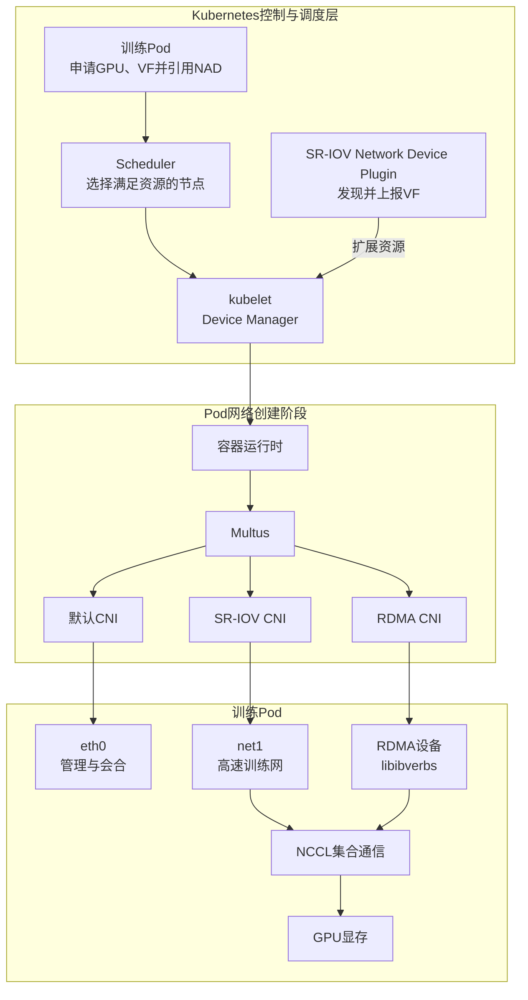
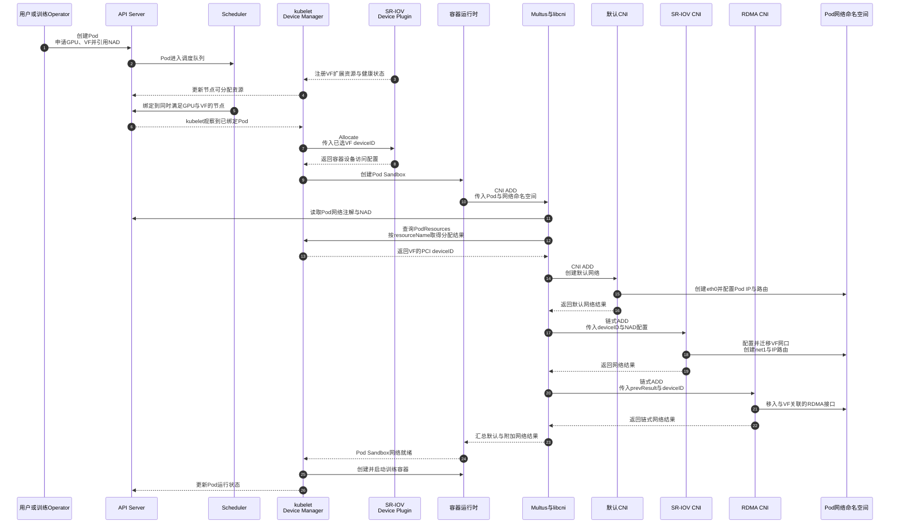
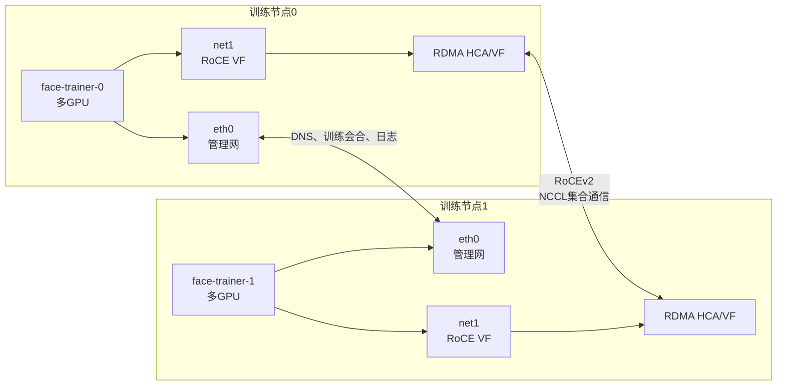

`Multus + SR-IOV + RDMA`不是一个独立的网络插件，而是一组分层协作的组件。它在保留`Pod`默认管理网络的同时，把可调度的高速网卡功能分配给训练`Pod`，使`NCCL`等通信库能够使用`InfiniBand`或`RoCE`进行跨节点集合通信。

这套方案主要面向裸金属多节点训练集群。它解决的是训练数据面的带宽、时延和设备编排问题，不会加速模型计算、数据预处理、存储读取或普通`HTTP/gRPC`通信。

## 基本概念

### Multus

[`Multus CNI`](https://github.com/k8snetworkplumbingwg/multus-cni)是一个`CNI`元插件。它不实现新的交换或路由数据面，而是调用其他`CNI`插件，使一个`Pod`能够连接多个网络。

管理员通过`NetworkAttachmentDefinition`（简称`NAD`）定义附加网络，工作负载通过`k8s.v1.cni.cncf.io/networks`注解引用它。典型训练`Pod`会获得两张网卡：

- `eth0`由默认`CNI`创建，承载`DNS`、服务发现、日志、监控和训练会合流量。
- `net1`由附加`CNI`创建，承载节点间的高速训练通信。

### SR-IOV

`SR-IOV`（`Single Root I/O Virtualization`，单根`I/O`虚拟化）是`PCI Express`提供的设备虚拟化能力。一张支持`SR-IOV`的物理网卡可以提供一个`PF`和多个`VF`：

- `PF`（`Physical Function`）由宿主机管理，用于创建、删除和配置`VF`。
- `VF`（`Virtual Function`）具有独立的`PCI`地址、队列和网络接口，可以分配给单个`Pod`。

训练流量通过`VF`直接进入网卡硬件队列，可以减少常见`veth pair`、软件网桥和`Overlay`封装带来的处理开销。`VF`仍共享`PF`对应的物理端口和链路带宽，因此它是设备级隔离和分配机制，不等同于独占物理网卡。

### RDMA

`RDMA`（`Remote Direct Memory Access`，远程直接内存访问）允许网卡在已经注册的内存区域之间直接传输数据。应用通常通过`libibverbs`创建内存区域、队列对和完成队列，再提交发送、接收、读写等操作。

与传统`TCP Socket`路径相比，`RDMA`可以减少数据复制、系统调用和内核协议栈处理，从而降低通信时延和`CPU`开销。连接建立、内存注册、队列管理和异常恢复仍需要软件参与，所以不能把`RDMA`理解为完全没有`CPU`或内核开销。

训练集群常见的两种承载方式如下：

| 承载方式 | 网络形态 | 主要关注点 |
|---------|---------|-----------|
| `InfiniBand` | 原生`InfiniBand`网卡与交换网络 | 子网管理、分区、路由和链路状态 |
| `RoCEv2` | 在以太网上通过`UDP/IP`承载`RDMA` | `VLAN`、`MTU`、`PFC/ECN`、拥塞控制和路由一致性 |

### GPUDirect RDMA

普通`RDMA`通常在两端主机内存之间传输数据。[`GPUDirect RDMA`](https://docs.nvidia.com/cuda/gpudirect-rdma/)允许网卡直接访问`GPU`显存，减少数据在`GPU`显存与主机内存之间的中转。

`GPUDirect RDMA`建立在`RDMA`之上，但两者不能画等号。它还要求`GPU`、网卡、驱动、`CUDA`、`PCIe`拓扑以及显存映射机制相互兼容，最终由`NCCL`等通信库根据运行环境选择是否使用。

四项技术的关系可以概括为：

| 技术 | 解决的问题 | 不负责的事情 |
|------|-----------|-------------|
| `Multus` | 为`Pod`编排多个网络 | 不转发训练数据，不创建`VF` |
| `SR-IOV` | 把物理网卡划分为可独立分配的`VF` | 不提供集合通信协议 |
| `RDMA` | 提供低时延、低`CPU`开销的远程内存传输 | 不负责`Kubernetes`调度和网络编排 |
| `GPUDirect RDMA` | 在符合条件时让网卡直接访问`GPU`显存 | 不会因为安装`CNI`而自动启用 |

## 大模型训练中的常见网络问题

### 集合通信成为扩展瓶颈

多节点数据并行、张量并行和流水线并行都需要跨节点交换张量。以`DistributedDataParallel`（`DDP`）为例，每轮反向传播都会触发梯度`AllReduce`；参数规模、节点数或通信频率上升后，训练进程等待集合通信的时间会增加。

同步训练还具有木桶效应：一个成员的网络拥塞或通信延迟会阻塞其他成员。链路带宽、尾时延和通信稳定性都会直接影响单步时间与集群扩展效率。

### 默认Pod网络与训练数据面目标不同

默认`Pod`网络主要服务于通用业务通信。根据具体`CNI`模式，数据可能经过`veth`、主机协议栈、路由、网络策略或隧道封装。它能够满足控制和服务流量需求，但不一定适合持续的大块张量传输。

大模型训练通常还会遇到以下问题：

- 训练流量与`DNS`、日志、监控和存储流量共享接口，容易互相争用。
- 普通网络资源不会自动作为`Kubernetes`扩展资源参与调度，调度器无法判断节点还剩多少可用高速网卡功能。
- 直接使用`hostNetwork`或挂载宿主机全部`RDMA`设备，会失去清晰的设备配额和`Pod`级可见性边界。
- 使用普通`Socket`路径时，主机内存复制和`CPU`协议栈处理可能成为额外瓶颈。


## 技术方案如何解决问题

方案的核心是把管理网络、训练网络、硬件调度和通信库分层处理：

| 训练问题 | 解决机制 | 参与组件 |
|---------|---------|---------|
| 管理流量与训练流量争用 | 为`Pod`保留`eth0`，另外创建`net1` | `Multus`、默认`CNI`、`NAD` |
| 高速网卡无法按数量调度 | 将`VF`注册为扩展资源 | `SR-IOV Network Device Plugin` |
| 通用容器网络路径开销较高 | 把指定`VF`网口交给训练`Pod` | `SR-IOV CNI` |
| `Pod`无法隔离使用`RDMA`设备 | 将关联的`RDMA`接口移入同一网络命名空间 | `RDMA CNI` |
| 跨节点张量通信占用`CPU`和主机内存路径 | 使用`NCCL + RDMA`，符合条件时使用`GPUDirect RDMA` | `NCCL`、`libibverbs`、网卡和`GPU`驱动 |

### 总体架构



`Multus`和各`CNI`只参与`Pod`网络的创建与删除。网络准备完成后，训练数据不会经过`Multus`进程，而是由`NCCL`、`libibverbs`、网卡驱动、网卡和交换网络传输。

### Pod创建流程



1. 训练`Pod`通过资源请求申请`GPU`和`VF`，并通过网络注解引用`NAD`。
2. `SR-IOV Network Device Plugin`把可用`VF`上报为节点扩展资源，调度器据此选择节点。
3. `kubelet`为容器分配具体`VF`，容器运行时随后调用`Multus`执行`CNI ADD`。
4. `Multus`先调用默认`CNI`创建`eth0`，再读取`NAD`并把已经分配的`deviceID`传给附加插件链。
5. `SR-IOV CNI`配置并迁移`VF`网口，`RDMA CNI`把关联的`RDMA`接口移入同一个`Pod`网络命名空间。
6. 训练进程启动后，`NCCL`发现容器内的网络接口和`RDMA`设备，并选择实际通信路径。

只有默认网络和附加插件链都成功，`Pod Sandbox`才会进入网络就绪状态。删除`Pod`时，容器运行时会触发对应的`CNI DEL`调用，清理接口、地址和设备网络命名空间状态。

## 核心组件工作原理

### SR-IOV Network Device Plugin

[`SR-IOV Network Device Plugin`](https://github.com/k8snetworkplumbingwg/sriov-network-device-plugin)在每个训练节点发现符合选择条件的`VF`，并通过`Kubernetes Device Plugin API`把它们注册为扩展资源。调度器只处理资源数量，具体`PCI deviceID`由节点上的设备管理路径在`Pod`启动时分配。

它负责设备发现、健康检查、资源上报和分配，不负责创建`VF`，也不负责配置`Pod`中的网络接口。

### Multus与NetworkAttachmentDefinition

`Multus`根据`Pod`网络注解读取对应`NAD`，再按配置顺序调用默认网络和附加网络插件。对于设备型网络，它还需要把设备插件已经分配的`deviceID`传给`SR-IOV CNI`和`RDMA CNI`。

设备资源池、`NAD`和`Pod`必须使用相同的扩展资源名：

| 配置位置 | 示例值 |
|---------|-------|
| 设备插件资源池 | `resourcePrefix: example.com`和`resourceName: sriov_rdma` |
| `NAD`注解 | `k8s.v1.cni.cncf.io/resourceName: example.com/sriov_rdma` |
| `Pod`资源申请 | `example.com/sriov_rdma: "1"` |

如果三处名称不一致，网络注解就无法关联到已经分配的`VF`。

### SR-IOV CNI

[`SR-IOV CNI`](https://github.com/k8snetworkplumbingwg/sriov-cni)根据`deviceID`找到目标`VF`，通过`PF`设置所需的`MAC`、`VLAN`等属性，再把`VF`对应的网口移入`Pod`网络命名空间。对于使用内核驱动的网口，它还会调用`IPAM`结果配置`IP`和路由。

`SR-IOV CNI`只配置已经分配的设备，不负责设备发现、资源调度或`VF`生命周期管理。

### RDMA CNI

[`RDMA CNI`](https://github.com/k8snetworkplumbingwg/rdma-cni)作为链式插件运行在`SR-IOV CNI`之后。它使用插件链的网络结果和`Multus`注入的`deviceID`找到关联的`RDMA`接口，并将其移入同一个网络命名空间，实现`Pod`级`RDMA`设备可见性。

`RDMA CNI`不把普通网络程序转换为`RDMA`程序。应用必须通过`NCCL`、`UCX`、`libfabric`或`libibverbs`等支持`RDMA`的通信栈发起传输。

### IPAM

附加网络仍需要地址管理。多节点共享同一训练子网时，应使用具备跨节点地址协调能力的`IPAM`，例如[`Whereabouts`](https://github.com/k8snetworkplumbingwg/whereabouts)，或者使用集群已经统一管理的地址分配方案。

训练网通常不设置默认路由，避免`DNS`、镜像访问和其他控制流量意外进入`net1`。

### NCCL与GPUDirect RDMA

`NCCL`实现`AllReduce`、`AllGather`、`ReduceScatter`等`GPU`集合通信。它会根据可见的网络接口、`RDMA HCA`和拓扑选择传输方式。`NCCL_SOCKET_IFNAME`筛选`IP`接口，`NCCL_IB_HCA`筛选`verbs`设备，两者不是同一个对象。

当硬件、驱动和拓扑满足条件时，`NCCL`可以使用`GPUDirect RDMA`直接在网卡与`GPU`显存之间传输；否则仍可能使用主机内存中转。是否启用必须通过`NCCL`日志、拓扑信息和实际测试确认。

## 分布式训练示例

我们使用一个人脸识别训练任务作为示例，说明如何在两个训练节点上部署多`GPU`训练`Pod`，并使用`Multus + SR-IOV + RDMA`实现跨节点集合通信。

### 架构设计
#### 明确需要加速的通信

人脸任务是否使用`RDMA`取决于应用通信方式，而不是任务名称：

| 场景 | 主要通信 | 与本方案的关系 |
|------|---------|---------------|
| 人脸检测或表征模型的多节点`DDP`训练 | 梯度集合通信 | `NCCL`可以使用`InfiniBand/RoCE` |
| 在线人脸识别服务之间的`HTTP/gRPC` | 图片、请求和向量 | 默认仍使用`TCP/IP`，不会自动变成`RDMA` |
| 向量数据库查询 | 特征向量请求 | 是否使用`RDMA`取决于数据库及客户端实现 |

下面以两个训练节点、每个节点一个多`GPU`训练`Pod`为例。节点内通信由`NVLink`或`PCIe`承担，节点间梯度同步使用`NCCL + RoCEv2`。

#### 双网络拓扑



流量划分如下：

- `eth0`保留默认路由，用于`torchrun`会合、`DNS`、监控和日志。
- `net1`连接独立训练子网，`NCCL`通过其关联的`RDMA HCA`传输梯度和参数。
- `NCCL_SOCKET_IFNAME`可以限制`NCCL`使用的`IP`接口；容器只看到一个目标`HCA`时，通常不需要硬编码`NCCL_IB_HCA`。
- 数据集读取、图像增强、前向计算和在线推理不会因为添加`net1`而自动加速。

### 组件安装

#### 安装前提

| 层级 | 需要满足的条件 |
|:------:|---------------|
| **硬件** | 训练节点网卡支持`SR-IOV`与`RDMA`，并已按规划创建`VF` |
| **主机** | `PF/VF`驱动和`rdma-core`正常，`RDMA`子系统处于`exclusive`网络命名空间模式 |
| **网络** | 训练节点之间的`VLAN`、`MTU`、路由和`RoCE`拥塞控制配置一致 |
| **集群** | 默认`CNI`正常，并已安装`Multus`、`SR-IOV CNI`、设备插件、`RDMA CNI`和所需`IPAM` |
| **镜像** | 包含匹配的`CUDA`、`NCCL`、`libibverbs`、网卡用户态库和训练框架 |
| **拓扑** | `GPU`与网卡的`PCIe/NUMA`位置符合预期；使用`GPUDirect RDMA`时满足厂商兼容要求 |

`VF`应由节点初始化系统或网络`Operator`统一创建和持久化。`CNI`负责把已经存在的`VF`交给`Pod`，不会代替节点侧的固件、驱动和`VF`生命周期管理。

#### 需要安装的组件

| 部署位置 | 组件与安装说明 | 要求 | 作用 |
|:---------:|----------------|------|------|
| **训练节点主机** | 网卡驱动、`RDMA`内核模块和`rdma-core`；[`rdma-core`构建说明](https://github.com/linux-rdma/rdma-core#building) | 必需 | 提供`PF/VF`驱动、`RDMA verbs`及诊断工具 |
| **所有工作节点** | 默认`CNI`；[Kubernetes网络插件说明](https://kubernetes.io/docs/concepts/cluster-administration/addons/#networking-and-network-policy) | 必需 | 创建`eth0`，承载集群管理与通用业务流量 |
| **集群与工作节点** | `Multus CNI`和`NAD CRD`；[快速安装](https://github.com/k8snetworkplumbingwg/multus-cni/blob/master/docs/quickstart.md) | 必需 | 解析网络注解并编排默认网络与附加网络 |
| **训练节点** | `SR-IOV Network Device Plugin`；[快速安装](https://github.com/k8snetworkplumbingwg/sriov-network-device-plugin#quick-start) | 必需 | 发现`VF`并将其注册为可调度扩展资源 |
| **训练节点** | `SR-IOV CNI`；[Kubernetes快速安装](https://github.com/k8snetworkplumbingwg/sriov-cni#kubernetes-quick-start) | 必需 | 配置已分配的`VF`并创建`net1` |
| **训练节点** | `RDMA CNI`；[部署说明](https://github.com/k8snetworkplumbingwg/rdma-cni#deployment) | 必需 | 将`VF`关联的`RDMA`接口移入`Pod`网络命名空间 |
| <span style={{whiteSpace: 'nowrap'}}><strong>集群与训练节点</strong></span> | `Whereabouts`或其他跨节点`IPAM`；[`Whereabouts`安装说明](https://github.com/k8snetworkplumbingwg/whereabouts#installation) | 按地址方案选择 | 为附加训练网络分配不冲突的`IP`地址 |
| **训练节点** | `GPU`驱动和`Kubernetes GPU Device Plugin`；[`GPU Operator`安装说明](https://docs.nvidia.com/datacenter/cloud-native/gpu-operator/latest/getting-started.html)或[`NVIDIA Device Plugin`快速安装](https://github.com/NVIDIA/k8s-device-plugin#quick-start) | `GPU`训练必需 | 将`GPU`注册为可调度资源，并为容器提供所需的驱动和运行时 |
| **训练镜像** | `CUDA`、`NCCL`、`libibverbs`及网卡用户态库；[`CUDA`安装说明](https://docs.nvidia.com/cuda/cuda-installation-guide-linux/)、[`NCCL`安装说明](https://docs.nvidia.com/deeplearning/nccl/install-guide/index.html) | `GPU`训练必需 | 让训练进程使用`GPU`和`RDMA HCA`执行集合通信 |

`Multus`、`SR-IOV CNI`、`RDMA CNI`和所选`IPAM`的可执行文件必须安装到容器运行时使用的`CNI bin`目录；对应的`DaemonSet`通常负责把二进制复制到宿主机。`SR-IOV Network Device Plugin`应只调度到具备目标网卡的训练节点。

当前独占`VF`方案不需要安装`rdma-shared-dev-plugin`。该插件对应共享`HCA`资源模型，不是对`SR-IOV VF`方案的额外增强。

#### 推荐安装顺序

1. 在训练节点完成固件、驱动、`RDMA`内核模块、`rdma-core`和`VF`配置，并将`RDMA`子系统设置为`exclusive`模式。
2. 安装并验证默认`CNI`，确保普通`Pod`的`eth0`、`DNS`和跨节点通信正常。
3. 安装`Multus CNI`及`NAD CRD`，确认附加网络注解能够被识别。
4. 在训练节点安装`SR-IOV CNI`、`RDMA CNI`以及选定的跨节点`IPAM`。
5. 配置并部署`SR-IOV Network Device Plugin`，确认目标`VF`已经出现在节点`allocatable`资源中。
6. 创建`NAD`和最小测试`Pod`，先验证`net1`与`RDMA HCA`，再部署正式训练作业。

生产环境应通过发行版、网络`Operator`或经过审查的部署清单统一安装，并固定容器镜像摘要。不同来源的清单可能使用不同的宿主机目录、权限和`DaemonSet`名称，安装前必须与集群的容器运行时和节点操作系统对齐。

### Kubernetes落地配置

#### 配置SR-IOV RDMA资源池

下面的设备插件配置把指定`PF`下具备`RDMA`能力的`VF`注册为`example.com/sriov_rdma`。网卡名和厂商标识必须按实际环境修改。

```yaml
apiVersion: v1
kind: ConfigMap
metadata:
  name: sriovdp-config
  namespace: kube-system
data:
  config.json: |
    {
      "resourceList": [
        {
          "resourcePrefix": "example.com",
          "resourceName": "sriov_rdma",
          "selectors": [
            {
              "vendors": ["15b3"],
              "pfNames": ["enp65s0f0np0"],
              "isRdma": true
            }
          ]
        }
      ]
    }
```

部署设备插件后，节点的`status.allocatable`中应出现`example.com/sriov_rdma`，其数量对应当前可分配的健康`VF`。

#### 创建附加训练网络

下面的`NAD`先调用`SR-IOV CNI`创建`net1`，再调用`RDMA CNI`处理关联的`RDMA`接口。示例使用`Whereabouts`协调跨节点地址，并且不为训练网设置默认路由。

```yaml
apiVersion: k8s.cni.cncf.io/v1
kind: NetworkAttachmentDefinition
metadata:
  name: face-training-rdma
  namespace: ai-training
  annotations:
    k8s.v1.cni.cncf.io/resourceName: example.com/sriov_rdma
spec:
  config: |
    {
      "cniVersion": "0.3.1",
      "name": "face-training-rdma",
      "plugins": [
        {
          "type": "sriov",
          "vlan": 200,
          "spoofchk": "on",
          "trust": "off",
          "ipam": {
            "type": "whereabouts",
            "range": "10.60.0.0/16",
            "exclude": ["10.60.0.0/24"]
          }
        },
        {
          "type": "rdma"
        }
      ]
    }
```

这里不能静态填写`deviceID`。具体`VF`由设备插件分配，再由`Multus`在运行时注入插件链。`VLAN`、地址段和安全属性必须与物理网络规划一致。

#### 让训练Pod申请高速网络

训练工作负载必须同时引用`NAD`并申请对应的扩展资源。下面只保留与双网络和`NCCL`有关的关键字段，镜像、存储、资源数量及调度策略需要按训练平台补充。

```yaml
apiVersion: v1
kind: Service
metadata:
  name: face-rdzv
  namespace: ai-training
spec:
  clusterIP: None
  publishNotReadyAddresses: true
  selector:
    app: face-trainer
  ports:
    - name: torch-rdzv
      port: 29400
---
apiVersion: batch/v1
kind: Job
metadata:
  name: face-trainer
  namespace: ai-training
spec:
  completions: 2
  parallelism: 2
  completionMode: Indexed
  template:
    metadata:
      labels:
        app: face-trainer
      annotations:
        k8s.v1.cni.cncf.io/networks: |
          [{"name": "face-training-rdma", "interface": "net1"}]
    spec:
      subdomain: face-rdzv
      restartPolicy: Never
      containers:
        - name: trainer
          image: registry.example.com/ai/face-training:<validated-tag>
          env:
            - name: MASTER_ADDR
              value: face-trainer-0.face-rdzv.ai-training.svc.cluster.local
            - name: MASTER_PORT
              value: "29400"
            - name: NCCL_SOCKET_IFNAME
              value: "=net1"
          command:
            - /bin/bash
            - -ceu
            - |
              exec torchrun \
                --nnodes=2 \
                --nproc-per-node=8 \
                --node-rank="${JOB_COMPLETION_INDEX}" \
                --master-addr="${MASTER_ADDR}" \
                --master-port="${MASTER_PORT}" \
                /workspace/train_face.py
          resources:
            requests:
              nvidia.com/gpu: "8"
              example.com/sriov_rdma: "1"
            limits:
              nvidia.com/gpu: "8"
              example.com/sriov_rdma: "1"
```

示例中的无头`Service`和`subdomain`为训练成员提供管理网会合地址。`GPU`数量、镜像和域名必须按集群实际情况修改。两个训练副本应调度到不同节点；需要同时启动所有成员时，应由训练`Operator`或支持成组调度的调度器完成资源准入。

`NCCL_SOCKET_IFNAME`只筛选`IP`接口。如果容器中存在多个`RDMA HCA`，再根据`ibdev2netdev`结果设置`NCCL_IB_HCA`；不要复制其他节点的设备名或`GID index`。

### 验证通信路径

验证应按资源、网络、`RDMA`、集合通信和真实训练逐层进行。`ping`成功只能证明`IP`连通，不能证明`NCCL`已经使用`RDMA`或`GPUDirect RDMA`。

| 验证层级 | 关键检查 |
|:---------:|---------|
| **资源** | 节点存在`example.com/sriov_rdma`可分配量，训练`Pod`成功申请一个`VF` |
| **网络** | `network-status`包含`face-training-rdma`，`Pod`中存在`net1`且默认路由仍在`eth0` |
| **`RDMA`** | `rdma link`、`ibv_devinfo`和`ibdev2netdev`显示`HCA`与`net1`关联且端口可用 |
| **点对点性能** | 两个训练`Pod`之间的`ib_write_bw`或`ib_send_bw`达到链路预期 |
| **集合通信** | `NCCL`日志选择`NET/IB`，`nccl-tests`结果优于`Socket`基线 |
| **真实训练** | 固定模型与批量大小后，比较单步时间、吞吐量、通信占比和多节点扩展效率 |

常用检查命令如下：

```bash
kubectl get nodes \
  -o custom-columns='NAME:.metadata.name,RDMA-VF:.status.allocatable.example\.com/sriov_rdma'

kubectl -n ai-training get pod <pod-name> \
  -o jsonpath='{.metadata.annotations.k8s\.v1\.cni\.cncf\.io/network-status}'

kubectl -n ai-training exec <pod-name> -- ip -br address
kubectl -n ai-training exec <pod-name> -- ip route
kubectl -n ai-training exec <pod-name> -- rdma link show
kubectl -n ai-training exec <pod-name> -- ibv_devinfo
kubectl -n ai-training exec <pod-name> -- ibdev2netdev
```

测试时可以临时启用`NCCL_DEBUG=INFO`观察传输选择，并使用`NCCL_IB_DISABLE=1`建立`Socket`基线。最终判断应以相同训练条件下的`NCCL`基准和真实训练结果为准，不能根据接口存在或单次带宽测试推断整体收益。

## 独占VF与共享HCA方案对比


### 对比概览
本文采用的是`Multus + SR-IOV Network Device Plugin + SR-IOV CNI + RDMA CNI`组合，每个训练`Pod`申请一个独立`VF`。此外，常见的[`rdma-shared-dev-plugin`](https://github.com/Mellanox/k8s-rdma-shared-dev-plugin)组件采用不同思路：把同一个`RDMA HCA`注册为多个逻辑资源配额，让多个`Pod`共享该设备，网络接口通常由`Macvlan`、`IPoIB`或其他`CNI`创建。

| 对比维度 | 独占`SR-IOV VF`方案 | `rdma-shared-dev-plugin`共享方案 |
|:---------:|--------------------|---------------------------------|
| **资源粒度** | 每个`Pod`分配一个或多个真实`VF` | 多个`Pod`共享同一个物理`HCA` |
| **调度资源** | 可分配数量受健康`VF`数量限制 | 通过`rdmaHcaMax`发布逻辑配额 |
| **网络接口** | `SR-IOV CNI`把`VF`网口移入`Pod` | 使用`Macvlan`、`IPoIB`等方式创建接口 |
| **隔离能力** | 具有独立`PCI`功能、网口和`RDMA`命名空间，但仍共享`PF`端口和`HCA`内部资源 | 共享同一个`HCA`及其全局资源池，每个进程仍创建各自的`RDMA`对象 |
| **性能确定性** | 配置每个`VF`的`QoS`并限制`PF`并发时更容易控制；默认不保证独占带宽 | `rdmaHcaMax`不划分带宽和`RDMA`对象配额，确定性主要依赖外部准入控制 |
| **工作负载密度** | 受网卡可创建`VF`数量限制 | 较高，适合大量并发的小型`RDMA`任务 |
| **运维复杂度** | 需要管理`VF`生命周期、资源池和链式`CNI` | 配置较简单，但需要控制共享数量和资源争用 |

独占`VF`方案的优势是设备归属明确、调度数量对应真实硬件功能，并且可以在硬件支持时对每个`VF`施加速率或`QoS`策略。缺点是组件较多，需要维护`PF/VF`、驱动、资源池和网络命名空间模式，可运行的`Pod`数量还会受到`VF`上限约束。

共享`HCA`方案的优势是资源密度高，不需要为每个`Pod`准备一个`VF`，适合实验环境、小规模任务或大量低带宽`RDMA`工作负载。缺点是`rdmaHcaMax`只是调度层逻辑容量，不会形成硬件带宽、`RDMA`对象配额或故障隔离；一个`Pod`产生拥塞时，其他共享者更容易受到影响。

对于需要稳定`NCCL`吞吐、明确设备归属和较强隔离的大模型训练集群，可以优先考虑独占`SR-IOV VF`方案，但仍需限制每个`PF`的并发任务并配置相应的网络`QoS`。只有在任务通信量较小、允许共享干扰并且更关注部署密度时，才适合采用`rdma-shared-dev-plugin`方案。除非已经按不同物理端口或设备集合划分资源，否则不应让两类设备插件同时管理同一组`HCA/VF`，以免重复上报和形成不一致的资源模型。

### 常见问题

#### 多个VF共享PF，为什么性能仍可能更容易控制

独占`VF`不等于独占物理带宽。多个`VF`仍会共享`PF`端口、`PCIe`链路、`HCA`芯片内部资源和上游网络，链路饱和或发生网络拥塞时仍会相互影响。它相对于共享`HCA`方案的优势，是一个`Pod`对应一个真实`PCI`功能，不会与其他`Pod`共同持有同一个`VF`；硬件和驱动支持时，还可以使用[`max_tx_rate`、`min_tx_rate`](https://man7.org/linux/man-pages/man8/ip-link.8.html)和网卡`QoS`策略对每个`VF`施加约束。

`rdma-shared-dev-plugin`中的[`rdmaHcaMax`](https://github.com/Mellanox/k8s-rdma-shared-dev-plugin#rdma-shared-device-plugin-configurations)只是`Kubernetes`调度层的逻辑容量，不会自动划分链路带宽、`QP/CQ`数量、缓存或`PCIe`带宽。共享方案中的进程仍会创建各自的`RDMA verbs`上下文和`QP/CQ`，但这些对象消耗的是同一个`HCA`资源池。

因此，独占`VF`只有在一个`VF`只分配给一个`Pod`、控制`PF`并发数量、避免链路过度订阅并配置每个`VF`的速率或`QoS`时，性能才通常更容易预测。如果只是创建多个`VF`而没有这些措施，就不能认为它比共享`HCA`天然具有更稳定的吞吐。


## 参考资料

- [`Multus CNI`](https://github.com/k8snetworkplumbingwg/multus-cni)
- [`SR-IOV Network Device Plugin`](https://github.com/k8snetworkplumbingwg/sriov-network-device-plugin)
- [`SR-IOV CNI`](https://github.com/k8snetworkplumbingwg/sriov-cni)
- [`RDMA CNI`](https://github.com/k8snetworkplumbingwg/rdma-cni)
- [`RDMA Shared Device Plugin`](https://github.com/Mellanox/k8s-rdma-shared-dev-plugin)
- [`Whereabouts`](https://github.com/k8snetworkplumbingwg/whereabouts)
- [`Linux PCI Express I/O Virtualization Howto`](https://docs.kernel.org/PCI/pci-iov-howto.html)
- [`Kubernetes Device Plugins`](https://kubernetes.io/docs/concepts/extend-kubernetes/compute-storage-net/device-plugins/)
- [`PyTorch Distributed Overview`](https://docs.pytorch.org/docs/stable/distributed.html)
- [`NCCL环境变量`](https://docs.nvidia.com/deeplearning/nccl/user-guide/docs/env.html)
- [`NVIDIA GPUDirect RDMA`](https://docs.nvidia.com/cuda/gpudirect-rdma/)
